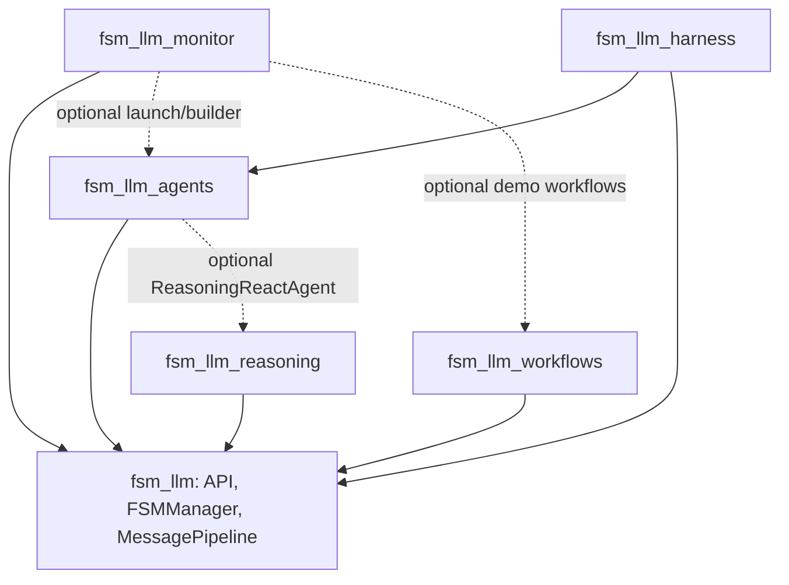

# FSM-LLM

Path: repository root
Purpose: Python framework (v0.8.0, Apache-2.0, Python 3.10-3.12) for stateful conversational AI: JSON-defined finite state machines driven by an LLM through a 2-pass pipeline, plus five extension packages.

## Scope

One distribution (`fsm-llm`, `pyproject.toml`) with six packages under `src/`, tests under `tests/`, 100 runnable examples under `examples/`, evaluation and bench tooling under `scripts/`, longer guides under `docs/`, release history in `CHANGELOG.md`, eval methodology in `EVALUATE.md`, planning artifacts under `plans/`. Always use the project virtualenv: `.venv/bin/python` or activate `.venv` first.

Core deps: loguru, litellm (>=1.82,<2.0, excluding the compromised 1.82.7 and 1.82.8), pydantic (>=2.0), python-dotenv.

## Architecture



2-pass flow in `fsm_llm`:

```
User Input -> [Pass 1: Data Extraction (LLM)] -> Context Update -> Classification Extractions
           -> Transition Evaluation (rules) -> If AMBIGUOUS: Classification -> State Transition
           -> [Pass 2: Response Generation (LLM)] -> User Output
```

Transitions are evaluated by JsonLogic rules in Python: one passing transition is DETERMINISTIC, several may be AMBIGUOUS (resolved by an LLM classifier), none is BLOCKED (stay). Pass 2 runs from the post-transition state and is skipped when `response_instructions` is empty.

## Packages

| Package | Role | Key entry points |
| --- | --- | --- |
| `src/fsm_llm` | Core framework | `API` (`from_file`, `from_definition`, `start_conversation`, `converse`, `converse_stream`, `push_fsm`/`pop_fsm`, `save_session`/`restore_session`), `FSMManager`, `MessagePipeline`, `HandlerTiming` (8 points), `create_handler`, `Classifier`, `LiteLLMInterface`, `WorkingMemory`, `FileSessionStore` |
| `src/fsm_llm_reasoning` | 9 reasoning strategies as FSMs under an orchestrator with validation and retries | `ReasoningEngine.solve_problem(problem) -> (solution, trace_info)` |
| `src/fsm_llm_workflows` | Async in-memory workflow engine, 11 step types, Python DSL | `WorkflowEngine`, `create_workflow`, `auto_step`, ... |
| `src/fsm_llm_agents` | 18 agent patterns on generated FSMs, tools, HITL, memory, swarm/graph, MCP, A2A, SOPs, meta-builder | `create_agent`, `ReactAgent`, `ToolRegistry`, `@tool`, `MetaBuilderAgent` |
| `src/fsm_llm_monitor` | FastAPI dashboard (REST + WebSocket + vanilla-JS SPA), OTEL exporter | `fsm-llm-monitor`, `configure`, `InstanceManager`, `OTELExporter` |
| `src/fsm_llm_harness` | Iterative-planner protocol as a 6-state FSM with filesystem-derived gates and a 2-attempt leash | `fsm-llm-harness`, `HarnessAgent`, `pre_step_gate`, `audit` |

Extras: `reasoning`, `agents`, `workflows` (no deps), `harness` (pulls `fsm-llm[agents]`), `monitor` (fastapi, uvicorn, jinja2), `mcp` (mcp>=1.0.0), `otel` (opentelemetry-api/sdk>=1.20.0), `a2a` (httpx>=0.24.0), `all`, `dev`.

Harness status in brief: gates are JsonLogic terms over values counted from disk, so a model's claim cannot open one. On `ollama_chat/qwen3.5:4b`, single-state bars are MET (EXECUTE write-target selection 2/40 -> 40/40 after a structural fix; strict content-hash 4/5; findings 5/5), but the end-to-end L6 floor (reach EXECUTE, verified write, honest halt, 3/3 runs) is NOT MET across nine committed blocks; B8 had 2/3 runs clear it with zero slugless stalls. The current wall is a driver-side plumbing gap: nothing writes `verification.md` after PLAN. The harness is not production-ready. Bench blocks live under `scripts/bench_data/` (pre-registered fixed n, append-only jsonl, Wilson CI, Fisher exact, per-row seeds).

## Quick Commands

```bash
make test           # pytest -v (6,725 tests)
make lint           # ruff check src/ tests/
make format         # ruff format src/ tests/
make type-check     # mypy across all 6 packages
make build          # python -m build (wheel + sdist)
make clean          # remove build artifacts and caches
make coverage       # pytest with coverage report
make install-dev    # pip install -c constraints.txt -e ".[dev,workflows,reasoning,agents,monitor,harness]" + pre-commit install
make audit          # audit site-packages for suspicious .pth files

fsm-llm --fsm <path.json>            # Run FSM interactively (needs env LLM_MODEL)
fsm-llm-visualize --fsm <path.json>  # ASCII visualization
fsm-llm-validate --fsm <path.json>   # Validate FSM definition
fsm-llm-monitor                      # Web dashboard at http://127.0.0.1:8420
fsm-llm-meta                         # Interactive artifact builder (fsm_llm_agents.meta_cli)
fsm-llm-harness <new|resume|status|validate|close>  # Iterative-planner protocol harness
python -m fsm_llm_reasoning "problem" [--type T]    # Reasoning CLI (no console script)
```

## FSM Definition Format (JSON, v4.1)

```json
{
  "name": "MyBot",
  "description": "What this FSM does",
  "initial_state": "start",
  "persona": "A friendly assistant",
  "states": {
    "start": {
      "id": "start",
      "description": "Brief state description",
      "purpose": "What should be accomplished",
      "extraction_instructions": "What data to extract",
      "response_instructions": "How to respond",
      "required_context_keys": ["key1"],
      "classification_extractions": [
        {
          "field_name": "user_intent",
          "intents": [
            {"name": "buy", "description": "User wants to purchase"},
            {"name": "browse", "description": "User is just looking"}
          ],
          "fallback_intent": "browse",
          "confidence_threshold": 0.7
        }
      ],
      "transitions": [
        {
          "target_state": "next",
          "description": "When this transition should fire",
          "priority": 100,
          "conditions": [
            {
              "description": "Human-readable condition",
              "requires_context_keys": ["key1"],
              "logic": {"==": [{"var": "key1"}, "expected_value"]}
            }
          ]
        }
      ]
    },
    "next": {
      "id": "next",
      "description": "Terminal state",
      "purpose": "Wrap up the conversation",
      "response_instructions": "Say goodbye"
    }
  }
}
```

Rules: `required_context_keys` only tells Pass 1 what to extract, it never blocks a transition; gate with a condition (`requires_context_keys` + `logic`). `intents`/`fallback_intent` sit directly on the `classification_extractions` entry (no nested `schema`), at least two intents, and `fallback_intent` must be one of them. A state without transitions is terminal. Among passing transitions the unique lowest `priority` value wins outright (gap and condition count do not matter); only a tie at the lowest priority is AMBIGUOUS and goes to the classifier, with just the tied transitions as candidates. The definition must have a reachable terminal state and no orphaned states.

## Invariants and constraints

- Internal context keys: prefixes `_`, `system_`, `internal_`, `__`, matched only through `fsm_llm.constants.has_internal_prefix` (case-insensitive). Never re-inline `startswith("_")` anywhere in the repo.
- Secret-looking context entries are decided in one place, `constants.is_forbidden_context_entry` (never re-inline a check): name patterns in `COMPILED_FORBIDDEN_CONTEXT_PATTERNS`, whole-segment credential names in `_CREDENTIAL_NAME_RE` (`pin`, `pass`, `otp`, `cvv`/`cvc`, `jwt`, `cookie`, ..., digit suffixes and camelCase/acronym forms included; a policy-suffix name such as `pin_attempts` keeps a dict (its keys are filtered on their own), a count below 1,000 or any duration only under a count/duration suffix, and a string only from a closed set of state words or an ISO date; a `bool` value always keeps), and a value-shape layer for `*_key`/`*_token`. Matching entries are filtered out of prompts.
- Context filters share `MAX_CONTEXT_FILTER_DEPTH = 16` (fail closed: deeper values are dropped) and drop a container already on the active recursion path (a cycle). Only the prompt filter has a node budget (`MAX_CONTEXT_FILTER_NODES = 100_000`, truncates the prompt view); the data walker behind `get_data`, `save_session` and the extracted-data commit (`utilities.filter_context_tree`) never truncates: every container that cannot reach a cycle is memoised (even when the context holds a cycle elsewhere), and only a heavily aliased cycle that unfolds too far raises `ContextFilterWorkError`.
- Library logging is off until `setup_logging()` / `enable_debug_logging()` (`logger.disable("fsm_llm")` at import).
- One turn per conversation at a time: a concurrent or re-entrant `converse` on the same conversation raises `FSMError`.
- Non-obvious code carries `# DECISION plan-<full-plan-id>/D-NNN` anchors stating what NOT to do; read them before editing nearby and do not undo what they forbid.
- Do NOT modify files under `examples/` unless explicitly asked: they are evaluation baselines for `scripts/eval.py`.

## Code Conventions

- ruff (target py310, line length 88; ignored E402, E501, RUF013, RUF001, RUF022). mypy with `disallow_untyped_defs=false` and the pydantic plugin.
- Pydantic v2 `BaseModel` with `model_validator` for complex validation. Logging via `from fsm_llm.logging import logger`.
- Exports: one static `__all__` list per package `__init__.py`; no dynamic extend/append (conditional `ReasoningReactAgent` in agents is the one guarded exception).
- Constants in each package's `constants.py`; reasoning and agents use `ContextKeys` classes of string constants.
- Exceptions: core `FSMError` -> `ConversationBusyError`, `StateNotFoundError`, `InvalidTransitionError`, `LLMResponseError`, `TransitionEvaluationError`, `ClassificationError` -> (`SchemaValidationError`, `ClassificationResponseError`); `HandlerSystemError(FSMError)` -> `HandlerExecutionError`. Reasoning `ReasoningEngineError` -> `ReasoningExecutionError`, `ReasoningClassificationError`. Workflows `WorkflowError` -> `WorkflowDefinitionError`, `WorkflowStepError`, `WorkflowInstanceError`, `WorkflowTimeoutError`, `WorkflowValidationError`, `WorkflowStateError`, `WorkflowEventError`, `WorkflowResourceError`. Agents `AgentError` -> `ToolExecutionError`, `ToolNotFoundError`, `ToolValidationError`, `BudgetExhaustedError`, `ApprovalDeniedError`, `AgentTimeoutError`, `EvaluationError`, `DecompositionError`, `MetaBuilderError` -> (`BuilderError`, `MetaValidationError`, `OutputError`). Harness `HarnessError(FSMError)` -> `HarnessArtifactError`, `HarnessOwnershipError`, `HarnessReentrancyError`, `HarnessConfinementError`. Monitor `MonitorError(Exception)` -> `MonitorInitializationError`, `MetricCollectionError`, `MonitorConnectionError` (not an `FSMError`).

## Testing

```bash
pytest                                 # Run all tests (6,725 collected)
pytest tests/test_fsm_llm/            # Core package tests (2,565 tests)
pytest tests/test_fsm_llm_reasoning/  # Reasoning tests (115 tests)
pytest tests/test_fsm_llm_workflows/  # Workflows tests (156 tests)
pytest tests/test_fsm_llm_agents/     # Agents tests (1,004 tests)
pytest tests/test_fsm_llm_monitor/    # Monitor tests (299 tests)
pytest tests/test_fsm_llm_meta/       # Meta tests (213 tests)
pytest tests/test_fsm_llm_harness/    # Harness tests (1,981 tests)
pytest tests/test_fsm_llm_regression/ # Regression tests (277 tests)
pytest tests/test_examples/           # Example validation tests (43 tests)
# The 9 suites above sum to 6,653. The remaining 72 are three root-level files:
#   tests/test_integration_ollama.py (12), tests/test_packaging.py (26)
#   and tests/test_harness_bench.py (34)
pytest -m "not slow"                  # Skip slow tests
pytest -m integration                 # Integration tests only
```

Counts are `pytest --collect-only -q` after the 2026-09-21 core audit fixes (unreleased). `tests/test_packaging.py` (slow class) re-measures the collection and pins every count literal above, the `make test` line, the README's `make test` line, and the harness package doc's count tokens; update them together when tests are added. It also derives the package list from `src/*/__init__.py` and asserts every package appears in all 14 build/CI slots (pyproject, Makefile, tox, CI workflow). `tests/test_fsm_llm/test_docs_snippets.py` loads every full FSM JSON snippet in this file, `README.md`, `docs/quickstart.md`, and `src/fsm_llm/README.md`.

- Conventions: `test_<module>.py` and `test_<module>_elaborate.py`; classes `Test<Feature>`; helpers prefixed `_` (`_make_state()`, `_minimal_fsm_dict()`).
- Markers: `slow`, `integration`, `examples`, `real_llm`. Env: `SKIP_SLOW_TESTS`, `TEST_REAL_LLM`, `TEST_LLM_MODEL`, `OPENAI_API_KEY`, `FSM_LLM_HARNESS_LIVE`.
- Mocks in `tests/conftest.py`: `Mock(spec=LLMInterface)` and `MockLLM2Interface` (2-pass); fixtures `sample_fsm_definition` (v3.0), `sample_fsm_definition_v2` (v4.1), `mock_llm_interface`, `mock_llm2_interface`.
- Workflows tests auto-skip without the extension. Harness live tests are double-gated (`FSM_LLM_HARNESS_LIVE=1` checked first, then a reachable Ollama). Core live tests (`test_live_classification_memory.py`) and `tests/test_integration_ollama.py` self-skip without Ollama.
- Known open issue F-LIVE-02: an agents-package post-tool stall on live small models; the live suite reports it as its one remaining failure.

## Evaluation

`scripts/eval.py` runs all examples in parallel and produces scorecards. Last baseline: 95.3% health score (N=3 median, 101 examples) on `ollama_chat/qwen3.5:4b`, Run 006, commit `2df048f`. This baseline is STALE: later remediation changed prompt content in `prompts.py`, `context.py`, and `constants.py`, and the fast gate mocks the LLM, so re-run before trusting it. The heuristic overstates by about 15 points; pair it with log inspection. About 5 agent score-1s per run are non-deterministic `--workers 4` timeouts. Harness capability benches run via `scripts/harness_bench.py`.

Examples (100 across 8 categories): basic 14, intermediate 3, advanced 17, classification 4, reasoning 1, workflows 8, agents 48, meta 5. All support OpenAI with Ollama fallback: `python examples/<category>/<name>/run.py`.

## Pre-commit and CI

- Pre-commit: trailing whitespace, EOF fixer, YAML/JSON validation, ruff with `--fix`, pytest on pre-push.
- CI: GitHub Actions (`.github/workflows/python-package.yml`) on push/PR to main, Python 3.10, 3.11, 3.12. Tox: multi-version tests, lint, mypy.
- Version lives in `src/fsm_llm/__version__.py`; the other packages import it.

## Working here

- Changing core behaviour: read the `# DECISION` anchors in `src/fsm_llm/pipeline.py`, `fsm.py`, `api.py` first; they record rollback, locking, and provenance contracts pinned by tests.
- Adding a package: it must appear in every build/CI slot or `tests/test_packaging.py` fails; add a per-suite line to the Testing block above.
- Adding tests: re-measure with `pytest --collect-only -q | tail -1` and update every pinned count in this file, `README.md`, and `src/fsm_llm_harness/CLAUDE.md` (harness only).
