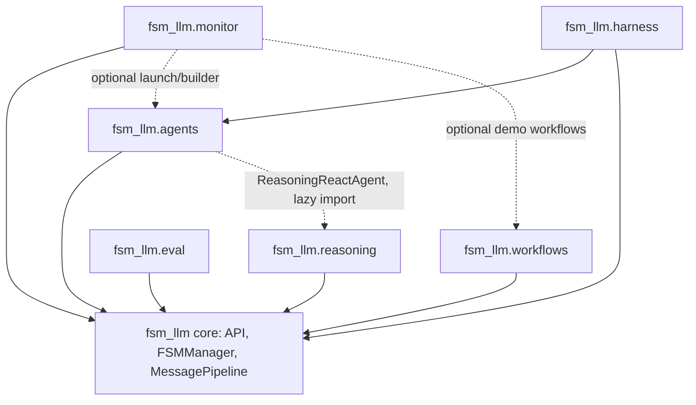

# FSM-LLM

Path: repository root (`.`)
Purpose: Python framework (v0.11.0, Apache-2.0, Python 3.10-3.12) for stateful conversational AI: JSON-defined finite state machines (FSMs) driven by an LLM through a 2-pass pipeline, shipped as one package `fsm_llm` with six subpackages.

## Scope

One distribution (`fsm-llm`, `pyproject.toml`, setuptools, src layout). Always use the project virtualenv: `.venv/bin/python`, or activate `.venv` first.

- In: `src/fsm_llm/` (all source), `tests/`, `examples/` (100 runnable examples), `docs/` (guides), `scripts/` (supply-chain audit, harness bench), `evaluation/` (datasets and eval runs), `.github/workflows/`, `images/`, root build and policy files.
- Out: `build/`, `dist/`, `logs/`, `src/fsm_llm.egg-info/` (generated, removed by `make clean`). `plans/` is gitignored except `plans/ANCHORS.md` (append-only anchor manifest; never edit its lines).

## Architecture


```mermaid
flowchart TD
    core[fsm_llm core: API, FSMManager, MessagePipeline]
    reasoning[fsm_llm.reasoning] --> core
    workflows[fsm_llm.workflows] --> core
    agents[fsm_llm.agents] --> core
    agents -. ReasoningReactAgent, lazy import .-> reasoning
    monitor[fsm_llm.monitor] --> core
    monitor -. optional launch/builder .-> agents
    monitor -. optional demo workflows .-> workflows
    harness[fsm_llm.harness] --> agents
    harness --> core
    eval[fsm_llm.eval] --> core
```

2-pass flow per `converse` (`src/fsm_llm/pipeline.py`): Pass 1 extracts data (LLM), context update, classification extractions, rule-based transition evaluation (an LLM classifier only on AMBIGUOUS), state transition, then Pass 2 writes the reply (LLM) from the post-transition state. Pass 2 is skipped when `response_instructions` is empty: a silent state makes no LLM call, returns `""` and adds nothing to history. Transition outcomes: one winner is DETERMINISTIC, a tie at the lowest priority is AMBIGUOUS, none passing is BLOCKED (stay).

Message-free step: `API.advance(conv_id)` runs the same turn with no user message (nothing added to history for a user, no-message prompt variants, the LLM layer sends a neutral user turn) and returns a frozen `AdvanceResult`; `run_until_terminal(conv_id, *, max_steps, max_seconds=None, before_step=None)` loops it until a terminal state and raises `RunBudgetExceededError` on a spent budget. Agents, the harness, workflow agent steps and the reasoning engine run on these loops; they never send a synthetic message. When the top of the stack is an ended pushed FSM, the loop calls `before_step` once (not a step, no budget check) so the hook can pop it and the run continues on the parent.

One LLM layer (`src/fsm_llm/llm.py`, the only module that imports litellm): `LLMInterface.complete(CompletionRequest) -> CompletionResponse` is the one primitive for tool calling, plain and structured completion; `LiteLLMInterface` builds every request in one builder and sends it through one send path, counting each call (`usage()`); `LiteLLMEmbedder` makes embeddings. A state with the optional `completion` field makes its Pass 1 one `complete` call (tools or a structured turn) over a consumer-owned transcript and writes `{kind, text, calls}` to its result key; core runs no tool. `native_fc` and the meta-builder are FSMs built on it.

`import fsm_llm` loads only the core; `fsm_llm/__init__.py` never imports a subpackage. Import one by name (`from fsm_llm.agents import create_agent`). Every subpackage ships in every install; an extra only adds third-party deps.

## Key files

| Path | Role | Notes |
| --- | --- | --- |
| `src/fsm_llm/api.py`, `fsm.py`, `pipeline.py` | `API`, `FSMManager` (per-conversation locks, LRU definition cache), `MessagePipeline` | Read `# DECISION` anchors first |
| `src/fsm_llm/definitions.py`, `transition_evaluator.py`, `expressions.py` | Pydantic FSM models, core exceptions, JsonLogic evaluation | No LLM in transitions |
| `src/fsm_llm/llm.py`, `classification.py` | `LLMInterface`, `LiteLLMInterface` (`complete`, `usage`), `LiteLLMEmbedder`, `tool_exchange`; `Classifier` | Only litellm import; the classifier uses the conversation's interface |
| `src/fsm_llm/security.py`, `constants.py` | `has_internal_prefix`, `is_forbidden_context_entry`, defaults | Single source for key filtering |
| `src/fsm_llm/reasoning/` | 9 strategies as stacked FSMs pushed and popped inside one message-free core run, validation with up to 3 retries | `ReasoningEngine.solve_problem(problem) -> (solution, trace_info)` |
| `src/fsm_llm/workflows/` | Async in-memory engine, 11 step types, DSL | `WorkflowEngine`, `create_workflow`, `auto_step`, `condition_step` |
| `src/fsm_llm/agents/` | 18 agent patterns (native_fc and the meta-builder are FSMs on core too), tools with annotations and enforced timeouts, HITL, memory, swarm/graph, MCP, A2A, SOPs | `create_agent`, `ReactAgent`, `ToolRegistry`, `@tool`, `MetaBuilderAgent` |
| `src/fsm_llm/monitor/` | FastAPI dashboard (REST, WebSocket, vanilla-JS SPA), OTEL exporter | `configure`, `InstanceManager`, `OTELExporter` |
| `src/fsm_llm/harness/` | Experimental iterative planner: 6-state FSM, gates counted from disk, 2-attempt leash | `HarnessAgent`, `pre_step_gate`, `audit` |
| `src/fsm_llm/eval/` | Examples scorer (0-4) and conversation cases (N trials, Wilson CIs) | `EvalConfig`, `run_examples`, `load_cases`, `run_cases`, `run_dataset`, `wilson_ci` |
| `tests/conftest.py` | `MockLLM2Interface`, `configure_mock_extract_field`, fixtures, `ollama_available()` | Default runs make no network or LLM call |
| `tests/test_packaging.py` | Pins package wiring and every test count in this file and `README.md` | See Working here |
| `scripts/audit_pth.py` | Flags known malicious and code-bearing `.pth` files in site-packages; exit 1 on issues | `make audit`, CI |
| `scripts/harness_bench.py`, `agents_bench.py` | Pre-registered harness and agent benches: `register`, `run`, `report` (`harness_bench` also `probe-seed`) | Rows in tracked `scripts/bench_data/` |
| `evaluation/datasets/` | `simple_greeting_cases.json`, `name_capture_fsm.json` | Samples for `fsm-llm-eval run` |
| `examples/<category>/<name>/` | `run.py` plus FSM JSON; 8 categories | Evaluation baselines |
| `pyproject.toml`, `Makefile`, `tox.ini`, `constraints.txt`, `MANIFEST.in`, `.pre-commit-config.yaml` | Build, tasks, envs, exact pins, sdist, hooks | All checked by `test_packaging.py` |
| `CHANGELOG.md`, `EVALUATE.md`, `CONTRIBUTING.md`, `SECURITY.md` | Release history, eval method and run log, contributor rules, security policy | |

## Public interface

Core: `API` (`from_file`, `from_definition`, `start_conversation`, `converse`, `converse_stream`, `advance`, `advance_stream`, `run_until_terminal`, `run_until_terminal_stream`, `get_data`, `push_fsm`/`pop_fsm`, `save_session`/`restore_session`), `AdvanceResult`, `FSMManager`, `MessagePipeline`, `HandlerTiming` (8 points), `create_handler`, `clear_keys_on_entry`, `typed_field_extraction`, `Classifier` (`llm=` takes an interface), `LiteLLMInterface` (`complete`, `usage`, `reset_usage`), `CompletionRequest`, `CompletionResponse`, `ModelToolCall`, `LLMUsage`, `LiteLLMEmbedder`, `tool_exchange`, `CompletionStateConfig`, `WorkingMemory`, `FileSessionStore`, graph export `build_fsm_graph`, `to_mermaid`, `to_dot`.

Model resolution: `model=` argument, then env `LLM_MODEL`, then `DEFAULT_LLM_MODEL` (`ollama_chat/qwen3.5:4b`). `.env.example` lists `OPENAI_API_KEY`, `LLM_MODEL`, `LLM_TEMPERATURE`, `LLM_MAX_TOKENS`.

```bash
fsm-llm --fsm <path.json>            # Run FSM interactively (needs env LLM_MODEL)
fsm-llm-visualize --fsm <path.json> [--format ascii|mermaid|dot]  # Diagram
fsm-llm-validate --fsm <path.json>   # Validate FSM definition
fsm-llm-monitor                      # Web dashboard at http://127.0.0.1:8420
fsm-llm-meta                         # Interactive artifact builder (fsm_llm.agents.meta_cli)
fsm-llm-harness <new|resume|status|validate|close>  # Iterative-planner protocol harness
python -m fsm_llm.reasoning "problem" [--type T]    # Reasoning CLI (no console script)
fsm-llm-eval examples [--category C] [--fail-under PCT]  # Score every example 0-4
fsm-llm-eval run <dataset.json|.jsonl> [--trials N]     # Scripted conversation evals
.venv/bin/python scripts/harness_bench.py report <bench-id>  # Recount a bench from rows
```

CLI exit codes: 0 ok, 1 failure, 130 Ctrl-C; a usage error exits 2 (argparse) except in `fsm-llm-eval` and `fsm-llm-harness`, which exit 1 for it. `fsm-llm-eval` exits 2 only below `--fail-under PCT`; `fsm-llm-harness` exits 2 on a hard `pre_step_gate` failure. `fsm-llm-eval examples` writes `scorecard.md`, `results.json`, `logs/` to a new `evaluation/<stamp>_<hash>_<model>[_N]/`; settings precedence is defaults < dataset `config` < `--config FILE` < flags.

## Data shapes

FSM definition (JSON, v4.1):

```json
{
  "name": "MyBot",
  "description": "What this FSM does",
  "initial_state": "start",
  "persona": "A friendly assistant",
  "states": {
    "start": {
      "id": "start",
      "description": "Brief state description",
      "purpose": "What should be accomplished",
      "extraction_instructions": "What data to extract",
      "response_instructions": "How to respond",
      "required_context_keys": ["key1"],
      "classification_extractions": [
        {"field_name": "user_intent",
         "intents": [{"name": "buy", "description": "User wants to purchase"},
                     {"name": "browse", "description": "User is just looking"}],
         "fallback_intent": "browse", "confidence_threshold": 0.7}
      ],
      "transitions": [
        {"target_state": "next", "description": "When this transition should fire", "priority": 100,
         "conditions": [{"description": "Human-readable condition",
                         "requires_context_keys": ["key1"],
                         "logic": {"==": [{"var": "key1"}, "expected_value"]}}]}
      ]
    },
    "next": {"id": "next", "description": "Terminal state", "purpose": "Wrap up the conversation",
             "response_instructions": "Say goodbye"}
  }
}
```

- `required_context_keys` only tells Pass 1 what to extract; it never blocks a transition. Gate with a condition (`requires_context_keys` + `logic`).
- `intents`/`fallback_intent` sit directly on the `classification_extractions` entry (no nested `schema`), at least two intents, `fallback_intent` one of them.
- A state without transitions is terminal. `state.id` must equal its key. Load needs a reachable terminal state and no orphaned states.
- Among passing transitions the unique lowest `priority` wins outright; only a tie at the lowest priority is AMBIGUOUS, with just the tied transitions as classifier candidates.
- Optional `completion` state field (v4.1 unchanged): `{"tools": [OpenAI function schemas]` or `"response_format_key": "_<key>"` (exactly one), `"tool_choice", "instructions", "messages_key": "_completion_messages", "result_key": "completion_result"}`. Pass 1 is one `complete` call over `[system(instructions)] + context[messages_key]`; the result `{kind: calls|final|malformed, text, calls}` goes to `result_key` (handler-only, skip-if-set); transitions read `<result_key>.kind`. Such a state declares no other extraction and is not terminal.

## Invariants and constraints

- Internal context keys (prefixes `_`, `system_`, `internal_`, `__`) are matched only through `fsm_llm.constants.has_internal_prefix` (case-insensitive). Never re-inline `startswith("_")`.
- Secret-looking context entries are decided only by `constants.is_forbidden_context_entry(key, value)` (name patterns, whole-segment credential names, policy-suffix exceptions, value-shape layers for `*_key`/`*_token`). Matching entries are kept out of prompts. Never re-inline a check.
- Context filters share `MAX_CONTEXT_FILTER_DEPTH = 16` (fail closed) and drop cycles. Only the prompt filter truncates (`MAX_CONTEXT_FILTER_NODES = 100_000`); `utilities.filter_context_tree` never truncates and raises `ContextFilterWorkError` on a pathological cycle.
- Library logging is off until `setup_logging()` / `enable_debug_logging()`: one `logger.disable("fsm_llm")` at import covers every subpackage; never add a per-subpackage disable.
- One turn per conversation at a time: a concurrent or re-entrant `converse` raises `FSMError`.
- One LLM layer: litellm is imported only in `src/fsm_llm/llm.py` (`grep -rnE "litellm\.(a?completion|a?embedding)|import litellm|from litellm" src/fsm_llm` hits only it). Never add a second request builder, send path or provider call outside an `LLMInterface`/`LiteLLMEmbedder`.
- The classifier (AMBIGUOUS ties, `classification_extractions`) calls the conversation's own `llm_interface`; only an entry naming a different `model` gets a private interface, with no inherited credentials. `API(llm_interface=...)` refuses every other LLM setting beside it (`ValueError`).
- Completion-state transcripts are consumer-owned context lists, never `Conversation.exchanges`; an unpaired transcript raises `LLMResponseError` before anything is sent.
- `# DECISION plan-<full-plan-id>/D-NNN` anchors state what NOT to do. Read them before editing nearby. `[STALE]`: plan dir retired, rule may still bind. `[SUPERSEDED BY D-nnn]`: follow the newer one.
- Agents HITL is a security boundary in `ReactAgent`, `ReflexionAgent`, `ReasoningReactAgent` when an approval policy is set, or a callback with `requires_approval=True` tools (the flag is then the policy): a gated tool runs only with the driver-only grant `_approval_granted` (`ContextKeys.DRIVER_APPROVAL`) bound to that exact call. Caller `initial_context` can never set that grant, run-output keys (`RUN_OUTPUT_KEYS`) or the pattern's own outputs (`_run_output_keys`). A `requires_approval` tool with no callback and no policy raises `AgentError`; ParallelReact, REWOO, native_fc, PlanExecute have no HITL and refuse registries holding one.
- Agents `AgentResult.success` means the run reached its goal; forced stops ship their answer with `success=False` and a `stop_reason`. A run closed from outside ends `ReactAgent.run_stream` without an error, and nothing flags a truncated meta-builder artifact; both are deferred work.
- Do NOT modify `examples/` unless explicitly asked: baselines for `fsm-llm-eval examples`, loaded by `tests/test_examples/`.
- `scripts/bench_data/` is tracked on purpose. Blocks are pre-registered, run once at fixed n, never edited or re-run.
- Harness status: committed block `scripts/bench_data/l6-e2e/B8/GRADING.md` (`ollama_chat/qwen3.5:4b`, n=3) has 2/3 floor rows; the 3/3 bar is NOT MET. `verification.md` stays empty after PLAN. Not production-ready.

## Dependencies

- Core: loguru>=0.7.3, litellm>=1.83.0,<2.0 (compromised 1.82.7/1.82.8 are below the floor; `constraints.txt` pins 1.102.1), pydantic>=2.0, python-dotenv>=1.0.0, tenacity>=8.0 (unimported, needed by litellm's sync retry path; do not remove).
- Extras: `reasoning`, `agents`, `workflows`, `eval` (no deps), `harness` (pulls `fsm-llm[agents]`), `monitor` (fastapi, uvicorn, jinja2), `mcp` (mcp>=1.0.0), `otel` (opentelemetry-api/sdk>=1.20.0), `a2a` (httpx>=0.24.0), `all`, `dev`.
- `constraints.txt` pins litellm, pytest, pytest-asyncio, pytest-cov, pytest-mock, ruff, mypy, mcp exactly.

## Failure modes

- Core `FSMError` -> `ConversationBusyError`, `FSMDefinitionNotFoundError` (also `ValueError`), `BuildError` (also `ValueError`; every builder's `build()`), `StateNotFoundError`, `InvalidTransitionError`, `LLMResponseError`, `TransitionEvaluationError`, `ClassificationError` -> `ClassificationResponseError`, `RunBudgetExceededError` (a bounded run spent `max_steps` or `max_seconds`); `HandlerSystemError(FSMError)` -> `HandlerExecutionError`.
- Subpackage roots subclass `FSMError`: `ReasoningEngineError`, `WorkflowError`, `AgentError` (incl. `MetaBuilderError`), `HarnessError`, `EvalError` (`EvalConfigError`, `EvalDatasetError`). `MonitorError` subclasses `Exception` only.
- `LLMInterface.complete` raises `LLMResponseError` for every failure (a malformed tool call is `kind="malformed"`, not an error); a completion-state outage rolls the turn back. The classifier soft-fails (stays) only on `ClassificationError`. A failed reasoning solve, a spent 170-step budget included, raises `ReasoningExecutionError` with `details["partial_context"]`; `native_fc` and the meta-builder wrap provider outages as `AgentError`/`BuilderError` chained from `LLMResponseError`.
- `test_packaging.py` fails on count drift or a subpackage missing from a build/CI slot. A clone from before the 2026-09-29 restructure must delete its old `src/fsm_llm_<sub>/` dirs by hand (`make clean` no longer does), then `pip install -e .`.
- Eval baselines: Run 006 in `EVALUATE.md` is 95.3% (N=3 median, 101 examples, `ollama_chat/qwen3.5:4b`, commit `2df048f`); Run 007 (N=1, 2026-10-01) is 96.0% on the core step driver vs 96.8% for `d4b1626` run the same day; a later 9b run was 80.9% (N=1, `CHANGELOG.md`). Runs from before and after the 2026-09-29 restructure are not comparable. The heuristic overstates; the mocked test suite says nothing about model quality.

## Working here

```bash
make test           # pytest -v (9,986 tests)
make lint           # ruff check src/ tests/
make format         # ruff format src/ tests/
make type-check     # mypy src/fsm_llm/ --ignore-missing-imports
make build          # python -m build (wheel + sdist)
make clean          # remove build artifacts, caches, logs/
make coverage       # pytest with --cov=fsm_llm
make install-dev    # pip install -c constraints.txt -e ".[dev,workflows,reasoning,agents,monitor,harness,eval]" + pre-commit install
make audit          # python scripts/audit_pth.py
```

```bash
pytest                                 # Run all tests (9,986 collected)
pytest tests/test_fsm_llm/            # Core package tests (3,480 tests)
pytest tests/test_fsm_llm_reasoning/  # Reasoning tests (191 tests)
pytest tests/test_fsm_llm_workflows/  # Workflows tests (269 tests)
pytest tests/test_fsm_llm_agents/     # Agents tests (2,361 tests)
pytest tests/test_fsm_llm_monitor/    # Monitor tests (391 tests)
pytest tests/test_fsm_llm_meta/       # Meta-builder tests (437 tests)
pytest tests/test_fsm_llm_harness/    # Harness tests (2,028 tests)
pytest tests/test_fsm_llm_regression/ # Regression tests (264 tests)
pytest tests/test_examples/           # Example validation tests (67 tests)
pytest tests/test_fsm_llm_eval/       # Eval tests (261 tests)
# The 10 suites above sum to 9,749. The remaining 237 are four root-level files:
#   tests/test_integration_ollama.py (12), tests/test_packaging.py (34),
#   tests/test_harness_bench.py (59) and tests/test_agents_bench.py (132)
pytest -m "not slow"                  # Skip slow tests
```

- Pinned counts: slow class `TestDocumentedTestCountsMatchCollection` in `tests/test_packaging.py` checks the `make test` line, the `Run all tests` line, every per-suite line, the "suites above sum to" sentence and root-file list above, the README `Run full test suite` line, and `N tests` tokens in `src/fsm_llm/harness/CLAUDE.md`. Keep these line shapes. After adding tests re-measure with `.venv/bin/python -m pytest --collect-only -q | tail -1` and update all of them.
- `tests/test_fsm_llm/test_docs_snippets.py` loads every fenced `json`/`python` block containing `"initial_state"` in this file, `README.md`, `docs/quickstart.md`, `src/fsm_llm/README.md` and four `docs/` guides through `FSMDefinition`. Keep the FSM example above valid.
- Test conventions: `test_<module>.py`, `test_<module>_elaborate.py`, classes `Test<Feature>`, helpers prefixed `_`; suite folders keep pre-move names (`tests/test_fsm_llm_agents/` tests `fsm_llm.agents`). Run from the repo root. Markers `slow`, `integration`, `examples`, `real_llm`; harness live tests need `FSM_LLM_HARNESS_LIVE=1` and Ollama.
- Style: ruff (py310, line 88; ignores E402, E501, RUF013, RUF001, RUF022, UP038; keep UP038, the pre-commit ruff v0.9.10 still emits it), mypy with the pydantic plugin, Pydantic v2 `model_validator`, `from fsm_llm.logging import logger`, constants in each `constants.py`, one static `__all__` per `__init__.py`.
- Core changes: read anchors in `src/fsm_llm/pipeline.py`, `fsm.py`, `api.py`, `security.py`. A behaviour change needs a test that fails on the parent commit.
- New subpackage: under `src/fsm_llm/` only, add to `_EXPECTED_SUBPACKAGES` in `tests/test_packaging.py`, give it a same-named extra requested by `all`, `make install-dev`, tox and CI, add a per-suite line above, never import it from `fsm_llm/__init__.py`; runtime non-Python files go in `[tool.setuptools.package-data]`.
- CI (`.github/workflows/python-package.yml`): Python 3.10/3.11/3.12, installs with `mcp`, runs `audit_pth.py`, `ruff check`, `ruff format --check`, mypy, pytest `-m "not slow and not real_llm and not integration"` with one deselect. Pre-push hook runs `.venv/bin/python -m pytest tests/ -q --tb=no -x`.
- Release: version in `pyproject.toml` and `src/fsm_llm/__version__.py`; `"0.11.0"` also pinned in `tests/test_fsm_llm_monitor/test_app.py` and `tests/test_fsm_llm_regression/test_regression_review.py`. Add an `Unreleased` entry to `CHANGELOG.md` for every public removal or rename. Plan-step commits: `[plan-YYYY-MM-DD-<8 hex>/iter-N/step-M] <type>(<scope>): <summary>`.
- Monitor docs belong in `docs/api_reference.md`; do not create `docs/monitor.md`. Run `make audit` after installing new packages.
