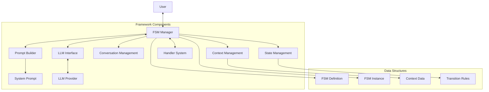
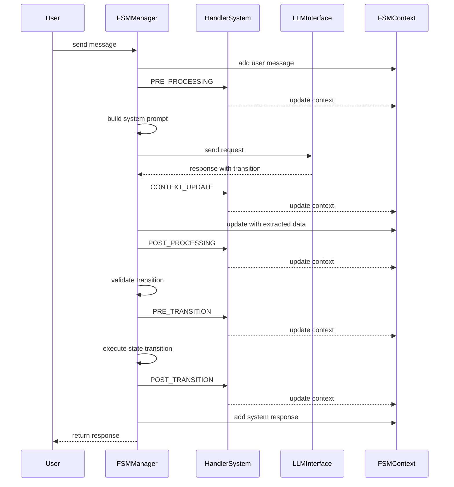
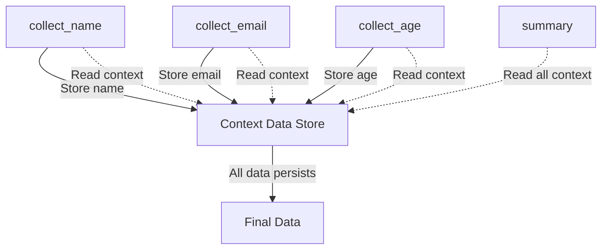
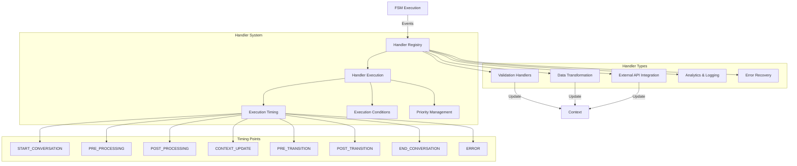
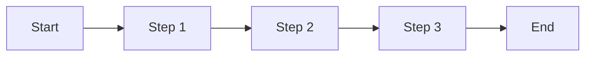
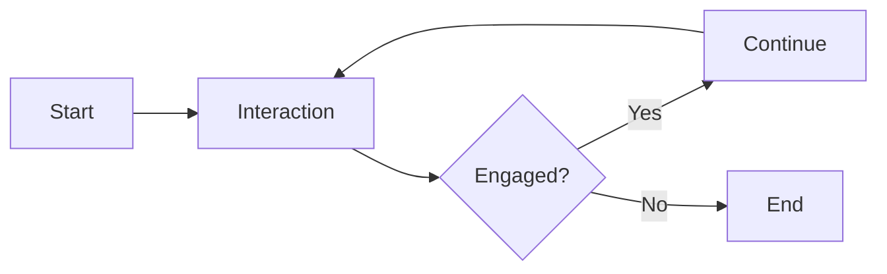
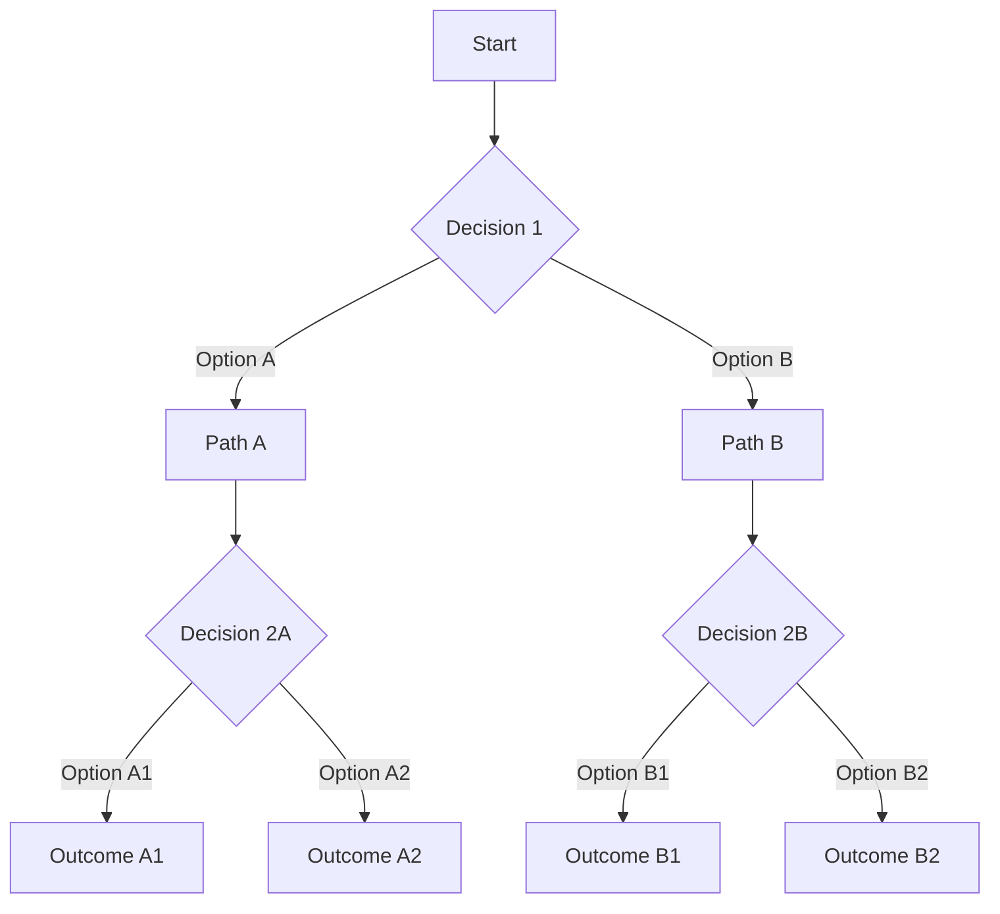

# LLM-FSM: Comprehensive Reference for LLMs

## Introduction

LLM-FSM is a framework that implements Finite State Machines (FSMs) for Large Language Models to address their inherent statelessness in conversational applications. The framework functions by maintaining explicit state representation in the form of JSON structures embedded in system prompts, enabling deterministic conversation flows while leveraging LLMs' natural language capabilities.

This reference is designed specifically for LLMs to understand the framework without having to process the entire source code.

## The Problem: Stateless LLMs in Structured Conversations

Large Language Models are inherently stateless - each interaction exists in isolation, with only the context provided in the prompt guiding the response. This creates significant challenges for building robust conversational applications:

- **State Fragility**: Without explicit tracking, conversations easily lose their place
- **Context Window Limitations**: As conversations grow, context windows fill up quickly
- **Transition Ambiguity**: Determining when to move to different conversation stages is difficult
- **Information Extraction Inconsistency**: Extracting structured data from free-form text is unreliable
- **Validation Challenges**: Ensuring required information is collected before proceeding is complex

Consider this scenario:

```
User: I'd like to book a flight
System: Where would you like to fly to?
User: I'm thinking maybe Hawaii
System: Great choice! And where will you be departing from?
User: Actually, I'd prefer Bali instead of Hawaii
```

Without explicit state tracking, the system might miss the change in destination or maintain inconsistent information.

## Core Concept: FSM + LLM Synthesis

The LLM-FSM framework bridges two fundamentally different computational paradigms:

1. **Deterministic Computation** (FSMs): Rule-based, predictable, and structured
2. **Probabilistic Computation** (LLMs): Adaptable, nuanced, and natural

This synthesis creates a hybrid system where:
- The FSM provides the "skeleton" that ensures logical conversation flow
- The LLM provides the "muscles and skin" that handle natural language understanding and production

The framework divides responsibilities:
- The **FSM** handles state management, transition rules, and overall conversation flow
- The **LLM** handles natural language understanding, information extraction, and response generation
- The **Python Framework** orchestrates the interaction between FSM and LLM

## System Architecture



## Core Data Structures

### FSMDefinition

```typescript
interface FSMDefinition {
  name: string;                   // FSM identifier
  description: string;            // Human-readable description
  initial_state: string;          // Starting state ID
  version: string;                // Schema version, default "3.0"
  persona?: string;               // Optional response persona
  states: {[id: string]: State};  // Map of all state definitions
}
```

### State

```typescript
interface State {
  id: string;                             // Unique state identifier
  description: string;                    // State description
  purpose: string;                        // Functional purpose of state
  transitions: Transition[];              // Available transitions
  required_context_keys?: string[];       // Required context keys
  instructions?: string;                  // LLM instructions for this state
  example_dialogue?: {[role: string]: string}[]; // Optional example conversations
}
```

### Transition

```typescript
interface Transition {
  target_state: string;            // Target state ID
  description: string;             // Transition description
  conditions?: TransitionCondition[]; // Optional conditions
  priority: number;                // Priority (lower = higher), default 100
}
```

### TransitionCondition

```typescript
interface TransitionCondition {
  description: string;               // Human-readable description
  requires_context_keys?: string[];  // Required context keys
  logic?: JsonLogicExpression;       // Optional logic expression
}
```

### FSMInstance

```typescript
interface FSMInstance {
  fsm_id: string;            // Reference to FSM definition
  current_state: string;     // Current state ID
  context: FSMContext;       // Runtime context
  persona?: string;          // Optional persona
}
```

### FSMContext

```typescript
interface FSMContext {
  data: {[key: string]: any};           // Context data
  conversation: Conversation;           // Conversation history
  metadata: {[key: string]: any};       // Additional metadata
}
```

### LLMRequest

```typescript
interface LLMRequest {
  system_prompt: string;       // System prompt
  user_message: string;        // User input
  context?: {[key: string]: any}; // Optional additional context
}
```

### LLMResponse

```typescript
interface LLMResponse {
  transition: StateTransition;  // State transition
  message: string;              // User-facing message
  reasoning?: string;           // Optional reasoning
}
```

### StateTransition

```typescript
interface StateTransition {
  target_state: string;           // Target state ID
  context_update: {[key: string]: any}; // Context updates
}
```

## Execution Flow

The message processing flow in the LLM-FSM framework follows a structured sequence:



### System Prompt Structure

The system prompt to the LLM is meticulously structured for optimal state management:

```
<task>
[Task description and overall instructions]
</task>

<fsm>
<current_state>[state_id]</current_state>
<current_state_description>[state_description]</current_state_description>
<current_purpose>[state_purpose]</current_purpose>

[Optional persona section if defined]
<persona>[persona_description]</persona>

[State-specific instructions]
<state_instructions>[instructions]</state_instructions>

[Information collection directives if required_context_keys present]
<information_to_collect>[required_keys]</information_to_collect>
<information_extraction_instructions>[extraction_instructions]</information_extraction_instructions>

[Available transitions with conditions and priorities]
<available_state_transitions>
[transitions_json]
</available_state_transitions>

[Transition rules]
<transition_rules>[rules]</transition_rules>

[Current context data]
<current_context>
[context_json]
</current_context>

[Conversation history if available]
<conversation_history>
[history_json]
</conversation_history>

[Response format instructions]
<response>
[response_instructions]
<response_format>
[response_json_schema]
</response_format>
</response>

[Important guidelines]
<instructions>[guidelines]</instructions>
</fsm>
```

### Expected LLM Response

The LLM must return a structured JSON response with the following format:

```json
{
  "transition": {
    "target_state": "next_state_id",
    "context_update": {
      "key1": "value1",
      "key2": "value2"
    }
  },
  "message": "The message to show to the user",
  "reasoning": "Optional explanation of why this transition was chosen"
}
```

## State Transitions and Context Flow

```mermaid
stateDiagram-v2
    [*] --> welcome
    welcome --> collect_name
    collect_name --> collect_email: when name provided
    collect_email --> collect_age: when email provided
    collect_age --> summary: when age provided
    summary --> end: when confirmed
    summary --> collect_name: if name correction needed
    summary --> collect_email: if email correction needed
    summary --> collect_age: if age correction needed
    end --> [*]
    
    note right of collect_name: Required context: name
    note right of collect_email: Required context: email
    note right of collect_age: Required context: age
    note right of summary: Presents all collected info
```

Context flows throughout the state machine, persisting across state transitions:



## JsonLogic Expression System

The framework includes a powerful JsonLogic implementation for complex conditional logic in state transitions:

### Expression Types

- **Comparison Operators**: `==`, `===`, `!=`, `!==`, `>`, `>=`, `<`, `<=`
- **Logical Operators**: `!` (NOT), `!!` (Boolean cast), `and`, `or`
- **Conditional Operator**: `if` (with if/else branches)
- **Access Operators**: `var` (retrieve context values with dot notation)
- **Validation Operators**: `missing`, `missing_some` (check required fields)
- **Membership Operators**: `in`, `contains`
- **Arithmetic Operators**: `+`, `-`, `*`, `/`, `%`
- **String Operators**: `cat` (concatenation)

### Expression Structure

JsonLogic expressions are JSON objects where the key is the operator and the value is an array of arguments:

```json
{
  "and": [
    {"==": [{"var": "customer.status"}, "vip"]},
    {">": [{"var": "customer.lifetime_value"}, 5000]}
  ]
}
```

## Handler System for Function Integration

The handler system provides a powerful way to integrate external functions:



## Conversation Patterns

The LLM-FSM framework supports various conversation patterns:

### 1. Linear Flows
Step-by-step information collection:
- Personal information forms
- Survey administration
- Onboarding processes



### 2. Conversational Loops
Maintain ongoing engagement:
- Recommendation systems
- Coaching conversations
- Learning assistants



### 3. Decision Trees
Guide users through branching options:
- Product recommendations
- Troubleshooting flows
- Decision support



### 4. Hybrid Patterns
Combine multiple patterns:
- Customer support (identification → troubleshooting → resolution)
- Medical triage (symptoms → assessment → recommendations)
- Educational systems (assessment → instruction → testing)

## Example FSM Definition

Here's a complete example of a personal information collection system:

```json
{
  "name": "Personal Information Collection",
  "description": "A conversation flow to collect user's personal information with confirmation",
  "initial_state": "welcome",
  "version": "3.0",
  "states": {
    "welcome": {
      "id": "welcome",
      "description": "Initial welcome state",
      "purpose": "Welcome the user and explain the purpose of the conversation",
      "transitions": [
        {
          "target_state": "collect_name",
          "description": "Always transition to collecting name after welcome",
          "priority": 0
        }
      ],
      "instructions": "Warmly welcome the user and explain that you'll be collecting some basic information. Don't ask for any specific information yet."
    },
    "collect_name": {
      "id": "collect_name",
      "description": "Collect user's name",
      "purpose": "Ask for and record the user's full name",
      "required_context_keys": ["name"],
      "transitions": [
        {
          "target_state": "collect_email",
          "description": "Transition to email collection once name is obtained",
          "conditions": [
            {
              "description": "Name has been provided",
              "requires_context_keys": ["name"]
            }
          ],
          "priority": 0
        }
      ],
      "instructions": "Ask the user for their full name. If they only provide first name, ask for their full name. Extract and store their full name in the 'name' context variable."
    },
    "collect_email": {
      "id": "collect_email",
      "description": "Collect user's email address",
      "purpose": "Ask for and record the user's email address",
      "required_context_keys": ["email"],
      "transitions": [
        {
          "target_state": "collect_birthdate",
          "description": "Transition to birthdate collection once email is obtained",
          "conditions": [
            {
              "description": "Email has been provided",
              "requires_context_keys": ["email"]
            }
          ],
          "priority": 0
        }
      ],
      "instructions": "Ask the user for their email address. Verify that it looks like a valid email (contains @ and a domain). Store it in the 'email' context variable."
    },
    "collect_birthdate": {
      "id": "collect_birthdate",
      "description": "Collect user's birthdate",
      "purpose": "Ask for and record the user's date of birth",
      "required_context_keys": ["birthdate"],
      "transitions": [
        {
          "target_state": "summary",
          "description": "Transition to summary once birthdate is obtained",
          "conditions": [
            {
              "description": "Birthdate has been provided",
              "requires_context_keys": ["birthdate"]
            }
          ],
          "priority": 0
        }
      ],
      "instructions": "Ask the user for their birthdate. Accept various date formats (e.g., MM/DD/YYYY, Month Day Year). Store the date in the 'birthdate' context variable."
    },
    "summary": {
      "id": "summary",
      "description": "Summarize collected information and wait for confirmation",
      "purpose": "Provide a summary of all information collected and ask for confirmation",
      "required_context_keys": ["confirmed"],
      "transitions": [
        {
          "target_state": "end",
          "description": "Transition to end state after user confirms information is correct",
          "conditions": [
            {
              "description": "User has confirmed information is correct",
              "requires_context_keys": ["confirmed"]
            }
          ],
          "priority": 1
        },
        {
          "target_state": "correction",
          "description": "Transition to correction if user indicates information is incorrect",
          "priority": 0
        }
      ],
      "instructions": "Thank the user for providing their information. Summarize all collected information (name, email, and birthdate), and explicitly ask the user to confirm if the information is correct. Look for affirmative responses like 'yes', 'correct', 'looks good', etc., and store a 'confirmed' key with value 'true' if they confirm."
    },
    "correction": {
      "id": "correction",
      "description": "Handle corrections to collected information",
      "purpose": "Allow the user to specify what information needs to be corrected",
      "transitions": [
        {
          "target_state": "collect_name",
          "description": "Return to collect name if that needs correction",
          "priority": 4
        },
        {
          "target_state": "collect_email",
          "description": "Return to collect email if that needs correction",
          "priority": 3
        },
        {
          "target_state": "collect_birthdate",
          "description": "Return to collect birthdate if that needs correction",
          "priority": 2
        },
        {
          "target_state": "summary",
          "description": "Return to summary after identifying what needs correction",
          "priority": 0
        }
      ],
      "instructions": "Ask the user which specific information needs to be corrected. Based on their response, transition to the appropriate state to collect that information again. If they mention 'name', go to collect_name; if 'email', go to collect_email; if 'birthdate', go to collect_birthdate. If unclear, ask for clarification."
    },
    "end": {
      "id": "end",
      "description": "End of conversation",
      "purpose": "Conclude the conversation gracefully",
      "transitions": [],
      "instructions": "Thank the user for confirming their information and conclude the conversation. Let them know their information has been saved."
    }
  }
}
```

## Using the Simplified API

The framework provides a simplified API for easier implementation:

```python
from llm_fsm import LLM_FSM

# Create from a JSON file
fsm = LLM_FSM.from_file(
    path="personal_information_collection.json",
    model="gpt-4o",
    api_key="your-api-key",
    temperature=0.7
)

# Start a conversation with optional initial context
conversation_id, response = fsm.converse(
    user_message="",  # Empty for initial greeting
    initial_context={"source": "website_signup"}
)
print(f"System: {response}")

# Continue the conversation
while not fsm.is_conversation_ended(conversation_id):
    user_input = input("You: ")
    _, response = fsm.converse(user_input, conversation_id)
    print(f"System: {response}")

# Get the collected data
data = fsm.get_data(conversation_id)
print(f"Collected data: {data}")

# End the conversation
fsm.end_conversation(conversation_id)
```

## LLM Implementation Guidelines

As an LLM working within the LLM-FSM framework, your responsibilities include:

1. **Current State Focus**: Pay close attention to the `<current_state>`, `<current_purpose>`, and `<state_instructions>` sections of the system prompt. These define what you should be doing in the current turn.

2. **Information Extraction**: When `<information_to_collect>` is present, carefully extract this information from the user's message and include it in the `context_update` field of your response.

3. **Transition Selection**: Choose the appropriate next state based on:
   - The available transitions listed in `<available_state_transitions>`
   - Whether the conditions for each transition have been met
   - The priority of each transition (lower numbers have higher priority)

4. **Natural Language Generation**: Craft appropriate user-facing messages that:
   - Fulfill the current state's purpose
   - Reference previously collected information for continuity
   - Feel natural and conversational while accomplishing the task

5. **Response Structure**: Always return the expected JSON structure with:
   - A valid `transition` object containing `target_state` and `context_update`
   - A user-facing `message`
   - Optional `reasoning` explaining your decision (for debugging)

6. **Context Awareness**: Use the context provided in `<current_context>` and `<conversation_history>` to maintain consistency across turns.

7. **Persona Consistency**: If a `<persona>` is defined, maintain that tone and style in your responses.

## Conclusion

The LLM-FSM framework represents a powerful synthesis of traditional state machine concepts with modern language models. By combining the structured flow of FSMs with the natural language capabilities of LLMs, it creates a system that enables robust, predictable conversational experiences while maintaining the flexibility and understanding that makes LLMs so powerful.

This approach solves one of the fundamental challenges in building conversational AI: maintaining state and context across multiple turns while still leveraging the deep language understanding of modern LLMs. The result is a framework that makes it easier to build complex conversational systems that are both structured and natural.