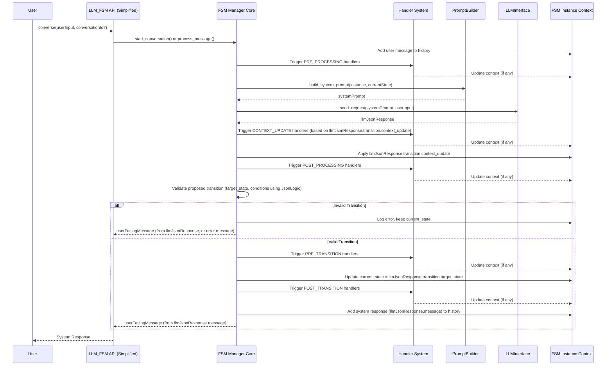

# LLM-FSM & Workflows: Comprehensive System Overview for LLMs

## 1. Introduction

This document provides a comprehensive overview of the `llm-fsm` repository. It is designed to help Large Language Models (LLMs) understand the system's architecture, its core components, how they interact, and the LLM's role within various parts of the system.

The repository consists of two main parts:
1.  **`llm_fsm` (Core):** A framework for implementing Finite State Machines (FSMs) where an LLM acts as the Natural Language Understanding (NLU) and transition decision-making engine for individual, stateful conversations.
2.  **`llm_fsm_workflows` (Extension):** A system built on top of or alongside the core `llm_fsm` to orchestrate more complex, multi-step processes that can include FSM-driven conversations as individual steps.

This guide will cover both, emphasizing how an LLM interacts with or contributes to each.

## 2. The Core Problem: Statelessness in Complex Interactions

Traditional LLMs are stateless. This makes it challenging to build:
    - Structured, multi-turn conversations where context and state must be strictly maintained.
    - Automated processes that require sequential steps, conditional logic, and integration with external systems or other LLM calls.

The `llm-fsm` system addresses this by providing mechanisms to explicitly manage state and orchestrate interactions.

## 3. Part I: The `llm_fsm` Core - Stateful Conversations

*(This section is largely based on your provided `LLM.md` but may be contextualized within the larger system)*

### 3.1. Core Concept: FSM + LLM Synthesis

The `llm_fsm` core framework combines deterministic Finite State Machines with the probabilistic power of LLMs.
-   **FSM:** Provides the structural backbone, defining states, valid transitions, and overall conversational flow.
-   **LLM:** Handles natural language understanding, information extraction from user input, and generation of user-facing responses. The LLM is also responsible for deciding the next state based on the current state, user input, and available transitions.
-   **Python Framework (`llm_fsm`):** Orchestrates the interaction, manages context, and ensures the LLM operates within the FSM's rules.

### 3.2. System Architecture (`llm_fsm` Core)

```mermaid
graph TD
    User[User] <--> FSMManagerInterface[LLM_FSM Simplified API]
    FSMManagerInterface --- FSMManagerCore[FSM Manager Core]

    subgraph "llm_fsm Core Components"
        FSMManagerCore --> StateManager[State Management]
        FSMManagerCore --> ContextManager[Context Management & History]
        FSMManagerCore --> PromptBuilder[Prompt Builder]
        FSMManagerCore <--> HandlerSystem[Handler System]
        FSMManagerCore <--> LLMInterface[LLM Interface (e.g., LiteLLM)]

        PromptBuilder --> SystemPromptForLLM[System Prompt]
        LLMInterface <--> ExternalLLM[External LLM Provider]
    end

    subgraph "Data Structures"
        FSMDefinitionFile[FSM Definition (JSON)]
        FSMInstanceData[FSM Instance (Runtime)]
        ContextDataStore[Context Data]
        TransitionRulesDef[Transition Rules]
    end

    FSMManagerCore --> FSMDefinitionFile
    FSMManagerCore --> FSMInstanceData
    ContextManager --> ContextDataStore
    StateManager --> TransitionRulesDef
```

### 3.3. Core Data Structures (`llm_fsm` Core)

These define the FSM and its runtime state. The LLM is made aware of these structures implicitly through the system prompt.

#### 3.3.1. `FSMDefinition` (from `fsm.json` files)
Defines the blueprint of a conversational agent.
```typescript
interface FSMDefinition {
  name: string;                   // FSM identifier
  description: string;            // Human-readable description
  initial_state: string;          // Starting state ID
  version: string;                // Schema version (e.g., "3.0")
  persona?: string;               // Optional global LLM response persona
  states: { [id: string]: State }; // Map of all state definitions
  function_handlers?: FunctionHandlerDefinition[]; // Definitions for custom Python logic
}
```

#### 3.3.2. `State`
Defines a single state within the FSM.
```typescript
interface State {
  id: string;                             // Unique state identifier
  description: string;                    // State's purpose/description
  purpose: string;                        // Functional purpose (e.g., "Collect user's name")
  transitions: Transition[];              // Available transitions from this state
  required_context_keys?: string[];       // Context keys the LLM should aim to collect in this state
  instructions?: string;                  // Specific instructions for the LLM when in this state
  example_dialogue?: { [role: string]: string }[]; // Optional examples for few-shot prompting
}
```

#### 3.3.3. `Transition`
Defines a rule for moving from one state to another.
```typescript
interface Transition {
  target_state: string;                   // ID of the state to transition to
  description: string;                    // Describes when this transition should occur
  conditions?: TransitionCondition[];      // Optional conditions that must be met
  priority: number;                       // Lower number = higher priority (default 100)
}
```

#### 3.3.4. `TransitionCondition`
Specifies conditions for a transition to be valid.
```typescript
interface TransitionCondition {
  description: string;                    // Human-readable description
  requires_context_keys?: string[];       // Context keys that must be present for this condition
  logic?: JsonLogicExpression;            // Optional JsonLogic expression evaluated against context
}
```
*(JsonLogic is detailed further down)*

#### 3.3.5. `FSMInstance` (Runtime)
Represents an active conversation.
```typescript
interface FSMInstance {
  fsm_id: string;                         // Reference to FSMDefinition.name
  current_state: string;                  // Current active state ID
  context: FSMContext;                    // Runtime data and history
  persona?: string;                       // Effective persona (can be overridden from definition)
}
```

#### 3.3.6. `FSMContext` (Runtime)
Holds data for an FSMInstance.
```typescript
interface FSMContext {
  data: { [key: string]: any };           // Key-value store for collected information
  conversation: ConversationHistory;      // History of user/system messages
  metadata: { [key: string]: any };       // Additional system metadata
}
```

#### 3.3.7. `ConversationHistory` (Runtime)
```typescript
interface ConversationHistoryExchange {
  user?: string;
  system?: string; // Or assistant, bot, etc.
}
interface ConversationHistory {
  exchanges: ConversationHistoryExchange[];
  max_history_size: number;
}
```

### 3.4. LLM Interaction in `llm_fsm` Core

#### 3.4.1. The System Prompt (Input to LLM)
The `PromptBuilder` constructs a detailed system prompt for the LLM. This is the LLM's primary source of information for acting within the FSM.

**Structure:**
```xml
<task>
  [Overall task description for the LLM in the FSM context]
</task>

<fsm>
  <persona>[Optional persona description, e.g., "A friendly assistant"]</persona>

  <current_state>
    <id>[current_state_id]</id>
    <description>[current_state_description]</description>
    <purpose>[current_state_purpose]</purpose>
    <state_instructions>[Optional state-specific instructions for LLM]</state_instructions>
    <information_to_collect>[comma-separated list of required_context_keys for this state]</information_to_collect>
    <information_collection_instructions>
      [Guidelines on how to collect and store information in context_update, including use of _extra]
    </information_collection_instructions>
  </current_state>

  <current_context><![CDATA[
    { /* JSON representation of FSMInstance.context.data */ }
  ]]></current_context>

  <conversation_history><![CDATA[
    [ /* JSON list of recent ConversationHistoryExchanges */ ]
  ]]></conversation_history>

  <valid_states>[comma-separated list of all state_ids the LLM can transition to from current_state, including current_state_id itself for staying put]</valid_states>

  <transitions><![CDATA[
    [ /* JSON list of available Transition objects from current_state, including priorities and conditions descriptions */ ]
  ]]></transitions>

  <response>
    [Instructions on the required JSON response format, including the schema]
    {
      "transition": {
        "target_state": "state_id",
        "context_update": { "key1": "value1", "_extra": {} }
      },
      "message": "Your message to the user",
      "reasoning": "Your reasoning (optional)"
    }
  </response>

  <examples><![CDATA[
    [Optional few-shot examples of user_message -> LLM JSON response]
  ]]></examples>

  <guidelines>
    [General operational guidelines for the LLM]
  </guidelines>

  <format_rules>
    [Strict rules about returning ONLY valid JSON, no markdown, etc.]
  </format_rules>
</fsm>
```
**Key aspects for the LLM:**
1.  **Focus on `current_state`:** Understand its purpose and instructions.
2.  **Information Extraction:** If `information_to_collect` is present, extract these from the `user_message` and put them into `context_update`. Use `_extra` for relevant but unrequested info.
3.  **Transition Selection:** Based on `user_message`, `current_context`, and `conversation_history`, choose the most appropriate `target_state` from the `transitions` list. Consider transition descriptions, conditions, and priorities.
4.  **Response Generation:** Craft a `message` for the user that aligns with the `persona`, `current_state` purpose, and the chosen transition.
5.  **Strict JSON Output:** Adhere *exactly* to the `<response>` format.

#### 3.4.2. Expected LLM JSON Response (Output from LLM)
The LLM **MUST** return a valid JSON object matching this schema:
```json
{
  "transition": {
    "target_state": "next_state_id", // REQUIRED: Must be one of the <valid_states>
    "context_update": {             // REQUIRED: Can be empty {}
      "key1_from_required_context": "extracted_value1",
      "another_key": "another_value",
      "_extra": { "unexpected_but_useful_info": "value" } // For non-required info
    }
  },
  "message": "The natural language message to display to the user.", // REQUIRED
  "reasoning": "Optional: LLM's internal reasoning for the decision (not shown to user)." // OPTIONAL
}
```

### 3.5. Execution Flow (`llm_fsm` Core)



### 3.6. JsonLogic for Conditions (`llm_fsm.expressions`)
Transition conditions can use JsonLogic. The LLM doesn't evaluate these itself, but its understanding of whether conditions are met (based on context) will influence its `target_state` choice.
-   **Structure:** `{"operator": [args...]}` e.g., `{"==": [{"var": "user_age"}, 18]}`
-   **`var` operator:** Accesses data from `FSMInstance.context.data`. E.g., `{"var": "user.name"}`.
-   The framework evaluates these conditions *after* the LLM proposes a transition to validate it.

### 3.7. Handler System (`llm_fsm.handler_system`)
Allows custom Python code to run at specific points (HandlerTiming).
-   **Impact for LLM:** Handlers can modify `FSMInstance.context.data`. The LLM will see these modifications in subsequent turns via the `current_context` in the system prompt. Handlers do not directly interact with the LLM during their execution.
-   **Handler Timings:** `START_CONVERSATION`, `PRE_PROCESSING`, `POST_PROCESSING`, `CONTEXT_UPDATE`, `PRE_TRANSITION`, `POST_TRANSITION`, `END_CONVERSATION`, `ERROR`.

### 3.8. Persona Support
If an `FSMDefinition` or `FSMInstance` includes a `persona` string, this is included in the `<persona>` tag of the system prompt. The LLM is expected to adopt this persona in its `message` to the user.

---

## 4. Part II: The `llm_fsm_workflows` Extension

This extension allows for the creation and execution of more complex, potentially long-running, automated processes where individual steps might be FSM-driven conversations, API calls, conditional logic, or other operations.

### 4.1. Core Concept (`llm_fsm_workflows`)
Workflows are defined as a graph of `WorkflowSteps`. The `WorkflowEngine` executes these steps, managing the state and context of the overall workflow.
-   An FSM-driven conversation (managed by `llm_fsm` core) can be *one type of step* within a larger workflow.

### 4.2. System Architecture (`llm_fsm_workflows`)

```mermaid
graph TD
    WorkflowTrigger[External Trigger / API Call] --> WorkflowEngineAPI[Workflow Engine API]
    WorkflowEngineAPI --- WorkflowEngineCore[Workflow Engine Core]

    subgraph "llm_fsm_workflows Components"
        WorkflowEngineCore --> WorkflowDefinitionStore[Workflow Definition Store]
        WorkflowEngineCore --> WorkflowInstanceStore[Workflow Instance Store & Context]
        WorkflowEngineCore --> StepExecutor[Step Executor]
        WorkflowEngineCore --> EventManager[Event Manager (for WaitForEventStep)]
        WorkflowEngineCore --> TimerManager[Timer Manager (for TimerStep)]

        StepExecutor --> APICallStepRunner[API Call Step]
        StepExecutor --> ConditionStepRunner[Condition Step]
        StepExecutor --> LLMProcessingStepRunner[LLM Processing Step (generic LLM call)]
        StepExecutor --> FSMStepRunner[FSM Conversation Step]
        StepExecutor --> ParallelStepRunner[Parallel Step]

        FSMStepRunner -.-> FSMManagerCore_Ref["(uses) llm_fsm.FSMManager Core"]
        LLMProcessingStepRunner -.-> LLMInterface_Ref["(uses) llm_fsm.LLMInterface"]
    end

    subgraph "Data Structures"
        WorkflowDefinitionData[Workflow Definition]
        WorkflowStepData[Workflow Step Definitions]
        WorkflowInstanceData_WF[Workflow Instance (Runtime)]
    end

    WorkflowDefinitionStore --> WorkflowDefinitionData
    WorkflowDefinitionData --> WorkflowStepData
    WorkflowInstanceStore --> WorkflowInstanceData_WF
```

### 4.3. Core Data Structures (`llm_fsm_workflows`)

#### 4.3.1. `WorkflowDefinition`
Defines the structure of a workflow.
```typescript
interface WorkflowDefinition {
  workflow_id: string;
  name: string;
  description?: string;
  steps: { [step_id: string]: WorkflowStep };
  initial_step_id: string;
  metadata?: { [key: string]: any };
}
```

#### 4.3.2. `WorkflowStep` (Abstract)
Base for all step types. Each step transitions to a `next_state` (which is another `step_id` in the workflow).
```typescript
interface WorkflowStep {
  step_id: string;
  name: string;
  description?: string;
  type: string; // e.g., "AutoTransitionStep", "APICallStep", "FSMConversationStep"
  // Specific fields depend on the step type
}
```
**Common Step Types:**
-   **`AutoTransitionStep`:** Executes an action (Python callable), updates context, and transitions to `next_state`.
-   **`APICallStep`:** Calls an external API. Transitions to `success_state` or `failure_state`.
-   **`ConditionStep`:** Evaluates a Python callable condition. Transitions to `true_state` or `false_state`.
-   **`LLMProcessingStep`:** Makes a generic call to an LLM (not necessarily FSM-bound) using a prompt template. Transitions to `next_state` or `error_state`. **LLM Role:** Standard prompt completion based on template.
-   **`WaitForEventStep`:** Pauses workflow execution until an external event is received.
-   **`TimerStep`:** Pauses workflow execution for a specified duration.
-   **`ParallelStep`:** Executes multiple sub-steps concurrently.
-   **`FSMConversationStep` (Hypothetical/Implied):** A step that would initiate and manage an FSM-driven conversation using the `llm_fsm` core. The workflow would provide the `fsm_definition_id` and initial context. The step completes when the FSM reaches a terminal state. The FSM's final context can be mapped to the workflow context. **LLM Role:** As defined in Part I for `llm_fsm` core.

#### 4.3.3. `WorkflowInstance` (Runtime)
Represents an active run of a workflow.
```typescript
interface WorkflowInstance {
  instance_id: string;
  workflow_id: string;
  current_step_id: string;
  context: { [key: string]: any }; // Context for the entire workflow
  status: "pending" | "running" | "waiting" | "completed" | "failed" | "cancelled";
  // ... other metadata like created_at, history
}
```

### 4.4. LLM Interaction in `llm_fsm_workflows`

The LLM's interaction depends on the type of `WorkflowStep` being executed:

1.  **`FSMConversationStep` (or similar):**
    *   The `WorkflowEngine` would delegate to the `llm_fsm.FSMManager`.
    *   The LLM's role is **identical** to its role in the `llm_fsm` core (see Section 3.4). It receives a system prompt specific to the FSM's current state and produces a JSON response to drive that FSM.
    *   The workflow context might provide initial context to the FSM, and the FSM's final context might update the workflow context.

2.  **`LLMProcessingStep`:**
    *   This step is for more generic LLM tasks, not necessarily full FSM conversations.
    *   **Input to LLM:** A prompt, typically constructed from a `prompt_template` and variables from the `WorkflowInstance.context`.
    *   **LLM Role:** Perform text generation, summarization, classification, data extraction, etc., based on the provided prompt.
    *   **Output from LLM:** Typically unstructured text, or structured text/JSON if the prompt instructs it. The step definition would include how to map this output back into the `WorkflowInstance.context`.

3.  **Other Step Types (API, Condition, Timer, etc.):**
    *   These steps generally do **not** directly involve an LLM for their primary execution. An LLM *could* be used *by* an `APICallStep` (if the API itself is an LLM endpoint), but the `WorkflowEngine` itself is not prompting an LLM for these.

### 4.5. Workflow Engine (`engine.py`)
The `WorkflowEngine` in `llm_fsm_workflows/engine.py`:
-   Loads `WorkflowDefinition`s.
-   Manages `WorkflowInstance`s.
-   Executes steps sequentially or conditionally based on the definition.
-   Handles transitions between workflow steps.
-   Manages overall workflow context.
-   Integrates with `llm_fsm.FSMManager` if a workflow step involves an FSM conversation.
-   Uses `llm_fsm.handler_system` via the `FSMManager` for FSM steps, and potentially could have its own handler system for workflow-level events. The provided files show workflow-specific handlers (`AutoTransitionHandler`, `EventHandler`, `TimerHandler` in `llm_fsm_workflows/handlers.py`) that seem to interact with the `FSMManager`'s context, suggesting a tight coupling or specific context keys (`_workflow_info`, `_waiting_info`, `_timer_info`) used to bridge FSM execution with workflow needs.

## 5. Relationship between `llm_fsm` Core and `llm_fsm_workflows`

-   The `llm_fsm` core provides the capability for stateful, LLM-driven conversations.
-   The `llm_fsm_workflows` extension uses the `llm_fsm` core as a building block. An FSM conversation can be a single, powerful step within a larger, automated workflow.
-   An LLM might be invoked in two ways:
    1.  **Directly by `FSMManager`:** For NLU, state transition, and response generation within an FSM conversation (as described in Part I).
    2.  **Directly by a `WorkflowStep` (like `LLMProcessingStep`):** For other LLM tasks that are part of a workflow but aren't full FSMs (e.g., summarizing data collected by a previous API step).

## 6. Key Files and Their Relevance to LLM Understanding

-   **`src/llm_fsm/definitions.py`**: Defines the structure of FSMs. Crucial for understanding the "rules of the game" when the LLM is acting within an FSM.
-   **`src/llm_fsm/prompts.py` (`PromptBuilder`):** Defines *how* the LLM gets its instructions for FSM tasks. Understanding this helps the LLM anticipate the input format.
-   **`examples/**/*.json`**: Concrete examples of FSM definitions. Studying these helps understand common patterns.
-   **`src/llm_fsm_workflows/definitions.py` & `src/llm_fsm_workflows/steps.py`**: Defines the structure of workflows and the types of steps. If an LLM is part of an `LLMProcessingStep`, it would need to understand its specific instructions for that step.
-   **`LLM.md` (in root):** The primary guide for an LLM when its role is *specifically to operate within an FSM conversation* as managed by `llm_fsm` core.
-   **This document (`SYSTEM_OVERVIEW_FOR_LLM.md`):** Provides the broader context of the entire repository.

## 7. LLM's Primary Responsibilities (Summary)

1.  **When acting within an `llm_fsm` Core FSM Conversation:**
    *   Carefully parse the system prompt provided by `PromptBuilder`.
    *   Understand the current state, its purpose, and any specific instructions.
    *   Extract required information from the user's message into the `context_update` field of the response.
    *   Use `_extra` in `context_update` for relevant but unrequested information.
    *   Analyze available transitions, their descriptions, conditions (as described in the prompt), and priorities.
    *   Select the most appropriate `target_state`.
    *   Generate a user-facing `message` consistent with the FSM's `persona` and the current conversational context.
    *   Optionally provide `reasoning`.
    *   **Strictly adhere to the JSON output format.**

2.  **When acting within an `llm_fsm_workflows.LLMProcessingStep`:**
    *   Process the input prompt (which will be different from the FSM system prompt).
    *   Perform the task described in that prompt (e.g., summarization, classification, generation based on a template).
    *   Produce output as instructed by that specific step's prompt (might be text, or might be structured if requested).

## 8. Conclusion

The `llm-fsm` repository provides a robust solution for adding statefulness and orchestration to LLM-based applications. The core `llm_fsm` package enables structured, stateful conversations, while the `llm_fsm_workflows` extension allows these conversations to be embedded within larger, automated processes. An LLM's role is crucial in both, either driving FSM logic or performing specific tasks within a workflow step. Understanding the distinct contexts and expected I/O formats for each role is key to successful integration.
