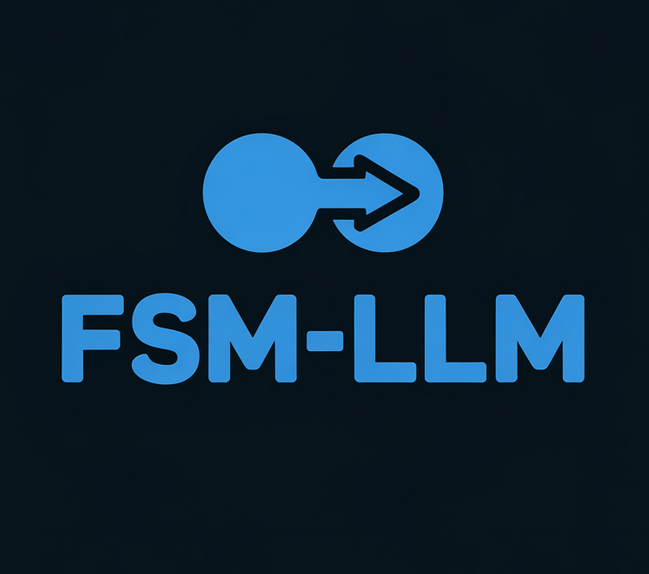
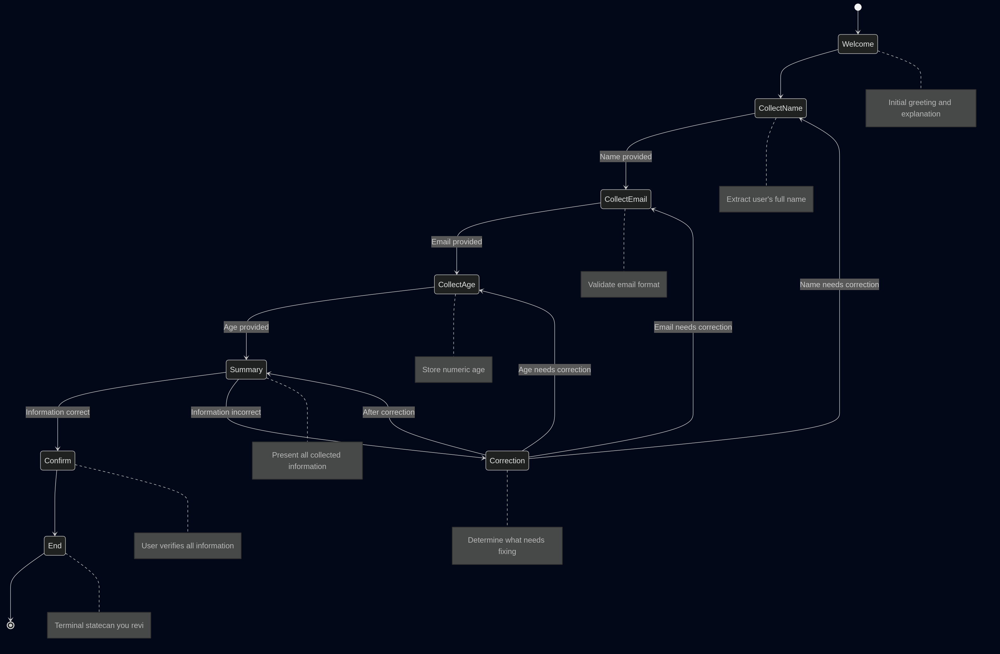

# LLM-FSM: Adding State to the Stateless

[](https://www.gnu.org/licenses/gpl-3.0)
[](https://www.python.org/downloads/)

<p align="center">
  
</p>

## The Problem: Stateless LLMs in Structured Conversations

Large Language Models have revolutionized natural language processing with their remarkable understanding and generation capabilities. However, they have a fundamental limitation: **they are inherently stateless**. Each interaction is processed independently with only the context provided in the prompt.

This statelessness creates significant challenges for building robust conversational applications:

- **State Fragility**: Without explicit tracking, conversations easily lose their place
- **Context Limitations**: As conversations grow, context windows fill up quickly
- **Transition Ambiguity**: Determining when to move to different conversation stages is difficult
- **Information Extraction Inconsistency**: Extracting structured data from free-form text is unreliable
- **Validation Challenges**: Ensuring required information is collected before proceeding is complex

Consider a flight booking scenario:

```
User: I'd like to book a flight
System: Where would you like to fly to?
User: I'm thinking maybe Hawaii
System: Great choice! And where will you be departing from?
User: Actually, I'd prefer Bali instead of Hawaii
```

Without explicit state tracking, the system might miss the change in destination or maintain inconsistent information.

## The Solution: Finite State Machines + LLMs

LLM-FSM elegantly combines classical Finite State Machines with modern Large Language Models:

> "We keep the state as a JSON structure inside the system prompt of an LLM, describing transition nodes and conditions for that specific state, along with any emittance of symbols that the LLM might do."

This hybrid approach gives you the best of both worlds:
- ✅ **Predictable conversation flows** with clear rules and transitions
- ✅ **Natural language understanding** powered by state-of-the-art LLMs
- ✅ **Persistent context** across the entire conversation
- ✅ **Dynamic adaptation** to user inputs

## Theoretical Foundation

Finite State Machines (FSMs) represent one of computer science's most elegant abstractions. An FSM consists of:

- **States**: The distinct conditions in which a system can exist
- **Transitions**: Rules governing movement between states based on inputs
- **Initial State**: Where the system begins execution
- **Terminal States**: Where the system concludes execution (optional)

LLMs excel at understanding natural language but struggle with maintaining consistent context. The LLM-FSM framework creates a bridge between:

1. **Deterministic Computation** (FSMs): Rule-based, predictable, and structured
2. **Probabilistic Computation** (LLMs): Adaptable, nuanced, and natural

## Key Features

- 🚦 **Structured Conversation Flows**: Define states, transitions, and conditions
- 🧠 **LLM-Powered Entity Extraction**: Let the LLM do what it does best
- 👤 **Persona Support**: Define a consistent tone and style for responses
- 📝 **Persistent Context Management**: Maintain information throughout the conversation
- 🔄 **Provider-Agnostic**: Works with OpenAI, Anthropic, and other LLM providers via LiteLLM
- 📊 **Visualization**: See your FSM structure with a built-in ASCII visualizer
- 📝 **Validation & Error Handling**: Catch and handle issues gracefully
- 🪵 **Comprehensive Logging**: Detailed logs for debugging and monitoring
- 🧪 **Test-Friendly**: Easy to unit test and verify behavior

## Example Conversation

Here's a sample conversation using a personal information collection FSM:

```
System: Hello! I'm an assistant that will be collecting some information. 
Could you please tell me your name?

User: I'm Alex Thompson

System: Nice to meet you, Alex Thompson! Could you please provide your email address?

User: alex.thompson@example.com

System: Thank you! Could you please tell me your date of birth?

User: March 15, 1992

System: Great! I've collected:
- Name: Alex Thompson
- Email: alex.thompson@example.com
- Date of Birth: March 15, 1992
Is this information correct?

User: Actually, my email is alex.j.thompson@example.com

System: I've updated your email to alex.j.thompson@example.com. Is the information correct now?

User: Yes, that's correct

System: Thank you for confirming your information! Your profile has been saved.
```



## Installation

```bash
# Clone the repository
git clone https://github.com/yourusername/llm-fsm.git
cd llm-fsm

# Install dependencies
pip install -r requirements.txt

# Set up environment variables
cp .env.example .env
# Edit .env with your API keys
```

Or install via pip:

```bash
pip install llm-fsm
```

## Quick Start

### Python API

```python
from llm_fsm.llm import LiteLLMInterface
from llm_fsm.fsm import FSMManager
from llm_fsm.utilities import load_fsm_definition

# Initialize the LLM interface
llm_interface = LiteLLMInterface(
   model="gpt-4o",  # Use any model supported by LiteLLM
   api_key="your-api-key",
   temperature=0.5
)

# Create an FSM manager
fsm_manager = FSMManager(
   fsm_loader=load_fsm_definition,
   llm_interface=llm_interface
)

# Start a conversation with your FSM
conversation_id, response = fsm_manager.start_conversation("examples/personal_information_collection.json")
print(f"System: {response}")

# Process user input
user_input = "My name is Alex Thompson"
response = fsm_manager.process_message(conversation_id, user_input)
print(f"System: {response}")

# Continue the conversation until completion
while not fsm_manager.is_conversation_ended(conversation_id):
   user_input = input("You: ")
   response = fsm_manager.process_message(conversation_id, user_input)
   print(f"System: {response}")

# Get the collected data when done
user_data = fsm_manager.get_conversation_data(conversation_id)
print(f"Collected data: {user_data}")
```

### Starting Conversations with Initial Context

You can pre-populate context data when starting a conversation, which is useful for personalization, session continuation, or skipping unnecessary states:

```python
# Define initial context with user information
initial_context = {
    "name": "Alex Thompson",
    "email": "alex.thompson@example.com",
    "preferred_genres": ["science fiction", "mystery", "fantasy"],
    "membership_level": "premium"
}

# Start a conversation with initial context
conversation_id, response = fsm_manager.start_conversation(
    "examples/personal_information_collection.json",
    initial_context=initial_context
)
```

The FSM will use this initial context to:
- Potentially skip states that collect information you've already provided
- Personalize responses based on known user data
- Make more informed transition decisions

This feature is particularly useful for:
- User personalization
- Continuing past conversations
- Integration with CRM or user management systems
- Automated testing with different user profiles

### Command Line Interface

You can also run conversations directly from the command line:

```bash
# Run a conversation with a specific FSM
python -m llm_fsm.main --fsm examples/personal_information_collection.json

# Visualize an FSM using ASCII art
python -m llm_fsm.visualizer --fsm examples/personal_information_collection.json

# Validate an FSM definition
python -m llm_fsm.validator --fsm examples/personal_information_collection.json
```

## Core Architecture

### FSM Definition

At its core, LLM-FSM uses a JSON structure to define states, transitions, and conditions:

```json
{
  "name": "Personal Information Collection",
  "description": "A conversation flow to collect user information",
  "initial_state": "welcome",
  "persona": "A helpful and friendly assistant who speaks in a warm, conversational tone",
  "states": {
    "welcome": {
      "id": "welcome",
      "description": "Initial welcome state",
      "purpose": "Welcome the user and explain purpose",
      "transitions": [
        {
          "target_state": "collect_name",
          "description": "Always transition to collecting name",
          "priority": 0
        }
      ],
      "instructions": "Warmly welcome the user and explain that you'll be collecting information."
    },
    "collect_name": {
      "id": "collect_name",
      "description": "Collect user's name",
      "purpose": "Ask for and record the user's full name",
      "required_context_keys": ["name"],
      "transitions": [
        {
          "target_state": "collect_email",
          "description": "Transition once name is obtained",
          "conditions": [
            {
              "description": "Name has been provided",
              "requires_context_keys": ["name"]
            }
          ],
          "priority": 0
        }
      ],
      "instructions": "Ask the user for their full name. Extract and store it in the 'name' context variable."
    }
    // Additional states omitted for brevity
  }
}
```

### The Execution Flow

When a user sends a message:

1. **Prompt Construction**: We build a system prompt containing:
   - Current state information
   - Available transitions
   - Extraction instructions
   - Current context values
   - Recent conversation history
   - Response format instructions

2. **LLM Processing**: The LLM:
   - Extracts relevant information from the user's message
   - Determines which state to transition to
   - Generates a natural language response
   - Returns a structured JSON response

3. **State Management**: The FSM Manager:
   - Updates the context with extracted information
   - Validates the proposed state transition
   - Updates the current state
   - Stores the conversation history

### LLM Response Format

The LLM returns a structured JSON response:

```json
{
  "transition": {
    "target_state": "collect_email",
    "context_update": {"name": "Alex Thompson"}
  },
  "message": "Nice to meet you, Alex Thompson! Could you please provide your email address?",
  "reasoning": "The user provided their full name 'Alex Thompson', so I'm transitioning to collect their email."
}
```

This format cleanly separates:
- User-facing content (the message)
- System-facing content (transition decision and context updates)
- Debugging information (reasoning)

## Evolution of the Design

The LLM-FSM framework evolved through several iterations:

### Version 1: Basic Implementation
- States and transitions in simple JSON
- Regex-based entity extraction
- Template-based responses
- Transition logic in code

### Version 2: LLM-Centric Approach
- More sophisticated system prompts
- LLM-based entity extraction
- Natural language responses
- Split transition logic

### Version 3: Refined Architecture
- Structured JSON responses
- Context management outside states
- Separation of user-facing and system content
- Provider-agnostic LLM integration
- Comprehensive validation
- Enhanced debugging

## Conversation Patterns

LLM-FSM supports various conversation patterns:

### 1. Linear Flows
Step-by-step information collection:
- Personal information forms
- Survey administration
- Onboarding processes

### 2. Conversational Loops
Maintain ongoing engagement:
- Recommendation systems
- Coaching conversations
- Learning assistants

### 3. Decision Trees
Guide users through branching options:
- Product recommendations
- Troubleshooting flows
- Decision support

### 4. Hybrid Patterns
Combine multiple patterns:
- Customer support (identification → troubleshooting → resolution)
- Medical triage (symptoms → assessment → recommendations)
- Educational systems (assessment → instruction → testing)

## Key Design Decisions

### 1. LLM as the NLU Engine

Instead of brittle extraction rules in code:

```python
# Old approach
def extract_name(message):
    patterns = [r"My name is ([\w\s]+)", r"I am ([\w\s]+)"]
    for pattern in patterns:
        match = re.search(pattern, message)
        if match:
            return match.group(1)
    return None
```

We leverage the LLM's understanding:

```
When the user provides their name, extract it and store it in the 'name' context variable.
Consider explicit mentions ('My name is John') and implicit mentions ('Call me John').
```

### 2. Context Outside States

We maintain context at the conversation level rather than within individual states:

```python
# Context naturally persists across state transitions
{
  "current_state": "collect_email",
  "context": {"name": "John Smith", "email": "john@example.com"}
}
```

### 3. Provider-Agnostic Design

Use any LLM provider supported by LiteLLM:

```python
# OpenAI example
llm_interface = LiteLLMInterface(model="gpt-4o", api_key=openai_api_key)

# Anthropic example
llm_interface = LiteLLMInterface(model="claude-3-opus-20240229", api_key=anthropic_api_key)
```

## Included Examples

The repository includes several example FSMs:

1. **Personal Information Collection**: A linear flow for collecting user details
2. **Book Recommendation System**: A conversational loop with engagement detection
3. **Product Recommendation**: A decision tree with different endings based on user preferences
4. **Three Little Pigs Story**: An interactive storytelling experience with a custom persona

## Persona Support

One powerful feature of LLM-FSM is the ability to define a consistent persona for the entire conversation flow:

```json
{
  "name": "Three Little Pigs Interactive Story",
  "description": "An interactive storytelling experience based on the classic tale",
  "initial_state": "introduction",
  "persona": "You are J.R.R Tolkien master epic story teller.",
  "states": {
    // State definitions
  }
}
```

The persona:
- Defines a consistent tone, style, and voice for all responses
- Is maintained across all states in the conversation
- Is incorporated into the system prompt for each LLM request
- Enables creating specialized conversational experiences (storytellers, educators, customer service agents, etc.)

This allows for creating more engaging and contextually appropriate conversational experiences while maintaining the state management benefits of the FSM approach.

Contributions are welcome! Areas for contribution include:

- Additional FSM examples
- Integration with more LLM providers
- Enhanced visualization tools
- Web-based UI for FSM creation and testing
- Improved documentation and tutorials

Please feel free to submit a Pull Request.

## License

This project is licensed under the GNU General Public License v3.0 - see the [LICENSE](LICENSE) file for details.