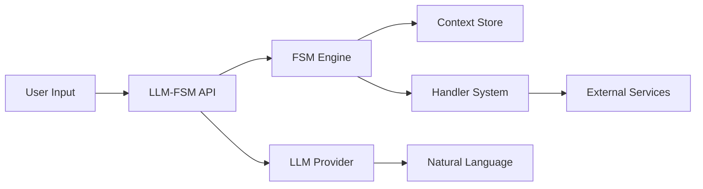

# LLM-FSM: Adding State to the Stateless

[](https://www.gnu.org/licenses/gpl-3.0)
[](https://www.python.org/downloads/)
[](https://badge.fury.io/py/llm-fsm)


## 🎯 Why LLM-FSM?

Large Language Models are incredible at understanding and generating human language, but they have one critical flaw: **they have no memory**. Each interaction is completely isolated, making it nearly impossible to build reliable, multi-step conversations.

**LLM-FSM solves this by combining the best of both worlds:**
- 🧠 **LLMs** for natural language understanding
- 🔄 **Finite State Machines** for conversation structure
- 💾 **Python** for state management and business logic

The result? Conversations that feel natural but follow predictable, testable paths.

## 🚀 Quick Install

```bash
pip install llm-fsm
```

## 💡 Your First Stateful Conversation (2 minutes)

```python
from llm_fsm import API

# Define a simple 2-state conversation
greeting_fsm = {
    "name": "greeting_bot",
    "initial_state": "ask_name",
    "states": {
        "ask_name": {
            "id": "ask_name",
            "purpose": "Get the user's name in a friendly way",
            "transitions": [{
                "target_state": "greet_personally",
                "description": "When user provides their name"
            }]
        },
        "greet_personally": {
            "id": "greet_personally",
            "purpose": "Give a warm, personalized greeting using their name",
            "transitions": []  # End state
        }
    }
}

# Create the bot and start chatting
api = API.from_definition(greeting_fsm, model="gpt-4o-mini")
conv_id, response = api.start_conversation()
print(f"Bot: {response}")  # "Hi there! What's your name?"

user_input = input("You: ")  # "I'm Alice"
response = api.converse(user_input, conv_id)
print(f"Bot: {response}")  # "Hello Alice! It's wonderful to meet you..."

# The bot remembered your name!
data = api.get_data(conv_id)
print(f"Collected: {data}")  # {'name': 'Alice'}
```

## 🎓 Build Powerful Conversations Step by Step

### Step 1: Define Your Flow (JSON)

Create `customer_service.json`:
```json
{
  "name": "customer_service",
  "description": "Route customer inquiries to the right department",
  "initial_state": "greeting",
  "persona": "You are a helpful, professional customer service representative",
  "states": {
    "greeting": {
      "id": "greeting",
      "purpose": "Welcome customer and understand their need",
      "transitions": [
        {
          "target_state": "technical_support",
          "description": "Customer needs technical help"
        },
        {
          "target_state": "billing_inquiry",
          "description": "Customer has billing questions"
        },
        {
          "target_state": "general_feedback",
          "description": "Customer wants to give feedback"
        }
      ]
    },
    "technical_support": {
      "id": "technical_support",
      "purpose": "Gather technical issue details and provide solutions",
      "required_context_keys": ["issue_description", "product_name"],
      "transitions": [{
        "target_state": "resolved",
        "description": "Issue has been addressed"
      }]
    },
    "billing_inquiry": {
      "id": "billing_inquiry",
      "purpose": "Handle billing questions and account issues",
      "required_context_keys": ["account_number", "billing_issue"],
      "transitions": [{
        "target_state": "resolved",
        "description": "Billing question answered"
      }]
    },
    "general_feedback": {
      "id": "general_feedback",
      "purpose": "Collect customer feedback",
      "required_context_keys": ["feedback"],
      "transitions": [{
        "target_state": "resolved",
        "description": "Feedback collected"
      }]
    },
    "resolved": {
      "id": "resolved",
      "purpose": "Thank customer and end conversation",
      "transitions": []
    }
  }
}
```

### Step 2: Add Intelligence with Handlers

```python
from llm_fsm import API
from llm_fsm.handlers import HandlerTiming

api = API.from_file("customer_service.json", model="gpt-4o-mini")

# Add sentiment analysis
def analyze_sentiment(context):
    """Detect customer frustration and escalate if needed"""
    text = " ".join([
        context.get("issue_description", ""),
        context.get("feedback", "")
    ]).lower()
    
    frustrated_words = ["angry", "frustrated", "unacceptable", "terrible"]
    if any(word in text for word in frustrated_words):
        return {
            "sentiment": "negative",
            "priority": "high",
            "needs_escalation": True
        }
    return {"sentiment": "neutral", "priority": "normal"}

# Register the handler
api.register_handler(
    api.create_handler("SentimentAnalyzer")
        .at(HandlerTiming.POST_PROCESSING)
        .do(analyze_sentiment)
)

# Add automatic ticket creation
api.register_handler(
    api.create_handler("TicketCreator")
        .on_state_entry("resolved")
        .when(lambda timing, state, target, ctx, keys: 
              ctx.get("needs_escalation", False))
        .do(lambda ctx: {
            "ticket_id": f"TICKET-{datetime.now().strftime('%Y%m%d%H%M')}",
            "assigned_to": "senior_support"
        })
)

# Start enhanced conversation
conv_id, response = api.start_conversation()
# ... your conversation with automatic sentiment tracking and ticket creation
```

### Step 3: Stack FSMs for Complex Workflows

```python
# Main conversation FSM
main_fsm = "shopping_assistant.json"  

# Detailed checkout sub-FSM
checkout_fsm = "checkout_flow.json"

api = API.from_file(main_fsm, model="gpt-4o-mini")
conv_id, response = api.start_conversation()

# Have main conversation...
# When user reaches checkout state:
if api.get_current_state(conv_id) == "checkout":
    # Push detailed checkout flow
    response = api.push_fsm(
        conv_id,
        checkout_fsm,
        context_to_pass={"cart": cart_items},
        shared_context_keys=["user_email", "user_name"]
    )
    
    # Complete checkout process...
    
    # Return to main flow with results
    response = api.pop_fsm(
        conv_id,
        context_to_return={"order_id": "ORD-12345"},
        merge_strategy="update"
    )
```

## 🔥 Powerful Features

### 🎯 **Natural Conversations with Structure**
Define your conversation flow in simple JSON while the LLM handles natural language understanding. No more regex patterns or intent matching!

### 🔗 **FSM Stacking**
Build complex workflows by stacking simpler FSMs. Like function calls in programming, but for conversations.

### 🎣 **Handler System**
Hook into any conversation event to add validation, call APIs, log interactions, or implement custom business logic.

### 📊 **Complete Observability**
```python
# Get current state
state = api.get_current_state(conv_id)

# View conversation history
history = api.get_conversation_history(conv_id)

# Inspect collected data
data = api.get_data(conv_id)

# Save for analysis
api.save_conversation(conv_id, "conversation.json")
```

### 🤖 **Multi-Provider Support**
Works with OpenAI, Anthropic, and any LiteLLM-supported model:
```python
# OpenAI
api = API.from_file("fsm.json", model="gpt-4o")

# Anthropic
api = API.from_file("fsm.json", model="claude-3-opus")

# Local models
api = API.from_file("fsm.json", model="ollama/llama2")
```

## 🛠️ Command Line Tools

```bash
# Run any FSM interactively
llm-fsm --fsm my_flow.json

# Visualize your FSM structure
llm-fsm-visualize --fsm my_flow.json --style full

# Validate FSM definitions
llm-fsm-validate --fsm my_flow.json
```

## 📚 Learn by Example

Our `examples/` directory is organized by complexity:

```
examples/
├── basic/              # Start here
│   ├── greeting/       # Simple 2-state bot
│   ├── form_filling/   # Collect user information
│   └── quiz/          # Multi-choice quiz bot
├── intermediate/       
│   ├── customer_service/  # Branching conversations
│   ├── appointment/       # Date/time scheduling
│   └── recommendation/    # Product recommendations
└── advanced/           
    ├── tech_support/      # Full helpdesk system
    ├── e_commerce/        # Shopping with cart
    └── workflow_engine/   # Automated workflows
```

## 🏗️ Architecture



## 🤝 Contributing

We love contributions! Here's how to get started:

```bash
# Fork and clone
git clone https://github.com/yourusername/llm-fsm.git
cd llm-fsm

# Install in development mode
pip install -e .[dev]

# Run tests
pytest

# Make your changes and submit a PR!
```

## 📖 Documentation

- **[Quick Start Tutorial](./docs/quickstart.md)** - Get running in 5 minutes
- **[FSM Design Guide](./docs/fsm_design.md)** - Best practices for conversation design  
- **[Handler Development](./docs/handlers.md)** - Build custom handlers
- **[API Reference](./docs/api_reference.md)** - Complete API documentation
- **[Architecture Deep Dive](./docs/architecture.md)** - How it all works

## 🌟 Who's Using LLM-FSM?

LLM-FSM powers conversational AI in:
- 🏥 **Healthcare** - Patient triage and appointment booking
- 🏦 **Finance** - Customer onboarding and support
- 🛒 **E-commerce** - Personal shopping assistants
- 🎓 **Education** - Interactive tutoring systems
- 🏢 **Enterprise** - Workflow automation

## 📜 License

GPL v3.0 - see [LICENSE](./LICENSE) for details.

---

<p align="center">
  <b>Transform your LLM from stateless to stateful in minutes.</b><br><br>
  <a href="https://pypi.org/project/llm-fsm/">📦 Install</a> •
  <a href="./examples/basic/greeting/">🚀 First Example</a> •
  <a href="https://github.com/nikolasmarkou/llm-fsm/discussions">💬 Discussions</a> •
  <a href="https://github.com/nikolasmarkou/llm-fsm/issues">🐛 Issues</a>
</p>