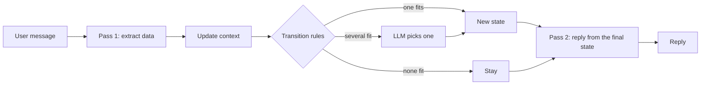

# FSM-LLM: Adding State to the Stateless

[](https://www.apache.org/licenses/LICENSE-2.0)
[](https://www.python.org)
[](https://badge.fury.io/py/fsm-llm)
[](https://github.com/NikolasMarkou/fsm_llm/actions)

<p align="center">
  
</p>

**A Python framework for building stateful conversational AI by combining large language models (LLMs) with finite state machines (FSMs).**

---

## What it is for

LLMs write good text, but each call starts from nothing. A multi-turn conversation that must remember what it collected, follow a set flow, and make the same decision every time needs structure around the model.

FSM-LLM provides that structure:

- **The LLM handles language**: understanding the user, pulling out facts, and writing replies.
- **A finite state machine handles flow**: a fixed set of named states (such as "greeting", "collect email", "confirm") and rules for moving between them. The rules are plain JSON logic, so they are predictable and testable.
- **The framework handles state**: what has been collected, which state the conversation is in, the history, hooks for your own code, and saving and restoring sessions.

Version 0.8.0. License Apache-2.0. Python 3.10, 3.11, 3.12.

## How it works

Every user message goes through two LLM passes:


```mermaid
flowchart LR
    U[User message] --> P1[Pass 1: extract data]
    P1 --> C[Update context]
    C --> T{Transition rules}
    T -- one fits --> S[New state]
    T -- several fit --> L[LLM picks one] --> S
    T -- none fit --> K[Stay]
    S --> P2[Pass 2: reply from the final state]
    K --> P2
    P2 --> R[Reply]
```

Pass 2 runs after the transition, so the reply always comes from the state the conversation is actually in. A state with empty `response_instructions` skips Pass 2 entirely, which agents use for silent intermediate steps.

Features:

- **Handlers**: your functions run at 8 points (start, before and after processing, before and after a transition, context update, end, error), set up with a fluent builder.
- **JsonLogic transitions**: rules like `{">=": [{"var": "age"}, 18]}` or `{"has_context": "email"}` are evaluated in Python, not by the LLM.
- **Intent classification**: single, multi-intent, and two-stage hierarchical classifiers, plus an intent router.
- **FSM stacking**: hand a conversation to a sub-FSM and come back with its results.
- **Streaming**: `converse_stream()` yields reply tokens as they arrive.
- **Sessions**: save and restore a conversation to JSON files with atomic writes.
- **Working memory**: named buffers for agent-style scratch data.
- **100+ LLM providers** through litellm (OpenAI, Anthropic, Ollama, Azure, Bedrock, and more).
- **Security**: internal context keys are hidden, secret-looking keys are kept out of prompts, and user text is sanitised before it enters XML-tagged prompts. The known-compromised litellm 1.82.7 and 1.82.8 are excluded, and `make audit` scans installed packages for malicious `.pth` files.

## Installation

```bash
pip install fsm-llm           # core
pip install "fsm-llm[all]"    # everything
```

| Extra | Command | Additional dependencies |
|-------|---------|------------------------|
| `reasoning` | `pip install "fsm-llm[reasoning]"` | None |
| `agents` | `pip install "fsm-llm[agents]"` | None |
| `workflows` | `pip install "fsm-llm[workflows]"` | None |
| `harness` | `pip install "fsm-llm[harness]"` | None (pulls `fsm-llm[agents]`) |
| `monitor` | `pip install "fsm-llm[monitor]"` | fastapi, uvicorn, jinja2 |
| `mcp` | `pip install "fsm-llm[mcp]"` | mcp (>=1.0.0) |
| `otel` | `pip install "fsm-llm[otel]"` | opentelemetry-api, opentelemetry-sdk (>=1.20.0) |
| `a2a` | `pip install "fsm-llm[a2a]"` | httpx (>=0.24.0) |
| `all` | `pip install "fsm-llm[all]"` | All of the above |

## Quick Start

**1. Define an FSM** (`greeting.json`):

```json
{
  "name": "GreetingBot",
  "description": "Greets the user, learns their name, then says goodbye",
  "initial_state": "greeting",
  "persona": "A friendly assistant",
  "states": {
    "greeting": {
      "id": "greeting",
      "description": "Greet the user and collect their name",
      "purpose": "Greet the user and ask their name",
      "extraction_instructions": "Extract the user's name if provided",
      "response_instructions": "Greet the user warmly and ask for their name if not yet known",
      "transitions": [
        {
          "target_state": "farewell",
          "description": "User wants to end the conversation",
          "conditions": [
            {
              "description": "User said goodbye",
              "requires_context_keys": ["wants_to_leave"],
              "logic": {"has_context": "wants_to_leave"}
            }
          ]
        }
      ]
    },
    "farewell": {
      "id": "farewell",
      "description": "Say goodbye",
      "purpose": "Say goodbye",
      "response_instructions": "Say a warm goodbye using the user's name if known"
    }
  }
}
```

A state with no transitions (here `farewell`) ends the conversation. `required_context_keys` on a state only tells Pass 1 what to extract; to block a transition until a value exists, use a condition like the one above.

**2. Run a conversation**:

```python
from fsm_llm import API

api = API.from_file("greeting.json", model="openai/gpt-4o-mini")
conversation_id, initial_response = api.start_conversation()

print(api.converse("Hi there! I'm Alice.", conversation_id))
print(api.converse("Goodbye!", conversation_id))
print(api.get_data(conversation_id))
```

**3. Or use the command line**:

```bash
export OPENAI_API_KEY="your-key-here"
export LLM_MODEL="openai/gpt-4o-mini"   # required by the CLI
fsm-llm --fsm greeting.json
```

Environment variables read by the `fsm-llm` command (the `API` class reads only `LLM_MODEL`, as the fallback for its `model` argument, then the package default `ollama_chat/qwen3.5:4b`):

| Variable | Default | Meaning |
|----------|---------|---------|
| `LLM_MODEL` | none, **required** | litellm model id; `fsm-llm` exits with `Missing required environment variable: LLM_MODEL` without it |
| `LLM_TEMPERATURE` | `0.5` | sampling temperature (Ollama models force `0` on structured calls) |
| `LLM_MAX_TOKENS` | `1000` | max tokens per LLM call |
| `FSM_PATH` | none | not usable with the `fsm-llm` command: `--fsm` is checked first and is mandatory |

Provider keys (`OPENAI_API_KEY`, ...) are read by litellm. A `.env` file is looked up relative to the installed package, not your working directory, so prefer `export`.

## Packages

The repository ships six Python packages in one distribution. Only `fsm_llm` is required; the others are installed with extras.

| Package | What it adds |
|---------|--------------|
| `fsm_llm` | The core: FSM definitions, the 2-pass pipeline, handlers, classification, LLM access, sessions, validation, visualization |
| `fsm_llm_reasoning` | A problem solver that picks one of 9 reasoning styles and runs it as an FSM, with answer validation and retries |
| `fsm_llm_workflows` | An async workflow engine with 11 step types (API calls, LLM steps, FSM conversations, agents, timers, events, parallel, retry, switch) |
| `fsm_llm_agents` | 18 agent patterns (ReAct, ReWOO, Reflexion, plan-and-execute, debate, orchestrator, ...), tools, human approval, memory, MCP and remote agents, and a meta-builder that designs FSMs, workflows, and agents by chat |
| `fsm_llm_monitor` | A web dashboard to launch, watch, and chat with FSMs, agents, and workflows, with optional OpenTelemetry export |
| `fsm_llm_harness` | The iterative-planner protocol (explore, plan, execute, reflect, pivot, close) as an FSM whose gates check files on disk |

**Classification** (core):

```python
from fsm_llm import Classifier, ClassificationSchema, IntentDefinition

schema = ClassificationSchema(
    intents=[
        IntentDefinition(name="billing", description="Billing and payment questions"),
        IntentDefinition(name="technical", description="Technical support issues"),
        IntentDefinition(name="other", description="Anything else"),
    ],
    fallback_intent="other",  # required, and must be one of the intents
)
classifier = Classifier(schema=schema, model="openai/gpt-4o-mini")
result = classifier.classify("I can't log in to my account")
```

**Reasoning**:

```python
from fsm_llm_reasoning import ReasoningEngine
engine = ReasoningEngine(model="openai/gpt-4o-mini")
solution, trace = engine.solve_problem("What is the probability of rolling two sixes?")
```

**Workflows**:

```python
import asyncio
from fsm_llm_workflows import WorkflowEngine, auto_step, condition_step, create_workflow

wf = create_workflow("orders", "Order check")
wf.with_initial_step(auto_step("load", "Load order", next_state="route",
                               action=lambda ctx: {"amount": 1500}))
wf.with_step(condition_step("route", "Big order?", condition=lambda ctx: ctx["amount"] >= 1000,
                            true_state="review", false_state="done"))
wf.with_step(auto_step("review", "Manual review", next_state="done"))
wf.with_step(auto_step("done", "Finish", next_state=""))

async def main():
    engine = WorkflowEngine()
    engine.register_workflow(wf)
    instance_id = await engine.start_workflow("orders")
    print(engine.get_workflow_status(instance_id))

asyncio.run(main())
```

**Agents**:

```python
from fsm_llm_agents import create_agent, tool

@tool
def search(query: str) -> str:
    """Search the web for information."""
    return f"Results for: {query}"

agent = create_agent(tools=[search])
result = agent("What is the capital of France?")
print(result.answer, result.success)
```

**Monitor**:

```bash
fsm-llm-monitor   # opens http://127.0.0.1:8420
```

**Harness**:

```bash
fsm-llm-harness new "add a retry to the uploader"
fsm-llm-harness status   plans/plan-2026-07-22T101500-1a2b3c4d
fsm-llm-harness validate plans/plan-2026-07-22T101500-1a2b3c4d
```

```python
from fsm_llm_harness import ContextKeys, HarnessAgent, Workspace, build_default_worker_factory

workspace = Workspace("./src")
agent = HarnessAgent(worker_factory=build_default_worker_factory(workspace))
result = agent.run(
    "add a retry to the uploader",
    initial_context={ContextKeys.PLAN_DIR: "plans/plan-...", ContextKeys.WORKSPACE_ROOT: "./src"},
)
```

The harness gates are JSON rules over values counted from the plan directory, so a model's claim alone cannot open one; the approval callback denies by default; and a step stops after 2 failed fix attempts. It is experimental: on a 4B local model single steps succeed reliably, but unattended end-to-end runs have not yet met their 3-out-of-3 bar.

## Command-line tools

| Command | Description |
|---------|-------------|
| `fsm-llm --fsm <path.json>` | Chat with an FSM interactively |
| `fsm-llm-visualize --fsm <path.json>` | Draw an FSM as ASCII art |
| `fsm-llm-validate --fsm <path.json>` | Check an FSM definition for problems |
| `fsm-llm-monitor` | Launch the web dashboard |
| `fsm-llm-meta` | Build FSMs, workflows, or agents by chatting |
| `fsm-llm-harness <new\|resume\|status\|validate\|close>` | Drive or audit an iterative-planner plan directory |

## Examples

100 examples across 8 categories, each runnable with `python examples/<category>/<name>/run.py` (OpenAI key, or a local Ollama as fallback):

| Category | Count | Highlights |
|----------|-------|------------|
| Basic | 14 | simple_greeting, form_filling, multi_turn_extraction, insurance_claim, job_application |
| Intermediate | 3 | book_recommendation, product_recommendation, adaptive_quiz |
| Advanced | 17 | e_commerce (FSM stacking), support_pipeline, handler_hooks, concurrent_conversations |
| Classification | 4 | intent_routing, smart_helpdesk, classified_transitions, multi_intent |
| Reasoning | 1 | math_tutor |
| Workflows | 8 | order_processing, parallel_steps, conditional_branching, loan_processing |
| Agents | 48 | react_search, plan_execute, reflexion, debate, orchestrator, adapt |
| Meta | 5 | build_fsm, build_workflow, build_agent, meta_review_loop, meta_from_spec |

`scripts/eval.py` runs all examples in parallel and scores them.

## Development

```bash
make install-dev    # Install in dev mode with all extras + pre-commit hooks
make test           # Run full test suite (6,674 tests)
make lint           # ruff check src/ tests/
make format         # ruff format src/ tests/
make type-check     # mypy across all packages
make build          # python -m build (wheel + sdist)
make coverage       # Tests with coverage report
make audit          # scan site-packages for suspicious .pth files
```

Repository layout: `src/` holds the six packages, `tests/` one test folder per package plus regression and example checks, `examples/` the runnable examples, `scripts/` evaluation and benchmark tools, `docs/` longer guides.

## Contributing

1. Fork the repository
2. Create a feature branch (`git checkout -b feature/your-feature`)
3. Run `make install-dev` to set up the development environment
4. Make your changes with tests
5. Ensure `make lint` and `make test` pass
6. Submit a pull request

## License

Apache License 2.0. See the `LICENSE` file.
