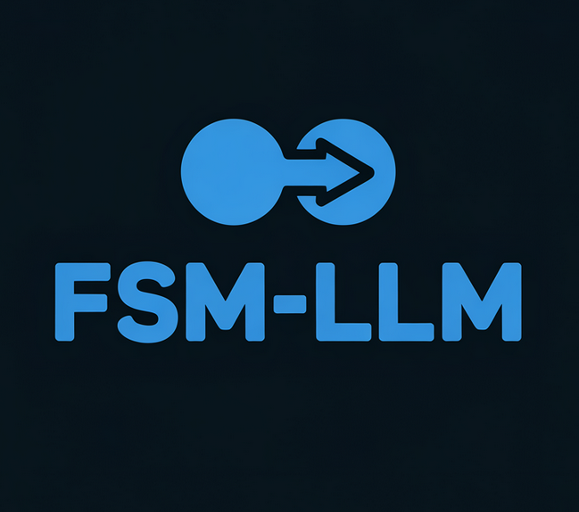
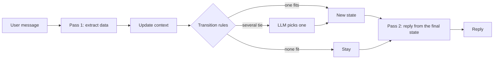

# FSM-LLM: Adding State to the Stateless

[](https://www.apache.org/licenses/LICENSE-2.0)
[](https://www.python.org)
[](https://badge.fury.io/py/fsm-llm)
[](https://github.com/NikolasMarkou/fsm_llm/actions)

<p align="center">
  
</p>

FSM-LLM is a Python framework for building chatbots and agents that follow a fixed structure. You describe the conversation as a finite state machine in JSON, and a large language model (LLM) does the language work inside each state.

Version 0.11.0. License Apache-2.0. Python 3.10, 3.11, 3.12.

## What it is for

LLMs write good text, but each call starts from nothing. A multi-turn conversation that must remember what it collected, follow a set flow, and make the same decision every time needs structure around the model.

A finite state machine (FSM) is a set of named states (such as "greeting", "collect email", "confirm"), each with one job, plus rules for moving between them. FSM-LLM splits the work:

- **The LLM handles language**: understanding the user, pulling out facts, and writing replies.
- **The FSM handles flow**: transition rules are plain JSON logic evaluated in Python, so they are predictable and testable.
- **The framework handles state**: what has been collected, which state the conversation is in, the history, hooks for your own code, and saving and restoring sessions.

On top of the core, the package ships six subpackages: reasoning strategies, an async workflow engine, 18 agent patterns, a web dashboard, an experimental planning harness, and evaluation tools.

## How it works

Every user message goes through two LLM passes:


```mermaid
flowchart LR
    U[User message] --> P1[Pass 1: extract data]
    P1 --> C[Update context]
    C --> T{Transition rules}
    T -- one fits --> S[New state]
    T -- several tie --> L[LLM picks one] --> S
    T -- none fit --> K[Stay]
    S --> P2[Pass 2: reply from the final state]
    K --> P2
    P2 --> R[Reply]
```

- The context is a dictionary of everything collected so far in one conversation.
- Transition rules use JsonLogic, a small JSON rule language, for example `{">=": [{"var": "age"}, 18]}`. If several transitions pass, the lowest `priority` number wins. The LLM is asked only when two or more tie at that lowest priority.
- Pass 2 runs after the transition, so the reply comes from the state the conversation is actually in. A state with empty `response_instructions` skips Pass 2.

Features of the core:

- **Handlers**: your functions run at 8 points (start, before and after processing, before and after a transition, context update, end, error).
- **Intent classification**: single, multi-intent and hierarchical classifiers, plus an intent router.
- **FSM stacking**: hand a conversation to a sub-FSM and come back with its results.
- **Streaming**: `converse_stream()` yields reply tokens as they arrive.
- **Sessions**: save and restore a conversation with `FileSessionStore`.
- **Working memory**: named buffers for agent-style scratch data.
- **Many LLM providers** through litellm (OpenAI, Anthropic, Ollama and others).
- **Security**: internal context keys are hidden and secret-looking keys are kept out of prompts. The compromised litellm 1.82.7 and 1.82.8 are below the required version, and `make audit` scans installed packages for malicious `.pth` files.

## Files

- `src/fsm_llm/` - the one source package: the core at the top level, and the subpackages `reasoning`, `workflows`, `agents`, `monitor`, `harness`, `eval`.
- `tests/` - the pytest suite (8,111 tests): one folder per part of the package, plus regression, example and packaging checks. The default run replaces the LLM with a fake.
- `examples/` - 100 runnable examples in 8 categories, each a folder with `run.py` and its FSM JSON.
- `docs/` - long guides: `quickstart.md`, `fsm_design.md`, `handlers.md`, `architecture.md`, `api_reference.md`, plus three dated Strands design records.
- `scripts/audit_pth.py` - scans installed packages for malicious or code-bearing `.pth` files (used by `make audit` and CI).
- `scripts/harness_bench.py` and `scripts/bench_data/` - pre-registered benchmarks of the harness on a local model, with their raw result rows.
- `evaluation/datasets/` - sample conversation datasets for `fsm-llm-eval run`. Evaluation runs are written next to it in dated folders.
- `images/` - the logo and diagram used by this file.
- `.github/workflows/python-package.yml` - CI on GitHub Actions.
- `pyproject.toml`, `Makefile`, `tox.ini`, `constraints.txt` - packaging, task shortcuts, test environments, exact version pins.
- `EVALUATE.md` - how examples are scored, and the log of past evaluation runs.
- `CHANGELOG.md`, `CONTRIBUTING.md`, `SECURITY.md` - release history, contributor rules, security policy.

## How to use it

### Install

```bash
pip install fsm-llm           # core
pip install "fsm-llm[all]"    # every optional dependency
```

Every subpackage is installed with the core. An extra only adds the third-party packages that subpackage needs.

| Extra | Command | Additional dependencies |
|-------|---------|------------------------|
| `reasoning` | `pip install "fsm-llm[reasoning]"` | None |
| `agents` | `pip install "fsm-llm[agents]"` | None |
| `workflows` | `pip install "fsm-llm[workflows]"` | None |
| `harness` | `pip install "fsm-llm[harness]"` | None (pulls `fsm-llm[agents]`) |
| `eval` | `pip install "fsm-llm[eval]"` | None |
| `monitor` | `pip install "fsm-llm[monitor]"` | fastapi, uvicorn, jinja2 |
| `mcp` | `pip install "fsm-llm[mcp]"` | mcp (>=1.0.0) |
| `otel` | `pip install "fsm-llm[otel]"` | opentelemetry-api, opentelemetry-sdk (>=1.20.0) |
| `a2a` | `pip install "fsm-llm[a2a]"` | httpx (>=0.24.0) |
| `all` | `pip install "fsm-llm[all]"` | All of the above |

### Quick start

**1. Define an FSM** (`greeting.json`):

```json
{
  "name": "GreetingBot",
  "description": "Greets the user, learns their name, then says goodbye",
  "initial_state": "greeting",
  "persona": "A friendly assistant",
  "states": {
    "greeting": {
      "id": "greeting",
      "description": "Greet the user and collect their name",
      "purpose": "Greet the user and ask their name",
      "extraction_instructions": "Extract the user's name if provided",
      "response_instructions": "Greet the user warmly and ask for their name if not yet known",
      "transitions": [
        {
          "target_state": "farewell",
          "description": "User wants to end the conversation",
          "conditions": [
            {
              "description": "User said goodbye",
              "requires_context_keys": ["wants_to_leave"],
              "logic": {"has_context": "wants_to_leave"}
            }
          ]
        }
      ]
    },
    "farewell": {
      "id": "farewell",
      "description": "Say goodbye",
      "purpose": "Say goodbye",
      "response_instructions": "Say a warm goodbye using the user's name if known"
    }
  }
}
```

A state with no transitions (here `farewell`) ends the conversation. `required_context_keys` on a state only tells Pass 1 what to extract. To block a transition until a value exists, use a condition like the one above.

**2. Run a conversation**:

```python
from fsm_llm import API

api = API.from_file("greeting.json", model="openai/gpt-4o-mini")
conversation_id, initial_response = api.start_conversation()

print(api.converse("Hi there! I'm Alice.", conversation_id))
print(api.converse("Goodbye!", conversation_id))
print(api.get_data(conversation_id))
```

Without `model=`, the `API` class uses the `LLM_MODEL` environment variable, then the default `ollama_chat/qwen3.5:4b` (a local Ollama model).

**3. Or use the command line**:

```bash
export OPENAI_API_KEY="your-key-here"
export LLM_MODEL="openai/gpt-4o-mini"   # required by the CLI
fsm-llm --fsm greeting.json
```

The `fsm-llm` command stops with `Missing required environment variable: LLM_MODEL` when `LLM_MODEL` is not set. It also reads `LLM_TEMPERATURE` (default `0.5`) and `LLM_MAX_TOKENS` (default `1000`). Provider keys such as `OPENAI_API_KEY` are read by litellm. `.env.example` lists these variables.

### Subpackages

| Package | What it adds |
|---------|--------------|
| `fsm_llm` | The core: FSM definitions, the 2-pass pipeline, handlers, classification, LLM access, sessions, validation, visualization |
| `fsm_llm.reasoning` | A problem solver that picks one of 9 reasoning styles, runs it as an FSM, checks the answer and retries up to 3 times |
| `fsm_llm.workflows` | An async in-memory workflow engine with 11 step types and a Python DSL |
| `fsm_llm.agents` | 18 agent patterns (ReAct, ReWOO, Reflexion, plan-and-execute, debate, orchestrator, ...), tools, human approval, memory, MCP and remote agents, and a meta-builder that designs FSMs, workflows and agents by chat |
| `fsm_llm.monitor` | A web dashboard to launch, watch and chat with FSMs, agents and workflows, with optional OpenTelemetry export |
| `fsm_llm.harness` | An experimental iterative planner (explore, plan, execute, reflect, pivot, close) as an FSM whose gates count files on disk |
| `fsm_llm.eval` | Scores the examples 0 to 4, or runs scripted conversations against any FSM several times and reports pass rates with confidence intervals |

`import fsm_llm` loads only the core. Import a subpackage by name, as below.

**Reasoning**:

```python
from fsm_llm.reasoning import ReasoningEngine
engine = ReasoningEngine(model="openai/gpt-4o-mini")
solution, trace = engine.solve_problem("What is the probability of rolling two sixes?")
```

**Workflows** (runs without an LLM):

```python
import asyncio
from fsm_llm.workflows import WorkflowEngine, auto_step, condition_step, create_workflow

wf = create_workflow("orders", "Order check")
wf.with_initial_step(auto_step("load", "Load order", next_state="route",
                               action=lambda ctx: {"amount": 1500}))
wf.with_step(condition_step("route", "Big order?", condition=lambda ctx: ctx["amount"] >= 1000,
                            true_state="review", false_state="done"))
wf.with_step(auto_step("review", "Manual review", next_state="done"))
wf.with_step(auto_step("done", "Finish", next_state=""))

async def main():
    engine = WorkflowEngine()
    engine.register_workflow(wf)
    instance_id = await engine.start_workflow("orders")
    print(engine.get_workflow_status(instance_id))

asyncio.run(main())
```

**Agents**:

```python
from fsm_llm.agents import create_agent, tool

@tool
def search(query: str) -> str:
    """Search the web for information."""
    return f"Results for: {query}"

agent = create_agent("react", [search], system_prompt="Cite your sources.")
result = agent("What is the capital of France?")
print(result.answer, result.success, result.stop_reason)
```

`success` is `True` only when the run reached its goal; a run stopped by its iteration budget still returns its last answer, with `success=False` and `stop_reason="max_iterations"`. See `src/fsm_llm/agents/README.md` for the patterns and `docs/agents_roadmap.md` for the 2026-09-29 agents audit.

**Monitor**:

```bash
fsm-llm-monitor   # serves http://127.0.0.1:8420
```

**Harness**:

```bash
fsm-llm-harness new "add a retry to the uploader"
fsm-llm-harness status   plans/plan-2026-07-22T101500-1a2b3c4d
fsm-llm-harness validate plans/plan-2026-07-22T101500-1a2b3c4d
```

The harness is experimental. Its gates are JSON rules over values counted from the plan directory, so a model's claim alone cannot open one. In the committed end-to-end bench on a 4B local model, 2 of 3 runs finished correctly; the 3-out-of-3 bar is not met.

**Evaluation**:

```bash
fsm-llm-eval examples --category agents
fsm-llm-eval run evaluation/datasets/simple_greeting_cases.json --trials 3
```

### Command-line tools

| Command | Description |
|---------|-------------|
| `fsm-llm --fsm <path.json>` | Chat with an FSM interactively |
| `fsm-llm-visualize --fsm <path.json>` | Draw an FSM as ASCII art |
| `fsm-llm-validate --fsm <path.json>` | Check an FSM definition for problems |
| `fsm-llm-monitor` | Launch the web dashboard |
| `fsm-llm-meta` | Build FSMs, workflows or agents by chatting |
| `fsm-llm-harness <new\|resume\|status\|validate\|close>` | Drive or audit an iterative-planner plan directory |
| `fsm-llm-eval <examples\|run>` | Score the examples, or run a conversation dataset and report pass rates |
| `python -m fsm_llm.reasoning "problem"` | Solve a problem with the reasoning engine (no console script) |

### Examples

100 examples across 8 categories, each runnable with `python examples/<category>/<name>/run.py` (OpenAI key, or a local Ollama as fallback):

| Category | Count | Highlights |
|----------|-------|------------|
| Basic | 14 | simple_greeting, form_filling, multi_turn_extraction |
| Intermediate | 3 | book_recommendation, product_recommendation, adaptive_quiz |
| Advanced | 17 | e_commerce (FSM stacking), support_pipeline, concurrent_conversations |
| Classification | 4 | intent_routing, smart_helpdesk, multi_intent |
| Reasoning | 1 | math_tutor |
| Workflows | 8 | order_processing, parallel_steps, conditional_branching |
| Agents | 48 | react_search, plan_execute, reflexion, debate, orchestrator |
| Meta | 5 | build_fsm, build_workflow, build_agent |

The examples are evaluation baselines: `fsm-llm-eval examples` runs them all in parallel and scores each 0 to 4 (run it from the repository root, or pass `--examples-dir`). Do not edit them unless asked. The scoring method and past runs are in `EVALUATE.md`.

### Development

```bash
python -m venv .venv && source .venv/bin/activate
make install-dev    # Install in dev mode with all extras + pre-commit hooks
make test           # Run full test suite (8,111 tests)
make lint           # ruff check src/ tests/
make format         # ruff format src/ tests/
make type-check     # mypy on src/fsm_llm/ (core and subpackages)
make build          # python -m build (wheel + sdist)
make coverage       # Tests with coverage report
make audit          # scan site-packages for suspicious .pth files
```

`pytest -m "not slow"` skips the slow tests. CI runs on GitHub Actions for Python 3.10, 3.11 and 3.12: `.pth` audit, ruff lint and format check, mypy, and pytest without the `slow`, `real_llm` and `integration` markers.

To contribute (details in `CONTRIBUTING.md`): fork, branch, run `make install-dev`, make your change with a test that fails before it, make sure `make lint`, `make type-check` and `make test` pass, add an entry under `Unreleased` in `CHANGELOG.md`, and open a pull request.

## Things to know

- The `fsm-llm` command needs `LLM_MODEL` set. The Python `API` falls back to `LLM_MODEL`, then to the local Ollama model `ollama_chat/qwen3.5:4b`.
- The library logs nothing until you call `setup_logging()` or `enable_debug_logging()`.
- One conversation handles one message at a time. A second `converse` on the same conversation while one is running raises `FSMError`.
- `required_context_keys` never blocks a transition. Use a transition condition to wait for a value.
- The default test run needs no network and no model. Live tests skip without a local Ollama; the harness live tests also need `FSM_LLM_HARNESS_LIVE=1`.
- Test counts written in `CLAUDE.md` and in this file are checked against a fresh collection by `tests/test_packaging.py`. After adding tests, re-measure with `pytest --collect-only -q | tail -1` and update them. The FSM JSON above is loaded by `tests/test_fsm_llm/test_docs_snippets.py`, so it must stay valid.
- Do not edit `examples/` unless asked: they are evaluation baselines and tests load their JSON.
- The harness is experimental and not production-ready.
- Evaluation scores are a heuristic and overstate quality; read the logs as well. Runs from before and after the 2026-09-29 restructure are not comparable.
- `constraints.txt` pins litellm and the dev tools to exact versions so CI and local runs match. The compromised litellm 1.82.7 and 1.82.8 are below the required version.
- Upgrading a clone from before the 2026-09-29 restructure: run `make clean`, then `pip install -e .`. A leftover `src/fsm_llm_<sub>/` folder breaks imports and tests.

## License

Apache License 2.0. See the `LICENSE` file.
