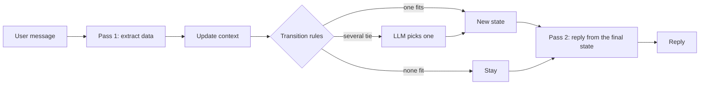

# FSM-LLM: Adding State to the Stateless

[](https://www.apache.org/licenses/LICENSE-2.0)
[](https://www.python.org)
[](https://github.com/NikolasMarkou/fsm_llm/actions/workflows/python-package.yml)

<p align="center">
  
</p>

FSM-LLM is a Python framework for chatbots and agents that follow a fixed structure: you describe the conversation as a finite state machine in JSON, and a language model does the language work inside each state.

Version 0.11.0, Apache-2.0, Python 3.10 to 3.12.

## Why it exists

An LLM call starts from nothing, and a multi-turn conversation that must collect data, follow a set flow and decide the same way every time needs structure around the model. FSM-LLM splits the work three ways:

- **The LLM handles language**: understanding the user, pulling out facts, writing replies.
- **The state machine handles flow**: transition rules are JSON logic evaluated in plain Python, so they are predictable and unit-testable. The LLM is asked to choose only when two rules tie.
- **The framework handles state**: what has been collected, which state you are in, history, your own hooks, and saving and restoring sessions.

Use it when the conversation has steps: forms and intake, onboarding, support triage, tutoring flows, anything where "what must happen next" is a rule and not a mood. Do not use it for open-ended chat with no structure (a plain LLM call is simpler), or when you need a hosted, production-hardened agent platform: the project is young, and one subpackage is explicitly experimental (see [Status](#status)).

## Quick start

`fsm-llm` on PyPI is a different, unrelated project, so install from a clone:

```bash
git clone https://github.com/NikolasMarkou/fsm_llm.git && cd fsm_llm
python -m venv .venv && source .venv/bin/activate
pip install -e .
```

Define the conversation (`greeter.json`). It asks for a name, then moves to a final state:

```json
{
  "name": "Greeter",
  "description": "Learns the user's name, then says goodbye",
  "initial_state": "ask_name",
  "persona": "A friendly assistant",
  "states": {
    "ask_name": {
      "id": "ask_name",
      "description": "Find out the user's name",
      "purpose": "Learn the user's name",
      "extraction_instructions": "Extract the user's name if they gave it",
      "response_instructions": "Greet the user and ask for their name if you do not know it yet",
      "required_context_keys": ["name"],
      "transitions": [
        {
          "target_state": "goodbye",
          "description": "The name is known",
          "conditions": [
            {
              "description": "A name was collected",
              "requires_context_keys": ["name"],
              "logic": {"has_context": "name"}
            }
          ]
        }
      ]
    },
    "goodbye": {
      "id": "goodbye",
      "description": "Say goodbye",
      "purpose": "Wrap up the conversation",
      "response_instructions": "Say a short goodbye to the user by name. Do not ask a question"
    }
  }
}
```

Run it:

```python
from fsm_llm import API

api = API.from_file("greeter.json")   # no model given: env LLM_MODEL, else ollama_chat/qwen3.5:4b
conv_id, opening = api.start_conversation()
print("bot:", opening)
print("bot:", api.converse("Hi, I'm Alice.", conv_id))
print(api.get_data(conv_id))
print(api.get_current_state(conv_id), api.has_conversation_ended(conv_id))
```

A real run against a local Ollama `qwen3.5:4b` (the wording differs on every run):

```text
bot: Hello! How do you do? I'm here to get to know you better. What's your name?
bot: Nice meeting you, Alice! It was a pleasure getting to know you.
{'name': 'Alice'}
goodbye True
```

To use a hosted model, pass `model=` (for example `API.from_file("greeter.json", model="openai/gpt-4o-mini")`) and set the provider key (`OPENAI_API_KEY`). Any litellm model string works.

A state with no transitions (`goodbye`) is terminal. `required_context_keys` only tells Pass 1 what to extract; it never blocks a transition, so the transition above carries its own condition (`requires_context_keys` plus `logic`).

The same thing with the fluent builder (`build()` is the only place that validates):

```python
from fsm_llm import APIBuilder

api = APIBuilder().set_definition("greeter.json").set_model("ollama_chat/qwen3.5:4b").set_temperature(0.2).build()
```

### Try it without a model

Pass your own `llm_interface` (a subclass of `LLMInterface`) and nothing touches the network. This is how the repository's tests run:

```python
from fsm_llm import API, LLMInterface
from fsm_llm.definitions import FieldExtractionResponse, ResponseGenerationResponse


class FakeLLM(LLMInterface):
    """Fixed reply and a fixed name; makes no network call."""

    def generate_response(self, request):
        return ResponseGenerationResponse(
            message="Nice to meet you!", message_type="response", reasoning="fake"
        )

    def extract_field(self, request):
        return FieldExtractionResponse(
            field_name=request.field_name, value="Alice", confidence=1.0,
            reasoning="fake", is_valid=True,
        )


api = API.from_file("greeter.json", llm_interface=FakeLLM())
conv_id, _ = api.start_conversation()
print(api.converse("anything", conv_id))                    # Nice to meet you!
print(api.get_data(conv_id), api.get_current_state(conv_id))  # {'name': 'Alice'} goodbye
```

`API` refuses `model=`, `temperature=` and similar settings next to `llm_interface=`, because the interface owns them.

## How it works

Every user message goes through two LLM passes:


```mermaid
flowchart LR
    U[User message] --> P1[Pass 1: extract data]
    P1 --> C[Update context]
    C --> T{Transition rules}
    T -- one fits --> S[New state]
    T -- several tie --> L[LLM picks one] --> S
    T -- none fit --> K[Stay]
    S --> P2[Pass 2: reply from the final state]
    K --> P2
    P2 --> R[Reply]
```

- The context is a dictionary of everything collected so far in one conversation.
- Transition rules use JsonLogic, for example `{">=": [{"var": "age"}, 18]}`. If several transitions pass, the lowest `priority` number wins outright. The LLM is asked only when two or more tie at that lowest priority. If none pass, the conversation stays put.
- Pass 2 runs after the transition, so the reply comes from the state the conversation is actually in. A state with empty `response_instructions` makes no LLM call, replies with `""` and adds nothing to the history.

What you get in the core:

- **Handlers**: your functions run at 8 points (start, before and after processing, before and after a transition, context update, end, error).
- **Intent classification**: `classification_extractions` on a state, plus `Classifier`, `HierarchicalClassifier` and `IntentRouter`.
- **FSM stacking**: hand a conversation to a sub-FSM and come back with its results.
- **Streaming**: `converse_stream()` yields reply tokens as they arrive.
- **Steps without a user message**: `advance()` runs one turn and returns an `AdvanceResult`; `run_until_terminal()` repeats it within a step and time budget (`RunBudgetExceededError`). Agents, the harness and the reasoning engine run on these loops.
- **Tool calling and structured output**: a state with the optional `completion` field makes one native tool-calling or JSON-schema call. Core runs no tool; your handlers do.
- **Sessions and memory**: `save_session`/`restore_session` with `FileSessionStore`, and `WorkingMemory` buffers.
- **Diagrams**: `build_fsm_graph()`, `to_mermaid()`, `to_dot()`, and `fsm-llm-visualize`.
- **Many providers** through litellm, behind one LLM layer (`src/fsm_llm/llm.py`, the only module that imports litellm) with per-interface call and token counters (`usage()`) and an embedder (`LiteLLMEmbedder`).
- **Context security**: internal keys (prefixes `_`, `system_`, `internal_`, `__`) and secret-looking entries are kept out of prompts. The compromised litellm 1.82.7 and 1.82.8 are below the required version, and `make audit` scans for malicious `.pth` files.

Design guides: [docs/fsm_design.md](docs/fsm_design.md) for states and transitions, [docs/handlers.md](docs/handlers.md) for hooks, [docs/architecture.md](docs/architecture.md) for the internals.

## What is in the box

`import fsm_llm` loads only the core. Every subpackage ships in every install; an extra only adds third-party dependencies. Import a subpackage by name.

| Subpackage | What it adds | Maturity |
|------------|--------------|----------|
| [`fsm_llm.reasoning`](src/fsm_llm/reasoning/README.md) | A solver that picks one of 9 reasoning strategies, runs it as stacked FSMs, validates the answer and retries up to 3 times | Tested offline; live behavior depends on the model |
| [`fsm_llm.workflows`](src/fsm_llm/workflows/README.md) | Async in-memory workflow engine, 11 step types, a Python DSL | Runs without an LLM unless you add LLM steps |
| [`fsm_llm.agents`](src/fsm_llm/agents/README.md) | 18 agent patterns (ReAct, ReWOO, Reflexion, plan-and-execute, debate, orchestrator, swarm, graph, native tool calling, ...), tools, human approval, memory, MCP, A2A, and a meta-builder that designs FSMs, workflows and agents by chat | Documented known limits, see [docs/agents_roadmap.md](docs/agents_roadmap.md) |
| [`fsm_llm.monitor`](src/fsm_llm/monitor/README.md) | FastAPI dashboard to launch, watch and chat with FSMs, agents and workflows, optional OpenTelemetry export | Needs the `monitor` extra |
| [`fsm_llm.harness`](src/fsm_llm/harness/README.md) | Iterative planner (explore, plan, execute, reflect, pivot, close) as an FSM whose gates count files on disk | **Experimental, not production-ready** |
| [`fsm_llm.eval`](src/fsm_llm/eval/README.md) | Scores the examples 0 to 4, or runs scripted conversations N times and reports pass rates with Wilson intervals | Scores are a heuristic that overstates quality; read the logs too |

An agent with one tool (this ran against the same local model and answered 42):

```python
from fsm_llm.agents import create_agent, tool


@tool
def add(a: int, b: int) -> int:
    """Add two integers."""
    return a + b


agent = create_agent("react", [add])
result = agent("What is 19 + 23? Use the add tool.")
print(result.answer, result.success, result.stop_reason)   # 19 + 23 equals 42. True answered
```

`success` is `True` only when the run reached its goal. A forced stop still returns its last answer, with `success=False` and a `stop_reason`.

A workflow (needs no LLM; prints `WorkflowStatus.COMPLETED`):

```python
import asyncio
from fsm_llm.workflows import WorkflowEngine, auto_step, condition_step, create_workflow

wf = create_workflow("orders", "Order check")
wf.with_initial_step(auto_step("load", "Load order", next_state="route",
                               action=lambda ctx: {"amount": 1500}))
wf.with_step(condition_step("route", "Big order?", condition=lambda ctx: ctx["amount"] >= 1000,
                            true_state="review", false_state="done"))
wf.with_step(auto_step("review", "Manual review", next_state="done"))
wf.with_step(auto_step("done", "Finish", next_state=""))


async def main():
    engine = WorkflowEngine()
    engine.register_workflow(wf)
    instance_id = await engine.start_workflow("orders")
    print(engine.get_workflow_status(instance_id))


asyncio.run(main())
```

**Builders.** Every part has a fluent builder that records calls and checks everything in `build()`, which raises `BuildError` (a `FSMError` and a `ValueError`, with `.errors`): `APIBuilder` and `FSMManagerBuilder` (core), `ConfiguredAgentBuilder` and `AgentGraphBuilder` (agents), `WorkflowBuilder` (workflows), `HarnessAgentBuilder` (harness). The convention is described in [src/fsm_llm/CLAUDE.md](src/fsm_llm/CLAUDE.md).

**Evaluation honesty.** The examples scorer reads each run's output with simple rules and gives 0 to 4. It overstates quality, and runs from before and after the 2026-09-29 restructure are not comparable. The method and the run log are in [EVALUATE.md](EVALUATE.md). Offline tests (the default) replace the model with a fake, so they say nothing about model quality.

### Extras

| Extra | Adds |
|-------|------|
| `reasoning`, `agents`, `workflows`, `eval` | No third-party packages (the code ships in every install) |
| `harness` | Pulls `fsm-llm[agents]` |
| `monitor` | fastapi, uvicorn, jinja2 |
| `mcp` | mcp (>=1.0.0) |
| `otel` | opentelemetry-api, opentelemetry-sdk (>=1.20.0) |
| `a2a` | httpx (>=0.24.0) |
| `all`, `dev` | Everything / everything plus the dev tools |

From a clone: `pip install -e ".[monitor]"`, `pip install -e ".[all]"`.

## Examples

100 runnable examples in 8 categories. Each is a folder with `run.py` and its FSM JSON:

```bash
python examples/basic/simple_greeting/run.py     # needs a model: an OpenAI key, or a local Ollama
```

| Category | Count | Highlights |
|----------|-------|------------|
| Basic | 14 | simple_greeting, form_filling, multi_turn_extraction |
| Intermediate | 3 | book_recommendation, product_recommendation, adaptive_quiz |
| Advanced | 17 | e_commerce (FSM stacking), support_pipeline, concurrent_conversations |
| Classification | 4 | intent_routing, smart_helpdesk, multi_intent |
| Reasoning | 1 | math_tutor |
| Workflows | 8 | order_processing, parallel_steps, conditional_branching |
| Agents | 48 | react_search, plan_execute, reflexion, debate, orchestrator |
| Meta | 5 | build_fsm, build_workflow, build_agent |

The examples are evaluation baselines: `fsm-llm-eval examples` runs them in parallel and scores each. Do not edit them unless a maintainer asks.

## Command-line tools

| Command | Description |
|---------|-------------|
| `fsm-llm --fsm <path.json>` | Chat with an FSM interactively (`--mode validate` and `--mode visualize` also exist) |
| `fsm-llm-visualize --fsm <path.json> [--format ascii\|mermaid\|dot]` | Draw an FSM |
| `fsm-llm-validate --fsm <path.json>` | Check an FSM definition for problems |
| `fsm-llm-monitor` | Web dashboard at http://127.0.0.1:8420 (`--host`, `--port`, `--no-browser`, `--api-key`, `--otel`) |
| `fsm-llm-meta [--model M] [--output FILE]` | Build FSMs, workflows or agents by chatting |
| `fsm-llm-harness <new\|resume\|status\|validate\|close>` | Drive or audit an iterative-planner plan directory |
| `fsm-llm-eval examples [--category C] [--fail-under PCT]` | Score every example 0 to 4 |
| `fsm-llm-eval run <dataset.json\|.jsonl> [--trials N]` | Run scripted conversations and report pass rates |
| `python -m fsm_llm.reasoning "problem" [--type T]` | Solve a problem with the reasoning engine (no console script) |

`fsm-llm` needs `LLM_MODEL` (set in the environment or a `.env` file) and stops with `Missing required environment variable: LLM_MODEL` without it. It also reads `LLM_TEMPERATURE` (default 0.5) and `LLM_MAX_TOKENS` (default 1000). `.env.example` lists the variables. Exit codes: 0 ok, 1 failure, 130 Ctrl-C; `fsm-llm-eval` exits 2 below `--fail-under`.

## Documentation

- [docs/README.md](docs/README.md): index of the guides.
- [docs/quickstart.md](docs/quickstart.md), [docs/fsm_design.md](docs/fsm_design.md), [docs/handlers.md](docs/handlers.md), [docs/architecture.md](docs/architecture.md), [docs/api_reference.md](docs/api_reference.md) (includes the monitor).
- [docs/agents_roadmap.md](docs/agents_roadmap.md): the agents audit record and deferred work.
- Per-package READMEs: [src/fsm_llm/](src/fsm_llm/README.md) (core), and one inside each subpackage folder (linked in the table above).
- [tests/README.md](tests/README.md): how the test suite is laid out.
- [CHANGELOG.md](CHANGELOG.md), [EVALUATE.md](EVALUATE.md), [SECURITY.md](SECURITY.md).

## Contributing

Contributions are welcome, from a typo fix to a new agent pattern. Full rules are in [CONTRIBUTING.md](CONTRIBUTING.md); report vulnerabilities as described in [SECURITY.md](SECURITY.md).

```bash
make install-dev    # editable install with every extra, plus pre-commit hooks
make test           # Run full test suite (9,978 tests)
make lint           # ruff check src/ tests/
make format         # ruff format src/ tests/
make type-check     # mypy on src/fsm_llm/
make audit          # scan site-packages for malicious .pth files
make build          # wheel and sdist
```

The default test run needs no network and no model. `pytest -m "not slow"` skips the slow tests. Live tests skip without a local Ollama; the harness live tests also need `FSM_LLM_HARNESS_LIVE=1`. CI runs Python 3.10, 3.11 and 3.12: `.pth` audit, ruff lint and format check, mypy, and pytest without the `slow`, `real_llm` and `integration` markers.

Rules to know before you open a pull request:

- A behavior change needs a test that fails on the code before your change.
- Add an entry under `Unreleased` in `CHANGELOG.md` for any public removal or rename.
- Do not edit `examples/` unless asked: they are evaluation baselines.
- litellm is imported only in `src/fsm_llm/llm.py`. Do not add a second request builder or provider call elsewhere.
- Internal-key and secret-key checks go through `fsm_llm.constants.has_internal_prefix` and `is_forbidden_context_entry`. Do not re-inline them.
- Read `# DECISION plan-<id>/D-NNN` comments before editing nearby code: they say what not to do and why.
- Test counts in this file and in `CLAUDE.md` are pinned by `tests/test_packaging.py`. After adding tests, re-measure with `pytest --collect-only -q | tail -1` and update them. Every FSM JSON block in this file is loaded by `tests/test_fsm_llm/test_docs_snippets.py`, so keep it valid.
- Commit messages follow `<type>(<scope>): <summary>`. Plan-step commits start with `[plan-YYYY-MM-DD-<8 hex>/iter-N/step-M]`.

Good places to help, all taken from recorded open items:

- **Agents** ([docs/agents_roadmap.md](docs/agents_roadmap.md), Known open items and Track B): `AgentGraph` has no failure routing, so a fallback branch cannot be built; Orchestrator subtasks dropped over `max_workers` do not affect `success`; a long generated artifact can be cut off by the per-field `max_tokens` budget and ship truncated; Swarm never hands off by itself; real human-in-the-loop for REWOO, PlanExecute, ParallelReact and native_fc; MCP v2 and A2A v1.0.
- **Core** (`CHANGELOG.md`, Unreleased, Known open): validating an `FSMDefinition` for the first time from several threads at once can race; the message-free `classification_extractions` path has offline coverage only; nothing was checked live on a non-Ollama provider.
- **Reasoning** (`CHANGELOG.md`, Known open): cheaper typed per-key reasoning fields were tried and reverted after losing answers on a pre-registered probe, so a new attempt needs its own probe; a `final_context` passed back as `initial_context` still carries the previous problem's analysis.
- **Harness** ([src/fsm_llm/harness/README.md](src/fsm_llm/harness/README.md)): the 3 of 3 bench bar is not met; in block B8 one run halted at `close-cap` (the approval was denied because `verification.md` stayed empty), one at `reflect-cap`, one at `plan-cap`.
- **Measurement**: every live number here comes from one small local model. Runs on other models and providers are welcome, as new pre-registered blocks (see `scripts/bench_data/README.md`).

## Status

- Version 0.11.0. Most tests are offline and use a fake model, so they check logic and wiring, not model quality.
- **The harness is experimental and not production-ready.** In the committed end-to-end block `scripts/bench_data/l6-e2e/B8` (`ollama_chat/qwen3.5:4b`, n=3), 2 of 3 runs met the floor (reached EXECUTE, wrote a verified file, halted with a named reason); the third stopped in PLAN. No run in any block closed a plan, and the 3 of 3 bar is not met. See [scripts/bench_data/README.md](scripts/bench_data/README.md).
- Evaluation scores are a heuristic and overstate quality. The recorded runs in [EVALUATE.md](EVALUATE.md) used a 4B local model, and scores on other models differ.

Things to know:

- The `fsm-llm` command needs `LLM_MODEL`. The Python `API` falls back to `LLM_MODEL`, then to `ollama_chat/qwen3.5:4b`.
- The library logs nothing until you call `setup_logging()` or `enable_debug_logging()`.
- One conversation handles one message at a time: a second `converse` on a conversation that is mid-turn raises `FSMError`.
- Upgrading a clone from before the 2026-09-29 restructure: delete the old `src/fsm_llm_<sub>/` folders by hand (`make clean` does not remove them), then `pip install -e .`. A leftover folder breaks imports.
- `constraints.txt` pins litellm and the dev tools to exact versions so CI and local runs match.

## License

Apache License 2.0. See the [LICENSE](LICENSE) file.
