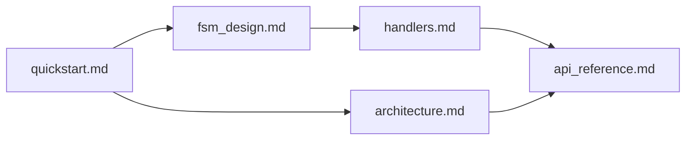

# docs

The `docs/` folder at the root of the FSM-LLM repository holds the long-form user guides for the framework. FSM-LLM is a Python library that runs conversations as JSON-defined finite state machines (FSMs), with an LLM doing data extraction and response writing. It contains Markdown files only, no code.

## What it is for

The package READMEs say what each part is. These guides go further: they teach you to build a bot, design states and transitions, write handlers, and they list the public API. Five files are current guides for version 0.11.0, and each one starts with the line `> Covers FSM-LLM v0.11.0`. The other three are historical design records from the "Strands" initiative. That work adapted features from the Strands Agents SDK, and all of it shipped in v0.4.0. Those three are kept to explain design choices. Do not use them as a usage guide. `agents_audit_and_roadmap.md` is a dated design record: an audit of the agents subpackage and a phased plan for it.

## How it works

Read the current guides in this order:



- Start with `quickstart.md` to install the package and run a first bot.
- `fsm_design.md` covers how to shape states and transitions. It ends with a link to `handlers.md`.
- `architecture.md` explains how a message moves through the system.
- `api_reference.md` is the lookup table for classes, methods, CLIs and exceptions.

Some tests read these files. `tests/test_fsm_llm/test_docs_snippets.py` finds every fenced `json` or `python` block that contains `"initial_state"` in `quickstart.md`, `api_reference.md`, `architecture.md`, `fsm_design.md` and `handlers.md`, and loads it through `FSMDefinition`. A broken full FSM example fails the test suite. `tests/test_fsm_llm_regression/test_regression_cli_and_exports.py` checks that `quickstart.md` does not mention `examples/basic/quiz`, `examples/intermediate/customer_service` or `python main.py`.

## Files

- `quickstart.md` - install, API key and environment variables (`LLM_MODEL`, `LLM_TEMPERATURE`, `LLM_MAX_TOKENS`, `FSM_PATH`), a first bot (`friendly_greeter`), a first handler, streaming and session persistence, CLI commands, troubleshooting.
- `fsm_design.md` - design guide: one purpose per state, JsonLogic transitions, patterns (Gatekeeper, Collector, Router, Confirmer), priority and ambiguity, `evaluation_priority`, `llm_description`, context scope, `handler_only_keys`, how corrections work, FSM stacking, anti-patterns, validation.
- `handlers.md` - the 8 handler timings, the `HandlerBuilder` methods, `error_mode` (`"continue"` or `"raise"`), critical handlers, what ERROR handlers can and cannot do, common patterns, testing, how each extension uses handlers.
- `architecture.md` - the 2-pass design, core components (`api.py`, `fsm.py`, `pipeline.py`, `prompts.py`, `handlers.py`, `llm.py`, `transition_evaluator.py`), message, start and streaming flows, context handling, stacked-FSM merge rules, security, performance, how the six extension subpackages plug in, a detailed section on the harness, extension points.
- `api_reference.md` - `API` constructor and methods, `HandlerBuilder`, `HandlerTiming`, `LLMInterface`, `WorkingMemory`, `TransitionEvaluatorConfig`, classification, reasoning, agents, workflows, harness, eval (CLI, `EvalConfig`, dataset schema, output files), monitor, exception tree, constants.
- `strands_features.md` - historical: the report that picked 12 Strands features to adapt, plus the features it rejected.
- `strands_features_phase_1.md` - historical: delivery note for schema-enforced output, the hidden `metadata` memory buffer, response streaming and session persistence (commit `a7e3d88`).
- `strands_features_phase_2.md` - historical: plan for the other 8 features (OTEL, swarm, agent graph, MCP, semantic tool retrieval, dependency-based workflow parallelism, SOPs, A2A).
- `agents_audit_and_roadmap.md` - design record (2026-09-29): audit findings for `fsm_llm.agents`, a 2026 state-of-the-art gap analysis, a target agent runtime, and a phased implementation plan.

## How to use it

Open the files in any Markdown viewer. Snippets assume the package is installed:

```bash
pip install fsm-llm
python examples/basic/form_filling/run.py
```

After editing a guide, run the snippet tests:

```bash
.venv/bin/python -m pytest tests/test_fsm_llm/test_docs_snippets.py tests/test_fsm_llm_regression/test_regression_cli_and_exports.py
```

## Things to know

- Extensions are documented as subpackages of `fsm_llm`: `fsm_llm.reasoning`, `fsm_llm.workflows`, `fsm_llm.agents`, `fsm_llm.monitor`, `fsm_llm.harness`, `fsm_llm.eval`. This matches the code under `src/fsm_llm/`.
- The Strands files quote counts, file paths and "not yet implemented" lists as they were when written. Some of those paths use the subpackage layout. Their counts are not current.
- `required_context_keys` never blocks a transition. The guides gate transitions with a condition (`requires_context_keys` plus `logic`). Keep new examples consistent with this.
- Source code points to these files by name: `src/fsm_llm/fsm.py` mentions `docs/architecture.md` and `docs/handlers.md`. Renaming a file breaks those pointers and the tests above.
