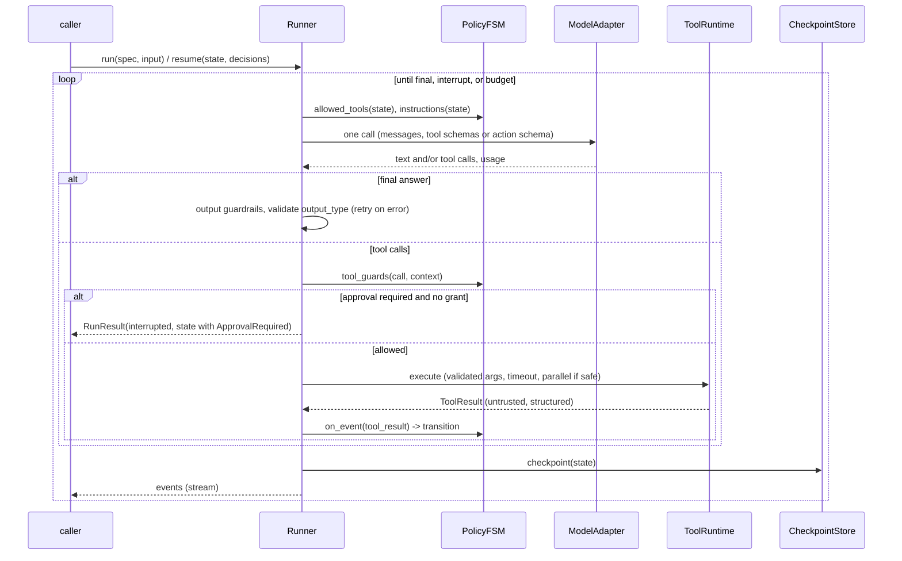
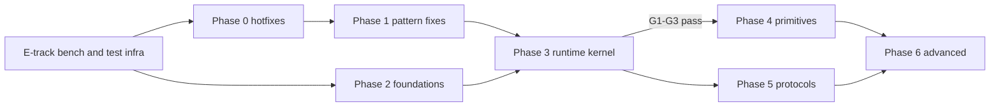

# fsm_llm.agents: audit and roadmap

> **Design record (2026-09-29, commit `4a5af49`, v0.11.0).** This is a planning document, not a usage guide. It holds an audit of `src/fsm_llm/agents`, a survey of the 2026 state of the art, and a phased plan. File and line references, counts and test numbers are as of that commit. For current usage see [api_reference.md](api_reference.md) and `src/fsm_llm/agents/README.md`.

## 0. Scope and method

- **Scope.** All 50 modules of `src/fsm_llm/agents` (about 17,500 lines). The audit also covers the core code paths the agents drive (`pipeline.py`, `fsm.py`, `llm.py`, `handlers.py`, `context.py`) and the consumers of the package (`harness/`, `monitor/`, `workflows` `AgentStep`, `examples/agents/`, `EVALUATE.md`).
- **Method.** Four parallel code audits, each reading every line of its area:
  1. ReAct core and HITL.
  2. Planner and multi-agent patterns.
  3. Tools, memory, MCP, remote and `native_fc`.
  4. Meta-builder, API surface, tests and eval.

  A fifth pass surveyed the 2026 state of the art. Every Critical and High finding was then re-checked against the source by the author of this document.
- **Limits.**
  - This environment's network policy blocks `pypi.org`, so no dependency could be installed and no test, lint or type check ran.
  - A finding is verified by code trace (reading the full path through core) unless it is tagged:
    - `[exec]`: the repo function's logic was reproduced and run in a stdlib-only replica.
    - `[unverified]`: the behaviour was not traced to the end.
  - The state-of-the-art survey comes from web-search extracts, because page fetches were blocked. Section 5 marks the claims that come only from secondary sources.
- **Severity.**
  - **Critical**: wrong results on the default path.
  - **High**: a broken security boundary, data loss, or a pattern that does not do what it says.
  - **Medium**: a real defect with a workaround or a narrower trigger.
  - **Low**: polish, docs, dead code.

## 1. Executive summary

**The foundations are good in places.** The HITL grant holds on every path that has HITL:
- The grant is driver-only and bound to the exact call.
- One approval covers one call.
- The model cannot forge it.

Transition routing is deterministic and auditable, the DECISION-anchor discipline records real failures, and the pattern coverage is broad.

**The main problem is structural: agents run on an engine built for user conversations.** Each agent drives an FSM by sending `"Continue."` through the 2-pass pipeline (extract from the user message, route, respond). Most of the serious defects are one class of bug that follows from that:

| Symptom | Where it bites | Section |
| --- | --- | --- |
| Pass 1's bulk extraction call sees only the instructions and the text `"Continue."`: no task, no context, no history | Debate rounds, MakerChecker drafts and revisions, PromptChain steps, the PlanExecute executor, Reflexion lessons, ReAct `reasoning` are all generated blind | LOOP-01 |
| Core extracts a key only while it is unset, so loop content is frozen after round 1 | Debate, PlanExecute `step_result`, PromptChain, Reflexion `reflection`, ReAct `reasoning` | LOOP-02 |
| Terminal states never extract in agent FSMs | `final_answer`, `confidence` and output-schema fields are never populated; answer precedence then prefers stale intermediate keys (Debate returns the judge verdict; ADaPT returns the failed first attempt) | LOOP-03 |
| One ReAct tool step costs 4 to 7 sequential LLM calls, and `max_iterations` counts FSM transitions | `max_iterations=10` gives 5 tool calls; a native tool-calling loop needs 1 call per step | LOOP-04, LOOP-07 |

**The repo has already measured the cost.**
- Harness D-049, on `ollama_chat/qwen3.5:4b`: the FSM `ReactAgent` scored **0/10** and issued one tool call in 20 dispatches. `NativeFunctionCallingReactAgent` scored **5/10** (Fisher p = 0.033). See `harness/roles.py:1047`.
- Harness D-021: standing instructions in the system message scored 4/5, against 0/5 in the user turn. No FSM agent has a system-prompt channel at all (API-01).

**Security findings.**
- High: `AgentServer` passes the caller's `context` straight into the run, so a remote caller can forge the driver-only HITL grant and run a gated tool with no human asked (SEC-01).
- High: tool-argument heuristics re-invoke side-effecting tools, or move a named argument into the wrong parameter (TOOL-01, TOOL-02).
- HITL is silently absent in 4 tool-running patterns, and passing `hitl=` to them is not rejected (SEC-02).
- The `requires_approval` flag does nothing on its own (SEC-03).
- Memory tools read and write the hidden `metadata` buffer (SEC-05).

**Platform gaps against 2026 table stakes.** The package has none of the following:
- async, event streaming, cancellation;
- checkpoint and resume, serializable HITL interruptions;
- token and cost accounting, guardrails;
- a system prompt / instructions field.

Its integrations are also thin: the MCP client reconnects on every call over a deprecated transport, and `remote.py` "A2A" is a custom REST API.

**Recommendation: two tracks.**
- **Track A, stabilize (Phases 0-1, about 3 to 5 weeks).** Fix security, data loss and pattern-breaking bugs in place. The changes stay inside `agents/` wherever possible, and a bench baseline is taken first.
- **Track B, a state-constrained agent runtime (Phases 2-5).**
  - One LLM call per step: provider-native tool calls, or grammar-constrained action JSON for small models.
  - The FSM stays as the *policy* layer: state-scoped tools, JsonLogic guards on tool calls, auditable transitions.
  - Async core with sync facades, typed events, a serializable `RunState` with interruptions and checkpoints, and shared budgets and usage accounting.
  - The 18 patterns collapse into 8 primitives plus recipes. The legacy classes become facades.
  - The switch of default is gated on the existing 4B bench.

| Metric | Today | Target |
| --- | --- | --- |
| LLM calls per ReAct tool step | 4-7, sequential | 1 |
| Tool steps at `max_iterations=10` | 5 | 10 |
| FSM ReAct, harness L4 EXECUTE bench (4B) | 0/10 | at least the `native_fc` arm (5/10), then the plan bar of 4/5 |
| Tool-running patterns with HITL | 3 of 7 | all |
| Async, event stream, resume after interrupt | none | all agents |
| Token/cost in `AgentResult` | none | per model call, per run, per child |

## 2. Root causes

Almost every finding in section 3 traces back to one of these eight.

1. **RC1. A conversational pipeline used as an agent engine.** Pass 1 is built to extract data from a *user message*. In an agent loop that message is always `"Continue."`. Four behaviours of the pipeline were each reasonable for chat, and each breaks agent loops:
   - The bulk call has no context.
   - Keys are extracted only while unset (skip-if-set).
   - Agent FSMs get no post-transition extraction.
   - Intermediate states run Pass 2.

   Every pattern then patches the damage by hand with key-clearing handlers (D-009, D-013), and the clears missed Debate, PlanExecute, PromptChain, Reflexion and ReAct `reasoning`. Findings: LOOP-01..13, PAT-01..08, REACT-01.
2. **RC2. No trust boundary on inputs.**
   - Caller `initial_context`, model-extracted keys and driver-only keys share one namespace.
   - Tool output is not labelled untrusted.
   - `is_forbidden_context_entry` is used nowhere in `agents/`.

   Findings: SEC-01, SEC-05..08, LOOP-12.
3. **RC3. Tool binding by heuristics, on the side-effect path.** A `TypeError` retry, positional remapping, dict-vs-kwargs guessing and task-as-argument recovery sit exactly where side effects happen. Argument validation is missing: `ToolValidationError` has no raise site. Findings: TOOL-01..05, SEC-11.
4. **RC4. `success` has no single meaning.**
   - There are at least 7 rules.
   - Fake control-action `ToolCall`s (`decompose`, `delegate`) count as tool use.
   - Forced passes and rejected verifications report `True`.
   - There is no `stop_reason`.

   Findings: API-04, PAT-04, PAT-05, PAT-09, PAT-11, REACT-04, TOOL-14.
5. **RC5. Composition by raw context dumps.** AgentGraph, Swarm, ADaPT and the orchestrator pass whole `final_context` dicts between agents. Those dicts collide with control keys and skip-if-set. Budgets are not propagated to children. Findings: PAT-04, PAT-07, PAT-08, PAT-10, LOOP-12.
6. **RC6. Coarse budgets and silent failures.**
   - The timeout is checked only between turns.
   - Handler errors are swallowed (`handler_error_mode="continue"`).
   - Provider errors in per-field calls look like stalls.
   - There is no usage accounting, and no partial result on a budget error.

   Findings: LOOP-14, OBS-01..05.
7. **RC7. Integrations are shims.** The MCP client is stateless and reconnects per call over legacy SSE. "A2A" is a bespoke REST API. Findings: INT-01..06.
8. **RC8. Tests cannot see the RC1 class.**
   - Fake LLMs answer every key a prompt names, whatever the prompt contains.
   - Streaming is tested against a fake API.
   - Swarm, Graph and VerifiedReact are tested with `run` patched out.
   - REWOO and PromptChain never run end to end.

   Findings: TEST-01..05.

## 3. Findings

`file:line` paths are relative to `src/fsm_llm/` unless they start with `tests/`.

### 3.1 Loop core and engine interaction (LOOP)

| ID | Sev | Where | Finding | Fix |
| --- | --- | --- | --- | --- |
| LOOP-01 | Critical | `pipeline.py:1281-1289`, `llm.py:637-642`; builders in `agents/fsm_definitions.py` | **Blind bulk extraction.** When a state has `extraction_instructions`, the pipeline runs a bulk call. Its prompt holds only those instructions plus "User message: Continue." and "Only include keys for information actually present in the user's message". The call sends `[system, user]` only: no context, no history. Keys produced *only* this way include:  - Debate: `proposition`, `critique`, `counter_argument`, `judge_verdict` - MakerChecker: `draft_output` in make and revise - PromptChain: every step's output - PlanExecute `execute_step`: `step_result`, `tool_name`, `tool_input` - ADaPT: `operator` - Reflexion: `lessons`, `evaluation_feedback` - ReAct: `reasoning` | Declare every generated key as a typed `field_extractions` entry (per-field calls do receive context and history), and leave state-level `extraction_instructions` empty so the bulk pass never runs. Longer term, the runtime in section 6 removes Pass 1 from agent loops. |
| LOOP-02 | High | `debate.py:173-202`, `plan_execute.py:232`, `prompt_chain.py:173-177`, `reflexion.py:204-243`, `handlers.py` (REASONING never cleared) | **Skip-if-set freezes loop content.** Only the drafts (D-013), `consensus_reached` and `all_collected` (D-009) are cleared each round. Frozen after round 1: - Debate round content, so `DebateRound` entries are identical - PlanExecute `step_result`, so every step records step 1's text - PromptChain `chain_step_result` - Reflexion `reflection` and `lessons` - ReAct `reasoning`, which is therefore the same in every trace step and in every `ApprovalRequest` | A generic `make_fresh_keys_handler(keys)` on entry to the producing state, applied to all of them. Better, a declarative per-state list of keys to re-extract on each visit. |
| LOOP-03 | High | `pipeline.py:1092-1093`, `fsm.py:839`, `agents/fsm_definitions.py:1079-1096`, `agents/base.py:417-446` | **Terminal states never extract.** Agent FSMs skip post-transition extraction, and the loop ends on entry to a terminal state. So the extraction instructions and `required_context_keys` of `conclude`, `synthesize`, `solve`, `output`, `combine` and `generate` are dead. `final_answer`, `confidence` and output-schema fields are never set. `_extract_answer` falls back to the Pass-2 prose, or to a stale intermediate key where the pattern lists one. | Make the terminal Pass-2 response canonical, delete the dead instructions, and fix answer precedence per pattern (PAT-03, PAT-04). Alternative: one extraction on terminal entry for agent FSMs. |
| LOOP-04 | High | `agents/base.py:239-250`, `agents/handlers.py:372-397` | **`max_iterations` counts every FSM transition.** The limiter runs at PRE_TRANSITION with no state filter, so think->act and act->think both count. The default of 10 yields 5 tool calls; 1, 2 or 3 each yield 1. `iterations_used` reports transitions. Reflexion gets about 2 cycles. | Count only on `think` exit. Rename the internal count, or document it. |
| LOOP-05 | Medium | `agents/handlers.py:257-268, 390-395` | The limiter forces a stop at think->act, but the act-entry executor still runs the tool and then clears `should_terminate`. That costs one extra tool run and one wasted think turn (4+ calls). | Skip execution when `max_iterations_reached is True`, and never clear a forced `should_terminate`. |
| LOOP-06 | Medium | `agents/handlers.py:88-146, 312-320`, `agents/base.py:638-650`, `context.py:72` | **Feedback is deleted before any prompt reads it.** These messages are written only to `tool_result`: - "You must use at least one tool" - "WARNING: No tool was called" - stall - "needs human approval"  The next turn is the act->think bounce, whose PRE_PROCESSING `ContextCompactor` deletes `tool_result`. A HITL denial writes no observation, so the model proposes the same call again and the human is asked again. | Write a separate `agent_feedback` key, cleared on think exit. Record a denial as an observation. |
| LOOP-07 | Medium | `pipeline.py:1443, 1492-1717`; `agents/fsm_definitions.py:1015-1030` | **Cost.** A think turn makes: - 3 `extract_field` calls (`should_terminate` as `any`, `tool_name`, `tool_input`) - 0 to 3 retries for nulls - 1 bulk call, which runs even when every field is already set (`has_field_configs` is computed before the skip filter)  That is 4 to 7 sequential calls. The tool catalogue is sent 4 times per turn and the context 3 times. | Short term: typed fields plus no bulk pass (LOOP-01). Target: 1 call per step (section 6). |
| LOOP-08 | Medium | `agents/handlers.py:242-255`, `pipeline.py:1768-1785`, `agents/reasoning_react.py:244-271` | **Context bloat.** `agent_trace` is user-visible, unbounded, and repeats every observation. It is serialised into every per-field prompt next to `observations` (20 x 2 KB). ReasoningReact observations are neither truncated nor pruned. | Keep the trace out of prompts (internal key or `context_scope.read_keys`) and cap both lists. |
| LOOP-09 | Medium | `agents/fsm_definitions.py:514-517, 684, 744, 1418, 1431` | **Wasted Pass-2 calls and poisoned history.** Several intermediate states have non-empty `response_instructions`: Reflexion `evaluate`/`reflect`, `await_approval` (nobody reads its text), REWOO `plan_all`/`execute_plans`. The initial states of 8 patterns pay a greeting call before any work, which is the same history poisoning D-006 fixed for ReAct. This breaks the package rule. | Empty them. Pass-2 text belongs only in terminal states. |
| LOOP-10 | Medium | `agents/fsm_definitions.py:247, 679-682, 1019-1023, 1655-1659`; `pipeline.py:160` | **Untyped routing fields.** `should_terminate`, `evaluation_passed`, `attempt_succeeded`, `checker_passed` and `quality_score` are auto-minted as `any`. The Ollama `any` grammar allows strings, and nothing coerces them: `"true"` never matches `{"==": [.., true]}`, and `"false"` is truthy in handlers. | Use `_bool_decision_field_extractions` plus a float field, as `collect`/`judge` already do. |
| LOOP-11 | Medium | core `prompts.py:1462`; `agents/prompts.py:61-139` | Every per-field prompt says "extract from the user's message", and that message is `"Continue."`. The task exists only inside the context JSON. | Point the agent instructions at the `task` and `observations` keys explicitly, or send the task as the turn message. |
| LOOP-12 | Medium | `agents/base.py:190-233` | `_init_context` resets only 4 keys. It keeps `should_terminate`, `observation_count`, `final_answer`, `reasoning` and `approval_*` from `initial_context`. `observation_count` is not seeded, so the blind bulk call can plant it and satisfy the D-008 evidence guard. That is the same forgery class D-007 closed for `max_iterations_reached`. | Reset a `RUN_OUTPUT_KEYS` set and seed `observation_count=0`. |
| LOOP-13 | Medium | `agents/base.py:669-722`, `pipeline.py:797-805`, `agents/react.py:121-159` | **`run_stream` differs from `run`.** - It yields the literal markers `"[think]"` and `"[act]"`. - It does not wrap errors in `AgentError`. - It returns no result. - `VerifiedReactAgent` and `AutoMemoryReactAgent` inherit it and silently skip verification and memory. - Only ReAct streams at all.  `tests/.../test_run_stream.py` uses a fake API, so it cannot catch this. | Filter the markers, end the stream with a result event, and override or raise in the subclasses. Replaced by typed events in section 6. |
| LOOP-14 | Medium | core `handlers.py:430-447`; `agents/base.py:252-264` | **Handler failures are swallowed.** With `handler_timeout` set through `api_kwargs`, a timed-out tool executor is dropped but its thread keeps running. The approval grant is not consumed, so the next turn runs the same approved gated call again. That breaks D-015's "one approval = one call". | Mark the executor and limiter `critical()`, and consume the grant and clear the selection before invoking the tool. |
| LOOP-15 | Low | `agents/base.py:856-917` | **Structured-output precedence.** - Step 1 builds the schema from coincidental context keys, so an all-optional schema returns a hollow object and ignores the constrained Pass-2 JSON. - Step 3 turns raw tool JSON into `structured_output` without the model ever seeing it. - A prose answer always logs a WARNING. | Parse the answer first. Make step 3 opt-in. |
| LOOP-16 | Low | `agents/handlers.py:219-251`, `llm.py:117` | **Trace problems.** - Step numbers come from `len(observations)` after pruning, so every step after the 20th is `[Step 21]` `[exec]`. - `thought` is empty or frozen: the bulk envelope drops a flat `reasoning` key (`_BULK_ENVELOPE_KEYS`), and the key is never cleared. | Use a monotonic step counter and a typed `reasoning` field. |
| LOOP-17 | Low | `agents/base.py:399-411`, `agents/exceptions.py` | The `BudgetExhaustedError` message cites `max_iterations` (10), not the ceiling (30). Budget and timeout errors carry no partial trace or observations. | Include the ceiling and attach the partial `AgentResult`. |

### 3.2 Security and trust boundaries (SEC)

| ID | Sev | Where | Finding | Fix |
| --- | --- | --- | --- | --- |
| SEC-01 | High | `agents/remote.py:223, 261`; `agents/base.py:202, 337`; core `definitions.py:1371-1380` | **Remote HITL bypass.** `AgentServer` passes the request's `context` as `initial_context`, and core only *warns* on internal-prefix keys. A caller can send three things: - `_approval_granted = {"tool_name": X, "parameters": P}` - `approval_granted: true`, so the driver skips asking - a preset `tool_name`/`tool_input`, which is never re-extracted, so the gate (`when_keys_updated(TOOL_NAME)`) never fires  `approval_refusal` then finds a matching grant and runs the gated tool. This is reachable by anyone when `api_key=None`. In-process callers who forward user input as `initial_context` are exposed the same way. | In `_init_context`, drop every internal-prefix key and `DRIVER_APPROVAL` from caller input. In `AgentServer`, also drop the control keys (`approval_*`, `tool_*`, `should_terminate`, `observation*`, `max_iterations_reached`), or accept only an allowlist. Add a regression test that posts a forged grant. |
| SEC-02 | High | `agents/parallel_react.py:183-194`, `agents/rewoo.py`, `agents/plan_execute.py`, `agents/native_fc.py`, `agents/__init__.py:217` | **HITL silently dropped.** `hitl=` passed to a pattern without HITL falls into `**api_kwargs`, then goes `API` -> `LiteLLMInterface.kwargs` -> `litellm.completion(hitl=...)` `[unverified at the provider]`. No gate is registered, and the `create_agent` docstring invites this (`**kwargs ... (config, hitl, etc.)`). | Reject unknown constructor kwargs (whitelist the `API` parameters). Raise when `hitl` is given to a pattern without HITL. |
| SEC-03 | High | `agents/base.py:284-315`, `agents/definitions.py:52` | `@tool(requires_approval=True)` is never read at runtime. `HumanInTheLoop(approval_callback=cb)` with no policy runs flagged tools unapproved and gives no warning. The gap is documented, and it is still a footgun. | When a callback is set and there is no policy, default the policy to the tool flag. Warn at construction. |
| SEC-04 | High | `agents/rewoo.py:123-209`, `agents/plan_execute.py`, `agents/parallel_react.py`, `agents/native_fc.py` | 4 of 7 tool-running patterns have no HITL (documented). REWOO's `#E` substitution also pipes one tool's output straight into the next tool's arguments, a direct data-flow path for indirect prompt injection. | Route every tool execution through one runtime that enforces policy (Phase 3). Until then, refuse registries with gated tools in these patterns. |
| SEC-05 | Medium | `agents/memory_tools.py:61, 91-138` | `list_memories("all"/"metadata")` dumps the hidden `metadata` buffer. `remember(buffer="metadata")` overwrites it and `forget` deletes from it. Values are not secret-filtered. `[exec]`: listed `billing_api_key = sk-live-123` and escalated `user_role` from `viewer` to `admin`. | Reject hidden buffers in all four tools, make `buffer` an enum of visible buffers, and filter values with `is_forbidden_context_entry`. |
| SEC-06 | Medium | `agents/handlers.py:220-249`, `agents/parallel_react.py:302-310`, `agents/hitl.py:108-112` | **Secrets escape as strings.** Tool arguments are stringified into observations (`Input: {...}`), trace actions and INFO logs, which bypasses the prompt filter. `is_forbidden_context_entry` is used nowhere in `agents/`. The approval `context_summary` includes `agent_trace` and secret-named keys. | Render arguments through the core security filter before stringifying, and apply it to `context_summary`. |
| SEC-07 | Medium | `agents/handlers.py:209-231`, `agents/prompts.py:61-139`, `agents/mcp.py:273-281` | Tool outputs and remote-controlled MCP tool descriptions enter prompts with no "untrusted data" framing. There is no pinning of discovered tool definitions (rug pull). | Add provenance labels and spotlighting, and hash-pin MCP tool definitions (Phase 6). |
| SEC-08 | Medium | `agents/auto_memory.py:167-212`, `agents/semantic_memory.py:170-195` | **AutoMemory problems.** - It stores every Q/A by default, including wrong answers, and the raw task when the run raised. That makes persistent prompt injection possible. - Recalled text is prepended to the task, the highest-trust slot. - The store has no namespace, so behind `AgentServer` caller A's data is recalled into caller B's prompt. | Namespaces, recall into a labelled context key, and store only successful answers by default. |
| SEC-09 | Medium | `agents/remote.py:219-277` | **`AgentServer` robustness.** - No concurrency bound (default thread pool). - Timed-out runs keep their threads. - 500 and SSE error bodies return `str(e)`. - No rate limit (documented). | A semaphore returning 429, a bounded executor, a cooperative deadline, and a generic error body with a correlation id. |
| SEC-10 | Low | `agents/skills.py:96-112, 203-224` | `SkillLoader.from_directory` executes files (documented). `pattern="**/*.py"` recurses, the `_` filter checks the file name only, and there is no hash manifest. | Offer an optional sha256 manifest. Prefer entry points. |
| SEC-11 | Low | `agents/handlers.py:157-190` (D-030) | Empty-input recovery passes the whole task text as an argument the model never chose, e.g. `send_email(body=<task>)`, `run_sql(query=<task>)`. The decision is flagged here as unsafe for side-effecting tools. | Recover only for tools marked read-only; otherwise return "missing parameter X". |
| SEC-12 | Low | `agents/composition.py:101-141` | `default_llm_judge` embeds the raw output in its own prompt, which invites self-grading injection. `{"score": NaN}` clamps to 1.0 and passes `[exec]`. It has no timeout. | Reject NaN, delimit the output, add a timeout. |

### 3.3 Tool layer (TOOL)

| ID | Sev | Where | Finding | Fix |
| --- | --- | --- | --- | --- |
| TOOL-01 | High | `agents/tools.py:299` | `try: return fn(**params) except TypeError:` wraps the *call*. A `TypeError` raised inside the tool body after its side effect makes the fallback call the tool again. `[exec]`: `charge_card` ran twice under `ToolRegistry` and 6 times under `RetryingToolRegistry(max_retries=2)`. | Bind first with `inspect.signature(fn).bind(**params)`, and only fall back if binding fails. Never catch a `TypeError` coming from the tool body. |
| TOOL-02 | High | `agents/tools.py:300-332, 286-295` | The positional fallback moves a correctly named optional argument into a missing required one. `[exec]`: - `delete_rows(table, limit=10)` with `{"limit": 500}` ran as `table=500`. - `get_user(user_id, include_deleted=False)` with `{"include_deleted": true}` ran as `user_id=True`.  The nested `tool_input` unwrap also drops sibling keys. | Never remap a key that is already a valid parameter name. Return a structured "missing X" error so the model can retry. Merge siblings when unwrapping. |
| TOOL-03 | High | `agents/tools.py:134-153` (line 149), `agents/__init__.py:185` | `register_function`, the path `create_agent(tools=[plain_fn])` uses, infers no schema. A one-parameter function receives the whole dict: `[exec]` `get_weather(city)` returned "Weather in {'city': 'Paris'}". A multi-parameter function exposes no parameter names to the model at all. | Infer the schema when `parameter_schema` is None. Keep the dict call only for a parameter explicitly annotated `dict`. |
| TOOL-04 | Medium | `agents/tools.py:552-610` | **Schema inference is wrong for many types** `[exec]`: - `Optional[int]`, `Union`, `Literal`, `Enum` and `dict[str, int]` all become `"string"`. - pydantic and dataclass parameters become `"string"`. - `**kwargs` and `*args` become required string properties. - `list[list[int]]` gets string items. - One unresolvable hint drops the whole schema, logged only at DEBUG. | Generate the schema and validate arguments with `pydantic.TypeAdapter` / `create_model` over the signature. Skip `VAR_*` parameters and degrade per parameter. |
| TOOL-05 | Medium | `agents/tools.py:237-256` | **Async tools** run through `asyncio.run` on every call. `[exec]`: - A loop-bound resource (a module `Semaphore`) fails on the second call. - With a running loop the caller blocks and can deadlock. - An `async def __call__` object returns an un-awaited coroutine as a *successful* result. | One long-lived background event loop (a portal), `inspect.isawaitable` detection, and a timeout. |
| TOOL-06 | Medium | `agents/tools.py:351-397` | Sync tools have no timeout. A hung tool blocks the agent forever, and leaks a thread under `AgentServer`. | Add `ToolDefinition.timeout` and run in an executor with `future.result(timeout)`. |
| TOOL-07 | Medium | `agents/tool_registries.py:121-133` | `RetryingToolRegistry` retries every failure: unknown tool, bad arguments, non-idempotent side effects. | Retry only transient errors, and only on tools marked idempotent. |
| TOOL-08 | Low | `agents/tool_registries.py:33-89` | **Cache keys** `[exec]`: - `True`, `1` and `1.0` collide. - Unhashable parameters raise out of `execute`, which is documented to never raise. - `max_entries <= 0` raises `StopIteration`. - Re-registering a tool does not invalidate its entries. - The hit/miss counters are updated without the lock. | Key on `json.dumps(sort_keys=True)` and bypass the cache on failure. Validate `max_entries`. |
| TOOL-09 | Low | `agents/definitions.py:91-101` | `ToolResult.summary` uses `str(result)`, so dict results reach the model as Python repr (single quotes). That also defeats JSON recovery. | `json.dumps(..., default=redacting_json_default)`. |
| TOOL-10 | Low | `agents/tools.py:413-419`, `agents/semantic_tools.py:217-224` | `to_prompt_description` raises on a boolean property subschema `[exec]`. The semantic registry's description omits parameters, and the query is embedded twice per build. | Share one renderer with `isinstance` guards. |
| TOOL-11 | Low | core `context.py:254-270` via `pipeline.py:1012` | Tool parameter names with internal prefixes (`system_*`, `_x`) and explicit `null` arguments are stripped from `tool_input` at every level. The registry accepts those names without a warning. | Reject such parameter names at registration. |
| TOOL-12 | Medium | `agents/definitions.py:43-60` | **Missing tool metadata** compared with every major SDK: - output schema / structured result - annotations (read-only, destructive, idempotent, open-world) - timeout, retry policy - run-context injection - `is_enabled` predicate - examples - `unregister` | Build `ToolSpec` (section 6). |
| TOOL-13 | Low | `agents/exceptions.py:27-67` | Agent exceptions do not survive pickling `[exec]`: three fail to unpickle, and two come back with a doubled message. Core already solves this with `__reduce__`. | Add `__reduce__`. |
| TOOL-14 | Medium | `agents/remote.py:370-376`, `agents/tools.py:446-448` | `RemoteAgentTool` and `register_agent` drop the sub-agent's `success`. A failed sub-agent is a *successful* tool result and counts as conclude evidence. | Raise `ToolExecutionError`, or mark the result failed. |

### 3.4 ReAct family, HITL and native function calling (REACT)

| ID | Sev | Where | Finding | Fix |
| --- | --- | --- | --- | --- |
| REACT-01 | High | `agents/reflexion.py:204-243`, `agents/fsm_definitions.py:738-752` | **Reflexion memory is broken.** - The reflect handler runs on *entry*, before `reflect` extracts, so episode 1 is empty. - `reflection` and `lessons` are never cleared, so episodes 2+ repeat reflection 1. - The think prompt never mentions episodic memory; only the persona does, and the persona reaches Pass 2 only.  Result: `episodic_memory = [("", ...), (R1, ...), (R1, ...)]`. | Record on reflect *exit*, clear after recording, type `lessons`, and add an episodic-memory section to think. |
| REACT-02 | Medium | `agents/reflexion.py:172-179, 241-242`, `agents/fsm_definitions.py:668-672` | **Reflexion scheduling.** - evaluate plus reflect run after *every* tool call, 6 to 9 extra calls per tool. - `max_reflections=3` cannot be reached at `max_iterations=10`. - An external `evaluation_fn` runs at CONTEXT_UPDATE, which fires only on non-empty extraction, so it is skipped exactly when a small model returns null. - `evaluation_score` is extracted but never read. | Evaluate at the end of an episode (after conclude, or after N steps). Run `evaluation_fn` at PRE_TRANSITION and drop LLM self-evaluation when it is set. |
| REACT-03 | Medium | `agents/handlers.py:343-370`, `agents/react.py:189-199` | `classification_tool_override` reads `_tool_name_classification`, which nothing writes (core stores `metadata["classification_results"]`). It is dead code and has no test. | Read the metadata, or delete the feature. |
| REACT-04 | Medium | `agents/verified_react.py:75-131` | **VerifiedReact.** - When retries run out it returns the rejected answer with `success` unchanged (usually True). - A raising verifier counts as a pass (fail-open). - Reflection notes are appended to `observations`, inflate `observation_count` and evict evidence. | Set `success=False` plus a verdict key. Make fail-closed the default. Keep notes out of `observations`. |
| REACT-05 | Medium | `agents/reasoning_react.py:89-112, 207-297` | **The ReasoningReact `reason` path.** - An empty input becomes the problem `"{}"` and still costs a full ReasoningEngine run (up to 50 rounds). - No truncation, no `tool_input` in the trace, no observation on failure, no timeout. - The registry copy drops `Caching`/`Retrying`/`Semantic` subclass behaviour. - A user tool named `reason` is shadowed. - The module docstring's "push_fsm/pop_fsm" is false. | Run `reason` as a normal `ToolSpec` through the shared executor. |
| REACT-06 | Medium | `agents/parallel_react.py:45-60, 271-332` | ParallelReact has none of these: stall detection, empty-input recovery, typed fields, semantic retrieval, HITL, dedupe of duplicate calls, per-tool timeout. An empty batch loops until the limiter. It interpolates the task into `extraction_instructions`. | Superseded by native parallel tool calls in the runtime. Minimal fixes in Phase 1. |
| REACT-07 | Low | `agents/auto_memory.py:53-68, 180-181` | The `respond` tool mutates the *caller's* registry, so it leaks to other agents sharing it. Every conversational turn generates the answer twice. | Register on a copy. |
| REACT-08 | Low | `agents/hitl.py:95-98, 171-190`, `agents/react.py:98-107, 201` | **HITL rough edges.** - The escalation API has no caller, and confidence is never extracted (LOOP-03). - A policy without a callback fails mid-run instead of at construction. - `self.hitl` is read 3 times per run, so mutating it concurrently can split the gate from the state (the D-001 hazard). | Validate at construction, snapshot `hitl` per run, and delete or wire escalation. |
| REACT-09 | Low | `agents/react.py:104`, `agents/reflexion.py:122`, `agents/parallel_react.py:222` | The task is truncated to 200 characters *before* semantic tool retrieval, which contradicts `fsm_definitions.py:13-15`. | Pass the full task to retrieval. |
| REACT-10 | Low | `pipeline.py:1492-1538` | With `use_classification`, `tool_input` is extracted before the classifier picks the tool, and classification re-runs every think turn. | Moot under the runtime. Document it until then. |
| REACT-11 | Medium | `agents/native_fc.py:152-156, 221-238, 321-328, 344-403, 545-564` | **`native_fc` gaps.** - It ignores `initial_context` and `**api_kwargs` (`api_key`, `api_base`). - No per-call timeout; history is unbounded. - Malformed JSON arguments become `{}` and the tool **still runs**. - It rebuilds the assistant message from `id`/`name`/`arguments` only, dropping Anthropic thinking blocks and Gemini thought signatures that the next turn requires `[unverified live]`. - Parallel tool calls run sequentially. - A custom `complete_fn` ignores `response_format` and `tool_choice`. | Forward kwargs and a timeout. Report an argument parse error to the model and skip execution. Append the provider message unchanged. This agent is the seed of the runtime's native adapter. |

### 3.5 Planner and multi-agent patterns (PAT)

| ID | Sev | Where | Finding | Fix |
| --- | --- | --- | --- | --- |
| PAT-01 | High | `agents/plan_execute.py:118-122, 226-287`, `agents/fsm_definitions.py:855-910` | **PlanExecute replanning is unreachable.** - `step_failed` is seeded `False`, is extractable only through the bulk-only path (skip-if-set drops it, because False is not None), and the checker resets it to False anyway. - The checker runs on `check_result` *entry*, before that state's own evaluation, so the evaluation is discarded. - A revised `plan_steps` would be dropped (a non-empty list counts as "set"). - `max_replans=N` allows N-1 replans. - `step_results[].result` is the model's pre-tool guess, not the tool observation. | Judge on `tool_status` at PRE_TRANSITION, type `step_failed` and clear it on `execute_step` entry, stash-and-clear `plan_steps` on replan, and record the observation. |
| PAT-02 | High | `agents/plan_execute.py:187-196, 260`, `agents/fsm_definitions.py:815` | `plan_steps` is `any`, so a text plan is stored as a str and each *character* runs as a step. No transition reads the limiter's forced flags, so plans longer than about 14 steps end in `BudgetExhaustedError`, not synthesis. `MAX_PLAN_STEPS=10` is unused. | Type it `list`, truncate to `MAX_PLAN_STEPS`, and have the limiter force `all_steps_complete`. |
| PAT-03 | High | `agents/debate.py:135, 144-150`, `agents/base.py:430-444` | **Debate returns the judge's verdict** (blind, frozen at round 1) instead of the conclusion. The grounded `conclude` text is used only when both keys are missing. With `output_schema`, the constrained JSON is ignored. A single model role-plays every seat in one conversation, with no independent answers (unlike Du et al. 2023). A judge turn that extracts nothing is not counted as a round. | Make the terminal response the answer and drop `judge_verdict` from answer keys. Rebuild as a recipe: independent parallel answers plus rounds plus an aggregator (section 6). |
| PAT-04 | High | `agents/adapt.py:120-137, 210-232, 278-331` | **ADaPT problems.** - The answer is the failed `attempt_result`, and subtask results never reach it. - A fake `{"action": "decompose"}` trace entry becomes a `ToolCall`, so `success=True` even when every AND subtask failed. - `except Exception` at line 218 **swallows `AgentTimeoutError`/`BudgetExhaustedError`**; the root never raises and keeps spending. - Fan-out is unbounded (b + b^2 + b^3 runs). - It never executes tools, AND does not short-circuit, and `operator` is case-sensitive. - `structured_output` is never set. | Re-raise budget errors, cap subtasks per node, pass a shared budget, compute success as AND/OR over children, answer from combine, and drop the fake trace entry. |
| PAT-05 | High | `agents/self_consistency.py:31-40, 231, 281-323`, `agents/fsm_definitions.py:1185-1229` | **SelfConsistency votes on nothing useful.** The FSM is one terminal state, so no answer is ever extracted. The vote is over whole prose normalised only by `strip()`, so distinct samples tie and sample 0 wins. `[exec]`: `['The answer is 17.', 'the answer is 42', 'The answer is 42.', 'Answer: 42', '42']` returns `'The answer is 17.'`. Confidence is always 0.5 and `success` is always True. It also bypasses `_create_api`/`_init_context`. | Extract a short answer per sample, normalise it (casefold, punctuation, numbers), then vote. Rebuild as parallel plus aggregator. |
| PAT-06 | High | `agents/prompt_chain.py:54, 164-210` | **PromptChain gates don't gate.** A failed `validation_fn` sets `should_terminate`, which no transition reads. No step is ever asked for `chain_step_result`, so the docstring's example gate always fails and `chain_results` stays `[]`. It has no end-to-end test. | Add a gate-failed edge, a typed per-step output field, and a clear on entry. Rebuild on the workflows engine (section 6). |
| PAT-07 | High | `agents/agent_graph.py:185-257` | **AgentGraph scheduling.** - Scheduling is BFS first-arrival, not topological. `[exec]`: with edges A->D, A->B, B->D the order is A, D, B, and the answer comes from `execution_order[-1]`, which may be a non-terminal node. - `next_context = {**node_context, **result.final_context}` hands the downstream agent `should_terminate=True` and `observation_count>0`, so a downstream ReAct concludes with **zero** tool calls. - `config` is unused. - There are no parallel waves. | Kahn scheduling (reuse `workflows.DependencyResolver`), namespaced handoff payloads, answers from terminal nodes, and parallel waves. |
| PAT-08 | High | `agents/swarm.py:80-162` | **Swarm handoff is broken.** - Nothing in `src/` writes `next_agent`/`handoff_*`, so the built-in agents can never hand off. - Each hop overwrites `task` with `handoff_message`, so the original request is lost from hop 2. - The answer becomes the stale `handoff_message`. - `max_handoffs=N` allows N-1 handoffs `[exec]`. | Auto-register `transfer_to_<name>` tools that set a driver-only handoff key, carry `original_task` and a shared transcript, and pop handoff keys. |
| PAT-09 | Medium | `agents/rewoo.py:4, 36, 123-155` | **REWOO.** - Any non-empty evidence counts as success, including `"Error: ..."`. - One malformed step (a null `tool_name`) raises inside the handler, the error is swallowed, and all evidence is lost. - `plan_id` is not normalised (`1.0` becomes `E1.0`, and `#E1` then misses). - It makes 5 to 6 LLM calls, while the docstring says "exactly 2". - Steps run sequentially, never as a DAG. | Validate each step, record per-step success, and use the plan-DAG executor (section 6). |
| PAT-10 | Medium | `agents/orchestrator.py:63-64, 153-195`, `agents/composition.py:44-46` | **Orchestrator.** - Workers run sequentially, though the docstring says "pool". - Subtasks beyond `max_workers` are dropped. - Workers get neither the parent task nor sibling results. - With no `worker_factory` it stores only placeholders (the docstring says "inline"). - Worker `AgentTimeoutError` is swallowed, and the budget is not propagated. | Parallel workers with a shared deadline, carrying the remainder over, and a default worker. |
| PAT-11 | Medium | `agents/evaluator_optimizer.py:110, 206-217`, `agents/maker_checker.py:204-261`, `agents/fsm_definitions.py:1635-1732` | **EvalOpt and MakerChecker.** - A forced pass after `max_refinements` reports `success=True`. - The MakerChecker maker and reviser are blind: they see neither the task nor the draft nor the feedback (LOOP-01). - Routing on the extracted `checker_passed` costs an extra no-op revise and re-check after every forced pass. D-013/D-017 accept that cost; this audit disagrees, because routing on a handler-only key would ship on the same turn. | A `forced_pass` flag giving `success=False` (configurable), typed maker fields, and a handler-only routing key. |
| PAT-12 | Medium | `agents/__init__.py:213-217` | `create_agent` injects `tools` into every pattern. For debate, prompt_chain, self_consistency, evaluator_optimizer, maker_checker and meta_builder it lands in `**api_kwargs` and then in every `litellm.completion(tools=<ToolRegistry>)` `[unverified at the provider]`. Swarm raises `TypeError`. | Pass `tools` only where the constructor accepts it; otherwise raise. |
| PAT-13 | Low | `agents/definitions.py:128`, `agents/composition.py:101` | Agents ignore the `LLM_MODEL` env var, because `AgentConfig.model` is always passed explicitly. `default_llm_judge` hard-codes `ollama_chat/qwen3.5:4b`. | `model: str \| None = None`, resolved through core. |

### 3.6 Memory (MEM)

| ID | Sev | Where | Finding | Fix |
| --- | --- | --- | --- | --- |
| MEM-01 | Medium | `agents/semantic_memory.py:101-121, 328-335` | `SemanticMemoryStore(persist_path=p)` never loads the existing file, so the first `add` overwrites the previous session's memories `[exec]`. | Load in `__init__`, or refuse to overwrite without `overwrite=True`. |
| MEM-02 | Medium | `agents/semantic_memory.py:184-188` | Once any entry has an embedding, entries added while the embedder was down are unreachable: an exact-text query misses them `[exec]`. | Re-embed lazily, as `SemanticToolRegistry` already does. |
| MEM-03 | Medium | `agents/semantic_memory.py:236-326` | **Persistence problems.** - `max_entries` is not persisted `[exec]`. - A missing parent directory disables persistence with only a warning `[exec]`. - No `fsync` (drift from `FileSessionStore`, against D-008). - Every `add` rewrites the whole indented file, O(n^2). | Persist the cap, `makedirs`, `fsync`, and a compact or append format. |
| MEM-04 | Low | `agents/semantic_memory.py:125-157`, `agents/semantic_tools.py:85-110` | **Embedding robustness.** - `zip(strict=False)` scores mismatched dimensions: `[1,0,0,0]` vs `[1,0]` gives 1.0 `[exec]`. - No embedding timeout, and the call is made while holding the lock. - Embeddings are unbatched. - Cosine is pure Python. | Strict dimensions, a timeout, embedding outside the lock, batching. |
| MEM-05 | Low | `agents/memory_persistence.py` | It duplicates core `SessionState.working_memory`. The default directory is cwd-relative. `delete` has an exists-then-unlink race. Corrupt JSON raises, while the base `load` returns None. | Fold into core sessions. |
| MEM-06 | Low | `agents/summarization.py:56-69` | `auto_summarize_after >= 20` never fires, because observations are pruned to 20 first `[exec]`. Summaries nest, and their step counts are wrong. | Validate the threshold below `MAX_OBSERVATIONS`. |
| MEM-07 | Gap | package | No memory tiers (core/archival), no consolidation or dedupe (duplicates are stored), no TTL, no namespaces, no pluggable vector store, no temporal validity. | Memory v2 (Phase 6). |

### 3.7 MCP and remote agents (INT)

| ID | Sev | Where | Finding | Fix |
| --- | --- | --- | --- | --- |
| INT-01 | High | `agents/mcp.py:230-271` (dead `_session` at :109) | Every MCP call reconnects: stdio spawns a new server process and handshakes each time. Stateful servers (browser, DB transaction, in-memory state) lose their state between calls, so "navigate then click" cannot work. | One long-lived `ClientSession` on a background loop, with `aclose()` and context-manager use. |
| INT-02 | Medium | `agents/mcp.py:187-207, 245-252` | `from_url` speaks only the legacy HTTP+SSE transport, deprecated in spec 2025-03-26. It has no Streamable HTTP, no headers or auth, and no tests. | Default to `transport="streamable_http"`, add `headers=` and `auth=` (SDK OAuth provider), and an in-process HTTP test. |
| INT-03 | Medium | `agents/mcp.py:180-204, 273-281` | One tool name outside `[a-zA-Z0-9_-]{1,64}` aborts discovery of *all* tools; the spec allows `.` and 128 characters. There is no namespacing across providers, so duplicates are silently last-wins. | Convert per tool, map illegal names while keeping the original for the call, and add an optional `prefix=`. |
| INT-04 | Medium | `agents/mcp.py:37-72` | **Lossy conversion.** - The input schema keeps only `properties`/`required`, so `$defs` and `anyOf` are lost and a `$ref` dangles. - Results keep only text parts: images and resources become Python repr. - `structuredContent` and `outputSchema` are ignored. | Pass the schema through whole, serialise `structuredContent`, and map content parts. |
| INT-05 | Low | `agents/mcp.py:83-88, 164-181` | Only the first `list_tools` page is read (`nextCursor` ignored). `list_changed` is not handled. The docstring example omits `discover_tools()`. A discovery timeout raises `AgentTimeoutError`, the agent-run budget type. | Paginate, fix the docs, raise a `ToolExecutionError` subtype. |
| INT-06 | Medium | `agents/remote.py` | "A2A" is a custom REST API: `POST /invoke`, and `/stream` sends one event after the run. It has no agent card, no JSON-RPC, no tasks, no cancellation, no `contextId`, no artifacts, and no declared security schemes. See the conformance table in appendix C. | Implement A2A v1.0 (Phase 5), and rename the current module "remote HTTP" in the meantime. |

### 3.8 Meta-builder (META)

| ID | Sev | Where | Finding | Fix |
| --- | --- | --- | --- | --- |
| META-01 | High | `agents/meta_builder.py:186-218, 353-398`, `agents/meta_builders.py:196-229` | **Generated FSMs are hollow.** The extraction schema carries no `extraction_instructions`, `response_instructions`, `required_context_keys`, conditions or priority. Every transition is therefore unconditional: a state with one out-edge advances on any message, and no data is ever gated. `is_valid` only means the dict loads. `examples/meta` and the meta tests never run a generated FSM. | Extend the schema: per-state instructions and keys, per-transition `requires_context_keys` compiled to `has_context` conditions, and priority. Add a test that runs the artifact through `API` with a mock LLM. |
| META-02 | Medium | `agents/meta_builder.py:795-837` | A retry reuses the builder. Stale FSM states remain (so unreachable-state errors repeat), stale workflow steps ship inside a "valid" artifact, and a failed agent pre-seed never re-runs. Validation errors are never fed back to the LLM. | A fresh builder per attempt, and errors in the prompt. |
| META-03 | Medium | `agents/meta_builder.py:647-648, 812-837`, `agents/meta_prompts.py:45-48` | A provider outage or schema echo is shown to the user as "missing information". After a valid build the reply asks "approve or describe changes?", but the session is already closed. | Report the error types distinctly, and add a review state or change the text. |
| META-04 | Medium | `agents/definitions.py:397-406`, `agents/constants.py:403-407`, `agents/meta_builder.py:554-651` | `build_temperature`, `build_max_iterations`, `build_timeout_seconds` and `BUILD_MAX_TOKENS` are never read. Extraction runs at 0.7 with no timeout. A plain `AgentConfig` (e.g. from `create_agent`) makes `send()` raise `AttributeError`. | Wire the fields or delete them, and coerce the config type. |
| META-05 | Medium | `agents/meta_builders.py:807-834, 985-1005`, `agents/constants.py:410` | Agent artifacts can't run. Tools are required even for tool-less patterns, tool names are not validated, `VALID_AGENT_TYPES` covers 11 of 18 patterns, and the model defaults to `gpt-4o-mini`. Nothing loads an agent artifact. | Pattern-aware validation and a `from_artifact(tool_map)` helper. |
| META-06 | Medium | `agents/meta_builder.py:292-298` | The few-shot FSM example in the prompt is invalid: it references an undeclared state `end`. | Make it valid, and require a reachable terminal state. |
| META-07 | Low | `agents/meta_builder.py:357-410, 539-613, 666-684, 839-860, 1000-1055`, `agents/meta_cli.py:66-89` | **Smaller issues.** - The classifier threshold is never applied, and keyword fallback order depends on the hash seed. - Build triggers match substrings: "don't build it yet" builds. - Off-schema JSON raises raw `KeyError`/`AttributeError`. - `_llm_call` duplicates core helpers. - The CLI's `save_artifact` sits outside `try`, Ctrl-C exits 1 instead of 130, and there is no `--task` mode. | Individual fixes; see the audit notes. |
| META-08 | Low | `agents/meta_fsm.py`, `agents/constants.py:374-500`, `agents/meta_prompts.py`, `agents/meta_tools.py` | **Dead code.** - `meta_fsm.py` is used only by tests. - `MetaBuilderStates` and `DecisionWords` have 0 references; several message constants are unused. - Three prompt helpers are used only by tests. - `meta_tools.py` has no consumer. - Stale docstrings still describe a ReactAgent-based builder. | Delete, with an `Unreleased` CHANGELOG entry for anything public. |

### 3.9 API surface and consistency (API)

| ID | Sev | Where | Finding | Fix |
| --- | --- | --- | --- | --- |
| API-01 | High | `agents/__init__.py:140-148`; every `build_*_fsm` persona; `harness/roles.py:1091-1125` | **No instructions channel.** No FSM agent accepts a system prompt or persona, and every persona is hard-coded. `create_agent(system_prompt=...)` ignores the argument, although its docstring says it is used. Because `system_prompt` is the *first* positional parameter, `create_agent("debate")` builds a ReactAgent and fails on missing `tools`. The harness works around this by duck-typing `system_policy`, which only `native_fc` has. | Add `AgentConfig.instructions` (system-message placement, per D-021), thread it into every builder and `native_fc`, and make `pattern` the first parameter (with a deprecation shim). |
| API-02 | Medium | `agents/base.py:94-100` | `**api_kwargs` means different things per class: `API` kwargs for FSM agents, litellm kwargs for the meta-builder, ignored in `native_fc`. Unknown keys leak to the provider. | An explicit `ModelSettings` field, and reject unknown kwargs. |
| API-03 | Medium | `agents/definitions.py:122-215`, `agents/sop.py:136-150` | `AgentConfig` accepts unknown keys, so `max_iteration` typos in SOP overrides pass silently. Fields a pattern ignores (`verification_fn`, `reflect_every_n`, `force_final_tool`) are silently ignored. | `extra="forbid"`, and warn on fields a pattern ignores. |
| API-04 | Medium | `agents/base.py:452-523`, pattern overrides | **`success` rules differ by pattern** (answer key, tool call, execution evidence, always True, `concluded and answer`, last agent, all nodes). There is no `stop_reason`, and the fake `decompose`/`delegate` ToolCalls pollute `tools_used`. | One contract: `success` means finished on its own and verified where a verifier exists, plus `stop_reason` in `{final, forced_limit, stalled, verifier_rejected, error, interrupted}`. |
| API-05 | Low | `agents/__init__.py:1-6, 130-136, 217-258`, `agents/__main__.py`, `agents/agent_graph.py:167-172` | `__all__` is not static, against the repo rule. An unneeded `try/except ImportError` guards `reasoning_react`. Docstrings are stale. `create_agent` has no return type. `AgentGraph.run(config=)` and `MetaBuilderAgent.run(initial_context=)` accept and ignore their arguments. | Clean up. |
| API-06 | Low | `agents/constants.py`, `agents/exceptions.py` | **Dead constants and exceptions:** `ToolValidationError`, `DecompositionError` (no raise sites); `EVALUATION_THRESHOLD`, `MAX_PLAN_STEPS`, `ErrorMessages.*` (several), `PromptChainStates.GATE_PREFIX`; `AgentHandlers.reset`. | Use them or delete them. |
| API-07 | Low | `docs/api_reference.md:273-275`, `agents/CLAUDE.md`, docstrings | **Docs drift.** - "13 patterns" (really 17 or 18); a wrong `create_agent` call example; "Swarm not via the factory" (it is). - REWOO "exactly 2 calls"; orchestrator "inline"; graph "topological". - CLAUDE.md's `run_stream` line, answer chain and "ADaPT timeouts propagate". | Fix together with the code. |

### 3.10 Observability, budgets, lifecycle (OBS)

| ID | Sev | Where | Finding | Fix |
| --- | --- | --- | --- | --- |
| OBS-01 | Medium | `llm.py`, `agents/`, `monitor/otel.py:311-316` | There is no token or cost accounting anywhere; nothing reads `response.usage`. The OTEL exporter reads `tokens`, `latency_ms` and `model` fields that nothing sets. | Capture usage in `LiteLLMInterface` and in native calls, and aggregate it into `AgentResult.usage`. |
| OBS-02 | Medium | `monitor/instance_manager.py:1557-1664, 1835-1845` | The monitor emits agent iteration and tool events in one burst *after* `run()` returns. Cancellation is checked only before and after the run. It reaches agents through the undocumented `api_kwargs["handlers"]`. | Typed live events and a cancellation token (section 6). |
| OBS-03 | Medium | `agents/base.py:400-407, 581-601` | The timeout is checked only between turns. Each call uses litellm's default 120 s, with retries, across up to 7 calls per turn. Tools and the reasoning engine are unbounded. The 300 s default can be overrun by minutes. | Pass the remaining budget as the per-call `timeout`, and check the deadline in PRE_PROCESSING. |
| OBS-04 | Medium | package | No `arun`, no cancellation, no checkpoint or resume. HITL is a blocking callback only, so a run cannot pause for asynchronous approval. Counters live on handler instances, and `save_session` strips internal keys, so the grant and limits are not restorable. | `RunState` plus interruptions (section 6). |
| OBS-05 | Low | `agents/definitions.py:104-115` | `AgentTrace` holds calls without outcome, latency, error or ids. `native_fc` counts tool calls as iterations. | A per-call record `{id, name, args_hash, status, ms, tokens}`. |

### 3.11 Tests and eval (TEST)

| ID | Sev | Where | Finding | Fix |
| --- | --- | --- | --- | --- |
| TEST-01 | High | `tests/test_fsm_llm_agents/` (e.g. `test_debate.py:276-285`, `test_run_stream.py`) | **The suite cannot see the RC1 bug class.** - Fake LLMs answer every key a prompt names, whatever its content. - Streaming is tested against a fake API. - Swarm, Graph and VerifiedReact are tested with `run` patched out. - REWOO's only run test always skips, and PromptChain has no run test. - `classification_tool_override`, `_assemble_*` and `_execute_build` have 0 test references. | A **prompt-grounded fake LLM** that answers a key only when the value's source text is present in the prompt. Call-count assertions. Changes-across-rounds assertions. End-to-end runs for every pattern. |
| TEST-02 | Medium | `tests/test_fsm_llm_meta/test_agent.py:109-153, 295-316` | These tests make real `litellm.completion` calls to the default model, which contradicts "default runs make no network call" and makes them non-deterministic when Ollama is running. | An autouse network-block fixture. |
| TEST-03 | Medium | `tests/test_fsm_llm_agents/test_reasoning_react.py:103-147, 251-302`; `test_react.py:120-126` and siblings | Five tests turn assertion failures into skips (`except Exception: pytest.skip`). Four placeholder tests always skip. | Narrow the excepts, and delete the placeholders. |
| TEST-04 | Medium | `eval/scoring.py:63-200`, `EVALUATE.md` | **Eval coverage.** - The examples scorer ignores the agent's `success` flag and never checks the answer (the heuristic overstates by about 15 pp, as documented). - ParallelReact, native_fc, VerifiedReact, AutoMemory, Swarm, AgentGraph and `create_agent` have no example. - Agent results are recorded only at category level. The failures that do vary are mostly timeouts, i.e. latency from many calls per turn. | Agent bench (section 7, E-track). |
| TEST-05 | Medium | package | No agent-level live bench apart from the harness, no pass^k, and no regression test on LLM-call counts. | E-track. |

## 4. What is solid and must be kept

- **HITL grant semantics** (D-004, D-005, D-015, D-023). The grant is a driver-only record bound to the exact `(tool_name, normalized parameters)` of one call, and it is spent by that call. The refusal never trusts the model-writable public keys. No model-only bypass was found. The runtime in section 6 re-expresses this as an interruption bound to a call id plus an argument hash.
- **Deterministic routing and evidence guards.** Lowest-priority-wins JsonLogic, the D-008 conclude-on-evidence guard, and framework-written forced-stop flags seeded False (D-007).
- **Thread safety.** Call-local `AgentHandlers` (D-014), non-reentrant registry locks never held across tool calls, and atomic file writes.
- **`native_fc`'s measured choices.** Standing policy in the system message (D-021), a post-loop `response_format` repair turn that is never mixed with `tools=` (D-002), Ollama parameter and message prep (D-003), and seed passthrough (D-008).
- **Core security helpers** (`has_internal_prefix`, `is_forbidden_context_entry`, bounded context filters). The package should use them more, not replace them.
- **One limiter factory** (`make_iteration_limiter`, D-003) and the decision-anchor practice itself.

## 5. State of the art (2026) and gap analysis

Sourcing note: this section is based on search-engine extracts of the cited pages (full fetches were blocked). Items marked `[unverified]` came only from secondary sources and must be checked against the primary spec before implementing.

### 5.1 Table stakes versus fsm_llm.agents

| Capability | Where it is standard | fsm_llm.agents today |
| --- | --- | --- |
| Typed tools from signatures, validated or strict arguments | OpenAI Agents SDK, Claude `strict` tools, Pydantic AI, Google ADK, Strands, Microsoft Agent Framework (MAF) | Partial inference (TOOL-04); no validation; heuristic binding (TOOL-01..03) |
| Typed final output with validate-and-retry | OpenAI `output_type`, Pydantic AI output validators + `ModelRetry`, Claude structured outputs | `output_schema` with `response_format` on the terminal state; parse failure gives `None`; no retry (except the `native_fc` repair turn) |
| Instructions / system prompt | All | Missing in FSM agents (API-01) |
| Async core, sync wrappers, parallel tool calls | All major SDKs | Sync only; `asyncio.run` per async tool (TOOL-05) |
| Typed event streaming | All; AG-UI as the wire format | Pass-2 text plus state markers (LOOP-13) |
| Sessions and pluggable stores | OpenAI Sessions, ADK SessionService, Strands, MAF | Core `FileSessionStore`; agents are one-shot `run()` |
| Checkpoint, pause and resume | LangGraph checkpointers (durability `exit`/`async`/`sync`), MAF `checkpoint_storage`, ADK 2.0, CrewAI `@persist` | None |
| HITL as a serializable interruption | OpenAI `needsApproval` + `RunState`, LangGraph `interrupt()`/`Command(resume=)`, Pydantic AI deferred tools, ADK tool confirmation | Blocking callback in 3 patterns |
| Guardrails (input, output, tool) with tripwires | OpenAI guardrails, Strands steering (Proceed/Guide/Interrupt), LangChain middleware | None |
| Lifecycle hooks and middleware | Claude Agent SDK hooks, LangChain 1.0 middleware, MAF middleware, ADK callbacks and plugins | FSM handlers (powerful, but not agent-level) |
| Agents-as-tools plus handoffs | OpenAI, Strands, MAF | `register_agent` (drops `success`); Swarm handoff cannot trigger (PAT-08) |
| Deterministic graph / workflow layer | LangGraph, ADK 2.0 graphs, MAF Workflows, CrewAI Flows, LlamaIndex Workflows | FSMs (a strength) plus `fsm_llm.workflows` (not wired to agents); AgentGraph broken (PAT-07) |
| MCP client (stdio + Streamable HTTP, persistent session, structured output) | All | Reconnect per call, SSE only, lossy (INT-01..05) |
| A2A | ADK, Strands, MAF natively | Custom REST (INT-06) |
| OTEL GenAI tracing | OpenAI, MAF, Strands, Pydantic Logfire, LangSmith | Monitor exporter; no agent/tool spans with usage (OBS-01) |
| Context management (tool-result clearing, compaction) | Claude context editing and compaction, OpenAI compaction session, ADK `EventsCompactionConfig`, LangChain `SummarizationMiddleware` | Observation cap plus an opt-in summarizer (MEM-06) |
| Usage and cost accounting | All | None |
| Evals with pass^k and trajectory checks | Pydantic Evals, ADK eval, LangSmith, Promptfoo | `fsm-llm-eval` with Wilson CIs (a good base); agent scoring ignores `success` |
| Skills (SKILL.md, progressive disclosure) | Anthropic open standard, adopted widely | `SkillLoader` executes `.py` files; no SKILL.md |
| Sandboxed code execution / CodeAct | Claude code execution, OpenAI Sandbox Agents, smolagents | None (ranked low for 4B targets) |

### 5.2 Protocols

- **MCP.**
  - Spec 2025-06-18:
    - `outputSchema` and `structuredContent`.
    - Tool annotations `readOnlyHint`, `destructiveHint`, `idempotentHint`, `openWorldHint`. These are hints only and are never a security boundary.
    - `elicitation/create` and resource links.
    - JSON-RPC batching removed.
  - Spec 2025-11-25:
    - Experimental Tasks (`working`, `input_required`, `completed`, `failed`, `cancelled`).
    - URL-mode elicitation.
    - Sampling with `tools`.
    - Client ID Metadata Documents for OAuth.
  - Spec 2026-07-28 `[unverified, search extracts only]`:
    - A stateless core: no `initialize` handshake, no `Mcp-Session-Id`.
    - Multi Round-Trip Requests (`resultType: "input_required"` plus `requestState`) replacing server-initiated elicitation, sampling and roots.
    - Tasks as an extension (`tasks/get`, `tasks/update`, `tasks/cancel`).
    - `ttlMs`/`cacheScope` on list results.
    - MCP Apps (`ui://` resources).
    - DCR deprecated in favour of CIMD.
  - MRTR maps directly onto an FSM waiting state. `constraints.txt` pins `mcp==2.2.0` (the v2 Python SDK).
- **A2A.**
  - v0.3 (July 2025): card at `/.well-known/agent-card.json`, `message/send`, `message/stream` (SSE of status and artifact updates), `tasks/get`, `tasks/cancel`, `tasks/resubscribe`, push-notification config, gRPC.
  - v1.0 (2026) `[release date unverified]`:
    - JSON-RPC, gRPC and HTTP+JSON bindings.
    - `SendMessage`, `SendStreamingMessage`, `GetTask`, `ListTasks`, `CancelTask`, `SubscribeToTask`, push configs.
    - A unified `Part`.
    - The AgentCard requires `supportedInterfaces`, `capabilities`, `skills`, `securitySchemes`.
  - The A2A task lifecycle is itself a state machine.
- **AG-UI.**
  - Events: `RUN_STARTED`/`RUN_FINISHED`/`RUN_ERROR`, `STEP_STARTED`/`STEP_FINISHED`, `TEXT_MESSAGE_*`, `TOOL_CALL_START`/`ARGS`/`END`, `STATE_SNAPSHOT`/`STATE_DELTA` (JSON Patch).
  - A draft interrupt outcome on `RUN_FINISHED`.
  - Supported by LangGraph, CrewAI and MAF.

### 5.3 Research findings that shape the design

- **Structure helps small models when it constrains decoding, not when it adds turns.**
  - Grammar-constrained decoding let Llama-3.2-3B beat unconstrained Llama-3.1-70B on BFCL (77.75% vs 45.60%; XGrammar-2, arXiv 2601.04426).
  - Retrieving a tool subset raised selection accuracy from 13.62% to 43.13% and halved prompt tokens (RAG-MCP, arXiv 2505.03275).
  - Manus masks tools per state with a state machine, instead of removing them, to keep the KV cache stable.
  - Caveats:
    - A tool-name enum must keep an explicit "no tool / final" option (arXiv 2608.13959 `[abstract only]`).
    - JSON-only formats hurt reasoning. Let the model reason in prose and then emit a constrained action ("Let Me Speak Freely", EMNLP'24).
- **State machines as policy carry evidence.**
  - StateFlow: +13% and +28% success over ReAct at 3-5x lower cost (arXiv 2403.11322).
  - Agent-C: a temporal-property DSL enforced during decoding raised conformance to 100% *and* raised utility (arXiv 2512.23738, ICLR 2026).
  - STAGE `[abstract only]` compiles policy into compliance-carrying nodes whose transitions a coordinator, not the model, owns.
  - Rasa CALM, where an LLM emits commands against deterministic flows, is the closest analogue to fsm_llm's design.
- **Constraints must stay structured.** "When Must Becomes Maybe" `[abstract only]` shows that requirements carried through natural-language summaries and handoff notes weaken into mere information. So keep gating state in context, not in prose.
- **Reflection needs an external signal.** Intrinsic self-correction often fails or even degrades answers (Huang et al., arXiv 2310.01798). It works with grounded verifiers such as tests, search or schema checks (CRITIC). So evaluator loops should be verifier-gated.
- **Debate** does not reliably beat self-consistency and is sensitive to hyperparameters (arXiv 2311.17371, 2510.20963). It is a recipe, not a core pattern.
- **Planning and parallelism.**
  - ReWOO: about 5x token efficiency.
  - LLMCompiler: up to 3.7x lower latency and 6.7x lower cost through DAG-parallel function calls.
  - ADaPT: large gains from as-needed decomposition. The value comes from recursion on *execution failure*, which the current ADaPT does not have (it never runs tools).
- **Context engineering.** Compaction, structured notes and sub-agents that return condensed summaries (Anthropic). Context rot degrades accuracy as input grows (Chroma, 18 models). Keep the prompt prefix stable for the KV cache (Manus).
- **Multi-agent.**
  - Anthropic's lead-plus-workers research system beat single-agent Opus by 90.2% at about 15x the tokens.
  - The MAST taxonomy attributes failures to specification (about 42%), inter-agent misalignment (about 37%) and verification (about 21%).
  - Cognition argues for sharing full traces and keeping a single writer.
- **Prompt injection.**
  - Architecture beats filters. Adaptive attacks bypass 12 defenses at over 90% success (arXiv 2510.09023).
  - Useful patterns: plan-then-execute, dual LLM, CaMeL (77% of AgentDojo tasks with provable security), FIDES information-flow labels, spotlighting.
  - The extract-then-JsonLogic design is already close to "action selector" and "dual LLM".
- **Evaluation.**
  - Use pass^k: GPT-4o went from about 61% pass^1 to under 25% pass^8 on tau-bench retail.
  - Grade outcomes, not tool sequences.
  - Keep capability evals and regression evals separate.
- **Reasoning models** need less "Thought:" scaffolding and require thinking blocks passed back unmodified between tool calls. Small non-reasoning models still benefit from scaffolding. So choose the scaffold per model class.

### 5.4 Where the FSM design wins and loses

- **Wins:**
  - Small models: per-state prompts, few tools, constrained schemas.
  - Determinism and audit: transitions are testable without an LLM.
  - Compliance: hard gates and ordering properties that survive handoffs.
  - Cost: per-state prompts and a stable prefix.
  - Natural checkpoints and interrupt points.
- **Loses as built today:**
  - Two or more LLM phases per turn, plus "Continue." driving (latency, transcript pollution).
  - Reasoning forced into JSON field extraction.
  - Sync-only execution.
  - Hand-maintained key clearing.
  - Open-ended tasks, where frontier models in a plain loop do better than pre-drawn graphs.
- **Conclusion:** keep the FSM, but move it from *driving the prompt* to *constraining the action*.

## 6. Target architecture: a state-constrained agent runtime

### 6.1 Principles

1. **The FSM is the policy, not the prompt driver.** States decide which tools are allowed, what the instructions are, and which JsonLogic preconditions guard a tool call. Transitions fire on *events* (tool result, final answer, interruption), never on `"Continue."`.
2. **One model call per step.** Two modes:
   - Native tool calls, where the provider and model support them.
   - Otherwise one grammar-constrained action object: `{"thought": str, "action": {"tool": enum[allowed + "final"], "args": object}}`. `thought` comes first, so the model reasons in prose before it commits.
3. **Typed at the edges.** Tool arguments are validated by pydantic, and errors go back to the model as tool results. Outputs are validated, with bounded retry.
4. **Explicit trust boundaries.** `RunState` keeps three separate namespaces:
   - `driver` state, never writable by the model or the caller;
   - caller `inputs`, validated;
   - model-visible `context`.

   Tool outputs are labelled untrusted.
5. **Interrupt, don't block.** Approval, input requests and long tasks become interruptions in a serializable `RunState`, which a caller can resume in another process.
6. **Observable by construction.** Every step emits typed events. Usage, cost and latency are recorded per model call and per tool call. OTEL GenAI spans are live.
7. **Async core, sync facades.** `run_sync`, and the existing `run()` signatures, stay available.
8. **Measured, not assumed.** Every change of default passes a pre-registered bench, as the repo's harness practice already requires.

### 6.2 Components

New subpackage folder `src/fsm_llm/agents/runtime/`. It is still inside the `agents` package, so there is no new top-level subpackage and no packaging churn.

| Module | Responsibility | Replaces or absorbs |
| --- | --- | --- |
| `spec.py` | `AgentSpec(name, instructions, model, tools, output_type, policy, guardrails, hooks, model_settings, capability_profile)` | Per-pattern constructor sprawl, hard-coded personas (API-01) |
| `runner.py` | `Runner.run(spec, input, state=None) -> RunResult` (async), `run_sync`, `run_stream` (async iterator of events), `resume(state, decisions)` | `BaseAgent._standard_run`, `_run_conversation_loop`, `"Continue."` |
| `state.py` | `RunState` (pydantic, JSON-serializable): messages, `driver` (internal: counters, grants, budgets), `context` (model-visible), `fsm_state`, pending interruptions, usage, trace | Context-dict conventions, handler-instance counters (OBS-04) |
| `model.py` | `ModelAdapter` protocol with `NativeToolsAdapter` (litellm `tools=`, parallel calls, provider message kept unchanged) and `ConstrainedActionAdapter` (`response_format` json_schema / Ollama `format`, tool enum with `final`, prose-then-extract fallback). `CapabilityProfile` picks one. | `native_fc` loop, Pass-1 field extraction for agents (LOOP-01..11) |
| `policy.py` | `PolicyFSM` compiled from an `FSMDefinition` subset: per-state `allowed_tools`, `instructions`, `tool_guards` (JsonLogic over context plus call args), `transitions` on events with lowest-priority-wins; reuses `expressions.evaluate_logic` | The hand-built think/act/conclude FSMs; the start of a policy language (Agent-C-style ordering rules) |
| `tools.py` | `ToolSpec` (args model, output schema, annotations `read_only`/`destructive`/`idempotent`/`open_world`, `timeout`, `retry`, `cache`, `approval`, examples, `is_enabled(ctx)`), `ToolRuntime` (validate, bind, run sync or async on a portal loop, timeout, middleware chain), `RunContext` injection | `ToolRegistry._invoke_tool_fn` heuristics, `Caching`/`Retrying` registries (TOOL-01..14) |
| `interrupts.py` | `ApprovalRequired`, `InputRequired`, `HandoffPending`; decisions bound to `call_id` plus `args_hash` (keeps D-004/D-015 semantics) | Blocking `HumanInTheLoop` callback (kept as an adapter) |
| `events.py` | `RunStarted`, `StepStarted`, `ModelCall{usage, latency}`, `TextDelta`, `ToolCallStarted/Finished`, `StateChanged`, `Interrupted`, `RunFinished{result}`; mappers to AG-UI and OTEL GenAI (`invoke_agent`, `execute_tool`, `chat`) | `run_stream` markers, monitor burst replay (LOOP-13, OBS-02) |
| `checkpoint.py` | `CheckpointStore` protocol: memory, file (core `session_json_default`), SQLite; durability `exit`/`step` | None today (OBS-04) |
| `budget.py` | `Budget(max_steps, max_model_calls, max_tokens, max_cost, deadline)` shared with children; `CancellationToken`; the per-call timeout is the remaining deadline | `_check_budgets`, `FSM_BUDGET_MULTIPLIER` (OBS-03, PAT-04, PAT-10) |
| `context.py` | Tool-result clearing, compaction hook, pinned structured notes (the FSM context), stable prefix ordering, untrusted-content framing | `ContextCompactor` use, observation list, summarizer (LOOP-06, LOOP-08, SEC-07) |
| `guardrails.py` | Input, output and tool guardrails with outcomes `proceed`/`guide`/`tripwire`; `guide` re-enters the state with feedback | None today |
| `usage.py` | Usage and cost aggregation from litellm responses (litellm cost map) | None today (OBS-01) |

### 6.3 Step loop

### 6.4 Relation to the core engine

- The conversational FSM engine (`fsm_llm.API`, the 2-pass pipeline) is unchanged and stays the right tool for **user-facing dialogs**. A future `DialogAgent` can host a conversational FSM *as a tool or sub-agent* through `push_fsm`.
- The runtime reuses the core FSM model and JsonLogic (`definitions`, `expressions`, lowest-priority-wins semantics), handler-style hooks, the security helpers, `session_json_default`, and Ollama parameter prep.
- Pass 1 and Pass 2 are no longer on the agent step path. That removes LOOP-01..11 as a class, rather than patching each pattern.

### 6.5 Pattern consolidation

Eight primitives:
- **P1 agent loop**
- **P2 agent-as-tool**
- **P3 handoff**
- **P4 parallel / map-reduce with aggregator**
- **P5 router**
- **P6 plan-DAG executor** (planner emits a DAG with `#E` refs; parallel waves; replanning on failure)
- **P7 verifier loop** (generator plus external or LLM verifier; bounded; `forced_pass` reported)
- **P8 workflow graph** (the `fsm_llm.workflows` engine with agent steps)

| Current pattern | Rebuilt as | Fate of the class |
| --- | --- | --- |
| ReAct, ReasoningReact | P1 (+ `reason` as a normal ToolSpec) | Facade, kept |
| ParallelReact | P1 with native parallel tool calls | Deprecated (alias of ReAct) |
| native_fc | P1 with `NativeToolsAdapter` | Facade, kept |
| VerifiedReact, Reflexion | P1 + P7 (+ episodic memory for Reflexion) | Facades, kept |
| AutoMemory | P1 + memory recall hook | Facade, kept |
| REWOO, PlanExecute (+ LLMCompiler) | P6 | Facades over one executor |
| Orchestrator | P6/P4 with P2 workers in parallel | Facade |
| ADaPT | P1 attempt, then P6 decomposition on *execution failure*, recursive with a shared budget | Facade |
| EvaluatorOptimizer, MakerChecker | P7 | Facades |
| Debate | Recipe: P4 independent answers, then rounds, then P7 judge | Recipe; class deprecated |
| SelfConsistency | Recipe: P4 samples, then answer extraction, then normalised vote | Recipe; class deprecated |
| PromptChain | P8 sequence with gates | Facade over workflows |
| Swarm | P3 with `transfer_to_<agent>` tools and a shared transcript | Facade |
| AgentGraph | P8 (Kahn scheduling, parallel waves, namespaced payloads) | Facade |
| New: Router | P5 | New |
| MetaBuilder | Emits `AgentSpec`/`PolicyFSM`/workflow specs that actually run | Rebuilt in Phase 6 |

### 6.6 Compatibility and migration

- **Legacy classes keep their names, constructors and `run(task, initial_context=None) -> AgentResult`.** `AgentResult` gains fields and loses none: `usage`, `stop_reason`, `run_state`, `events`. The `harness` depends on `BaseAgent` protected hooks (`_standard_run`, `_init_context`, `_on_loop_iteration`, `_register_handlers`). Those stay frozen until the harness migrates (its own plan).
- **`examples/` are not edited.** They are the regression baselines for the facade switch.
- **The monitor's `instance_manager`** moves from `api_kwargs["handlers"]` injection to the event stream.
- **Versions.**
  - 0.12: runtime opt-in (`engine="runtime"` on the facades).
  - 0.13: runtime is the default for each pattern whose bench passes.
  - 1.0: legacy FSM builders for agents are removed.
  - Each public change gets an `Unreleased` CHANGELOG entry.

### 6.7 Bench gates

- **G1.** The runtime ReAct (constrained-action mode) on `ollama_chat/qwen3.5:4b` must beat the legacy FSM ReAct on the harness L4 EXECUTE bench, and be at least level with `native_fc`. Both use pre-registered blocks in `scripts/bench_data/`.
- **G2.** On the agent bench (section 7, E-track), for each pattern the runtime version must show:
  - pass^3 no worse than legacy;
  - median LLM calls per task at least 50% lower;
  - p50 latency lower.
- **G3.** `fsm-llm-eval examples --category agents`: no regression beyond run-to-run noise (N=3 median, same model).

## 7. Implementation plan

### Conventions

These are the repo's own rules, applied to every work item:
- A behaviour change ships with a test that fails on the parent commit.
- Read the `# DECISION` anchors before editing near them. Anything that supersedes an anchor records a new decision.
- Add an `Unreleased` CHANGELOG entry for every public removal or rename.
- Re-measure the pinned test counts (`tests/test_packaging.py`) after adding tests.
- `examples/` are not modified.
- Commits use the plan-step format.

Effort scale: S = up to 1 day, M = 1 to 3 days, L = 1 to 2 weeks, XL = over 2 weeks.

### E-track (starts first, runs throughout): measurement

| WI | Work | Addresses | Effort |
| --- | --- | --- | --- |
| E1 | **Agent bench** (`scripts/agents_bench.py`, rows in `scripts/bench_data/agents/`), pre-registered like the harness benches. It uses deterministic local tools (calculator, KV lookup, a file sandbox, a fake HTTP fixture), 30-50 tasks with ground truth across ReAct, plan-DAG, verifier loop, handoff and parallel. Metrics: pass@1, pass^3, LLM calls, tokens, p50/p95 latency, tool-argument validity, `stop_reason` mix. Run on `qwen3.5:4b` plus one cloud model. | TEST-04, TEST-05, G1-G3 | L |
| E2 | **Baseline block** on the current code, before Phase 1 lands. | all | S |
| E3 | **Prompt-grounded fake LLM** in `tests/conftest.py`: answers a key only if its source text appears in the prompt; counts calls. Add changes-across-rounds and call-count assertions for every pattern. | TEST-01 | M |
| E4 | **Network-block autouse fixture.** Fix the swallowed-assert and placeholder tests. | TEST-02, TEST-03 | S |
| E5 | **The `fsm-llm-eval examples` scorer reads `success`** (and an optional expected answer) for agent examples. The change goes in the scorer, not in the examples. | TEST-04 | M |

### Phase 0: security and data-loss hotfixes (about 1 to 1.5 weeks, all agents-only)

| WI | Work | Addresses | Test that fails on the parent | Effort |
| --- | --- | --- | --- | --- |
| 0.1 | `_init_context` drops internal-prefix keys and `DRIVER_APPROVAL` from caller input, resets `RUN_OUTPUT_KEYS`, and seeds `observation_count=0`. `AgentServer` applies an allowlist to `context`. | SEC-01, LOOP-12 | POST a forged grant: the gated tool must not run. React after React in AgentGraph must call a tool. | M |
| 0.2 | Tool binding: `signature.bind` before the call; never catch a body `TypeError`; never remap a valid parameter name; merge siblings on unwrap; structured "missing parameter" errors. | TOOL-01, TOOL-02 | `charge_card` body `TypeError` runs once; the `delete_rows` case is refused. | M |
| 0.3 | `register_function` infers the schema; the dict call only for an explicit `dict` annotation. | TOOL-03 | `get_weather(city)` receives `"Paris"`. | S |
| 0.4 | Reject unknown constructor kwargs; raise on `hitl=` for patterns without HITL; `create_agent` passes `tools` only where accepted. | SEC-02, PAT-12, API-02 | ParallelReact(hitl=...) raises; `create_agent("debate", tools=[f])` raises. | M |
| 0.5 | Default approval policy from the `requires_approval` flag when a callback is set; warn at construction otherwise; validate policy-without-callback at construction. | SEC-03, REACT-08 | A flagged tool asks the callback. | S |
| 0.6 | Memory tools reject hidden buffers and filter secrets. | SEC-05 | Listing `metadata` is refused. | S |
| 0.7 | `SemanticMemoryStore` loads an existing `persist_path`, persists `max_entries`, `makedirs`, `fsync`; lazy re-embed; strict dimensions. | MEM-01..04 | Second-process add keeps the first memories. | M |
| 0.8 | ADaPT re-raises `AgentTimeoutError`/`BudgetExhaustedError` and caps subtasks per node. | PAT-04 (part) | A timed-out child aborts the root. | S |
| 0.9 | Executor and limiter handlers `critical()`; consume the grant and clear the selection before invoking the tool. | LOOP-14 | A timed-out approved call does not run twice. | M |
| 0.10 | Secrets out of observation strings, trace actions, INFO logs and approval `context_summary`, via the core filter. | SEC-06 | `password` never appears in the observation text. | S |
| 0.11 | `RemoteAgentTool`/`register_agent` propagate failure; `native_fc` skips execution on malformed arguments and reports the error to the model. | TOOL-14, REACT-11 (part) | A failed sub-agent gives a failed ToolResult. | S |
| 0.12 | `AgentServer`: concurrency semaphore (429), bounded executor, generic 500 body with a correlation id. | SEC-09 | Burst beyond the limit gets 429. | S |

Exit criteria: all Phase 0 tests green, E2 baseline recorded, CHANGELOG entries for behaviour changes (for example unknown kwargs now raising).

### Phase 1: pattern correctness in place (about 2 to 3 weeks, agents-only)

The goal is for every existing pattern to do what its docstring says, without the new runtime. Most fixes use one technique:
- every generated key is an explicit typed `field_extractions` entry;
- state-level `extraction_instructions` is left empty, so the blind bulk pass never runs;
- keys are cleared on entry to the state that produces them;
- the terminal Pass-2 response is the canonical answer.

| WI | Work | Addresses | Effort |
| --- | --- | --- | --- |
| 1.1 | `make_fresh_keys_handler(keys)` helper (a sibling of `make_redraft_handlers`), plus a builder rule: every loop state lists the keys it produces. | LOOP-02 | S |
| 1.2 | Builders: typed field extractions for every generated key (booleans via `_bool_decision_field_extractions`, `quality_score` float, `plan_steps` list, `reasoning` str); empty state-level `extraction_instructions` on agent states; instructions reference `task`/`observations`. | LOOP-01, LOOP-10, LOOP-11, LOOP-16 | L |
| 1.3 | Answer and success contract: terminal Pass-2 is canonical; delete dead terminal extraction instructions; fix `_extract_answer` precedence (Debate, ADaPT, PromptChain); add `stop_reason`; drop fake control ToolCalls; forced or rejected paths report `success=False` (EvalOpt, VerifiedReact, SelfConsistency). | LOOP-03, API-04, PAT-03, PAT-04, PAT-11, REACT-04 | M |
| 1.4 | `max_iterations` counts think exits only; the limiter skips execution on forced stop; the budget error cites the ceiling and carries a partial result. | LOOP-04, LOOP-05, LOOP-17 | M |
| 1.5 | Feedback channel `agent_feedback` (cleared on think exit); HITL denial recorded as an observation. | LOOP-06 | S |
| 1.6 | Empty intermediate and initial `response_instructions` (Reflexion, REWOO, `await_approval`, greetings). | LOOP-09 | S |
| 1.7 | Keep `agent_trace` out of prompts; cap trace entries; monotonic step numbers; truncate and prune ReasoningReact observations. | LOOP-08, LOOP-16, REACT-05 (part) | S |
| 1.8 | `run_stream`: filter markers, final result event, error wrapping; Verified and AutoMemory override or raise. | LOOP-13 | S |
| 1.9 | Reflexion: record on reflect exit, clear after, episodic section in think; evaluate per episode, not per tool; `evaluation_fn` at PRE_TRANSITION. | REACT-01, REACT-02 | M |
| 1.10 | PlanExecute: tool_status-based checker at PRE_TRANSITION, typed `step_failed` cleared on entry, stash-and-clear `plan_steps` on replan, observation as result, `MAX_PLAN_STEPS`, limiter forces completion. | PAT-01, PAT-02 | M |
| 1.11 | SelfConsistency: per-sample short-answer extraction plus normalisation before voting; use `_create_api`/`_init_context`. | PAT-05 | M |
| 1.12 | PromptChain: gate-failed edge, per-step typed output, end-to-end test. | PAT-06 | S |
| 1.13 | AgentGraph: Kahn scheduling, terminal-node answers, namespaced handoff payload (`upstream: {node: {answer, success}}`), honour `config`. | PAT-07 | M |
| 1.14 | Swarm: auto `transfer_to_<name>` tools writing a driver-only handoff key, `original_task` carried, handoff keys popped, `max_handoffs` fixed. | PAT-08 | M |
| 1.15 | REWOO: per-step validation and success, `plan_id` normalisation, per-call try. Orchestrator: parallel workers with a shared deadline, carry the remainder over, pass the parent task, default worker from `tools`. | PAT-09, PAT-10 | M |
| 1.16 | `AgentConfig.instructions` threaded into every persona and into `native_fc` as system policy; `create_agent(pattern, ...)` first with a deprecation shim for positional `system_prompt`. | API-01 | M |
| 1.17 | `classification_tool_override`: read the metadata or remove it. ReasoningReact keeps the registry subclass and refuses to shadow `reason`. | REACT-03, REACT-05 | S |
| 1.18 | Docs sync (agents CLAUDE.md/README, `docs/api_reference.md`), dead-code removal (API-06, META-08), static `__all__`. | API-05..07, META-08 | S |

Exit criteria:
- E-bench block after Phase 1.
- Every pattern has a prompt-grounded end-to-end test.
- The examples score does not regress (G3).
- Expected effect: fewer calls per ReAct step (the bulk pass is gone), grounded Debate, MakerChecker and PromptChain content, and working PlanExecute replanning.

### Phase 2: runtime foundations, additive (about 2 weeks)

These pieces are useful on their own, and the runtime builds on them.

| WI | Work | Addresses | Effort |
| --- | --- | --- | --- |
| 2.1 | Usage capture in `LiteLLMInterface` and in native calls (tokens, cost via the litellm cost map, latency), aggregated into `AgentResult.usage`. Needs a small core change. | OBS-01 | M |
| 2.2 | `ToolSpec`/`ToolRuntime`: pydantic `TypeAdapter` arguments, output schema, annotations, timeout, retry only for idempotent tools on transient errors, cache keyed on canonical JSON, `RunContext` injection, portal loop for async tools. `ToolRegistry` becomes a thin adapter over it. | TOOL-04..13, SEC-11 | L |
| 2.3 | `Budget` and `CancellationToken`, propagated to children (ADaPT, orchestrator workers, graph nodes, swarm hops); per-call timeout equals the remaining deadline. | OBS-03, PAT-04, PAT-10 | M |
| 2.4 | Typed `events.py`, plus an adapter that emits events from the legacy loop (handlers at the existing timings), so the monitor gets live events before the runtime lands. | OBS-02, LOOP-13 | M |
| 2.5 | Capability profiles (`small_local`, `native_tools`, `reasoning`): scaffold choice, grammar use, tool count limits, whether thinking blocks pass through. | 5.3 | S |

### Phase 3: the runtime kernel (about 4 to 6 weeks)

| WI | Work | Addresses | Effort |
| --- | --- | --- | --- |
| 3.1 | `RunState` (three namespaces), `Runner.run/run_sync/run_stream/resume`. | OBS-04, RC2 | L |
| 3.2 | `NativeToolsAdapter`, from the `native_fc` code: parallel calls, provider message kept unchanged, repair turn kept (D-002). | REACT-11 | M |
| 3.3 | `ConstrainedActionAdapter`: a single action schema with a tool enum that includes `final`, `thought` first, Ollama `format` / `response_format`, and a prose-then-extract fallback. Bench-gated against 3.2 on 4B. | LOOP-07, 5.3 | L |
| 3.4 | `PolicyFSM`: compile per-state `allowed_tools`, instructions, JsonLogic `tool_guards`, event transitions, terminal states; validator and visualizer support. | 6.1 | L |
| 3.5 | Interruptions: `ApprovalRequired` bound to `call_id` + `args_hash`; `HumanInTheLoop` callback kept as a synchronous resolver; D-004/D-015 invariants ported with their tests. | SEC-03, SEC-04, OBS-04 | M |
| 3.6 | `CheckpointStore` (memory, file, SQLite) with durability modes. | OBS-04 | M |
| 3.7 | Context manager: tool-result clearing, compaction hook, untrusted framing, stable prefix. | LOOP-08, SEC-07 | M |
| 3.8 | `ReactAgent(engine="runtime")` facade; `native_fc` and ReasoningReact on the runtime; run gates G1-G3. | 6.6 | M |

Exit criteria: G1 met. Otherwise the default stays legacy, and the negative result is recorded like D-049.

### Phase 4: patterns and multi-agent on primitives (about 4 weeks)

| WI | Work | Addresses | Effort |
| --- | --- | --- | --- |
| 4.1 | P6 plan-DAG executor (ReWOO/LLMCompiler/PlanExecute): DAG plan with `#E` refs, parallel waves, per-step policy and HITL, replanning on failure. | PAT-01, PAT-02, PAT-09, SEC-04 | L |
| 4.2 | P7 verifier loop (EvalOpt, MakerChecker, VerifiedReact, Reflexion episodes), verifier-first, with `forced_pass` explicit. | PAT-11, REACT-01, REACT-02, REACT-04 | M |
| 4.3 | P2 agent-as-tool (success propagated, budget shared) and P3 handoffs (transfer tools, shared transcript, `original_task`). | PAT-08, TOOL-14 | M |
| 4.4 | P4 parallel/map-reduce plus aggregators (majority with normalisation, LLM judge, custom); Debate and SelfConsistency as recipes. | PAT-03, PAT-05 | M |
| 4.5 | P5 router. | new | S |
| 4.6 | P8: AgentGraph and PromptChain on the `fsm_llm.workflows` engine (agent step, DependencyResolver waves). | PAT-06, PAT-07 | M |
| 4.7 | ADaPT as P1 attempt, then P6 decomposition on execution failure, then recursion with a shared budget. | PAT-04 | M |
| 4.8 | Deprecation warnings on ParallelReact, Debate and SelfConsistency classes; CHANGELOG; docs. | 6.5 | S |

### Phase 5: protocols and observability (about 3 to 4 weeks)

| WI | Work | Addresses | Effort |
| --- | --- | --- | --- |
| 5.1 | MCP client v2: persistent session on the portal loop, Streamable HTTP default, headers and OAuth, pagination, `list_changed`, full schemas, `structuredContent`/`outputSchema`, content parts, per-tool name mapping and prefixes, annotations mapped to `ToolSpec` defaults (hints only, never security). Elicitation, MRTR `input_required` and Tasks map to `InputRequired` interruptions and long-running tool states once the 2026 spec is verified. | INT-01..05 | L |
| 5.2 | Expose agents *as* MCP servers (tools/prompts). | new | M |
| 5.3 | A2A v1.0 server and client through the official Python SDK behind the `a2a` extra: agent card with skills and security schemes, `SendMessage`/`SendStreamingMessage`/`GetTask`/`CancelTask`, task states mapped to `RunState` and interruptions (`input-required` = interruption). The current REST endpoints stay one release as "remote HTTP". | INT-06 | L |
| 5.4 | AG-UI event adapter (SSE) on top of `events.py`; the monitor consumes the same stream. | OBS-02 | M |
| 5.5 | OTEL GenAI semantic conventions: `invoke_agent`, `execute_tool`, `chat` spans with usage and `gen_ai.conversation.id`, plus FSM attributes (`fsm.state`, `fsm.transition`). | OBS-01 | M |

### Phase 6: advanced capabilities (ongoing, each item bench-justified)

| WI | Work | Why |
| --- | --- | --- |
| 6.1 | Guardrails (input, output, tool) with `proceed`/`guide`/`tripwire`; a PII guard reusing `is_forbidden_context_entry`. | Table stakes |
| 6.2 | Prompt-injection architecture: provenance labels on context values, a quarantined extractor for untrusted tool output (no tool authority), plan-then-execute lock for P6, MCP tool-definition pinning. | SEC-07, 5.3 |
| 6.3 | Policy language: JsonLogic ordering and temporal guards ("`verify_identity` before `refund`") compiled into `PolicyFSM`, checked before execution. | The FSM advantage (Agent-C, STAGE) |
| 6.4 | Memory v2: a store protocol (pluggable vector backends), namespaces, recall into a labelled context key, dedupe and consolidation, optional temporal validity and a sleep-time consolidation job. | MEM-07, SEC-08 |
| 6.5 | Skills: load SKILL.md (progressive disclosure: metadata in context, body on demand); compile Agent-SOP style markdown into `PolicyFSM` via the meta-builder. | 5.1 |
| 6.6 | Meta-builder v2: emits runnable `AgentSpec`/`PolicyFSM`/workflow specs and checks them by *running* them with a mock LLM; fixes META-01..07. | META-* |
| 6.7 | Tool search (deferred tool loading) for large registries; replaces the static top-k semantic retrieval. | TOOL-12, 5.3 |
| 6.8 | Optional durable backends (Temporal or DBOS adapters where each step is a journaled activity) behind an extra. | Production |
| 6.9 | Optional CodeAct / programmatic tool calling with a sandbox, for capable models only. | Ranked low for 4B |

### Dependency graph

Phase 2 can run in parallel with Phase 1. Phase 5.1 (MCP) and 5.5 (OTEL) depend only on Phase 2 and can start early.

## 8. Decisions needed

| # | Decision | Options | Recommendation |
| --- | --- | --- | --- |
| D1 | Build the new runtime (Track B) or only fix in place (Track A)? | A only; A then B | A then B. The in-repo data (0/10 vs 5/10) and the call counts say the current engine path is the bottleneck. |
| D2 | May Phase 1 change core? | agents-only; allow a core `State.bulk_extraction` flag | Agents-only for Phase 1 (the typed-fields technique suffices). Core changes start in Phase 2 (usage capture). |
| D3 | Async-first runtime? | sync-only; async core + sync facades | Async core + sync facades. It is required for parallel tools, MCP sessions, A2A streaming and cancellation. |
| D4 | A2A implementation | hand-rolled; official SDK under the `a2a` extra | Official SDK under the extra (the protocol moves fast). |
| D5 | Which classes to deprecate | none; ParallelReact, Debate, SelfConsistency | Those three, as recipes; keep class names as warning facades until 1.0. |
| D6 | Default executor per model class | FSM-extraction; native tools; constrained action | Native tools where supported, constrained action for small local models, chosen by capability profile and gated by G1. |
| D7 | D-030 task-as-argument recovery | keep; restrict to read-only tools | Restrict to read-only tools (SEC-11). This supersedes D-030. |
| D8 | Harness migration | with Phase 3; after Phase 4 | After Phase 4. The harness keeps using frozen `BaseAgent` hooks until then. |

## Appendix A: LLM calls per run (legacy engine, code trace)

Legend:
- G: greeting Pass 2.
- F: one `extract_field` call (+1 retry if null).
- B: blind bulk call.
- P2: Pass 2.

| Pattern | Calls | Of which discarded or blind |
| --- | --- | --- |
| ReAct, 2 tool steps | 13-22 (think turn 4-7, act bounce 0, conclude 1) | 1 B per think turn |
| Reflexion, per tool | ReAct step + 6-9 (evaluate, reflect) | evaluate/reflect P2 |
| REWOO | 5-6 | 3 |
| PlanExecute, N steps | 4 + 4N | about 3N + 2 |
| Orchestrator, R rounds | 1 + 7R + workers | |
| ADaPT leaf / decomposing node | 7 / 10 + children | |
| Debate, R rounds | 1 + 9R (28 at R=3) | 4R B |
| MakerChecker | 7 if the first check passes; +6 per failed check, plus about 4 after a forced pass | |
| EvalOpt | 4, +3 per refinement | |
| PromptChain, N steps | 1 + 2N | N B |
| SelfConsistency, N samples | N | |
| native_fc, K tool steps | K + 1 | 0 |

## Appendix B: pattern fidelity

| Pattern | Canonical idea | Main deviation today |
| --- | --- | --- |
| ReWOO (Xu et al. 2023) | Planner, workers, solver; 2 LLM calls | 5-6 calls; success on all-failed evidence; one bad step voids everything; sequential |
| Plan-and-Execute | Planner, executor per step, replanner | Executor blind; replan unreachable; step result frozen; string plan iterated per character |
| Orchestrator-workers (Anthropic) | Dynamic decomposition, parallel workers, synthesis | Sequential workers; excess dropped; no worker context; no default worker |
| ADaPT (Prasad et al. 2023) | Execute; on failure decompose (AND/OR) and recurse | No tool execution; answer = failed attempt; success forced; timeouts swallowed |
| Self-Consistency (Wang et al. 2022) | Sample paths, extract answers, majority vote | No extraction or normalisation; vote returns sample 0 |
| Multi-agent debate (Du et al. 2023) | Independent answers, read each other, converge | One model role-plays in one conversation; rounds blind and frozen; answer = judge verdict |
| Prompt chaining (Anthropic) | Each call consumes the previous output; gates | Steps blind to prior output; gates advisory |
| Evaluator-optimizer (Anthropic) | Generate and evaluate until pass | Forced pass reported as success |
| Maker-checker | Maker drafts, checker critiques, maker revises | Maker and reviser blind; extra round per forced pass |
| Reflexion (Shinn et al. 2023) | Verbal reflections accumulate across trials | Reflection frozen and recorded one cycle late; evaluated per tool, not per trial |
| Swarm (OpenAI) | Handoff = function returning an agent; shared transcript | Nothing can set `next_agent`; task overwritten |
| Graph (LangGraph, Strands) | DAG with dependency waits, merge, parallel branches | BFS first-arrival; wrong final node; raw context merge |

## Appendix C: protocol conformance

**MCP client** (SDK pinned `mcp==2.2.0`, not installed here):

| Feature | Status |
| --- | --- |
| stdio | Yes, new process and handshake per call |
| HTTP+SSE (legacy) | Partial, `from_url` only, untested |
| Streamable HTTP, headers, OAuth 2.1 | No |
| Persistent session | No (`_session` unused) |
| `tools/list` pagination, `list_changed` | No |
| `inputSchema` | Partial (`properties`/`required` only) |
| `outputSchema`/`structuredContent` | No |
| Tool annotations | No |
| `isError` | Yes (1.x and 2.x spellings) |
| Content: text / image / audio / resource / resource link | Text only |
| Resources, prompts, sampling, elicitation, roots, progress, tasks | No |
| Cancellation | Partial (wall-clock `wait_for`; `notifications/cancelled` depends on the SDK `[unverified]`) |
| Serve agents as an MCP server | No |

**A2A** (current `remote.py` against v0.3/v1.0):

| Feature | Status |
| --- | --- |
| Agent card at `/.well-known/agent-card.json` | No (`/info` returns name and type) |
| JSON-RPC / gRPC / HTTP+JSON bindings | No (custom `POST /invoke`) |
| `message/send` / `SendMessage` | Analogue only |
| Streaming status/artifact events | No (one terminal SSE event) |
| Tasks (get, list, cancel, subscribe), task states | No |
| `contextId` multi-turn, artifacts, push notifications | No |
| Security schemes in the card | No (static API key, constant-time compare) |

## Appendix D: sources

- Anthropic: [building effective agents](https://www.anthropic.com/research/building-effective-agents), [context engineering](https://www.anthropic.com/engineering/effective-context-engineering-for-ai-agents), [multi-agent research system](https://www.anthropic.com/engineering/multi-agent-research-system), [advanced tool use](https://anthropic.com/engineering/advanced-tool-use), [think tool](https://anthropic.com/engineering/claude-think-tool), [evals for agents](https://anthropic.com/engineering/demystifying-evals-for-ai-agents), [strict tool use](https://platform.claude.com/docs/en/agents-and-tools/tool-use/strict-tool-use), [tool search](https://platform.claude.com/docs/en/agents-and-tools/tool-use/tool-search-tool), [programmatic tool calling](https://platform.claude.com/docs/en/agents-and-tools/tool-use/programmatic-tool-calling), [compaction](https://platform.claude.com/docs/en/build-with-claude/compaction).
- OpenAI Agents SDK: [docs](https://openai.github.io/openai-agents-python/), [guardrails](https://openai.github.io/openai-agents-python/guardrails/), [approvals](https://developers.openai.com/api/docs/guides/agents/guardrails-approvals).
- LangGraph: [durable execution](https://docs.langchain.com/oss/python/langgraph/durable-execution), [interrupts](https://docs.langchain.com/oss/langgraph/interrupts), [middleware](https://docs.langchain.com/oss/python/langchain/middleware).
- Google ADK: [2.0](https://adk.dev/2.0/), [tool confirmation](https://adk.dev/tools-custom/confirmation/), [compaction](https://adk.dev/context/compaction/).
- Microsoft Agent Framework: [1.0](https://devblogs.microsoft.com/agent-framework/microsoft-agent-framework-version-1-0/). Strands: [1.0](https://aws.amazon.com/blogs/opensource/introducing-strands-agents-1-0-production-ready-multi-agent-orchestration-made-simple/), [steering](https://strandsagents.com/docs/user-guide/concepts/plugins/steering). Pydantic AI: [deferred tools](https://ai.pydantic.dev/deferred-tools), [durable execution](https://pydantic.dev/docs/ai/capabilities/durable_execution/overview/).
- MCP: [2025-11-25 changes](https://workos.com/blog/mcp-2025-11-25-spec-update), [2026-07-28 changelog](https://modelcontextprotocol.io/specification/2026-07-28/changelog) `[unverified extract]`, [MRTR pattern](https://modelcontextprotocol.io/specification/draft/basic/patterns/mrtr). A2A: [v1.0 announcement](https://a2a-protocol.org/latest/blog/2026/03/12/a2a-protocol-ships-v10-production-ready-standard-for-agent-to-agent-communication/), [spec](https://a2a-protocol.org/latest/specification/). AG-UI: [events](https://docs.ag-ui.com/sdk/python/core/events). OTEL: [GenAI agent spans](https://opentelemetry.io/docs/specs/semconv/gen-ai/gen-ai-agent-spans).
- Papers: StateFlow [2403.11322](https://arxiv.org/html/2403.11322v5); Agent-C [2512.23738](https://arxiv.org/abs/2512.23738); XGrammar-2 [2601.04426](https://arxiv.org/pdf/2601.04426); RAG-MCP [2505.03275](https://arxiv.org/html/2505.03275v1); ReWOO [2305.18323](https://arxiv.org/pdf/2305.18323v1); LLMCompiler [2312.04511](https://arxiv.org/pdf/2312.04511); ADaPT [2311.05772](https://ar5iv.labs.arxiv.org/html/2311.05772); CodeAct [2402.01030](https://arxiv.org/pdf/2402.01030v1); self-correction limits [2310.01798](https://arxiv.org/pdf/2310.01798); CRITIC [2305.11738](https://arxiv.org/pdf/2305.11738); MAD [2311.17371](https://arxiv.org/pdf/2311.17371); MAST [2503.13657](https://arxiv.org/html/2503.13657v3); injection design patterns [2506.08837](https://arxiv.org/pdf/2506.08837); spotlighting [2403.14720](https://arxiv.org/pdf/2403.14720); adaptive attacks [2510.09023](https://arxiv.org/abs/2510.09023); tau-bench [2406.12045](https://export.arxiv.org/pdf/2406.12045); tau2-bench [2506.07982](https://arxiv.org/pdf/2506.07982); Mem0 [2504.19413](https://arxiv.org/abs/2504.19413); Zep [2501.13956](https://arxiv.org/html/2501.13956v1).
- Practice: [Manus context engineering](https://manus.im/blog/Context-Engineering-for-AI-Agents-Lessons-from-Building-Manus), [12-factor agents](https://www.humanlayer.com/blog/12-factor-agents), [Chroma context rot](https://trychroma.com/research/context-rot), [Rasa CALM command generator](https://rasa.com/docs/pro/customize/command-generator).
