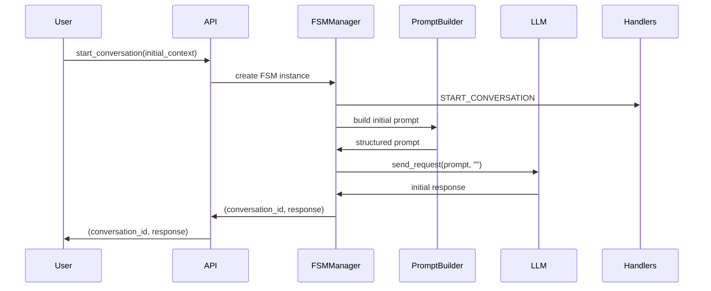
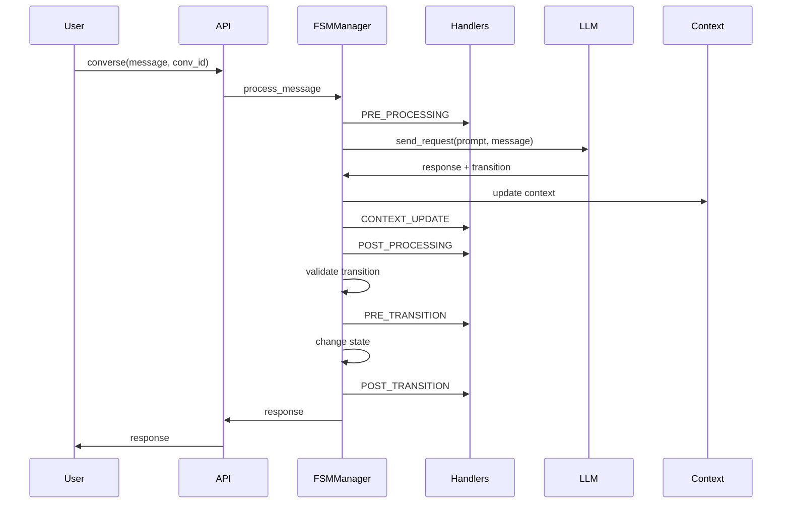

# Architecture Deep Dive - How It All Works

This document provides a comprehensive technical overview of the LLM-FSM architecture, explaining how all components work together to create stateful conversations with Large Language Models.

## Table of Contents

1. [System Overview](#system-overview)
2. [Core Components](#core-components)
3. [Data Flow](#data-flow)
4. [The Prompt Engineering Layer](#the-prompt-engineering-layer)
5. [State Management](#state-management)
6. [Context Handling](#context-handling)
7. [Handler Execution Pipeline](#handler-execution-pipeline)
8. [FSM Stacking Architecture](#fsm-stacking-architecture)
9. [Security Considerations](#security-considerations)
10. [Performance Architecture](#performance-architecture)
11. [Extension Points](#extension-points)

---

## System Overview

LLM-FSM is built on a layered architecture that separates concerns and provides clear extension points:

```
┌─────────────────────────────────────────────────────────────┐
│                      User Application                        │
├─────────────────────────────────────────────────────────────┤
│                         API Layer                            │
│                    (Simplified Interface)                    │
├─────────────────────────────────────────────────────────────┤
│     FSM Manager     │    Handler System    │   LLM Bridge   │
├─────────────────────────────────────────────────────────────┤
│                    Core FSM Engine                           │
│              (State Machine Logic)                           │
├─────────────────────────────────────────────────────────────┤
│   Prompt Builder   │  Context Manager  │  History Tracker   │
├─────────────────────────────────────────────────────────────┤
│                    Storage Layer                             │
│            (In-Memory with Persistence)                      │
└─────────────────────────────────────────────────────────────┘
```

### Design Principles

1. **Separation of Concerns**: Each component has a single, well-defined responsibility
2. **Extensibility**: Clear interfaces for adding new functionality
3. **Testability**: Components can be tested in isolation
4. **Performance**: Efficient memory usage and minimal overhead
5. **Security**: Input sanitization and prompt injection prevention

---

## Core Components

### 1. API Class (`api.py`)

The API class serves as the main entry point, providing a simplified interface that hides internal complexity.

```python
class API:
    def __init__(self, fsm_definition, llm_interface=None, **kwargs):
        # Process FSM definition
        self.fsm_definition, self.fsm_id = self.process_fsm_definition(fsm_definition)
        
        # Initialize components
        self.llm_interface = llm_interface or LiteLLMInterface(**kwargs)
        self.handler_system = HandlerSystem()
        self.fsm_manager = FSMManager(
            fsm_loader=custom_fsm_loader,
            llm_interface=self.llm_interface,
            handler_system=self.handler_system
        )
        
        # Conversation tracking
        self.active_conversations = {}
        self.conversation_stacks = {}
```

**Key Responsibilities:**
- FSM definition processing and validation
- Component initialization and wiring
- Conversation lifecycle management
- FSM stacking orchestration

### 2. FSM Manager (`fsm.py`)

The FSM Manager handles individual FSM instances and their execution.

```python
class FSMManager:
    def __init__(self, fsm_loader, llm_interface, handler_system=None):
        self.fsm_loader = fsm_loader
        self.llm_interface = llm_interface
        self.handler_system = handler_system
        self.instances = {}  # conversation_id -> FSMInstance
        
    def _process_user_input(self, instance, user_input, conversation_id):
        # 1. Add to conversation history
        instance.context.conversation.add_user_message(user_input)
        
        # 2. Execute pre-processing handlers
        context = self.handler_system.execute_handlers(
            HandlerTiming.PRE_PROCESSING,
            instance.current_state,
            None,
            instance.context.data
        )
        
        # 3. Build prompt and call LLM
        prompt = self.prompt_builder.build_system_prompt(instance, current_state)
        response = self.llm_interface.send_request(LLMRequest(
            system_prompt=prompt,
            user_message=user_input
        ))
        
        # 4. Process response and update state
        # 5. Execute post-processing handlers
        # 6. Perform state transition
```

**Key Features:**
- Thread-safe conversation management
- Handler integration at each execution point
- Automatic context updates
- State transition validation

### 3. Prompt Builder (`prompts.py`)

The Prompt Builder creates structured prompts that guide the LLM's behavior.

```python
class PromptBuilder:
    def build_system_prompt(self, instance: FSMInstance, state: State) -> str:
        # Build structured prompt with:
        # - Current state information
        # - Available transitions
        # - Context data
        # - Conversation history
        # - Response format requirements
        
        prompt_parts = [
            self._build_task_section(),
            self._build_state_section(state),
            self._build_context_section(instance.context),
            self._build_transitions_section(state.transitions),
            self._build_response_format_section()
        ]
        
        return "\n".join(prompt_parts)
```

**Security Features:**
- XML tag sanitization to prevent prompt injection
- CDATA protection for JSON data
- Token budget management
- Input validation

### 4. Handler System (`handlers.py`)

The Handler System implements a flexible plugin architecture for extending FSM behavior.

```python
class HandlerSystem:
    def execute_handlers(self, timing, current_state, target_state, context, updated_keys=None):
        # 1. Filter applicable handlers
        applicable = [h for h in self.handlers 
                     if h.should_execute(timing, current_state, target_state, context)]
        
        # 2. Sort by priority
        applicable.sort(key=lambda h: h.priority)
        
        # 3. Execute in order
        updates = {}
        for handler in applicable:
            try:
                result = handler.execute(context)
                updates.update(result)
            except Exception as e:
                self._handle_error(e, handler)
                
        return updates
```

**Handler Architecture:**
- Self-determining execution (handlers decide when to run)
- Priority-based ordering
- Error isolation
- Async support

---

## Data Flow

### 1. Conversation Start



### 2. Message Processing



---

## The Prompt Engineering Layer

### Prompt Structure

The system uses a carefully designed XML-like structure for prompts:

```xml
<task>
    You are the Natural Language Understanding component in an FSM system.
    Process user input based on current state and determine transitions.
</task>

<fsm>
    <persona>Friendly customer service representative</persona>
    
    <current_state>
        <id>collect_email</id>
        <description>Collecting user email</description>
        <purpose>Get valid email address from user</purpose>
        <required_context_keys>email</required_context_keys>
    </current_state>
    
    <current_context><![CDATA[
    {
        "name": "John Doe",
        "timestamp": "2024-01-01T10:00:00"
    }
    ]]></current_context>
    
    <conversation_history><![CDATA[
    [
        {"user": "Hi, I need help"},
        {"system": "Hello! I'd be happy to help. What's your name?"},
        {"user": "I'm John Doe"}
    ]
    ]]></conversation_history>
    
    <transitions><![CDATA[
    [
        {
            "to": "collect_phone",
            "desc": "Valid email provided",
            "priority": 100
        }
    ]
    ]]></transitions>
    
    <response>
        Return JSON with structure:
        {
            "transition": {
                "target_state": "state_id",
                "context_update": {}
            },
            "message": "Your response",
            "reasoning": "Optional reasoning"
        }
    </response>
</fsm>
```

### Security Measures

1. **Tag Sanitization**: All user input is sanitized to prevent XML injection
2. **CDATA Wrapping**: JSON data is wrapped in CDATA to prevent parsing issues
3. **Token Management**: History is trimmed to stay within token limits

---

## State Management

### State Lifecycle

```
┌─────────────┐
│   Created   │ ──────┐
└─────────────┘       │
                      ▼
┌─────────────┐  ┌─────────────┐
│   Running   │◄─│   Waiting   │
└─────────────┘  └─────────────┘
       │                │
       ▼                ▼
┌─────────────┐  ┌─────────────┐
│  Terminal   │  │   Failed    │
└─────────────┘  └─────────────┘
```

### State Validation

Before each transition:
1. Check target state exists
2. Validate transition is allowed from current state
3. Evaluate transition conditions
4. Check required context keys

```python
def validate_transition(self, instance, target_state):
    # 1. Check state exists
    if target_state not in self.fsm_def.states:
        return False, "State not found"
    
    # 2. Check transition allowed
    current = self.get_current_state(instance)
    valid_targets = [t.target_state for t in current.transitions]
    if target_state not in valid_targets:
        return False, "Transition not allowed"
    
    # 3. Check conditions
    transition = next(t for t in current.transitions 
                     if t.target_state == target_state)
    if transition.conditions:
        for condition in transition.conditions:
            if not self.evaluate_condition(condition, instance.context):
                return False, f"Condition failed: {condition.description}"
    
    return True, None
```

---

## Context Handling

### Context Structure

```python
class FSMContext:
    data: Dict[str, Any]           # User-defined context
    conversation: Conversation      # Conversation history
    metadata: Dict[str, Any]       # System metadata
    
    # Special keys (prefixed with _)
    # _conversation_id: Current conversation ID
    # _current_state: Current state ID
    # _previous_state: Previous state ID
    # _timestamp: Last update timestamp
    # _user_input: Most recent user input
```

### Context Flow in Stacked FSMs

```
Main FSM Context          Sub-FSM Context
┌─────────────────┐      ┌─────────────────┐
│ user_id: 123    │      │ user_id: 123    │ (inherited)
│ cart: [...]     │ ───> │ cart: [...]     │ (passed)
│ email: a@b.com  │      │ step: "details" │ (new)
└─────────────────┘      └─────────────────┘
                              │
                              ▼ (on pop)
                         ┌─────────────────┐
                         │ form_complete: T │
                         │ collected: {...} │
                         └─────────────────┘
```

### Merge Strategies

1. **UPDATE**: Child context overwrites parent
2. **PRESERVE**: Only new keys added to parent
3. **SELECTIVE**: Only shared_context_keys merged

---

## Handler Execution Pipeline

### Execution Order

```
START_CONVERSATION
    │
    ▼
For each message:
    PRE_PROCESSING
        │
        ▼
    [LLM Call]
        │
        ▼
    CONTEXT_UPDATE (if keys changed)
        │
        ▼
    POST_PROCESSING
        │
        ▼
    PRE_TRANSITION (if transitioning)
        │
        ▼
    [State Change]
        │
        ▼
    POST_TRANSITION (if transitioned)
        │
        ▼
END_CONVERSATION (when complete)

ERROR (on any exception)
```

### Handler Priority System

```python
handlers = [
    Handler(priority=10),   # Executes first
    Handler(priority=50),   # Executes second
    Handler(priority=100),  # Executes third
]
```

### Error Handling Modes

1. **continue**: Log error, continue with other handlers
2. **raise**: Stop execution, propagate exception
3. **skip**: Skip failed handler, continue with others

---

## FSM Stacking Architecture

### Stack Structure

```
┌─────────────────────────┐
│   Stack for conv_123    │
├─────────────────────────┤
│ Frame 2: checkout_fsm   │ ← Current (top)
│   - conv_id: abc789     │
│   - shared: [user_id]   │
├─────────────────────────┤
│ Frame 1: detail_form    │
│   - conv_id: def456     │
│   - shared: [email]     │
├─────────────────────────┤
│ Frame 0: main_fsm       │ ← Root
│   - conv_id: conv_123   │
│   - shared: []          │
└─────────────────────────┘
```

### Push Operation

```python
def push_fsm(self, conversation_id, new_fsm_definition, **kwargs):
    # 1. Get current context
    current_context = self.get_data(conversation_id)
    
    # 2. Create new FSM instance
    new_instance = self.create_instance(new_fsm_definition)
    
    # 3. Transfer context
    if kwargs.get('inherit_context'):
        new_instance.context.update(current_context)
    if kwargs.get('context_to_pass'):
        new_instance.context.update(kwargs['context_to_pass'])
    
    # 4. Add to stack
    stack_frame = FSMStackFrame(
        fsm_definition=new_fsm_definition,
        conversation_id=new_instance.id,
        shared_context_keys=kwargs.get('shared_context_keys', [])
    )
    self.conversation_stacks[conversation_id].append(stack_frame)
```

### Pop Operation

```python
def pop_fsm(self, conversation_id, context_to_return=None, merge_strategy="update"):
    # 1. Get current and previous frames
    current = self.conversation_stacks[conversation_id].pop()
    previous = self.conversation_stacks[conversation_id][-1]
    
    # 2. Get final context from current FSM
    final_context = self.get_data(current.conversation_id)
    
    # 3. Merge contexts based on strategy
    if merge_strategy == "update":
        previous_context.update(final_context)
    elif merge_strategy == "preserve":
        for key, value in final_context.items():
            if key not in previous_context:
                previous_context[key] = value
    elif merge_strategy == "selective":
        for key in current.shared_context_keys:
            if key in final_context:
                previous_context[key] = final_context[key]
```

---

## Security Considerations

### 1. Prompt Injection Prevention

```python
def _sanitize_text_for_prompt(self, text: str) -> str:
    # Escape XML-like tags that could break prompt structure
    critical_tags = ["fsm", "task", "response", "transitions"]
    
    for tag in critical_tags:
        # Handle opening tags with attributes
        text = re.sub(f'<{tag}[^>]*>', lambda m: html.escape(m.group(0)), text)
        # Handle closing tags
        text = re.sub(f'</{tag}>', lambda m: html.escape(m.group(0)), text)
    
    return text
```

### 2. Context Isolation

Each conversation has isolated context:
- No cross-conversation data access
- Separate memory allocation
- Independent state machines

### 3. Input Validation

```python
def validate_user_input(self, user_input: str) -> str:
    # Length check
    if len(user_input) > self.max_message_length:
        user_input = user_input[:self.max_message_length]
    
    # Sanitization
    user_input = self._sanitize_text_for_prompt(user_input)
    
    return user_input
```

---

## Performance Architecture

### Memory Management

1. **Conversation History Limits**
   ```python
   class Conversation:
       max_history_size: int = 5  # Keep last 5 exchanges
       max_message_length: int = 1000  # Truncate long messages
   ```

2. **Lazy Loading**
   ```python
   def get_fsm_definition(self, fsm_id):
       if fsm_id not in self.fsm_cache:
           self.fsm_cache[fsm_id] = self.fsm_loader(fsm_id)
       return self.fsm_cache[fsm_id]
   ```

3. **Resource Cleanup**
   ```python
   def end_conversation(self, conversation_id):
       # Clean up resources
       del self.instances[conversation_id]
       if conversation_id in self.conversation_stacks:
           del self.conversation_stacks[conversation_id]
   ```

### Optimization Strategies

1. **Handler Pre-filtering**
   ```python
   # Only check handlers that could potentially execute
   potential_handlers = [h for h in self.handlers 
                        if timing in h.timings or not h.timings]
   ```

2. **Prompt Caching**
   - Cache static prompt sections
   - Only rebuild dynamic parts

3. **Async Operations**
   - Async LLM calls
   - Parallel handler execution where possible

---

## Extension Points

### 1. Custom LLM Interface

```python
class CustomLLMInterface(LLMInterface):
    def send_request(self, request: LLMRequest) -> LLMResponse:
        # Your implementation
        prompt = f"{request.system_prompt}\n\nUser: {request.user_message}"
        
        # Call your LLM
        response = your_llm_api(prompt)
        
        # Parse and return
        return LLMResponse(
            transition=StateTransition(...),
            message=response.text
        )
```

### 2. Custom FSM Loader

```python
def custom_loader(fsm_id: str) -> FSMDefinition:
    # Load from database
    fsm_data = database.get_fsm(fsm_id)
    return FSMDefinition(**fsm_data)

fsm_manager = FSMManager(fsm_loader=custom_loader)
```

### 3. Custom Handlers

```python
class DatabaseHandler(BaseHandler):
    def should_execute(self, timing, current_state, target_state, context, updated_keys):
        return timing == HandlerTiming.POST_TRANSITION
    
    def execute(self, context):
        # Save to database
        database.save_conversation_state(
            conversation_id=context["_conversation_id"],
            state=context["_current_state"],
            data=context
        )
        return {"saved_to_db": True}
```

### 4. Workflow Integration

```python
from llm_fsm_workflows import WorkflowEngine, AutoTransitionStep

# Create workflow with FSM steps
workflow = WorkflowDefinition(
    workflow_id="onboarding",
    steps={
        "collect_info": AutoTransitionStep(
            next_state="verify_info",
            action=lambda ctx: api.converse("start", ctx["conv_id"])
        )
    }
)
```

---

## Summary

The LLM-FSM architecture achieves its goals through:

1. **Clear Separation**: Each component has a single responsibility
2. **Extensibility**: Multiple extension points for customization
3. **Security**: Built-in protections against common attacks
4. **Performance**: Efficient resource usage and optimization
5. **Flexibility**: Supports simple to complex conversation flows

The system provides a robust foundation for building stateful conversational AI applications while maintaining the flexibility to adapt to various use cases and requirements.
