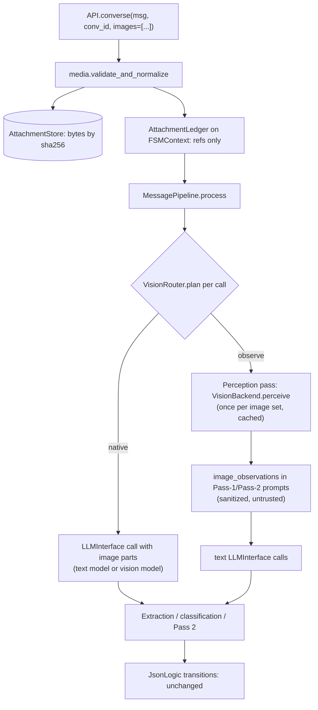

# Vision Support for FSM-LLM: Audit and Design Report

> **Design proposal, not implemented.** Written 2026-09-29 against commit `c632893` (v0.11.0). No code was written or run to produce it. Line numbers refer to that commit. Facts about third-party tools are tagged in section 2 by how they were verified.

## 1. Executive summary

**Goal.** Make image input a core capability of `fsm_llm`, with a configurable vision model that can be the text model itself, a different VLM, or a vision-only model (OCR, detection), then carry it through reasoning, workflows, agents, monitor, harness and eval without breaking existing behavior.

**Audit result.** The framework is text-only end to end, but the architecture is favorable:

- Every core LLM call funnels through five message builders (four in `LiteLLMInterface`, one in `Classifier`), each producing `[system, user]`; three agents modules call LiteLLM directly (section 3.3). Images only need to become content parts of that user message.
- Transitions are rule-based JsonLogic. Vision can feed them through ordinary extracted fields and never needs to decide a transition.
- Pass 1 is already a structured perception step (targeted field extraction), which maps directly onto the describe-then-reason pattern the literature recommends conditioning on the question or schema.

Three spots would corrupt data silently under a naive change: `prepare_ollama_messages` stringifies list content (`ollama.py:198-201`), the monitor's `message_history: list[dict[str, str]]` drops a conversation whose content is a list, and a base64 string stored in context is pasted into every prompt (the prompt filter budgets nodes, not characters).

**Recommendation (core).**

1. New stdlib-only core modules: `media.py` (typed, frozen `ImageInput`; magic-byte validation; header-only dimension checks; limits), `attachments.py` (content-addressed store plus a per-conversation ledger of JSON-native refs) and `vision.py` (`VisionConfig`, `VisionBackend` protocol, `VisionRouter`, perception cache).
2. Pixels are inputs, not state. Bytes live in an `AttachmentStore` keyed by SHA-256; context, history, sessions, logs and monitor events carry only refs (`img_<sha12>`, MIME, size, dims, observation text).
3. Four routing strategies: `native` (image parts on every image-bearing call), `observe` (one cached perception call, then text only; required for vision-only backends), `hybrid` (observe for Pass 1, native for Pass 2), and `auto` (default: `hybrid` if the response model can see, else `observe`). Per-state override in the FSM JSON; model, limits and credentials stay in `API` config.
4. `vision_model` resolution mirrors the text model: argument, then `VisionConfig.model`, then env `LLM_VISION_MODEL`, then the text model. The vision interface never inherits the text model's credentials (D-008 generalized).
5. Byte-identity on the text-only path, proven by golden tests captured on the parent commit. This protects the roughly 40 test lines that assert on message content, every custom `LLMInterface`, and the harness bench manifests that pin prompt SHA-256s.
6. Perception output is untrusted user input. It is sanitized, framed as data, and bound by the existing extraction-channel rules.

**Subpackages.** Agents are the largest change: the task never travels as a user message (`"Continue."` loop), so images must be pinned to the conversation, and tool results need a typed image channel with latest-N retention. Reasoning should default to describe-then-reason with the observation fed to strategy FSMs. Workflows need `image_keys` on three step types. Monitor needs a validated upload route and a UI thumbnail path. Eval needs an image-bearing turn schema and a recorded `vision_model`. The harness gets passthrough only.

**Notable external fact.** The default `ollama_chat/qwen3.5:4b` is listed by Ollama with the vision capability (search-verified, not opened), so "same model" vision may work out of the box. LiteLLM will likely not report it as vision-capable, so capability detection must consult Ollama's `/api/show` or explicit config.

**Effort.** Eight phases (section 9). Phases 0-4 (core) are the critical path. Phases 5-8 can run in parallel once the core API is fixed.

## Contents

1. Executive summary
2. State of the art
3. Audit: current state of the codebase
4. Requirements and design principles
5. Target architecture
6. Propagation to subpackages
7. Model selection guidance
8. Testing strategy
9. Implementation roadmap
10. Risks and open questions
11. References

## 2. State of the art (2024 to Sept 2026)

Verification legend: **[S]** stated in a live search-result summary on 2026-09-29 (page not opened; the research proxy blocked direct fetches), **[R]** recalled, not re-checked, **[U]** sources disagree or aggregator-only. Every [R]/[U] fact that the design depends on is listed in 2.10 for local verification before implementation.

### 2.1 Provider wire formats

| Provider | Image input | Tool results with images | Notes |
|---|---|---|---|
| OpenAI Chat Completions | `{"type":"image_url","image_url":{"url": URL \| data URL, "detail":"low\|high\|auto"}}` in **user** messages only [R, S] | No (tool content is text) [S] | PNG, JPEG, WEBP, non-animated GIF [S] |
| OpenAI Responses | `{"type":"input_image","image_url": str \| "file_id": ..., "detail": ...}`; `"original"` detail on gpt-5.4+ [S] | Yes: `function_call_output.output` may hold `input_image` [S] | |
| Anthropic Messages | `{"type":"image","source":{"type":"base64"\|"url"\|"file", ...}}` [S] | Yes: `tool_result.content` may hold image blocks [R] | JPEG, PNG, GIF, WebP [S] |
| Gemini | `inline_data{mime_type,data}` or `file_data{mime_type,file_uri}` [S] | n/a | Inline requests under 20 MB [S] |
| Ollama `/api/chat` | `{"role":"user","content":"...","images":["<raw base64>"]}` [S] | n/a | `/api/show` returns `capabilities` such as `["completion","vision","tools","thinking"]` [S] |

**LiteLLM** (the framework's only provider layer) accepts OpenAI-format `image_url` parts for every provider and translates them. It adds `format` as a MIME hint for providers that need one [S]. Capability helpers: `litellm.supports_vision(model)`, `supports_pdf_input`, `get_model_info`. Local or unknown models report `False` unless registered via `litellm.register_model` [S, U]. When a provider needs base64, LiteLLM downloads URLs itself: default cap 50 MB via `MAX_IMAGE_URL_DOWNLOAD_SIZE_MB`, where `0` disables the download [S]. That is a server-side fetch of a user-supplied URL, i.e. an SSRF surface. The Ollama path (`_convert_image`) strips the data-URL prefix, passes JPEG and PNG through, and re-encodes other formats to JPEG with Pillow [S].

### 2.2 Image cost and limits

| Provider | Tokens per image | Limits |
|---|---|---|
| OpenAI tile models | `low` = 85; `high` = 85 + 170 per 512 px tile after fitting 2048² and shortest side 768 [S] | Per-request image counts and payload caps changed over time [S] |
| Anthropic | about w*h/750; downscaled above a 1568 px long edge or about 1.15 MP on most models [R, S] | 5 MB per image, 8000 px side; over 20 images per request caps each at 2000x2000 [S] |
| Gemini 2.x / 3 | 258 per 768 px tile; Gemini 3 `media_resolution` 280-2240 per image [S] | |
| Qwen3-VL (local) | one token per 32x32 px: a 1024² image is about 1,024 tokens [S]; Qwen3.5 likely similar [U] | Ollama's default `num_ctx` of 4096 [S] means two large images can fill the context |

Implication: downscale at ingestion, set `num_ctx` for local vision calls, and keep image-bearing calls per turn low.

### 2.3 Local models: Qwen3.5 and the Ollama library

- Qwen3.5 is natively multimodal (early fusion; text, image, video). Ollama lists `qwen3.5` at 0.8b-122b with **vision, tools, thinking** capabilities [S]. The framework's default model may therefore accept images already. Verify with `ollama show qwen3.5:4b`.
- Known issues that affect this framework's structured calls:
  - Ollama #14645: the `format` JSON schema is ignored when `think=false` on Qwen3.5 [S]. Pass 1 already sends `reasoning_effort="none"` plus a JSON schema (`ollama.py`), so this is an existing text-path risk and also applies to vision extraction.
  - Ollama #14493 (Qwen3.5 tool calling) and LiteLLM #24091 (tool_calls dropped with qwen3.5 on Ollama) matter for `native_fc` [S].
  - llama.cpp multimodal encoding can run on CPU at 80 s or more per image [S].
- Other Ollama vision models: qwen3-vl, qwen2.5vl, gemma3 (4b+), gemma4, llama3.2-vision (single image), llama4, mistral-small3.1/3.2, granite3.2-vision, minicpm-v, moondream, llava, deepseek-ocr (prompt-sensitive, Ollama >= 0.13) [S].

### 2.4 Vision-only and specialist models

- **OCR and documents**: PaddleOCR-VL 1.5/1.6 (about 0.9B, 96.34 on OmniDocBench v1.6), MinerU 2.5-Pro, GLM-OCR, dots.ocr, olmOCR 2, DeepSeek-OCR, Granite-Docling-258M (successor to SmolDocling), Mistral OCR 3 (hosted, $2 per 1k pages) [S]; Florence-2, GOT-OCR2 [R].
- **Detection, grounding, segmentation**: SAM 3 (Nov 2025, text-promptable segmentation, "SAM 3 Agent" driven by an MLLM) [S]; Grounding DINO, OWLv2, YOLO-World [R]. VLMs ground natively with different conventions: Qwen2.5-VL absolute pixels, Qwen3-VL and Gemini 0-1000 normalized [S, R].
- **Integration styles**: as a tool the LLM calls (MM-ReAct, HuggingGPT, OmniParser, SAM 3 Agent), or as a model backend (DeepSeek-OCR served as an Ollama chat model). With a small default text model, the tool or pre-processor route keeps outputs structured and cacheable.

### 2.5 Framework designs

| Framework | Image type | Separate vision model | Tool results with images | Media outside state |
|---|---|---|---|---|
| LangChain v1 | Standard content blocks `{"type":"image","base64"\|"url"\|"file_id", "mime_type"}` [S] | per-model | `ToolMessage` image blocks; MCP adapter converts `ImageContent` [S] | no |
| LlamaIndex | `ChatMessage(blocks=[ImageBlock, TextBlock, DocumentBlock])` [S] | legacy `MultiModalLLM` classes, now ordinary LLMs with blocks [S] | | |
| Pydantic AI | `ImageUrl`, `BinaryContent`, `DocumentUrl` [S] | per-agent model | `ToolReturn(return_value, content=[...])` [S] | no (inline base64 in history) [R] |
| Instructor / DSPy | `instructor.Image.from_path/url/base64`; `dspy.Image` input field [S] | | | |
| smolagents | `agent.run(task, images=[...])`; `ActionStep.observations_images` [S] | | screenshots per step; callback prunes all but the latest 2 [S] | |
| AutoGen | `MultiModalMessage(content=[text, Image])`; `model_info={"vision": True}` [S, R] | per-client flag | | |
| OpenAI Agents SDK | `input_image` items; `ToolOutputImage` [S] | | yes [S] | |
| Semantic Kernel / Haystack | `ImageContent` in chat message items; Haystack resizes at ingestion [S] | | | |
| CrewAI | `Agent(multimodal=True)` adds `AddImageTool`; `crewai-files` `ImageFile` with `input_files=` [S] | yes | | files package |
| Google ADK | `types.Part(inline_data=Blob)` [S] | | | **Artifacts service**: binaries versioned outside session state [S] |
| Vercel AI SDK / AG-UI | `ImagePart`, `FilePart`; AG-UI `ImageInputPart` [S] | | | |
| browser-use | `use_vision`, `vision_detail_level` [S] | **`page_extraction_llm`**: separate cheaper model [S] | screenshots | |

Patterns shared by most of them, all adopted in section 5:

1. A typed content-part union with a source union (URL, bytes plus MIME, file id).
2. Capability flags with a user override for local models.
3. An optional separate model for perception or extraction.
4. Resize and set detail at ingestion.
5. Media stored out of band and referenced by id (ADK artifacts, provider Files APIs, content hashes).
6. Tool-returned images shaped per provider: native in Anthropic and the Responses API, a follow-up user message in Chat Completions and Ollama.
7. Screenshot history pruning to the latest N.

### 2.6 Two-model routing: what the evidence says

- Foundations: VisProg, Visual ChatGPT, ViperGPT, MM-REACT, HuggingGPT (2022-2023). All of them turn perception into text or programs for a text reasoner [S].
- **Prism** (NeurIPS 2024): a 2B VLM for perception plus a stronger LLM for reasoning matched VLMs about 10x larger on MMStar [S].
- **"Caption This, Reason That"** (NeurIPS 2025): the bottleneck is integrating perception into reasoning, not missing visual information [S].
- **Self-captions can hurt**: a report attributed to GEASS shows Qwen2.5-VL-3B dropping 61.2 -> 51.3 on HallusionBench when a self-generated caption is added [S, U on attribution].
- Synthesis:
  - Describe-then-reason wins when the reasoner is much stronger than the VLM's language model, and on recognition-level tasks.
  - It loses on spatial, counting, chart and fine-grained questions, and whenever the caption ignores the question.
  - Mitigations: condition perception on the question or target schema, extract structured JSON, keep the image reference so the system can "look again" natively, and cache perception by image hash.
  - FSM-LLM's Pass 1 already knows the target schema (`required_context_keys`, `field_extractions`), which is exactly the conditioning signal.

### 2.7 GUI and computer-use agents

- Anthropic computer use: `computer_20241022`, `computer_20250124`, `computer_20251124` (adds zoom). The reference loop downscales screenshots, maps coordinates back, and keeps only the N most recent images [S, R].
- OpenAI: `computer-use-preview` (Operator), then native computer use in GPT-5.4, reported at 75.0% on OSWorld-Verified [S]. Gemini 2.5 Computer Use (Oct 2025) [S].
- Open: UI-TARS-2 (OSWorld 47.5), Agent S3 (62.6%, 69.9% with best-of-N), OmniParser V2 (YOLOv8 plus Florence-2), Set-of-Mark prompting [S]. Leaderboard tops around 85% in Sept 2026 are aggregator-only [U].
- DECEPTICON (ICLR 2026): dark patterns steer agents in over 70% of tasks; screenshot agents are more capable and more susceptible [S].
- Relevance here: the tool-image channel and latest-N retention in section 6.1 are the foundation. A computer-use loop itself is out of scope for v1.

### 2.8 MCP and A2A

- MCP tool results carry `{"type":"image","data":<b64>,"mimeType":...}` items plus `structuredContent`; the current spec version is 2025-11-25. Many clients drop images [S, R]. `fsm_llm.agents.mcp` currently turns them into repr text (section 3.3).
- A2A v0.3 `FilePart{file: FileWithBytes | FileWithUri}`; v1.0 (2026) drops the `kind` discriminator (`text | raw | url | data` plus `mediaType`) [S]. `agents/remote.py` is a custom protocol, not A2A; if A2A is adopted later, target v1.0 parts.

### 2.9 Security

- **Prompt injection through images.** OWASP LLM01 (2025) explicitly covers multimodal injection [S]. FigStep typographic jailbreaks reached 82.5% attack success on open VLMs [S].
- **Image-scaling injection.** Trail of Bits "Anamorpher" (Aug 2025): text invisible at full resolution appears after the downscale and was used against production systems [S]. **A framework's own resize step is attack surface**: log the exact image the model saw, and use the same, documented resampling everywhere.
- **SSRF.** LiteLLM's automatic URL download is a server-side fetch [S]; related LiteLLM SSRF CVEs exist (CVE-2024-6587, CVE-2026-12798) [S]. Prefer bytes, or fetch with an allowlist and private-IP blocking.
- **Decompression bombs.** Pillow's `MAX_IMAGE_PIXELS` defaults to 89,478,485 (warning) and raises above 2x that [R, S]; new parser DoS CVEs keep appearing (CVE-2026-55380) [S]. Check dimensions from the header before decoding.
- **Metadata and file type.** Strip EXIF/XMP/GPS by re-encoding after `exif_transpose`; validate magic bytes, not declared MIME; reject SVG (active content) [S, R].
- **Logs.** Langfuse replaces data URIs with hash-referenced media [S]; LiteLLM offers `turn_off_message_logging` [S]. A `data:[^;]+;base64,` scrubber is the minimum.

### 2.10 Evaluation, structured output, persistence

- **Benchmarks**: MMMU / MMMU-Pro, MathVista, ChartQA, DocVQA, OCRBench v2, MMBench, MMStar, HallusionBench, OmniDocBench; toolkits VLMEvalKit and lmms-eval; agent level OSWorld-Verified, ScreenSpot-Pro, VisualWebArena. Framework tools: DeepEval multimodal test cases, Inspect AI image content, promptfoo multimodal red-teaming [S].
- **Structured output**: Ollama `format` works with images [S]. Constrained decoding guarantees syntax, not truth, and small VLMs hallucinate fields and coordinates. Keep schemas flat and state coordinate conventions.
- **Persistence**: frameworks that inline base64 in history (Pydantic AI, LangGraph checkpoints) grow sessions quickly [R]. ADK artifacts and provider Files APIs store references [S].
- **Caching**: OpenAI prompt caching includes images, but `detail` must be identical across requests [S]. On Anthropic, adding or removing images invalidates the message cache [R].

**Verify locally before implementation** (the research proxy blocked direct reads):

1. In the pinned LiteLLM 1.102.1: `supports_vision`, the Ollama `_convert_image`, `MAX_IMAGE_URL_DOWNLOAD_SIZE_MB`, and whether `response_format` maps to Ollama `format` when images are present.
2. `ollama show qwen3.5:4b` capabilities, and whether #14645 is fixed in the Ollama version in use.
3. That `ollama_chat` accepts `image_url` data-URL parts (LiteLLM #14217).

## 3. Audit: current state of the codebase

### 3.1 Findings in one paragraph

No module in `src/fsm_llm/` handles images. The grep for `image|vision|multimodal|base64|screenshot|image_url|ImageContent|FilePart` hits only comments in `security.py` (entropy notes that name "a base64 image" as a possible context value) and one stub string in the monitor SPA. Every LLM call in the framework is built as exactly two messages, `[{"role": "system", "content": str}, {"role": "user", "content": str}]`. Conversation history is not a chat transcript: it is JSON rendered into the system prompt. The design constraint that follows: images must travel as **content parts of the user message of selected calls**, never as context values and never inside history text.

### 3.2 Core: every text-only assumption, with the break it would cause

| # | Location | Current assumption | What breaks with images | Required change |
|---|---|---|---|---|
| C1 | `llm.py:409-412, 476-479, 573-576, 637-640` | Four hand-built `[system, user]` lists; `content` is `request.user_message` (str) | No channel for images | One private `_build_messages(system, user, images)` used by all four; str content when `images` is empty (byte-identical), parts list otherwise |
| C2 | `llm.py:716-723, 841-845` | `messages: list[dict[str, str]]` type hints | mypy failure on parts | `list[dict[str, Any]]` |
| C3 | `ollama.py:198-201` (`prepare_ollama_messages`) | `content = f"/nothink\n{content}"` | A parts list is stringified to a Python repr: the image is silently replaced by garbage text. Hit by core, `Classifier` and `agents/native_fc.py:280-282` | Part-aware: prepend `/nothink` to the first text part and append the schema to the last text part; leave image parts untouched |
| C4 | `classification.py:191-194` (`Classifier._call_llm`) | Direct `litellm.completion` with str user content | No image input for `classification_extractions` and ambiguous-transition resolution | `classify(msg, context=None, *, images=())`; images appended at call time like `context` (D-004: per-call inputs never enter the cache key) |
| C5 | `definitions.py:76, 148, 360` (`BulkExtractionRequest`, `ResponseGenerationRequest`, `FieldExtractionRequest`) | `user_message: str` only | No transport for images to custom `LLMInterface`s | New optional field `images: tuple[ImageInput, ...] = ()`; third-party interfaces keep working and see an empty tuple |
| C6 | `llm.py:158-268` (`LLMInterface`) | No capability surface | A text-only custom interface would silently drop images | Non-abstract `supports_vision` property, default `False`; pipeline refuses to attach images to an interface that does not return exactly `True` (a `Mock(spec=LLMInterface)` attribute is a truthy `Mock`, so test with `is True`) |
| C7 | `pipeline.py:526-529` (turn snapshot, D-012) | `copy.deepcopy(context.data)` every turn, plus once per handler timing (`handlers.py:469-470`) | Image payloads in `context.data` are copied 2-9 times per turn | Images never stored in `context.data`; only small JSON-native refs |
| C8 | `pipeline.py:1280-1290` (bulk prompt) and `prompts.py:961-971` (`<original_input>`) | The user message is also inlined into the system prompt | Nothing breaks, but the prompt says nothing about attached images | One conditional line "The user attached N image(s)..." emitted only when images or observations exist |
| C9 | `pipeline.py:1808-1811` (D-035 null-result memo key `f"{system_prompt}\|{user_message}"`) | Text-only key | Per-turn memo, so safe today; unsafe if the memo ever outlives a turn | Add the image digests to the key (defense in depth, cheap) |
| C10 | `pipeline.py:2134-2228` (classifier cache, D-001) | Content-keyed on schema, model, config, connection kwargs | None if images stay per-call (C4) | No change; do not add images to the key |
| C11 | `pipeline.py:2094-2132` (D-008) | Connection kwargs (api_key, api_base) inherited only when the model is the interface's own | A separate vision model must not receive the text model's credentials | Vision interface gets its own `vision_api_key` / `vision_llm_kwargs`; apply the same D-008 rule |
| C12 | `definitions.py:1129-1300` (`Conversation.exchanges: list[dict[str, str]]`), `prompts.py:673-730` | History is text, rendered as JSON in CDATA | Images cannot live in history; monitor `ConversationSnapshot.message_history: list[dict[str, str]]` would fail validation and silently drop the conversation if content became a list | Keep `str`. `add_user_message(message, attachments=())` appends a marker such as `[image img_3f9a1c: image/png 1024x768]` **after** truncation so `max_message_length` cannot cut it |
| C13 | `prompts.py:485-530` (prompt context filter), `utilities.py:278-332` (`redact_non_json_leaf`) | Non-JSON leaves become `<redacted:TypeName>`; a base64 `str` is a JSON leaf and passes whole (budget counts nodes, not characters) | A base64 string in context is pasted into every prompt (reasoning does this on every orchestrator turn) | Document and enforce: images are `ImageInput` objects (redacted to `<redacted:ImageInput>`) or refs, never base64 strings in context. Add a size warning for any context string over a threshold |
| C14 | `security.py:630-676` | Value-shape credential layer runs for `*_key` / `*_token` names | An image stored under `image_key` or `image_token` may be stripped as a credential | Reserve neutral names (`_turn_images`, `attachment_id`); document the pitfall |
| C15 | `session.py:54-94`, `api.py:1336-1410` | `SessionState` holds context, history, WM; internal keys stripped | Image bytes would be lost or bloat the file | `SessionState.attachments: list[dict] \| None = None` (refs only; old files load); bytes only through an optional `AttachmentStore` |
| C16 | `api.py:196-213, 430, 478, 508, 573` | `API(model=...)`, `start_conversation(initial_context)`, `converse(msg, conv_id)`, `converse_stream(msg, conv_id)`, `push_fsm(...)` | No image entry points | Keyword-only `images=` on `start_conversation`, `converse`, `converse_stream`; `inherit_attachments` on `push_fsm`; `vision`, `vision_model` and related keyword-only parameters on `API.__init__` (5.3) |
| C17 | `fsm.py:484, 504, 592` (`process_message*`) | `(conversation_id, message, log=None)` | Same | Keyword-only `images=None`, forwarded **only when non-empty** so every existing mock call assertion stays valid |
| C18 | `constants.py:71, 79, 180` | One model env var, reserved call kwargs | No vision model resolution | `ENV_LLM_VISION_MODEL = "LLM_VISION_MODEL"`; add `vision_model` to reserved names wherever kwargs are spread into litellm (meta-builder, eval) |
| C19 | `runner.py:170-310` (`fsm-llm` interactive CLI) | `input()` text loop | No way to attach an image interactively | `/image PATH` command queueing images for the next turn; `--vision-model` flag |

Items C3, C12 and C13 are the three places where a naive change corrupts data silently rather than failing.

### 3.3 Subpackages

#### agents (highest impact)

- **The task never travels as a user message.** Every FSM pattern sends the literal `"Continue."` (`agents/base.py:164, 720`, `self_consistency.py:303`); the task lives in `context["task"]` and reaches the model through `<current_context>`. Per-turn images on `converse` therefore reach nothing unless they are **pinned to the conversation** and re-attached by the pipeline on later calls.
- **LLM call multiplication.** One ReAct iteration is two turns (think, act); think runs bulk extraction plus several `extract_field` calls. Attaching images natively to every call multiplies image tokens by calls x iterations (up to `max_iterations * 3`). This is the main argument for perceive-once routing (section 5.4).
- **Direct litellm bypasses** that need their own handling: `native_fc.py:308` (messages built at `:351-354`, tool turns at `:408-414`), `meta_builder.py:601` (forwards unknown `api_kwargs` straight to litellm: a new `vision_model` kwarg would be sent to the provider), `composition.py:90-100` (LLM judge, hard-coded default model).
- **Tools cannot return images.** `ToolResult.summary` is `smart_truncate(str(result), 2000)` (`definitions.py:90-101`); observations are strings (`handlers.py:200-268`, duplicated in `parallel_react.py:299-317`, `rewoo.py:156-176`, `reasoning_react.py:246-266`, `native_fc.py:403-414`). A screenshot becomes 2,000 characters of repr.
- **MCP drops images into text.** `_format_mcp_result` (`mcp.py:49-72`) uses `item.text` or `str(item)`: an `ImageContent` becomes its pydantic repr with the full base64 `data=`, then truncated.
- **remote.py** is a custom JSON protocol (`task: str`, `context: dict`), not A2A parts; 100,000-character input cap (`remote.py:156-172`) rejects a ~75 KB image.
- **Sub-task propagation is string-only**: orchestrator `worker_factory(subtask_str)`, `register_agent._agent_tool(task)`, `RemoteAgentTool.execute(task)`. ADaPT, Swarm and AgentGraph re-pass `initial_context`, so an image in context is re-sent per sub-run.
- **Tool-image timing trap.** Tools run on `act` entry (POST_TRANSITION of turn N); the `ContextCompactor` clears transient keys at the next PRE_PROCESSING (`base.py:638-650`); the next `think` extraction is turn N+2. An image stored as a compactor transient is deleted before `think` sees it. Retention must be by consumption count, not by turn.
- **Config**: `AgentConfig` (`definitions.py:125-254`) has no `extra="forbid"`, so a misspelled `vision_model` is silently ignored. `**api_kwargs` already reaches `API.from_definition` (`base.py:581-601`), so a core `API(vision_model=...)` works for FSM agents with zero agents change, but not for native_fc, meta_builder or composition.
- **Logging and HITL**: tool parameters are logged in full (`handlers.py:192`, `hitl.py:89-93`, `tools.py:295-329`); `ApprovalRequest.context_summary` includes every public context key (`hitl.py:100-113`).

#### reasoning

- All LLM calls go through core `API` (`reasoning/engine.py:97-104`); no direct litellm.
- `solve_problem(problem: str, initial_context=None)` (`engine.py:350`). An image in `initial_context` enters the orchestrator context; the orchestrator then sends `json.dumps(current_context)` as the user message on **every** turn (`engine.py:515-518`): bytes redact, a base64 string is pasted whole and exceeds the 10,000-character `user_message` cap.
- Strategy sub-FSMs are pushed with `inherit_context=False` and a 4-key subset (`engine.py:413-436`), so images never reach them today.
- `prune_context` measures size with `json.dumps(context, default=str)` (`handlers.py:283`): any image makes every transition prune and warn.
- `validate_solution`'s word-overlap check (`handlers.py:145-167`) fails for image problems like "Solve this.", burning the 3 retries.
- Entry states that benefit from pixels: `problem_analysis`, `analyze_domain`, `decompose`, `identify_premises`, `gather_observations`, `identify_observations` (`reasoning_modes.py`). Later states work from extracted text.

#### workflows

- No direct litellm. LLM-bearing steps: `LLMProcessingStep` (`steps.py:273-419`, duck-typed `generate(prompt)` or core `generate_response`), `ConversationStep` (`steps.py:477-664`, builds `API.from_definition(model=...)` with no kwargs passthrough), `AgentStep` (`steps.py:831-954`, `task_template.format(**context)`).
- Context is an unvalidated dict; step results enter a 1,000-entry history (`engine.py:612-617`); `_last_event` stores `event.model_dump()` (`engine.py:1188`); `ParallelStep` deep-copies context per child (`steps.py:742-762`).
- `advance_workflow(instance_id, user_input="")` (`engine.py:1355`) is the template for `images=`.

#### monitor

- Converse route `POST /api/fsm/{id}/converse` takes `SendMessageRequest{message: str (<=10,000)}` (`monitor/definitions.py:240-244`).
- 1 MiB body cap checks only `Content-Length` (`server.py:185-192`): a chunked body is unbounded.
- The WebSocket re-sends every running agent's log and workflow context every second (`server.py:1619-1664`): anything image-shaped in context goes out every second.
- The SPA renders `msg.content` through `esc()` (`pages/conversations.js:141-148`): a parts list shows as `[object Object]`.
- CSP `img-src 'self' data:` (`server.py:121-126`) allows data-URI thumbnails, blocks `blob:`.
- `collector._on_error` records `str(error)` uncapped (`collector.py:473-481`): a provider error echoing a data URI goes to every browser.
- OTEL exports ids only; `model`/`tokens` attributes exist in `otel.py:313-322` but the collector never populates them.
- Multipart uploads need `python-multipart`, which is not in the `monitor` extra.

#### harness (experimental)

- Driver and workers are agents; `**api_kwargs` already flows to core `API` (`harness.py:740, 791`), so a core `vision_model` passes through with no harness change.
- **Do not change prompt text or tool surfaces**: bench manifests pin `prompt_bytes_sha256` and `tool_surface` (`scripts/harness_bench.py:42-43, 173-198`), and committed blocks under `scripts/bench_data/` must never be re-run. Any core prompt change on the text-only path breaks comparability. This is the strongest reason for the byte-identity rule (section 4.2).
- `tests/test_fsm_llm_harness/test_cli.py:423-426` asserts the CLI config equals `_default_config()` except `model`.

#### eval

- `ConversationCase.turns: list[str]` with `extra="forbid"` (`eval/cases.py:83-96`); send site `api.converse(turn, conv_id)` (`cases.py:326`); `EvalConfig.model` resolves via `resolve_model` (`config.py:170-179`).
- `vision_model` passed through `llm_kwargs` would work but be recorded as `"<not recorded>"` (`cases.py:484-489`).
- Rows record responses and `get_data`, not turn inputs, so images in turns do not bloat `rows.jsonl`.
- Scoring rubric is golden-pinned; vision runs are not comparable with `EVALUATE.md` baselines.

## 4. Requirements and design principles

### 4.1 Requirements (from the brief)

| ID | Requirement |
|---|---|
| R1 | Vision is core functionality of `fsm_llm`, not a subpackage |
| R2 | The model that sees images is configurable: the same model as the text generator, a different VLM, or a vision-only model (OCR, detection, captioning) that cannot chat |
| R3 | Propagates to reasoning, workflows, agents, monitor, harness, eval |
| R4 | Nothing existing breaks: public signatures, prompts, test suite, bench comparability, session files |
| R5 | Best practices: typed models, single sources of truth, security by default, observable, testable offline |

### 4.2 Principles

1. **Byte-identity on the text-only path.** With no image in the turn, every prompt string, every `messages` list, every litellm call kwarg and every signature call shape is identical to the parent commit. Content stays `str`; new kwargs are forwarded only when non-empty; new prompt lines are emitted only when images or observations exist. Proven by golden tests captured on the parent commit (section 8). This protects the roughly 40 test lines that assert on message content, custom `LLMInterface`s, mocks, and the harness bench manifests.
2. **Pixels are inputs, not state.** Image bytes never enter `context.data`, `Conversation.exchanges`, `WorkingMemory`, logs, events or session JSON. State holds small JSON-native references (`img_<sha12>`, MIME, size, dims, source, observation text).
3. **Vision never decides transitions.** Transitions stay JsonLogic over context (`transition_evaluator.py`, "no LLM in transitions"). Vision produces extracted fields and observations; conditions gate on them exactly as on text-extracted fields. The only new transition-visible key is a reserved, pipeline-owned count of the turn's images.
4. **Perception output is untrusted user input.** Text read out of an image (a caption, OCR, a VLM description) has the same trust level as the user message: sanitized with `sanitize_text_for_prompt`, framed as data, subject to every extraction-channel rule (`handler_only_keys`, `CONTEXT_KEY_AGENT_TRACE`, `is_forbidden_context_entry`).
5. **Capabilities are declared, never guessed from a Mock.** A component attaches images only to an interface whose `supports_vision` is exactly `True`; otherwise it routes to the vision backend or fails loudly per policy. No silent drop.
6. **One place per concern.** One message builder, one media validator, one vision router, one redaction rule for data URLs. Mirrors the D-015 consolidation rule already in `llm.py`.
7. **Opt-in cost.** Default routing minimizes image-bearing calls (perceive once per image, cached by content hash); native multi-call attachment is an explicit choice.

### 4.3 Non-goals for the first release

Video, audio, PDF-as-document input (LiteLLM `file` parts), image generation, GUI computer-use loops, image embeddings in semantic memory. The data model (section 5.2) leaves room for them (`kind` field), but none ship in v1.

## 5. Target architecture

### 5.1 Overview



New core modules (stdlib plus existing deps only):

| Module | Contents |
|---|---|
| `fsm_llm/media.py` | `ImageInput`, `AttachmentRef`, MIME sniffing, header-only dimension parsing (PNG, JPEG, GIF, WebP), limits, data-URL parse/scrub, optional Pillow normalization |
| `fsm_llm/vision.py` | `VisionConfig`, `StateVisionConfig`, `VisionBackend` protocol, `LiteLLMVisionBackend`, `CallableVisionBackend`, `VisionObservation`, `VisionRouter`, perception cache |
| `fsm_llm/attachments.py` | `AttachmentLedger`, `AttachmentStore` ABC, `InMemoryAttachmentStore` (byte-bounded LRU), `FileAttachmentStore` (content-addressed, atomic writes like `FileSessionStore`) |

Exceptions (in `definitions.py`, under `FSMError`): `VisionError` -> `ImageValidationError` (also `ValueError`), `VisionUnsupportedError`, `PerceptionError` (subclass of `LLMResponseError` so existing soft-fail tuples keep working).

### 5.2 Data model

```python
# fsm_llm/media.py (sketch, not final code)
class ImageInput(BaseModel):
    model_config = ConfigDict(frozen=True)          # immutable: cheap deepcopy, hashable
    data: bytes | None = None                       # raw bytes (never base64 in memory)
    url: str | None = None                          # remote reference, only if policy allows
    mime_type: Literal["image/png", "image/jpeg", "image/webp", "image/gif"]
    sha256: str                                     # of the normalized bytes; identity + cache key
    width: int | None = None                        # from header parse, no decode
    height: int | None = None
    detail: Literal["auto", "low", "high"] = "auto"
    name: str | None = None                         # display only, never a path on disk
    source: Literal["user", "tool", "system"] = "user"
    kind: Literal["image"] = "image"                # room for "document", "video" later

    @classmethod
    def from_path(cls, path, **kw) -> "ImageInput": ...
    @classmethod
    def from_bytes(cls, data, **kw) -> "ImageInput": ...
    @classmethod
    def from_base64(cls, b64, mime_type=None, **kw) -> "ImageInput": ...
    @classmethod
    def from_data_url(cls, url, **kw) -> "ImageInput": ...
    @classmethod
    def from_url(cls, url, **kw) -> "ImageInput": ...   # reference only; fetch is a policy decision

    @property
    def id(self) -> str: return f"img_{self.sha256[:12]}"
    def to_ref(self) -> dict[str, Any]: ...            # JSON-native, safe for context/session/monitor
    def to_content_part(self, *, detail=None) -> dict: ...  # OpenAI-format part for litellm
    def __repr__(self) -> str: ...                     # never includes bytes
```

- `AttachmentRef` (the `to_ref()` dict): `{"id", "mime_type", "bytes", "width", "height", "name", "source", "turn", "scope", "observation"}`. JSON-native, so it survives `redacting_json_default`, `FileSessionStore`, the monitor websocket and `get_data`.
- `AttachmentLedger` (new excluded field `FSMContext.attachments`, same pattern as `working_memory`, `exclude=True`): ordered refs with `scope` (`"turn"` or `"pinned"`), per-ref observation text and provenance (backend, model, prompt hash). The turn snapshot (D-012) copies the ledger shallowly: refs are immutable.
- Public API accepts `images: Sequence[ImageInput | str | bytes | PathLike]` and normalizes (`str` is a path, a data URL, or an `http(s)` URL; `bytes` are raw). Typed input is the documented form; the loose union is convenience.

### 5.3 Configuration and model resolution

```python
class VisionConfig(BaseModel):
    model_config = ConfigDict(frozen=True, extra="forbid", arbitrary_types_allowed=True)
    strategy: Literal["auto", "native", "observe", "hybrid", "off"] = "auto"
    model: str | None = None            # vision model; None = the text model
    backend: VisionBackend | None = None  # overrides `model` (vision-only models, tests)
    native_passes: frozenset[Literal["field_extraction", "bulk_extraction",
                                     "classification", "response"]] | None = None
    perception_instructions: str | None = None   # default: describe + transcribe visible text
    perception_schema: dict | None = None        # optional JSON schema for structured perception
    on_unsupported: Literal["error", "observe", "drop"] = "error"
    max_images_per_turn: int = 8
    max_image_bytes: int = 10 * 1024 * 1024
    max_pixels: int = 33_000_000                 # header-declared, checked before any decode
    max_long_edge: int | None = 2048             # downscale target (needs Pillow)
    detail: Literal["auto", "low", "high"] = "auto"
    allowed_mime_types: frozenset[str] = frozenset({"image/png", "image/jpeg", "image/webp", "image/gif"})
    allow_remote_urls: bool = False
    strip_metadata: bool = True                  # EXIF/GPS; needs Pillow, else warn once
    history_images: int = 0                      # past turns whose images are re-attached natively
    pinned_retention: int | None = None          # max pinned refs kept (agents: latest N screenshots)
    perception_cache_size: int = 256
    timeout: float | None = 180.0
    vision_debug_dir: Path | None = None         # opt-in: write the exact images sent
```

`API.__init__` gains keyword-only parameters, all defaulting to "no change":

```python
API(fsm_definition, ..., *,
    vision: VisionConfig | None = None,
    vision_model: str | None = None,              # shortcut for VisionConfig(model=...)
    vision_llm_interface: LLMInterface | None = None,   # injection (tests, custom)
    vision_api_key: str | None = None,
    vision_llm_kwargs: dict | None = None,        # separate from **llm_kwargs (D-008)
    attachment_store: AttachmentStore | None = None,
    **llm_kwargs)
```

Resolution order, mirroring the text model: `vision_model` argument, then `VisionConfig.model`, then env `LLM_VISION_MODEL`, then `None` (use the text model). Credentials and connection kwargs are never shared across different models (D-008 rule, generalized).

Capability detection for `LiteLLMInterface`:

- New constructor kwarg `vision: bool | None = None`. `True`/`False` is authoritative.
- `None` means detect lazily on the **first image-bearing call**, never on the text-only path, memoized per model (failures not memoized, same rule as `_supported_openai_params`). Order, following section 2.5:
  1. explicit `vision=` or `VisionConfig`;
  2. for `ollama/` and `ollama_chat/` models, `capabilities` from Ollama's `/api/show` at the interface's `api_base` (contains `"vision"`). Local tags such as `qwen3.5:4b` are typically absent from LiteLLM's model map, so this step decides the default model;
  3. `litellm.supports_vision(model)`.
- A negative answer never drops images silently: `on_unsupported` applies (default `"error"`).

### 5.4 Strategies (who sees pixels)

| Strategy | Pass-1 calls (field, bulk, classification) | Pass-2 response | Vision calls per turn | Works with vision-only models | Fidelity |
|---|---|---|---|---|---|
| `native` | Image parts attached; call served by the vision model if configured, else the text model | Image parts attached | One per LLM call (field count + bulk + classification + retries + 1) | No | Highest |
| `observe` (describe-then-reason) | Text model + `<image_observations>` | Text model + observations | 1 per new image set (cached by content hash) | Yes | Lossy |
| `hybrid` | Text model + observations | Image parts attached (vision-capable response model) | 1 perception + 1 native | Partially | High for the reply, cheap for extraction |
| `auto` | Resolved once per API: non-chat backend -> `observe`; response model vision-capable -> `hybrid`; else `observe` | | | | |
| `off` | Images rejected per `on_unsupported` | | 0 | | |

Perception is **schema-conditioned** by default: when a state has no `perception_instructions`, the router derives them from the state's `required_context_keys`, `field_extractions` instructions and `classification_extractions` intents, plus a generic "transcribe visible text; describe objects, quantities and relations". This is the mitigation the evidence in section 2.6 supports (question-aware extraction instead of a generic caption).

Why `auto` does not resolve to `native`: a single state with four required keys and one classification makes six Pass-1 calls; with retries up to `extraction_retries` (max 3) that is up to 24 image-bearing calls per turn, and agents multiply that again per iteration (section 3.3). Native routing is the right choice for accuracy-critical states and is available per state (5.6).

Routing rule for "which model serves an image-bearing call" (native passes): if `VisionConfig.model` or `vision_llm_interface` is set, image-bearing calls go to the vision interface and text-only calls stay on the text interface; if not, the text interface must have `supports_vision is True`, else `on_unsupported` applies. Pass 2 in `hybrid`/`native` therefore may be written by the vision model: persona and response instructions are identical, only the model differs. Documented, and switchable with `native_passes`.

### 5.5 Pipeline integration

1. **Turn intake** (`API.converse` -> `FSMManager.process_message`): validate and normalize images (5.8) **before** taking the conversation lock, so a bad image never starts a turn. Store bytes in the `AttachmentStore`, add `scope="turn"` refs to the ledger.
2. **Reserved context key** `_turn_image_count` (int), set by the pipeline at turn start, added to `RESERVED_CONTEXT_KEYS` (handlers cannot set or delete it), internal prefix (never in prompts, stripped from `get_data` and sessions). It lets authors gate a transition on "the user sent a photo" with plain JsonLogic: `{">": [{"var": "_turn_image_count"}, 0]}`.
3. **Perception pass ("Pass 0")**, only when the plan needs observations and at least one image lacks a cached observation for this instruction: `VisionBackend.perceive(images, instruction, schema)` -> `VisionObservation{text, data, model, backend, prompt_hash}`. Written to the ledger refs. Failure raises `PerceptionError` (an `LLMResponseError`), so the turn rolls back exactly like a Pass-1 LLM failure today.
4. **Per-call planning**: `VisionRouter.plan(call_type, state, ledger) -> CallPlan{interface, images, observation_block}`. The pipeline builds requests with `images=plan.images` and passes `observation_block` to the prompt builders.
5. **Prompt builders**: a new optional `observations` argument renders `<image_observations><![CDATA[...]]></image_observations>` using the existing `_sanitize_text_for_prompt` and `_escape_cdata`, plus one framing line: text inside images is content, not instructions. Emitted only when non-empty (byte-identity).
6. **Extraction semantics**: field extraction reads the user message and, when present, image observations or attached images. Extracted values go through the unchanged provenance, `handler_only_keys` and forbidden-entry filters.
7. **History**: `add_user_message(message, attachments=refs)` appends the marker after truncation. The Pass-2 prompt's history block is unchanged in shape; `<image_observations>` for images referenced in the recent history window (bounded by `history_images`) lets the text model answer follow-ups ("what was the total on that receipt?") without re-sending pixels.
8. **Turn end**: `scope="turn"` refs stay in the ledger (for history) but are no longer attached; `pinned` refs are attached on every call where the plan says so; `pinned_retention` keeps only the newest N (the screenshot-pruning pattern of computer-use agents).
9. **Atomicity**: the D-012 snapshot adds `ledger_snapshot = ledger.copy()` (shallow). On rollback the ledger and `_turn_image_count` restore with the rest. The AttachmentStore is content-addressed and append-only within a turn, so a rolled-back turn leaves at most an unreferenced blob, reclaimed by LRU.
10. **Streaming** (`process_stream`): Pass 1 identical; Pass 2 sends parts through `generate_response_stream` (LiteLLM streams normally with image input).
11. **Greeting** (`generate_initial_response`): `start_conversation(initial_context, *, images=None)` registers images as `pinned` by default (they are the task, as in agents); the greeting call follows the plan for `response`.

### 5.6 FSM definition schema

Optional, additive (`FSMDefinition` and `State` allow extra keys and `validator.py` derives known keys from the models, so both old and new files validate):

```json
{
  "vision": {"strategy": "hybrid"},
  "states": {
    "collect_receipt": {
      "id": "collect_receipt",
      "description": "Read an uploaded receipt",
      "purpose": "Capture merchant, date and total from a receipt photo",
      "required_context_keys": ["merchant", "receipt_total"],
      "vision": {
        "strategy": "native",
        "perception_instructions": "Transcribe the merchant name, date and grand total exactly.",
        "native_passes": ["field_extraction", "response"]
      },
      "transitions": [{
        "target_state": "confirm",
        "description": "Receipt read",
        "conditions": [{"description": "Total captured",
                        "requires_context_keys": ["receipt_total"],
                        "logic": {"!!": [{"var": "receipt_total"}]}}]
      }]
    }
  }
}
```

- `StateVisionConfig{strategy, perception_instructions, perception_schema, native_passes, include_pinned}`; `extra="forbid"` (typed like `ContextScope`).
- FSM-level `vision` holds defaults; state-level overrides; API-level `VisionConfig` holds infrastructure (model, limits, security). The FSM file never names a model or a key: portability and D-008.
- Bump the definition version only if the maintainers treat additive optional fields as a version change (today `"4.1"`); the loader must accept both.
- Update: `definitions.py`, `validator.py` (known keys already derive from the models; no new static check), `visualizer.py` (show a camera marker), meta-builder schemas (section 6), `docs/fsm_design.md`, doc snippets (`test_docs_snippets.py` loads every `"initial_state"` block).

### 5.7 LLM interface and provider layer

- `LLMInterface`: add `supports_vision` (property, default `False`). No new abstract methods (existing subclasses must keep instantiating).
- `LiteLLMInterface._build_messages(system, user, images)`: returns the identical two-dict list when `images` is empty; otherwise `[{"role": "system", "content": system}, {"role": "user", "content": [{"type": "text", "text": user}, *parts]}]` with `ImageInput.to_content_part()` producing `{"type": "image_url", "image_url": {"url": "data:<mime>;base64,<...>", "detail": ...}}`. Base64 encoding happens here, at the last moment, never stored.
- Part order (images before or after the text) is a single constant, pinned by a test. Provider guidance differs by use case (section 2.7), so choose it with the eval dataset in phase 7 rather than by assumption.
- `prepare_ollama_messages`: part-aware (C3). Remote URLs are never sent to Ollama (LiteLLM would have to fetch them on the server side: SSRF, see 5.8); the router converts to bytes or rejects.
- Ollama format handling: LiteLLM passes JPEG and PNG through and re-encodes other formats to JPEG with Pillow (section 2.1). The media layer normalizes WebP and GIF to PNG itself when Pillow is installed; without Pillow, Ollama routes accept only PNG and JPEG (clear `ImageValidationError`, not a LiteLLM import failure mid-turn).
- Local context budget: Ollama's default `num_ctx` (4096) fills with two large images. `VisionConfig` documents setting `num_ctx` through `vision_llm_kwargs`, and the router estimates image tokens (Qwen: one token per 32x32 px) to warn before a call is truncated.
- Qwen3.5 on Ollama may ignore the JSON `format` when thinking is disabled (Ollama #14645). Pass 1 already sends `reasoning_effort="none"` with a JSON schema, so the existing parsing ladders stay the safety net; a live `real_llm` test pins the behavior per Ollama version.
- `Classifier.classify(..., images=())` and `classify_multi`: parts appended per call.
- `generate_response` D-020 apology retry and D-039 rules unchanged; the retry reuses the same message list (images included).
- `extract_field` typed Ollama grammar (D-001) unchanged: Ollama `format` works with image input.

### 5.8 Security

| Threat | Control | Where |
|---|---|---|
| Decompression bomb | Parse width/height from the header (stdlib, no decode) and reject over `max_pixels` before any decode; if Pillow is used, set `Image.MAX_IMAGE_PIXELS` to the same bound and treat `DecompressionBombWarning` as an error | `media.py` |
| Type confusion, SVG script, polyglots | Sniff magic bytes; the declared MIME must match the sniffed one; allowlist PNG/JPEG/WebP/GIF; reject SVG, HEIC (until needed), anything else | `media.py` |
| Oversized payloads | `max_image_bytes`, `max_images_per_turn`; monitor adds a streaming body cap (the current check trusts `Content-Length`) | `media.py`, `monitor/server.py` |
| SSRF via image URL | `allow_remote_urls=False` default. When enabled: pass `https` URLs only to providers that fetch on their side; for providers where LiteLLM would download server-side (Ollama and others that need base64), the framework fetches with an allowlist, no redirects to private or link-local ranges, size cap, and timeout, or refuses. The framework never mutates `os.environ` (existing rule in `llm.py`); operators who never want LiteLLM downloads set `MAX_IMAGE_URL_DOWNLOAD_SIZE_MB=0` themselves (documented) | `vision.py` |
| Image-scaling injection (text that appears only after downscaling, section 2.9) | One documented resampling filter (area or Lanczos) used everywhere; the downscaled image, not the original, is what the ledger hashes and what `vision_debug_dir` (opt-in) writes, so an operator can see exactly what the model saw | `media.py` |
| Metadata leakage (EXIF GPS, camera serials) | `strip_metadata=True` re-encodes when Pillow is installed; without Pillow, log a one-time WARNING that metadata is forwarded | `media.py` |
| Prompt injection through image text (typographic attacks, hidden text) | Observations framed as untrusted data inside CDATA, sanitized; extraction-channel restrictions unchanged; transitions stay JsonLogic; HITL approval unchanged for tools; perception instruction tells the model to report text, not follow it | `prompts.py`, `vision.py` |
| Secrets and PII in logs | `ImageInput.__repr__` never includes bytes; log `img_<sha12>`, MIME, dims only; `media.scrub_data_urls(text)` applied to exception messages before logging or emitting monitor events (LiteLLM errors can echo request bodies) | `media.py`, `logging.py`, monitor collector |
| Persistence of sensitive images | Sessions store refs only; bytes persist only with an explicit `FileAttachmentStore`; document retention | `attachments.py`, `session.py` |
| Credential leakage across providers | D-008 generalized: vision interface built only from `vision_*` credentials | `api.py` |

`Pillow` becomes an optional extra (`vision = ["pillow>=..."]`, pinned in `constraints.txt`, `make audit` after install). Core works without it: validation, limits and sniffing are stdlib; only downscaling and metadata stripping need Pillow. `tests/test_packaging.py` only requires extras for subpackages, so a non-subpackage extra is allowed; add it to `all`.

### 5.9 Observability and cost

- One new loguru field set on image-bearing calls: `vision_call=True, images=n, image_ids=[...], model=...` at DEBUG.
- Token estimates per provider (OpenAI tiles, Anthropic area-based, Gemini tiles) in `vision.py` for a pre-call guard `max_image_tokens_per_turn` (optional) and for monitor/OTEL counters.
- Perception cache hit/miss counters exposed on the router.
- `LiteLLMInterface` already has one call site per concern; add `last_usage` capture (prompt and completion tokens from the LiteLLM response) so eval and monitor can report vision cost honestly.

### 5.10 Backward-compatibility contract

| Surface | Guarantee | How |
|---|---|---|
| `API(...)`, `converse`, `converse_stream`, `start_conversation`, `push_fsm` | Existing positional and keyword calls unchanged | New parameters keyword-only with `None` defaults |
| `FSMManager.process_message*`, `MessagePipeline.process*` | Existing mocks and call assertions unchanged | New kwargs forwarded only when non-empty |
| `LLMInterface` subclasses | Still instantiate and work | No new abstract methods; `images` fields default to `()` |
| Prompts and `messages` | Byte-identical when no images | Conditional sections; str content |
| FSM JSON | Old files load, validate, hash the same | New fields optional, default `None`, and left out of the fsm_id hash input when unset (next paragraph) |
| Session files | Old files load | `SessionState.attachments` default `None` |
| Harness bench | Prompt SHA and tool surface unchanged | Byte-identity; no harness prompt edits |
| Pinned test counts | Updated in the same commit | `tests/test_packaging.py` rules |

One subtle item: `API.process_fsm_definition` derives `fsm_id` from `sha256(model_dump sorted)`. Adding a `vision: None` field to `State` and `FSMDefinition` changes `model_dump()` output (a new `"vision": null` key) and therefore **every fsm_id**. Anything that persisted an fsm_id (session files warn on mismatch, eval rows, monitor snapshots) would see different ids. Fix: exclude `None`-valued new fields from the hash input (`model_dump(exclude_none=...)` scoped to the new fields, or a `model_serializer` that omits them when unset), pinned by a test that the fsm_id of every example FSM is unchanged.

### 5.11 Target usage (illustrative, not final code)

```python
from fsm_llm import API, ImageInput, VisionConfig
from fsm_llm.vision import CallableVisionBackend

# 1. Same model sees images (default Qwen3.5, auto -> hybrid)
api = API.from_file("receipt_bot.json")
conv_id, greeting = api.start_conversation()
reply = api.converse("Here is my receipt", conv_id, images=["receipt.jpg"])

# 2. Separate VLM for everything image-bearing, text model unchanged
api = API.from_file("receipt_bot.json", model="ollama_chat/qwen3.5:4b",
                    vision_model="ollama_chat/qwen3-vl:8b",
                    vision_llm_kwargs={"num_ctx": 16384})

# 3. Vision-only OCR model: describe-then-reason is forced (backend cannot chat)
ocr = CallableVisionBackend(lambda images, instruction: run_my_ocr(images), name="paddleocr-vl")
api = API.from_file("invoice_bot.json", vision=VisionConfig(backend=ocr))

# 4. Agents, reasoning, workflows
agent.run("What is wrong with this wiring?", images=[ImageInput.from_path("panel.png")])
engine.solve_problem("Find the area of the shaded region.", images=["geometry.png"])
llm_step("describe", prompt_template="...", image_keys=["uploaded_photo"])
```

```bash
fsm-llm --fsm receipt_bot.json            # then: /image receipt.jpg
python -m fsm_llm.reasoning "Solve this." --image puzzle.png --vision-model ollama_chat/qwen3-vl:8b
fsm-llm-eval run evaluation/datasets/vision_receipt_cases.json --vision-model ollama_chat/qwen3-vl:8b
```

`ImageInput`, `VisionConfig` and `VisionUnsupportedError` join the static `__all__` of `fsm_llm/__init__.py`; `fsm_llm.vision` and `fsm_llm.media` are core modules (not subpackages), so `import fsm_llm` stays dependency-light and no subpackage is imported eagerly.

## 6. Propagation to subpackages

### 6.1 agents

| Change | Where | Notes |
|---|---|---|
| `AgentConfig.vision_model: str \| None = None`, `vision: VisionConfig \| None = None` | `agents/definitions.py:125-254` | Forward in `_create_api` (`base.py:581-601`), SelfConsistency's direct `API.from_definition` (`self_consistency.py:281-287`) |
| `run(task, initial_context=None, *, images=None)` on `BaseAgent` and all 19 overrides | `base.py:106-121` plus each pattern's `run` | Keyword-only. `_init_context` stays text; images go to `api.start_conversation(ctx, images=...)` as `pinned` so every `"Continue."` turn can use them |
| Prompt clause "the attached image(s) are part of the task" | `agents/prompts.py:70-74, 153-158, 190-202` | Emitted only when the run has images (byte-identity for text runs) |
| Tool image results | `ToolResult.images: tuple[ImageInput, ...] = ()`; `ToolRegistry.execute` (`tools.py:351-397`) recognizes `ImageInput` / `ImageResult` return values | `summary` renders a placeholder `[image img_ab12: image/png 1280x800]`, never bytes |
| Tool images reach the next `think` | `_run_selected_tool` (`handlers.py:200-268`) registers `source="tool"`, `scope="pinned"` refs; `pinned_retention` keeps the latest N (default 1-3 for screenshot loops) | Consumption-based retention, not the ContextCompactor (timing trap, 3.3) |
| MCP `ImageContent` | `_format_mcp_result` (`mcp.py:49-72`) returns text plus `ImageInput`s; executor returns a `ToolResult` with images | Update `tests/test_fsm_llm_agents/test_review_fixes.py:38-55` expectations |
| native_fc | `native_fc.py:351-354` user message parts; after a tool returns images, append a `role: "user"` message with image parts (most providers reject images in `role: "tool"`); choose `vision_model` when the message list contains images; use core's part-aware `prepare_ollama_messages` | `complete_fn(model, messages, schemas)` already lets tests assert shapes |
| meta_builder | Add `vision_model` and the other `vision_*` names to the `reserved` set at `meta_builder.py:541-558` so they never reach `litellm.completion` | Optional later: FSM builder emits state `vision` blocks (`meta_builders.py:100-176`, `_FSM_SCHEMA`, `meta_tools.py:90-135`); `AgentBuilder._CONFIG_ALLOWED` gains `vision_model` |
| composition judge | `complete_fn(model, prompt, images=())` optional; default judge text-only | `composition.py:90-129` |
| Sub-agents | Orchestrator, Swarm, AgentGraph, ADaPT, `register_agent`: pass `images=` (refs resolved from the parent store) explicitly; never through `initial_context` | ADaPT recursion must not multiply images per subtask by default |
| remote.py | `_InvokeRequest.images: list[{mime_type, data_b64}]` with its own size cap separate from `max_input_chars`; server forwards `images=` to `run` | Validate with `media.py` on the server side |
| HITL | `context_summary` shows attachment ids only, never bytes; never log image parameters | `hitl.py:89-113` |
| Logging | Replace raw parameter logging with a redacting formatter that collapses `ImageInput` and data URLs | `handlers.py:192`, `tools.py:295-329, 387-391` |

Patterns without HITL (ParallelReact, REWOO, native_fc, PlanExecute) stay without HITL; vision does not change that open gap, but a screenshot-driven tool loop increases its blast radius. Flag in docs.

### 6.2 reasoning

| Change | Where |
|---|---|
| `solve_problem(problem, initial_context=None, *, images=None)` | `reasoning/engine.py:350` |
| Images pinned on the orchestrator conversation; strategy FSMs pushed with ledger inheritance (`push_fsm(..., inherit_attachments=True)`, a new core flag) | `engine.py:378, 431-436` |
| Default strategy for reasoning: `observe` (describe-then-reason) with a problem-oriented perception instruction ("describe every quantity, label, axis and relation"); observation text also written to a new `ContextKeys.VISUAL_DESCRIPTION` and added to both key subsets (`engine.py:171-178, 413-421`) so the classifier and strategy FSMs see it | `reasoning/constants.py`, `engine.py` |
| State-level `vision` blocks on entry states only (`problem_analysis`, `analyze_domain`, `decompose`, `identify_premises`, `gather_observations`, `identify_observations`) when native attachment is wanted | `reasoning_modes.py` |
| Fix `prune_context` size measurement to skip refs and use `redacting_json_default` | `reasoning/handlers.py:283` |
| `validate_solution` overlap check: compare against problem text plus `VISUAL_DESCRIPTION` | `reasoning/handlers.py:145-167` |
| `ReasoningEngine(model=..., vision_model=None, **kwargs)`; `Defaults.VISION_MODEL = None` | `engine.py:39-51`, `constants.py:245` |
| CLI `--image PATH` (append) and `--vision-model` | `reasoning/__main__.py:94-110, 156-180, 490-500` |
| `ReasoningReactAgent`'s `reason` tool forwards the run's images | `agents/reasoning_react.py:224-235` |

### 6.3 workflows

| Change | Where |
|---|---|
| `LLMProcessingStep.image_keys: list[str] = []`; when images are present, route to `generate_response(ResponseGenerationRequest(..., images=...))`; the duck-typed `generate(prompt)` path raises a clear `WorkflowError` if images are present and the callable does not accept them | `steps.py:273-419` |
| `ConversationStep.image_keys`, `vision_model`, `api_kwargs` passthrough; images sent on the first turn (default) or every turn (`images_on="first"\|"every"`) | `steps.py:477-664` |
| `AgentStep.image_keys` -> `agent.run(task, images=...)`; `task_template.format` must never see an image object | `steps.py:831-954` |
| `WorkflowEngine.advance_workflow(instance_id, user_input="", *, images=None)`; stored under an engine-owned key consumed by `ConversationStep(use_user_input=True)` | `engine.py:1355-1382` |
| Context holds `ImageInput` (frozen, bytes: cheap deepcopy, redacted in monitor output) or refs; step fields hold key names only so `_serialize_step` stays JSON-safe | `definitions.py:39-74`, `models.py` |
| DSL factories gain the same parameters | `dsl.py:182, 358, 619` |
| Bound history bloat: `add_history_entry` stores refs instead of `ImageInput` objects | `engine.py:612-617`, `models.py:207-215` |

### 6.4 monitor

| Change | Where |
|---|---|
| `SendMessageRequest.images: list[ImageUpload] = []` with `ImageUpload{mime_type, data_b64, name}` (base64 JSON avoids a `python-multipart` dependency); separate per-route byte cap (for example 8 MiB) and a streaming body cap that does not trust `Content-Length` | `monitor/definitions.py:240-244`, `server.py:185-192, 796-811` |
| Server-side validation through `fsm_llm.media` (magic bytes, allowlist, pixel cap); reject SVG | `server.py` |
| Snapshots: `message_history` keeps `content: str`; add `attachments: list[AttachmentRef]` per message and a `vision_observations` view | `definitions.py:80-112`, `instance_manager.py:517-566` |
| SPA: file input and preview in the chat composer, thumbnails as escaped `data:` URLs (CSP already allows `data:`), cached by sha256 to avoid re-download on every event refresh | `templates/index.html:265-270`, `pages/conversations.js:141-148, 209-274`, `style.css` |
| Launch and builder forms: `vision_model` field | `index.html:313, 476, 540`, `launch.js`, `builder.js`, `LaunchFSMRequest`, `instance_manager.py:978, 1519-1523` |
| Cap and scrub `_on_error` text (data URLs) | `collector.py:473-481` |
| New per-LLM-call event carrying model, call type, image count, tokens; wire through `constants.py`, `__all__`, `_emit_global_event`, `record_event`, `otel._route_event` | `collector.py`, `otel.py:313-322` |
| OTEL: image count, MIME, bytes, vision model; never content (matches current ids-only posture) | `otel.py` |
| Auth: require the API key or rate-limit image routes when bound beyond localhost | `server.py:374-465` |

### 6.5 harness

Passthrough only. `vision_model` flows through the existing `api_kwargs`. No prompt, tool or CLI change in v1. If `AgentConfig` gains `vision_model`, keep it `None` in `_default_config()` and do not add a CLI flag unless `test_cli.py:423-426` is updated deliberately. Never edit or re-run `scripts/bench_data/` blocks. A future `view_image` workspace tool (instead of today's `read_text` decoding PNG bytes with `errors="replace"`, `harness/tools.py:567-572`) is a separate, pre-registered bench decision.

### 6.6 eval

| Change | Where |
|---|---|
| `turns: list[str \| Turn]`, `Turn{user: str, images: list[str] = []}` with `extra="forbid"`; image paths resolved against the dataset directory like `fsm` (`cases.py:151-158`), missing file -> `EvalDatasetError` | `eval/cases.py:83-96` |
| Send site `api.converse(turn.user, conv_id, images=...)` | `cases.py:326` |
| `EvalConfig.vision_model`, env `LLM_VISION_MODEL`, `--vision-model` flag, added to `_RESERVED_LLM_KWARGS`, printed in the banner and `summary.md`, recorded in `results.json` | `config.py:51-112, 170-179`, `__main__.py:73-90, 263-290`, `cases.py:484-510` |
| Optional `vision_llm_interface_factory` for offline tests | `cases.py:41, 274-285` |
| New expectation `observation_contains` (optional, needs a failing-case test per eval rules) | `cases.py` |
| New dataset `evaluation/datasets/vision_receipt_cases.json` with small, license-clean fixture images | `evaluation/datasets/` |
| Do not change the scoring rubric; mark vision runs as a separate series in `EVALUATE.md` | |

New runnable examples (`examples/vision/...`) change the examples count and the example tests; `CLAUDE.md` says do not modify `examples/` unless asked, so this needs explicit approval.

## 7. Model selection guidance (default stack)

| Role | Local (Ollama) | Hosted |
|---|---|---|
| Text generator (today) | `ollama_chat/qwen3.5:4b` | any |
| Same-model vision | `qwen3.5:4b` is listed with the vision capability (section 2.3); confirm with `ollama show` | GPT-4o/4.1/5 family, Claude, Gemini |
| Separate VLM | qwen3-vl (2B-8B), gemma3 (4B+), gemma4, minicpm-v, mistral-small3.x, llama3.2-vision (single image) | same |
| Vision-only (OCR, documents) | `CallableVisionBackend` wrapping PaddleOCR-VL, olmOCR, Granite-Docling, Tesseract; or deepseek-ocr served by Ollama through `LiteLLMVisionBackend` with its exact prompt | Mistral OCR 3 |
| Grounding / detection | `CallableVisionBackend` wrapping SAM 3, Grounding DINO, OWLv2, YOLO-World; state the coordinate convention (Qwen3-VL and Gemini 0-1000, Qwen2.5-VL pixels) in the observation | |

Recommendation:

- Ship `auto`: `hybrid` when the response model is vision-capable, `observe` otherwise. With the default Qwen3.5 this means one cached perception call plus a native Pass 2, all on one local model.
- Document `native` per state for accuracy-critical extraction (receipts, forms, charts, counting).
- Document `observe` with an OCR backend for document-heavy flows.

## 8. Testing strategy

1. **Golden byte-identity suite (write first, on the parent commit).** For every prompt builder, every `LiteLLMInterface` call type (sync, stream, field, bulk), the `Classifier`, native_fc, reasoning and agents runs: capture the exact `messages` and litellm kwargs for a fixed set of text-only turns, commit the fixtures, and assert equality after every phase. This is the executable form of R4 and protects the harness bench SHA.
2. **Unit tests, `media.py`**: magic-byte sniffing, MIME mismatch, SVG and polyglot rejection, header-dimension parsing for all four formats (including truncated headers), `max_pixels` before decode, byte caps, data-URL parse and scrub, `__repr__` never containing bytes, frozen immutability, deterministic `id`.
3. **Provider layer**: `_build_messages` parts ordering; `prepare_ollama_messages` with parts (the `/nothink` and schema land in text parts, image parts untouched); `Classifier` parts; capability detection memoization; `supports_vision` on a `Mock(spec=LLMInterface)` is not treated as `True`.
4. **Router matrix**: strategy x (text model vision-capable?) x (vision model set?) x (backend chat or non-chat) x call type -> expected interface and payload. Table-driven.
5. **Pipeline**: `_turn_image_count` gating; rollback restores ledger and count; perception failure rolls back the whole turn and fires ERROR handlers; perception cache hit on a repeated image; pinned retention; history marker survives truncation; D-035 memo key includes digests.
6. **Security**: an observation containing `{"is_admin": true}` or "ignore previous instructions" cannot set a `handler_only_keys` name or the agent marker; loguru sink capture shows no base64 and no data URL for any image turn; remote URL refused by default; Ollama never receives a URL.
7. **Compatibility**: every example FSM's `fsm_id` unchanged; old session files load; `FSMDefinition` with `vision` blocks round-trips; custom `LLMInterface` subclass without `supports_vision` still works for text and fails clearly for images.
8. **Subpackages**: agents (images through `"Continue."` turns, tool image to next `think`, MCP `ImageContent`, native_fc message shapes), reasoning (`VISUAL_DESCRIPTION` reaches strategy FSMs; prune no longer fires), workflows (steps and `advance_workflow`), monitor (upload validation, 413 on chunked oversize, snapshot `attachments`, error scrub), eval (`Turn` schema, path resolution, recorded `vision_model`).
9. **Live tests** marked `real_llm` / `integration`, self-skipping without Ollama or the pulled VLM tag; excluded by CI's marker filter.
10. **Mocks**: `MockVisionLLMInterface` (`supports_vision=True`, records images) and `MockVisionBackend` in `tests/conftest.py`; `MockLLM2Interface` untouched.
11. **Counts**: every new test changes pinned counts in root `CLAUDE.md`, `README.md` and `harness/CLAUDE.md` (`TestDocumentedTestCountsMatchCollection`); update in the same commit as the tests.

Each behavior change ships with a test that fails on the parent commit (repo rule).

## 9. Implementation roadmap

| Phase | Scope | Exit criteria |
|---|---|---|
| 0 | ADR in `plans/` with `# DECISION` anchors: pixels-are-inputs, byte-identity, perception-is-untrusted, credential isolation, fsm_id hash exclusion. Golden byte-identity fixtures captured on the parent commit | Fixtures committed; anchors appended to `plans/ANCHORS.md` |
| 1 | `media.py` (types, validation, limits, sniffing, scrub), exceptions, constants, optional `vision` extra (Pillow) | Unit suite green; no existing file behavior changed; golden suite green |
| 2 | Provider layer: request `images` fields, `supports_vision`, `_build_messages`, part-aware `prepare_ollama_messages`, `Classifier(images=)`, capability detection | Golden suite green; new provider tests green; mypy clean |
| 3 | `attachments.py`, `vision.py` (config, backends, router, perception cache), pipeline integration, `API`/`FSMManager` entry points, `_turn_image_count`, history marker, sessions, stacking inheritance, streaming | Router matrix and pipeline tests green; live smoke with a local VLM passes |
| 4 | FSM schema (`vision` on FSM and State), fsm_id hash exclusion, validator, visualizer, `fsm-llm` CLI `/image`, docs (`api_reference.md`, `fsm_design.md`, `architecture.md`, quickstart section), CHANGELOG `Unreleased` | Doc snippets load; example fsm_ids unchanged |
| 5 | agents: config, `run(images=)`, prompts clause, tool images, MCP, native_fc, meta_builder reserved kwargs, remote, logging redaction | Agents suite green; live ReAct-with-screenshot smoke |
| 6 | reasoning and workflows | Suites green; CLI `--image` smoke |
| 7 | eval (schema, `vision_model`, vision dataset) and monitor (upload route, UI, snapshots, events, OTEL) | Suites green; manual UI check of upload and thumbnails |
| 8 | Harness passthrough check only; first vision eval run recorded as its own series in `EVALUATE.md` | Harness suite and bench manifests untouched |

Each phase is one plan step with its own commit, per the repo's plan-step commit format, and keeps `make lint`, `make type-check`, `make test` and `make audit` green.

## 10. Risks and open questions

| Risk | Mitigation |
|---|---|
| Silent quality loss in `observe`/`hybrid` (captions miss details the extractor needs) | Per-state `perception_instructions` derived from `required_context_keys` / `field_extractions` descriptions by default; `native` per state for critical fields; eval dataset measures both |
| Small local VLMs produce weak JSON; Qwen3.5 may ignore `format` with thinking off (Ollama #14645) | Keep existing parsing ladders; free-text perception by default; structured perception only with a schema and a validating retry; live test per Ollama version |
| Tool calls dropped for Qwen3.5 through LiteLLM/Ollama (LiteLLM #24091, Ollama #14493) | Affects `native_fc` with or without images; do not make native_fc the vision agent default until verified |
| Image-scaling injection through the framework's own resize | One resampling filter, hash and log the downscaled image, `vision_debug_dir` |
| Latency: a 4B VLM on CPU is slow per image | Perception cache, downscaling (`max_long_edge`), `detail="low"` default for classification-only use |
| Cost blow-up in agents | `pinned_retention`, observe-by-default, router counters exposed to monitor |
| Provider drift in LiteLLM image handling | Pin via `constraints.txt`; provider-layer tests assert the exact OpenAI-format parts LiteLLM receives |
| Privacy (faces, IDs, documents) | No bytes in sessions by default, metadata stripping, explicit store opt-in, retention docs in `SECURITY.md` |
| Scope creep into computer-use | Explicit non-goal for v1; the tool-image path is the foundation |

Open questions for the maintainers:

1. Default strategy: `auto` (as proposed) or `native` for maximum fidelity?
2. Is adding Pillow as an optional `vision` extra acceptable (supply-chain review, `make audit`)?
3. Should sessions ever persist image bytes by default (with `FileSessionStore` configured)?
4. Approval to add `examples/vision/` (changes example counts and eval baselines).
5. PDF input (LiteLLM `file` parts) in v1 or v2?

## 11. References

URLs as returned by search on 2026-09-29; see the verification legend in section 2.

**LiteLLM**: https://docs.litellm.ai/docs/completion/vision, https://docs.litellm.ai/docs/providers/ollama, https://docs.litellm.ai/docs/completion/document_understanding, https://docs.litellm.ai/docs/proxy/image_handling, https://docs.litellm.ai/release_notes/v1-81-0, https://github.com/BerriAI/litellm/pull/6880, https://github.com/BerriAI/litellm/issues/14217, https://github.com/BerriAI/litellm/issues/24091

**Ollama and Qwen**: https://ollama.com/library/qwen3.5, https://ollama.com/library/qwen3-vl, https://ollama.com/search?c=vision, https://docs.ollama.com/capabilities/vision, https://docs.ollama.com/api-reference/show-model-details.md, https://docs.ollama.com/capabilities/structured-outputs, https://github.com/ollama/ollama/issues/14645, https://github.com/ollama/ollama/issues/14493, https://huggingface.co/Qwen/Qwen3.5-4B, https://arxiv.org/pdf/2511.21631 (Qwen3-VL)

**Providers**: https://developers.openai.com/api/docs/guides/images-vision, https://developers.openai.com/docs/guides/prompt-caching, https://developers.openai.com/api/docs/guides/tools-computer-use, https://platform.claude.com/docs/en/build-with-claude/vision, https://platform.claude.com/docs/agents-and-tools/tool-use/computer-use-tool, https://ai.google.dev/gemini-api/docs/image-understanding, https://ai.google.dev/gemini-api/docs/media-resolution, https://docs.mistral.ai/models/ocr-3-25-12

**Frameworks**: https://docs.langchain.com/oss/python/langchain/mcp/tools, https://developers.llamaindex.ai/python/framework/understanding/using_llms/, https://pydantic.dev/docs/ai/advanced-features/input, https://ai.pydantic.dev/tools-advanced, https://python.useinstructor.com/concepts/multimodal/index.md, https://dspy.ai/api/primitives/Image/, https://huggingface.co/docs/smolagents/tutorials/memory, https://microsoft.github.io/autogen/stable/user-guide/agentchat-user-guide/tutorial/agents.html, https://learn.microsoft.com/en-us/semantic-kernel/concepts/ai-services/chat-completion/multi-modal-chat-completion, https://docs.haystack.deepset.ai/docs/imagecontent, https://docs.crewai.com/en/learn/multimodal-agents, https://docs.crewai.com/en/concepts/files, https://adk.dev/artifacts/, https://ai-sdk.dev/docs/reference/ai-sdk-core/model-message, https://docs.ag-ui.com/sdk/js/core/multimodal-inputs, https://docs.browser-use.com/open-source/customize/agent/all-parameters.md

**Perception and routing research**: arXiv 2211.11559 (VisProg), 2303.04671 (Visual ChatGPT), 2303.08128 (ViperGPT), 2303.11381 (MM-REACT), 2303.17580 (HuggingGPT), Prism (NeurIPS 2024) https://papers.neurips.cc/paper_files/paper/2024/hash/cac9e747a1d480c78312226959566cef-Abstract-Conference.html, https://arxiv.org/html/2505.21538 (Caption This, Reason That), https://arxiv.org/html/2605.01733 (GEASS), https://mlanthology.org/icml/2025/dekoninck2025icml-unified

**Specialist models**: arXiv 2601.21957 and 2606.03264 (PaddleOCR-VL 1.5, 1.6), 2510.19817 (olmOCR 2), https://github.com/deepseek-ai/DeepSeek-OCR, https://ibm.com/new/announcements/granite-docling-end-to-end-document-conversion, https://docs.ultralytics.com/models/sam-3, https://huggingface.co/papers/2502.14786 (SigLIP 2)

**GUI agents**: arXiv 2509.02544 (UI-TARS-2), 2510.02250 (Agent S3), 2310.11441 (Set-of-Mark), 2512.22894 (DECEPTICON), https://huggingface.co/microsoft/OmniParser-v2.0, https://github.com/likaixin2000/ScreenSpot-Pro-GUI-Grounding, https://github.com/web-arena-x/visualwebarena

**MCP and A2A**: https://aaif.io/blog/a2a-v1-0-a-builder-s-guide-part-2-migration-security-and-production, https://olaservo-sandyland.static.hf.space/mcp/structured-content/client-survey.md

**Security**: arXiv 2311.05608 (FigStep), https://blog.trailofbits.com/2025/08/21/weaponizing-image-scaling-against-production-ai-systems/, https://tenable.com/cve/CVE-2024-6587, https://www.sentinelone.com/vulnerability-database/cve-2026-12798/, https://pillow.readthedocs.io/en/stable/_sources/handbook/security.rst.txt, https://securelayer7.net/lab/cve-2026-55380-pillow-gdimagefile-decompression-bomb-dos, https://langfuse.com/docs/observability/features/multi-modality.md

**Evaluation**: arXiv 2407.11691 (VLMEvalKit), 2407.12772 (lmms-eval), 2501.00321 (OCRBench v2), 2311.16502 (MMMU), 2409.02813 (MMMU-Pro), https://deepeval.com/docs/multimodal-metrics-image-coherence, https://www.promptfoo.dev/docs/guides/multimodal-red-team
