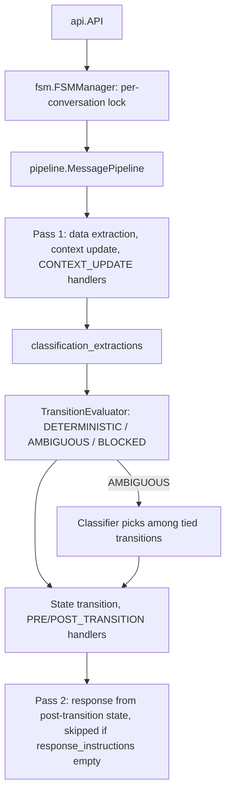
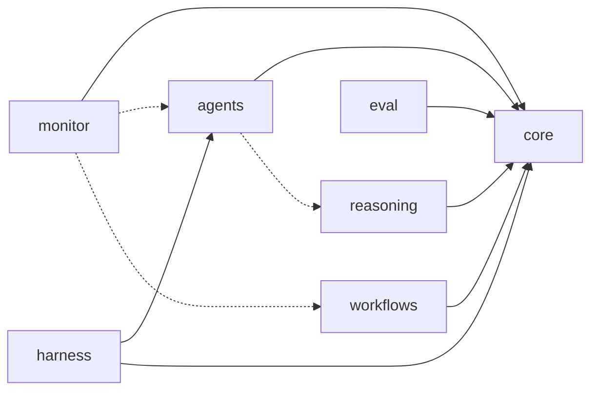

# src

Path: `src`
Purpose: Source root (src layout) of the `fsm-llm` distribution; holds the single package `fsm_llm`: a core engine for JSON-defined finite state machines driven by an LLM through a 2-pass pipeline, plus six subpackages.

## Scope

- `fsm_llm/`: the only source package. Top-level modules are the core; subpackages `reasoning/`, `workflows/`, `agents/`, `monitor/`, `harness/`, `eval/` build on it.
- `fsm_llm.egg-info/`: generated by editable installs, gitignored (`*.egg-info/`), deleted by `make clean`. Never edit or document it as source.
- Not here: tests (`tests/`), examples (`examples/`), scripts (`scripts/`), docs (`docs/`), packaging (`pyproject.toml` at the repo root).
- Packaging: setuptools, `[tool.setuptools.packages.find] where = ["src"]`; package data `fsm_llm = ["py.typed"]`, `"fsm_llm.monitor" = ["static/**/*", "templates/*"]`. Version 0.11.0 in `pyproject.toml` and `src/fsm_llm/__version__.py`; subpackages re-export it. `requires-python = ">=3.10"`.
- `make clean` also runs `rm -rf src/fsm_llm_agents src/fsm_llm_reasoning src/fsm_llm_workflows src/fsm_llm_monitor src/fsm_llm_harness`. Those top-level dirs do not exist in the current tree; do not recreate them. Everything lives under `fsm_llm/`.

## Architecture

Per-message flow in the core (`fsm_llm/pipeline.py`, `MessagePipeline`):

Subpackage dependencies (solid required, dotted optional):

`fsm_llm/__init__.py` never imports a subpackage (subpackages import `from fsm_llm import API`, so an eager import would hit a half-initialised package and monitor would drag fastapi into core installs). `has_workflows/get_workflows`, `has_reasoning/get_reasoning`, `has_agents/get_agents` probe by dotted name.

## Key files

| Path | Role | Notes |
| --- | --- | --- |
| `fsm_llm/api.py` | `API`: conversations, stacking, sessions, handlers | Main entry point |
| `fsm_llm/fsm.py` | `FSMManager`: instances, per-conversation locks, LRU definition cache (default 64) | Lock order `_lock -> conv_lock` |
| `fsm_llm/pipeline.py` | `MessagePipeline`: 2-pass engine, rollback, provenance | Read `# DECISION` anchors first |
| `fsm_llm/definitions.py` | Pydantic models (`FSMDefinition`, `State`, `Transition`, ...) and core exceptions | Structure validated at load |
| `fsm_llm/transition_evaluator.py`, `expressions.py` | Rule-based transition decision; JsonLogic evaluator (max depth 50) | No LLM |
| `fsm_llm/classification.py` | `Classifier`, `HierarchicalClassifier`, `IntentRouter` | |
| `fsm_llm/handlers.py` | `HandlerSystem`, `HandlerTiming` (8 points), `create_handler` builder | |
| `fsm_llm/llm.py`, `ollama.py` | `LLMInterface`, `LiteLLMInterface`; Ollama tweaks | |
| `fsm_llm/prompts.py`, `context.py`, `memory.py`, `session.py` | Prompt builders; context cleaning and `ContextCompactor`; `WorkingMemory`; `FileSessionStore` | |
| `fsm_llm/security.py`, `constants.py` | `has_internal_prefix`, `is_forbidden_context_entry`; defaults and limits | `constants` re-exports `security` names |
| `fsm_llm/utilities.py` | JSON extraction, FSM loading, `filter_context_tree`, `redacting_json_default` | |
| `fsm_llm/validator.py`, `visualizer.py`, `runner.py`, `__main__.py` | CLIs | |
| `fsm_llm/logging.py` | loguru setup; `logger.disable("fsm_llm")` at import | |
| `fsm_llm/reasoning/` | 9 strategy FSMs under an orchestrator, validation with up to 3 retries | `ReasoningEngine.solve_problem` |
| `fsm_llm/workflows/` | Async in-memory engine, 11 step types, DSL, no persistence | `WorkflowEngine`, `create_workflow` |
| `fsm_llm/agents/` | 18 agent patterns as generated FSMs, tools, HITL, memory, MCP, A2A, meta-builder | `create_agent`, `ReactAgent`, `@tool` |
| `fsm_llm/monitor/` | FastAPI dashboard (REST, WebSocket, vanilla-JS SPA), OTEL exporter | `fsm-llm-monitor` |
| `fsm_llm/harness/` | Experimental iterative planner: 6-state, 9-transition FSM with disk-counted gates, 2-attempt leash | `fsm-llm-harness`, `HarnessAgent` |
| `fsm_llm/eval/` | Examples evaluator (score 0-4) and conversation-case runner with Wilson CI | `fsm-llm-eval` |

## Public interface

- Core Python API: `API(fsm_definition, llm_interface=None, model=None, ...)`; `API.from_file(path, **kw)`, `API.from_definition(...)`; `start_conversation(initial_context=None) -> (conv_id, greeting)`, `converse(msg, conv_id) -> str`, `converse_stream(msg, conv_id) -> Iterator[str]`, `get_data`, `get_current_state`, `has_conversation_ended`, `end_conversation`, `update_context`; `push_fsm`/`pop_fsm` (max depth 10); `save_session`/`load_session`/`restore_session` (need a session store, else `FSMError`); `register_handler`.
- Model resolution: `model` arg, then env `LLM_MODEL`, then `DEFAULT_LLM_MODEL` (`ollama_chat/qwen3.5:4b`).
- Console scripts (`pyproject.toml` `[project.scripts]`):

| Script | Target |
| --- | --- |
| `fsm-llm` | `fsm_llm.__main__:main_cli` |
| `fsm-llm-visualize` | `fsm_llm.visualizer:main_cli` |
| `fsm-llm-validate` | `fsm_llm.validator:main_cli` |
| `fsm-llm-monitor` | `fsm_llm.monitor.__main__:main_cli` |
| `fsm-llm-meta` | `fsm_llm.agents.meta_cli:main_cli` |
| `fsm-llm-harness` | `fsm_llm.harness.__main__:run` |
| `fsm-llm-eval` | `fsm_llm.eval.__main__:run` |

- Reasoning CLI has no console script: `python -m fsm_llm.reasoning "problem"`.
- CLIs write reports to stdout, diagnostics to stderr. Shared codes in `fsm_llm/constants.py`: `CLI_EXIT_OK = 0`, `CLI_EXIT_FAILURE = 1`, `CLI_EXIT_INTERRUPTED = 130` (Ctrl-C). Two CLIs also use exit 2, and both override argparse so usage errors exit 1 instead of 2:
  - `fsm-llm-eval`: 2 only when `--fail-under PCT` is given and the health score (`examples`) or pass rate (`run`) is below PCT; low scores otherwise exit 0; 130 on Ctrl-C after the partial report is written.
  - `fsm-llm-harness`: 2 (`EXIT_GATE`) is reserved for a hard `pre_step_gate` failure.

## Data shapes

- FSM definition JSON (v4.1): `{name, description, initial_state, persona, states: {id: State}}`. `State` has `id` (must equal its key), `description`, `purpose`, `extraction_instructions`, `response_instructions`, `required_context_keys`, `classification_extractions`, `transitions`. `Transition{target_state, description, priority (0-1000, default 100), conditions: [{description, requires_context_keys, logic}]}`.
- `classification_extractions` entries: `field_name`, `intents` (at least 2, directly on the entry, no nested schema), `fallback_intent` (one of the intents), `confidence_threshold`.
- Load checks: initial state exists, targets exist, a reachable terminal state, no orphaned states.

## Invariants and constraints

- Transitions: all conditions must pass. Unique lowest `priority` among passing transitions wins outright; a tie at the lowest priority is AMBIGUOUS and only the tied group goes to the classifier; none passing means stay. `required_context_keys` only guides extraction; gate with a condition.
- A state without transitions is terminal; `converse` after it raises `FSMError`.
- One turn per conversation at a time: a concurrent or re-entrant `converse` raises `FSMError`.
- Internal context keys (prefixes `_`, `system_`, `internal_`, `__`) only via `has_internal_prefix`; never re-inline `startswith("_")`. Secret-looking entries only via `is_forbidden_context_entry`.
- Context filters share `MAX_CONTEXT_FILTER_DEPTH = 16` (fail closed) and drop cycles; only the prompt filter truncates (`MAX_CONTEXT_FILTER_NODES = 100_000`).
- Logging is off until `setup_logging()` / `enable_debug_logging()`; a subpackage must never call `logger.disable` itself.
- One static `__all__` per package `__init__.py`.

## Dependencies

- Core (pyproject): loguru>=0.7.3, litellm>=1.83.0,<2.0, pydantic>=2.0, python-dotenv>=1.0.0, tenacity>=8.0 (required by litellm's sync retry path; nothing in `src/` imports it; do not remove).
- Extras: `workflows`, `reasoning`, `agents`, `eval` empty; `harness = ["fsm-llm[agents]"]`; `monitor` = fastapi, uvicorn, jinja2; `mcp` = mcp>=1.0.0; `otel` = opentelemetry-api/sdk>=1.20.0; `a2a` = httpx>=0.24.0; plus `all` and `dev`.
- Subpackages consume from core: `API` and its stacking/handler methods, `HandlerTiming`, `BaseHandler`, `LLMInterface`, `FSMDefinition`, `FSMError`, `has_internal_prefix`, `is_forbidden_context_entry`, `redacting_json_default`, `filter_context_tree`, `DEFAULT_LLM_MODEL`. Changing these affects subpackages.

## Failure modes

- Core: `FSMError` -> `ConversationBusyError`, `FSMDefinitionNotFoundError` (also `ValueError`), `StateNotFoundError`, `InvalidTransitionError`, `LLMResponseError`, `TransitionEvaluationError`, `ClassificationError`; `HandlerSystemError(FSMError)` -> `HandlerExecutionError`.
- Subpackage roots `ReasoningEngineError`, `WorkflowError`, `AgentError`, `HarnessError`, `EvalError` subclass `FSMError`; `MonitorError` subclasses `Exception` only.
- Invalid definitions raise `ValueError` from `API.process_fsm_definition`.
- Classifier failure or low confidence degrades to staying in the current state.

## Working here

- Use the project virtualenv: `.venv/bin/python`.
- Commands (repo root): `make test` (`pytest tests/ -v`), `make lint` (`ruff check src/ tests/`), `make format`, `make type-check` (`mypy src/fsm_llm/ --ignore-missing-imports`), `make build`, `make install-dev` (editable install with `dev,workflows,reasoning,agents,monitor,harness,eval` + pre-commit).
- Conventions: ruff (py310, line 88), mypy with the pydantic plugin, Pydantic v2 with `model_validator`, `from fsm_llm.logging import logger`, constants in each package's `constants.py`.
- Read `# DECISION plan-<id>/D-NNN` anchors before editing nearby code (especially `fsm_llm/pipeline.py`, `fsm.py`, `api.py`, `security.py`) and do not undo what they forbid.
- New subpackage: create it under `fsm_llm/`, never as a new top-level dir in `src/`. `tests/test_packaging.py` derives the subpackage set from `src/fsm_llm/*/__init__.py`, so update the build/CI slots it checks at the same time; never import it from `fsm_llm/__init__.py`.
- Non-Python files a package needs at runtime must be listed under `[tool.setuptools.package-data]` in `pyproject.toml`.
- Tests: `tests/test_fsm_llm/` (core) and one `tests/test_fsm_llm_/` suite per subpackage, plus `tests/test_fsm_llm_meta/` for the meta-builder and `tests/test_fsm_llm_regression/`.
- Do not modify `examples/` unless asked: they are evaluation baselines for `fsm-llm-eval examples`.
