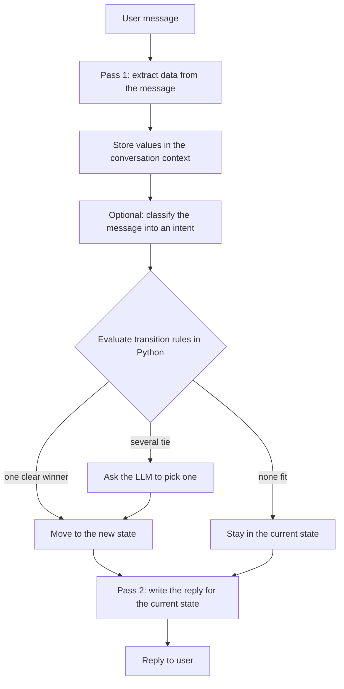
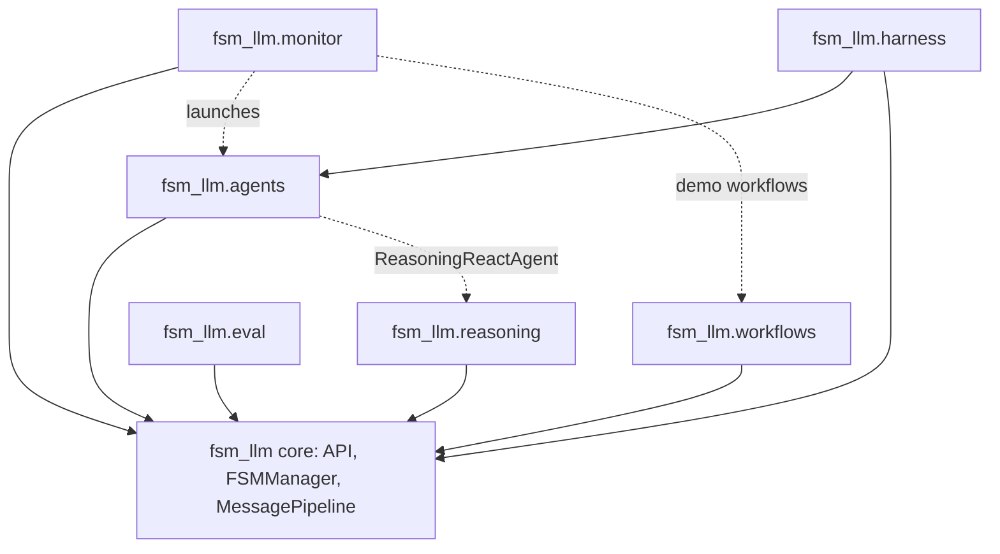

# src

The `src/` folder holds the source code of the FSM-LLM project. It contains one Python package, `fsm_llm`, which is everything the `fsm-llm` distribution installs.

## What it is for

FSM-LLM is a Python framework (version 0.12.0, Apache-2.0, Python 3.10 to 3.12) for building chatbots that follow a fixed structure. A finite state machine (FSM) is a set of named states, each with its own job, plus rules for moving between them. You describe the conversation as states in a JSON file. A large language model (LLM) does the language work: it pulls facts out of what the user typed and writes the replies. Plain Python rules decide when to move between states, so the flow stays predictable and testable.

The project uses the "src layout": the package lives under `src/` rather than at the repository root, so tests run against the installed package and not against stray files. `pyproject.toml` finds packages with `where = ["src"]`.

## What is here

- `fsm_llm/` - the whole framework. Its top-level modules are the core engine; six subpackages build on it.
- `fsm_llm.egg-info/` - metadata written by `pip install -e .`. It is generated, ignored by git (`*.egg-info/` in `.gitignore`) and removed by `make clean`. Do not edit it.

## How it works

Each user message goes through two LLM passes inside the core:



- The context is a dictionary of everything collected so far in one conversation.
- Transition rules use JsonLogic, a small JSON rule language (for example `{">=": [{"var": "age"}, 18]}`). If several transitions pass, the lowest `priority` number wins; the LLM is asked only when two or more tie at that lowest priority.
- Pass 2 is skipped when a state has empty `response_instructions`: the state says nothing (no LLM call, empty reply, nothing added to the history).
- `API.advance` runs the same turn with no user message, and `API.run_until_terminal` repeats it until a terminal state within a step and time budget. The agents are driven this way.
- Handlers are your own Python functions that run at 8 fixed points in the flow.
- FSM stacking lets a conversation hand control to a second FSM and come back with its results.

How the subpackages inside `fsm_llm` depend on the core (dotted lines are optional):



`import fsm_llm` loads only the core. Import a subpackage by name, for example `from fsm_llm.agents import ReactAgent`.

| Subpackage | What it does | Entry points |
| --- | --- | --- |
| `fsm_llm.reasoning` | Picks one of 9 reasoning strategies, runs it as a stacked FSM, checks the answer, retries up to 3 times | `ReasoningEngine`, `python -m fsm_llm.reasoning "problem"` |
| `fsm_llm.workflows` | Async in-memory workflow engine with 11 step types and a Python DSL | `WorkflowEngine`, `create_workflow`, `auto_step` |
| `fsm_llm.agents` | 18 agent patterns (ReAct, Reflexion, plan and execute, swarm, ...), tools, human approval, memory, and a meta-builder | `create_agent`, `ReactAgent`, `ToolRegistry`, `@tool`, `fsm-llm-meta` |
| `fsm_llm.monitor` | FastAPI web dashboard to launch and watch FSMs, agents and workflows; optional OpenTelemetry export | `fsm-llm-monitor` (http://127.0.0.1:8420) |
| `fsm_llm.harness` | Experimental iterative planner as a 6-state FSM whose gates count files on disk | `fsm-llm-harness new "goal"`, `HarnessAgent` |
| `fsm_llm.eval` | Scores the repository examples 0 to 4, or runs scripted conversations over several trials with confidence intervals | `fsm-llm-eval examples`, `fsm-llm-eval run cases.json` |

## How to use it

Install from the repository root (add extras in brackets, for example `pip install -e ".[monitor]"`), then use the package from Python. The examples below use `examples/basic/simple_greeting/fsm.json` from the repository root and a local Ollama model; any litellm model name works in `model=`.

```bash
pip install -e .
```

```python
from fsm_llm import API

api = API.from_file("examples/basic/simple_greeting/fsm.json", model="ollama_chat/qwen3.5:4b")
conv_id, reply = api.start_conversation()
print(api.converse("Hi, I'm Alice", conv_id))
print(api.get_data(conv_id))
api.end_conversation(conv_id)
```

Console scripts installed from `pyproject.toml`:

```bash
export LLM_MODEL=ollama_chat/qwen3.5:4b
fsm=examples/basic/simple_greeting/fsm.json
fsm-llm --fsm $fsm                    # chat interactively (fails without env LLM_MODEL)
fsm-llm-validate --fsm $fsm           # check an FSM file
fsm-llm-visualize --fsm $fsm          # draw it as ASCII (--format mermaid or dot)
fsm-llm-monitor                       # web dashboard, needs the monitor extra
fsm-llm-meta                          # design an FSM, workflow or agent by chatting
fsm-llm-harness new "goal"            # experimental iterative planner
fsm-llm-eval examples                 # score every example 0 to 4 (slow, calls the model)
```

## Things to know

- Core dependencies: loguru, litellm (>=1.83.0,<2.0), pydantic (>=2.0), python-dotenv, tenacity. Tenacity is not imported by the code but litellm's retry path needs it.
- Extras: `reasoning`, `workflows`, `agents` and `eval` add nothing; `harness` pulls in `agents`; `monitor` adds fastapi, uvicorn and jinja2; `mcp`, `otel` and `a2a` add optional integrations.
- The default model is `ollama_chat/qwen3.5:4b`, or whatever `LLM_MODEL` is set to.
- The library logs nothing until you call `setup_logging()` or `enable_debug_logging()`.
- `src/fsm_llm_agents`, `src/fsm_llm_reasoning`, `src/fsm_llm_workflows`, `src/fsm_llm_monitor` and `src/fsm_llm_harness` are leftovers from the layout before 2026-09-29 with separate top-level packages. They are not part of the current source and `make clean` does not remove them: delete them by hand in an old clone.
