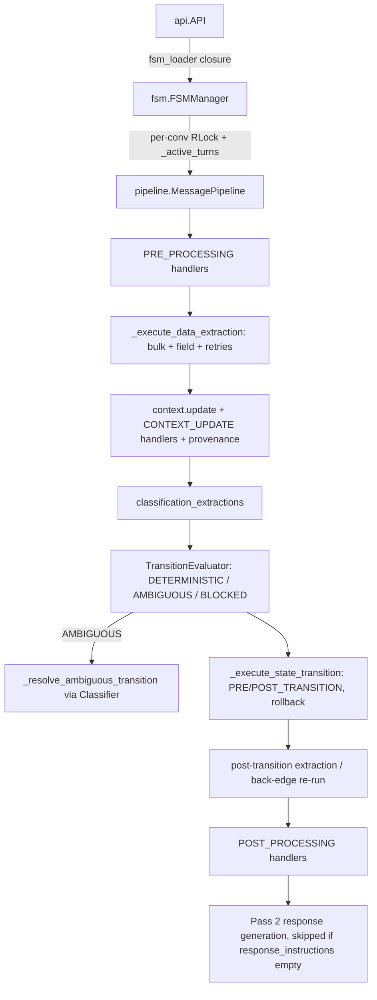

# fsm_llm

Path: `src/fsm_llm`
Purpose: Core FSM-LLM framework: JSON-defined finite state machines driven by an LLM through a 2-pass pipeline (Pass 1 extract + transition, Pass 2 respond from the final state).

## Scope

Everything needed to define, validate, visualize, and run FSM conversations: `API`, `FSMManager`, `MessagePipeline`, models, JsonLogic, handlers, classification, litellm interface, prompts, context security, working memory, sessions, CLI. Version 0.8.0 (`__version__.py`, shared by all six packages). Deps: loguru, litellm (>=1.82,<2.0, excluding 1.82.7 and 1.82.8), pydantic v2, python-dotenv. Python 3.10-3.12. Not here: reasoning, workflows, agents, monitor, harness (sibling packages that import this one).

## Architecture

Lock order is `FSMManager._lock -> conv_lock` everywhere; never take `_lock` while holding a `conv_lock` in new code. `API._stack_lock` is a plain non-reentrant `Lock` and is never held across `FSMManager` calls.

## Key files

| File | Role | Notes |
| --- | --- | --- |
| `api.py` | `API`, `FSMStackFrame`, `ContextMergeStrategy` | Stack, sessions, idle tracking, ended-conversation cache (10,000) |
| `fsm.py` | `FSMManager` | LRU FSM cache (64), `instances`, `_conversation_locks`, re-entrancy guard |
| `pipeline.py` | `MessagePipeline` | 2-pass engine, rollback contracts, provenance, classifier cache |
| `definitions.py` | Pydantic models + exceptions | `FSMDefinition` validates structure |
| `transition_evaluator.py` | `TransitionEvaluator`, `TransitionEvaluatorConfig` | Rule-based, no LLM |
| `expressions.py` | `evaluate_logic` | JsonLogic, max depth 50 |
| `classification.py` | `Classifier`, `HierarchicalClassifier`, `IntentRouter`, `HandlerFn` | litellm with JSON schema |
| `handlers.py` | `HandlerSystem`, `HandlerBuilder`, `BaseHandler`, `LambdaHandler`, `HandlerTiming`, `FSMHandler` protocol | |
| `llm.py` | `LLMInterface` ABC, `LiteLLMInterface` | Parsing ladders for structured replies |
| `ollama.py` | `is_ollama_model`, `apply_ollama_params`, JSON schemas | `ollama/` and `ollama_chat/` prefixes |
| `prompts.py` | Prompt builders + classification schema/prompt | XML-tag sanitization |
| `context.py` | `clean_context_keys`, `ContextCompactor` | |
| `memory.py` | `WorkingMemory`, `BUFFER_*`, `DEFAULT_BUFFERS`, `DEFAULT_HIDDEN_BUFFERS` | |
| `session.py` | `SessionState`, `SessionStore`, `FileSessionStore` | Atomic temp + `os.replace` |
| `utilities.py` | `extract_json_from_text`, `load_fsm_from_file`, `load_fsm_definition`, `filter_context_tree`, `strip_think_and_fences`, `coerce_confidence`, `get_fsm_summary` | |
| `validator.py`, `visualizer.py` | `FSMValidator`, ASCII diagrams | Own `main_cli` entry points |
| `runner.py`, `__main__.py` | Interactive CLI | Redacts secret-shaped context values in logs |
| `constants.py` | Defaults, security regexes, prompt text, env names | ~1,700 lines, mostly prompt strings |
| `logging.py` | `setup_logging`, `setup_file_logging`, decorators | `logger.disable("fsm_llm")` at import |

## Public interface

`API(fsm_definition, llm_interface=None, model=None, api_key=None, temperature=None (0.5), max_tokens=None (1000), max_history_size=5, max_message_length=1000, handlers=None, handler_error_mode="continue", transition_config=None, session_store=None, **llm_kwargs)`; `fsm_definition` is `FSMDefinition | dict | str path`; model falls back to env `LLM_MODEL`, then `DEFAULT_LLM_MODEL`.
- Factories: `API.from_file(path, **kw)` (FileNotFoundError), `API.from_definition(defn | definition=..., **kw)`, `API.process_fsm_definition(x) -> (FSMDefinition, fsm_id)` where `fsm_id = f"fsm_{name}_{sha256(model_dump sorted)[:8]}"`.
- Conversation: `start_conversation(initial_context=None) -> (conv_id, greeting)`, `converse(msg, conv_id) -> str`, `converse_stream(msg, conv_id) -> Iterator[str]`, `end_conversation(conv_id)`, `has_conversation_ended`, `get_data` (internal keys stripped), `get_current_state -> str`, `get_conversation_history`, `list_active_conversations`, `update_context(conv_id, dict)`, `cleanup_stale_conversations(max_idle_seconds=3600) -> list[str]`.
- Stacking: `push_fsm(conv_id, new_fsm_definition, context_to_pass=None, return_context=None, shared_context_keys=None, preserve_history=False, inherit_context=True) -> str`, `pop_fsm(conv_id, context_to_return=None, merge_strategy="update"|"preserve") -> str`, `get_stack_depth`, `get_sub_conversation_id`. Max depth `DEFAULT_MAX_STACK_DEPTH = 10`.
- Handlers: `register_handler`, `register_handlers`, `create_handler(name, timing=None, action=None) -> HandlerBuilder` (auto-registers when both given).
- Sessions: `save_session(conv_id)`, `load_session(id) -> SessionState | None`, `restore_session(id) -> (new_conv_id, SessionState) | None`. All raise `FSMError` without a store. `converse`/`converse_stream` auto-save when a store is set (failures logged, not raised).
- Management: `get_llm_interface()`, `close()`, context manager.
- Package-level (`__init__`): `has_workflows/get_workflows`, `has_reasoning/get_reasoning`, `has_agents/get_agents`, `get_version_info`, `quick_start(fsm_file, model)`, `setup_logging`, `enable_debug_logging`, `disable_warnings`. `__all__` is one static list.
- Handlers: `HandlerTiming` = `START_CONVERSATION, PRE_PROCESSING, POST_PROCESSING, PRE_TRANSITION, POST_TRANSITION, CONTEXT_UPDATE, END_CONVERSATION, ERROR`. Builder: `create_handler(name).at(*timings).on_state(*ids).not_on_state().on_target_state().not_on_target_state().when(fn).when_context_has(*keys).when_keys_updated(*keys).on_state_entry().on_state_exit().on_context_update().with_priority(n).critical().do(fn) -> BaseHandler` (or `.build()`). Handler functions take the context dict and return a delta dict. `HandlerSystem(error_mode="continue"|"raise")`: `register_handler`, `handlers_at(timing)`, `execute_handlers(timing, current_state, target_state, context, updated_keys) -> dict`, `close()`.
- `Classifier(schema, model, ...)`: `classify(msg, context=None) -> ClassificationResult`, `classify_multi(msg, context=None) -> MultiClassificationResult` (max 5 intents); optional per-call `context={history, purpose, data}` is rendered sanitized and security-filtered into a `<classification_context>` system-prompt block (never part of the classifier cache key), `is_low_confidence(result)` (uses `schema.confidence_threshold`; the model property `ClassificationResult.is_low_confidence` uses fixed 0.6). `HierarchicalClassifier` (domain then intent, for >15 intents). `IntentRouter`: `register`, `register_many`, `route`, `route_multi`, `validate`.
- `LiteLLMInterface(model, api_key, temperature, max_tokens, **kw)`: `generate_response`, `generate_response_stream -> Iterator[str]`, `extract_field`, `extract_bulk_data`. Supports `response_format` schema enforcement.
- `evaluate_logic(logic, data) -> Any`. Operators: `== === != !== > >= < <=`, `! !! and or if`, `in contains`, `+ - * / % min max`, `cat`, `var missing missing_some`, custom `has_context`, `context_length`. None rule (module docstring): ordering and arithmetic operators are False when any operand is None (`-` is unary only with one operand); `null == null` is True, None never equals a non-None value, `==` accepts numerically equal mixed number/string operands (`1.0 == "1"`) but never coerces bools or two strings (`"01" == "1"` is False); "missing" (`missing`, `missing_some`, `requires_context_keys`) means absent, None or `""` via `expressions.is_missing`; an extracted None never overwrites a stored value in the transition evaluator.
- CLI (pyproject scripts): `fsm-llm --fsm F [--mode run|validate|visualize] [--style full|compact|minimal] [-n history] [-l msglen]`, `fsm-llm-validate --fsm F`, `fsm-llm-visualize --fsm F [--style]`. `run` needs env `LLM_MODEL` (optional `LLM_TEMPERATURE`, `LLM_MAX_TOKENS`, `FSM_PATH`), loads `.env`.

## Data shapes

- `FSMDefinition{name, description, states: dict[str, State], initial_state, version="4.1", persona, handler_only_keys=[]}`. Validator: initial state exists, `state.id == key`, transition targets exist, at least one terminal state, no orphaned states, a reachable terminal.
- `State{id (ASCII identifier), description (<=300), purpose (<=500), extraction_instructions, response_instructions, transitions, required_context_keys, extraction_retries 0-3 (=1), extraction_confidence_threshold (=0.0), transition_classification, field_extractions, classification_extractions, context_scope: ContextScope{read_keys, write_keys} (lists of str; a dict is accepted, unknown keys rejected)}`. Load-time errors: a `field_name` declared twice in one extraction list (one field extraction named like a classification field is allowed, the below-threshold fallback), a `required_context_keys` entry that is blank or internal-prefixed.
- `Transition{target_state, description, conditions, priority 0-1000 (=100), llm_description}`; `TransitionCondition{description, requires_context_keys, logic, evaluation_priority}` (logic validated at load exactly where `evaluate_logic` evaluates it: allow-listed operators, exactly one key per operator object, depth <= `constants.MAX_JSONLOGIC_DEPTH` (50); data lists and the raw arguments of `var`/`missing`/`missing_some` are data and not walked).
- `ClassificationExtractionConfig{field_name, intents (>=2), fallback_intent (must be one of intents), confidence_threshold, model}` - intents sit directly on the entry, no nested schema.
- `FieldExtractionConfig{field_name, field_type, extraction_instructions, validation_rules, required, confidence_threshold}`.
- `FSMContext{data, conversation: Conversation, metadata, working_memory (exclude=True)}`; `FSMInstance{fsm_id, current_state, context, persona, last_extraction_response, last_transition_decision, last_response_generation}`; `Conversation{exchanges [{"user"|"system": text}], max_history_size, max_message_length, summary}`; a non-empty `summary` (digest of trimmed exchanges, capped at 2,000 chars) is rendered sanitized as `<conversation_summary>` in the shared history section (Pass 1 bulk and Pass 2) and the per-field prompt.
- `SessionState{conversation_id, fsm_id, current_state, context_data, conversation_history, stack_depth, working_memory {"buffers", "hidden_buffers"} | None, conversation_summary | None, saved_at, metadata {"pipeline_extracted": digests}}`.
- Seeded context keys: `_conversation_id`, `_conversation_start`, `_timestamp`, `_fsm_id`; on transition `_previous_state`, `_current_state`, `_transition_timestamp`; ERROR handlers see `_error`, `_traceback`; push with history adds `_inherited_history`; pop with history adds `_sub_conversation_summary`.

## Invariants and constraints

- Transitions: `TransitionEvaluator` passes a transition only if all its conditions pass. Among passing transitions the unique lowest `priority` value -> DETERMINISTIC, whatever the gap or condition count; two or more tied at the lowest priority -> AMBIGUOUS with only the tied group as classifier candidates. Per-transition confidence is diagnostic only; `TransitionEvaluatorConfig.minimum_confidence` and `ambiguity_threshold` are deprecated no-ops kept for compatibility. None -> BLOCKED (stay). AMBIGUOUS goes to a `Classifier`; classifier error or fallback intent means stay.
- Turn atomicity: `process()` deep-copies `current_state`, `context.data`, `working_memory`, `metadata` before the turn. PRE_PROCESSING failure restores. POST_PROCESSING or Pass-2 failure restores the whole turn, including Pass 1's committed transition. Inside Pass 1: CONTEXT_UPDATE failure after extraction rolls back only the committed keys (shallow); POST_TRANSITION failure restores the full data+metadata snapshot and the old state; a post-transition CONTEXT_UPDATE `HandlerExecutionError` propagates with the transition already committed. Handler external side effects are never undone.
- `FSMManager`: failed turn pops the just-added user message; ERROR handlers run for `FSMError` and other exceptions (stream path too) but not for `KeyboardInterrupt`, `SystemExit`, `GeneratorExit`; an ERROR handler's raise replaces the original (chained). ERROR handler return values are not merged.
- Re-entrancy: a same-conversation `converse`/`converse_stream` while a turn is in flight (from a handler or another thread) raises `FSMError`; `update_context` and reads are allowed.
- Streams acquire `conv_lock` lazily on first `next()`, so an abandoned generator leaks nothing. Existence is validated eagerly at call time.
- Terminal state: `converse` raises `FSMError("Conversation has ended ...")`.
- Pass 2 is skipped when the state's `response_instructions` is empty; the greeting then records and returns a `[<state_id>]` marker.
- Provenance: `context.metadata["_pipeline_extracted"]` holds a digest per pipeline-extracted key. The bulk pass overwrites a stored key only if it is config-covered, the FSM is not agent-managed (`agent_trace` in context), and the stored value still matches its digest; handler and `update_context` values are never overwritten. Refused corrections the user stated reach Pass 2 as `<rejected_corrections>` (whole-token match, values of 3+ chars). A failed bulk call sets `DataExtractionResponse.extraction_failed`.
- Classification records: every classification-extraction result is stored in full (intent, confidence, reasoning, entities, `low_confidence` when below threshold, JSON-native `context_snapshot` of `context_keys`) at `context.metadata["classification_results"][field_name]`; only the intent string enters `context.data`. The ambiguous-transition record goes to `context.data["_transition_classification_result"]` (JsonLogic back-compat) and `context.metadata["transition_classification"]`; both are cleared at turn start. All are readable via `get_complete_conversation()["metadata"]`, roll back with the turn, are replaced copy-on-write, and are not saved by `save_session`.
- Post-transition: after a transition on a non-agent FSM, the new state's missing config-covered keys are extracted; a transition into a different state whose keys already carry provenance re-runs that state's Pass-1 extraction (not for self-loops or states with `classification_extractions`).
- `handler_only_keys` are never extracted from user text (bulk, per-field, post-transition). `fsm-llm-validate` warns on unreferenced or classification-owned listed keys.
- Classifier cache: per pipeline, content-keyed, max 64 (`MAX_CLASSIFIER_CACHE_SIZE`), FIFO, one critical section under `_classifier_cache_lock`; non-JSON-native connection kwargs bypass the cache. Soft-fail exceptions: `ClassificationError, ValueError, TypeError, KeyError, RuntimeError, OSError`.
- Ollama at temperature 0: identical null per-field extractions are memoised within one extraction call.
- Security: internal prefixes `_`, `system_`, `internal_`, `__` via `constants.has_internal_prefix` (never re-inline `startswith("_")`). Three filters share `MAX_CONTEXT_FILTER_DEPTH = 16` and `MAX_CONTEXT_FILTER_NODES = 100_000` (every visited value costs one node) and fail closed at either bound; a container already on the active recursion path (a cycle) is dropped: `fsm._strip_internal_mapping` (drops, for `get_data`; non-JSON values returned as-is), `context.clean_context_keys` (drops None/internal/forbidden), `prompts._filter_context_for_security` (drops for prompts). The last two replace any leaf that is not str/int/float/bool/None or an exact stdlib value scalar (date/datetime/time/timedelta, Decimal, UUID) with `"<redacted:TypeName>"` via `utilities.redact_non_json_leaf`. `runner._redact_context` keeps keys and redacts values on purpose. The single decision point is `constants.is_forbidden_context_entry`: name patterns in `COMPILED_FORBIDDEN_CONTEXT_PATTERNS`, plus whole-segment credential names (`pin`, `pass`, `pwd`, `otp`, `cvv`, `ssn`, `jwt`, `cookie`, `bearer`, `authorization`, `card_number`, ...) that strip unless the tail is only policy suffixes (`pin_attempts`) or the value is a `bool`, plus the value layer for `*_key`/`*_token`.
- Sessions: `save_session` snapshots the ROOT frame atomically via `FSMManager.get_conversation_snapshot` (stacks are not restorable). `restore_session` starts with `_suppress_start=True` (no START handlers, no greeting), seeds the saved `conversation_summary`, replays history (a replay trim appends to that summary), re-seeds provenance and working memory, then `set_conversation_state` (raises `FSMError` for a state not in this FSM; the half-restored conversation is ended). A different `fsm_id` only logs a WARNING. Missing/null `buffers` or `hidden_buffers` mean defaults; explicit `{}`/`[]` are honoured.
- `FileSessionStore`: ids must match `^[a-zA-Z0-9_\-]+$`; `load` returns None on unreadable files; values round-trip through `json.dumps(default=str)`.
- `WorkingMemory` non-hidden buffers sit under `context.data` (data wins) in `FSMContext.get_merged_data()`, which feeds the transition evaluator (a buffer key can gate a transition) and the Pass-2 `<current_context>` at all three sites (sync, stream, greeting), scoped by `read_keys`. `get_user_visible_data` (the same merge minus internal keys) feeds the Pass-1 per-field prompt and both classifier call sites (scoped by `context_keys` or `read_keys`, with the last 3 exchanges and the state purpose). Bulk extraction sees `data` only; hidden buffers reach nothing; nothing syncs buffers and `data`.
- Idle tracking: `_get_current_fsm_conversation_id` is the single `_last_accessed` refresh point (`time.monotonic()`), plus `pop_fsm` and `get_stack_depth`.
- Temp FSM definitions from `push_fsm` live in `_temp_fsm_definitions` until no frame (or in-flight push in `_pending_push_ids`) references them.

## Dependencies

- External: `litellm` (all LLM calls), `pydantic` v2 (models), `loguru` (logging), `python-dotenv` (CLI). No internal package dependencies.
- Consumers rely on: `API`, `HandlerTiming`, `create_handler`, `LLMInterface`, `FSMDefinition`, `constants.has_internal_prefix`, `constants.DEFAULT_LLM_MODEL`, `API.fsm_manager.get_complete_conversation` (monitor), `CONTEXT_KEY_AGENT_TRACE` semantics (agents).

## Failure modes

- Exceptions: `FSMError` -> `StateNotFoundError`, `InvalidTransitionError`, `LLMResponseError`, `TransitionEvaluationError`, `ClassificationError` -> (`SchemaValidationError`, `ClassificationResponseError`); `HandlerSystemError(FSMError)` -> `HandlerExecutionError(handler_name, original_error)`.
- `API` wraps unexpected exceptions as `FSMError`; `ValueError` for unknown conversation ids passes through. Invalid definitions raise `ValueError` from `process_fsm_definition`.
- `start_conversation` failure fires END_CONVERSATION handlers and frees resources; a failing END handler wins (chained).
- A classifier failure or low-confidence result degrades to "stay" or leaves the key unset (WARNING logged with field, intent, confidence, threshold).
- LLM reply parsing: uncoercible `confidence` becomes 0.5; `<think>` blocks and a leading code fence are stripped (Pass 2 strips think blocks before its embedded-JSON rung too, so a draft in a trace never wins); a flat bulk-extraction reply loses its top-level `confidence`/`reasoning` envelope keys; `extract_json_from_text` returns a dict or None.

## Working here

- Conventions: ruff (py310, line 88), mypy, Pydantic v2 with `model_validator`, `from fsm_llm.logging import logger`, single static `__all__`. Many `# DECISION plan-.../D-NNN` comments guard non-obvious choices; read them before changing the code next to them and do not revert what they forbid.
- Adding a JsonLogic operator: add it to `expressions.py` and to the allowlist in `constants.py` (`ALLOWED_JSONLOGIC_OPERATIONS`) or `TransitionCondition` validation rejects it.
- Adding a state field: update `State` in `definitions.py`, the pipeline read site, `validator.py` known keys (unknown keys warn), and docs snippets.
- New handler firing site: follow the existing rule that whatever escapes `execute_handlers` is re-raised, and snapshot/restore both `data` and `metadata` if you roll back.
- Tests: `pytest tests/test_fsm_llm/` (mock LLMs: `Mock(spec=LLMInterface)` and `MockLLM2Interface` in `conftest.py`; fixtures `sample_fsm_definition` v3.0, `sample_fsm_definition_v2` v4.1). `tests/test_fsm_llm/test_docs_snippets.py` loads every full FSM JSON snippet in `README.md`, `docs/quickstart.md`, this folder's `README.md`, and root `CLAUDE.md`, so keep those snippets valid. Live suite `test_live_classification_memory.py` self-skips without Ollama.
- Commands: `make test`, `make lint`, `make type-check`.
