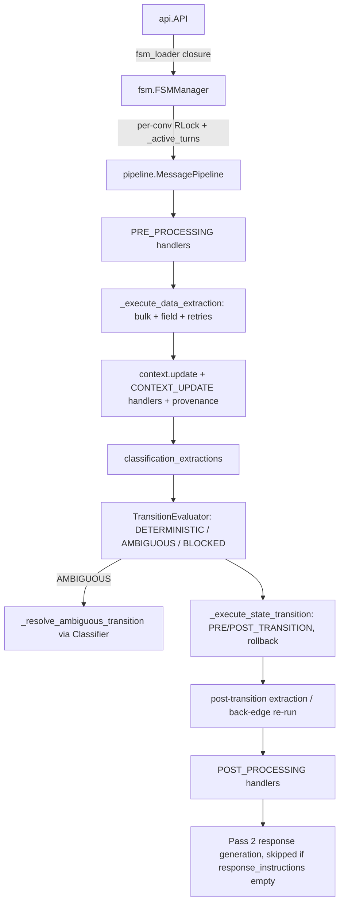
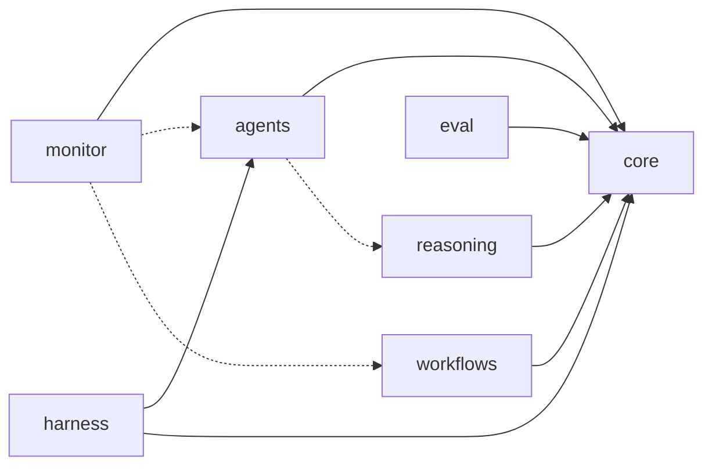

# fsm_llm

Path: `src/fsm_llm`
Purpose: The FSM-LLM package: core engine (JSON-defined finite state machines driven by an LLM through a 2-pass pipeline) at the top level, plus six subpackages (reasoning, workflows, agents, monitor, harness, eval) built on it.

## Scope

- Top-level modules: the core. `API`, `FSMManager`, `MessagePipeline`, Pydantic models, JsonLogic, handlers, classification, litellm interface, prompts, context security, working memory, sessions, validator, visualizer, CLI.
- Subpackages (each has its own README.md/CLAUDE.md with full contracts): `reasoning/`, `workflows/`, `agents/`, `monitor/`, `harness/`, `eval/`. Summarised under Subpackages below.
- Version 0.11.0 in `__version__.py`; every subpackage re-exports it. Python 3.10-3.12. Core deps (pyproject): loguru, litellm (>=1.83.0,<2.0), pydantic (>=2.0), python-dotenv, tenacity (needed by litellm's sync retry path; nothing here imports it, do not remove).
- `__init__.py` never imports a subpackage (DECISION D-003 of plan 3a032517: they import `from fsm_llm import API`, so an eager import hits a half-initialised package, and monitor would drag fastapi into core installs). Do not add eager imports or a module `__getattr__`. `has_workflows/get_workflows`, `has_reasoning/get_reasoning`, `has_agents/get_agents` probe by dotted name; `get_*` gives the install hint only when the package itself is missing.

## Architecture

```mermaid
flowchart TD
    API[api.API] -->|fsm_loader closure| FM[fsm.FSMManager]
    FM -->|per-conv RLock + _active_turns| MP[pipeline.MessagePipeline]
    MP --> PRE[PRE_PROCESSING handlers]
    PRE --> DX[_execute_data_extraction: bulk + field + retries]
    DX --> CU[context.update + CONTEXT_UPDATE handlers + provenance]
    CU --> CX[classification_extractions]
    CX --> TE[TransitionEvaluator: DETERMINISTIC / AMBIGUOUS / BLOCKED]
    TE -->|AMBIGUOUS| AC[_resolve_ambiguous_transition via Classifier]
    TE --> ST[_execute_state_transition: PRE/POST_TRANSITION, rollback]
    ST --> PX[post-transition extraction / back-edge re-run]
    PX --> POST[POST_PROCESSING handlers]
    POST --> RG[Pass 2 response generation, skipped if response_instructions empty]
```

Lock order is `FSMManager._lock -> conv_lock` everywhere; never take `_lock` while holding a `conv_lock`. `FSMManager._fsm_cache_lock` is a leaf lock (never take another lock or run the loader under it). `API._stack_lock` is a plain non-reentrant `Lock`, never held across `FSMManager` calls.

Subpackage dependencies (solid = required, dotted = optional):

```mermaid
flowchart LR
    reasoning --> core
    workflows --> core
    agents --> core
    agents -.-> reasoning
    monitor --> core
    monitor -.-> agents
    monitor -.-> workflows
    harness --> agents
    harness --> core
    eval --> core
```

## Key files

| File | Role | Notes |
| --- | --- | --- |
| `api.py` | `API`, `FSMStackFrame`, `ContextMergeStrategy` | Stack, sessions, idle tracking, ended-conversation cache (10,000; the four getters read it only when the conversation is gone, never for a live one) |
| `fsm.py` | `FSMManager` | LRU definition cache (`max_fsm_cache_size`, default 64, below 1 raises `ValueError`), `instances`, `_conversation_locks`, re-entrancy guard; `get_end_snapshot`, `get_conversation_snapshot`, `seed_restored_conversation`, `set_conversation_state`, `has_instance`, `copy_raw_context_data`, `get_complete_conversation`, `prune_orphaned_locks` |
| `pipeline.py` | `MessagePipeline` | 2-pass engine, rollback contracts, provenance, classifier cache |
| `definitions.py` | Pydantic models + exceptions, `logic_referenced_keys` | `FSMDefinition` validates structure at load |
| `transition_evaluator.py` | `TransitionEvaluator`, `TransitionEvaluatorConfig` | Rule-based, no LLM |
| `expressions.py` | `evaluate_logic`, `is_missing` | JsonLogic, max depth 50 |
| `classification.py` | `Classifier`, `HierarchicalClassifier`, `IntentRouter`, `HandlerFn` | litellm with JSON schema |
| `handlers.py` | `HandlerSystem`, `HandlerBuilder`, `BaseHandler`, `LambdaHandler`, `HandlerTiming`, `FSMHandler` protocol, `create_handler` | |
| `llm.py` | `LLMInterface` ABC, `LiteLLMInterface` | Parsing ladders; Pass 2 skipped on `skip_generation` or the `"."` system-prompt sentinel (kept until 1.0); supported-params lookup memoised per model (failures not memoised); one apology retry counted in `apology_retry_count` |
| `ollama.py` | `is_ollama_model`, `apply_ollama_params`, `prepare_ollama_messages`, `build_ollama_response_format` | `ollama/` and `ollama_chat/` prefixes |
| `prompts.py` | Prompt builders, classification schema/prompt, `sanitize_text_for_prompt` | XML-tag sanitization; `DataExtractionPromptBuilder` has no prompt method (the pipeline builds the bulk prompt inline) |
| `context.py` | `clean_context_keys`, `ContextCompactor` (`compact`, `prune`, `summarize`) | |
| `memory.py` | `WorkingMemory`, `BUFFER_*`, `DEFAULT_BUFFERS`, `DEFAULT_HIDDEN_BUFFERS` | `hidden_buffers` is a read-only `frozenset` property |
| `session.py` | `SessionState`, `SessionStore`, `FileSessionStore`, `session_json_default` | Atomic temp + `os.replace` |
| `utilities.py` | `extract_json_from_text`, `load_fsm_from_file`, `load_fsm_definition`, `filter_context_tree`, `ContextFilterWorkError`, `redact_non_json_leaf`, `redacting_json_default`, `strip_think_and_fences`, `coerce_confidence`, `get_fsm_summary` | `redacting_json_default` is the one `json.dumps` `default=` hook for every writer that emits context out of the process (disk, prompt, websocket) |
| `validator.py`, `visualizer.py` | `FSMValidator`, ASCII diagrams | Own `main_cli` entry points |
| `runner.py`, `__main__.py` | Interactive CLI | `_redact_context` redacts secret-shaped values in logs (keys kept; a cycle becomes `"<redacted:cycle>"`); only secrets are redacted |
| `security.py` | `INTERNAL_KEY_PREFIXES`, `has_internal_prefix`, `is_forbidden_context_entry`, `FORBIDDEN_CONTEXT_PATTERNS`, `COMPILED_FORBIDDEN_CONTEXT_PATTERNS` | Stdlib only, never imports `constants` |
| `constants.py` | Defaults, limits, env names, JsonLogic allowlist, shared key names | Re-exports every public `security.py` name and each private one a caller uses |
| `logging.py` | `setup_logging`, `setup_file_logging`, `setup_cli_logging`, `enable_library_logging`, `reset_handlers`, `register_stream_handler`, decorators | `logger.disable("fsm_llm")` at import |

## Subpackages

| Package | Role | Public entry points | Core contracts it relies on |
| --- | --- | --- | --- |
| `reasoning/` | Orchestrator FSM analyses a problem, a classifier FSM recommends one of 9 strategy FSMs (`simple_calculator`, `analytical`, `deductive`, `inductive`, `abductive`, `analogical`, `creative`, `critical`, `hybrid`), which is pushed, driven (max 30 turns) and popped; solution validated with up to 3 retries; max 50 orchestrator rounds | `ReasoningEngine(model=DEFAULT_LLM_MODEL, **kw).solve_problem(problem, initial_context=None) -> (solution, {reasoning_trace, summary, final_context, all_responses})`; CLI `python -m fsm_llm.reasoning` (no console script) | `push_fsm`/`pop_fsm`, `ContextMergeStrategy.UPDATE`, handlers, `redacting_json_default` |
| `workflows/` | Async in-memory engine; 11 step types; DSL; statuses `pending/running/waiting/completed/failed/cancelled`; no persistence; not wired into `API` | `WorkflowEngine`, `WorkflowDefinition`, `create_workflow`, `auto_step`, `condition_step`, `wait_event_step`, ..., `WorkflowEvent` | `has_internal_prefix`, `FSMError`, lazy `API` in `ConversationStep`, `ResponseGenerationRequest` in `LLMProcessingStep` |
| `agents/` | 18 patterns (ReAct and 17 others), most as generated FSM dicts driven by `BaseAgent._standard_run` sending `"Continue."`; tools, HITL approval, memory, swarm/graph, MCP, remote A2A, SOPs, meta-builder | `create_agent`, `ReactAgent`, `BaseAgent`, `AgentConfig`, `AgentResult`, `ToolRegistry`, `@tool`, `HumanInTheLoop`, `MetaBuilderAgent`; console script `fsm-llm-meta` | Seeds `agent_trace` (pipeline treats the FSM as agent-managed), `CONTEXT_KEY_OUTPUT_RESPONSE_FORMAT`, empty `response_instructions` to skip Pass 2, lowest-priority-wins transitions, `get_complete_conversation` for the HITL policy |
| `monitor/` | FastAPI dashboard (REST + WebSocket + vanilla-JS SPA), launches FSMs, 7 agent types and 2 demo workflows; optional OTEL span exporter | `fsm-llm-monitor` (default `http://127.0.0.1:8420`), `configure`, `app`, `InstanceManager`, `MonitorBridge`, `EventCollector`, `OTELExporter` | `BaseHandler` hooks at priority 9999, `has_internal_prefix` + `is_forbidden_context_entry` via its `redact_context`, `redacting_json_default`, `enable_library_logging` |
| `harness/` | Iterative-planner protocol as a 6-state, 9-transition FSM (EXPLORE, PLAN, EXECUTE, REFLECT, PIVOT, CLOSE) whose gates read values counted from disk; 2-attempt leash; experimental | `fsm-llm-harness new/resume/status/validate/close`, `HarnessAgent`, `PlanDirectory`, `pre_step_gate`, `audit` | Extraction skips non-None fields, a condition whose required key is absent fails, distinct priorities keep gates off the classifier |
| `eval/` | Examples evaluator (subprocess per example, heuristic score 0-4, scorecard) and conversation cases (scripted turns, expectations, trials, Wilson CI) | `fsm-llm-eval examples`, `fsm-llm-eval run DATASET`, `run_dataset`, `EvalConfig`, `pass_rate`, `wilson_ci` | Fresh `API` per trial, `LLMInterface` factory for offline tests, `setup_cli_logging` |

Exception roots: core `FSMError`; `ReasoningEngineError`, `WorkflowError`, `AgentError`, `HarnessError`, `EvalError` all subclass `FSMError`; `MonitorError` subclasses `Exception` only.

## Public interface

`API(fsm_definition, llm_interface=None, model=None, api_key=None, temperature=None (0.5), max_tokens=None (1000), max_history_size=5, max_message_length=1000, handlers=None, handler_error_mode="continue", transition_config=None, session_store=None, handler_timeout=None, max_fsm_cache_size=64, **llm_kwargs)`. `fsm_definition` is `FSMDefinition | dict | str path`; model falls back to env `LLM_MODEL`, then `DEFAULT_LLM_MODEL` (`ollama_chat/qwen3.5:4b`). `handler_timeout` goes to the one `HandlerSystem` the API owns (straggler cap shared by all its conversations). Not settable through `API`: the three prompt builders and the FSM loader (build `FSMManager` directly).
- Factories: `API.from_file(path, **kw)` (`FileNotFoundError`), `API.from_definition(defn | definition=..., **kw)`, `API.process_fsm_definition(x) -> (FSMDefinition, fsm_id)` with `fsm_id = f"fsm_{name}_{sha256(model_dump sorted)[:8]}"`.
- Conversation: `start_conversation(initial_context=None) -> (conv_id, greeting)`, `converse(msg, conv_id) -> str`, `converse_stream(msg, conv_id) -> Iterator[str]`, `end_conversation`, `has_conversation_ended`, `get_data` (internal keys stripped), `get_current_state -> str`, `get_conversation_history`, `list_active_conversations`, `update_context(conv_id, dict)`, `cleanup_stale_conversations(max_idle_seconds=3600) -> list[str]`.
- Stacking: `push_fsm(conv_id, new_fsm_definition, context_to_pass=None, return_context=None, shared_context_keys=None, preserve_history=False, inherit_context=True) -> str`, `pop_fsm(conv_id, context_to_return=None, merge_strategy="update"|"preserve") -> str`, `get_stack_depth`, `get_sub_conversation_id`. Max depth `DEFAULT_MAX_STACK_DEPTH = 10`.
- Handlers: `register_handler`, `register_handlers`, `API.create_handler(name, timing=None, action=None) -> HandlerBuilder` (auto-registers when both given).
- Sessions: `save_session(conv_id)`, `load_session(id) -> SessionState | None`, `restore_session(id) -> (new_conv_id, SessionState) | None`; all raise `FSMError` without a store. `converse`/`converse_stream` auto-save when a store is set (failures logged).
- Management: `get_llm_interface()`, `close()`, context manager.
- Package level: `get_version_info`, `quick_start(fsm_file, model)`, `setup_logging`, `enable_debug_logging`, `disable_warnings`, the `has_*/get_*` helpers. `__all__` is one static list.
- `HandlerTiming`: `START_CONVERSATION, PRE_PROCESSING, POST_PROCESSING, PRE_TRANSITION, POST_TRANSITION, CONTEXT_UPDATE, END_CONVERSATION, ERROR`. Builder: `create_handler(name).at(*timings).on_state(*ids).not_on_state().on_target_state().not_on_target_state().when(fn).when_context_has(*keys).when_keys_updated(*keys).on_state_entry().on_state_exit().on_context_update().with_priority(n).critical().do(fn) -> BaseHandler` (or `.build()`). Handler functions take the context dict and return a delta dict (`None` value deletes a key). `HandlerSystem(error_mode="continue"|"raise", handler_timeout=None)`: `register_handler`, `handlers_at(timing)`, `execute_handlers(timing, current_state, target_state, context, updated_keys) -> dict`, `close()`.
- `Classifier(schema, model=DEFAULT_LLM_MODEL, *, api_key=None, config=None, **litellm_kwargs)`: `classify(msg, context=None)`, `classify_multi(msg, context=None)` (max 5 intents), `is_low_confidence(result)` (uses `schema.confidence_threshold`). Optional `context={history, purpose, data}` is rendered sanitized and security-filtered into the system prompt, never into the cache key. `ClassificationResult.is_below_default_threshold` uses a fixed 0.6. `HierarchicalClassifier` (domain then intent). `IntentRouter`: `register`, `register_many`, `route`, `route_multi`, `validate`.
- `LiteLLMInterface(model, api_key=None, temperature=0.5, max_tokens=1000, timeout=120.0, retries=0, **kw)`: `generate_response`, `generate_response_stream`, `extract_field`, `extract_bulk_data`. `constants.RESERVED_LLM_CALL_KWARGS` (`model`, `messages`, `temperature`, `max_tokens`, `stream`, `response_format`) in constructor kwargs are ignored with a WARNING (same in `Classifier`). `retries` maps to the SDK's `max_retries`, never `num_retries`.
- `evaluate_logic(logic, data)`. Operators (`constants.ALLOWED_JSONLOGIC_OPERATIONS`): `== === != !== > >= < <=`, `! !! and or if`, `in contains`, `+ - * / % min max`, `cat`, `var missing missing_some`, custom `has_context`, `context_length`. None rule: ordering operators are False with a None operand; arithmetic on None yields a private UNDEFINED that makes every comparison and membership False and `evaluate_logic` return None; `null == null` is True; `==` accepts a number vs a plain ASCII numeric string (`1.0 == "1"`) but never coerces bools or two strings; "missing" means absent, None or `""` (`expressions.is_missing`); `%` keeps Python floored semantics.
- CLI (pyproject scripts): `fsm-llm --fsm F [--mode run|validate|visualize] [--style full|compact|minimal] [-n history] [-l msglen]`, `fsm-llm-validate --fsm F`, `fsm-llm-visualize --fsm F [--style]`. `run` needs env `LLM_MODEL` (optional `LLM_TEMPERATURE`, `LLM_MAX_TOKENS`, `FSM_PATH`) and loads `.env`. Subpackage scripts: `fsm-llm-monitor`, `fsm-llm-meta`, `fsm-llm-harness`, `fsm-llm-eval`.

## Data shapes

- `FSMDefinition{name, description, states: dict[str, State], initial_state, version="4.1", persona, handler_only_keys=[]}`. Load checks: initial state exists, `state.id == key`, transition targets exist, a reachable terminal state, no orphaned states.
- `State{id, description (<=300), purpose (<=500), extraction_instructions, response_instructions, transitions, required_context_keys, extraction_retries (=1), extraction_confidence_threshold, transition_classification, field_extractions, classification_extractions, context_scope: ContextScope{read_keys, write_keys}}`. A state without transitions is terminal.
- `Transition{target_state, description, conditions, priority 0-1000 (=100), llm_description}`; `TransitionCondition{description, requires_context_keys, logic, evaluation_priority}`; `logic` is validated at load (allow-listed operators, one key per operator object, depth <= `MAX_JSONLOGIC_DEPTH` 50).
- `ClassificationExtractionConfig{field_name, intents (>=2), fallback_intent (one of intents), confidence_threshold, required, model, prompt_config, context_keys}`: intents sit directly on the entry, no nested schema.
- `FieldExtractionConfig{field_name, field_type, extraction_instructions, validation_rules, required, confidence_threshold}`.
- `FSMContext{data, conversation: Conversation, metadata, working_memory (exclude=True)}`; `FSMInstance{fsm_id, current_state, context, persona, last_extraction_response, last_transition_decision, last_response_generation}`; `Conversation{exchanges [{"user"|"system": text}], max_history_size, max_message_length, summary}` (summary digests trimmed exchanges, capped at 2,000 chars, rendered as `<conversation_summary>`).
- `SessionState{conversation_id, fsm_id, current_state, context_data, conversation_history, stack_depth, working_memory {"buffers", "hidden_buffers"} | None, conversation_summary, saved_at, metadata {"pipeline_extracted": digests}}`.
- Seeded context keys: `_conversation_id`, `_conversation_start`, `_timestamp`, `_fsm_id`; on transition `_previous_state`, `_current_state`, `_transition_timestamp`; ERROR handlers see `_error`, `_traceback`; push with history adds `_inherited_history`; pop with history adds `_sub_conversation_summary`. These plus `_transition_classification_result` form `constants.RESERVED_CONTEXT_KEYS`, which a handler delta can neither set nor delete.

## Invariants and constraints

- Transitions: a transition passes only if all its conditions pass. Unique lowest `priority` among passing transitions -> DETERMINISTIC, whatever the gap; a tie at the lowest priority -> AMBIGUOUS, only the tied group goes to a `Classifier` (error or fallback intent = stay); none -> BLOCKED (stay). No confidence score; `TransitionEvaluatorConfig.minimum_confidence`, `ambiguity_threshold`, `evidence_conditions_normalizer` warn when non-default and do nothing (removed in 1.0). `required_context_keys` only guides extraction; gate with a condition.
- Turn atomicity: `process()` deep-copies `current_state`, `context.data`, `working_memory`, `metadata` first. PRE_PROCESSING failure restores. POST_PROCESSING or Pass-2 failure restores the whole turn, including Pass 1's transition. Inside Pass 1: CONTEXT_UPDATE failure rolls back only the committed keys; POST_TRANSITION failure restores the pre-transition snapshot. Handler external side effects are never undone.
- `FSMManager`: a failed turn pops the just-added user message; ERROR handlers run for any exception (stream path too) except `KeyboardInterrupt`, `SystemExit`, `GeneratorExit`; an ERROR handler's raise replaces the original (chained); ERROR deltas are not merged. `end_conversation` waits `END_CONVERSATION_LOCK_TIMEOUT_SECONDS` (30) for a running turn, then raises `ConversationBusyError` without tearing anything down. `API.end_conversation` reads its cache with the same bounded wait, ends frames before dropping bookkeeping, and propagates a refusal; `cleanup_stale_conversations` and `close()` log it and continue.
- Handlers: `register_handler` is copy-on-write under a lock and rejects a non-real priority (`TypeError`) or NaN (`ValueError`). A failure is wrapped once in `HandlerExecutionError` (pickles). With `handler_timeout`, each handler runs on its own deep copy in a daemon thread; a timed-out result is discarded; while `MAX_TIMED_HANDLER_STRAGGLERS` (4) timed-out threads still run, a new timed call fails at once. Zero handlers at a timing skips the deep copy.
- Re-entrancy: a same-conversation `converse`/`converse_stream` while a turn is in flight raises `FSMError`; `update_context` and reads are allowed. Streams acquire `conv_lock` lazily on first `next()`; existence is validated at call time.
- Terminal state: `converse` raises `FSMError("Conversation has ended ...")`. Pass 2 is skipped when `response_instructions` is empty; the turn and greeting return a `[<state_id>]` marker.
- Provenance: `context.metadata["_pipeline_extracted"]` holds a digest per pipeline-extracted key. Bulk extraction overwrites a stored key only if config-covered, the FSM is not agent-managed (`agent_trace` in context), and the stored value still matches its digest; handler and `update_context` values are never overwritten. Refused corrections reach Pass 2 as `<rejected_corrections>`. `handler_only_keys` are never extracted from user text.
- Post-transition (non-agent FSMs): the new state's missing config-covered keys are extracted; entering a different state whose keys carry provenance re-runs its Pass-1 extraction (not for self-loops or states with `classification_extractions`).
- Classification records: full results at `context.metadata["classification_results"][field]` (secret-looking snapshot entries dropped); only the intent string enters `context.data`. Ambiguous-transition record at `context.data["_transition_classification_result"]` and `context.metadata["transition_classification"]`, cleared at turn start. Classifier cache: per pipeline, content-keyed, max 64 (`MAX_CLASSIFIER_CACHE_SIZE`), under `_classifier_cache_lock`.
- Security: internal prefixes `_`, `system_`, `internal_`, `__` only via `has_internal_prefix` (case-insensitive); never re-inline `startswith("_")`. Secret-looking entries only via `is_forbidden_context_entry(key, value)`: name patterns, whole-segment credential names (`pin`, `pass`, `pwd`, `otp`, `cvv`, `cvc`, `ssn`, `jwt`, `cookie`, `bearer`, `authorization`, `card_number`, ...; digit suffix and camelCase/acronym forms match) that strip unless the value is a `bool` or the tail is only policy suffixes and the value is not credential-shaped, plus value-shape layers for `*_key`/`*_token`. Three filters share `MAX_CONTEXT_FILTER_DEPTH = 16` (fail closed) and drop cycles: `fsm._strip_internal_mapping` (`get_data`, `save_session`), `context.clean_context_keys` (committed extraction), prompt filter in `prompts.py`. Only the prompt filter has the truncating budget `MAX_CONTEXT_FILTER_NODES = 100_000`; `utilities.filter_context_tree` never truncates and raises `ContextFilterWorkError` on a pathological cycle.
- Sessions: `save_session` snapshots the ROOT frame atomically (`get_conversation_snapshot`); stacks are not restorable. `restore_session` starts with `_suppress_start=True` (no START handlers, no greeting), seeds summary, history, provenance and working memory in one `seed_restored_conversation` call, then `set_conversation_state` (unknown state -> `FSMError`, half-restored conversation ended). A different `fsm_id` only warns. `FileSessionStore` ids match `[a-zA-Z0-9_\-]+`; values go through `session_json_default` (lossy: datetime-like -> `str()`, other non-JSON -> `"<redacted:TypeName>"`); the file holds the full context.
- `WorkingMemory` non-hidden buffers merge under `context.data` (data wins) for transition evaluation and Pass 2; hidden buffers reach nothing.
- Logging: `logger.disable("fsm_llm")` at import silences core and all subpackages until `setup_logging()` / `enable_debug_logging()`. `LIBRARY_LOGGER_NAMES` stays `("fsm_llm",)`; a subpackage must never call `logger.disable` itself (D-004). `setup_cli_logging` only from process entry points.
- CLIs: reports and diagrams go to stdout, diagnostics to stderr. `fsm-llm`, `fsm-llm-validate`, `fsm-llm-visualize`: exit 0 ok, 1 failure, 130 Ctrl-C (`constants.CLI_EXIT_*`). Exit 2 is reserved: `fsm-llm-eval` returns it only when the score is below `--fail-under` (`eval/constants.EXIT_BELOW_THRESHOLD`), `fsm-llm-harness` only on a HARD gate failure (`EXIT_GATE` in `harness/__main__.py`, D-042). Both use a `_Parser` whose usage errors exit 1, not argparse's 2; keep it. `fsm-llm-eval` also exits 130 on Ctrl-C.

## Dependencies

- External: `litellm` (all core LLM calls), `pydantic` v2, `loguru`, `python-dotenv` (CLI), `tenacity` (litellm retries). Core imports no subpackage.
- Subpackage extras: `reasoning`, `workflows`, `agents`, `eval` empty; `harness` = `fsm-llm[agents]`; `monitor` = fastapi, uvicorn, jinja2; `mcp`, `otel`, `a2a` optional; `all`, `dev`.
- What subpackages consume from core: `API` and its stacking/handler methods, `HandlerTiming`, `BaseHandler`, `LLMInterface`, `FSMDefinition`, `FSMError`, `constants.has_internal_prefix`, `is_forbidden_context_entry`, `DEFAULT_LLM_MODEL`, `ENV_LLM_MODEL`, `CONTEXT_KEY_OUTPUT_RESPONSE_FORMAT`, `utilities.redacting_json_default`, `filter_context_tree`, `extract_json_from_text`, `session_json_default`, `API.fsm_manager.get_complete_conversation`, the `agent_trace` key semantics. Changing any of these affects the subpackages.

## Failure modes

- Core exceptions: `FSMError` -> `ConversationBusyError`, `FSMDefinitionNotFoundError(FSMError, ValueError)` (no FSM registry: a non-path id; message starts `Unknown FSM ID`), `StateNotFoundError`, `InvalidTransitionError`, `LLMResponseError`, `TransitionEvaluationError`, `ClassificationError` -> (`SchemaValidationError`, `ClassificationResponseError`); `HandlerSystemError(FSMError)` -> `HandlerExecutionError(handler_name, original_error)`.
- `API` wraps unexpected exceptions as `FSMError`; `ValueError` for unknown conversation ids passes through. Invalid definitions raise `ValueError` from `process_fsm_definition`.
- `start_conversation` failure fires END_CONVERSATION handlers and frees resources; a failing END handler wins (chained).
- Classifier failure or low confidence degrades to "stay" or leaves the key unset (WARNING).
- LLM reply parsing: `reasoning` is never shown to the user; an empty Pass-2 message becomes a generic apology, retried once (not on the stream path); `<think>` blocks and a leading code fence are stripped; uncoercible `confidence` becomes 0.5; `extract_json_from_text` returns a dict or None.

## Working here

- Conventions: ruff (py310, line 88), mypy with the pydantic plugin, Pydantic v2 with `model_validator`, `from fsm_llm.logging import logger`, one static `__all__` per package. Constants in each package's `constants.py`.
- Read `# DECISION plan-<id>/D-NNN` anchors before editing nearby (especially in `pipeline.py`, `fsm.py`, `api.py`, `security.py`) and do not undo what they forbid.
- New JsonLogic operator: add it to `expressions.py` and `ALLOWED_JSONLOGIC_OPERATIONS` in `constants.py`, or load-time validation rejects it.
- New state field: update `State` in `definitions.py`, the pipeline read site, `validator.py` known keys, and doc snippets.
- New handler firing site: re-raise whatever escapes `execute_handlers`; snapshot and restore both `data` and `metadata` if you roll back.
- New subpackage: `tests/test_packaging.py` derives the subpackage set from `src/fsm_llm/*/__init__.py` and pins it, so update that test and the build/CI slots it checks together; never import the subpackage from `__init__.py`.
- Doc snippets: `tests/test_fsm_llm/test_docs_snippets.py` loads every fenced block naming `"initial_state"` in root `README.md`, `docs/quickstart.md`, this folder's `README.md`, root `CLAUDE.md` and four `docs/` reference files, so keep them valid.
- Tests: core `pytest tests/test_fsm_llm/` (mocks `Mock(spec=LLMInterface)` and `MockLLM2Interface` in `tests/conftest.py`; live `test_live_classification_memory.py` self-skips without Ollama). Subpackages: `tests/test_fsm_llm_reasoning/`, `tests/test_fsm_llm_workflows/`, `tests/test_fsm_llm_agents/` and `tests/test_fsm_llm_meta/`, `tests/test_fsm_llm_monitor/`, `tests/test_fsm_llm_harness/` (live tests need `FSM_LLM_HARNESS_LIVE=1` and Ollama), `tests/test_fsm_llm_eval/`. Use `.venv/bin/python`.
- Commands: `make test`, `make lint` (`ruff check src/ tests/`), `make type-check` (mypy on `src/fsm_llm/`).
- Do not modify `examples/` unless asked: they are evaluation baselines for `fsm-llm-eval examples`.
- Deprecated until 1.0: `FSMManager.cleanup_stale_conversations` (use `prune_orphaned_locks`), `ClassificationResult.is_low_confidence` (use `is_below_default_threshold`), non-default `TransitionEvaluatorConfig` confidence fields. Removed in the 2026-09-22 audit, do not reintroduce: `DomainSchema`, `LLMRequestType`, `validate_json_structure`, `ContextCompactor.summarize_on_trim`, `ollama.TRANSITION_JSON_SCHEMA`, `DataExtractionResponse.additional_info_needed`, `TransitionEvaluation.confidence`, and the `ResponseGenerationRequest` fields `context`, `extracted_data`, `previous_state`.
