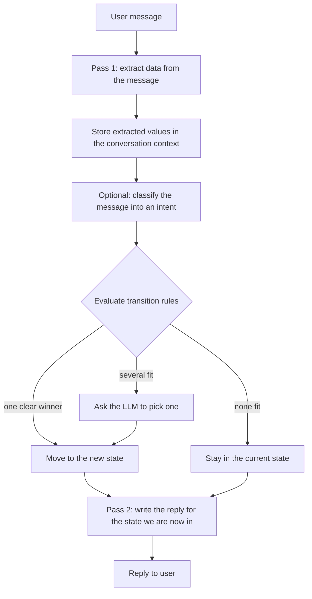

# fsm_llm

The core FSM-LLM framework. It runs chatbots defined as finite state machines, where a large language model reads each user message, fills in data, and writes the reply.

## What it is for

A plain LLM chat has no built-in structure: it can forget what it asked, skip steps, or wander off topic. A finite state machine (FSM) is a fixed set of named states, each with its own job, plus rules for moving from one state to another. This package combines the two. You describe the conversation as states in a JSON file (for example "greeting", "collect email", "confirm", "goodbye"). The LLM does the language work: pulling facts out of what the user typed and phrasing replies. Plain rules decide when to move between states, so the flow stays predictable and testable.

Every other package in this repository (reasoning, workflows, agents, monitor, harness) is built on top of this one.

## How it works

Each user message goes through two LLM passes:



- **Pass 1** asks the LLM to pull named values (such as `name` or `email`) out of the message and stores them in the conversation's context, a dictionary of everything collected so far.
- **Transition rules** are written in JsonLogic, a small JSON rule language (for example `{">=": [{"var": "age"}, 18]}`). They are checked in plain Python, not by the LLM. The LLM is only asked when several transitions pass at once.
- **Pass 2** writes the reply from the state the conversation ends up in, so the bot never answers from a state it has already left.
- **Handlers** are your own Python functions that run at 8 fixed points in this flow (start, before and after processing, before and after a transition, on context update, at the end, on error).
- **FSM stacking** lets one conversation temporarily hand control to a second FSM (for example an address form) and come back with its results.

## Files

- `api.py` - `API`, the class you use: start conversations, send messages, read data, push and pop FSMs, save and restore sessions.
- `fsm.py` - `FSMManager`: keeps conversations, their locks, and a cache of FSM definitions.
- `pipeline.py` - `MessagePipeline`: the two-pass processing for each message.
- `definitions.py` - Pydantic data models (states, transitions, FSM definition, context, classification results) and the error classes.
- `transition_evaluator.py` - decides whether a transition is certain, ambiguous, or blocked.
- `expressions.py` - the JsonLogic rule evaluator.
- `classification.py` - intent classification with an LLM (`Classifier`, `HierarchicalClassifier`, `IntentRouter`).
- `handlers.py` - the handler system and its fluent builder.
- `llm.py` - talks to LLM providers through litellm (OpenAI, Anthropic, Ollama, and many more).
- `ollama.py` - Ollama-specific tweaks (JSON schema output, turning off "thinking").
- `prompts.py` - builds the prompts for extraction, reply, field, and classification calls.
- `context.py` - context cleaning and `ContextCompactor` for trimming context.
- `memory.py` - `WorkingMemory`: named buffers for agent-style scratch data.
- `session.py` - save and restore conversations to JSON files.
- `validator.py`, `visualizer.py` - check an FSM file for problems; draw it as ASCII art.
- `runner.py`, `__main__.py` - the interactive command-line chat.
- `utilities.py` - JSON extraction from LLM text, FSM file loading, shared helpers.
- `constants.py` - defaults, security patterns, prompt text, environment variable names.
- `logging.py` - loguru setup (logging is off until you turn it on).

## How to use it

Save this as `greeter.json`:

```json
{
  "name": "Greeter",
  "description": "Greets the user, learns their name, then says goodbye",
  "initial_state": "greeting",
  "persona": "A friendly assistant",
  "states": {
    "greeting": {
      "id": "greeting",
      "description": "Welcome the user and collect their name",
      "purpose": "Welcome and ask their name",
      "extraction_instructions": "Extract the user's name if provided",
      "response_instructions": "Greet warmly, ask for name if not given",
      "transitions": [
        {
          "target_state": "farewell",
          "description": "User has given their name",
          "conditions": [{"description": "Name is available", "requires_context_keys": ["name"], "logic": {"has_context": "name"}}]
        }
      ]
    },
    "farewell": {
      "id": "farewell",
      "description": "Thank the user and end the conversation",
      "purpose": "Thank the user and end conversation",
      "response_instructions": "Say a personalized goodbye using their name",
      "transitions": []
    }
  }
}
```

Run it from Python:

```python
from fsm_llm import API

api = API.from_file("greeter.json", model="ollama_chat/qwen3.5:4b")
conv_id, reply = api.start_conversation()
print(reply)
print(api.converse("Hi, I'm Alice", conv_id))
print(api.get_data(conv_id))            # {'name': 'Alice', ...}
print(api.has_conversation_ended(conv_id))
api.end_conversation(conv_id)
```

Or from the command line:

```bash
export LLM_MODEL=ollama_chat/qwen3.5:4b
fsm-llm --fsm greeter.json               # chat interactively
fsm-llm-validate --fsm greeter.json      # check for problems
fsm-llm-visualize --fsm greeter.json     # draw it
```

Run code at a point in the flow with a handler:

```python
from fsm_llm import HandlerTiming, create_handler

api.register_handler(
    create_handler("audit")
    .at(HandlerTiming.POST_TRANSITION)
    .on_state("farewell")
    .do(lambda ctx: {"finished": True})
)
```

## Things to know

- Any provider litellm supports works. The default model is `ollama_chat/qwen3.5:4b`, or whatever `LLM_MODEL` is set to. API keys come from the usual provider environment variables.
- A state with no transitions is terminal: once reached, `converse` raises an error.
- `required_context_keys` only says what to extract. To block a transition until data exists, add a condition with `logic`.
- Context keys starting with `_`, `system_`, `internal_`, or `__` are internal and hidden from `get_data()`. Keys that look like passwords, tokens, or API keys are filtered out of prompts.
- The library logs nothing until you call `setup_logging()` or `enable_debug_logging()`.
- `FileSessionStore` saves state to JSON, so values like `datetime` come back as strings.
- One conversation can only process one message at a time. A second concurrent call for the same conversation raises an error instead of waiting.
