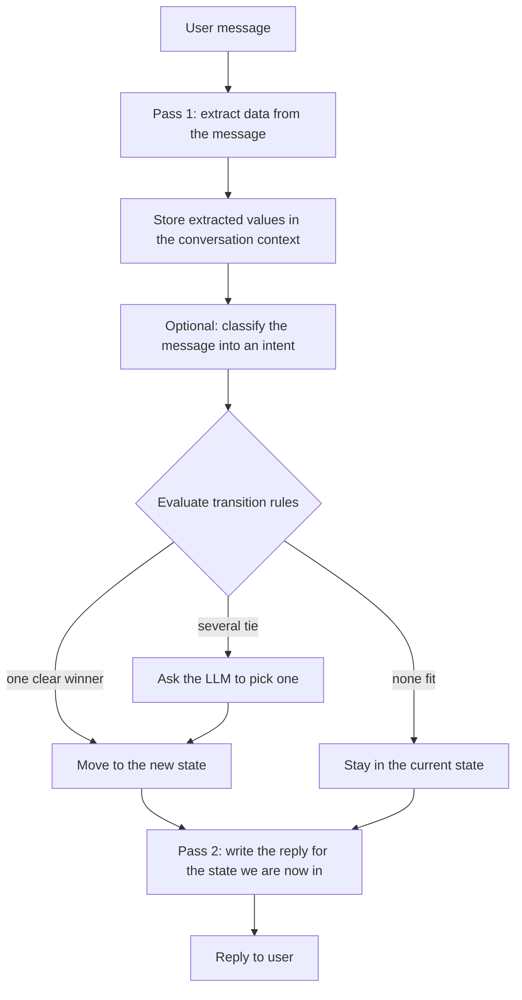
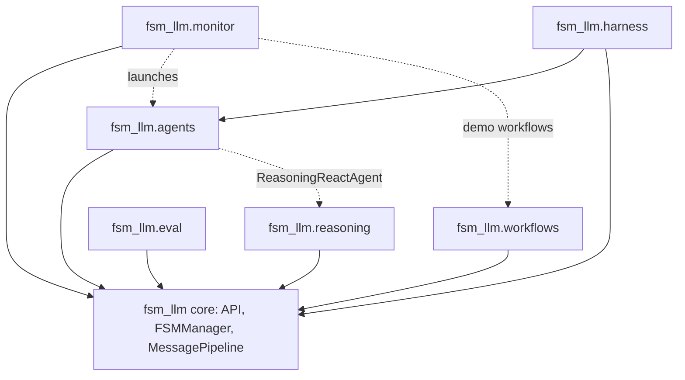

# fsm_llm

The `fsm_llm` package at `src/fsm_llm` is the whole FSM-LLM framework. Its top level is the core engine: it runs chatbots defined as finite state machines, where a large language model (LLM) reads each user message, pulls out data, and writes the reply. Six subpackages built on that core add reasoning, workflows, agents, a web dashboard, a planning harness, and evaluation tools.

## What it is for

A plain LLM chat has no built-in structure: it can forget what it asked, skip steps, or wander off topic. A finite state machine (FSM) is a fixed set of named states, each with its own job, plus rules for moving from one state to another. This package combines the two. You describe the conversation as states in a JSON file (for example "greeting", "collect email", "confirm", "goodbye"). The LLM does the language work: pulling facts out of what the user typed and phrasing replies. Plain rules decide when to move between states, so the flow stays predictable and testable.

The subpackages reuse the same engine for bigger jobs: multi-step reasoning, agents that call tools, async pipelines, live monitoring, and measuring how well a model does.

## How it works

Each user message goes through two LLM passes:


```mermaid
flowchart TD
    U[User message] --> P1[Pass 1: extract data from the message]
    P1 --> C[Store extracted values in the conversation context]
    C --> CL[Optional: classify the message into an intent]
    CL --> T{Evaluate transition rules}
    T -- one clear winner --> S[Move to the new state]
    T -- several tie --> L[Ask the LLM to pick one] --> S
    T -- none fit --> K[Stay in the current state]
    S --> P2[Pass 2: write the reply for the state we are now in]
    K --> P2
    P2 --> R[Reply to user]
```

- **Pass 1** asks the LLM to pull named values (such as `name` or `email`) out of the message and stores them in the conversation's context, a dictionary of everything collected so far.
- **Transition rules** are written in JsonLogic, a small JSON rule language (for example `{">=": [{"var": "age"}, 18]}`). They are checked in plain Python, not by the LLM. If several transitions pass, the one with the lowest `priority` number wins; the LLM is asked only when two or more tie at that lowest priority.
- **Pass 2** writes the reply from the state the conversation ends up in, so the bot never answers from a state it has already left. A state with empty `response_instructions` skips Pass 2: it makes no LLM call, replies with the empty string and adds nothing to the history.
- **Steps without a user message**: `api.advance(conv_id)` runs the same two passes with no user message and returns an `AdvanceResult` (`state_before`, `state_after`, `transition_outcome`, `response`, `ended`). `api.run_until_terminal(conv_id, max_steps=N)` repeats it until a terminal state and raises `RunBudgetExceededError` when `max_steps` or `max_seconds` runs out. The agents and the harness are driven this way.
- **Handlers** are your own Python functions that run at 8 fixed points in this flow (start, before and after processing, before and after a transition, on context update, at the end, on error).
- **FSM stacking** lets one conversation temporarily hand control to a second FSM (for example an address form) and come back with its results.
- **Tool calling and structured output**: a state with the optional `completion` field makes its Pass 1 a single native tool-calling or JSON-schema call over a message list your handlers keep in the context. The reply (`{kind, text, calls}`) is stored under a key the transitions read; your handler runs the tools and appends the results with `tool_exchange`. The core never runs a tool itself. The `native_fc` agent and the meta-builder are built this way.

How the subpackages sit on the core:


```mermaid
flowchart TD
    core[fsm_llm core: API, FSMManager, MessagePipeline]
    reasoning[fsm_llm.reasoning] --> core
    workflows[fsm_llm.workflows] --> core
    agents[fsm_llm.agents] --> core
    agents -. ReasoningReactAgent .-> reasoning
    monitor[fsm_llm.monitor] --> core
    monitor -. launches .-> agents
    monitor -. demo workflows .-> workflows
    harness[fsm_llm.harness] --> agents
    harness --> core
    eval[fsm_llm.eval] --> core
```

`import fsm_llm` loads only the core. Each subpackage is imported on its own, for example `from fsm_llm.agents import ReactAgent`.

## Subpackages

| Subpackage | What it does | Entry points |
| --- | --- | --- |
| `reasoning/` | Solves a problem step by step: an orchestrator FSM picks one of 9 reasoning strategies (calculator, deductive, analogical, ...), runs it as a stacked FSM, checks the answer and retries up to 3 times | `ReasoningEngine(model).solve_problem(problem) -> (solution, trace)`, `python -m fsm_llm.reasoning "problem"` |
| `workflows/` | Async, in-memory workflow engine: named steps over a shared context, 11 step types (Python function, API call, branch, LLM prompt, FSM conversation, agent, timer, wait for event, parallel, retry, ...) and a Python DSL | `WorkflowEngine`, `create_workflow`, `WorkflowBuilder`, `auto_step`, `condition_step`, ... |
| `agents/` | 18 agent patterns (ReAct, ReWOO, Reflexion, plan and execute, debate, swarm, agent graph, ...), mostly built as generated FSMs; tools, human approval, memory, MCP and HTTP integration, and a meta-builder that designs an FSM, workflow or agent from a chat | `create_agent`, `ConfiguredAgentBuilder`, `ReactAgent`, `ToolRegistry`, `@tool`, `fsm-llm-meta` |
| `monitor/` | FastAPI web dashboard to launch, watch and talk to FSMs, agents and workflows; optional OpenTelemetry export | `fsm-llm-monitor` (http://127.0.0.1:8420), `InstanceManager.attach_api`, `OTELExporter` |
| `harness/` | Experimental "iterative planner" as a 6-state FSM (explore, plan, execute, reflect, pivot, close) whose gates count files on disk instead of trusting the model | `fsm-llm-harness new "goal"`, `HarnessAgent`, `HarnessAgentBuilder` |
| `eval/` | Runs the repository examples and scores them 0 to 4, or runs scripted conversations against any FSM over several trials and reports pass rates with confidence intervals | `fsm-llm-eval examples`, `fsm-llm-eval run cases.json`, `run_dataset` |

## Files

- `api.py` - `API`, the class you use: start conversations, send messages, read data, push and pop FSMs, save and restore sessions.
- `fsm.py` - `FSMManager`: keeps conversations, their locks, and a cache of FSM definitions.
- `pipeline.py` - `MessagePipeline`: the two-pass processing for each message.
- `definitions.py` - Pydantic data models (states, transitions, FSM definition, context, classification results) and the error classes, including `BuildError`.
- `builders.py` - `APIBuilder` and `FSMManagerBuilder`: fluent builders over `API` and `FSMManager` (see "Builders" below).
- `transition_evaluator.py` - decides whether a transition is certain, ambiguous, or blocked.
- `expressions.py` - the JsonLogic rule evaluator.
- `classification.py` - intent classification with an LLM (`Classifier`, `HierarchicalClassifier`, `IntentRouter`). Inside a conversation the classifier uses the conversation's own LLM interface, so a custom `llm_interface` is honoured.
- `handlers.py` - the handler system and its fluent builder.
- `llm.py` - the one place that talks to LLM providers, through litellm (OpenAI, Anthropic, Ollama, and many more): replies, extraction, the `complete()` call for tool calling and structured output, embeddings (`LiteLLMEmbedder`), and per-interface call and token counters (`usage()`). No other module imports litellm.
- `ollama.py` - Ollama-specific tweaks (JSON schema output, turning off "thinking").
- `prompts.py` - builds the prompts for extraction, reply, field, and classification calls.
- `context.py` - context cleaning and `ContextCompactor` for trimming context.
- `memory.py` - `WorkingMemory`: named buffers for agent-style scratch data.
- `session.py` - save and restore conversations to JSON files.
- `validator.py`, `visualizer.py` - check an FSM file for problems; draw it as ASCII art, or as Mermaid or DOT through the graph data of `build_fsm_graph`.
- `runner.py`, `__main__.py` - the interactive command-line chat.
- `utilities.py` - JSON extraction from LLM text, FSM file loading, shared context walkers.
- `security.py` - the two key checks every context filter uses: internal keys (`has_internal_prefix`) and secret-looking keys (`is_forbidden_context_entry`).
- `constants.py` - defaults, limits, environment variable names and shared key names; it also re-exports the names from `security.py`.
- `logging.py` - loguru setup (logging is off until you turn it on).
- `__init__.py`, `__version__.py`, `py.typed` - public exports, version (0.11.0, shared by all subpackages), type-hint marker.

## How to use it

Save this as `greeter.json`:

```json
{
  "name": "Greeter",
  "description": "Greets the user, learns their name, then says goodbye",
  "initial_state": "greeting",
  "persona": "A friendly assistant",
  "states": {
    "greeting": {
      "id": "greeting",
      "description": "Welcome the user and collect their name",
      "purpose": "Welcome and ask their name",
      "extraction_instructions": "Extract the user's name if provided",
      "response_instructions": "Greet warmly, ask for name if not given",
      "transitions": [
        {
          "target_state": "farewell",
          "description": "User has given their name",
          "conditions": [{"description": "Name is available", "requires_context_keys": ["name"], "logic": {"has_context": "name"}}]
        }
      ]
    },
    "farewell": {
      "id": "farewell",
      "description": "Thank the user and end the conversation",
      "purpose": "Thank the user and end conversation",
      "response_instructions": "Say a personalized goodbye using their name",
      "transitions": []
    }
  }
}
```

Run it from Python:

```python
from fsm_llm import API

api = API.from_file("greeter.json", model="ollama_chat/qwen3.5:4b")
conv_id, reply = api.start_conversation()
print(reply)
print(api.converse("Hi, I'm Alice", conv_id))
print(api.get_data(conv_id))            # {'name': 'Alice', ...}
print(api.has_conversation_ended(conv_id))
api.end_conversation(conv_id)
```

Or from the command line:

```bash
export LLM_MODEL=ollama_chat/qwen3.5:4b
fsm-llm --fsm greeter.json               # chat interactively
fsm-llm-validate --fsm greeter.json      # check for problems
fsm-llm-visualize --fsm greeter.json     # draw it
```

To try it without a model, pass your own `llm_interface=` (a subclass of `fsm_llm.LLMInterface`); the repository's tests do this with the fakes in `tests/conftest.py`.

Run code at a point in the flow with a handler:

```python
from fsm_llm import HandlerTiming, create_handler

api.register_handler(
    create_handler("audit")
    .at(HandlerTiming.POST_TRANSITION)
    .on_state("farewell")
    .do(lambda ctx: {"finished": True})
)
```

### Builders

`APIBuilder` and `FSMManagerBuilder` (in `fsm_llm.builders`, also exported from `fsm_llm`) build the same objects as the constructors, one call at a time. Every `set_*` or `add_*` call only records a value and returns the builder; `build()` is the only place that checks anything. It hands the real constructor just the values you set, so defaults and rules stay in one place:

```python
from fsm_llm import APIBuilder, BuildError, HandlerTiming, create_handler

api = (
    APIBuilder()
    .set_definition("greeter.json")                  # a path, a dict or an FSMDefinition
    .set_model("ollama_chat/qwen3.5:4b")
    .set_max_history_size(10)
    .set_llm_option("seed", 7)                       # any other litellm keyword
    .add_handler(create_handler("audit").at(HandlerTiming.POST_TRANSITION).do(lambda ctx: {}))
    .build()
)

try:
    APIBuilder().build()                             # no definition
except BuildError as err:
    print(err.errors)
```

`build()` raises `BuildError` (a `FSMError` and a `ValueError`, with `.errors` listing the problems and the constructor's own error chained as the cause). Dictionaries, lists and definitions you pass in are copied at `build()`; interfaces, stores and handlers stay shared with you. `set_llm_option` refuses a name that is a named `API` parameter (for example `model`) and tells you which setter to use. `FSMManagerBuilder` works the same way and needs `set_llm_interface(...)`. The subpackages follow the same convention: `ConfiguredAgentBuilder` and `AgentGraphBuilder` (agents), `WorkflowBuilder` (workflows), `HarnessAgentBuilder` (harness). The meta-builder's `FSMArtifactBuilder`, `WorkflowArtifactBuilder` and `AgentArtifactBuilder` are the one exception: they refuse a bad call immediately.

The subpackages have their own commands:

```bash
python -m fsm_llm.reasoning "What is 15% of 240?"
fsm-llm-meta --output my_bot.json        # design an FSM by chatting
fsm-llm-monitor                          # needs: pip install -e ".[monitor]"
fsm-llm-eval examples --category basic   # run from the repository root
fsm-llm-harness new "add a retry to the uploader" --create-only
```

## Things to know

- Any provider litellm supports works. The default model is `ollama_chat/qwen3.5:4b`, or whatever `LLM_MODEL` is set to. API keys come from the usual provider environment variables.
- To use your own LLM client, pass `llm_interface=` to `API`. Do not pass `model`, `temperature`, `max_tokens` or other LLM settings beside it: `API` refuses them, because the interface owns them.
- Extras: `reasoning`, `workflows`, `agents` and `eval` add no packages; `harness` pulls in `agents`; `monitor` adds fastapi, uvicorn and jinja2; `mcp`, `otel` and `a2a` add optional integrations for agents and the monitor.
- A state with no transitions is terminal: once reached, `converse` and `advance` raise an error.
- `required_context_keys` only says what to extract. To block a transition until data exists, add a condition with `logic`.
- Context keys starting with `_`, `system_`, `internal_`, or `__` are internal and hidden from `get_data()`. Keys that look like passwords, tokens, or API keys are filtered out of prompts.
- The library logs nothing until you call `setup_logging()` or `enable_debug_logging()`. This covers the subpackages too.
- `FileSessionStore` saves state to JSON, so values like `datetime` come back as strings.
- One conversation can only process one message at a time. A second concurrent call for the same conversation raises an error instead of waiting.
- Errors from the core, reasoning, workflows, agents, harness and eval all derive from `FSMError`, and so does `BuildError`. The monitor's `MonitorError` does not.

## Where to go next

- Each subpackage has its own README: `reasoning/README.md`, `workflows/README.md`, `agents/README.md` (next to this file).
- `examples/` at the repository root: 100 runnable examples in 8 categories (`basic`, `intermediate`, `advanced`, `classification`, `agents`, `meta`, `reasoning`, `workflows`).
- `docs/quickstart.md`, `docs/fsm_design.md`, `docs/handlers.md` and `docs/api_reference.md`: guides and the full reference.
