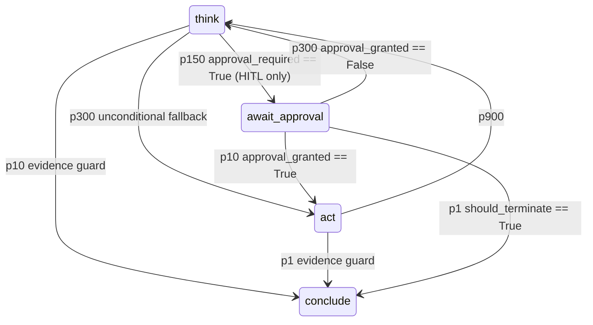

# fsm_llm.agents

Path: `src/fsm_llm/agents`
Purpose: Agent patterns for FSM-LLM (ReAct and 17 others), most built as generated FSM definitions driven by one shared loop, plus tools, HITL approval, memory, multi-agent coordination, MCP/A2A integration and the meta-builder.

## Scope

- All agent code of the `fsm-llm` distribution (extra `agents` = no deps; optional `mcp` for `mcp.py`, `a2a` = httpx for `RemoteAgentTool`, fastapi for `AgentServer`, PyYAML for YAML SOPs). `ReasoningReactAgent` is always exported; it imports `fsm_llm.reasoning` lazily, and `fsm_llm.reasoning` ships in every install. Version comes from `fsm_llm.__version__` via `__version__.py`.
- Console script `fsm-llm-meta = fsm_llm.agents.meta_cli:main_cli` (pyproject). `python -m fsm_llm.agents` accepts only `--info` and `--version`.
- Consumers outside this folder: `fsm_llm.monitor` (`instance_manager.py` launches 7 classes: React, Reflexion, PlanExecute, REWOO, ADaPT, Debate, SelfConsistency; `server.py` uses `MetaBuilderAgent`; `static/flows.json` draws pattern graphs), `fsm_llm.harness` (`BaseAgent`, `HumanInTheLoop`, `create_agent`, `NativeFunctionCallingReactAgent`, `ToolRegistry`, `tool`), `fsm_llm.workflows.steps` (`AgentStep` runs a `ReactAgent`), examples under `examples/agents/` and `examples/meta/`.
- Not here: the FSM engine itself (`fsm_llm.API`, pipeline, handlers, classifier). This package only builds FSM dicts and registers handlers on an `API`.

## Architecture

FSM-based patterns share `BaseAgent._standard_run`, a thin caller of core's bounded run loop: no agent-side loop, step counter, synthetic message or marker filter. A silent state (empty `response_instructions`) makes no LLM call and adds nothing to history, so only speaking states produce replies:

```mermaid
sequenceDiagram
    participant U as caller
    participant A as XAgent.run
    participant B as BaseAgent._standard_run
    participant API as fsm_llm.API
    U->>A: run(task, initial_context)
    A->>A: fsm_def = build_x_fsm(...); ctx = _init_context(task, initial_context, extra)
    A->>B: _standard_run(task, fsm_def, ctx, agent_type, ...)
    B->>API: _create_api(fsm_def) (model, temperature, max_tokens from AgentConfig)
    B->>API: _register_handlers + _register_lifecycle_handlers
    B->>API: run_until_terminal(max_steps = max * 3, max_seconds = time left, before_step)
    loop inside core until the conversation ends
        API->>B: before_step: _on_loop_iteration (HITL driver in React/Reflexion/ReasoningReact)
        API->>API: advance (one step, no user message)
    end
    B->>API: get_data; end_conversation (finally)
    B-->>U: AgentResult(answer, success, trace, final_context, structured_output, stop_reason)
```

ReAct FSM (`build_react_fsm`), also used by `ReasoningReactAgent`, `VerifiedReactAgent`, `AutoMemoryReactAgent`:



- Lowest passing priority wins in core. Evidence guard = `_conclude_on_evidence_logic()`: `should_terminate == True AND (observation_count > 0 OR max_iterations_reached == True)` (D-008). Used on the `think`/`act` conclude edges of react, reflexion and parallel_react; reflexion `evaluate -> conclude` passes on the guard over `evaluation_passed`, or on `max_iterations_reached == True` alone.
- `think`/`act`/`await_approval` have empty `response_instructions`, so core skips Pass 2 for them. `think` declares typed `field_extractions` (`tool_name` str, `tool_input` dict; D-024 of plan 21cd7f8e; `should_terminate` bool, optional, permissive wording: true when the observations answer the task or no further tool is needed, the evidence guard blocks a no-tool conclude) and an empty state-level `extraction_instructions` (no context-free bulk call), except with `use_classification=True`, which keeps the bulk fill (D-019 of plan 21cd7f8e). Every think field prompt lists `task`, `observations`, `agent_feedback`, the caller's public `initial_context` keys (`base.caller_prompt_keys`) and, for Reflexion, `episodic_memory`; never `agent_trace` (D-017 of plan 06a5ec0a).
- The tool runs in `AgentHandlers.execute_tool` on `act` entry; `check_iteration_limit` runs at PRE_TRANSITION. `BaseAgent._register_think_loop_handlers` clears `reasoning` (bulk-filled only with `use_classification=True`)/`should_terminate` on think entry (Reflexion too; a `should_terminate` forced by the bare limiter flag is cleared so the last think turn gives its own verdict, one with a recorded `forced_stop_reason` is kept; D-051 of plan 06a5ec0a), clears `agent_feedback` on think exit, and under HITL clears a non-forced `should_terminate` on `await_approval` entry, so an approved call runs before conclude (D-029 of plan 06a5ec0a).
- Core runs no PRE_TRANSITION or entry handler on a BLOCKED turn (no passing transition), so every loop state has an unconditional fallback edge (D-002): `think -> act` p300 (react, reflexion, parallel_react), p900 on maker_checker `check -> revise`, adapt `assess`/`decompose -> combine`, evalopt `generate -> evaluate`, reflexion `evaluate -> reflect`, orchestrator `orchestrate`/`collect -> synthesize`, evalopt `evaluate -> output`. Exceptions: plan_execute `plan` (only exit is `has_context: plan_steps`, kept reachable by the `[]` seed, D-046) and `await_approval` (the driver always writes a strict bool before it routes).
- Core extracts a key only while it is unset (skip-if-set). Consequences: redo states use `make_redraft_handlers` (entry moves the draft to `previous_draft`/`previous_output`, exit restores it if no new draft and clears consumed keys; D-013); debate clears `consensus_reached` on `propose` entry and orchestrator clears `all_collected` on `orchestrate` entry (D-009), never on entry to the judging state (that erases the limiter's forced value).
- The pipeline treats a context containing `agent_trace` as agent-managed (no post-transition extraction; bulk overwrite rules differ). `_init_context` always seeds `agent_trace=[]`.

Other patterns (FSM states in `constants.py`):
- Reflexion: `think -> act -> evaluate -> reflect -> think`, `conclude`. `evaluate` extracts typed `evaluation_passed` (bool), `evaluation_score` (float), `evaluation_feedback` (str); `reflect` typed `reflection`/`lessons` (str) with `evaluation_feedback`, `evaluation_score`, `episodic_memory` in the prompt; both have empty extraction and response instructions. Evaluate entry clears the verdict keys, or with `evaluation_fn(context) -> EvaluationResult` writes them (the self-evaluation is then skipped, and a null extraction cannot skip the function; D-031 of plan 06a5ec0a). Reflect entry clears `reflection`/`lessons`; the reflect-exit handler (after the extraction) appends a `ReflexionMemory` with this episode's reflection, lessons and feedback to `episodic_memory` and at `max_reflections` sets `should_terminate` and, when the evaluation did not pass, `forced_stop_reason = forced_pass` (`success=False`, D-051).
- REWOO: `plan_all -> execute_plans -> solve`, all unconditional; only `solve` speaks (`plan_all`/`execute_plans` have empty `response_instructions`). `execute_plans` entry runs every `plan_blueprint` step via `self.tools.execute`, substituting `#E<n>` from earlier evidence (`[unavailable]` if missing), stores `evidence{"E<n>": summary}` (a failed call stores `Error: ...`) and `evidence_status[{"id", "tool_name", "success"}]`. `plan_id` 1, `"1"`, `"E1"`, `"#E1"` (any case) all give `E1`; a missing or unparsable id is the step's 1-based position among the dict steps (WARNING when a value was present). `plan_all` extracts typed `plan_blueprint` (`list`, composed; the Ollama `list` grammar allows arrays of objects), its prompt showing `task` and the caller's keys, never `agent_trace` (D-053 of plan 06a5ec0a).
- PlanExecute: `plan -> execute_step -> check_result -> (synthesize p10 | replan p150 | execute_step p300)`, `replan -> execute_step`. `plan`/`replan` extract a typed `plan_steps` list, `execute_step` typed `step_result` (str, required only without tools) plus the typed tool selection, with `current_step_description` and `step_results` in the prompt; `check_result` extracts nothing; only `synthesize` speaks. `execute_step` entry bounds the plan (`MAX_PLAN_STEPS` 10, WARNING; a string is one step, another non-list is `[]`), sets `current_step_description` and clears `step_result`. The tool runs on `check_result` entry (priority 100), then the checker (101) sets `step_failed = tool_status == "failed"` and appends `{step_index, result, success}` (`result` is the tool observation when a tool ran, else `step_result`; `success = tool_status == "success"`, D-024); on failure with `_replan_count >= max_replans` it sets `all_steps_complete` instead (D-032 of plan 06a5ec0a). `replan` entry bumps `_replan_count`, stashes the plan in `previous_plan_steps` and resets `plan_steps` to `[]` and `current_step_index` to 0, so `max_replans=N` gives exactly N replans.
- Orchestrator: `orchestrate -> delegate -> collect -> (synthesize | orchestrate)`. `delegate` entry calls `worker_factory(subtask)` sequentially for up to `max_workers` subtasks; the rest are logged with a WARNING and listed in `skipped_subtasks` (the trace entry carries `subtasks_skipped`; a later round that runs one unlists it), never in `worker_results`: the collect judge read skipped entries as unfinished work and re-delegated (D-049 of plan 06a5ec0a). `orchestrate` extracts typed `subtasks` (`any`: the delegator takes a lone string as one subtask) and `collect` typed `all_collected` (bool, permissive wording), both prompts showing `task`, `worker_results` and the caller's keys (`caller_prompt_keys`), never `agent_trace` or `skipped_subtasks` (D-053). A worker's `AgentTimeoutError`/`BudgetExhaustedError` goes into a call-local `RunEndingErrorHolder`, no further worker starts, and `run()` re-raises it once the FSM run returns (D-042 of plan 06a5ec0a); any other worker exception is a `success=False` result. With no factory it stores `[Pending LLM processing: ...]` entries with `success=False`.
- ADaPT: `attempt -> assess -> (combine | decompose)`, `decompose -> combine`. A PRE_TRANSITION handler on `decompose` runs subtasks by recursive `self.run(_depth=depth+1)` (AND = all, OR = stop at first success; `operator` case-insensitive, anything else is AND) while `current_depth < max_depth`, at most `Defaults.ADAPT_MAX_SUBTASKS` (8) per decomposition (extras dropped with a WARNING). A sub-run's `AgentTimeoutError`/`BudgetExhaustedError` goes into a call-local `RunEndingErrorHolder`, no further subtask starts, and `run()` re-raises it after the loop (D-014 of plan 06a5ec0a). The decomposition is a trace `event`, not a tool call. ADaPT has its own `run` (not `_standard_run`). Typed fields (D-053 of plan 06a5ec0a): `attempt_result` (str, composed), `attempt_succeeded` (bool, permissive), `subtasks` (`list`: the executor needs a list, and `list` parses a JSON-string list), `operator` (optional str after `subtasks`; null or other text is AND; stripped from caller context); no state-level bulk extraction (D-036 of plan 07ad3f8c); prompts show `task`, `attempt_result` (assess, decompose) and the caller's keys, never `agent_trace`.
- EvalOpt: `generate -> evaluate -> (output | refine)`, `refine -> evaluate`. `generate`/`refine` are silent and extract one typed `generated_output` (`any`, D-050: a whole artifact; refine's prompt shows `previous_output` and `refinement_feedback`); `evaluation_passed` is written only by the evaluator. `evaluate` entry calls `evaluation_fn(output_str, context)` (a dict/list output as indented JSON text, `base.artifact_text`); forces a pass at `refinement_count >= max_refinements` or `max_iterations_reached is True` (D-022), recording `forced_stop_reason = forced_pass` only when it overrides a failing verdict; the limiter records no reason, and the run passes `judged=True` to the success seam, so a genuine pass on the limiter's round is `answered` (D-051 of plan 06a5ec0a).
- MakerChecker: `make -> check -> (output | revise)`, `revise -> check`. `make`/`revise` are silent and extract one typed `draft_output` (`any`, D-050; revise's prompt shows `previous_draft` and `checker_feedback`); `check` extracts typed `checker_feedback` (str), `quality_score` (float), `checker_passed` (bool, optional) in that order, prompts showing `draft_output` and `previous_draft` (D-039 of plan 06a5ec0a). CONTEXT_UPDATE on `check` counts revisions, passes on `quality_score >= quality_threshold` or `revision_count >= max_revisions`. `revise` entry is a no-op when `checker_passed is True`, so the judged draft ships (D-017). The limiter (`early=False`) only sets `max_iterations_reached`; `MakerCheckerForcePass` at PRE_TRANSITION on `check` turns it into `checker_passed=True` with `forced_stop_reason = forced_pass` unless the checker (or its score) already passed this draft, and `check -> output` also passes on `max_iterations_reached == True` (D-007). The run passes `judged=True` (D-051 of plan 06a5ec0a).
- Debate: `propose -> critique -> counter -> judge -> (conclude | propose)`. Each state extracts one typed str field (`proposition` with `debate_rounds` in the prompt, `critique` with `proposition`, `counter_argument` with both; judge adds an optional `judge_verdict` beside the `consensus_reached` bool, whose prompt shows the round values, `current_round` and `debate_rounds`, never `agent_trace`; D-054 of plan 06a5ec0a), empty state-level extraction and response instructions, so only `conclude` speaks. The text fields' wording tells the model to compose the value (live, qwen3.5:4b returned null when only asked to extract). Propose entry clears `consensus_reached` and the four round values (`make_fresh_keys_handler`). Judge CONTEXT_UPDATE handler records a `DebateRound`, restores the last recorded `proposition` when this round's is empty (the success key survives the round clear), forces consensus at `current_round >= num_rounds` (recording `forced_stop_reason = forced_pass` when the judge did not agree), bumps `current_round`; the limiter's forced consensus records `max_iterations` unless the judge agreed on that turn (D-051 of plan 06a5ec0a); the conclude edge also passes on `current_round > max_rounds`. The answer is the conclude reply; `proposition` is passed as the success key only (D-036 of plan 06a5ec0a).
- PromptChain: `step_0 -> ... -> step_<n-1> -> output`. Each step extracts one typed `chain_step_result` (`any`, D-050) worded from its `ChainStep` instructions, prompt showing `task` and `chain_results`; its `response_instructions` stay the step's reply (user-owned); the state-level bulk call is gone, so keys the user's `extraction_instructions` name are no longer extracted. Entry handler on `step_1..n-1` and `output` appends `chain_step_result` to `chain_results`, runs the previous step's `validation_fn(context)` into `gate_passed`, then clears `chain_step_result` (kept on `output`: success key). A failed gate writes `forced_stop_reason = gate_failed` and keeps the result, so the next step skips extraction and its p50 gate edge routes to `output`: `success=False, stop_reason=gate_failed` (D-038 of plan 06a5ec0a).
- SelfConsistency: single terminal state `generate` (extracts nothing; the reply is the sample and is asked to end with an `Answer:` line), run `num_samples` times at temperatures spread over (0.5, 1.0); `_majority_vote` or `aggregation_fn`. `_majority_vote` compares samples by `_vote_key` (last `Answer:` line value, else the whole text; casefolded, whitespace-collapsed) and returns the first full sample of the largest group (D-037 of plan 06a5ec0a). `confidence` = share of samples whose vote key equals the aggregate's. Builds `API.from_definition` directly (not `_create_api`).
- ParallelReact: `think` extracts typed per-field `tool_calls` (list of `{tool_name, tool_input}`), `should_terminate` (no bulk call); `act` entry runs the batch in a `ThreadPoolExecutor(min(max_parallel, len))`, results recorded in submission order. Its think-turn limiter is a call-local `handlers.ThinkTurnLimiter` (not an `AgentHandlers`), so a registry whose `execute` lacks `gated` is accepted (it never passes `gated`, D-042). Batch `tool_status`: `unknown` when any call timed out, else `success` when any succeeded, else `failed`.
- native_fc (`NativeFunctionCallingReactAgent`, `build_native_fc_fsm`, D-009/D-026 of plan 944e2692): `call_model` (core completion state with the registry's `get_json_schemas()`, `tool_choice="auto"`, the system message as `instructions`, transcript `_native_messages`, result `model_reply`) -> `run_tools` (silent; `NativeFCHandlers.run_tools` checks the whole turn, runs each call through `self.tools.execute` in order, appends one `tool_exchange` to the transcript, writes the redacted trace with `tool_status`, counts model turns) -> `call_model`; when the loop ends: at most one `force_final` (completion state, named `tool_choice`, built only when `config.force_final_tool` names a declared tool; its transcript is a copy plus the nudge) and at most one `repair` (structured completion state, built only with `output_schema`; a copy plus the repair nudge), then `conclude` (terminal, silent; records `forced_stop_reason` `no_result` for a malformed turn or an empty answer, `max_iterations` for an exhausted loop). Run by `_standard_run` with step ceiling `2 * max_iterations + 4` (`_step_ceiling`) and `NativeFCStates.SECONDS_EXEMPT` (every state but `call_model`), so the wall clock is checked only before a loop model turn. Requests are byte-identical to the old private loop (golden fixture, 24 scenarios). The FSM is built per run, reading `system_policy` then.
- Meta-builder (`MetaBuilderAgent`, `build_meta_builder_fsm`, D-011/D-023/D-035 of plan 944e2692): `classify` (initial, silent; `classification_extractions[artifact_type]`, intents fsm/workflow/agent plus fallback `unknown`, threshold 0.4) -> `collect` (speaking; the collect instructions read the type and `requirements` from context) -> `build` (silent structured completion state; request `_build_messages`, per-type schema `_build_response_format`, result `build_reply`) -> `done` (terminal) or `build_failed` (silent) -> `build | classify | collect`. Gates compare with `===` on driver-written, handler-only keys (`build_requested`, `type_switch`, `build_outcome`); a switch outranks a build (`-> classify` p10). The driver computes keyword hints per message and writes them with `update_context` before each `converse`; `send` adds one `advance` when the turn ended in `build` or `classify`; `run` is `converse` plus one `advance`. Handlers judge the build reply (typed pydantic specs; a schema echo or a wrong-typed field is `MALFORMED`), assemble it on a fresh builder and write `artifact`, `validation_errors`, `build_progress`, `build_summary`, `review_presentation`, `build_outcome`; no session state lives in Python besides the turn count.
- Non-FSM: `SwarmAgent`, `AgentGraph`.

## Key files

| File | Role | Notes |
| --- | --- | --- |
| `base.py` | `BaseAgent` ABC, `_output_response_format` | `_standard_run`, `_standard_run_stream`, `_run_conversation_loop` (calls `API.run_until_terminal` with `seconds_exempt_states=_seconds_exempt_for(api)`), `_run_budgets` (step ceiling from the overridable `_step_ceiling(max_iterations)` and seconds left for core), `_budget_error` (maps `RunBudgetExceededError` to `AgentTimeoutError`/`BudgetExhaustedError`), `_end_run_conversation`, `_init_context`, `_handle_hitl_approval`, `_check_budgets` (wall clock only, for SelfConsistency samples), `_extract_answer`, `_completion_is_real`, `_build_trace`, `_filter_context`, `_create_api`, `_try_parse_structured_output` |
| `fsm_definitions.py` | FSM dict builders | `build_react_fsm`, `build_rewoo_fsm`, `build_reflexion_fsm`, `build_plan_execute_fsm`, `build_prompt_chain_fsm`, `build_self_consistency_fsm`, `build_debate_fsm`, `build_orchestrator_fsm`, `build_adapt_fsm`, `build_evalopt_fsm`, `build_maker_checker_fsm`, `build_native_fc_fsm`, `build_meta_builder_fsm`; typed fields through core `typed_field_extraction`; helpers `_conclude_on_evidence_logic`, `_approval_think_transition`, `_await_approval_state` |
| `parallel_react.py` | `ParallelReactAgent`, `build_parallel_react_fsm` | its FSM builder lives here, not in `fsm_definitions.py` |
| `prompts.py` | per-state extraction/response instruction builders | maker/checker instructions and debate personas are interpolated unsanitized |
| `handlers.py` | `AgentHandlers(ThinkTurnLimiter)`, `ThinkTurnLimiter`, `approval_grant`, `call_label`, `call_ran`, `refusal_record`, `make_iteration_limiter`, `make_redraft_handlers`, `make_fresh_keys_handler` (its plain clear is core `clear_keys_delta`), `forced_stop_skip`, `next_step_number`, `with_feedback`, `RunEndingErrorHolder`, `RUN_ENDING_ERRORS` (ADaPT subtasks, Orchestrator workers) | the approval refusal is the HITL security boundary |
| `tools.py` | `ToolRegistry`, `tool`, `register_agent`, `normalize_tool_input`, `redact_secret_entries`, `tool_parameters_schema`, `schema_types`, `refuse_execute_without_gated`, `_infer_schema_from_hints`, `_call_with_timeout` | one non-reentrant `_tools_lock`; never held across a tool call |
| `hitl.py` | `HumanInTheLoop`, `make_hitl_checker`, aliases `ApprovalCallback`, `ApprovalPolicy`, `EscalationCallback` | |
| `definitions.py` | pydantic models | tool name regex `[a-zA-Z0-9_-]{1,64}` (provider contract, D-008) |
| `constants.py` | state classes (each names every state of its FSM; the builders read them, D-047 of plan 07ad3f8c), `ContextKeys`, `RESULT_DROPPED_CONTEXT_KEYS`, `HandlerNames`, `HandlerPriorities`, `Defaults`, `MetaDefaults`, message templates | |
| `native_fc.py` | `NativeFunctionCallingReactAgent`, `NativeFCHandlers` | an FSM on core completion states; imports no litellm |
| `meta_builder.py` | `MetaBuilderAgent` | not a `BaseAgent`; drives `build_meta_builder_fsm` through core `converse`/`advance`; does not use `meta_tools.py` |
| `meta_prompts.py` | collect instructions, `artifact_schema`, `build_response_format`, `build_artifact_prompt`, review texts | one home for every build-request byte |
| `semantic_tools.py`, `semantic_memory.py`, `composition.py` | `SemanticToolRegistry`, `SemanticMemoryStore`, the LLM judge | embeddings through core `LiteLLMEmbedder` (`_embedding_backend`), the judge through core `LiteLLMInterface.complete` |
| `meta_builders.py` | `ArtifactBuilder`, `FSMArtifactBuilder`, `WorkflowArtifactBuilder`, `AgentArtifactBuilder` | workflow/agent validation is structural (D-004); mutators return `self`, warnings accumulate and `take_warnings()` returns and clears them, `build()` = `validate_complete()` then `BuildError` or a deep copy of `to_dict()`; call-time `BuilderError` refusals stay (the one carve-out, D-005 of plan 89b03f61) |
| `builders.py` | `ConfiguredAgentBuilder` | fluent `create_agent`; passes only what was set; typed config setters write `AgentConfig` so the config-owned denylist holds by construction; `build()` raises `BuildError` (D-008 of plan 89b03f61) |
| `meta_tools.py` | `create_fsm_tools`, `create_workflow_tools`, `create_agent_tools`, `create_builder_tools` | separate programmatic API over a builder; tools serialise per builder, direct builder calls are not serialised against tool calls |

## Public interface

- `BaseAgent(config=None, **api_kwargs)`: abstract `run(task, initial_context=None) -> AgentResult` and `_register_handlers(api)`; `__call__(task, **kw)` calls `run`. React, Reflexion, ReasoningReact and ParallelReact widen `_register_handlers(api, handlers=None)` and raise `AgentError` if `handlers` is None; PlanExecute accepts `None` (tool-less mode). `api_kwargs` go to `API.from_definition` (settings of the interface core builds such as `seed`, `timeout`, and API kwargs such as `handlers`, `llm_interface`; with `llm_interface` core refuses any LLM setting beside it, `AgentConfig.model/temperature/max_tokens` are then not applied, and `enable_prompt_cache=True` raises `AgentError` at construction), except that `__init__` raises `TypeError` for `hitl`, `tools`, `evaluation_fn`, `approval_callback` (`MISPLACED_AGENT_KWARGS`: they reach `api_kwargs` only on a pattern that cannot use them) and every other `HumanInTheLoop` constructor name (`base._HITL_CTOR_KWARGS`, derived from its signature) and for `model`, `temperature`, `max_tokens` (`CONFIG_OWNED_KWARGS`: set them on `AgentConfig`). A denylist, never a whitelist (D-003 of plan 06a5ec0a).
- Constructors (all also take `config: AgentConfig | None` and `**api_kwargs`):
  - `ReactAgent(tools, config, hitl=None, use_classification=False)`; `run_stream(task, initial_context=None) -> Iterator[str]` yields only model text (it iterates core `run_until_terminal_stream`; silent states yield nothing), and a non-budget error is wrapped as `AgentError` like `run()`. A conversation ended from outside ends the stream silently, with no error raised (an open gap, not handled). `VerifiedReactAgent` (with a verifier) and `AutoMemoryReactAgent` stream through `_stream_via_run`: they run `run()` and yield the answer once, so verification and memory are kept.
  - `REWOOAgent(tools)` (with PlanExecute, ParallelReact and native_fc: `AgentError` at construction and at `run()` start when the registry holds a `requires_approval` tool, `BaseAgent._refuse_flagged_tools`, D-005 of plan 06a5ec0a), `ReflexionAgent(tools, config, evaluation_fn=None, max_reflections=3, hitl=None)`, `ParallelReactAgent(tools, config, max_parallel=4)` (`AgentError` if < 1), `ReasoningReactAgent(tools, config, hitl=None, reasoning_model=None)` (adds a `reason` tool backed by `ReasoningEngine.solve_problem` through `_ReasonToolRegistry`, a live view of the caller's registry whose `execute` delegates to it for the caller's names, so Caching/Retrying subclasses keep working; the engine gets `tool_input` as a string, else its `problem`, else the input's `str()`, and an empty input gets the task; a user tool named `reason` is kept and run like any tool, with a WARNING and no reasoning tool; `AgentError` without `fsm_llm.reasoning`).
  - `PlanExecuteAgent(tools=None, config, max_replans=2)`, `ADaPTAgent(tools=None, config, max_depth=3)`, `OrchestratorAgent(worker_factory=None, tools=None, config, max_workers=5)` (`tools` unused by the orchestrator itself).
  - `PromptChainAgent(chain: list[ChainStep], config)` (`AgentError` on empty chain), `SelfConsistencyAgent(config, num_samples=5, aggregation_fn=None, max_workers=1)`, `DebateAgent(config, num_rounds=3, proposer_persona="", critic_persona="", judge_persona="")` (`num_rounds` floored at 1; empty personas get built-in defaults).
  - `EvaluatorOptimizerAgent(evaluation_fn, config, max_refinements=3)`, `MakerCheckerAgent(maker_instructions, checker_instructions, config, max_revisions=3, quality_threshold=0.7)`.
  - `VerifiedReactAgent(*args, max_verify_retries=1, **kw)`: reruns with verifier feedback folded into the task; `config.verification_fn(answer, final_context) -> bool | {"ok"|"passed", "feedback"}` (a raising verifier counts as a rejection, fail closed); an answer still rejected after the last attempt ships with `success=False, stop_reason=verification_failed`; `config.reflect_every_n` writes a reflection note to `agent_feedback` (after any pending feedback) every N loop iterations, never to `observations` (it would count as evidence).
  - `AutoMemoryReactAgent(*args, memory=None, recall_k=3, recall_min_score=0.25, auto_remember=True, remember_only_on_success=False, enable_respond=True, **kw)`: default memory `SemanticMemoryStore()`; registers a `respond(answer)` tool into the caller's registry; remembers in `finally` (raw task if the run raised). Helpers `augment_task_with_memories(task, memory, recall_k=3, header=..., min_score=0.0)`, `remember_interaction(memory, task, answer, metadata=None)`, `with_auto_memory(tools, config=None, memory=None, **kw)`.
  - `NativeFunctionCallingReactAgent(tools, config=None, system_policy=None, *, seed=None, **api_kwargs)`: the test and caller seam is `llm_interface=` (no `complete_fn`); `seed` is a property over the `seed` api kwarg and reaches `LiteLLMInterface(seed=)`; `system_policy` (`str | None`, else `TypeError`; default `config.instructions`; an explicit one wins, and the harness sets it after construction) is appended to the system message at `run()` time. `initial_context` goes through `_init_context` and is never shown to the model.
  - `SwarmAgent(agents: dict[str, BaseAgent], entry_agent, max_handoffs=10, memory=None, config)`: hands off on `final_context["next_agent"]`; every member runs on the original task, with `handoff_message` (default: the previous answer; an echo of the message the agent was handed counts as absent), `previous_agent`, `previous_answer` and the mapping `handoff_context` (minus `RUN_OUTPUT_KEYS`; a non-mapping is ignored with a WARNING) in its context. `next_agent`/`handoff_context` are never forwarded (D-045 of plan 06a5ec0a). `max_handoffs=N` allows exactly N handoffs. Nothing shipped writes `next_agent`: a member's own code, handler or tool must (transfer tools deferred, D-018). `add_agent`, `agents`, `entry_agent`. `ValueError` on empty agents or unknown entry.
  - `AgentGraphBuilder().add_node(name, agent).add_edge(src, dst, condition=None).set_entry(name).build() -> AgentGraph` (`build()` raises `BuildError`, a `ValueError`, on a repeated node name, unknown nodes or missing entry; `AgentGraph(...)` itself raises `ValueError` on a cycle). `AgentGraph.run(task, initial_context=None, config=None)` runs nodes in Kahn topological order (ties by node insertion order): a non-entry node runs once, after all predecessors, if a predecessor that ran took its edge (a node that raised or returned `success=False` takes none, D-051 of plan 06a5ec0a); its context merges those predecessors' input+final contexts in topological order (later wins), minus `RUN_OUTPUT_KEYS`. The answer is the last executed node's, a sink of the executed subgraph (D-044 of plan 06a5ec0a). `nodes`, `entry`, `get_edges`, `get_terminal_nodes`. Not a `BaseAgent`.
- `create_agent(pattern="react", tools=None, *, config=None, system_prompt=None, **kwargs)`: `tools` is a `ToolRegistry` or a list of functions (`@tool` or plain). Patterns (`_PATTERNS`, module level): `react, rewoo, debate, plan_execute, prompt_chain, self_consistency, orchestrator, adapt, evaluator_optimizer, maker_checker, reflexion, meta_builder, swarm, parallel_react, native_fc, verified_react, auto_memory, reasoning_react`. Any first argument that names no pattern (after `strip().lower()`) raises `ValueError` listing the patterns; the positional system-prompt shim is removed (D-041 of plan 07ad3f8c). `system_prompt` becomes `AgentConfig.instructions` on a validated copy of `config` (`ValueError` if `config.instructions` differs, or for `swarm`/`meta_builder`). `config` is forwarded only when given or built. `tools` is passed only when the constructor takes it (`accepts_tools`: a `tools` parameter, or `**kw` forwarded to one, VerifiedReact and AutoMemory); tools for a tool-less pattern (debate, prompt_chain, self_consistency, evaluator_optimizer, maker_checker, meta_builder, swarm) raise `TypeError`. `AgentGraph` is not a pattern.
- `ToolRegistry()`: `register(ToolDefinition) -> self` (`ValueError` without `execute_fn` or for name `none`; duplicate name warns, last wins), `register_function(fn, name=None, description=None, parameter_schema=None, requires_approval=False, *, annotations=None, timeout_s=None)`, `register_skill(skill)`, `register_agent(agent, name, description)` (tool with one `task` param; a result with `success is False` fails the call), `get(name)` (only method that raises `ToolNotFoundError`), `list_tools()` (snapshot), `tool_names`, `execute(ToolCall, *, gated=False) -> ToolResult` (never raises; async functions run via `asyncio.run`; a tool with `timeout_s` runs in a worker thread and a timeout returns a failed result with `timed_out=True`, the tool keeps running and its late result is discarded with a WARNING; `gated=True` marks a call an approver granted, passed only by the HITL executor; an override must accept it), `to_prompt_description()`, `get_json_schemas()` (OpenAI `tools=` shape; both read `tool_parameters_schema`: the `args_model` schema, else `parameter_schema`), `to_classification_schema()` (adds intent `none`, threshold 0.4), `__len__`, `__contains__`. Module function `register_agent(registry, agent, name, description)`.
- `tool_registries.py`: `CachingToolRegistry(max_entries=256)` (caches successes only, never serves or stores a `gated` call; `clear_cache`, `cache_hits`, `cache_misses`), `RetryingToolRegistry(max_retries=2, backoff_seconds=0.0)` (linear backoff; re-runs a failed call only for a `retry_safe` tool, `ToolAnnotations` `idempotent` or `read_only`, and never a `gated` call or a `requires_approval` tool; unannotated tools are not retried). `SemanticToolRegistry(embedding_model="ollama/qwen3-embedding:0.6b", top_k=5, auto_embed=True, *, embed_fn=None)` (embeddings through core `LiteLLMEmbedder` unless `embed_fn(text) -> vector` is given; empty model and no `embed_fn` raise `ValueError`): `retrieve(query, top_k=None)` (all tools below `FALLBACK_THRESHOLD = 10` or when embeddings fail), `rebuild_embeddings() -> int` (one batch request; all-or-nothing on failure, one WARNING), `to_prompt_description(query=None, top_k=None)`, `embedding_model`, `embedded_tool_count`. Prompt builders call `retrieve` when the registry has it.
- `@tool` / `@tool(name=, description=, parameter_schema=, requires_approval=, annotations=, timeout_s=)`: sets `fn._tool_definition` (with `args_model`, a pydantic model of the signature, so native schemas and prompt descriptions show exact types: `Optional[int]` is `integer or null`, a `str` Enum `string`, an unresolvable `$ref` `any`; `tools.schema_types(prop, *, root=None)` renders them); description = first docstring line. The coarse `parameter_schema` the binder reads is inferred from hints: `str/int/float/bool/list/dict` map to JSON types, anything else `"string"`; `Annotated[T, "desc"]` adds a description; a list-like hint (`list`, `list[X]`, `tuple`, `set`, `frozenset`, `Sequence`, bare or the one non-None member of `Optional`) is `array` with `items` when parametrized; a lone `dict` param or zero params gives `{}`.
- `HumanInTheLoop(approval_policy=None, approval_callback=None, on_escalation=None, confidence_threshold=0.3, approval_timeout=None)`: `requires_approval(call, ctx)`, `request_approval(call, ctx) -> bool` (`ApprovalDeniedError` without callback; timeout = denied; the `ApprovalRequest.context_summary` drops internal keys, `observations` and `is_forbidden_context_entry` entries and redacts nested ones; `parameters` stays raw, D-016 of plan 06a5ec0a), `escalate(reason, ctx)`, `should_escalate_on_confidence(c)`, `has_approval_policy`, `has_approval_callback`. `make_hitl_checker(hitl)` returns the CONTEXT_UPDATE gate that writes `approval_required`.
- Memory: `create_memory_tools(WorkingMemory) -> [remember, recall, forget, list_memories]` (hidden buffers are never listed or forgotten; `remember` into one raises `ValueError`; secret-looking values show as `<redacted>`); `SemanticMemoryStore(embedding_model="ollama/qwen3-embedding:0.6b", persist_path=None, embed_fn=None, max_entries=None)` (default embeddings through core `LiteLLMEmbedder`) with `add`, `search(query, k=5) -> [(text, score, metadata)]` (cosine over embedded entries merged with a substring match, score 1.0, for entries stored unembedded; substring only when the query cannot be embedded), `forget(id)`, `clear`, `all_entries`, `to_dict`, `from_dict` (both carry `max_entries`), `save` (creates the parent dir, fsyncs, atomic replace), `load`; an existing `persist_path` file is loaded in `__init__` with no embedding call (a corrupt one raises `ValueError` and is not overwritten, D-026); `_cosine_similarity` scores vectors of different length 0.0 with a WARNING; `MemoryEntry`; `create_semantic_memory_tools(store, top_k=5) -> [remember, recall]`; `MemorySessionStore(base=None, directory=None)` (a core `SessionStore`; `save_memory`, `load_memory`, `save_session_with_memory`, `load_session_with_memory`; memory files at `<directory>/_memory/<id>.mem.json`); `save_working_memory(mem, path)`, `load_working_memory(path)`; `make_observation_summarizer(threshold, keep_last=None, summarize_fn=None)`; `truncation.smart_truncate(text, max_length=2000)`.
- Skills/SOPs: `SkillDefinition(name, description, execute, parameter_schema={}, category="general", requires_approval=False, metadata={})`, `to_tool_definition()`; `SkillLoader.from_directory(path, pattern="*.py", category=None)` (executes the files; skips `_*` names and files over 1 MB), `from_functions(*fns, category="general")`, `to_tool_registry(skills, registry=None)`, `by_category`. `SOPDefinition` (`render_task(**kw)` raises `ValueError` on a missing variable, `to_agent_config(**overrides)`, `to_dict`, `from_dict`), `SOPRegistry` (`register` validates `config_overrides` through `AgentConfig`, `register_from_dict`, `register_from_file`, `register_directory -> int`, `get` (`KeyError`), `list_sops`, `list_names`, `has`, `remove`), `load_builtin_sops()` (`code-review`, `summarize`, `data-extraction`).
- MCP: `MCPToolProvider.from_stdio(command, args=None, env=None, timeout=30.0)`, `.from_url(url, timeout=30.0)`; async `discover_tools()` (expiry -> `AgentTimeoutError`), `register_tools(registry) -> int`, `tools`, `get_tool_names`, `create_mock_tool`. MCP tool annotations map onto `ToolAnnotations`. Each call reconnects; a hung call -> `ToolExecutionError`; an MCP error result (`isError`/`is_error` is True) -> `ToolExecutionError`, which `ToolRegistry.execute` turns into a failed `ToolResult`. Schema read from `inputSchema` (mcp 1.x) else `input_schema` (2.x).
- Remote: `AgentServer(agent, host="127.0.0.1", port=8500, name=None, timeout=300.0, api_key=None, max_input_chars=100_000, max_concurrent=Defaults.SERVER_MAX_CONCURRENT (8))`: `app`, `run(**uvicorn_kw)`; routes `POST /invoke`, `POST /stream` (one SSE event after the run), `GET /health`, `GET /info`. With `api_key`, `/invoke` and `/stream` need `Authorization: Bearer` or `X-API-Key` (401); size check (413) runs before the agent; all `max_concurrent` slots taken -> 503 (a slot is held until the agent thread ends, even after a 504; D-024 of plan 06a5ec0a); timeout -> 504; other errors -> 500 (`/stream`: an `error` event) with a generic message and an `error_id`, the exception only logged. `RemoteAgentTool(url, name, description, timeout=120.0, api_key=None)`: `invoke`, async `ainvoke`, `to_tool_definition`, `health_check`, `url`; a response with `success: false` raises `ToolExecutionError`. Both raise `ValueError` on an empty or whitespace `api_key`.
- Composition: `react_worker_factory(tools, config=None, agent_cls=ReactAgent, **agent_kwargs)` (fresh agent per subtask), `default_llm_judge(model=None, criteria="", threshold=0.7, complete_fn=None)` (`None` -> `resolve_agent_model`: env `LLM_MODEL`, else `DEFAULT_LLM_MODEL`) returns `(output, context) -> EvaluationResult`; judge failures give `passed=False`. The default judge sends one user turn through core `LiteLLMInterface(model, temperature=0.0).complete(...)` (Ollama thinking off, 120 s timeout, `max_tokens` 1000); a provider failure raises `EvaluationError` chained from `LLMResponseError`.
- `ConfiguredAgentBuilder().set_pattern(p).add_tool(t)|set_tool_registry(r).set_config(c)|set_config_option(n, v).set_model|set_temperature|set_max_tokens|set_max_iterations|set_timeout_seconds|set_system_prompt.set_hitl(h).set_option(n, v).build()`: `add_tool` plus `set_tool_registry` is a `BuildError`; the `AgentConfig` is copied shallowly (callables inside stay shared), option dict and tool list are copied at `build()`, tools, a given registry and option objects stay shared; `set_option` refuses `pattern`, `tools`, `config`, `system_prompt` and any other named `create_agent` parameter at `build()`, naming the typed setter.
- Meta-builder: `MetaBuilderAgent(config: MetaBuilderConfig | None = None, **api_kwargs)` (`llm_interface=` reaches every model call; misplaced kwargs such as `model=`, `temperature=`, `hitl=` raise `TypeError`): `run(task) -> MetaBuilderResult` (one classification and one build call; complete afterwards, valid or not); turn-by-turn `start(initial_message="")` (canned welcome for `""`, else a model-written collect reply; never builds), `send(msg)` (build triggers such as `build it`, `build`, `go`, `yes`, `ok`, `done`, matched on word boundaries; a negation right before a build phrase blocks it; switch words such as `actually` reclassify first; `MetaBuilderError` past `max_turns`), `is_complete` (the FSM is in `done`), `get_result`, `get_internal_state` (`phase`, `turn_count`, `is_complete`, `started`, `message_count`, `artifact_type`, `builder_progress`, `builder_summary`, `artifact_preview`, `validation_errors`, `is_valid`, read from context), `run_interactive`. Every collect reply returned to the user ends with `META_BUILD_PROMPT` (appended when the model drops it; core's history keeps the model's text, D-025). Output helpers `format_artifact_json`, `format_summary`, `save_artifact(artifact, path) -> Path` (no base-dir confinement; `OutputError` on failure).
- CLI `fsm-llm-meta [--model] [--output/-o] [--temperature] [--max-turns]`: prints a summary; saves or prints the JSON when valid; exits 1 on invalid or `MetaBuilderError`, 130 on Ctrl-C (also at the `> ` prompt).

## Data shapes

- `AgentConfig{model=resolve_agent_model() (env `LLM_MODEL` at construction, else `DEFAULT_LLM_MODEL`; never None, D-013), max_iterations=10 (>=1), timeout_seconds=300.0 (>0), temperature=0.5 (0-2), max_tokens=1000 (>=1), output_schema (BaseModel subclass, excluded), transition_config (excluded), max_history_size=None, enable_prompt_cache=False (`caching=True` on the interface core builds; refused beside `llm_interface`), reflect_every_n=None, auto_summarize_after=None, verification_fn=None (excluded), force_final_tool=None (native_fc only), instructions=None (max 2,000 chars)}`, `extra="forbid"` (subclasses too; a typo'd SOP `config_overrides` key fails `SOPRegistry.register`). `base.with_instructions(fsm_def, instructions)` (called by `_create_api` and SelfConsistency) prefixes `Agent instructions: ...` to every NON-empty state `response_instructions`/`extraction_instructions` and every field extraction's instructions, never to an empty slot (silence and no-bulk stay) and never to `persona` (core persona reaches Pass 2 only, cap 4,000 chars since D-048; D-047 of plan 06a5ec0a). The text shares each slot's 5,000-char core cap; an overflow raises `AgentError` at `run()` via `base.prompt_overflow_error` (both FSM-load sites), which reads the limit from core's `string_too_long` error and names the slot, the instructions length and the tool count. Not reached: `classification_extractions`, core's transition classifier, ReasoningReact's reasoning engine. `create_agent` matches pattern names after `strip().lower()`.
- `AgentResult{answer, success, trace: AgentTrace, final_context, structured_output, stop_reason: str | None = None}` (`StopReason`: `answered`, `evidence`, `max_iterations`, `forced_pass`, `stalled`, `verification_failed`, `no_result`, `gate_failed`, `ended` (the conversation was closed from outside before a terminal state)) (`iterations_used`, `tools_used`); `AgentTrace{tool_calls: list[ToolCall], total_iterations}`; `ToolCall{tool_name, parameters, reasoning}`; `ToolResult{tool_name, success, result, error, execution_time_ms, timed_out=False}` (`summary` truncates to 2,000 chars or returns `Error: ...`; `status` is `ToolRunStatus` `success`/`failed`/`unknown` (timed out); `observation` is the model-facing text: summary, `[TOOL FAILED] ...` or `[TOOL OUTCOME UNKNOWN] ...`); `ToolDefinition{name, description, parameter_schema, requires_approval, annotations: ToolAnnotations, timeout_s (None, or > 0 and <= Defaults.MAX_TOOL_TIMEOUT_S), execute_fn (excluded), args_model (excluded)}`; `ToolAnnotations{read_only, destructive, idempotent, open_world}` (each `bool | None`, frozen; `retry_safe` only for an explicit True `idempotent` or `read_only`); `ApprovalRequest{tool_name, parameters, reasoning, context_summary}`; `AgentStep{iteration, thought, action, observation, timestamp}`.
- Pattern models: `PlanStep`, `EvaluationResult{passed, score 0-1, feedback, criteria_met}`, `ReflexionMemory`, `DebateRound`, `ChainStep{step_id, name, extraction_instructions, response_instructions, validation_fn}`, `DecompositionResult{subtasks, operator AND|OR, depth}`.
- Meta: `ArtifactType{fsm, workflow, agent}`, `BuildProgress{total_required, completed, missing, warnings}`, `MetaBuilderConfig(AgentConfig){temperature=0.7, max_tokens=4096, max_turns=50}` (`timeout_seconds` is the per-request timeout of the interface it builds; the inherited `max_iterations` is accepted and not read, D-012), `MetaBuilderResult(AgentResult){artifact_type, artifact, artifact_json, is_valid, validation_errors, conversation_turns}`.
- Core context keys (`ContextKeys`): `task`, `tool_name`, `tool_input`, `reasoning`, `should_terminate`, `tool_result`, `tool_error`, `tool_status` (`success|failed|unknown|skipped|rejected|awaiting_approval`; `unknown` = timed out, the tool may still run: the approver's summary shows it and PlanExecute sends that step to synthesis with `forced_stop_reason = no_result`, never a replan), `observations` (entries `[Step n] Tool: x | Input: ... | Result: ...`, max 20, each max 2,000 chars), `observation_count`, `final_answer` (in `RUN_OUTPUT_KEYS` only; no pattern writes or reads it), `confidence`, `operator` (ADaPT `decompose` typed field; AND/OR), `refused_actions` (HITL driver: one `refusal_record` sentence per refused call that did not run; in `RUN_OUTPUT_KEYS` and `FRAMEWORK_ONLY_KEYS`; shown to approval-gated conclude prompts), `iteration_count`, `max_iterations_reached`, `approval_required`, `approval_granted`, `agent_trace`, `forced_stop_reason` (written only by a forcing handler: stall -> `stalled`, an EvalOpt/MakerChecker/Debate verdict overridden or Reflexion's reflection cap -> `forced_pass`, Debate limiter -> `max_iterations`, PromptChain failed gate -> `gate_failed`; in `RUN_OUTPUT_KEYS`), `agent_feedback` (executor no-tool warnings and HITL denials for the next think turn; in `RUN_OUTPUT_KEYS`, not compacted); driver-only `DRIVER_APPROVAL = "_approval_granted"`; sentinel `NO_TOOL = "none"`. Internal run keys: `_max_iterations` (read by `AgentHandlers.check_iteration_limit`, default 10), `_replan_count`, `_max_refinements`, `_max_revisions`, `_quality_threshold`, `_max_rounds`.

## Invariants and constraints

- `_init_context` always sets `task`, `agent_trace=[]`, `iteration_count=0`, `max_iterations_reached=False` (warns and overwrites caller values), plus `_output_response_format` output under `CONTEXT_KEY_OUTPUT_RESPONSE_FORMAT` when `output_schema` is set. The False seed stops the model forging the forced-stop flag (D-007); only limiters and the stall detector write True, and readers test `== True` / `is True`.
- `_output_response_format` has one call site (`_init_context`; native_fc's repair turn reads that format from context) and never raises (D-002 of plan bf7ffe24).
- Budgets: core's `run_until_terminal` holds both: `max_seconds` = what is left of `timeout_seconds` -> `AgentTimeoutError`; `max_steps` = `max_iterations * FSM_BUDGET_MULTIPLIER (3)` -> `BudgetExhaustedError` (its `limit` and message cite that ceiling; `__cause__` is core's `RunBudgetExceededError`). A slow HITL approver uses up the timeout before the approved call runs. Both propagate unwrapped from `_standard_run`; anything else becomes `AgentError("<Type> execution failed: ...")`. Debate passes `max_iterations = num_rounds * 3 * 2`, PromptChain `len(chain) * 3`.
- Limiters: `AgentHandlers.check_iteration_limit` (React family, ParallelReact) counts think exits on the instance (`iteration_count` = think turns) and forces the stop when the next transition closes the cycle with `count >= _max_iterations - 1` (an approved `await_approval -> act` exit does not close it), so for N >= 2 a run that never concludes gets N think turns and N - 1 tool turns, and N = 1 behaves like N = 2 (2 think turns, 1 tool); Reflexion closes a cycle on the act exit, so it concludes from `evaluate` (N = 1..4 measured 1, 1, 2, 3 think turns, 1, 1, 2, 2 tools). A turn leaving `think` with `should_terminate` (or Reflexion's `evaluate` with `evaluation_passed`) True and `observation_count > 0` and no recorded `forced_stop_reason` is the model's conclusion: never forced, and it sets an earlier `max_iterations_reached` back to False (`handlers.concluded_on_evidence`, D-051 of plan 06a5ec0a). The think/act conclude edge is `(should_terminate AND observation_count > 0) OR max_iterations_reached`; it also forces the stop `min(FORCED_STOP_MARGIN (3), N)` transitions before the `N * 3` loop ceiling (D-028 of plan 06a5ec0a). After the flag no ReAct-family executor runs a tool (`handlers.forced_stop_skip`). `make_iteration_limiter(max, forced, *, context_max_key=None, early=True)` counts in context, fires at `>= max - 1` (`early=False`: `>= max`, maker_checker only, D-014) and is the one limiter for the other patterns (D-003); do not hand-roll a copy.
- Answer: `extra_answer_keys` (evalopt `generated_output`, maker_checker `draft_output`) -> last non-empty reply of a speaking state -> `"Agent could not determine an answer."`. `final_answer` is never an answer source (D-046 of plan 07ad3f8c). A dict/list answer-key value (an `any` artifact field) ships as indented JSON text via `base.artifact_text`. ADaPT, EvalOpt, PromptChain and Debate (conclude reply, extra keys ignored) override `_extract_answer` (answers must exceed 5 chars; ADaPT skips `{"extracted_data": ...}` envelopes).
- `success`/`stop_reason` come from one seam, `BaseAgent._run_outcome` (D-011 of plan 06a5ec0a): a forced stop (`max_iterations_reached is True`, or a `forced_stop_reason`) gives `success=False` with that reason (bare flag -> `max_iterations`) and the answer still ships; else the rule below gives `evidence` (planner mode) or `answered`, failure `no_result`. `success` with `execution_evidence_keys` (rewoo `evidence_status`, orchestrator `worker_results`, plan_execute `step_results`) only real execution counts: a non-empty dict, or a list whose dict entries have at least one `success` True. Otherwise an answer key or at least one trace tool call. So orchestrator without `worker_factory` and tool-less PlanExecute always report `success=False`. A decomposed ADaPT run succeeds on its subtask entries (AND: all succeeded, OR: any) and answers from the succeeded subtask answers, never the failed attempt. A decomposed ADaPT run reports `evidence`. SelfConsistency reports True only when a sample has text and the aggregate is non-blank (`answered`, else `no_result`); Debate reports True only with a `proposition`; native_fc reports `concluded and bool(answer)` (`answered`; an exhausted loop `max_iterations`; a malformed turn or empty answer `no_result`); Swarm uses the last agent's flag and reason, a handoff the `max_handoffs` cap refused is `success=False, max_iterations`, and a handoff to an unknown agent is `success=False, no_result`; AgentGraph requires all nodes (reason of the first failed node), and a node that raised or returned `success=False` takes no outgoing edge. EvalOpt and MakerChecker call the seam with `judged=True`: only a recorded `forced_stop_reason` counts, the bare limiter flag does not (D-051 of plan 06a5ec0a). Every agent FSM (`fsm_definitions._finalize_fsm`, `build_parallel_react_fsm`) lists `FRAMEWORK_ONLY_KEYS` (`max_iterations_reached`, `forced_stop_reason`, `iteration_count`, `observation_count`) as core `handler_only_keys`, so no extraction can write them. `AgentServer` responses carry `stop_reason`. Monitor status and workflow `AgentStep` read `success`, so forced runs show as failed.
- `final_context` = `_filter_context` (top-level `has_internal_prefix`, never re-inline `startswith("_")`) minus `RESULT_DROPPED_CONTEXT_KEYS` (`previous_draft`, `previous_output`, `previous_plan_steps`; D-012). Do not give the stash an internal prefix: prompts need it. ADaPT applies only `_filter_context`. Swarm and AgentGraph add `_swarm_*`/`_graph_*` keys unfiltered.
- `AgentHandlers` is created per `run()` and passed as the `handlers=` argument; never store it on `self` (D-014 data race).
- `_run_selected_tool`: null, `none` or unknown tool name is a no-tool turn: first iteration with `should_terminate` -> `rejected` and terminate cleared; 3 consecutive no-tool turns -> stall: `should_terminate=True`, `max_iterations_reached=True`; otherwise a warning listing tools. Unknown-name and no-tool turns clear `tool_name`/`tool_input`, record no observation (D-012); their message is also written to `agent_feedback`. Observation step numbers come from the unpruned `agent_trace` length (`handlers.next_step_number`). The `Awaiting approval.` branch (approval pending, known name) keeps them.
- Empty `tool_input` recovery (after the approval refusal): single required param string-typed or untyped -> `{param: task}`; array-typed -> `{param: [task]}` (D-030).
- Tool input shown in observations, `AgentStep.action`, trace `tool_input`, native_fc `trace.tool_calls` and logs is a `redact_secret_entries` copy (secret-looking values -> `<redacted>`, keys kept, any depth); the tool gets the real input (D-016 of plan 06a5ec0a). Reuse that helper; never add a matcher.
- `normalize_tool_input`: None -> `{}`; dict as-is; a string starting with `{` that decodes to an object -> that dict; list -> `{"input": list}`; other -> `{"input": str}`. `ToolRegistry._invoke_tool_fn`: zero params -> `fn()`; one param, no schema, not `**kwargs` -> `fn(dict)`; one `dict`/`dict[...]`/string-annotated dict param not named in the schema -> `fn(dict)`; else the params filtered to schema props (a nested `tool_input` is unwrapped and its siblings merged, the nested value winning, `tool_name` dropped) are bound with `inspect.Signature.bind` first: when they bind, the tool runs exactly once and a `TypeError` from its body is a failed call, never a retry (D-023 of plan 06a5ec0a, TOOL-01). Only a bind failure runs `_fallback_arguments`, which remaps only a value whose key names no parameter (never a named optional into a missing required one): a single param gets the first such value (a list only for an `array` param, else `str(list)`, D-011); two or more required params never map positionally. `register_function` infers the schema from type hints like `@tool` when none is given.
- HITL (React, Reflexion, ReasoningReact when `BaseAgent._hitl_active`: `hitl` with an approval policy, or with a callback and no policy while some registered tool has `requires_approval=True`, whose flag is then the default policy and predicate; D-005, D-004 of plan 06a5ec0a; construction raises `AgentError` when flagged tools exist and neither a callback nor a policy can decide, and logs a WARNING when only a policy decides): that one predicate builds `await_approval`, registers the gate (`HITL_GATE` priority 10, CONTEXT_UPDATE when `tool_name` updates) and sets `AgentHandlers(requires_approval=...)`. Driver `_handle_hitl_approval` runs before each core step (`before_step` -> `_on_loop_iteration`): skips if `approval_granted is True`; asks only for a tool in `self.tools` that the policy gates, evaluating the policy on the full context from `fsm_manager.get_complete_conversation(...)["collected_data"]` (internal keys included), and only while `approval_required` is truthy; otherwise a stray `approval_required` or a turn in `await_approval` gets both public keys set False. On approval it writes `approval_granted=True`, `approval_required=False`, `_approval_granted = approval_grant(tool_name, tool_input)` (`{"tool_name", "parameters"}`); on denial it clears the selection and appends `refusal_record(tool, input)` to `refused_actions` unless `call_ran` finds the same `call_label` in `agent_trace`. `spend_grant` removes the matching record when an approved re-ask runs. `await_approval` extracts nothing (no model channel there, D-033 of plan 07ad3f8c). `approval_refusal` refuses a gated registered tool unless the grant equals the pre-recovery call: no run, no observation, selection kept, `tool_status="awaiting_approval"`. `consume_approval` spends the grant on any non-refusal executor turn (one approval = one call, D-015/D-004). `spend_grant` records the spent grant on the call-local instance before the tool runs and writes `_approvals_spent` (a count); if a handler timeout discards that delta, the same grant replayed is refused and the callback asked again (D-015 of plan 06a5ec0a). Never reduce the grant to a bare True, never let the refusal trust the public keys, never evaluate the policy on `get_data`'s stripped view.
- A `requires_approval` tool with no callback and no policy raises `AgentError` on the ReAct family at construction and `run()` (`BaseAgent._refuse_unapprovable_flagged_tools`, D-052 of plan 06a5ec0a); `RetryingToolRegistry` never retries a flagged tool or a `gated` call; `_ReasonToolRegistry` is a live view of the caller's registry. A registry `execute` without a keyword-passable `gated` is refused (`AgentError`, `tools.refuse_execute_without_gated`) when an `AgentHandlers` is built (run start of the ReAct family, Reflexion, PlanExecute) and at ReasoningReact construction; REWOO, ParallelReact and native_fc never pass `gated`.
- Each pattern lists its own run outputs in the class attribute `_run_output_keys`; `_init_context`, SelfConsistency, AgentGraph (target node) and Swarm (hand-off target) strip them with `RUN_OUTPUT_KEYS` via `strip_caller_context(run_keys=pattern_run_output_keys(agent))` (D-052). A new pattern key that decides the answer or success must be listed there.
- Open HITL gaps: with a policy set, `requires_approval` adds nothing (the policy alone decides; never AND them); ParallelReact, REWOO, native_fc and PlanExecute have no HITL and refuse registries with a flagged tool instead; the policy sees the pre-recovery input and a shallow context; a forced stop reached in `await_approval` still skips an approved call (fails closed). A denial writes `agent_feedback` (redacted input), never an observation, so it is not conclude evidence.
- Never name a typed field after an extraction envelope key (`reasoning`, `confidence`, `value`, `field_name`, `extracted_data`): core `typed_field_extraction` raises `ValueError` (`constants.EXTRACTION_ENVELOPE_KEYS`) (D-035 of plan 06a5ec0a; a `reasoning` field was filled with the model's meta-commentary and stopped the loop from terminating, D-034).
- Whole generated artifacts (`generated_output`, `draft_output`, `chain_step_result`) are typed `any` (their baseline type), short prose fields `str`, ADaPT `attempt_result` included (D-050, D-057 of plan 06a5ec0a). On Ollama `any` has no object branch, so a JSON artifact is still an escaped string: the protection is core `llm.py`'s salvage of a `{"field_name": <this field>, "value": ...` reply on the `str`/`any` rung (the envelope never lands in context; a complete value is kept whole; a value cut off by `max_tokens` keeps its prefix, logs a WARNING and returns at confidence 0.3, D-056). A cut-off artifact can still ship as the answer (an open gap: nothing flags a truncated artifact). `base.artifact_text` renders `None`, `False`, `0`, `{}`, `[]` as `""` (no answer).
- Open LOOP-16: the per-turn thought is not extracted (no `reasoning` field, one call per turn saved), so `AgentStep.thought`, `ToolCall.reasoning` and `ApprovalRequest.reasoning` are empty unless `use_classification=True` fills `reasoning` in bulk.
- Open success gaps: the react-family rule counts failed tool calls as success; ParallelReact's empty batch loops until the limiter.
- A conversation closed from outside mid-run: `_end_run_conversation` does not fail on the missing conversation, and `_run_conversation_loop` records `forced_stop_reason = ended`, so the run returns `(False, "ended")` with its last output.
- Lifecycle handlers on every `_standard_run`/`_standard_run_stream` API: END_CONVERSATION marker (`_agent_completed`, `_agent_type`), ERROR logger, `ContextCompactor` clearing `tool_result`/`tool_status`/`tool_error` at PRE_PROCESSING, and the observation summarizer when `auto_summarize_after` is set.
- `HandlerPriorities`: HITL_GATE 10, ITERATION_LIMITER 50, TOOL_EXECUTOR 100, END_CONVERSATION 200, ERROR 200. Lower runs first.
- Thread safety: `ToolRegistry`, `SemanticToolRegistry` (separate `_embeddings_lock`), `CachingToolRegistry`, `SemanticMemoryStore` use non-reentrant locks never held across network or tool calls (the memory store's lock does span its embedding call). Do not switch to `RLock`. File writes use `tempfile.mkstemp` + `os.replace`; `save_working_memory` uses core `session_json_default` (never `default=str`).
- `AgentServer` request models stay at module level (D-006; FastAPI resolves string annotations from module globals). Key compare uses `hmac.compare_digest` on surrogateescape-encoded bytes.
- `DEBATE_STATES_PER_ROUND = 2` is a deliberate budget under-count, not the real state count.

## Dependencies

- `fsm_llm` core: `API` (incl. `run_until_terminal(..., seconds_exempt_states=)`, `converse`/`advance` for the meta-builder), `api.llm_settings_for`, `HandlerTiming`, `HandlerExecutionError`, `clear_keys_delta`, `typed_field_extraction`, the `completion` state field, `llm.tool_exchange`, `LiteLLMInterface`/`CompletionRequest` (judge), `LiteLLMEmbedder` (semantic memory and tools), `LLMResponseError`, `ContextCompactor`, `WorkingMemory` and `BUFFER_CORE`, `SessionStore`/`FileSessionStore`/`SessionState`/`session_json_default`, `FSMDefinition`, `FSMError`, `RunBudgetExceededError`, `constants.has_internal_prefix`, `is_forbidden_context_entry`, `CONTEXT_KEY_OUTPUT_RESPONSE_FORMAT`, `CONTEXT_KEY_RESPONSE_TEMPERATURE` (SelfConsistency), `DEFAULT_LLM_MODEL`, `utilities.extract_json_from_text`, `logging.logger`.
- No module here imports `litellm`: every model call goes through core's LLM layer (an `API` turn, a completion state, `LiteLLMInterface.complete` or `LiteLLMEmbedder`).
- Optional: `fsm_llm.reasoning` (`ReasoningEngine`), `mcp`, `httpx`, `fastapi`/`uvicorn`, `yaml`.

## Failure modes

- `AgentError(message, details)` (subclass of core `FSMError`) -> `ToolExecutionError(message, tool_name)`, `ToolNotFoundError(tool_name)`, `BudgetExhaustedError(budget_type, limit)`, `ApprovalDeniedError(action_description)`, `AgentTimeoutError(timeout_seconds)`, `EvaluationError(message, evaluator)`, `MetaBuilderError` -> `BuilderError(message, action)`, `MetaValidationError(message, errors)`, `OutputError(message, path)`.
- Structured output parse failure gives `structured_output=None` after trying context keys, JSON in the answer, then JSON in the last `Result:` segment of observations.
- native_fc: a provider outage is core's `LLMResponseError` (turn rolled back), raised from `run` as `AgentError` chained from it (`_standard_run`); a malformed tool-call turn (`kind="malformed"`: arguments not a JSON object, no id, empty name), the forced turn included, ends the loop, runs none of its calls and keeps the trace; one post-loop forced-tool turn (`force_final_tool`) and one `response_format` repair turn (only when `output_schema` is set and parsing failed); `tools` and `response_format` never share a request (core's request model). A finished answer is never lost to the wall clock (the post-loop turns are seconds-exempt).
- Meta-builder: a build-call outage -> `BuilderError` chained from `LLMResponseError` from `run`, a failed-build reply with the session open from `send`; a malformed build reply (schema echo, wrong field type, explicit null) -> `MetaValidationError(errors=...)` from `run`, a failed build with one error per field from `send`; a collect-reply outage -> canned reply ending with `META_BUILD_PROMPT`, session open; a failed classification keeps the previous type (else the keyword type, else FSM).
- ADaPT: a failing subtask becomes a failed entry; a subtask's `BudgetExhaustedError`/`AgentTimeoutError` propagates from `run()` after the current turn. Swarm/AgentGraph: a failing node becomes a failed entry; budget and timeout errors re-raise directly. SelfConsistency raises `AgentError("All samples failed")` only if every sample failed.
- EvalOpt: an `evaluation_fn` exception becomes a failed evaluation with feedback `Evaluation error: ...`.

## Working here

- New FSM pattern: add `build_<x>_fsm` in `fsm_definitions.py` (with an unconditional lowest-priority fallback on every loop state), prompt builders in `prompts.py`, a states class and keys in `constants.py`, the `BaseAgent` subclass using `_standard_run`, an entry in `create_agent._PATTERNS` and the static `__all__` in `__init__.py`, and a graph in `src/fsm_llm/monitor/static/flows.json` if the monitor should draw it.
- Keep intermediate states' `response_instructions` empty so Pass 2 is skipped; only final states produce prose.
- Read the `# DECISION plan-.../D-NNN` comments before editing nearby code and do not undo what they forbid (fallback edges, skip-if-set clearing, call-local handlers, the approval grant).
- Tests: `pytest tests/test_fsm_llm_agents/` (68 `test_*.py` files, offline: an autouse fixture refuses IPv4/IPv6 connects; for example `test_react.py`, `test_think_fallback.py`, `test_native_fc.py`, `test_skills.py`, `test_cli_entrypoints.py`; pattern loops through the real `API` with `tests.conftest.PromptGroundedLLM` in `test_grounded_patterns.py`) and `pytest tests/test_fsm_llm_meta/` (12 files). Lint and types: `make lint`, `make type-check`.
- Examples under `examples/agents/` (48) and `examples/meta/` (5) are evaluation baselines for `fsm-llm-eval examples`; do not modify them unless asked.
