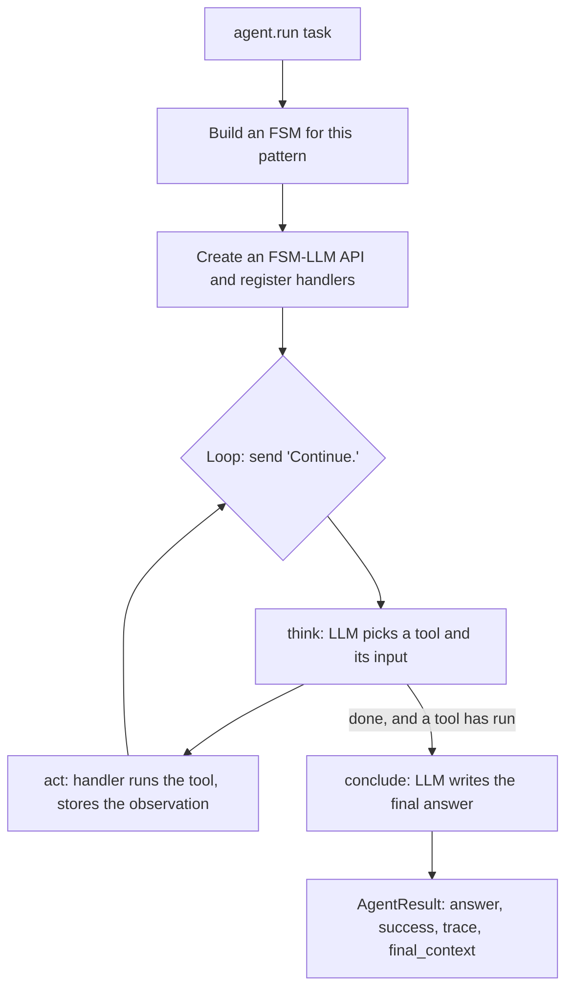

# fsm_llm.agents

Ready-made AI agent patterns for FSM-LLM, found at `src/fsm_llm/agents`: agents that call tools, plan, reflect, debate, vote, or hand work to other agents. It also includes a "meta-builder" that turns a plain description into an FSM, workflow, or agent definition.

## What it is for

An agent is an LLM that works on a task over several steps, often calling tools (your Python functions) along the way. Each pattern here is a known way to organise those steps. ReAct is the main one: think, call a tool, look at the result, repeat. Most patterns are built as an FSM-LLM finite state machine (FSM): a fixed set of states such as `think`, `act` and `conclude`, with rules for moving between them. That keeps the loop structured and bounded, which matters most with small local models. Every pattern has the same `agent.run(task)` call, which returns an answer, a success flag, a trace of tool calls, and the final context.

## How it works



- The agent sends the FSM the message `Continue.` again and again until it reaches a final state.
- Tools run inside handlers (hooks that FSM-LLM calls at fixed points), not inside the LLM. A tool failure is shown to the model as an observation marked `[TOOL FAILED]` instead of crashing the run.
- Limits stop runaway loops: `max_iterations` (default 10) and `timeout_seconds` (default 300, raises `AgentTimeoutError`). In the ReAct family `max_iterations=N` counts think turns: for N >= 2 a run that never concludes gets N think turns and N - 1 tool calls (N = 1 behaves like N = 2); when it is reached the run is forced to conclude and no further tool runs. The model is still asked on the last think turn, and its own conclusion there, backed by a tool result, counts as success. The hard ceiling is three times `max_iterations` in FSM turns, which raises `BudgetExhaustedError`.
- Each loop value the model produces (the tool and its input, a draft, a critique, a verdict, a plan) is asked for in its own prompt that shows the task and the results so far, and is cleared before the next round, so later rounds do not reuse the first round's text. Intermediate states write no reply; only the final state speaks.
- The ReAct family cannot conclude before a tool has run unless the loop was forced to stop, so a small model cannot answer from memory on turn one.
- `success` is `True` only when the run reached its goal: a real answer or at least one tool run. Planner patterns (orchestrator, ReWOO, plan and execute) must also show real executed work. A run that was forced to stop (iteration budget, three turns with no tool, a failing evaluator/checker verdict overridden at its limit, Reflexion's `max_reflections` reached without a passing evaluation, a Debate consensus forced by `num_rounds`) still returns its last answer but reports `success=False`; a genuine pass on the limit's last round is a success. `result.stop_reason` says why the run ended: `answered`, `evidence`, `max_iterations`, `forced_pass`, `stalled`, `verification_failed`, `no_result` or `gate_failed`.

## Patterns

| Pattern | Class | Idea |
| --- | --- | --- |
| ReAct | `ReactAgent` | Think, call a tool, observe, repeat, then answer |
| ReWOO | `REWOOAgent` | Plan every tool call first (`#E1`, `#E2` refer to earlier results), run them, then answer |
| Reflexion | `ReflexionAgent` | ReAct plus self-evaluation, reflection and retry |
| Plan and execute | `PlanExecuteAgent` | Break the task into steps, run each, replan on failure |
| Prompt chain | `PromptChainAgent` | A fixed series of prompts, with optional validation gates |
| Self-consistency | `SelfConsistencyAgent` | Answer several times at different temperatures, take the majority |
| Debate | `DebateAgent` | Proposer and critic argue, a judge decides |
| Orchestrator | `OrchestratorAgent` | Split into subtasks and hand them to workers |
| ADaPT | `ADaPTAgent` | Try directly; if that fails, break the task down and recurse |
| Evaluator-optimizer | `EvaluatorOptimizerAgent` | Generate, score with your function, refine |
| Maker-checker | `MakerCheckerAgent` | One role drafts, another reviews, revise until good |
| Reasoning ReAct | `ReasoningReactAgent` | ReAct plus a built-in `reason` tool that runs the structured reasoning engine from `fsm_llm.reasoning` |
| Parallel ReAct | `ParallelReactAgent` | Several tool calls per step, run in a thread pool |
| Verified ReAct | `VerifiedReactAgent` | Check the answer with your function and retry |
| Auto-memory ReAct | `AutoMemoryReactAgent` | Recall related memories before a run, save the exchange after |
| Native function calling | `NativeFunctionCallingReactAgent` | Uses the provider's own tool-calling API instead of an FSM |
| Swarm | `SwarmAgent` | Agents pass the task to each other |
| Agent graph | `AgentGraph` | Agents wired as a graph with conditional edges, no cycles |

## Files

- `base.py` - `BaseAgent`: the shared loop, limits, answer extraction, trace, structured output.
- `react.py`, `rewoo.py`, `reflexion.py`, `plan_execute.py`, `prompt_chain.py`, `self_consistency.py`, `debate.py`, `orchestrator.py`, `adapt.py`, `evaluator_optimizer.py`, `maker_checker.py`, `reasoning_react.py`, `parallel_react.py`, `verified_react.py`, `auto_memory.py`, `native_fc.py`, `swarm.py`, `agent_graph.py` - one pattern each.
- `fsm_definitions.py` - builds the FSM for each pattern. `prompts.py` - the instructions each state gives the LLM.
- `tools.py` - `ToolRegistry` and the `@tool` decorator. `tool_registries.py` - caching and retrying registries. `semantic_tools.py` - picks relevant tools by embedding similarity.
- `handlers.py` - runs tools, enforces the iteration limit, and checks human approval. `hitl.py` - human approval before sensitive tools.
- `memory_tools.py`, `semantic_memory.py`, `memory_persistence.py`, `summarization.py`, `truncation.py` - working-memory tools, long-term embedding memory, saving memory to disk, condensing old observations, shortening long tool output.
- `composition.py` - use ReAct agents as orchestrator workers; an LLM judge for the evaluator-optimizer.
- `skills.py`, `sop.py` - load tools from folders of Python files; reusable task templates (three built in).
- `mcp.py` - load tools from an MCP (Model Context Protocol) server. `remote.py` - serve an agent over HTTP, or call a remote one as a tool.
- `meta_builder.py`, `meta_builders.py`, `meta_tools.py`, `meta_prompts.py`, `meta_output.py`, `meta_cli.py`, `meta_fsm.py` - the meta-builder, its builders, its `fsm-llm-meta` command, and a legacy FSM stub.
- `definitions.py`, `constants.py`, `exceptions.py` - data models, names and defaults, errors.
- `__init__.py`, `__main__.py`, `__version__.py` - exports and `create_agent()`, `python -m fsm_llm.agents --info`, version.

## How to use it

```python
from fsm_llm.agents import AgentConfig, ReactAgent, ToolRegistry, tool

@tool
def add(a: int, b: int) -> int:
    """Add two numbers."""
    return a + b

registry = ToolRegistry()
registry.register(add._tool_definition)

agent = ReactAgent(tools=registry, config=AgentConfig(model="ollama_chat/qwen3.5:4b"))
result = agent.run("What is 17 + 25?")
print(result.answer, result.success, [c.tool_name for c in result.trace.tool_calls])
```

Or with the factory. The pattern comes first, tools can be a list of `@tool` functions, and `system_prompt` gives the agent standing instructions:

```python
from fsm_llm.agents import create_agent
agent = create_agent("react", [add], system_prompt="Always show the sum you computed.")
print(agent("What is 2 + 3?").answer)

for chunk in agent.run_stream("What is 4 + 5?"):  # only the model's text, no state markers
    print(chunk, end="")
```

The old form `create_agent("You are ...", tools)` still works but warns (`DeprecationWarning`): a first argument that is not a pattern name and contains a space, or is longer than 32 characters, is taken as the system prompt. A short unknown name such as `"debat"` raises `ValueError`.

Build a new FSM by chatting (say "build it" when ready):

```bash
fsm-llm-meta --model ollama_chat/qwen3.5:4b --output my_bot.json
```

## Things to know

- `pip install "fsm-llm[agents]"` adds no dependencies. `mcp.py` needs `fsm-llm[mcp]`; `RemoteAgentTool` needs `fsm-llm[a2a]` (httpx); `AgentServer` needs fastapi (for example via `fsm-llm[monitor]`). `ReasoningReactAgent` uses `fsm_llm.reasoning`, which ships in every install.
- `AgentConfig` rejects unknown fields (a typo raises). `model` defaults to the `LLM_MODEL` environment variable, read when the config is built, then `ollama_chat/qwen3.5:4b`. `instructions` (at most 2,000 characters; `create_agent(system_prompt=...)` sets it) is added to every prompt the pattern sends; `NativeFunctionCallingReactAgent` uses it as its system policy. Swarm and the meta-builder do not use it.
- Constructor mistakes raise `TypeError` instead of being passed to the LLM provider: `hitl=`, `tools=` or a `HumanInTheLoop` argument (`approval_policy=`, `approval_callback=`, `on_escalation=`, ...) on a pattern that cannot use them, and `model=`, `temperature=` or `max_tokens=` as keyword arguments (put them in `AgentConfig`). Other keyword arguments, such as `seed=`, `timeout=` or `llm_interface=`, still pass through.
- `ReactAgent`, `REWOOAgent`, `ReflexionAgent`, `ParallelReactAgent` and `NativeFunctionCallingReactAgent` refuse an empty tool registry.
- Each `run()` makes many LLM calls. Small models can hit the iteration limit and fail with `BudgetExhaustedError`.
- If the model names a tool that does not exist, it is told which tools exist and the turn counts as a turn without a tool call, not as evidence of work. The bad name is cleared so the next turn can pick a real tool. After three turns in a row with no tool, the run is forced to conclude.
- Human approval works in `ReactAgent`, `ReflexionAgent` and `ReasoningReactAgent` with `HumanInTheLoop(approval_policy=..., approval_callback=...)`. A tool the policy gates runs only after the callback approved that exact call, and each approval covers one call. With a callback and no policy, the tools marked `@tool(requires_approval=True)` are the ones that need approval. The model cannot approve a call itself, and neither can a caller: the grant is stored under an internal key that the model cannot write and that `initial_context` cannot set. A denial is shown to the model on its next turn. If a `requires_approval` tool exists and nobody can decide on it (`hitl=None`, or a `HumanInTheLoop` with neither a callback nor a policy), the agent raises `AgentError` at construction and again when `run()` starts. With a policy and no callback the policy decides: a call it gates fails with `ApprovalDeniedError` (reported as `AgentError`), and a warning at construction says so. `RetryingToolRegistry` never retries a `requires_approval` tool, so one approval covers one execution. `ParallelReactAgent`, `REWOOAgent`, `PlanExecuteAgent` and `NativeFunctionCallingReactAgent` have no approval step, so they refuse a registry that holds a `requires_approval` tool (`AgentError`, at construction and again when `run()` starts). Known gaps: with a policy set, `requires_approval` adds nothing (the policy decides, so a flagged tool it does not gate runs unasked); `RetryingToolRegistry` still retries a tool that only a policy gates; the policy sees the call before an empty input is filled from the task text.
- Keys a run writes itself (`final_answer`, `should_terminate`, `observation_count`, tool selection and results, approval keys, and each pattern's own drafts, verdicts and answers such as `draft_output`, `generated_output` or `proposition`) are removed from `initial_context` with a warning, so a caller cannot fake a finished run. An `AgentGraph` node or a `SwarmAgent` hand-off target never receives its own pattern's outputs from an earlier agent. `AgentServer` also drops every internal key from the request context.
- Tool arguments that look like secrets (by the same filter the core uses) show as `<redacted>` in observations, traces, logs and the approval summary; the tool itself gets the real value, and the approver sees the exact call. The memory tools never list or change the hidden `metadata` buffer.
- A tool function runs at most once per call. If its arguments match its signature, a `TypeError` raised inside it is reported as a failed call, not retried with guessed arguments. `register_function` accepts plain and async functions, bound methods, `functools.partial` objects and callable instances; a positional-only parameter is filled from the value sent under its name.
- `AgentServer` is unauthenticated by default. Pass `api_key=` to require `Authorization: Bearer <key>` or `X-API-Key` on `/invoke` and `/stream`; `RemoteAgentTool(api_key=...)` sends it. Input over `max_input_chars` (default 100,000) gets 413. At most `max_concurrent` runs (default 8) are in flight; more get 503. A failing run returns a generic error with an `error_id`; the exception is only logged. There is no per-client rate limiting. `RemoteAgentTool` raises `ToolExecutionError` when the server reports `success: false`. `/stream` sends one event after the run finishes; it does not stream tokens.
- Keys in the returned `final_context` that look internal (starting with `_`, `system_`, `internal_` or `__`) are removed by the FSM-based patterns. `SwarmAgent` and `AgentGraph` add their own `_swarm_*` and `_graph_*` keys on top of the last agent's result.
- `EvaluatorOptimizerAgent` and `MakerCheckerAgent` need arguments `create_agent` cannot guess (an evaluation function; maker and checker instructions). Pass them yourself.
- Maker and checker instructions and the three `DebateAgent` personas go into the prompts as written, with no sanitizing. Write them yourself; put user input in the task.
- `MakerCheckerAgent` and `EvaluatorOptimizerAgent` judge every new draft. While the model rewrites, the old draft is kept under `previous_draft` / `previous_output`, which later prompts can see but which is dropped from `final_context`. When the pass is forced (the quality score reaches the threshold, the revision limit is hit, or the iteration budget runs out), the draft that was just judged is the one returned.
- `OrchestratorAgent` without a `worker_factory` only records placeholder results, so it always reports `success=False`. `PlanExecuteAgent` without tools cannot mark a step as executed, so it also reports `success=False`. Subtasks beyond `max_workers` are not run: they are listed in `final_context["skipped_subtasks"]`, with a warning, and kept out of `worker_results`.
- `BudgetExhaustedError` and `AgentTimeoutError` raised by a sub-run of `ADaPTAgent` or a worker of `OrchestratorAgent` end the whole run and are re-raised by its `run()`. ADaPT runs at most 8 subtasks per decomposition.
- `SelfConsistencyAgent` votes on each sample's last `Answer:` line (case and spacing ignored). `DebateAgent` returns the conclusion written after the last round. A failed `PromptChainAgent` validation gate stops the chain (`stop_reason="gate_failed"`). `PlanExecuteAgent` replans when a step's tool fails, at most `max_replans` times. `AgentGraph` runs nodes in dependency order, each once; a node that fails takes no outgoing edge. `SwarmAgent` gives every agent the original task and allows exactly `max_handoffs` handoffs (a handoff to an unknown agent ends the run with `success=False, stop_reason="no_result"`); it hands off only when an agent writes `next_agent`, which nothing shipped does.
- `VerifiedReactAgent` reports `success=False, stop_reason="verification_failed"` when the answer is still rejected after the retries; a verifier that raises counts as a rejection.
- `SemanticToolRegistry` returns every tool when fewer than 10 are registered.
- MCP servers get a 30-second timeout per tool discovery and per tool call by default (`timeout=None` turns it off). Each call starts a new connection to the server, and that start counts toward the timeout.
- The meta-builder makes one LLM call to extract the whole design, then assembles it in Python. For workflows and agents, `is_valid` means the spec is complete, not that it loads as a runnable object; you still wire in the Python functions.
- `save_artifact` writes wherever it is told; check paths that come from untrusted input.
- The 2026-09-29 audit of this package, what it fixed and what is deferred: `docs/agents_roadmap.md`. API summary: `docs/api_reference.md`.
