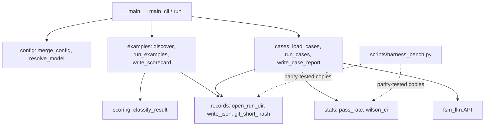

# fsm_llm.eval

Path: `src/fsm_llm/eval`
Purpose: Evaluation tooling: the examples evaluator (run every example script, score it 0-4, write a scorecard), conversation cases (scripted multi-turn conversations against any FSM, checked against declared expectations over repeated trials), a layered `EvalConfig`, binomial statistics, append-only result rows, and collision-safe run directories. CLI `fsm-llm-eval`.

## Scope

Two evaluation kinds behind one CLI, sharing config, records, stats and the run-directory rule: `examples` (subprocess per example script, heuristic scoring, the historical `scripts/eval.py` output layout) and `run` (in-process conversations through `fsm_llm.API`, pass/fail per trial, Wilson intervals). Extra `eval` installs nothing beyond core `fsm_llm`. Version from `fsm_llm.__version__`. Not here: LLM-as-judge scoring, repeats/median for example runs, a stats subcommand, harness-specific bench glue (manifest gate, probes, `write_summary`, `report` stay in `scripts/harness_bench.py`, which keeps stdlib copies of the generic helpers so it stays offline, D-008 of plan 581c2634).

## Architecture

Examples run: `discover_examples(config)` -> `open_run_dir` -> ThreadPool of `config.workers`, each thread drives one subprocess (`run_example`) -> score once with `classify_result` -> log written as each finishes -> `write_scorecard` (scorecard.md + results.json). Cases run: `load_cases(path)` -> ThreadPool over (case, trial) pairs, each a fresh `API` (`run_case_trial`) -> row appended and flushed to `rows.jsonl` per trial -> `write_case_report` (results.json + summary.md).

## Key files

| File | Role | Notes |
| --- | --- | --- |
| `__main__.py` | `main_cli(argv) -> int`, `run(argv=None) -> int`, `build_parser` | `_Parser` exits 1 on usage errors; `run` alone calls `setup_cli_logging("WARNING")` |
| `config.py` | `EvalConfig`, `load_config`, `merge_config`, `resolve_model` | pydantic, `extra="forbid"`; table fields merge key by key |
| `examples.py` | `ExampleTarget`, `ExampleResult`, `ExampleReport`, `discover_examples`, `get_timeout`, `run_example`, `run_examples`, `write_example_log`, `write_scorecard`, `create_output_dir`, `health_score` | D-003 anchor on timeout precedence |
| `scoring.py` | `classify_result(result) -> (score, failures)` | moved verbatim from `scripts/eval.py` at 0facf56; golden parity in `test_scoring.py` |
| `cases.py` | `Expectations`, `ConversationCase`, `TrialResult`, `CaseReport`, `load_cases`, `check_expectations`, `run_case_trial`, `run_cases`, `run_dataset`, `write_case_report` | `llm_interface_factory` injects a fake LLM; D-004 anchors on `run_cases` and `Expectations._at_least_one_check` |
| `records.py` | `append_row`, `read_rows`, `write_json`, `utc_now`, `git_commit`, `git_short_hash`, `model_slug`, `make_run_dir`, `open_run_dir` | run dirs never reused |
| `stats.py` | `wilson_ci`, `fisher_exact_two_sided`, `pass_rate`, `below_percent` | stdlib only, copied from `scripts/harness_bench.py`; `below_percent` is the exact `--fail-under` test |
| `_pool.py` | `run_interruptible(work, items, workers, on_done) -> interrupted` | both runners; Ctrl-C cancels the queue |
| `constants.py` | defaults, exit codes, score labels, `EXAMPLE_INPUTS`, `EXAMPLE_TIMEOUTS`, `CATEGORY_TIMEOUTS` | tables moved verbatim from `scripts/eval.py` |
| `exceptions.py` | `EvalError` tree | |

## Public interface

- CLI (`fsm-llm-eval`, `python -m fsm_llm.eval`):
  - `examples [--model M] [--workers N] [--timeout S] [--category C] [--filter S] [--output-dir D] [--examples-dir P] [--python EXE] [--config FILE] [--fail-under PCT] [--list]`.
  - `run DATASET [--model M] [--trials N] [--temperature T] [--max-tokens N] [--workers N] [--output-dir D] [--config FILE] [--fail-under PCT] [--list]`.
  - Top level: `--version`; no subcommand prints help and exits 1.
  - Exit codes: `0` success, also for low scores; `1` usage error, bad config or dataset (incl. non-UTF-8, invalid JSON), unwritable output, missing examples dir, nothing matched; `2` only with `--fail-under PCT` when the health score (`examples`) or overall pass rate (`run`) is below PCT, compared exactly in integers (`below_percent`); `130` Ctrl-C (`fsm_llm.constants.CLI_EXIT_INTERRUPTED`), after the partial report is written.
- `EvalConfig` fields and defaults: `model=None` (resolved at run time: `$LLM_MODEL`, else `fsm_llm.constants.DEFAULT_LLM_MODEL`; blank counts as absent), `workers=4` (>=1), `timeout=120` (>=1), `output_root="evaluation"`, `output_dir=None`, `fail_under=None` (0-100), `examples_dir="examples"`, `python=None` (running interpreter), `category=None`, `name_filter=None`, `example_inputs={}`, `example_timeouts={}`, `category_timeouts={}` (merged over the built-in tables), `trials=3` (>=1, cases only), `temperature=None` (>=0), `max_tokens=None` (>=1), `llm_kwargs={}` (cases only; `None` keeps the framework default; `llm_kwargs` are extra `API(...)` kwargs, merged key by key, may not set `fsm_definition`/`definition`/`path`/`llm_interface`/`model`/`temperature`/`max_tokens` or the non-JSON `handlers`/`transition_config`/`session_store`; ignored when a factory is given; values never written to `results.json`).
- Precedence: defaults < dataset-embedded `config` (`run` only) < `--config FILE` < explicit flags (`merge_config(*layers)`, later wins). Flags default to `None`, so only passed flags override.
- `load_config(path) -> dict` (the layer; validated alone, errors name the file). `merge_config(*layers) -> EvalConfig`.
- `discover_examples(config) -> list[ExampleTarget]`; `run_examples(targets, config, model, run_dir, progress=None) -> ExampleReport`; `write_scorecard(report, config, git_hash, now=None) -> Path`.
- `load_cases(path) -> (cases, embedded_config)`; `run_cases(cases, config, run_dir, *, llm_interface_factory=None, progress=None, dataset=None, checks=()) -> CaseReport`; `run_dataset(path, *, config=None, llm_interface_factory=None, checks=(), progress=None, **overrides) -> CaseReport` (one call: load, layer `embedded < config (file path, mapping or EvalConfig set fields) < overrides`, open the run dir, run); `run_case_trial(case, config, trial, llm_interface_factory=None, *, checks=()) -> TrialResult` (never raises); `check_expectations(expect, trial) -> list[str]` (`[]` = pass). A check is `Callable[[TrialResult], list[str]]` (failure messages); a raising check is a trial error.
- `ExampleReport.interrupted` / `CaseReport.interrupted`: `True` after Ctrl-C; results then hold only finished work.
- `pass_rate(k, n) -> {"k","n","rate","wilson_ci":[lo,hi]}` (n=0 -> rate 0.0, CI `[0.0, 1.0]`); `wilson_ci(k, n, z=1.96)`; `fisher_exact_two_sided(k1, n1, k2, n2)`.
- `open_run_dir(output_dir, output_root, model, cwd=None) -> Path`; `make_run_dir(root, model, cwd=None, now=None) -> Path`.

## Data shapes

- Dataset: a JSON list of cases, a JSON object `{"config": {...}, "cases": [...]}` (no other top-level keys), or `.jsonl` (one case per line, blank lines skipped, no embedded config). Case: `id` (unique, non-empty), `fsm` (path relative to the dataset file, or an inline definition dict), `initial_context` (`{}`), `turns` (at least one user message), `expect`, `description` (`""`). Unknown keys are rejected.
- Unsent turns (the conversation ended before the last turn) fail the trial unless `expect.ended` is declared.
- `expect` (at least one check; only declared checks run): `final_state` (state after the last turn sent), `visited_states` (each was current after start or after a turn, any order), `context` (exact values in `get_data`), `context_keys` (present and not null), `responses_contain` (case-insensitive substring in at least one response, greeting included), `ended` (bool).
- Examples run dir `<output_root>/<YYYY-MM-DD_HH-MM>_<git-short-hash>_<model-slug>[_N]/`: `scorecard.md` (Scores, Summary, Timing with "Total wall time" = real elapsed and "Total example time" = sum of durations), `results.json` (`date, git_commit, model, health_score, total_examples, distribution, results[{name, category, score, failures, duration, exit_code, timed_out}]` plus `wall_time_s, workers, default_timeout, evaluator, interrupted`), `logs/<category>/<category>_<name>.log`.
- Cases run dir (same naming): `rows.jsonl` (one `TrialResult` row per trial: `case_id, trial, passed, failures, error, final_state, visited_states, responses, context, ended, turns_sent, duration`), `results.json` (`date, git_commit, model, dataset, evaluator, config, overall, cases[{id, description, k, n, rate, wilson_ci, first_failure, failure_counts}], wall_time_s, interrupted`; `config.llm_kwargs` values replaced by `"<not recorded>"`), `summary.md`.
- Model slug: last `/` segment, `:` -> `-`. Git hash of the examples tree's parent (examples) or the dataset's directory (cases); `unknown` when git fails.

## Invariants and constraints

- Example scores equal the old `scripts/eval.py` `classify_result` for the same inputs; `test_scoring.py` pins a golden table from commit `0facf56`. Do not "improve" the heuristic without re-baselining EVALUATE.md.
- `results.json` for example runs keeps every old key with the same meaning; new keys are additive only. Names stay `<category>/<dir>[_manual]`.
- Timeout precedence: per-example table > category table > `--timeout` (D-003 anchor in `examples.py`); change a tabled timeout from a `--config` file, never by reordering.
- A run never writes into an existing run: `make_run_dir` adds `_2`, `_3`, ... (`exist_ok=False`); an explicit `--output-dir` must be new or empty.
- `setup_cli_logging` only in `run()`, never in `main_cli()` (tests call `main_cli` in-process).
- `scripts/harness_bench.py` must stay stdlib-only and offline: it never imports `fsm_llm.eval` (importing `fsm_llm` pulls litellm, which opens a socket; D-008). Its seven copies of the stats and row helpers must match this package; `test_bench_parity.py` enforces it, so change both together.
- `fsm_llm/__init__.py` never imports this subpackage; this subpackage never imports `tests`.
- One case trial = one fresh `API`, closed in `finally`; trial exceptions are data (`error` set), never a crashed run.

## Dependencies

- `fsm_llm`: `API` (cases), `LLMInterface` (factory type), `constants.DEFAULT_LLM_MODEL`/`ENV_LLM_MODEL`, `definitions.FSMError`, `utilities.redacting_json_default` (non-JSON context values in rows), `logging.setup_cli_logging`.
- pydantic v2; stdlib `subprocess`, `concurrent.futures`, `argparse`. `git` binary optional (metadata only).

## Failure modes

- `EvalError(FSMError)(message, details=None)` -> `EvalConfigError` (bad config file, unknown key, bad value, bad embedded config), `EvalDatasetError` (missing or malformed dataset, invalid case, missing FSM file, duplicate id, zero cases, malformed JSONL line with its number). Unwritable output raises `EvalError`. The CLI reports all of them on stderr and exits 1.
- Example timeout: partial output kept, `exit_code=None`, `timed_out=True`, scored by the heuristic. Interpreter missing: `exit_code=-1`, score 0. A worker future that raises becomes a score-0 result with the error text.
- A hung LLM call in a case trial cannot be killed in-process; the trial waits for litellm's own request timeout.
- Ctrl-C: queued work is cancelled, in-flight work finishes in the background unreported, the partial report is written with `interrupted: true`, and the CLI exits 130.
- `git_commit` (harness semantics) raises when git fails; `git_short_hash` returns `unknown`.

## Working here

- New expectation: add an optional field to `Expectations` and a branch in `check_expectations`, plus a test where the check FAILS (fixtures must exercise the failing branch).
- New `EvalConfig` field: default in `constants.py`, field with bounds in `config.py`, flag in `__main__._add_common_options` or the subparser with default `None`, and add it to the handler's `fields` tuple.
- Import as `from fsm_llm import eval as fsm_eval` or import names directly; a bare `from fsm_llm import eval` shadows the builtin.
- Tests: `pytest tests/test_fsm_llm_eval/` (`test_stats.py`, `test_records.py`, `test_config.py`, `test_scoring.py`, `test_examples.py`, `test_cases.py`, `test_cli.py`); offline, cases use `MockLLM2Interface`; `test_bench_parity.py` pins `scripts/harness_bench.py`'s copies. Sample dataset: `evaluation/datasets/simple_greeting_cases.json` (three plumbing cases plus `name_is_extracted` over `name_capture_fsm.json`, which a do-nothing mock fails; keep at least one case that depends on the model).
