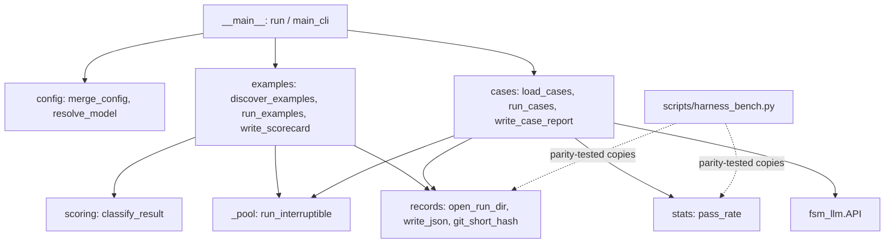

# fsm_llm.eval

Path: `src/fsm_llm/eval`
Purpose: Evaluation tooling inside the core `fsm_llm` package: the examples evaluator (run every example script, score it 0-4, write a scorecard), conversation cases (scripted multi-turn conversations against any FSM, checked against declared expectations over repeated trials), a layered `EvalConfig`, binomial statistics, append-only result rows, and collision-safe run directories. CLI `fsm-llm-eval` (`pyproject.toml`: `fsm_llm.eval.__main__:run`).

## Scope

Two evaluation kinds behind one CLI, sharing config, records, stats and the run-directory rule:

- `examples`: one subprocess per example script, heuristic scoring, the output layout of the historical `scripts/eval.py` (that script has been removed from the repo; this package replaces it).
- `run`: in-process conversations through `fsm_llm.API`, pass/fail per trial, Wilson intervals.

The `eval` extra in `pyproject.toml` is `[]` (nothing beyond core deps). Version comes from `fsm_llm.__version__`.

Not here: LLM-as-judge scoring, repeats/median for example runs, a stats subcommand, harness bench glue (manifest gate, probes, `write_summary`, `report` stay in `scripts/harness_bench.py`, which keeps stdlib copies of the generic helpers so it stays offline; DECISION D-008 of plan 581c2634).

## Architecture

Examples run: `discover_examples(config)` -> `create_output_dir` (`open_run_dir`, git hash of the examples tree's parent) -> `run_interruptible` over `config.workers` threads, each driving one subprocess (`run_example`, scored once with `classify_result`) -> log written as each finishes (`write_example_log`) -> results sorted by name -> `write_scorecard` (`scorecard.md` + `results.json`).

Cases run: `load_cases(path)` -> `merge_config` -> `open_run_dir` (git hash of the dataset's directory) -> `run_interruptible` over (case, trial) pairs, each a fresh `API` (`run_case_trial`) -> row appended and flushed to `rows.jsonl` per trial -> trials sorted by `(case_id, trial)` -> `_summarise` -> `write_case_report` (`results.json` + `summary.md`).

Scoring (`classify_result`, checked in order): score 0 when `exit_code == -1`, or nonzero exit under 3.0 s with empty stdout (codes `F-CODE` or `F-SCHEMA`); score 1 on timeout (`F-LOOP`); then output signals add `F-CODE`, `F-TOOL`, `F-EXTRACT`, `F-LOOP`, `F-PARSE`, `F-TRANS` (`F-TRANS` only together with `F-EXTRACT`); nonzero exit gives 2 (stdout over 300 chars) or 1; exit 0 gives 4 with no failures, 1 for extract plus trans or zero extraction, 2 for partial extraction, 3 for a single other failure, else 2.

## Key files

| File | Role | Notes |
| --- | --- | --- |
| `__main__.py` | `run(argv=None) -> int`, `main_cli(argv=None) -> int`, `build_parser()` | `__all__ = ["main_cli", "run"]`; `_Parser` exits 1 on usage errors; only `run` calls `setup_cli_logging("WARNING")` |
| `config.py` | `EvalConfig`, `load_config`, `merge_config`, `resolve_model` | pydantic, `extra="forbid"`; `_TABLE_FIELDS` merge key by key; `_RESERVED_LLM_KWARGS` |
| `examples.py` | `ExampleTarget`, `ExampleResult`, `ExampleReport`, `discover_examples`, `get_timeout`, `run_example`, `run_examples`, `write_example_log`, `write_scorecard`, `create_output_dir`, `health_score` | D-003 anchor on timeout precedence |
| `scoring.py` | `classify_result(result) -> (score, failures)` | moved verbatim from `scripts/eval.py` at commit `0facf56`; golden parity table in `tests/test_fsm_llm_eval/test_scoring.py` |
| `cases.py` | `Expectations`, `ConversationCase`, `TrialResult`, `CaseReport`, `load_cases`, `check_expectations`, `run_case_trial`, `run_cases`, `run_dataset`, `write_case_report` | D-004 anchors on `run_cases` and `Expectations._at_least_one_check` |
| `records.py` | `append_row`, `read_rows`, `write_json`, `utc_now`, `git_commit`, `git_short_hash`, `model_slug`, `make_run_dir`, `open_run_dir` | run dirs never reused |
| `stats.py` | `wilson_ci`, `fisher_exact_two_sided`, `pass_rate`, `below_percent` | stdlib only; `below_percent` is the exact `--fail-under` test (not exported from `__init__`) |
| `_pool.py` | `run_interruptible(work, items, workers, on_done) -> bool` | returns `True` when interrupted |
| `constants.py` | defaults, exit codes, `SCORE_LABELS`, `EXAMPLE_INPUTS`, `EXAMPLE_TIMEOUTS`, `CATEGORY_TIMEOUTS`, `EXAMPLE_SCRIPT_NAMES` | tables moved verbatim from `scripts/eval.py` (`0facf56`) |
| `exceptions.py` | `EvalError`, `EvalConfigError`, `EvalDatasetError` | rooted at `fsm_llm.definitions.FSMError` |
| `__init__.py`, `__version__.py` | static `__all__`, version re-export | |

## Public interface

CLI (`fsm-llm-eval`, `python -m fsm_llm.eval`):

- `examples [--model M] [--workers N] [--timeout S] [--category C] [--filter S] [--output-dir D] [--examples-dir P] [--python EXE] [--config FILE] [--fail-under PCT] [--list]`. `--filter` maps to `name_filter`.
- `run DATASET [--model M] [--trials N] [--temperature T] [--max-tokens N] [--workers N] [--output-dir D] [--config FILE] [--fail-under PCT] [--list]`.
- Top level: `--version`; no subcommand prints help to stderr and returns 1.
- Exit codes: `0` success, also for low scores; `1` usage error, bad config or dataset (incl. non-UTF-8, invalid JSON), unwritable output, missing examples dir, no example matched; `2` only with `--fail-under PCT` when the health score (`examples`) or overall pass rate (`run`) is below PCT (`below_percent`, exact rationals); `130` Ctrl-C (`fsm_llm.constants.CLI_EXIT_INTERRUPTED`), after the partial report is written. `main_cli` catches `EvalError` (stderr, exit 1) and a stray `KeyboardInterrupt` (exit 130).

`EvalConfig` fields and defaults: `model=None` (resolved at run time by `resolve_model`: `config.model`, then `$LLM_MODEL`, then `fsm_llm.constants.DEFAULT_LLM_MODEL` = `ollama_chat/qwen3.5:4b`; blank counts as absent), `workers=4` (>=1), `timeout=120` (>=1), `output_root="evaluation"`, `output_dir=None`, `fail_under=None` (0-100), `examples_dir="examples"`, `python=None` (running interpreter), `category=None`, `name_filter=None`, `example_inputs={}`, `example_timeouts={}`, `category_timeouts={}` (merged over the built-in tables), `trials=3` (>=1, cases only), `temperature=None` (>=0), `max_tokens=None` (>=1), `llm_kwargs={}`.

`llm_kwargs` (cases only): extra `API(...)` kwargs, merged key by key across layers. May not set `fsm_definition`, `definition`, `path`, `llm_interface`, `model`, `temperature`, `max_tokens`, `handlers`, `transition_config`, `session_store`. Ignored when a factory is given. Values never written to `results.json` (replaced by `"<not recorded>"`).

Precedence: defaults < dataset-embedded `config` (`run` only) < `--config FILE` < explicit flags (`merge_config(*layers)`, later wins; `None` layers skipped). Flags default to `None`, so only passed flags override.

Python:

- `load_config(path) -> dict` (the layer; validated alone, errors name the file). `merge_config(*layers) -> EvalConfig`. `resolve_model(config) -> str`.
- `discover_examples(config) -> list[ExampleTarget]` (`[]` when the dir is missing or nothing matches); `get_timeout(name, category, default, example_timeouts=EXAMPLE_TIMEOUTS, category_timeouts=CATEGORY_TIMEOUTS) -> int`; `run_example(target, model, python, cwd) -> ExampleResult` (never raises); `run_examples(targets, config, model, run_dir, progress=None) -> ExampleReport`; `write_example_log(result, output_dir) -> Path`; `write_scorecard(report, config, git_hash, now=None) -> Path`.
- `load_cases(path) -> (cases, embedded_config)`; `run_cases(cases, config, run_dir, *, llm_interface_factory=None, progress=None, dataset=None, checks=()) -> CaseReport`; `run_dataset(path, *, config=None, llm_interface_factory=None, checks=(), progress=None, **overrides) -> CaseReport` (load, layer `embedded < config (file path, mapping, or EvalConfig with only its set fields) < overrides`, open the run dir, run); `run_case_trial(case, config, trial, llm_interface_factory=None, *, checks=()) -> TrialResult` (never raises); `check_expectations(expect, trial) -> list[str]` (`[]` = pass); `write_case_report(report, config, dataset=None) -> Path`.
- A check is `Callable[[TrialResult], list[str]]` (failure messages); a raising check becomes a trial error. Progress callbacks: `(completed, total, result_or_trial)`.
- `ExampleReport.interrupted` / `CaseReport.interrupted`: `True` after Ctrl-C; results then hold only finished work.
- `pass_rate(k, n) -> {"k","n","rate","wilson_ci":[lo,hi]}` (n=0 -> rate 0.0, CI `[0.0, 1.0]`); `wilson_ci(k, n, z=1.96)`; `fisher_exact_two_sided(k1, n1, k2, n2)`; `below_percent(k, n, percent)` (n=0 is below any positive percent). Impossible counts raise `ValueError`.
- `open_run_dir(output_dir, output_root, model, cwd=None) -> Path`; `make_run_dir(root, model, cwd=None, now=None) -> Path`.

## Data shapes

- Dataset: a JSON list of cases, a JSON object `{"config": {...}, "cases": [...]}` (no other top-level keys), or `.jsonl` (one case per line, blank lines skipped, no embedded config). Case: `id` (unique, non-empty), `fsm` (path relative to the dataset file, or an inline definition dict; after loading, a string is an absolute path), `initial_context` (`{}`), `turns` (at least one user message), `expect`, `description` (`""`). Unknown keys are rejected.
- `expect` (at least one check; only declared checks run): `final_state` (state after the last turn sent), `visited_states` (each was current after start or after a turn, any order), `context` (exact values in `get_data`), `context_keys` (present and not null), `responses_contain` (case-insensitive substring in at least one response, greeting included), `ended` (bool).
- Unsent turns (the conversation ended before the last turn) fail the trial unless `expect.ended` is declared.
- Example discovery: `EXAMPLE_SCRIPT_NAMES = ("run.py", "run_manual.py")`, all `run.py` first then all `run_manual.py`, each sorted by path; scripts fewer than two directories deep are skipped. Name `<category>/<dir>` plus `_manual` for `run_manual.py`. `interactive` = source contains `input(` (informational). Subprocess env: a copy plus `LLM_MODEL=<model>` and `PYTHONDONTWRITEBYTECODE=1`; cwd is the parent of `examples_dir`.
- Examples run dir `<output_root>/<YYYY-MM-DD_HH-MM>_<git-short-hash>_<model-slug>[_N]/`: `scorecard.md` (Scores, Summary, Timing with "Total wall time" = real elapsed and "Total example time" = sum of durations), `results.json` (`date, git_commit, model, health_score, total_examples, distribution, results[{name, category, score, failures, duration, exit_code, timed_out}]` plus `wall_time_s, workers, default_timeout, evaluator, interrupted`), `logs/<category>/<category>_<name>.log`.
- Cases run dir (same naming): `rows.jsonl` (one `TrialResult.to_row()` per trial: `case_id, trial, passed, failures, error, final_state, visited_states, responses, context, ended, turns_sent, duration`; non-JSON context values go through `redacting_json_default`), `results.json` (`date, git_commit, model, dataset, evaluator, config, overall, cases[{id, description, k, n, rate, wilson_ci, first_failure, failure_counts}], wall_time_s, interrupted`), `summary.md`.
- `write_json`: indent 2, sorted keys, trailing newline. `utc_now`: `YYYY-MM-DDTHH:MM:SSZ`.
- Model slug: last `/` segment, `:` -> `-`. Git hash `unknown` when git fails.

## Invariants and constraints

- Example scores must equal the historical `scripts/eval.py` `classify_result` for the same inputs; `test_scoring.py` pins a golden table from commit `0facf56`. Change the rubric only for rubric reasons, never together with a structural change, or scores stop being comparable with `EVALUATE.md` runs.
- `results.json` for example runs keeps every old key with the same meaning; new keys are additive only. Names stay `<category>/<dir>[_manual]`.
- Timeout precedence: per-example table > category table > `--timeout` (D-003 anchor in `examples.py`: no `min`/`max` with the default). Change a tabled timeout from a `--config` file, never by reordering.
- A run never writes into an existing run: `make_run_dir` adds `_2` ... up to `MAX_RUN_DIR_SUFFIX = 1000` (`exist_ok=False`); an explicit `--output-dir` must be new or empty.
- `setup_cli_logging` only in `run()`, never in `main_cli()` (tests call `main_cli` in-process).
- An empty `expect` is rejected even when Python `checks` are passed (D-004).
- Case trials stay on threads in one process; do not move them to a subprocess per trial (D-004).
- `scripts/harness_bench.py` must stay stdlib-only and offline and never import `fsm_llm.eval` (importing `fsm_llm` pulls litellm, which opens a socket; D-008). Its seven copies (`wilson_ci`, `fisher_exact_two_sided`, `_utc_now`, `_git_commit`, `_write_json`, `append_row`, `read_rows`) must match this package; `tests/test_fsm_llm_eval/test_bench_parity.py` enforces it, so change both together.
- `fsm_llm/__init__.py` never imports this subpackage.
- One case trial = one fresh `API`, closed in `finally`; trial exceptions are data (`error` set), never a crashed run.
- `on_done` callbacks in `run_interruptible` run on the calling thread, so `results`/`trials` lists need no lock.

## Dependencies

- `fsm_llm`: `api.API` (cases), `llm.LLMInterface` (factory type), `constants.DEFAULT_LLM_MODEL`/`ENV_LLM_MODEL`/`CLI_EXIT_INTERRUPTED`, `definitions.FSMError`, `utilities.redacting_json_default`, `logging.setup_cli_logging`.
- pydantic v2; stdlib `subprocess`, `concurrent.futures`, `argparse`, `fractions`, `math`. `git` binary optional (metadata only).

## Failure modes

- `EvalError(FSMError)(message, details=None)` -> `EvalConfigError` (bad config file, unknown key, bad value, reserved `llm_kwargs`, bad embedded config), `EvalDatasetError` (missing or malformed dataset, invalid case, missing FSM file, duplicate id, zero cases, malformed JSONL line with its number). Unwritable output raises `EvalError`. The CLI reports all of them on stderr and exits 1.
- Example timeout: partial output kept, `exit_code=None`, `timed_out=True`, score 1 (`F-LOOP`). Interpreter missing: `exit_code=-1`, score 0. A worker future that raises becomes a score-0 result with `runner error: ...`.
- A hung LLM call in a case trial cannot be killed in-process; the trial waits for litellm's own request timeout.
- Ctrl-C: queued work is cancelled, in-flight work finishes in the background unreported, the partial report is written with `interrupted: true`, and the CLI exits 130. Any other exception from `on_done` cancels the queue and propagates.
- `api.close()` failure marks the trial failed with `close failed: ...` unless an error is already set.
- `git_commit` (bench semantics) raises when git fails; `git_short_hash` returns `unknown`.

## Working here

- New expectation: add an optional field to `Expectations` and a branch in `check_expectations`, plus a test where the check FAILS.
- New `EvalConfig` field: default in `constants.py`, field with bounds in `config.py`, flag in `__main__._add_common_options` or the subparser with default `None`, and add it to the handler's `fields` tuple in `_cmd_examples` or `_cmd_run`. Table-like dict fields go in `_TABLE_FIELDS`.
- New export: add it to the static `__all__` in `__init__.py`.
- Import as `from fsm_llm import eval as fsm_eval` or import names directly; a bare `from fsm_llm import eval` shadows the builtin.
- Read the `# DECISION` anchors (D-003 in `examples.py`, D-004 in `cases.py`) before editing nearby.
- Tests: `.venv/bin/python -m pytest tests/test_fsm_llm_eval/` (`test_stats.py`, `test_records.py`, `test_config.py`, `test_scoring.py`, `test_examples.py`, `test_cases.py`, `test_cli.py`, `test_bench_parity.py`); offline, cases use `MockLLM2Interface`.
- Sample dataset: `evaluation/datasets/simple_greeting_cases.json` (three plumbing cases over `examples/basic/simple_greeting/fsm.json` plus `name_is_extracted` over `name_capture_fsm.json`, which a do-nothing model fails). Keep at least one case that depends on the model.
- Do not edit `examples/`: its scripts are the evaluation baselines this package runs.
