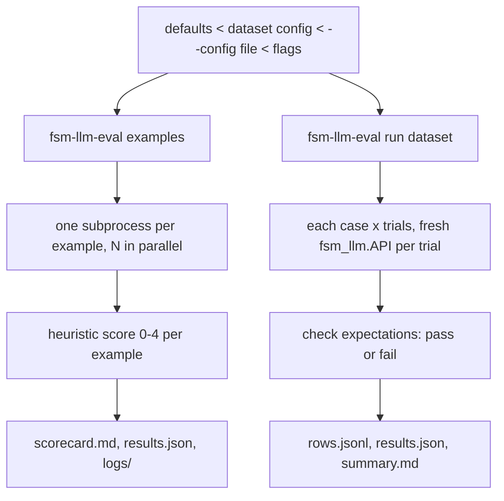

# fsm_llm.eval

Evaluation tools for FSM-LLM. It runs the repository examples and scores them, and it runs scripted conversations against any FSM and checks the results, reporting pass rates with confidence intervals.

## What it is for

LLM behaviour varies from run to run, so "it worked once" is not a measurement. This package gives two ways to measure:

- **Examples evaluation** (`fsm-llm-eval examples`): runs every `examples/<category>/<name>/run.py` in its own process, feeds interactive ones a fixed script of user input, scores each 0 (crash) to 4 (pass) from its output, and writes a scorecard. This is the evaluation described in `EVALUATE.md`; `scripts/eval.py` still works and runs the same thing.
- **Conversation evaluation** (`fsm-llm-eval run`): you write a small dataset of conversations: which FSM, what the user says, and what should be true at the end (final state, states visited, extracted values, words in the replies, whether it ended). Each conversation runs several times, and the report gives the pass rate per case with a 95% Wilson confidence interval.

## How it works



Every run writes into a new directory under `evaluation/`, named `<date>_<time>_<git-hash>_<model>`. If that name already exists, `_2`, `_3`, ... is added; a run never overwrites another.

## Files

- `__main__.py` - the `fsm-llm-eval` command and its two subcommands.
- `config.py` - `EvalConfig` (every setting with its default), loading JSON config files, merging settings layers.
- `examples.py` - finds, runs and reports example scripts.
- `scoring.py` - the 0-4 heuristic that reads an example's output.
- `cases.py` - conversation datasets, one trial of one case, whole runs and their reports.
- `records.py` - append-only JSONL rows, JSON output, run-directory names.
- `stats.py` - Wilson confidence interval, Fisher exact test, `pass_rate`.
- `constants.py` - defaults, exit codes, score labels, and the per-example input and timeout tables.
- `exceptions.py` - error classes.
- `__init__.py`, `__version__.py` - public exports, version.

## How to use it

Examples:

```bash
fsm-llm-eval examples --list                      # what would run
fsm-llm-eval examples --model ollama_chat/qwen3.5:4b --workers 4
fsm-llm-eval examples --category agents --fail-under 80
```

A conversation dataset (`cases.json`), with the FSM path relative to the dataset file:

```json
{
  "config": {"trials": 3},
  "cases": [
    {
      "id": "reaches_farewell",
      "fsm": "bots/greeting.json",
      "turns": ["Hi!", "That's all, bye!"],
      "expect": {"final_state": "farewell", "ended": true}
    },
    {
      "id": "remembers_name",
      "fsm": "bots/greeting.json",
      "turns": ["My name is Ada"],
      "expect": {"context": {"name": "Ada"}, "responses_contain": ["Ada"]}
    }
  ]
}
```

```bash
fsm-llm-eval run cases.json --list        # case ids
fsm-llm-eval run cases.json --trials 5 --model gpt-4o-mini
```

From Python:

```python
from fsm_llm.eval import load_cases, merge_config, open_run_dir, resolve_model, run_cases

cases, embedded = load_cases("cases.json")
config = merge_config(embedded, {"trials": 2})
run_dir = open_run_dir(None, config.output_root, resolve_model(config))
report = run_cases(cases, config, run_dir, dataset="cases.json")
print(report.overall)   # {"k": ..., "n": ..., "rate": ..., "wilson_ci": [lo, hi]}
```

Pass `llm_interface_factory=lambda: MyFakeLLM()` to `run_cases` to test offline without a model.

## Things to know

- Settings come in layers, later ones winning: built-in defaults, the `config` object inside a dataset, a `--config FILE` (JSON), then flags. An unknown key or a bad value is an error (exit 1), not a silently ignored setting.
- The model is `--model`, else `$LLM_MODEL`, else the framework default (`ollama_chat/qwen3.5:4b`).
- Exit codes: `0` finished (even with low scores), `1` usage or input error, `2` only when `--fail-under PCT` is given and the score is below it. Use `--fail-under` in CI.
- A trial passes only when every expectation it declares holds. A case must declare at least one expectation, so an empty `expect` cannot pass by default.
- A trial that raises (model down, bad FSM) counts as a failed trial with the error recorded; the run continues.
- Conversation trials run in threads inside one process. A hung model call cannot be stopped early; it ends when litellm's own request timeout fires.
- Example timeouts: a per-example table value wins over the category value, which wins over `--timeout`. To change a tabled example's timeout, set `example_timeouts` in a `--config` file.
- Import it as `from fsm_llm import eval as fsm_eval`, or import names directly (`from fsm_llm.eval import wilson_ci`), so the builtin `eval` is not shadowed.
- A sample dataset over `examples/basic/simple_greeting` is in `evaluation/datasets/simple_greeting_cases.json`.
