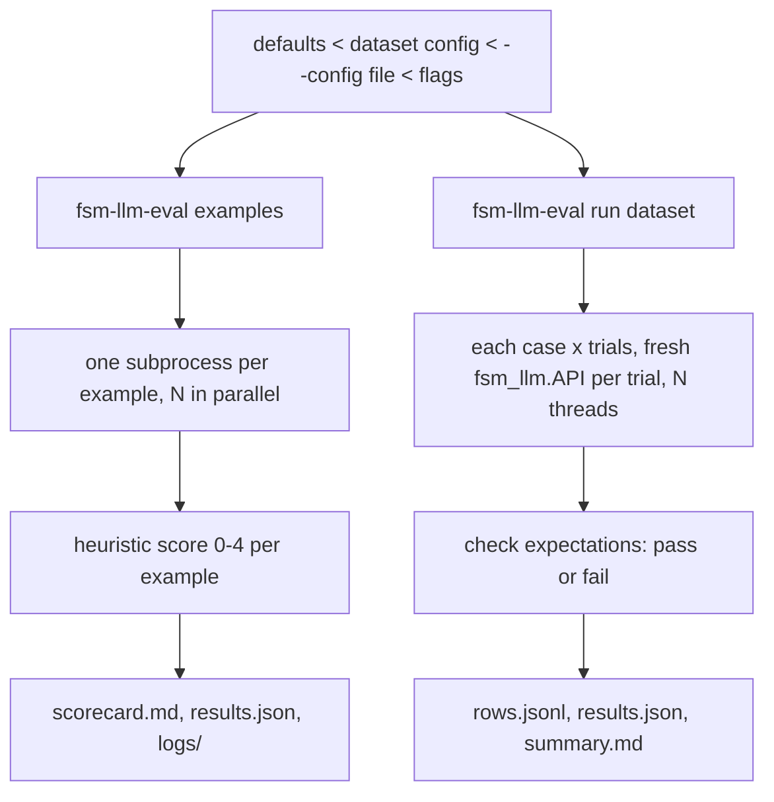

# fsm_llm.eval

Evaluation tools for FSM-LLM, living at `src/fsm_llm/eval` inside the core `fsm_llm` package. It runs the repository examples and scores them, and it runs scripted conversations against any FSM (finite state machine definition) and checks the results, reporting pass rates with confidence intervals.

## What it is for

LLM behaviour varies from run to run, so "it worked once" is not a measurement. This package gives two ways to measure:

- **Examples evaluation** (`fsm-llm-eval examples`): runs every `examples/<category>/<name>/run.py` (and `run_manual.py`) in its own process, feeds interactive ones a fixed script of user input, scores each 0 (crash) to 4 (pass) from its output, and writes a scorecard. This is the evaluation described in `EVALUATE.md` at the repository root; run it from the repository root or pass `--examples-dir`.
- **Conversation evaluation** (`fsm-llm-eval run`): you write a small dataset of conversations: which FSM, what the user says, and what should be true at the end (final state, states visited, extracted values, words in the replies, whether it ended). Each conversation runs several times (trials), and the report gives the pass rate per case with a 95% Wilson confidence interval (a range that likely holds the true pass rate, sound even for small trial counts).

## How it works



Every run writes into a new directory under `evaluation/`, named `<YYYY-MM-DD_HH-MM>_<git-short-hash>_<model>`, where the model part is the text after the last `/` with `:` turned into `-`. If that name already exists, `_2`, `_3`, ... is added; a run never overwrites another. An explicit `--output-dir` must be new or empty.

The examples score is a heuristic: it reads the example's exit code, timing and printed output (tracebacks, `Extraction rate: X/Y`, `[EXTRACTED]`/`[MISSING]`, `State: <name>` lines). The health score is the sum of scores divided by 4 times the number of examples.

## Files

- `__main__.py` - the `fsm-llm-eval` command and its two subcommands.
- `config.py` - `EvalConfig` (every setting with its default), loading JSON config files, merging settings layers, choosing the model.
- `examples.py` - finds, runs and reports example scripts.
- `scoring.py` - the 0-4 heuristic that reads an example's output.
- `cases.py` - conversation datasets, one trial of one case, whole runs and their reports.
- `records.py` - append-only JSONL rows, JSON output, run-directory names.
- `stats.py` - Wilson confidence interval, Fisher exact test, `pass_rate`, the exact `--fail-under` comparison.
- `_pool.py` - the thread pool both runners use, with Ctrl-C handling.
- `constants.py` - defaults, exit codes, score labels, and the per-example input and timeout tables.
- `exceptions.py` - error classes.
- `__init__.py`, `__version__.py` - public exports, version (the same as `fsm_llm`).

## How to use it

Examples:

```bash
fsm-llm-eval examples --list                      # what would run
fsm-llm-eval examples --model ollama_chat/qwen3.5:4b --workers 4
fsm-llm-eval examples --category agents --fail-under 80
fsm-llm-eval examples --filter react --timeout 60
```

A conversation dataset (`cases.json`), with the FSM path relative to the dataset file:

```json
{
  "config": {"trials": 3},
  "cases": [
    {
      "id": "reaches_farewell",
      "fsm": "bots/greeting.json",
      "turns": ["Hi!", "That's all, bye!"],
      "expect": {"final_state": "farewell", "ended": true}
    },
    {
      "id": "remembers_name",
      "fsm": "bots/greeting.json",
      "turns": ["My name is Ada"],
      "expect": {"context": {"name": "Ada"}, "responses_contain": ["Ada"]}
    }
  ]
}
```

```bash
fsm-llm-eval run cases.json --list        # case ids
fsm-llm-eval run cases.json --trials 5 --model gpt-4o-mini
fsm-llm-eval run cases.json --temperature 0 --max-tokens 512
python -m fsm_llm.eval run cases.json     # same command without the console script
```

A dataset can also be a plain JSON list of cases, or a `.jsonl` file with one case per line (no embedded `config` then).

LLM settings beyond model, temperature and max tokens go in `llm_kwargs` in a config file or the dataset's `config`; they are passed to `fsm_llm.API` (for example `{"llm_kwargs": {"api_base": "http://localhost:11434", "max_history_size": 10}}`). `results.json` records their keys, never their values.

From Python, one call does what `fsm-llm-eval run` does:

```python
from fsm_llm.eval import TrialResult, run_dataset

def polite(trial: TrialResult) -> list[str]:      # a custom check
    return [] if "thank" in trial.responses[-1].lower() else ["no thanks said"]

report = run_dataset("cases.json", trials=2, checks=[polite])
print(report.overall)   # {"k": ..., "n": ..., "rate": ..., "wilson_ci": [lo, hi]}
```

`run_dataset(path, *, config=None, llm_interface_factory=None, checks=(), progress=None, **overrides)` layers settings like the CLI: `config` (a JSON file path, a dict or an `EvalConfig`) sits where `--config` does and `overrides` where the flags do. A check gets each finished trial and returns one message per failure. Pass `llm_interface_factory=lambda: MyFakeLLM()` to test offline without a model. The building blocks (`load_cases`, `merge_config`, `open_run_dir`, `run_cases`) are public too.

## Things to know

- Settings come in layers, later ones winning: built-in defaults, the `config` object inside a dataset, a `--config FILE` (JSON), then flags. An unknown key or a bad value is an error (exit 1), not a silently ignored setting.
- The model is the first set of: `--model`, `model` in the `--config` file, `model` in the dataset's `config`, `$LLM_MODEL`, the framework default (`ollama_chat/qwen3.5:4b`). A dataset that sets `model` therefore beats an exported `LLM_MODEL`. Example scripts get the chosen model as `LLM_MODEL` in their environment.
- An `fsm` path in a case is relative to the dataset file; `output_root`, `output_dir` and `examples_dir` are relative to the current directory, wherever they are set.
- Exit codes: `0` finished (even with low scores), `1` usage or input error (including a file that is not UTF-8 or not JSON, a missing examples directory, and no example matching the filters), `2` only when `--fail-under PCT` is given and the score is below it, `130` interrupted. Use `--fail-under` in CI; the comparison is exact, so 57 of 100 passes `--fail-under 57`.
- Ctrl-C stops a run: work not yet started is cancelled, the report files are written for what finished (marked "Interrupted"), and the command exits 130.
- A trial passes only when every expectation it declares holds (and every custom check returns no failures). A case must declare at least one expectation, so an empty `expect` cannot pass by default.
- Once the conversation ends, remaining turns are not sent. That counts as a failure unless the case declares `ended`, so an FSM that ends too early cannot pass a `final_state` check.
- A trial that raises (model down, bad FSM) counts as a failed trial with the error recorded; the run continues.
- Conversation trials run in threads inside one process. A hung model call cannot be stopped early; it ends when litellm's own request timeout fires.
- Example timeouts: a per-example table value wins over the category value, which wins over `--timeout`. To change a tabled example's timeout, set `example_timeouts` (or `category_timeouts`) in a `--config` file.
- A timed-out example keeps its partial output and scores 1. An example whose interpreter cannot start scores 0.
- Import it as `from fsm_llm import eval as fsm_eval`, or import names directly (`from fsm_llm.eval import wilson_ci`), so the builtin `eval` is not shadowed. `import fsm_llm` alone does not load this package.
- A sample dataset is in `evaluation/datasets/simple_greeting_cases.json`. Its three `simple_greeting` cases check plumbing only (their transitions are unconditional, so any model passes); `name_is_extracted`, over `evaluation/datasets/name_capture_fsm.json`, passes only when the model extracts the user's name. Write your cases like the last one: make the pass depend on what the model does.
