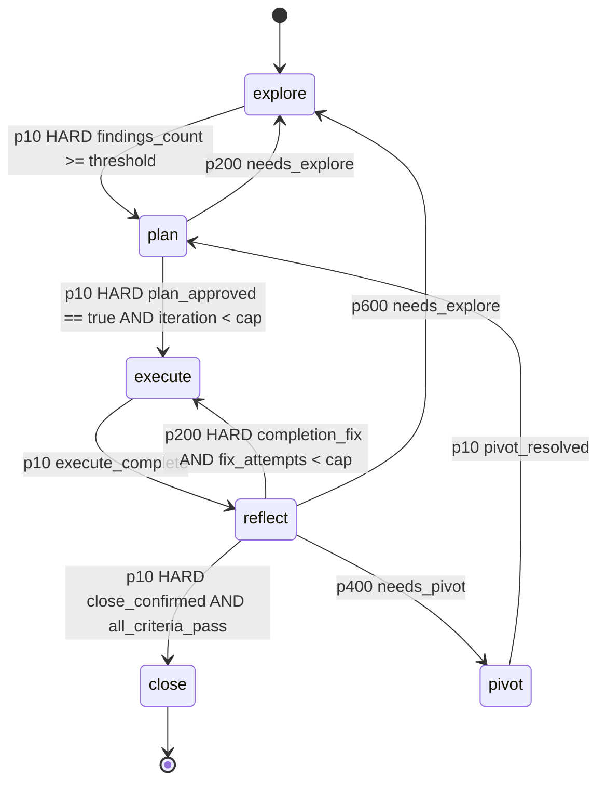

# fsm_llm.harness

Path: `src/fsm_llm/harness`
Purpose: The iterative-planner protocol as a real FSM-LLM FSM: 6 states (EXPLORE, PLAN, EXECUTE, REFLECT, PIVOT, CLOSE), 9 transitions, HARD gates as JsonLogic terms whose values are derived from the filesystem, Markdown artifacts on disk as memory, and an autonomy leash that stops a plan step after 2 failed fix attempts.

## Scope

Subpackage of the `fsm-llm` distribution. Contains the driver (`HarnessAgent`, a `fsm_llm.agents.base.BaseAgent`), the FSM factory, role specs and prompts, the default LLM worker factory, confined workspace and plan-directory tools, artifact models and (de)serializers, plan-directory storage, the pre-step gate and audit, small-model reply hardening, and the `fsm-llm-harness` CLI (`python -m fsm_llm.harness`, entry `fsm_llm.harness.__main__:run`). Extra `harness = ["fsm-llm[agents]"]`: no third-party deps of its own. Version is re-exported from `fsm_llm.__version__`.

Not here: bench tooling (`scripts/harness_bench.py`, committed blocks under `scripts/bench_data/`, `tests/test_harness_bench.py`), tests (`tests/test_fsm_llm_harness/`).

Core idea: a gate reads the FILESYSTEM, never the model's account of it. `findings_count` is the number of non-empty `findings/*.md` files; a role holding a write tool must show a tool call whose target now carries bytes, or its dispatch is recorded as failed.

## Architecture

- In core, among passing transitions the unique lowest `priority` wins (DETERMINISTIC); only a tie goes AMBIGUOUS to the LLM classifier. Every edge of a state has a distinct priority, so a gate decision never reaches the classifier. No self-loops: a BLOCKED turn already holds the state (D-012).
- One `TransitionCondition` per edge, each with `requires_context_keys`, so a missing key BLOCKS the edge. Operators used: `>=`, `<`, `==`, `and`, `var`.
- No state emits `extraction_instructions` and every state has `extraction_retries: 0`. A non-empty value would add one bulk-extraction LLM call per turn (D-041).
- Run loop: `BaseAgent` sends `"Continue."` each turn. Dispatch has three entry points sharing one ledger: a START_CONVERSATION handler (initial or resumed state), one `on_state_entry` handler per state, and `_on_loop_iteration` for a state the FSM is holding. Handlers registered: extraction guard (priority 5, PRE_PROCESSING and CONTEXT_UPDATE), start dispatch (10), per-state dispatch (100). `HandlerPriorities`/`HandlerNames` list only these handlers (a test pins it); the pre-step gate runs inside `_dispatch_if_needed` before an EXECUTE dispatch, not as a handler (D-003 of plan 0051e159).
- Dispatch key is `dispatch:<state>:<iteration>:<step_number>` in `dispatch_ledger`; entry markers `entry:<state>:<_transition_timestamp>` make duplicate handler fires no-ops. A retry is authorised only by removing the key (D-017).
- After each dispatch: role result recorded; worker gate keys read only from a successful result through `_WORKER_WRITABLE`; disk-derived counts read regardless of success (D-032); REFLECT routing flags made mutually exclusive; then `_post_dispatch` per state (leash, redispatch budgets, approvals, CLOSE audit).

## Key files

| File | Role | Notes |
| --- | --- | --- |
| `harness.py` | `HarnessAgent`, `RoleRequest`, `WorkerFactory`, `RevertDirective`, `RevertCallback`, `Presentation`, `derive_execute_target`, `_derive_prose_target`, `_plan_is_approvable`, `_WORKER_WRITABLE` | Handlers, ledger, leash, 4 redispatch budgets, stall detector, approvals, `state.md` sync, resume, plan rendering, presentation contracts |
| `fsm_definition.py` | `build_harness_fsm`, `DEFAULT_PERSONA` | Graph shape and gate logic only; prose comes from `rules.py` |
| `rules.py` | `ROLE_BY_STATE`, `OWNERSHIP` (16 artifacts), `artifacts_writable_by`, `EXPLORE_TOPICS`, `explore_topics`, `StateRules`, `RULES`, `get_rules` | Protocol content, at most 8 operative rules per state |
| `roles.py` | `RoleSpec`, `ROLE_SPECS`, `get_role_spec`, `held_tools`, `build_role_prompt`, `build_role_system_prompt`, `build_role_task_prompt`, `count_top_level_json_objects`, `build_default_worker_factory`, `AgentBuilder` | Output schemas derived from `_WORKER_WRITABLE` |
| `tools.py` | `Workspace`, `PlanMemory`, `build_workspace_tools`, `build_plan_tools`, `has_bytes`, `gate_files`, `count_gate_files`, `derive_disk_counts`, `DISK_DERIVED_COUNTS`, `COMMAND_ALLOWLIST`, `VERIFICATION_COMMANDS` | `Workspace.resolve` is the single confinement chokepoint |
| `storage.py` | `PlanDirectory`, `RunState`, `mint_plan_id`, `evict_lessons`, `check_system_cap`, `apply_sliding_window`, `CapReport`, `WindowReport`, `DRIVER_READ_MAX_BYTES` | Driver-side accessor; atomic writes |
| `_atomic.py` | `atomic_write_text` | Leaf module; breaks the `storage` -> `tools` import cycle |
| `artifacts.py` | Pydantic models + Markdown (de)serializers, `ARTIFACT_MODELS` (15 entries), `DECISION_ENTRY_SCHEMAS` (9), `PRESENTATION_CONTRACTS` (5) | Isomorphic with the source protocol, not byte-identical |
| `plan_validator.py` | `pre_step_gate`, `audit`, `CHECKS` (30 tags), `GateResult`, `Issue` | |
| `hardening.py` | `strip_model_noise`, `parse_json_payload`, `parse_role_output`, `RoleOutput`, `type_matches`, `as_int`, `coerce_worker_output`, `retry`, `RETRYABLE_EXCEPTIONS` | Exact-type, fail-closed |
| `constants.py` | `HarnessStates`, `Role`, `ContextKeys`, `DRIVER_OWNED_SEEDS` (16), `DRIVER_OWNED_UNSET` (5), `GateSlug`, `Severity`, `HandlerPriorities`, `HandlerNames`, `ArtifactNames`, `PlanSchema`, `Defaults` | |
| `exceptions.py` | `HarnessError` tree | |
| `__main__.py` | `main_cli`, `run`, `build_parser`, `resolve_model` | Exit codes 0/1/2 |
| `__init__.py` | 123 names in one literal `__all__` | `derive_execute_target` is exported by `harness.py` only |

## Public interface

- `HarnessAgent(*, worker_factory=None, approval_callback=None, revert_callback=None, config=None, findings_threshold=3, max_fix_attempts=2, max_leash_grants=2, iteration_hard_cap=6, max_explore_redispatches=9, max_plan_redispatches=3, max_reflect_redispatches=3, max_close_denials=3, max_stall_turns=3, **api_kwargs)`. `api_kwargs` go to `fsm_llm.API`. `HarnessAgent._default_config()` builds the `AgentConfig` from `Defaults`.
  - `run(task, initial_context=None) -> AgentResult`. Pass `ContextKeys.PLAN_DIR` and `ContextKeys.WORKSPACE_ROOT` in `initial_context`; only non-empty `str` values are adopted. A halt returns `success=False`, the reason as `answer`, and the slug in `final_context["last_gate_slug"]`.
  - Properties `api`, `conversation_id`, `presentations`, `reverts`, `audit_issues` (None until CLOSE ran). Method `on_leash_cap(context, *, step, attempts) -> RevertDirective | None`.
  - `worker_factory: Callable[[RoleRequest], AgentResult]`. `None` is a diagnostic mode: nothing is dispatched, no gate opens, expect a stall halt (D-045).
  - `approval_callback: Callable[[ApprovalRequest], bool]`, default `_deny_approval` (denies). Consulted with `tool_name` `harness.approve_plan`, `harness.confirm_close`, `harness.continue_after_leash`, and `harness.revert_uncommitted` (only when a `revert_callback` is set). A raising callback counts as denied.
  - `revert_callback: Callable[[RevertDirective], bool] | None`. `None` means the directive (`git checkout -- .`, `git clean -fd`, with the plan directory in `exclude` when it sits inside the workspace) is computed and reported, never executed (D-039).
- `RoleRequest` (frozen): `role, state, goal, operative_rules, gate_summary, iteration, step_number, total_steps, fix_attempts, context, plan_dir, workspace_root, assigned_topic, assigned_write_target, execute_target_reason`. `execute_target_reason` is one of `assigned`, `assigned-prose`, `no-plan-dir`, `no-plan-doc`, `no-target-token`; no prompt reads it.
- `build_default_worker_factory(workspace, *, model=Defaults.MODEL, temperature=0.3, max_tokens=2000, timeout_seconds=120.0, retry_attempts=3, native_function_calling=True, seed=None, agent_builder=None, observer=None, sleep=time.sleep) -> WorkerFactory`. Default agent is `NativeFunctionCallingReactAgent` (D-049); `False` uses `create_agent(pattern="react")`. EXPLORE sets `AgentConfig.force_final_tool = "write_plan_file"` (the only site). `observer` gets one dict per dispatch (`success`, `failure_reason`, `top_level_objects`, `write_evidence`, `write_evidence_workspace`, `write_evidence_plan`, `write_evidence_paths`, `write_required`, `claimed_findings_count`, `derived_findings_count`, ...). Returned `final_context` holds only the state's writable keys, exact-type filtered.
- `build_harness_fsm(goal, *, persona=None, findings_threshold=3, max_fix_attempts=2, iteration_hard_cap=6) -> dict` for `API.from_definition`.
- `pre_step_gate(plan_dir, *, expected_state="execute", max_fix_attempts=2, iteration_cap=6) -> GateResult(passed, slug, hard, detail)`, `.exit_code` 0 or 2. Slugs in `GateSlug.ORDER` (`no-plan`, `wrong-state`, `leash-cap`, `iteration-cap`), first failure wins. Reads only `state.md` with `Path.read_text`, writes nothing, never raises (D-024).
- `audit(plan_dir, *, workspace_root=None) -> list[Issue]`. Never raises for a finding; a check that raises becomes an ERROR tagged `state`. The decision-anchor scan runs only when `workspace_root` is given (max 500 hits).
- `PlanDirectory(plan_dir, *, role=Role.ORCHESTRATOR)`, `PlanDirectory.create(parent, *, role=..., now=None)`. Reads: `read_text` (whole file, up to `DRIVER_READ_MAX_BYTES` = 4,000,000), `read_artifact`, `exists`, `list_dir`, `load_run_state`. Writes (atomic): `write_text`, `append_text`, `write_artifact`, `save_run_state`. CLOSE policies: `enforce_lessons_cap`, `enforce_system_cap`, `apply_sliding_window`. `seed_protocol_skeleton` exists but is wired into no creation path (L7 bench measured it not validated). `.path` is the plan dir, `.root` its parent.
- `Workspace(root, *, allow_shell=False, allowed_commands=COMMAND_ALLOWLIST, command_timeout=30.0, max_read_bytes=64_000, max_output_bytes=8_000)`: `resolve`, `read_text`, `exists`, `list_dir`, `grep`, `write_text`, `append_text`, `delete` (files only), `run_command(argv)`.
- `PlanMemory(plan_dir, *, role)`: `locate`, `locate_path`, `artifact_for`, `authorise`, `read_text` (64 KB cap), `exists`, `list_dir`, `write_text`, `append_text` (atomic, ownership-checked).
- Agent tools (13): workspace `read_file`, `write_file`, `append_file`, `delete_file`, `list_dir`, `path_exists`, `grep_files`, `run_command`; plan `read_plan_file`, `write_plan_file`, `append_plan_file`, `list_plan_dir`, `plan_path_exists`.
- CLI: `fsm-llm-harness new GOAL [--plans-dir plans] [--create-only] [--model M] [--workspace .]`, `resume PLAN_DIR [--goal G] [--model M] [--workspace .]`, `status PLAN_DIR`, `validate PLAN_DIR [--workspace DIR]`, `close PLAN_DIR [--workspace DIR] [--apply]`, `--version`. Model: `--model` > `$LLM_MODEL` > `Defaults.MODEL` (blank values count as absent). `run()` turns on CLI logging at WARNING (`FSM_LLM_LOG_LEVEL` overrides); `main_cli` does not.

## Data shapes

| State | Role | Workspace tools | Owns (writes) | Loop budget | Worker-writable keys |
| --- | --- | --- | --- | --- | --- |
| explore | `explorer` | read-only | `findings/` | 14 | `findings_count` (replaced by disk count), `needs_explore` |
| plan | `plan-writer` | read-only | `plan.md`, `decisions.md`, `verification.md` | 10 | `needs_explore`, `total_steps` |
| execute | `executor` | read + write | `decisions.md`, `changelog.md`, `checkpoints/` | 14 | none |
| reflect | `verifier` | read + `run_command` | nothing | 12 | `all_criteria_pass`, `needs_pivot`, `completion_fix`, `needs_explore`, `criteria_pass_count`, `criteria_total` |
| pivot | `reviewer` | read-only | `findings/` | 10 | `pivot_resolved`, `pivot_reason` |
| close | `archivist` | read-only | `decisions.md`, `summary.md`, `FINDINGS.md`, `DECISIONS.md`, `LESSONS.md`, `LESSONS-archive.md`, `SYSTEM.md`, `INDEX.md` | 10 | `halt_reason` |

- Every role reply schema also carries `message: str`; EXECUTE carries `summary: str`; PLAN carries the 11 section slugs (`PlanSchema.SECTION_SLUGS`) as `str`. None of these are writable context keys.
- `OWNERSHIP` also gives `state.md`, `findings.md`, `progress.md` to `orchestrator` only, and lists `orchestrator` as co-writer of `plan.md`, `decisions.md`, `verification.md`, `changelog.md`.
- Per-plan artifacts: `state.md`, `plan.md`, `decisions.md`, `findings.md`, `findings/`, `progress.md`, `verification.md`, `changelog.md`, `summary.md`, `checkpoints/`. Cross-plan (parent dir): `FINDINGS.md`, `DECISIONS.md`, `LESSONS.md`, `LESSONS-archive.md`, `SYSTEM.md`, `INDEX.md`.
- Plan id: `plan-YYYY-MM-DDTHHMMSS-<hex8>` (`PLAN_ID_RE`), 32 bits of `secrets` entropy.
- Grammars: `plan.md` has the 11 `PlanSchema.SECTIONS` in order (`PlanDoc` rejects otherwise). `state.md` H1 `# Current State: <STATE>`, `## Iteration: N`, `## Current Plan Step: S of T`, fix-attempt bullets `Step N, attempt M` (counted by `StateDoc.fix_attempt_count`). `decisions.md` line 2 `*Plan: <plan-id>*`, headers `## D-NNN | PHASE | YYYY-MM-DD` numbered D-001 upward with no gaps, each with `**Trade-off**:` containing `at the cost of`. `verification.md` sections Criteria Verification, Additional Checks (rows `Regression`, `Scope drift`, `Diff review`), Not Verified, Verdict (5 `VERDICT_BULLETS`, recommendation in `CLOSE PIVOT EXPLORE EXECUTE`); evidence must be a count like `47/47`, an exit code, or `manual review - ...`. `changelog.md` lines have 8 ` | `-separated regex-checked fields (`parse_changelog_line`).
- Presentation contracts: `PC-EXPLORE`, `PC-PLAN`, `PC-EXECUTE-STEP`, `PC-EXECUTE-LEASH`, `PC-REFLECT`. The driver emits all five, filled from artifacts on disk. A blank field renders `(not on record)` and counts as missing.
- Halt slugs: the four gate slugs plus `explore-cap`, `plan-cap`, `reflect-cap`, `close-cap`. A stall halt carries no slug.
- Context keys: gate flags `findings_count`, `plan_approved`, `iteration`, `close_confirmed`, `all_criteria_pass`, `fix_attempts`, `needs_explore`, `needs_pivot`, `completion_fix`, `execute_complete`, `pivot_resolved`; counters `leash_grants`, `step_number`, `total_steps`, `criteria_pass_count`, `criteria_total`; driver state `current_role`, `current_role_result`, `role_results` (last 20), `dispatch_ledger` (last 64), `pivot_reason`, `last_gate_slug`, `halt_reason`; inputs `goal`, `plan_dir`, `workspace_root`.
- `Defaults`: `TEMPERATURE 0.3`, `MAX_TOKENS 2000`, `MAX_TURNS 60`, `TIMEOUT_SECONDS 1800.0`, `LLM_TIMEOUT_SECONDS 120.0`, retry 3 attempts (1.0 s base, 30.0 s max, x2.0), `FINDINGS_THRESHOLD 3`, `MAX_EXPLORE_REDISPATCHES 9` (measured horizon), `MAX_PLAN_REDISPATCHES 3`, `MAX_REFLECT_REDISPATCHES 3`, `MAX_CLOSE_DENIALS 3` (the last three are unmeasured placeholders), `MAX_FIX_ATTEMPTS 2`, `MAX_LEASH_GRANTS 2`, `ITERATION_HARD_CAP 6`, `ITERATION_WARN 5`, `LESSONS_LINE_CAP 200`, `SYSTEM_LINE_CAP 300`, `SLIDING_WINDOW_PLANS 4`, `ENV_LIVE_TESTS "FSM_LLM_HARNESS_LIVE"`.

## Invariants and constraints

- Driver-owned context: `DRIVER_OWNED_SEEDS` writes 16 keys falsy before turn 1; `DRIVER_OWNED_UNSET` keeps 5 absent until the driver sets them. Core mints a required extraction field for every key in a condition's `requires_context_keys` and skips fields already non-None, so an unseeded gate key would be invented by the LLM each turn. Three mechanisms keep them driver-owned: seeding, `_apply` coercing a `None` delta on a seeded key back to its seed, and `_reassert_driver_owned` at PRE_PROCESSING (the enforcing one) and CONTEXT_UPDATE (D-044). Clear gate flags with `False`, never `None`.
- `plan_approved` and `close_confirmed` are written only by the approval path, never by a worker.
- Every driver delta goes through `_apply`; a new delta site that bypasses it gets its writes reverted next turn.
- Leash: `fix_attempts` is derived by the driver from `AgentResult.success` (a raising worker spends an attempt, `worker_factory=None` does not, D-051). `fix_attempts` and `leash_grants` reset together only on PLAN -> EXECUTE, step advance, and PIVOT entry. A leash grant resets `fix_attempts` but not `leash_grants`, so executor dispatches per step are bounded by `max_fix_attempts * (1 + max_leash_grants)` = 6 for any approval sequence (D-052).
- `iteration` increments only on PLAN -> EXECUTE; a REFLECT -> EXECUTE completion fix is the same iteration (D-018).
- Pre-step gate: two channels must both pass, the on-disk `pre_step_gate` and the in-memory `fix_attempts` check; each slug has its own action (D-040). Only `leash-cap` emits `PC-EXECUTE-LEASH`, computes a revert, and routes on to REFLECT. `iteration-cap` ends the run. `no-plan` and `wrong-state` record a reason and write nothing.
- Budgets (`_explore_redispatches`, `_plan_redispatches`, `_reflect_redispatches`, `_close_denials`) are instance attributes reset only by `_run_once`, never context keys, so neither a worker nor the approval callback can refill them. Each halts on its own slug. Do not mint a generic stall slug.
- PLAN: `_render_plan_from_structured` writes `plan.md` from `structured_output` regardless of `result.success` and never invents filler; `_plan_has_content` then re-reads disk and `_plan_is_approvable` (valid `PlanDoc`, every section non-placeholder) decides. The same predicate is used by the live test approval stub; keep them one predicate.
- EXPLORE: the driver assigns one topic slug per dispatch from `explore_topics` (`problem-scope`, `affected-files`, `constraints-and-patterns`, then `open-question-N`), least-assigned first, skipping slugs already on disk. It never pre-creates files.
- EXECUTE target: `derive_execute_target` takes the first backticked path-shaped token per Files To Modify line (preferring one named in the step text); only if none, `_derive_prose_target` accepts un-backticked tokens that name an existing top-level workspace file. No match means no assignment line in the prompt.
- One derivation for disk counts: `derive_disk_counts` / `gate_files` feed the gate value, the write-tool result text, the coverage line and the redispatch condition.
- Confinement: resolve first, compare second, on path components (D-032). An absolute path already inside the root passes; otherwise only a leading sentinel is stripped (`workspace` or the root's basename for `Workspace`; `plan`, `workspace`, the plan id or the memory root's basename for `PlanMemory`), and a bare sentinel maps to the root. Everything else absolute, `..` escapes, symlink escapes, control characters and empty paths raise `HarnessConfinementError`. `PlanMemory`'s root is the plan directory's parent so the cross-plan tier is reachable; `OWNERSHIP` narrows writes.
- Tool caps: reads 64,000 bytes, command output 8,000 bytes, 200 list entries, 50 grep hits, grep skips files over 1,000,000 bytes and stops after 2,000 files. `run_command` uses `shell=False`, a bare allowlisted executable, cwd = root, a minimal env (`PATH`, `HOME`=root, `TMPDIR`, `LANG`, `LC_ALL`).
- A failed tool call is annotated, never re-routed: cross-root mistakes name the counterpart tool; a failed read of a missing protocol artifact says `write_plan_file` creates it; writes are never told to write.
- Plan-directory writes are atomic (`_atomic.atomic_write_text`: temp file in the target's own directory, fsync, `os.replace`). Workspace writes are plain on purpose (no temp files in the user's tree).
- LESSONS eviction: lowest `[I:N]` then oldest; `[I:5]` never evicted; refuses a section that is not pure bullets. SYSTEM is only checked and a write over 300 lines is refused, never trimmed. The sliding window keeps the 4 newest `## plan-...` sections of `FINDINGS.md`/`DECISIONS.md` and records trimmed ones inside one `<!-- COMPRESSED-SUMMARY -->` block.
- One run per instance (`threading.Lock`); a worker touching `run`, `api`, `conversation_id`, `presentations`, `reverts` or `audit_issues` raises `HarnessReentrancyError` (thread-local flag).
- Resume reads `state.md` (state, iteration, fix attempts, step cursor) and `plan.md` (step count). A CLOSED plan resumes counters but starts a fresh EXPLORE.
- Known gap: nothing writes `verification.md` after PLAN (the verifier owns no artifact and holds no plan write tool; no driver merge exists), so close-denial redispatches cannot repair an "absent or empty verification.md" denial (D-002).

## Dependencies

- `fsm_llm`: `API`, `HandlerTiming`, `definitions` (`FSMError`, `StateNotFoundError`, `LLMResponseError`), `utilities.extract_json_from_text` and `_match_brace_partners`, `constants.DEFAULT_LLM_MODEL`/`ENV_LLM_MODEL`, `logging.logger` and `setup_cli_logging`. Relies on core pipeline behaviour: extraction skips non-None fields, the transition evaluator fails a condition whose required key is absent.
- `fsm_llm.agents`: `BaseAgent`, `AgentConfig` (`output_schema`, `force_final_tool`), `AgentResult`, `AgentTrace`, `ToolCall`, `ToolResult`, `AgentError`, `HumanInTheLoop`, `ApprovalCallback`, `ToolRegistry`, `@tool`, `create_agent`, `NativeFunctionCallingReactAgent`.
- pydantic v2 (artifact and schema models); stdlib `subprocess`, `shutil`, `tempfile`, `secrets`, `threading`.

## Failure modes

- `HarnessError(FSMError)` -> `HarnessArtifactError(artifact, message, cause=None)`, `HarnessOwnershipError(artifact, role, owner)`, `HarnessReentrancyError(role)`, `HarnessConfinementError(path, root)`. Blocked gates and the leash are context values, not exceptions (D-059).
- Worker raises: recorded as a failed role result, the turn continues (except `HarnessReentrancyError`, re-raised to the caller). A non-`AgentResult` return is a failed dispatch.
- Garbled reply: `parse_role_output` returns `success=False` (`empty-reply`, `unparseable`, `missing-keys:...`); wrong-typed values are dropped by `coerce_worker_output`; the gate stays BLOCKED. `retry` retries only `LLMResponseError`, `TimeoutError`, `ConnectionError`.
- A role holding a write tool with no verified write gets `success=False`, reason `unverified-write`.
- No progress for `max_stall_turns` turns raises an internal halt with no slug; any recorded `halt_reason` is prepended. Budget exhaustion halts with its slug.
- `state.md` write failures are logged and swallowed; the pre-step gate then reports the disagreement.
- CLI exit codes: `0` pass; `1` negative or no answer (audit ERROR, failed run, missing goal, import failure, usage error via `_Parser.error`); `2` only for a gate slug in `GateSlug.ORDER`: `no-plan` from `resume`/`status`, a `status` whose gate fails, or a run whose `final_context` ends on one of the four. `status` calls the gate twice (defaults first to answer `no-plan`, then with `expected_state` from `state.md` so `wrong-state` cannot fire, D-043). `close` is dry-run without `--apply`, opens the directory as `archivist`, and refuses when `audit()` has ERRORs. `resume` without a usable `## Goal` and without `--goal` exits 1.

## Working here

- Constants in `constants.py`; protocol prose, ownership and topics in `rules.py`; `fsm_definition.py` owns only graph and gate logic; `__all__` stays one literal list.
- Read `# DECISION plan-<full-plan-id>/D-NNN` anchors before editing nearby code and do not undo what they forbid. Keep the full plan id including the `THHMMSS` segment; `audit` flags the short commit-tag form as `anchor-badprefix`.
- Evidence over testimony: if a value can be derived from disk, derive it; a worker claim is advisory.
- Changing a gate: edit `fsm_definition.py`, keep priorities distinct within a state, add the key to `DRIVER_OWNED_SEEDS` or `DRIVER_OWNED_UNSET`, and add it to at most one state's `_WORKER_WRITABLE` entry (role schemas derive from it).
- Changing `OWNERSHIP` changes live write scope: `roles._plan_scope`, the prompt write line and `PlanMemory.authorise` all read it.
- Tests: `pytest tests/test_fsm_llm_harness/          # 1,986 tests, 10 test files` (`test_roles_and_tools.py`, `test_harness_agent.py`, `test_artifacts.py`, `test_hardening.py`, `test_plan_validator.py`, `test_storage.py`, `test_cli.py`, `test_fsm_definition.py`, `test_live_ollama.py`, `test_extraction_cost.py`). `tests/test_packaging.py` checks that every "N tests" token in this file equals the measured harness count and every "N test files" token equals the file count; update both when tests change.
- Live tests are double-gated (`FSM_LLM_HARNESS_LIVE=1` first, then a reachable Ollama): `FSM_LLM_HARNESS_LIVE=1 pytest tests/test_fsm_llm_harness/test_live_ollama.py`.
- Status: experimental. Committed L6 end-to-end block `scripts/bench_data/l6-e2e/B8/GRADING.md` (`ollama_chat/qwen3.5:4b`, n=3): 2/3 runs reached EXECUTE with a verified write and an honest halt; the three runs halted on `close-cap`, `plan-cap` and `reflect-cap` (zero slugless stalls). The 3/3 floor is not met. Bench blocks are pre-registered and not re-run or edited once committed.
