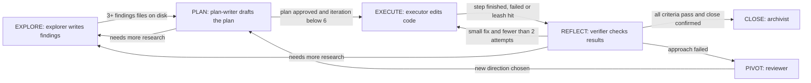

# fsm_llm.harness

`src/fsm_llm/harness` is a subpackage of FSM-LLM. It runs the "iterative planner" way of working (explore, plan, execute, reflect, pivot, close) as a real FSM-LLM state machine. The gates that decide when the run may move on read files on disk. They do not trust what the model says it did.

## What it is for

A small LLM left to work alone on a coding task often reports work it never did, such as "I wrote the findings" over an empty folder. This package puts the work inside a finite state machine (a fixed set of states with rules for moving between them). The important rules are gates that count files. The run cannot move from exploring to planning until at least three non-empty findings files exist. It cannot close until every success criterion passed and a human confirmed the close. It cannot keep retrying one failing step: after two failed attempts (the "autonomy leash") it stops and asks.

Everything the run knows is written to a plan directory as Markdown files (`state.md`, `plan.md`, `decisions.md`, `findings/`, and others). A run can be read, audited and resumed from that directory.

## How it works



- Each state has one worker role: explorer, plan-writer, executor, verifier, reviewer, archivist. The driver (`HarnessAgent`) sends one worker per state visit.
- Workers use two separate, fenced-in folders: the workspace (the code being changed) and the plan directory. A path that tries to escape (`../`, most absolute paths, a symlink pointing out) is refused before any file is touched. A role may write only the plan files it owns.
- The plan-writer does not write `plan.md` itself. It returns the 11 plan sections as structured JSON fields and the driver renders them into `plan.md`.
- A human approval callback is asked before a plan is accepted, before closing, and before continuing past the leash. The default callback says no, so an unattended run cannot approve itself.
- Every loop has a limit. When one is hit the run stops with a named reason (`explore-cap`, `plan-cap`, `reflect-cap`, `close-cap`, `leash-cap`, `iteration-cap`) instead of spinning.
- `validate` audits a plan directory against 30 named checks, such as the section order of `plan.md` and the header format of `decisions.md`.

## Files

- `harness.py` - `HarnessAgent`, the driver: dispatches workers, runs the gates, the leash and the retry budgets, writes `state.md`, resumes a run.
- `fsm_definition.py` - `build_harness_fsm()`: the 6-state, 9-transition FSM and its gate rules.
- `rules.py` - per-state protocol text, which role runs in which state, and who owns which file.
- `roles.py` - the six role specs, their prompts and reply schemas, and the stock worker factory.
- `tools.py` - the confined workspace and plan-directory tools that workers call.
- `storage.py` - `PlanDirectory`: plan id creation, driver reads, atomic writes, size limits for the cross-plan files.
- `_atomic.py` - the one atomic file-write helper.
- `artifacts.py` - data models and Markdown readers/writers for every plan file.
- `plan_validator.py` - the pre-step gate and the 30-check audit.
- `hardening.py` - cleaning up messy small-model replies and retrying network faults.
- `constants.py` - state names, roles, context keys, limits, defaults.
- `exceptions.py` - error classes.
- `__main__.py` - the `fsm-llm-harness` command.
- `__init__.py`, `__version__.py` - public exports and version.

## How to use it

```bash
pip install "fsm-llm[harness]"

fsm-llm-harness new "add a retry to the uploader" --workspace .    # create a plan dir and run
fsm-llm-harness new "add a retry to the uploader" --create-only    # create only, no LLM calls
fsm-llm-harness status   plans/plan-2026-07-22T101500-1a2b3c4d      # where is it, is the gate open
fsm-llm-harness resume   plans/plan-2026-07-22T101500-1a2b3c4d      # keep going
fsm-llm-harness validate plans/plan-2026-07-22T101500-1a2b3c4d --workspace src   # audit
fsm-llm-harness close    plans/plan-2026-07-22T101500-1a2b3c4d --apply           # apply closing size rules
```

The model is `--model`, else the `LLM_MODEL` environment variable, else the package default.

From Python:

```python
from fsm_llm.harness import ContextKeys, HarnessAgent, PlanDirectory
from fsm_llm.harness.roles import build_default_worker_factory
from fsm_llm.harness.tools import Workspace

workspace = Workspace(".")
plan_dir = PlanDirectory.create("plans")
agent = HarnessAgent(
    worker_factory=build_default_worker_factory(workspace, model="ollama_chat/qwen3.5:4b"),
    approval_callback=lambda request: input(f"{request.tool_name}? [y/N] ") == "y",
)
result = agent.run(
    "add a retry to the uploader",
    initial_context={
        ContextKeys.PLAN_DIR: str(plan_dir.path),
        ContextKeys.WORKSPACE_ROOT: str(workspace.root),
    },
)
print(result.success, result.answer)
```

## Things to know

- Exit codes: `0` success, `1` a negative answer or a failure (including a mistyped option), `2` only when a hard pre-step gate refused. Scripts can trust that `2` always means "a gate said stop".
- Running shell commands is off by default. When turned on, only `cat grep head ls tail wc` are allowed unless the caller also adds `git make mypy pytest ruff`. The driver itself never runs `git`.
- After the leash is spent, the run reports a revert suggestion (`git checkout -- .`, `git clean -fd`, sparing the plan directory). It runs it only if you pass a `revert_callback` and the approval callback agrees.
- `close` is a dry run unless you pass `--apply`, and it refuses to change anything when the audit has errors.
- Known gap: after PLAN nothing writes `verification.md` (the verifier has no write tool and the driver does not merge its reply), so an approval callback that checks that file keeps denying the close and the run halts on `close-cap`.
- This is experimental. In the committed end-to-end bench on `ollama_chat/qwen3.5:4b` (`scripts/bench_data/l6-e2e/B8/GRADING.md`), 2 of 3 runs reached EXECUTE, wrote a verified file and stopped with a named reason; the 3 of 3 bar is not met.
- Live model tests run only with `FSM_LLM_HARNESS_LIVE=1` and a reachable Ollama server.
