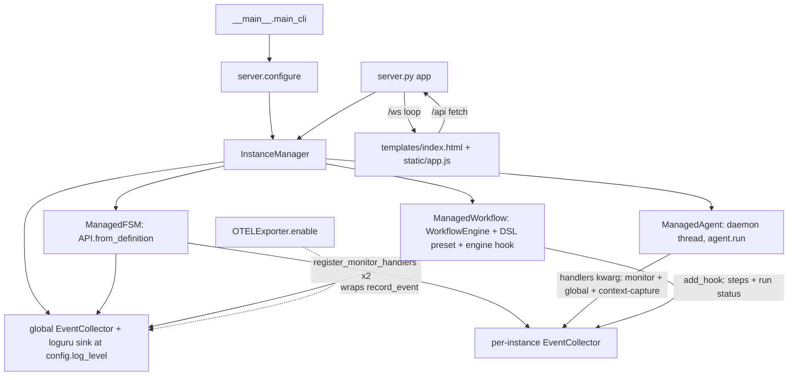

# fsm_llm.monitor

Path: `src/fsm_llm/monitor`
Purpose: FastAPI web dashboard (REST + WebSocket + vanilla-JS SPA) that launches, observes, and drives FSM-LLM FSMs, agents, and workflows; optional OpenTelemetry span export.

## Scope

Python backend (`server.py`, `instance_manager.py`, `collector.py`, `bridge.py`, `otel.py`, `definitions.py`, `constants.py`, `exceptions.py`, `__main__.py`), the browser app in `static/`, and the HTML shell `templates/index.html`. Subpackage of the `fsm-llm` distribution (version from `fsm_llm.__version__`); deps from extra `monitor` (fastapi >=0.100.0, uvicorn >=0.20.0, jinja2 >=3.1.0), OTEL from extra `otel`. Console script `fsm-llm-monitor = fsm_llm.monitor.__main__:main_cli`; package data `static/**/*` and `templates/*`. Not here: FSM runtime (`fsm_llm` core), agent implementations (`fsm_llm.agents`), workflow engine (`fsm_llm.workflows`).

## Architecture

Handler hooks are `_MonitorHandler(BaseHandler)` objects (observe-only, return `{}`, priority `MONITOR_HANDLER_PRIORITY` 9999; context capture 9998). `should_execute` stores the core's `current_state`/`target_state` in a `threading.local` and `execute` passes them to the collector callback, because the core never puts `_target_state` into the handler context (D-003). Registration is idempotent per (api, collector); `unregister_monitor_handlers` sets `active=False` (the core has no unregister). POST_TRANSITION (a no-op) is not registered.

Frontend (`static/`, no build step, ES modules): `app.js` boots (checks `/api/auth`, opens `/ws`, loads settings and instances), routes every click through one `document` listener on `data-action` to an `ACTIONS` table, and polls instances/activity every 10 s. `pages/` has one module per screen (dashboard, control, conversations, launch, visualizer, builder, logs, settings); `services/` holds `api.js` (fetch helper, sends `X-API-Key`, one prompt and retry on 401), `auth.js` (key in `sessionStorage['fsmMonitorApiKey']`), `state.js` (Proxy state), `ws.js` (socket, reconnect backoff 3 s to 30 s); `utils/` holds `dom.js` (`esc()`), `format.js`, `markdown.js`, `graph.js` (SVG layout). `flows.json` holds hand-written graphs of 12 agent patterns and 5 workflows; only the server reads it.

`templates/index.html` has no Jinja variables; `server.index` renders it as-is. It contains the six page divs (`page-dashboard`, `page-control`, `page-visualizer`, `page-logs`, `page-builder`, `page-settings`), the launch modal (FSM, Workflow, Agent tabs), the shortcuts overlay, the API key modal, the mobile nav, and loads `/static/style.css` and `<script type="module" src="/static/app.js">`.

## Key files

| File | Role | Notes |
| --- | --- | --- |
| `server.py` | FastAPI `app`, `configure`, `get_manager`, all routes, `/ws`, builder sessions, security middleware | Module globals: `_manager`, `_api_key`, `_CORS_ORIGINS`, `_TRUSTED_HOSTS`, `_flows`, `_builder_sessions`, `_builder_busy`, `_preset_cache` |
| `instance_manager.py` | `InstanceManager`, `ManagedFSM/Agent/Workflow`, `_MonitorHandler`, `register_monitor_handlers`, `unregister_monitor_handlers`, `snapshot_from_api`, `validate_preset_id`, `_find_examples_dir` | Optional imports set `_HAS_WORKFLOWS`, `_HAS_AGENTS` |
| `collector.py` | `EventCollector`, `redact_context` | `threading.Lock`, `deque(maxlen)` for events and logs |
| `bridge.py` | `MonitorBridge`, `_fsm_dict_to_snapshot` | Backward-compat wrapper |
| `otel.py` | `OTELExporter` | Own `TracerProvider`, never set as global |
| `definitions.py` | Pydantic models, `normalize_message_history`, `model_to_dict` | Request/config bounds live here |
| `constants.py` | Event names, defaults, bounds, theme colors, handler name/priority | Theme colors are Python-only; `static/style.css` has its own `:root` tokens |
| `__main__.py` | CLI `fsm-llm-monitor` | Calls `enable_library_logging()` (D-008), `configure(api_key, trusted_hosts)`, then `uvicorn.run(app, log_level="warning")` |
| `templates/index.html` | HTML shell | Element ids and `data-action` names are a contract with `static/app.js` and `static/pages/` |
| `static/` | Frontend | See Architecture |

## Public interface

Exports (`__init__.__all__`, one static list): `__version__`, `MonitorBridge`, `EventCollector`, `InstanceManager`, `app`, `configure`, `OTELExporter`, the models under Data shapes (not the builder requests), `model_to_dict`, constants (`THEME_NAME`, `COLOR_PRIMARY`, `DEFAULT_REFRESH_INTERVAL`, `DEFAULT_MAX_EVENTS`, `DEFAULT_MAX_LOG_LINES`, `DEFAULT_LOG_LEVEL`, all `EVENT_*`, `MONITOR_HANDLER_NAME`, `MONITOR_HANDLER_PRIORITY`), the five exceptions.

- `configure(bridge=None, manager=None, cors_origins=None, api_key=None, trusted_hosts=None)`: an empty or whitespace-only `api_key` raises `ValueError` before any global changes. Sets `_manager` (explicit manager > new `InstanceManager(config=bridge.config)` wrapping `bridge.api` via `connect_bridge` after `bridge.disconnect()` > fresh `InstanceManager()`), reloads `flows.json`, and calls `shutdown()` on the previous manager unless it is the one being installed (so `configure(manager=current, api_key=...)` rotates a key without killing the log feed). `_api_key` is re-derived every call: arg, else env `FSM_LLM_MONITOR_API_KEY`, else `None` (logs a WARNING when this clears a previous key); the module also reads the env var at import, so `uvicorn fsm_llm.monitor.server:app` without `configure()` honours it. `cors_origins` (env `FSM_LLM_MONITOR_CORS_ORIGINS`, default `http://localhost:8420`, `http://127.0.0.1:8420`) mutates middleware kwargs and only works before the first request (a WARNING otherwise). `trusted_hosts` (env `FSM_LLM_MONITOR_TRUSTED_HOSTS`, default `localhost`, `127.0.0.1`, `::1`, `testserver`; `["*"]` disables) takes effect immediately.
- CLI: `fsm-llm-monitor [--host 127.0.0.1] [--port 8420] [--api-key KEY] [--otel] [--no-browser] [--version] [--info]`; also `python -m fsm_llm.monitor`. A wildcard bind (`0.0.0.0`, `::`) sets `trusted_hosts=["*"]`; another non-loopback host is added to the localhost list; a non-loopback bind without a key prints a warning to stderr. The browser opens only once the port accepts connections (15 s probe). `--otel` enables an `OTELExporter(service_name="fsm-llm-monitor")` on the global collector. Missing deps print a hint and exit 1.
- `EventCollector(max_events=1000, max_log_lines=5000)`: `record_event`, `record_log`, `get_events(limit=0)` (newest first), `get_events_since(after_total, limit=50)`, `events_after(cursor, limit=50) -> (oldest-first events, next_cursor)`, `logs_after(cursor, limit=50)`, `get_logs(limit=0, level=None)` (min-level filter, case-insensitive, TRACE/SUCCESS ranked), `get_logs_since`, `total_logs`, `get_metrics() -> MetricSnapshot` (raises `MetricCollectionError`), `get_events_by_conversation`, `resize(max_events, max_log_lines)`, `clear()`, `cleanup()` (remove loguru sink; no `__del__`), `create_loguru_sink()`, `create_handler_callbacks() -> {TIMING_NAME: cb(context, current_state=None, target_state=None)}` (8 timings), `create_context_capture_callbacks(sink)` (6 timings, appends to `sink.conversation_log` under `sink._conv_lock`), static `snapshot_context(ctx, max_value_len=1500)`.
- `redact_context(data, drop_internal=True)`: the one dashboard redaction path: drops `is_forbidden_context_entry` entries at every depth, internal-prefix keys unless `drop_internal=False`, and turns non-JSON leaves into `<redacted:Type>` without calling `__str__` (D-002). On a pathological cycle it falls back to a top-level filter.
- `MonitorBridge(api=None, config=None)`: `connect(api)` (idempotent for the same API; raises `MonitorConnectionError` and stays disconnected on failure), `disconnect()`, `set_collector()`, properties `api`, `connected`, `collector`, `config`; `get_metrics()`, `get_active_conversations()`, `get_conversation_snapshot(id)`, `get_all_conversation_snapshots()`, `get_recent_events(limit=50)`, `load_fsm_from_file(path)`, `load_fsm_from_dict(data)` (None on error).
- `InstanceManager(config=None)` (raises `MonitorInitializationError` if the loguru sink fails):
  - FSM: `launch_fsm(preset_id=None, fsm_json=None, model, temperature=0.5, label="")`, `start_conversation(id, initial_context) -> (conv_id, response)` (reopens a completed instance), `send_message(id, conv_id, msg) -> {response, current_state, is_terminal}` (a terminal conversation is cached then ended), `end_conversation` (KeyError for an unknown conversation, no-op if already ended), `get_fsm_conversations`.
  - Workflow: `get_workflow_presets()`, `launch_workflow(preset_id, definition_json, initial_context, label)`, async `start_workflow_instance`, `advance_workflow`, `cancel_workflow`, `send_workflow_event(id, event_type, payload, wf_instance_id=None) -> list[str]`; `get_workflow_status` (KeyError for an unknown run), `get_workflow_instances`.
  - Agent: `launch_agent(agent_type, task, tools_config, model, max_iterations=10, timeout_seconds=120.0, label)` (raises `MonitorCapacityError` at `max_running_agents`), `cancel_agent -> bool` (False when finished or already cancelling), `get_agent_status`, `get_agent_result`.
  - Other: `destroy_instance` (KeyError unknown), `shutdown()`, `list_instances(type_filter)`, `get_instance`, `get_instance_collector`, `get_metrics`, `get_events`, `get_active_conversations`, `find_instance_for_conversation`, `get_conversation_snapshot`, `get_all_conversation_snapshots(include_ended=True)`, `get_all_activity_snapshots(include_ended=True)`, `get_capabilities() -> {fsm, workflows, agents}`, `connect_bridge(api)`, properties `config` (setter resizes the global buffers and re-registers the sink when `log_level` changes), `global_collector`, `dashboard_config`, `dashboard_config_version`.
- `OTELExporter(service_name="fsm-llm", exporter=None)` (raises `ImportError` without opentelemetry; default `ConsoleSpanExporter` in `BatchSpanProcessor`): `enable(collector)`, `disable()` (restores `record_event` only if its wrapper is still outermost), `shutdown()`, `is_enabled`, `active_conversations`, static `generate_trace_id()`, `generate_span_id()`. Span names are fixed (`conversation`, `transition`, `processing.<phase>`, `lifecycle.<event_type>`); ids are attributes. Spans without a conversation parent start from an empty context. Error text is the first line, max 200 chars; lifecycle spans carry ids only. At most 10,000 open conversation spans (oldest ended first).

## HTTP routes (server.py)

`[K]` = requires the API key when one is configured (`Authorization: Bearer <key>` or `X-API-Key`, `hmac.compare_digest` on UTF-8 surrogateescape bytes, 401 on mismatch). Every request passes the security middleware (D-001): Host must be in `_TRUSTED_HOSTS` (400), POST/PUT/PATCH/DELETE with an `Origin` must come from the monitor's own origin or `_CORS_ORIGINS` (403; `null` always refused), bodies over 1 MiB are refused (413), and responses carry CSP (`frame-ancestors 'none'`), `X-Frame-Options: DENY`, `nosniff`, `Referrer-Policy: no-referrer`. `/static/*` gets `Cache-Control: no-cache, no-store, must-revalidate`.

- Pages: `GET /` (index.html), `GET /health`, `GET /api/docs` (OpenAPI UI), `GET /api/auth` -> `{auth_required}` (never gated).
- Monitoring: `GET /api/metrics`, `/api/conversations?include_ended [K]`, `/api/conversations/{id} [K]` (404), `/api/activity?include_ended [K]`, `/api/events?limit=50 [K]`, `/api/logs?limit=100&level=INFO [K]`, `/api/info`, `/api/capabilities`. Conversation and activity routes run in a worker thread (they wait on the conversation's turn lock; D-005).
- Config: `GET /api/config`, `POST /api/config [K]` (422 outside the bounds); `GET /api/dashboard/config`, `POST [K]` (MonitorBuilder `to_dict()` output, bare or wrapped as `{"config": ...}`; 400 when malformed), `DELETE [K]`.
- Instances: `GET /api/instances?type`, `GET /api/instances/{id}`, `GET /api/instances/{id}/events?limit [K]` (404 unknown), `DELETE /api/instances/{id} [K]`.
- FSM: `POST /api/fsm/launch [K]`, `POST /api/fsm/{id}/start [K]`, `/converse [K]`, `/end [K]`, `GET /api/fsm/{id}/conversations [K]`; `POST /api/fsm/load`, `POST /api/fsm/visualize`, `GET /api/fsm/visualize/preset/{preset_id:path}`; `GET /api/presets` (60 s cache; scans `examples/{basic,intermediate,advanced,classification,reasoning}/*/*.json`), `GET /api/preset/fsm/{preset_id:path}`.
- Workflow: `GET /api/workflow/presets`, `POST /api/workflow/launch [K]` (starts one run, 120 s timeout; the instance is destroyed if the start fails), `POST /api/workflow/{id}/advance [K]`, `/cancel [K]`, `/event [K]` (empty `workflow_instance_id` = broadcast), `GET /api/workflow/{id}/status?workflow_instance_id [K]` (400 if missing), `GET /api/workflow/{id}/instances [K]`.
- Agent: `POST /api/agent/launch [K]`, `GET /api/agent/{id}/status [K]`, `GET /api/agent/{id}/result [K]`, `POST /api/agent/{id}/cancel [K]` -> `{status, cancelled}`; `GET /api/agent/visualize?agent_type=ReactAgent`, `GET /api/workflow/visualize?workflow_id=order_processing` (from `flows.json`, 404 unknown).
- Builder: `POST /api/builder/start [K]` (501 if `fsm_llm.agents.meta_builder` missing, 429 at 50 sessions), `POST /api/builder/send [K]` (404 unknown, 409 while a send is in flight, including one that timed out and still runs; session removed on completion), `GET /api/builder/result/{sid} [K]` (`{busy: true}` while a send runs), `DELETE /api/builder/{sid} [K]` (409 while busy). Sessions expire 1 h after last use (swept on start and every 60 `/ws` cycles).
- `WS /ws`: Host/Origin checked (close 4403); with a key the first client message must be `{"type": "auth", "api_key": "..."}` within 5 s (close 4401). A new client gets up to 50 past events and logs. Each `refresh_interval` sends `{type:"metrics", data, events?, logs?, log_count, instances, agent_updates?, workflow_updates?, dashboard_config?}`; events and logs stream from cursors (at most 50 per cycle, sent newest first, the rest next cycle; D-004); the manager is re-read each cycle. Serialized with `redacting_json_default` (D-008).

Error mapping (`_raise_http`, used by the FSM, workflow, and agent routes): `KeyError`/`FileNotFoundError` -> 404, `ConversationBusyError` -> 409, `MonitorCapacityError` -> 429, `NotImplementedError` (extension missing) -> 501, `TypeError`/`ValueError` -> 400, other -> 500 `"Internal server error"` (message logged, not returned). `asyncio.TimeoutError` -> 504. Monitoring routes map `MonitorError` to 500.

## Data shapes

- `MonitorEvent{event_type, timestamp (UTC), conversation_id, source_state, target_state, data, level="INFO", message}`; `LogRecord{timestamp, level, message, module, function, line, conversation_id}`.
- `MetricSnapshot{timestamp, active_conversations, total_events, total_errors, total_transitions, events_per_type, states_visited, active_agents, active_workflows, total_agent_iterations, total_tool_calls, total_workflow_steps}` (`total_workflow_steps` counts executed steps; `states_visited` includes each conversation's start state; `active_agents`/`active_workflows` are filled by `InstanceManager.get_metrics`).
- `ConversationSnapshot{conversation_id, instance_id, current_state, state_description, is_terminal, context_data, message_history[{role, content}], stack_depth, last_extraction, last_transition, last_response}` (context and `last_*` pass `redact_context`); `ActivityItem{item_id, item_type fsm_conversation|agent_task|workflow_instance, instance_id, label, status, current_step, detail, message_count, created_at, is_terminal}`.
- `FSMSnapshot{name, description, version, initial_state, persona, state_count, states[StateInfo{state_id, description, purpose, is_initial, is_terminal (no transitions), transition_count, transitions[TransitionInfo{target_state, description, priority=100, condition_count, has_logic}]}]}`.
- `MonitorConfig{refresh_interval=1.0 (0.5..60), max_events=1000 (10..100000), max_log_lines=5000 (10..100000), log_level="INFO" (TRACE, DEBUG, INFO, SUCCESS, WARNING, ERROR, CRITICAL; upper-cased), show_internal_keys=False, auto_scroll_logs=True, max_instances=200 (1..10000), max_running_agents=8 (1..256)}`; `InstanceInfo{instance_id, instance_type fsm|workflow|agent, label, status, created_at, source, conversation_count, active_workflows, agent_type, task (first 200 chars)}`.
- Requests: `LaunchFSMRequest{preset_id, fsm_json, model=DEFAULT_LLM_MODEL, temperature 0..2 =0.5, label}`, `StartConversationRequest{initial_context}`, `SendMessageRequest{message (max 10000), conversation_id}`, `EndConversationRequest{conversation_id}`, `StubToolConfig{name, description, stub_response}`, `LaunchAgentRequest{agent_type="ReactAgent", task (1..20000), model, max_iterations=10 (1..100), timeout_seconds=120 (0<..3600), tools (max 50), label}`, `LaunchWorkflowRequest{preset_id, definition_json, initial_context, label}`, `WorkflowAdvanceRequest{workflow_instance_id, user_input}`, `WorkflowCancelRequest{workflow_instance_id, reason}`, `WorkflowEventRequest{event_type (min 1), payload, workflow_instance_id=""}`, `BuilderStartRequest{artifact_type, model, temperature=0.7, max_tokens=2000}`, `BuilderSendRequest{session_id, message (max 10000)}`, `DashboardConfig{name, description, panels[DashboardPanel], alerts[DashboardAlert], refresh_interval_seconds=30, retention_hours=24}`.
- Event types: `conversation_start|end` (end `data.state` = final state), `state_transition`, `pre_processing`, `post_processing`, `context_update`, `error`, `log` (reserved, never emitted), `instance_launched|destroyed`, `workflow_started|advanced (one per executed step)|completed|failed|cancelled|event_delivered`, `agent_started|completed|failed|iteration|cancelled|tool_call`.
- Agent context-capture log entries: `{type: start|context|transition|end|error, state, data?, source?, target?, error?, timestamp}`.

## Invariants and constraints

- Internal-key hiding uses `fsm_llm.constants.has_internal_prefix`; secret hiding uses `is_forbidden_context_entry`; both only through `redact_context` (D-002). Never re-inline `k.startswith("_")` or call `str(value)` before redaction. `snapshot_from_api(show_internal_keys=False)` default is fail-closed; keep it (D-017). `show_internal_keys=True` shows internal keys but never secret-looking ones.
- `snapshot_context` also drops noise keys `task`, `should_terminate` and empty-looking values, truncating to 1500 chars.
- `InstanceManager` uses one `RLock`; LLM calls (`start_conversation`, `converse`) run outside it. The server wraps blocking calls in `asyncio.to_thread` with a 120 s `wait_for` (504), builder send 300 s. A timed-out worker thread keeps running (a started conversation may still appear).
- Instance ids are the first 12 chars of a uuid4. Ended conversation snapshots are cached in an `OrderedDict`, max 1000, oldest evicted. At most `max_instances` instances: a launch evicts the oldest finished ones and raises `MonitorCapacityError` when all are active.
- An FSM instance becomes `completed` when every started conversation has ended and returns to `running` when a new one starts. `destroy_instance` for an FSM unregisters the global collector's handlers and calls `api.close()`.
- Agents: launchable set `_AGENT_CLASSES` = ReactAgent, ReflexionAgent, PlanExecuteAgent, REWOOAgent, ADaPTAgent, DebateAgent, SelfConsistencyAgent. EvaluatorOptimizer and MakerChecker are deliberately excluded (constructor args a form cannot supply; D-001 of plan 0c00a594). The first five (`_TOOL_BASED_AGENTS`) require non-empty tools; tools are stubs returning `stub_response`. Status goes `running -> cancelling -> cancelled` or `completed|failed`; a run that finishes after a cancel keeps its result with status `cancelled`; `get_agent_status` reconciles a dead thread. Iteration and tool-call events are emitted after the run from `result.trace`.
- `destroy_instance` for agents sets the cancel flag and joins the thread for 1.5 s, logging a warning if still alive; there is no mid-run cancellation (D-007). For workflows it schedules `engine.shutdown()` on the loop that owns the engine.
- Workflows: only `_WORKFLOW_PRESETS` (`demo_linear`, `demo_branching`), built with the workflows DSL from auto/condition steps (no LLM); `definition_json` alone raises `ValueError`. Run bookkeeping (active runs, `completed|failed|cancelled` events, `ManagedWorkflow.status`, step events) comes from the engine hook, whatever ended the run (D-006).
- `validate_preset_id` rejects `..`, absolute paths, and anything resolving outside `examples/`. `_find_examples_dir` looks at `Path(__file__).resolve().parents[3] / "examples"`; None in a wheel install.
- `OTELExporter` must not register a global tracer provider. Callers must hold a reference to it while enabled.
- `__main__` enables library logging; a library object (manager, server import) must never flip global loguru state (D-008). Embedders running `uvicorn fsm_llm.monitor.server:app` call `setup_logging()` themselves.
- Core interaction: an attached monitor handler makes the core deep-copy the context at each handled timing, so a context value that cannot be deep-copied raises `TypeError` (core `handlers.py` D-025) only when the monitor is attached.
- Frontend: build HTML with `esc()` on every interpolated value; element ids and `data-action` names must match across `templates/index.html`, `static/app.js`, and `static/pages/`; the API key lives only in `sessionStorage` or memory, never in URLs. `flows.json` is hand-maintained.

## Dependencies

- `fsm_llm` core: `API`, `HandlerTiming`, `handlers.BaseHandler`, `definitions.ConversationBusyError`, `constants` (`DEFAULT_LLM_MODEL`, `has_internal_prefix`, `is_forbidden_context_entry`, `MAX_CONTEXT_FILTER_DEPTH`), `utilities` (`filter_context_tree`, `redact_non_json_leaf`, `redacting_json_default`), `logging.logger`, `logging.enable_library_logging`, `__version__`. Uses `api.fsm_manager.get_complete_conversation`, `api.get_stack_depth`, `api.list_active_conversations`, `api.close`.
- Optional `fsm_llm.agents`: agent classes, `AgentConfig`, `ToolRegistry.register_function`; `meta_builder.MetaBuilderAgent`/`MetaBuilderConfig` for the Builder page.
- Optional `fsm_llm.workflows`: `WorkflowEngine` (`register_workflow`, `add_hook`, `start_workflow`, `advance_workflow`, `cancel_workflow`, `process_event`, `shutdown`), `WorkflowEvent`, `WorkflowStep`, `WorkflowStepResult`, `create_workflow`, `auto_step`, `condition_step`.
- External: fastapi, starlette, uvicorn, jinja2, pydantic v2, loguru; optional opentelemetry-api/sdk. Browser: Google Fonts (Inter, JetBrains Mono).

## Failure modes

- See the error mapping above. Agent type not launchable or missing tools -> 400 from `/api/agent/launch`; extension missing -> 501.
- `snapshot_from_api` / `get_conversation_snapshot` return `None` on any exception (logged at DEBUG).
- Calling `configure()` again without `api_key` and without the env var disables auth (WARNING logged).
- `/ws` errors other than disconnect are logged at DEBUG and the socket is closed; the frontend reconnects with backoff, and a 4401 close forces the key prompt.
- The static UI mirrors server limits by hand: the launch dialog's Max Iterations `max` must equal `MAX_AGENT_ITERATIONS` and the Settings log-level options must equal `LOG_LEVELS` in order; `tests/test_fsm_llm_monitor/test_app.py::TestUiMatchesServerLimits` pins both and a `.log-<level>` CSS rule per level.

## Working here

- New REST route: add in `server.py`; gate mutating and sensitive-read routes with `dependencies=_GATED`; wrap blocking or LLM calls in `asyncio.to_thread` + `asyncio.wait_for`; map errors with `_raise_http`; keep `detail` in error bodies (the frontend shows it).
- Anything shown on the dashboard that comes from a context or trace: pass it through `redact_context`.
- New event type: add `EVENT_*` in `constants.py`, export it in `__init__.__all__`, emit via `_emit_global_event`, handle it in `collector.record_event` if it drives a counter and in `otel._route_event` if it should be a span.
- New launchable agent: add to `_AGENT_CLASSES` (and `_TOOL_BASED_AGENTS` if needed), mirror in `static/services/state.js` `TOOL_BASED_AGENTS` and the `launch-agent-type` `<select>` in `templates/index.html`; add its graph to `static/flows.json`.
- New live push field: add it in the `/ws` loop, a branch in `static/services/ws.js`, and a handler in `app.js` `registerHandlers({...})`. New page: a `
" class="page">` and nav buttons in `templates/index.html`, a module in `static/pages/`, and entries in `app.js` (`VALID_PAGES`, `PAGE_REFRESH`).
- Keep `__init__.__all__` a single static list. Read the `# DECISION` anchors (plan 3c9e41d2 D-001 to D-006, and others) before editing next to them and do not undo what they forbid.
- Tests: `pytest tests/test_fsm_llm_monitor/` (`test_app.py`, `test_audit_2026_09_28.py`, `test_bridge.py`, `test_collector.py`, `test_definitions.py`, `test_instance_manager.py`, `test_otel.py`, `test_server_security.py`). `tests/test_packaging.py` checks static files are covered by package data. No JS unit tests: verify frontend changes by running `fsm-llm-monitor` and watching the browser console. Lint and types: `make lint`, `make type-check`.
