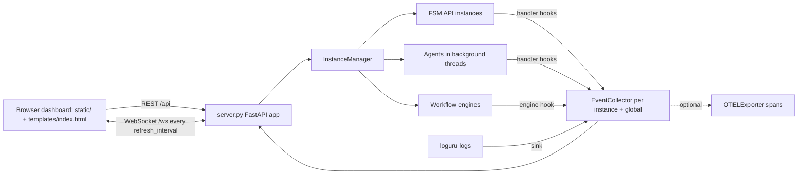

# fsm_llm.monitor

A web dashboard for FSM-LLM, in `src/fsm_llm/monitor`. It lets you launch, watch, and talk to FSM chatbots, agents, and workflows from a browser, and it can also export events to OpenTelemetry.

## What it is for

FSM-LLM is a Python framework that builds chatbots as finite state machines (FSMs: a fixed set of named states plus rules for moving between them), with a large language model (LLM) doing the talking and the data extraction. When such a bot runs, a lot happens out of sight: which state it is in, what data it pulled from each message, why it moved to another state, what went wrong. This package makes that visible. It runs a small web server with a single-page dashboard that shows live counters, events, logs, and conversation details, and lets you start new FSMs, agents, and demo workflows with a few clicks.

It is the `fsm_llm.monitor` subpackage of the `fsm-llm` distribution. The `monitor` extra installs its web dependencies (fastapi, uvicorn, jinja2); the `otel` extra adds OpenTelemetry.

## How it works



1. `fsm-llm-monitor` starts a FastAPI server (default `http://127.0.0.1:8420`) and opens your browser once the port is listening.
2. The server keeps one `InstanceManager`. It creates FSM instances (from example presets or pasted JSON), agents (run in background threads with stub tools), and two small demo workflows.
3. Every instance gets observer hooks. They record events (conversation start and end, state transitions, pre and post processing, context updates, errors, instance launch and destroy, workflow steps, agent start, iteration, tool call and result) into a per-instance `EventCollector` and a global one. Log output from the `fsm_llm` logger is captured too.
4. The browser page is one HTML file (`templates/index.html`) plus plain JavaScript modules in `static/`, with no build step. It calls REST endpoints for actions and details and keeps a WebSocket open. Every `refresh_interval` seconds (1 by default) the server pushes metrics, new events, new logs, the instance list, and progress for running agents and workflows.
5. Everything shown on the page that comes from a conversation context or an agent trace goes through one redaction function first, so secret-looking values never reach the browser.

## Files

- `__main__.py` - the `fsm-llm-monitor` command: `--host`, `--port`, `--api-key`, `--otel`, `--no-browser`, `--version`, `--info`; then runs uvicorn.
- `server.py` - FastAPI app: HTML page, REST API, WebSocket, security checks, optional API key, meta-builder chat sessions.
- `instance_manager.py` - creates, runs, queries, and destroys FSM, agent, and workflow instances; attaches the observer hooks; `attach_api` shows an `API` object you already have (its events and conversations; one at a time).
- `collector.py` - `EventCollector` (thread-safe bounded store of events and logs, metric counters, hook callbacks) and `redact_context`.
- `otel.py` - `OTELExporter`: mirrors collector events as OpenTelemetry spans.
- `definitions.py` - Pydantic models for events, logs, metrics, snapshots, config, and request bodies.
- `constants.py` - event type names, defaults and limits, hook name and priority.
- `exceptions.py` - `MonitorError` and its subclasses.
- `__init__.py`, `__version__.py` - public exports, version (shared with `fsm_llm`).
- `static/` - the browser app: `app.js` (boot, navigation, click routing), `style.css` (dark theme), `flows.json` (hand-drawn graphs of 12 agent patterns and 5 workflows for the Visualizer), and the `pages/`, `services/`, `utils/` module folders.
- `templates/index.html` - the single HTML page. It holds the markup for all six screens (Dashboard, Control Center, Visualizer, Logs, Builder, Settings), the launch dialog, the API key dialog, and the mobile nav, and loads `/static/style.css` and `/static/app.js`.

## How to use it

Run the dashboard:

```bash
pip install -e ".[monitor]"      # from a clone of the repository
fsm-llm-monitor                       # opens http://127.0.0.1:8420
fsm-llm-monitor --port 9000 --no-browser
python -m fsm_llm.monitor --info
```

The command exits with 0 after `--version` and `--info`, and with 1 if `fastapi`, `uvicorn` or `jinja2` is missing. Other flags: `--host` (default `127.0.0.1`), `--api-key` and `--otel` (below).

Screens: Dashboard (metrics, events, instances, activity), Control Center (instance table with a detail drawer and chat), Visualizer (FSM graphs from core `build_fsm_graph`; agent and workflow graphs from `flows.json`), Logs, Builder (design an FSM or agent by chatting with a meta-builder agent), Settings. Keys `1` to `6` switch screens, `?` shows the shortcuts.

Watch an `API` object from your own program:

```python
import uvicorn
from fsm_llm import API, setup_logging
from fsm_llm.monitor import InstanceManager, app, configure

setup_logging()  # library logging is off by default; the Logs page stays empty without this
api = API.from_file("examples/basic/simple_greeting/fsm.json", model="ollama_chat/qwen3.5:4b")
manager = InstanceManager()
manager.attach_api(api)
configure(manager=manager)   # call before the first request
uvicorn.run(app, host="127.0.0.1", port=8420)
```

`configure()` also takes `api_key=`, `cors_origins=` and `trusted_hosts=` (environment variables `FSM_LLM_MONITOR_API_KEY`, `FSM_LLM_MONITOR_CORS_ORIGINS`, `FSM_LLM_MONITOR_TRUSTED_HOSTS`). Call it with the same `api_key` every time: a later call without one clears a key set earlier (and logs a warning).

Export events to OpenTelemetry (needs the `otel` extra):

```python
from fsm_llm.monitor import EventCollector, OTELExporter

collector = EventCollector()
otel = OTELExporter(service_name="my-bot")   # prints spans to the console by default
otel.enable(collector)
```

`fsm-llm-monitor --otel` does the same for the dashboard's own collector.

Require an API key:

```bash
fsm-llm-monitor --api-key secret
# or: FSM_LLM_MONITOR_API_KEY=secret fsm-llm-monitor
# REST clients send:  Authorization: Bearer secret   or   X-API-Key: secret
```

## Things to know

- Importing `fsm_llm.monitor` needs `fastapi`, `uvicorn`, and `jinja2`. `OTELExporter` needs the `otel` extra only when you create one.
- With an API key set, every route that changes something and every route that shows conversation, event, log, agent, or workflow data needs the key. The WebSocket needs `{"type": "auth", "api_key": "..."}` as its first message within 5 seconds, or the server closes it with code 4401 (code 4403 for a refused Host or Origin). With no key set, no first message is needed. Health, `GET /api/auth`, metrics, config reads, instance lists and details, presets, and visualizations stay open.
- The server only answers requests whose Host header is `localhost`, `127.0.0.1`, or `::1` by default, refuses state-changing requests from other web origins, and caps request bodies at 1 MiB. Binding to another address with `--host` adds it to the Host list (a wildcard such as `0.0.0.0` turns the Host check off); doing so without an API key prints a warning.
- FSM presets are read from the repository's `examples/` folder (the `basic`, `intermediate`, `advanced`, `classification` and `reasoning` categories). In an installed wheel without that folder, the preset list is empty.
- Only seven agent types can be launched: ReAct, Reflexion, Plan-Execute, REWOO, ADaPT, Debate, and Self-Consistency. The first five need at least one tool. Tools are stubs that return a fixed text you type in. At most 8 agents run at once and 200 instances exist at once by default.
- Workflows are limited to two built-in demos (`demo_linear`, `demo_branching`). Pasted workflow JSON is rejected, and workflows made in the Builder cannot be launched.
- Cancelling an agent sets a flag, but an agent run cannot be interrupted mid-flight. Destroying it waits 1.5 seconds and then leaves the thread running.
- Secret-looking context values are always hidden. Internal keys (prefixes `_`, `system_`, `internal_`, `__`) are hidden unless `show_internal_keys` is turned on in Settings.
- The agent and workflow graphs in `static/flows.json` are drawn by hand and can drift from the real agent code.
- The page loads its fonts from Google Fonts; offline, the browser falls back to system fonts.
