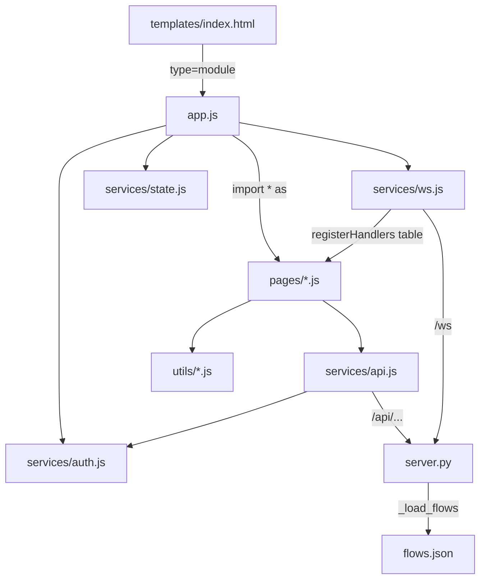

# static

Path: `src/fsm_llm/monitor/static`
Purpose: Framework-free browser frontend of the FSM-LLM Monitor dashboard (JS ES modules, one CSS file, pattern graph data).

## Scope

Everything served under `/static/` by `src/fsm_llm/monitor/server.py` (`STATIC_DIR = Path(__file__).parent / "static"`, `app.mount("/static", StaticFiles(directory=str(STATIC_DIR)))`). The monitor is the `fsm_llm.monitor` subpackage of the `fsm-llm` distribution (FastAPI dashboard, command `fsm-llm-monitor`). The HTML shell is `src/fsm_llm/monitor/templates/index.html` (served at `/`, not in this folder); it loads `/static/style.css` and `<script type="module" src="/static/app.js">`. No bundler, no npm, no transpile. Shipped in the wheel via `pyproject.toml` package-data `"fsm_llm.monitor" = ["static/**/*", "templates/*"]` (recursive, so `pages/`, `services/`, `utils/` ship too). REST routes and WebSocket broadcast live in `server.py`, not here.

## Architecture

Layering: `utils/` imports only `utils/` (`markdown.js` and `graph.js` import `esc` from `dom.js`); `services/` imports `utils/` (`ws.js` uses `hashInstances`, `$`; `auth.js` uses `openDialog`); `pages/` import `services/`, `utils/`, and a few sibling pages; `app.js` imports everything. Pages never import `app.js`. It injects functions with `setDeps(...)` (builder, control, conversations, launch) and `dashboard.setNavigateToInstance(control.navigateToInstance)`. Direct page-to-page imports: `control.js` takes `showConversationInDrawer` (conversations) and `refreshInstances` (dashboard); `builder.js` takes `addTypingIndicator`/`removeTypingIndicator` (conversations).

Control flow in `app.js`:

- Boot order: `checkAuthRequired()` (forced key modal when the server needs a key and none is stored), `onApiKeyChange` hook (on a saved key: `refreshInstances` plus `PAGE_REFRESH[currentPage]`), `connectWS()`, `settings.loadSettings()`, `dashboard.loadDashboardConfig()`, `dashboard.refreshInstances()`, `dashboard.refreshActivityTable()`, `visualizer.initVizDivider()`, 1 s clock (`#clock`, `#footer-clock`), `navigateFromHash()`.
- `showPage(page)`: toggles `.page.active` and the `active` class on sidebar and `.mobile-nav-btn` buttons, sets `state.currentPage`, `history.replaceState` to `#page`, closes the drawer when leaving `control`, then runs `PAGE_REFRESH[page]` (dashboard: `loadDashboardConfig` + `refreshActivityTable`; logs: `onShowLogs`; settings: `loadSettings`; control: `refreshControlCenter`). The visualizer re-renders the active agent or workflow tab.
- Click delegation: one `document` `click` listener finds `closest('[data-action]')`, stops propagation when that element sits inside another `[data-action]`, and calls `ACTIONS[action](el, event)`. No inline `onclick`. Unknown actions are ignored.
- `input` delegation by id: `inst-search`, `activity-search`, `ctrl-search`, `log-filter`. `change` delegation: `viz-preset-select`, `viz-agent-type`, `viz-wf-type`, `launch-agent-type`, `launch-fsm-source`.
- Keys: in inputs, Enter without Shift sends in `conv-message-input` and `builder-message-input`, refreshes logs in `log-filter`, saves in `apikey-input` and `set-api-key`. `Escape` closes only the API key modal when it is open, otherwise the shortcuts overlay, launch modal, and drawer. Enter or Space on a focused non-native `[data-action]` element dispatches a click. Outside inputs and with no key modal open: `1`..`6` switch pages (`pageKeys`), `?` toggles `#shortcuts-overlay`.
- Backdrop actions (`close-modal-backdrop`, `close-shortcuts-backdrop`, `close-apikey-backdrop`) act only when `e.target` is the overlay element itself; the listener is on `document`, so `e.currentTarget` never matches.
- Poll every 10 s: on dashboard or control `refreshInstances()` (plus `refreshControlCenter()` on control, `refreshActivityTable()` on dashboard); on logs `syncLogs()` (append-only, de-duplicated, respects pause).
- Live pushes: `services/ws.js` parses each message and calls handlers that `app.js` registered via `registerHandlers({...})`.

## Key files

| File | Role | Notes |
| --- | --- | --- |
| `app.js` | Boot, navigation, delegation, polling | `VALID_PAGES = dashboard, control, visualizer, logs, builder, settings`; exports nothing |
| `style.css` | Theme and components | Design tokens on `:root` (`--bg`, `--surface`, `--primary`, `--primary-dim`, `--success`, `--warning`, `--danger`, `--info`, `--text*`, `--space-*`, `--radius-*`, `--shadow-*`, `--font-body`, `--font-mono`); 2,728 lines |
| `flows.json` | Pattern graphs for the Visualizer | Hand-maintained; schema under Data shapes |
| `pages/` | 8 screen modules | `dashboard`, `control`, `conversations`, `launch`, `visualizer`, `builder`, `logs`, `settings` |
| `services/` | `api.js`, `auth.js`, `state.js`, `ws.js` | REST client, API key, Proxy state, WebSocket |
| `utils/` | `dom.js`, `format.js`, `markdown.js`, `graph.js` | `esc()`, formatting, safe Markdown subset, BFS SVG layout |

## Public interface

`app.js` is the entry point and exports nothing. What the child modules export:

`pages/` (one module per screen, HTML built as strings):
- `dashboard.js`: metric cards, event feed (max 50), instance grid (12/page), activity table (20/page), optional custom panels and alerts from `/api/dashboard/config`. Exports include `refreshInstances` (shared by several pages), `updateMetrics`, `updateEvents`, `renderInstanceGrid`, `refreshActivityTable`, `loadDashboardConfig`, `setNavigateToInstance`.
- `control.js`: unified instance table (25/page) and right-side drawer with per-type detail (FSM, workflow, agent), agent trace, workflow Send Event form, cancel and destroy. Exports include `refreshControlCenter`, `renderUnifiedTable`, `updateRunningAgents`, `refreshDetailPanel`, `openDrawer`, `closeDrawer`, `navigateToInstance`, `setDeps`. The drawer polls every 2000 ms through `state.detailPollTimer`; refreshes are token-guarded so only the latest paints.
- `conversations.js`: conversation detail and chat in the drawer, End conversation; `showConversationInDrawer`, `showConversationDetail`, `addTypingIndicator`, `removeTypingIndicator`, `setDeps`. `_detailRequestId` drops stale responses.
- `launch.js`: launch modal for FSMs (preset or pasted JSON), workflow presets, agents with stub tools (`TOOL_TEMPLATES`, 15 entries). Launch FSM also starts one conversation and opens it in the drawer after 500 ms.
- `visualizer.js`: FSM, agent, and workflow graphs through `utils/graph.js`, preset dropdown, resizable split pane (`initVizDivider`).
- `builder.js`: chat with the meta-builder (`/api/builder/start`, `/send`, DELETE), result summary, copy, download (`artifact.json`), launch. Workflow artifacts cannot be launched.
- `logs.js`: `appendLogs`, `syncLogs`, `onShowLogs`. Level pills, search highlight, pause buffer (cap 5000), DOM cap 1000, de-dup by `timestamp|level|module:line|message`, sidebar error badge.
- `settings.js`: `loadSettings`. Config form (`/api/config`, client bounds `refresh_interval` 0.5..60, `max_events` and `max_log_lines` 10..100000), API key field, system info (`/api/info`).

`services/`:
- `api.js`: `fetchJson(url, opts)`, `postJson(url, data)`, `formatErrorDetail(detail, fallback)`. Adds `X-API-Key` when a key is stored; on 401 prompts once and retries once; a non-OK response throws `Error(detail)` with `.status`.
- `auth.js`: `getApiKey`, `setApiKey`, `clearApiKey`, `onApiKeyChange`, `checkAuthRequired()` (GET `/api/auth`, returns `true|false|null`), `requestApiKey({force, message})` (one shared pending prompt), `submitApiKeyModal`, `cancelApiKeyModal`, `isApiKeyModalOpen`.
- `state.js`: `state` Proxy firing `statechange` on top-level `!==` assignment, `onChange(fn)`, `scheduleRefresh(key, fn, ms)` (run-once-after-delay guard), `cancelRefresh(...keys)`, `WS_MAX_DELAY = 30000`, `TOOL_BASED_AGENTS` (`ReactAgent`, `ReflexionAgent`, `PlanExecuteAgent`, `REWOOAgent`, `ADaPTAgent`).
- `ws.js`: `connectWS()` (same host `/ws`, `ws:` or `wss:` by page protocol), `registerHandlers(handlers)`. Handler names `app.js` registers: `updateMetrics`, `updateEvents`, `renderInstanceGrid`, `renderUnifiedTable`, `updateRunningAgents`, `appendLogs`, `refreshActivityTable`, `showConversationDetail`, `refreshDetailPanel`, `dashboardConfigChanged`.

`utils/`:
- `dom.js`: `esc`, `$`, `showError`, `showStatus`, `showToast`, `safeClass`, `levelClass`, `statusBadge`, `openDialog`/`closeDialog` (focus restore), `renderResultBanner`, `renderLLMData`, `highlightText`, `hashInstances` (hash over `instance_id:status`), `numVal`, `intVal`, `copyToClipboard`.
- `format.js`: `formatTime`, `relativeTime`, `formatNumber`.
- `markdown.js`: `renderMarkdown(text)`; escapes first, then a fixed regex sequence (code, headings as bold, bold, italic, lists, rules). No links or tables.
- `graph.js`: `renderGraph(svgId, {nodes, edges}, opts)`; BFS layers from the first `is_initial` node, rows of at most 5 columns, writes `x`/`y` onto the passed nodes.

Server endpoints the frontend relies on (defined in `server.py`): `GET /api/auth`, `/api/config`, `/api/info`, `/api/dashboard/config`, `/api/instances`, `/api/activity`, the `/api/fsm/...`, `/api/workflow/...`, `/api/agent/...`, `/api/builder/...` routes, `GET /api/agent/visualize?agent_type=` (default `ReactAgent`), `GET /api/workflow/visualize?workflow_id=` (default `order_processing`), and `WS /ws`. Error bodies carry `detail`.

## Data shapes

- DOM events: `state` dispatches `statechange` (`CustomEvent` with `{prop, value, old}`) on top-level assignment; `onChange(fn)` subscribes.
- API key storage: `sessionStorage['fsmMonitorApiKey']`, with an in-memory fallback when sessionStorage is unavailable.
- WebSocket auth frame (client to server, always the first frame, empty key when none is stored): `{"type": "auth", "api_key": "<key or empty>"}`.
- WebSocket push (server to client), fields read by `ws.js` `onmessage`:
  - `type === 'metrics'` -> `updateMetrics(data.data)`.
  - `events` -> `updateEvents(events)`.
  - `instances` -> hashed with `hashInstances`; on change stored in `state.instances`, then `renderInstanceGrid()` and, on the control page, `renderUnifiedTable()`.
  - `agent_updates` -> `state.agentUpdates`, `updateRunningAgents(...)`.
  - `workflow_updates` -> `state.workflowUpdates`; schedules `refreshActivityTable` (key `dash-activity-wf`, 3000 ms) on dashboard, or `refreshDetailPanel(id, 'workflow')` (key `ctrl-detail-wf`, 2000 ms) when a workflow is selected on control.
  - `logs` (non-empty) -> `appendLogs(logs)`.
  - `dashboard_config` -> `dashboardConfigChanged(...)`.
- Main page-level payloads: instance (`instance_id`, `instance_type` fsm|workflow|agent, `label`, `status`, `source`, `conversation_count`, `agent_type`, `task`, `active_workflows`, `created_at`); activity row (`item_type` fsm_conversation|agent_task|workflow_instance, `item_id`, `instance_id`, `label`, `current_step`, `detail`, `status`, `is_terminal`); config (`refresh_interval`, `max_events`, `max_log_lines`, `log_level`, `show_internal_keys`, `auto_scroll_logs`); log record (`timestamp`, `level`, `module`, `line`, `message`, `conversation_id`).
- `flows.json`: `{agents: {<AgentClass>: {description, nodes[], edges[]}}, workflows: {<id>: {name, description, nodes[], edges[]}}}`. Node `{id, label, description, is_initial, is_terminal}` (workflow nodes also carry `step_type`). Edge `{from, to, label}`.
  - Agents (12): `ReactAgent`, `ReflexionAgent`, `PlanExecuteAgent`, `DebateAgent`, `SelfConsistencyAgent`, `REWOOAgent`, `PromptChainAgent`, `EvaluatorOptimizerAgent`, `MakerCheckerAgent`, `OrchestratorAgent`, `ADaPTAgent`, `ReasoningReactAgent`.
  - Workflows (5): `order_processing`, `data_pipeline`, `approval_flow`, `parallel_processing`, `timer_wait`.
  - `server.py` `_load_flows()` reads it into `_flows` inside `configure()`, and again in `get_manager()` when `_flows` is empty (a missing file gives `{"agents": {}, "workflows": {}}`). Served by the two visualize routes; unknown names give 404 with `detail`. Also reachable raw at `/static/flows.json`.

## Invariants and constraints

- XSS: build HTML with `esc()` on every interpolated value; Markdown only through `renderMarkdown` (escapes first); server enum-like values in class attributes go through a whitelist (`levelClass`, `safeClass`, page-level sets). `showStatus` `color` and `renderGraph` `opts` are not escaped: pass constants only.
- Element ids and `data-action` names are a contract between `templates/index.html`, `app.js`, and `pages/`. Renaming one side silently breaks the feature (lookups are null-guarded).
- The server's `no_cache_static` middleware sets `Cache-Control: no-cache, no-store, must-revalidate` on `/static/` paths, so there is no cache-busting in file names.
- WebSocket endpoint is `/ws` on the same host; REST is `/api/...`. The auth frame must be the first frame the client sends. Only one live socket: `connectWS` detaches the old one's handlers first.
- The API key lives only in `sessionStorage` (or memory); never in URLs, `localStorage`, or logs.
- `state` fires events only on top-level assignment; nested mutation is silent.
- `closeDrawer` must clear `state.detailPollTimer`; `openDrawer` replaces any existing timer.
- `hashInstances` covers only `instance_id:status`, so a change to only `label` or `conversation_count` does not re-render the grid or table until a filter, search, or page change.
- `flows.json` is hand-maintained, not derived from `src/fsm_llm/agents` or `src/fsm_llm/workflows`; update it by hand when an agent's state graph changes.

## Dependencies

- Browser only: ES modules, `fetch`, `WebSocket`, `Proxy`, `EventTarget`, `CustomEvent`, `sessionStorage`, Clipboard API.
- External: Google Fonts (`Inter` 400/500/600/700, `JetBrains Mono` 400) via `@font-face` URLs in `style.css`, `font-display: swap`, system font fallbacks.
- Server side: `fastapi.staticfiles.StaticFiles`, the Jinja2 template, `flows.json` read by `server.py`. The server accepts the key as `X-API-Key` (or `Authorization: Bearer`) and gates mutating routes; `/api/auth` is never gated.

## Failure modes

- Server unreachable: WebSocket status shows "Reconnecting..." and retries indefinitely with backoff 3 s doubling to 30 s plus up to 1 s jitter; REST calls show toasts or inline errors and log to `console.error`.
- 401: one shared key prompt, one retry. After the user cancels, non-forced 401s do not reopen the prompt until a key is saved. WebSocket close 4401 stops reconnecting and forces the key prompt; saving a key resumes reconnecting.
- Unknown `data-action`: ignored silently. Invalid hash: `navigateFromHash` ignores hashes not in `VALID_PAGES`.
- Bad WebSocket message: parse error caught and logged; the socket stays up.
- `renderGraph` with an empty `nodes` array yields bad bounds; callers must not pass empty graphs.

## Working here

- New page: add `
" class="page">` and a sidebar button with `data-action="show-page" data-page="<name>"` in `templates/index.html`, a module in `pages/`, the import, `VALID_PAGES` entry, and `PAGE_REFRESH` hook in `app.js`, and a number key in `pageKeys` if wanted.
- New action: emit `data-action` (plus `data-*` args) in markup, add it to `ACTIONS` in `app.js`. Non-button clickable elements get `tabindex="0"` (and `role="button"` when they hold no nested buttons).
- New live push: add the field in the `server.py` broadcast, a branch in `services/ws.js` `onmessage`, and a handler in the `registerHandlers({...})` call in `app.js`.
- New REST call: add the route in `server.py` first; keep `detail` in error bodies so `fetchJson` can show it.
- New shared state: add the field with a default to `_target` in `services/state.js`. New debounced refresh: distinct `scheduleRefresh` key, cancelled where its selection is cleared.
- New launchable agent type: mirror it in `services/state.js` `TOOL_BASED_AGENTS` if it needs tools, and add its graph to `flows.json`.
- Styling: reuse `:root` tokens in `style.css`; do not hardcode colors in JS except the existing inline fallbacks.
- New files ship automatically (`static/**/*`); `tests/test_packaging.py` checks every static file is covered by package data. `tests/test_fsm_llm_monitor/test_app.py` lists served JS modules and checks that `style.css`, `app.js`, `flows.json` exist and are served; update it when renaming or removing files.
- No JS unit tests. Run `pytest tests/test_fsm_llm_monitor/`, then verify by running `fsm-llm-monitor` (http://127.0.0.1:8420) and watching the browser console.
