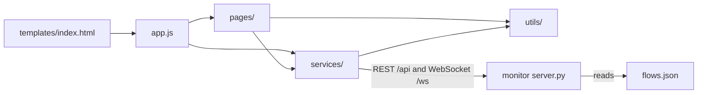

# static

The browser half of the FSM-LLM Monitor, in `src/fsm_llm/monitor/static`: all JavaScript, the stylesheet, and the graph data the dashboard shows. There is no build step; the monitor server hands these files to the browser as they are.

## What it is for

The FSM-LLM Monitor (`fsm-llm-monitor`) is a web dashboard for the FSM-LLM framework. FSM-LLM builds chatbots as finite state machines (FSMs: a set of named states and rules for moving between them) driven by a large language model. From the dashboard you can launch FSM conversations, agents, and workflows, chat with them, watch events and logs live, draw their state graphs, and design new ones with an AI builder. This folder is everything that runs in the browser to make that work. It is plain JavaScript using ES modules, with no framework and no npm.

## How it works



1. The server returns one HTML page (`src/fsm_llm/monitor/templates/index.html`). It loads `style.css` and `app.js` as a module.
2. `app.js` asks the server whether an API key is needed, opens the WebSocket, loads settings and instances, and wires the page modules together. Pages never import `app.js`; it passes them the functions they need (such as `showPage`) at start-up.
3. Every click on an element with a `data-action` attribute goes to one central handler in `app.js`, which calls the right page function. Typing in search boxes and changing dropdowns are routed the same way by element id.
4. Pages fetch data from the REST API and write HTML into the page. Live pushes (metrics, events, logs, instance changes) arrive over the WebSocket and are forwarded to page functions.
5. Every 10 seconds `app.js` refreshes instances and activity on the Dashboard and Control Center, and catches up the log stream on the Logs page.
6. `flows.json` is not loaded by the page code. The server reads it to answer "draw this agent or workflow pattern" requests.

## Files

- `app.js` - entry point: navigation by URL hash, click, input and change routing, keyboard shortcuts, boot sequence, 10-second polling.
- `style.css` - the whole dark theme: color, spacing, and font tokens, layout, responsive rules, and every component style.
- `flows.json` - hand-written graphs of 12 agent patterns and 5 workflow examples (`order_processing`, `data_pipeline`, `approval_flow`, `parallel_processing`, `timer_wait`) for the Visualizer.
- `pages/` - one module per screen: Dashboard, Control Center (with a side drawer), Conversations (inside the drawer), Launch modal, Visualizer, Builder, Logs, Settings. Each builds HTML strings and calls the REST API.
- `services/` - the REST helper (`api.js`), optional API key handling (`auth.js`), shared reactive state (`state.js`), and the WebSocket connection with automatic reconnect (`ws.js`).
- `utils/` - HTML escaping and UI feedback (`dom.js`), time and number formatting (`format.js`), a small safe Markdown renderer (`markdown.js`), and an SVG graph drawer (`graph.js`).

## How to use it

```bash
pip install "fsm-llm[monitor]"
fsm-llm-monitor
# open http://127.0.0.1:8420
```

Keyboard shortcuts (when not typing in a field): `1` Dashboard, `2` Control Center, `3` Visualizer, `4` Logs, `5` Builder, `6` Settings, `?` show shortcuts, `Esc` close the key prompt, or else the shortcuts overlay, launch modal, and drawer. The current page is kept in the URL hash, for example `#logs`.

## Things to know

- Fonts (Inter and JetBrains Mono) come from Google Fonts. Offline, the browser falls back to system fonts.
- The server sends no-cache headers for everything under `/static/`, so a normal reload picks up edits.
- All HTML is built as strings. Every value from the server or the user is escaped before it is inserted.
- If the server is started with an API key, the page asks for it once at start. The key is kept only in the browser tab's sessionStorage.
- If the server goes away, the WebSocket keeps retrying, waiting from 3 seconds up to 30 seconds between tries.
- The agent and workflow graphs in `flows.json` are drawn by hand. They are not generated from the real agent code, so they can drift from it.
- Workflows made in the Builder cannot be launched from the monitor; only the server's built-in workflow presets can.
- Agents that need tools (`ReactAgent`, `ReflexionAgent`, `PlanExecuteAgent`, `REWOOAgent`, `ADaPTAgent`) can only be launched with stub tools that return a fixed string you type.
- Element ids and `data-action` names are shared between `templates/index.html`, `app.js`, and `pages/`. Renaming one side breaks the feature silently.
- There are no JavaScript unit tests. Python tests only check that the files exist, ship in the package, and are served. Check changes by running `fsm-llm-monitor` and using the page.
