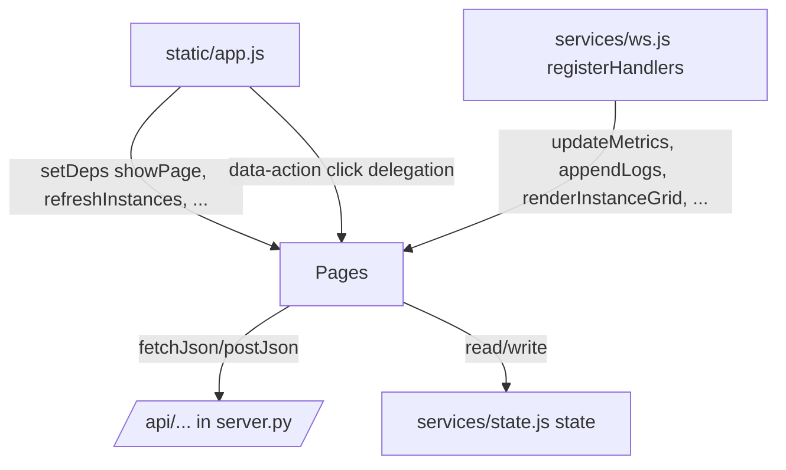

# pages

Path: `src/fsm_llm/monitor/static/pages`
Purpose: Page-level ES modules of the FSM-LLM Monitor frontend (vanilla JS, no build step); each renders one screen as HTML strings and calls the monitor REST API.

## Scope

Rendering and user actions for Dashboard, Control Center (with detail drawer), Conversations (drawer sub-view), Launch modal, Visualizer, Builder, Logs, Settings.

Not here: routing, click and keyboard delegation, dependency wiring, and the 10 s refresh timer (`src/fsm_llm/monitor/static/app.js`); HTTP, shared state, auth, WebSocket (`static/services/api.js`, `state.js`, `auth.js`, `ws.js`); escaping, formatting, markdown, graph drawing (`static/utils/dom.js`, `format.js`, `markdown.js`, `graph.js`); markup and element ids (`src/fsm_llm/monitor/templates/index.html`); styles (`static/style.css`); REST routes (`src/fsm_llm/monitor/server.py`).

## Architecture

- Circular imports between pages are avoided by forward references: `builder.js`, `control.js`, `conversations.js`, `launch.js` export `setDeps(deps)`; `dashboard.js` exports `setNavigateToInstance(fn)` (app.js passes `control.navigateToInstance`). Direct page-to-page imports that do exist: `control.js` imports `showConversationInDrawer` from `conversations.js` and `refreshInstances` from `dashboard.js`; `builder.js` imports `addTypingIndicator`/`removeTypingIndicator` from `conversations.js`.
- Page-local state lives in module-level `let` variables (pagination, filters, hashes, builder session). Cross-page state lives on `state` (`currentPage`, `instances`, `selectedDetailId`, `selectedDetailType`, `selectedConvId`, `selectedConvInstanceId`, `detailPollTimer`, `presets`, `workflowPresets`, `capabilities`, `stubToolCount`, `autoScrollLogs`, `_lastContextData`).
- Buttons in generated HTML use `data-action="..."`; `app.js` maps them to exported functions. Actions emitted here: `open-drawer`, `start-conv`, `cancel-agent`, `destroy-instance`, `ctrl-page-prev/next`, `go-to-conv`, `end-conversation`, `advance-workflow`, `cancel-workflow`, `send-workflow-event`, `expand-all-trace`, `collapse-all-trace`, `toggle-trace-step` (on the step header), `navigate-instance`, `inst-page-prev/next`, `activity-row-click`, `activity-page-prev/next`, `clear-dashboard-config`, `filter-presets`, `select-preset`, `remove-stub-tool`, `copy-context`.
- Clickable non-button elements carry `tabindex="0"`; `app.js` turns Enter/Space on a focused `[data-action]` element into a click. Instance cards, activity rows, preset cards, and trace step headers also get `role="button"`. Control-table rows and FSM conversation cards hold nested buttons, so they get `tabindex` and `aria-label` only.

## Key files

| File | Role | Notes |
| --- | --- | --- |
| `dashboard.js` | Metrics, event feed (max 50 entries), instance grid (12/page), activity table (20/page), custom panels and alerts | `refreshInstances` is shared with control, launch, builder, conversations |
| `control.js` | Unified table (25/page), drawer, per-type detail, agent trace, workflow Send Event form | Drawer polls every 2000 ms via `state.detailPollTimer`, skipped while the conversation sub-view is shown |
| `conversations.js` | Conversation detail and chat in the drawer, End conversation | `_detailRequestId` drops stale responses; `_sendingConvId` defers re-renders during a send |
| `launch.js` | Launch modal | `TOOL_TEMPLATES` (15 stub tools); default FSM temperature 0.5, agent `max_iterations` 10 |
| `visualizer.js` | Graph rendering for fsm/agent/workflow, preset dropdown, split pane | Uses `renderGraph` from `utils/graph.js` |
| `builder.js` | Meta-builder chat and launch | `AGENT_TYPE_MAP` lowercase -> class name (11 entries); `_sessionToken` drops replies from abandoned sessions |
| `logs.js` | Log stream | Pause buffer cap 5000, DOM cap 1000, de-dup key set cap 10000 |
| `settings.js` | Config form and API key field | Reset defaults 1.0 / 1000 / 5000 / INFO; client bounds in `LIMITS` |

## Public interface

Exports called by `app.js` or `ws.js`, grouped by file:

- `dashboard.js`: `loadDashboardConfig`, `clearDashboardConfig`, `updateMetrics(m)`, `updateEvents(events)`, `renderInstanceGrid`, `instPagePrev`, `instPageNext`, `onInstSearchInput`, `refreshInstances`, `toggleActivityEnded`, `onActivitySearchInput`, `activityPagePrev`, `activityPageNext`, `refreshActivityTable`, `navigateToInstance` (exported `let` binding), `setNavigateToInstance(fn)`.
- `control.js`: `setDeps({showPage})`, `filterControlInstances(filter, btn)`, `onCtrlSearchInput`, `refreshControlCenter`, `renderUnifiedTable`, `ctrlPagePrev`, `ctrlPageNext`, `openDrawer(id, type)`, `closeDrawer`, `navigateToInstance(id, type)` (shows control, opens drawer after 100 ms), `refreshDetailPanel(id, type)`, `advanceWorkflow(id, wfId)`, `cancelWorkflow(id, wfId)`, `sendWorkflowEvent(id)`, `toggleAllTraceSteps(expand)`, `toggleTraceStep(headerEl)`, `updateRunningAgents(updates)`, `startConversationOn(id)`, `destroyInstance(id)`, `cancelAgent(id)`.
- `conversations.js`: `setDeps({showPage, refreshActivityTable, refreshDetailPanel, openDrawer, refreshInstances})`, `showConversationInDrawer(instanceId, convId)` (calls `openDrawer(instanceId, 'fsm')` first when that FSM is not the drawer selection, so Back works after a launch), `drawerBack`, `showConversationDetail(convId)`, `endConversation(instanceId, convId)`, `copyContextData`, `sendChatMessage`, `addTypingIndicator(el)`, `removeTypingIndicator()`.
- `launch.js`: `setDeps({showPage, refreshInstances, showConversationInDrawer})`, `showLaunchModal`, `closeLaunchModal`, `toggleLaunchFSMSource`, `renderLaunchPresets(presets)`, `filterPresets(cat)`, `selectPreset(card)`, `doLaunchFSM(btn)`, `doLaunchWorkflow(btn)`, `populateToolTemplates`, `addToolFromTemplate`, `addStubTool`, `onAgentTypeChange`, `doLaunchAgent(btn)`.
- `visualizer.js`: `visualizeGraph(type, typeValue)` (returns `true` on success, `false` on failure with a toast, `null` when there was nothing to render), `visualizeFSM`, `switchVizDetail(tab, btn)`, `loadFSMPresets`, `useFSMPreset(id)`, `initVizDivider`.
- `builder.js`: `setDeps({showPage, refreshInstances})`, `builderJumpToLatest`, `onBuilderScroll`, `startBuilderSession`, `sendBuilderMessage`, `copyBuilderResult`, `downloadBuilderResult` (file `artifact.json`), `launchBuilderResult`, `resetBuilder`.
- `logs.js`: `toggleLogPill(btn)`, `onLogSearchInput`, `updateJumpButton`, `logJumpToLatest`, `onLogScroll`, `toggleLogPause`, `clearLogs`, `appendLogs(logs)`, `onShowLogs` (page-show hook; skipped while paused and the stream is non-empty), `syncLogs` (called by the 10 s timer in app.js; append-only catch-up), `refreshLogs` (full rebuild).
- `settings.js`: `loadSettings`, `saveSettings`, `resetSettings`, `saveApiKeySetting`, `clearApiKeySetting`.

## REST endpoints used

| Method + path | Caller |
| --- | --- |
| GET `/api/auth` (through `checkAuthRequired` in `services/auth.js`) | settings |
| GET `/api/instances`, DELETE `/api/instances/{id}`, GET `/api/instances/{id}/events?limit=100` | dashboard, control |
| GET `/api/activity` | dashboard |
| GET/DELETE `/api/dashboard/config` | dashboard |
| POST `/api/fsm/launch`, POST `/api/fsm/{id}/start`, POST `/api/fsm/{id}/converse` `{conversation_id, message}`, POST `/api/fsm/{id}/end` `{conversation_id}`, GET `/api/fsm/{id}/conversations` | launch, builder, control, conversations |
| GET `/api/conversations/{convId}` | conversations |
| GET `/api/workflow/presets`, POST `/api/workflow/launch` (presets only), GET `/api/workflow/{id}/instances`, POST `/api/workflow/{id}/advance` `{workflow_instance_id, user_input: ''}`, POST `/api/workflow/{id}/cancel` `{workflow_instance_id, reason}`, POST `/api/workflow/{id}/event` `{event_type, payload, workflow_instance_id ("" = broadcast)}` -> `{affected}` | launch, control |
| POST `/api/agent/launch`, GET `/api/agent/{id}/status`, GET `/api/agent/{id}/result`, POST `/api/agent/{id}/cancel` | launch, builder, control |
| GET `/api/capabilities` | launch |
| GET `/api/presets` | launch, visualizer |
| GET `/api/preset/fsm/{id}` | visualizer |
| POST `/api/fsm/visualize`, GET `/api/fsm/visualize/preset/{id}` (used when the value contains `/`), GET `/api/agent/visualize?agent_type=`, GET `/api/workflow/visualize?workflow_id=` | visualizer, builder |
| POST `/api/builder/start` `{model, temperature}`, POST `/api/builder/send` `{session_id, message}`, DELETE `/api/builder/{sessionId}` | builder |
| GET `/api/logs?limit=500&level=<min active level>`, GET/POST `/api/config`, GET `/api/info` | logs, settings |

## Data shapes

- Instance (`/api/instances`): `instance_id`, `instance_type` (`fsm|workflow|agent`), `label`, `status`, `source`, `conversation_count`, `agent_type`, `task` (optional, already truncated server side; the table shows its first 40 chars), `active_workflows`, `created_at`.
- Activity row (`/api/activity`): `item_type` (`fsm_conversation|agent_task|workflow_instance`), `item_id`, `instance_id`, `label`, `current_step`, `detail`, `status`, `is_terminal`.
- Conversation (`/api/conversations/{id}`): `conversation_id`, `instance_id`, `current_state`, `state_description`, `is_terminal`, `stack_depth`, `context_data`, `last_extraction`, `last_transition`, `last_response`, `message_history[{role, content}]`.
- Workflow instance (`/api/workflow/{id}/instances`): `workflow_instance_id`, `status`, `current_step`, `history[{step_id, message, data, error, timestamp}]`, `context`, `created_at`, `updated_at`, or an entry with `error` (skipped). Context is shown as sent: the server already drops internal-prefix and secret-looking keys, so there is no client-side key filter.
- Agent status: `status`, `agent_type`, `task` (a JSON string is reduced to its `description`, `task`, or `name`), `iteration_count`, `max_iterations`, `current_state`, `last_tool_call`, `conversation_log[]` (entry `type: start|transition|context|error|end`), `answer`, `error`, `tools_used[{tool_name, parameters}]`, `success`, `total_iterations`. Agent result: `trace_steps[]` with `state`, `tool_name`, `reasoning`, `tool_input`, `tool_result`.
- Builder reply: `session_id`, `response`, `internal_state` (`phase|current_state`, `turn_count`, `artifact_type`, `builder_progress{percentage, missing}`, `builder_summary`, `requirements|context`, `artifact_preview`), `is_complete`, `artifact`, `artifact_json`, `artifact_type` (`fsm|workflow|agent`), `is_valid`, `validation_errors`, `error`.
- Custom dashboard config (`/api/dashboard/config` returns `{active, config}`): `name`, `description`, `panels[{panel_id, title, metric, description}]`, `alerts[{alert_id, metric, condition (> < >= <= == !=), threshold, description}]`. Metric lookup order: top-level metrics field, then `events_per_type`, then `states_visited`.
- Config (`/api/config`): `refresh_interval`, `max_events`, `max_log_lines`, `log_level`, `show_internal_keys`, `auto_scroll_logs`.
- Log record: `timestamp`, `level`, `module`, `line`, `message`, `conversation_id`.

## Invariants and constraints

- Escape every interpolated value with `esc()`. User text in chat bubbles is escaped; assistant text goes through `renderMarkdown` (which escapes first). Server enum-like values used in class attributes go through a whitelist (`levelClass`, `_INSTANCE_TYPES`, `_TRACE_STATES`), and numbers placed in `style` are coerced and clamped (builder progress 0..100, agent progress 0..95).
- Drawer refreshes (`refreshDetailPanel`): each gets a token; only the latest token for the selected instance paints. A refresh requested while one is in flight for the same `type:id` key is queued. `openDrawer`/`closeDrawer` call `_resetDetailRequests`, which bumps the token and cancels the `ctrl-detail`, `ctrl-detail-wf`, `conv-detail` refresh timers. Content repaints only when the generated HTML changed; a repaint keeps trace-step expansion, form values and focus (Send Event form), drawer scroll, and inner `.chat-container` scroll (stuck to the bottom only if the user was at the bottom).
- `closeDrawer` must clear `state.detailPollTimer`; `openDrawer` replaces any existing timer.
- `updateRunningAgents` refetches only when the pushed update for the selected agent changed (JSON signature).
- Change detection: `renderUnifiedTable` and `renderInstanceGrid` skip re-render when `hashInstances` (over `instance_id:status` only) is unchanged. A change to only `conversation_count` or `label` does not re-render until a filter, search, or page change resets the hash.
- Drawer events use a length plus first/last timestamp hash to skip redraws.
- Agent event view (`_enrichAgentEvents`): transition to `think` -> `iteration`, to `act` -> `tool_call`, to `conclude` -> `conclude`, other state changes -> `transition`; `conversation_start` -> `agent_init`, `conversation_end` -> `agent_done`, `context_update` -> `context`, `error` kept; everything else (pre/post processing) is dropped.
- Workflow Advance/Cancel buttons show for status `running|pending|active`; the Send Event target defaults to the first instance in `running|pending|active|waiting`, else broadcast. Payload must be a JSON object.
- Logs: records are de-duplicated by `timestamp|level|module:line|message` across WS pushes, `syncLogs`, and `refreshLogs`. Pause buffers new records and resume renders only those. `clearLogs` keeps records marked as seen so sync does not bring them back. The sidebar badge counts ERROR/CRITICAL lines received (not the server's error metric) and shows `99+` above 99. `state.autoScrollLogs` (from Settings) gates auto-scroll.
- Conversations: while a chat send is in flight for a conversation, `showConversationDetail` for it is deferred and re-run once the send finishes.
- Builder: starting a session or resetting bumps `_sessionToken` and DELETEs the previous unfinished server session; a late start reply is dropped and its session DELETEd. Agent launch is two-click (first shows the stub-tool form, second submits with `timeout_seconds` default 120). Workflow artifacts are never launched (button disabled, `WORKFLOW_LAUNCH_NOTE` shown).
- `TOOL_BASED_AGENTS` (`ReactAgent`, `ReflexionAgent`, `PlanExecuteAgent`, `REWOOAgent`, `ADaPTAgent`, from `services/state.js`) require at least one tool in both launch paths.
- Launch FSM also starts one conversation (`initial_context: {}`) and, after 500 ms, opens it in the drawer.
- Settings validates `refresh_interval` 0.5..60 and `max_events`/`max_log_lines` integers 10..100000 before POST, marking bad fields `aria-invalid`. The API key is stored in sessionStorage only (via `services/auth.js`).
- Modals and the drawer open with `openDialog` (focus moves in) and close with `closeDialog` (focus restored).

## Dependencies

- `../services/api.js`: `fetchJson`, `postJson`.
- `../services/state.js`: `state`, `scheduleRefresh(key, fn, ms)`, `cancelRefresh(...keys)`, `TOOL_BASED_AGENTS`.
- `../services/auth.js`: `getApiKey`, `setApiKey`, `clearApiKey`, `checkAuthRequired` (settings only).
- `../utils/dom.js`: `$`, `esc`, `statusBadge`, `hashInstances`, `showToast`, `showError`, `showStatus`, `levelClass`, `highlightText`, `renderLLMData`, `renderResultBanner`, `copyToClipboard`, `openDialog`, `closeDialog`, `numVal`, `intVal`.
- `../utils/format.js` (`formatTime`, `relativeTime`, `formatNumber`), `../utils/markdown.js` (`renderMarkdown`), `../utils/graph.js` (`renderGraph`).
- Element ids from `src/fsm_llm/monitor/templates/index.html` (for example `ctrl-drawer`, `conv-detail`, `builder-chat`, `log-stream`, `viz-svg`). Renaming an id there breaks the page silently because most lookups are null-guarded.

## Failure modes

- REST failures surface as toasts (`showToast`) or inline `showError`/`showStatus`, and are logged to `console.error`. `fetchJson` formats server `detail` into the error message; on a 401 it prompts for the API key once and retries the request once.
- Missing DOM elements are mostly guarded and skipped; `_renderInternalState` in `builder.js` warns to hard-refresh when `builder-state-content` is missing.
- Conversation detail races are dropped via `_detailRequestId`. A failed load shows "Failed to load conversation" and hides the chat input.
- Builder completion with `error` and an empty artifact shows an ERROR badge and hides launch. A failed builder graph render shows the error in `#builder-result-graph-error` and keeps `#builder-result-svg` in the DOM.
- Agent trace fetch failures are swallowed; the detail falls back to what status returned.
- An instance missing from the cached list triggers one `refreshInstances`; if still missing, the drawer closes.

## Working here

- New page: create `<name>.js` here, export render and action functions, add markup in `templates/index.html`, register routing and `data-action` handlers in `static/app.js`, and add WebSocket handlers in the `registerHandlers({...})` call in `app.js` if it needs pushes.
- New action button: emit `data-action="<name>"` plus `data-*` args in the HTML and add the entry to the `ACTIONS` map in `app.js`.
- New REST call: add the route in `src/fsm_llm/monitor/server.py` first; keep `detail` in error bodies so `fetchJson` can show it.
- Keep every new interpolation behind `esc()`, and add new server-supplied class names to a whitelist.
- Tests: `tests/test_fsm_llm_monitor/` covers the Python server; there are no JS unit tests. Verify manually with `fsm-llm-monitor` (http://127.0.0.1:8420).
