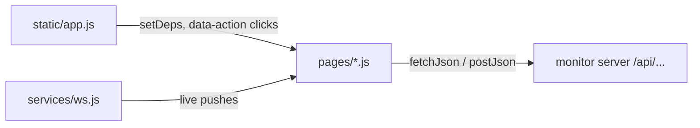

# pages

The screens of the FSM-LLM Monitor web dashboard, in `src/fsm_llm/monitor/static/pages`. Each JavaScript file renders one page (or modal) of the dashboard and handles the buttons on it.

## What it is for

The FSM-LLM Monitor is a browser dashboard for the FSM-LLM framework. FSM-LLM runs chatbots as finite state machines (FSMs: a fixed set of states with rules for moving between them) driven by a language model. From the dashboard you can launch FSM chatbots, agents, and workflows, chat with running conversations, watch events and logs as they happen, draw state diagrams, and build new definitions with an AI assistant. This folder holds the code for each of those screens. The pages build HTML strings, fetch data from the monitor server's REST API under `/api/...`, and react to live updates the server pushes over a WebSocket.

## How it works

`src/fsm_llm/monitor/static/app.js` imports every page module, wires them together, and routes clicks to them. Pages do not import `app.js`. Instead `app.js` hands each page the functions it needs (such as `showPage`) through a `setDeps(...)` call. Buttons in the generated HTML carry a `data-action="..."` attribute, and `app.js` maps each action name to a page function. Live data arrives through the WebSocket manager in `static/services/ws.js`, which calls page functions such as `updateMetrics` or `appendLogs`. `app.js` also runs a 10 second timer: on the Dashboard it refreshes instances and the activity table, on the Control Center it refreshes instances and the table, and on the Logs page it calls `syncLogs`.



| Page | What you do there |
| --- | --- |
| Dashboard | See counters, the event feed, a grid of running instances, and an activity table |
| Control Center | A filterable table of all instances; click one to open a side drawer with details, events, and actions |
| Conversations | Inside the drawer: read an FSM conversation's state, context, last LLM calls, and chat with it |
| Launch modal | Start an FSM (from a preset or pasted JSON), a workflow preset, or an agent with stub tools |
| Visualizer | Paste or pick an FSM definition and see it drawn as a graph |
| Builder | Chat with the meta-builder agent to create an FSM, workflow, or agent definition, then launch it |
| Logs | Live log stream with level filters, search, pause, and jump-to-latest |
| Settings | Monitor refresh rate, buffer sizes, log level, API key, and system info |

## Files

- `dashboard.js` - metric cards, event feed, instance grid, activity table, optional custom dashboard panels and alerts.
- `control.js` - instance table, detail drawer for FSM, workflow, and agent instances, agent trace view, workflow Send Event form, cancel and destroy actions.
- `conversations.js` - conversation detail view and chat box inside the drawer, End conversation; its typing indicator is reused by the builder.
- `launch.js` - launch modal for FSMs, workflows, and agents, including 15 ready-made stub tool templates.
- `visualizer.js` - FSM, agent, and workflow graph drawing, preset dropdown, resizable split pane.
- `builder.js` - chat session with the meta-builder, internal state panel, result summary, copy, download, and launch.
- `logs.js` - log stream with pause buffer, level pills, search highlight, sidebar error badge.
- `settings.js` - load, save, and reset monitor configuration; save or clear the API key.

## How to use it

Start the dashboard and open it in a browser:

```bash
fsm-llm-monitor
# then open http://127.0.0.1:8420
```

Every page is reachable from the sidebar. To launch something, open the Launch modal, pick an FSM preset, and press Launch FSM. The monitor starts one conversation and opens it in the Control Center drawer.

## Things to know

- Agents that act by calling tools (`ReactAgent`, `ReflexionAgent`, `PlanExecuteAgent`, `REWOOAgent`, `ADaPTAgent`) need at least one tool at launch. The monitor only offers stub tools that return a fixed string you type in.
- Workflows built in the Builder cannot be launched from the monitor. The server only launches its built-in workflow presets, so the Launch button is disabled and you copy or download the definition instead.
- The drawer re-fetches its content every 2 seconds while it is open on the Control Center, except while a conversation is shown in it.
- The Logs page only draws new entries while you are on it. On other pages it still updates the error badge and level counts, and it reloads the latest 500 entries from the server when you come back.
- While logs are paused, up to 5,000 new entries are buffered and older ones are dropped. The visible stream keeps at most 1,000 entries.
- Custom dashboard panels only appear when a dashboard config has been set on the server.
- The API key entered in Settings is kept in the browser tab's sessionStorage only.
- There are no JavaScript unit tests; check changes by running `fsm-llm-monitor` and using the page.
