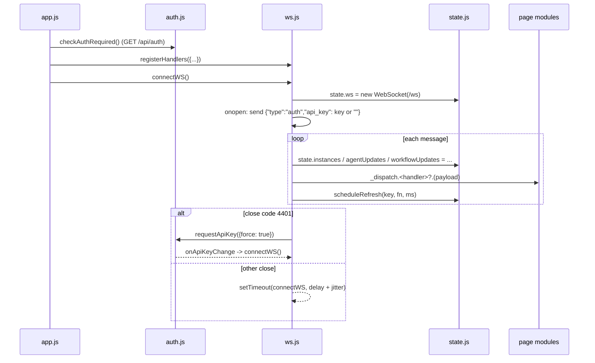

# services

Path: `src/fsm_llm/monitor/static/services`
Purpose: Frontend infrastructure for the FSM-LLM Monitor dashboard: REST client, API key handling, shared reactive state, WebSocket manager.

## Scope

Four browser ES modules: `api.js`, `auth.js`, `state.js`, `ws.js`. No build step, no framework, no npm. Served as static files by the `fsm_llm.monitor` FastAPI server (`server.py` mounts `static/` at `/static`; packaged via `pyproject.toml` `"fsm_llm.monitor" = ["static/**/*", "templates/*"]`). Page rendering lives in `static/pages/*.js`, DOM helpers in `static/utils/*.js`, wiring and boot in `static/app.js`. This folder renders nothing except the WebSocket status indicator (`#ws-status`, `#ws-dot`, `#conn-status`) and the API key modal (`#apikey-modal`, markup in `templates/index.html`).

## Architecture

## Key files

| File | Role | Notes |
| --- | --- | --- |
| `api.js` | fetch wrapper | Adds `X-API-Key`; on 401 prompts once and retries once; throws `Error(formatted detail)` with `.status` on non-OK |
| `auth.js` | API key storage and key-entry modal | `sessionStorage['fsmMonitorApiKey']`, in-memory fallback; never localStorage, URLs, or logs |
| `state.js` | Proxy-backed state + event bus | `EventTarget` bus, event name `statechange` |
| `ws.js` | WebSocket lifecycle + dispatch | Imports `hashInstances`, `$` from `../utils/dom.js` |

## Public interface

`api.js`
- `fetchJson(url: string, opts?: RequestInit, _retried = false): Promise<any>` - copies `opts`, sets `X-API-Key` from `getApiKey()` (deletes it when no key), on any method. On `!resp.ok` tries `resp.json()` and builds the message with `formatErrorDetail(body?.detail, resp.statusText || "HTTP <status>")`. On a 401 with `_retried` false it awaits `requestApiKey({message})` and, if a key was saved, retries once with `_retried = true`. Otherwise throws `Error(detail)` with `err.status = resp.status`. On success returns `resp.json()`.
- `postJson(url: string, data: any): Promise<any>` - `fetchJson` with `method: 'POST'`, `Content-Type: application/json`, `JSON.stringify(data)`.
- `formatErrorDetail(detail, fallback)` - `null`/`''` gives `fallback || 'Request failed'`; a string is returned as is; a FastAPI 422 list of `{loc, msg}` becomes `"a.b: msg; ..."` with `body`/`query`/`path` removed from `loc`; an object gives `msg`, `message`, or its JSON.

`auth.js`
- `getApiKey(): string|null` - reads `sessionStorage`, falls back to the module variable `_memKey` when storage throws.
- `setApiKey(key)` - trims; empty calls `clearApiKey()`; otherwise stores, resets the dismissed flag, notifies listeners.
- `clearApiKey()` - removes from storage and memory, notifies listeners.
- `onApiKeyChange(fn) -> unsubscribe` - listeners run on save and clear; a throwing listener is logged and skipped.
- `checkAuthRequired(): Promise<true|false|null>` - `fetch('/api/auth')` (the server never gates it), reads `auth_required`; `null` on network error or non-OK.
- `requestApiKey({force = false, message = ''} = {}): Promise<boolean>` - opens `#apikey-modal` via `openDialog(modal, 'flex', input)`, clears `#apikey-status` and `#apikey-input`, sets `#apikey-modal-msg`. Concurrent callers share one pending promise. After a cancel, non-forced calls resolve `false` without opening until a key is saved. Resolves `false` if `#apikey-modal` is missing.
- `submitApiKeyModal()` - empty input shows "Enter a key, or Cancel." in `#apikey-status`; otherwise `setApiKey` and resolve `true`.
- `cancelApiKeyModal()` - sets the dismissed flag and resolves `false` (or just closes the dialog if nothing is pending).
- `isApiKeyModalOpen(): boolean` - true while a prompt is pending.
- `app.js` wires these to `data-action` values `apikey-save`, `apikey-cancel`, `close-apikey-backdrop`, Enter in `#apikey-input`, and Escape.

`state.js`
- `state` - Proxy over `_target`. The `set` trap dispatches `CustomEvent('statechange', {detail: {prop, value, old}})` when `old !== value`.
- `onChange(fn: ({prop, value, old}) => void): () => void` - returns unsubscribe.
- `scheduleRefresh(key: string, fn: () => void, delayMs: number)` - no-op if `state.refreshTimers[key]` is set; clears the key before calling `fn`.
- `cancelRefresh(...keys)` - clears pending `scheduleRefresh` timers (`pages/control.js` cancels `ctrl-detail`, `ctrl-detail-wf`, `conv-detail`).
- `WS_MAX_DELAY = 30000`.
- `TOOL_BASED_AGENTS = ['ReactAgent', 'ReflexionAgent', 'PlanExecuteAgent', 'REWOOAgent', 'ADaPTAgent']` - agent types that need at least one tool, used by `pages/launch.js` and `pages/builder.js`.

`ws.js`
- `registerHandlers(handlers: object)` - shallow-merges into the dispatch table.
- `connectWS()` - clears any pending reconnect timer, detaches and closes the previous socket, opens `ws:` or `wss:` (matching `location.protocol`) `//<location.host>/ws`, and stores it in `state.ws`.

## Data shapes

Initial `state` fields: `ws` (`null`), `currentPage` (`'dashboard'`), `presets`, `wsRetryDelay` (3000), `capabilities` (`{fsm: true, workflows: false, agents: false}`), `instances` (`[]`), `selectedConvId`, `selectedConvInstanceId`, `selectedDetailId`, `selectedDetailType`, `detailPollTimer`, `agentUpdates` (`{}`), `workflowUpdates` (`{}`), `refreshTimers` (`{}`), `stubToolCount` (0), `autoScrollLogs` (`true`; `pages/settings.js` sets it from the server config's `auto_scroll_logs`), `_lastContextData`. Pages also add fields ad hoc (for example `state.workflowPresets` in `pages/launch.js`).

WebSocket auth message sent on open: `{"type": "auth", "api_key": "<stored key or empty string>"}`.

WebSocket message fields consumed (any subset may be present in one message):

| Field | Action |
| --- | --- |
| `type === 'metrics'` + `data` | `updateMetrics(data)` |
| `events` | `updateEvents(events)`; activity-type events schedule refreshes |
| `instances` | if `hashInstances` changed: set `state.instances`, `renderInstanceGrid()`, and `renderUnifiedTable()` on the control page |
| `agent_updates` | set `state.agentUpdates`, `updateRunningAgents(updates)` |
| `workflow_updates` | set `state.workflowUpdates`; dashboard: `refreshActivityTable` (key `dash-activity-wf`, 3 s); control with a workflow selected: `refreshDetailPanel(id, 'workflow')` (key `ctrl-detail-wf`, 2 s) |
| `logs` (non-empty) | `appendLogs(logs)` |
| `dashboard_config` | `dashboardConfigChanged(cfg)` |

Activity event types (`event_type`) that trigger refreshes: `conversation_start`, `conversation_end`, `state_transition`, `post_processing`, `agent_started`, `agent_completed`, `agent_failed`, `workflow_started`, `workflow_completed`, `workflow_cancelled`. On the dashboard they schedule `refreshActivityTable` (key `dash-activity`, 3 s). On the control page they schedule `showConversationDetail` (key `conv-detail`, 2 s) and `refreshDetailPanel` (key `ctrl-detail`, 2 s) when a selection exists.

Dispatch handler names: `updateMetrics`, `updateEvents`, `renderInstanceGrid`, `renderUnifiedTable`, `updateRunningAgents`, `refreshActivityTable`, `refreshDetailPanel`, `appendLogs`, `dashboardConfigChanged`, `showConversationDetail`. All are called with optional chaining, so a missing handler is silently skipped.

## Invariants and constraints

- Only one live socket: `connectWS` nulls `onopen/onmessage/onclose/onerror` on the previous `state.ws` before replacing it, and `onclose` ignores sockets that are no longer `state.ws`.
- Backoff: `setTimeout(connectWS, wsRetryDelay + Math.random() * 1000)`, then `wsRetryDelay = min(2x, WS_MAX_DELAY)`. `onopen` resets it to 3000. `onerror` calls `close()`, which triggers `onclose`.
- Close code 4401 (`WS_AUTH_FAILED`, matching the server's `_WS_CLOSE_UNAUTHORIZED`): no reconnect; status shows "API key required" and `requestApiKey({force: true})` opens the modal. A module-level `onApiKeyChange` listener reconnects once a key is saved.
- The auth message must be the first frame the client sends; the server expects it before anything else.
- Scheduled refresh callbacks read `state.selectedDetailId/Type` and `state.selectedConvId` when they fire, never values captured at schedule time.
- `onopen`/`onclose` update `#ws-status` text and class, `#conn-status` text, and toggle `connected` on `#ws-dot`, each guarded for a missing element.
- The API key never appears in URLs or logs; it is read from storage on each request.
- One pending key prompt at a time; all concurrent 401s await the same promise.
- Message parse errors are caught and logged to `console.error`; one bad message does not kill the socket.
- The Proxy only intercepts top-level assignment. Nested mutation does not emit events.

## Dependencies

- `../utils/dom.js`: `hashInstances(items)` (hash over `instance_id:status`), `$` (lookup by element id), `openDialog`/`closeDialog` (modal show/hide with focus restore).
- Server endpoints: `GET /api/auth`, the `/ws` WebSocket, and whatever REST paths callers pass to `fetchJson`/`postJson`. The server accepts the key as `X-API-Key` (or `Authorization: Bearer`) and gates mutating routes.
- Browser APIs only: `fetch`, `Headers`, `WebSocket`, `EventTarget`, `CustomEvent`, `Proxy`, `sessionStorage`.

## Failure modes

- Server error: `fetchJson` throws `Error(detail)` with `.status`; callers show a toast or inline error.
- 401 with the modal cancelled: the request throws with the server detail (`missing or invalid API key`); later non-forced 401s do not reopen the modal until a key is saved (Settings or a forced prompt).
- Non-JSON 2xx body: `resp.json()` rejects with a `SyntaxError`.
- `/api/auth` unreachable: `checkAuthRequired` returns `null`.
- Server down: the socket keeps reconnecting, at most about every 31 s, indefinitely.

## Working here

- New WebSocket payload field: add a branch in `ws.js` `onmessage`, call `_dispatch.<name>?.(...)`, and register the handler in the `registerHandlers({...})` call in `static/app.js`.
- New shared state: add the field with its default to `_target` in `state.js` so it is discoverable.
- New debounced refresh: use a distinct `scheduleRefresh` key, and cancel it with `cancelRefresh` wherever the selection it depends on is cleared.
- Keep the `detail` error convention: the Python server raises `HTTPException(detail=...)`.
- Do not persist the API key anywhere other than `sessionStorage` or log it.
- No automated JS tests exist for these files. Verify manually by running `fsm-llm-monitor` and watching the browser console.
