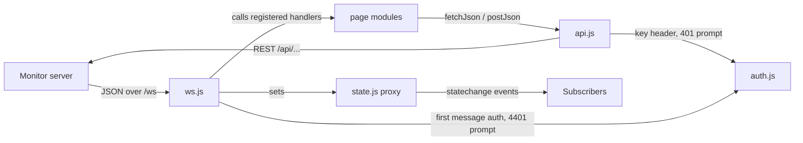

# services

Browser-side plumbing for the FSM-LLM Monitor web dashboard (`src/fsm_llm/monitor/static/services`): the HTTP client, the API key handling, the shared page state, and the WebSocket connection to the monitor server.

## What it is for

The FSM-LLM Monitor is a web dashboard served by the `fsm_llm.monitor` Python package (FastAPI) and started with the `fsm-llm-monitor` command. Its frontend is plain JavaScript ES modules with no framework and no build step. This folder holds the four modules every page relies on. They talk to the server (`fetch` for REST calls, one WebSocket for live pushes), keep one shared state object so pages do not each track their own copy, and handle the optional monitor API key.

## How it works



- `api.js` wraps `fetch`. It adds an `X-API-Key` header when a key is stored. A non-2xx response throws an `Error` whose message is the server's `detail` field made readable, or the HTTP status text. On a 401 it asks the user for a key once and retries the request once.
- `auth.js` stores the optional API key in the tab's `sessionStorage` and drives the key-entry modal (`#apikey-modal` in `templates/index.html`).
- `state.js` exports one object wrapped in a JavaScript `Proxy`. Every top-level assignment that changes a value fires a `statechange` event.
- `ws.js` opens a WebSocket to `/ws` on the same host and sends `{"type": "auth", "api_key": ...}` as the first message. Each incoming message is inspected field by field (metrics, events, instances, agent and workflow updates, logs, dashboard config) and forwarded to the page handler registered for it. If the socket closes it reconnects with exponential backoff, except when the server closes with code 4401 (auth failed).

## Files

- `api.js` - `fetchJson(url, opts)`, `postJson(url, data)`, `formatErrorDetail(detail, fallback)`.
- `auth.js` - API key get/set/clear, change listeners, the `GET /api/auth` check, and the key-entry modal.
- `state.js` - shared reactive `state`, `onChange(fn)`, `scheduleRefresh(key, fn, delayMs)`, `cancelRefresh(...keys)`, and the constants `WS_MAX_DELAY` and `TOOL_BASED_AGENTS`.
- `ws.js` - `connectWS()` and `registerHandlers(handlers)`.

## How to use it

From a module in `src/fsm_llm/monitor/static/` (as `app.js` does):

```js
import { fetchJson, postJson } from './services/api.js';
import { state, onChange } from './services/state.js';
import { connectWS, registerHandlers } from './services/ws.js';
import { checkAuthRequired, getApiKey, requestApiKey } from './services/auth.js';

checkAuthRequired().then(required => {
    if (required && !getApiKey()) requestApiKey({ force: true });
});
registerHandlers({ updateMetrics: (m) => console.log(m) });
connectWS();

const instances = await fetchJson('/api/instances');
await postJson('/api/fsm/launch', { preset_id: 'basic/simple_greeting/fsm.json' });

const stop = onChange(({ prop, value }) => console.log(prop, value));
```

## Things to know

- Reconnect delay starts at 3 s, doubles on every close, is capped at 30 s, and has up to 1 s of random jitter. It resets to 3 s on a successful open.
- A close with code 4401 stops reconnecting and opens the key modal. Saving a key reconnects.
- Before opening a new socket, `connectWS` detaches the old socket's handlers so a late `onclose` cannot start a second reconnect loop.
- The API key lives only in `sessionStorage` (an in-memory variable if storage is unavailable). It is never put in URLs, `localStorage`, or logs.
- If the user cancels the key modal, later 401s stop reopening it until a key is saved or a forced prompt is made.
- `state` only fires an event when the new value is not strictly equal (`!==`) to the old one. Mutating a nested object in place (for example `state.refreshTimers[key] = ...`) does not fire an event.
- `scheduleRefresh` is a "run once after a delay" guard: a second call with the same key is ignored until the first one has fired.
- There are no automated JavaScript tests for these files.
