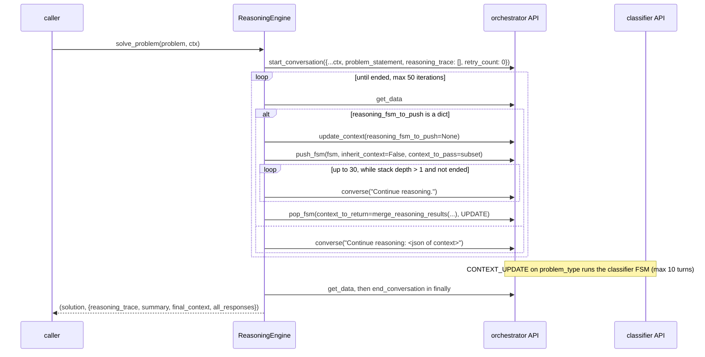

# fsm_llm.reasoning

Path: `src/fsm_llm/reasoning`
Purpose: Multi-strategy reasoning engine on top of core `fsm_llm`: an orchestrator FSM analyses a problem, a classifier FSM recommends a strategy, one of 9 strategy FSMs is pushed and driven, the solution is validated with up to 3 retries, and `solve_problem` returns `(solution, trace_info)`.

## Scope

Subpackage of the `fsm-llm` distribution (core package `src/fsm_llm`, which runs JSON-style FSM definitions through a 2-pass LLM pipeline: Pass 1 extracts data and evaluates transitions, Pass 2 writes the reply). Here: the `ReasoningEngine`, the 11 FSM definitions (as Python dicts in `reasoning_modes.py`, not JSON files), its handlers, Pydantic models, and the `python -m fsm_llm.reasoning` CLI. No third-party deps beyond core; the pyproject `reasoning` extra is empty. Version is `fsm_llm.__version__` (0.11.0), re-exported via `__version__.py`.

Not here: the FSM runtime (`API`, handlers, stacking) lives in core `fsm_llm`. Consumers: `fsm_llm.agents.reasoning_react` (`ReasoningReactAgent`, imported conditionally), `fsm_llm.has_reasoning`/`get_reasoning`, and `examples/reasoning/math_tutor`.

## Architecture

Orchestrator (`reasoning_orchestrator`) state flow: `problem_analysis -> strategy_selection -> execute_reasoning -> synthesize_solution -> validate_refine -> final_answer` (terminal). `problem_analysis` leaves only once `problem_type` and `problem_components` are present (condition with `requires_context_keys`). `validate_refine` has two transitions: priority 1 to `final_answer` when `validation_result == true` or `max_retries_reached == true`; priority 2 back to `execute_reasoning` when `validation_result == false` and `max_retries_reached != true`. Other transitions are unconditional.

Classifier (`problem_classifier`): `analyze_domain -> analyze_structure -> identify_reasoning_needs -> recommend_strategy` (terminal), producing `recommended_reasoning_type`, `strategy_justification`, `alternative_approaches`, `problem_domain`.

Strategy FSMs are linear chains ending in a terminal state, except `hybrid`, whose `critical_evaluation` state loops back to `identify_components` (priority 2) when `needs_refinement == true` and `hybrid_loop_count < 2`, else goes on (priority 1). State counts: `simple_calculator` 2, `analytical` 4, `deductive` 3, `inductive` 4, `creative` 4, `critical` 5, `abductive` 4, `analogical` 5, `hybrid` 7.

Handlers registered in `ReasoningEngine._register_handlers`:

| Name (`HandlerNames`) | Timing | Trigger | Action |
| --- | --- | --- | --- |
| `OrchestratorProblemClassifier` | CONTEXT_UPDATE | `problem_type` updated | `_classify_problem`: skips if `classified_problem_type` set; runs classifier FSM on `problem_statement`, `problem_type`, `problem_components`; returns `classified_problem_type`, `classification_justification`, `problem_domain`, `alternative_approaches` |
| `OrchestratorStrategyExecutor` | state entry | `execute_reasoning` | `_prepare_reasoning_execution`: sets `reasoning_fsm_to_push`, `reasoning_type_selected`, `classification_justification` |
| `OrchestratorSolutionValidator` | CONTEXT_UPDATE | `proposed_solution` updated | `ReasoningHandlers.validate_solution` |
| `ContextPruner` | PRE_TRANSITION | always | `ReasoningHandlers.prune_context` |
| `ReasoningTracer` | POST_TRANSITION | always; same handler object also registered on the classifier API | `ReasoningHandlers.update_reasoning_trace` |
| `RetryLimiter` | state entry | `validate_refine` | `_check_retry_limit`: `max_retries_reached = retry_count >= 3` |

Pushed strategy FSMs run through the same orchestrator `API` (same `FSMManager` and handler system), so the unfiltered `ContextPruner` and `ReasoningTracer` also fire on strategy-FSM transitions. Trace entries written in a strategy FSM's context are not merged back; only the keys from `merge_reasoning_results` return.

## Key files

| File | Role | Notes |
| --- | --- | --- |
| `engine.py` | `ReasoningEngine` | `_solve_lock` (`threading.Lock`) serializes `solve_problem` per instance |
| `reasoning_modes.py` | 11 FSM dicts + `ALL_REASONING_FSMS` | keys: `orchestrator`, `classifier`, and the 9 `ReasoningType` values |
| `handlers.py` | `ReasoningHandlers`, `ContextManager`, `OutputFormatter`, `_STOP_WORDS` | all static methods |
| `definitions.py` | Pydantic models on `TimestampedModel` | computed fields; `extra="ignore"`, `validate_assignment=True`, `use_enum_values=True` |
| `constants.py` | `ReasoningType`, `OrchestratorStates`, `ClassifierStates`, `ContextKeys`, `HandlerNames`, `Defaults`, `ErrorMessages`, `LogMessages` | state-name constants double as dict keys in `reasoning_modes.py` |
| `utilities.py` | `load_fsm_definition`, `map_reasoning_type`, `get_available_reasoning_types` | |
| `exceptions.py` | 3 exception classes | |
| `__main__.py` | CLI | `python -m fsm_llm.reasoning` (no console script) |
| `__init__.py`, `__version__.py` | exports, version | one static `__all__` |

## Public interface

`__all__`: `ReasoningEngine`, `ReasoningType`, `ReasoningStep`, `ReasoningTrace`, `ValidationResult`, `ReasoningClassificationResult`, `ProblemContext`, `SolutionResult`, `ReasoningEngineError`, `ReasoningExecutionError`, `ReasoningClassificationError`, `get_available_reasoning_types`, `__version__`.

- `ReasoningEngine(model: str = Defaults.MODEL, **kwargs)`. `Defaults.MODEL` is core `fsm_llm.constants.DEFAULT_LLM_MODEL`. Builds `self.orchestrator` and `self.classifier` with `API.from_definition(fsm, model=model, **kwargs)`. Loads every strategy FSM; a load failure logs and leaves that type missing. A failure to load `orchestrator`/`classifier` re-raises.
- `solve_problem(problem: str, initial_context: dict[str, Any] | None = None) -> tuple[str, dict[str, Any]]`. Copies `initial_context`, then sets `problem_statement`, `reasoning_trace = []`, `retry_count = 0` (these override caller values). Returned dict: `reasoning_trace` (`ReasoningTrace.model_dump()`), `summary` (`OutputFormatter.format_reasoning_summary`), `final_context`, `all_responses` (list of every reply string). Raises `ReasoningExecutionError` (with `details={"conversation_id", "responses_so_far"}`) for any exception inside the loop, after ending the conversation.
- `load_fsm_definition(fsm_name: str) -> dict` (deep copy; `KeyError` with `FSM definition not found: <name>` if unknown).
- `map_reasoning_type(type_str: str) -> str`: lowercases and strips, maps the 9 values plus aliases (`math`, `arithmetic`, `direct computation`, `logic`, `pattern`, `brainstorm`, `critique`, `mixed`, `explain`, `diagnose`, `analogy`, `compare`, ...). Unknown -> `analytical` with a WARNING.
- `get_available_reasoning_types() -> dict[str, str]`: value -> one-line description, 9 entries.
- CLI: `python -m fsm_llm.reasoning [PROBLEM] [--type/-t TYPE] [--context/-c JSON] [--model/-m MODEL] [--output/-o text|json|detailed] [--save/-s FILE] [--verbose/-v] [--quiet/-q] [--list-types] [--version]`. `--type` choices are the 9 values and set `preferred_reasoning_type`. `--context` must be a JSON object (else logs and `sys.exit(1)`). `--quiet` with `--verbose` is an error (exit 1). `--verbose` calls `fsm_llm.logging.setup_cli_logging("INFO")`. `--save` creates parent dirs; `.json` suffix or `--output json` writes JSON (`problem`, `solution`, `trace_info`, `timestamp`), otherwise text; suffixes other than `.json`, `.txt`, `.md` only warn. `--list-types` output goes through the logger (stderr). `main()` returns 0 on success, 1 on any error or Ctrl-C. `--output detailed` shows at most 10 trace steps.

## Data shapes

- `ReasoningType(str, Enum)`: `simple_calculator`, `analytical`, `deductive`, `inductive`, `abductive`, `analogical`, `creative`, `critical`, `hybrid`.
- Orchestrator states (`OrchestratorStates`): `problem_analysis`, `strategy_selection`, `execute_reasoning`, `synthesize_solution`, `validate_refine`, `final_answer`. Classifier states (`ClassifierStates`): `analyze_domain`, `analyze_structure`, `identify_reasoning_needs`, `recommend_strategy`.
- Context passed to a pushed strategy FSM: non-None `problem_statement`, `problem_components`, `constraints`, `problem_type` (no size cap is passed to `extract_relevant_context`).
- `merge_reasoning_results(orchestrator_context, sub_fsm_context, reasoning_type) -> dict` maps sub-FSM keys to orchestrator keys, drops None values, and always adds `<reasoning_type>_reasoning_completed: True`:

| Type | Sub-FSM key -> orchestrator key |
| --- | --- |
| `analytical` | `key_insights`, `integrated_analysis` (same names) |
| `deductive` | `conclusion` -> `deductive_conclusion`; `logical_validity` |
| `inductive` | `hypothesis` -> `inductive_hypothesis`; `generalization_strength` |
| `creative` | `best_creative_solution`, `innovation_rating` |
| `critical` | `critical_assessment`; `confidence_rating` -> `assessment_confidence` |
| `simple_calculator` | `calculation_result` -> `calculation_result` and `proposed_solution`; `calculation_error` -> `calculation_error_details` |
| `hybrid` | `final_hybrid_solution`; `reasoning_synthesis` -> `hybrid_synthesis_summary` |
| `abductive` | `best_hypothesis` -> `best_explanation`; `confidence_in_explanation` -> `explanation_confidence` |
| `analogical` | `adapted_solution_or_understanding` -> `analogical_solution`; `analogy_confidence_rating` -> `analogy_confidence` |

- Trace step dict (from `update_reasoning_trace`): `{"from": previous_state, "to": current_state, "context_snapshot": {subset of problem_type, reasoning_strategy, reasoning_type_selected, validation_result, retry_count}}`, read from `_previous_state`/`_current_state`.
- Models: `ReasoningStep{step_type: ReasoningStepType, content (1-10000, stripped), confidence 0-1, evidence (max 50), context_keys_used: set, execution_time_ms}`; `ReasoningTrace{steps: list[dict], reasoning_types_used: set[str], final_confidence 0-1, execution_time_seconds, context_evolution, decision_points}` with computed `total_steps`, `unique_states_visited`, `reasoning_complexity`, `average_step_time` (computed names are stripped from input); `ValidationResult{is_valid, confidence, checks, issues, recommendations, validation_criteria}` with computed `passed_checks`, `total_checks`, `pass_rate`, `has_issues`, `validation_summary`; `ReasoningClassificationResult{recommended_type, justification, domain, alternatives (deduplicated), confidence, complexity_assessment, domain_indicators}`; `ProblemContext{problem_statement (3-50000 after strip), domain, constraints, initial_context, priority, expected_solution_type, user_preferences}`; `SolutionResult{solution, confidence, reasoning_summary (min 10), trace, execution_time_seconds, validation_result, alternative_solutions, key_insights, used_context_keys}`. All carry `timestamp` (UTC) and computed `age_seconds`. Enums: `ConfidenceLevel` (4), `ReasoningStepType` (10), `ProblemDomain` (8). The engine itself only builds `ReasoningTrace`, `ValidationResult` and `ReasoningClassificationResult`.
- `Defaults`: `TEMPERATURE 0.7`, `MAX_TOKENS 2000` (neither is passed to `API` by the engine), `MAX_RETRIES 3`, `MAX_CONTEXT_SIZE 10000`, `MAX_TRACE_STEPS 50`, `CONTEXT_PRUNE_THRESHOLD 8000`, `MIN_SOLUTION_LENGTH 20`, `PRUNE_LIST_MAX_LENGTH 10`, `PRUNE_STRING_MAX_LENGTH 1000`, `MAX_SUB_FSM_ITERATIONS 30`, `MAX_CLASSIFICATION_ITERATIONS 10`, `MAX_TOTAL_ITERATIONS 50`.

## Invariants and constraints

- Strategy choice in `_prepare_reasoning_execution`: `reasoning_strategy == "direct computation"` -> `simple_calculator`; else mapped `classified_problem_type`; else mapped `reasoning_strategy`; else `analytical`. Then a `preferred_reasoning_type` whose mapped value is a valid `ReasoningType` overrides (invalid ones log and are ignored). A missing strategy FSM falls back ONLY to `analytical` (DECISION D-009: never substitute another loaded type); if that is missing too, `ReasoningExecutionError`.
- `validate_solution`: "simple" when `problem_type` contains `arithmetic` or `calculation`, or `reasoning_strategy` is `direct computation`/`simple_calculator`, or `reasoning_type_selected == simple_calculator`. Checks `has_solution`, `has_insights` (true for simple), `sufficient_detail` (stripped length > 20, or just `has_solution` for simple), `addresses_problem` (content-word overlap after `_STOP_WORDS` removal; true if the problem has no content words; just `has_solution` for simple). On failure with `retry_count < 3` it increments `retry_count`; `max_retries_reached = retry_count >= 3` after the increment. Returns `retry_count`, `validation_checks`, `validation_result`, `solution_confidence` (fraction of checks passed), `max_retries_reached`.
- `prune_context`: no-op while `json.dumps(context, default=str)` is at most 8000 chars; above that, `reasoning_trace`, `logical_steps`, `observations`, `creative_ideas` lists are cut to their last 10 items and strings over 1000 chars to 1000 + `...[truncated]`.
- `update_reasoning_trace`: over 50 entries, keeps the first 5 and last 45, then appends the new step.
- Sub-FSM loop: stops on stack depth <= 1 or conversation end. After 30 turns it sets `force_popped = True` before capturing the sub-FSM context and calling `pop_fsm` once (double-pop guard), then applies results with `update_context`. Normal completion reads the sub-FSM context with `get_data` (core falls back to its ended-conversation cache) and pops with `ContextMergeStrategy.UPDATE`. `sub_final_context` None becomes `{}`.
- `extract_final_solution` order: `final_solution`, `proposed_solution`, `calculation_result`, `integrated_analysis`, `deductive_conclusion`, `inductive_hypothesis`, `best_creative_solution`, `critical_assessment`, `final_hybrid_solution`, `best_explanation`, `analogical_solution`; the first non-None, non-empty value is returned as `str`. Else `Maximum retry attempts exceeded` if `max_retries_reached`, else `Solution process completed, but no explicit solution found.`
- Reasoning types in the trace come from `reasoning_type_selected` in the final context and in trace snapshots; empty -> `["unknown"]`. `final_confidence` is `solution_confidence` (default 0.0).
- Writers that emit context outside the process (both engine prompt sites, CLI `--output json`, `--save` JSON) use `fsm_llm.utilities.redacting_json_default`. The three `default=str` uses in `handlers.py` only measure size with `len()` and never emit. Consequence: `reasoning_types_used` is a `set`, so it is written as `"<redacted:set>"` in CLI JSON output and JSON save files.
- The orchestrator conversation is ended in a `finally` after a successful solve; on a loop exception it is ended before re-raising. The classifier conversation is ended in a `finally` as well.
- State-name constants and `reasoning_modes.py` dict keys must stay in sync.

## Dependencies

- Core `fsm_llm`: `API` (`from_definition`, `start_conversation`, `converse`, `get_data`, `update_context`, `push_fsm`, `pop_fsm`, `get_stack_depth`, `has_conversation_ended`, `end_conversation`, `register_handler`, `create_handler`), `ContextMergeStrategy`, `handlers.HandlerTiming`, `definitions.FSMError`, `logging.logger` and `setup_cli_logging`, `utilities.redacting_json_default`, `constants.DEFAULT_LLM_MODEL`.
- pydantic v2 for the models. Stdlib `argparse`, `json`, `threading`, `copy`.

## Failure modes

- Exceptions: `FSMError` -> `ReasoningEngineError(message, details=None)` -> `ReasoningExecutionError(message, reasoning_type=None, **kwargs)`, `ReasoningClassificationError`.
- `ReasoningClassificationError`: classifier did not end within 10 turns, or any classifier exception (wrapped once, not double-wrapped). It is raised inside a CONTEXT_UPDATE handler, so it surfaces through `converse` and `solve_problem` re-wraps it as `ReasoningExecutionError`.
- 50 orchestrator iterations, or `get_data` returning None, logs an error and breaks out; the solve then returns normally with whatever solution is in context.
- A failing `pop_fsm` on the force-pop path only logs a warning.
- Unknown reasoning type strings degrade to `analytical` with a warning (`map_reasoning_type`, `_prepare_reasoning_execution`).

## Working here

- New strategy: add an FSM dict in `reasoning_modes.py` and register it in `ALL_REASONING_FSMS` under the new value; add the `ReasoningType` member; add aliases in `map_reasoning_type` and a description in `get_available_reasoning_types`; add result mapping in `ContextManager.merge_reasoning_results`, the mapped key to `OutputFormatter.extract_final_solution`, and any new keys to `ContextKeys`. The CLI `--type` choices pick it up from the enum.
- Use `ContextKeys` constants for context keys. Existing exception: `hybrid` uses raw `needs_refinement` and `hybrid_loop_count`.
- Read the `# DECISION` anchors before editing nearby: D-009 in `engine.py` (analytical-only fallback), D-004 [STALE] (preferred type applied after the chain), D-001 [STALE] (`sub_final_context` initialised before the loop), D-014 in `constants.py` (do not re-add `SOLUTION_VALID`/`CONFIDENCE_LEVEL` aliases), D-016 in `__main__.py` (enable logging only on `--verbose`).
- Tests: `pytest tests/test_fsm_llm_reasoning/` (121 collected; files `test_audit_fixes.py`, `test_cli_logging.py`, `test_constants.py`, `test_definitions.py`, `test_engine.py`, `test_exceptions.py`, `test_handlers.py`). Tests mock the LLM; a real run needs a model, for example `python -m fsm_llm.reasoning "What is 2 + 2?" --model ollama_chat/qwen3.5:4b`.
- Lint and types: `make lint`, `make type-check` (ruff py310, line length 88; mypy).
