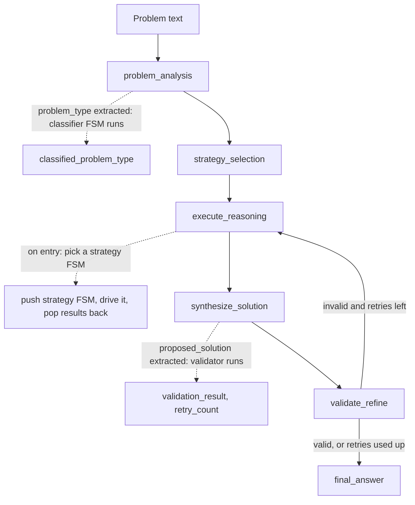

# fsm_llm.reasoning

`src/fsm_llm/reasoning` is the reasoning subpackage of FSM-LLM. It takes a problem in plain text, picks a reasoning style for it (arithmetic, deduction, analogy, and so on), walks an LLM through that style step by step, checks the answer, and returns the answer together with a trace of the steps.

## What it is for

A hard question asked of an LLM in one shot often gets a shallow or wrong answer. This package splits the work into fixed steps. FSM-LLM (the core `fsm_llm` package) runs a conversation as a finite state machine (FSM): a set of named states with rules for moving between them, where each turn the LLM extracts data and then writes a reply. Here, a top-level "orchestrator" FSM analyses the problem, picks a strategy, runs a smaller strategy FSM for it, writes a solution, and validates it. If the answer looks weak, it goes back and runs the strategy again, up to 3 retries. You get back the final answer and a trace you can inspect.

## How it works



- The engine starts an orchestrator conversation and keeps sending it "Continue reasoning" messages until it reaches `final_answer`, for at most 50 rounds.
- As soon as the orchestrator extracts `problem_type`, a handler (a Python function the FSM runs at a set point) runs a second FSM, the classifier, which looks at domain, structure and needs and recommends one of the nine strategies. It gets at most 10 turns.
- When the orchestrator enters `execute_reasoning`, a handler chooses the strategy FSM. The engine pushes it on top of the orchestrator (FSM stacking), drives it with "Continue reasoning." for at most 30 turns, then pops it and copies its results back into the orchestrator.
- When a `proposed_solution` appears, a validator runs four checks: there is an answer, there are key insights (not needed for arithmetic), the answer is longer than 20 characters (not needed for arithmetic), and it shares at least one non-trivial word with the question (not checked for arithmetic).

The nine strategies and their number of states:

| Strategy | States | Main result key |
| --- | --- | --- |
| `simple_calculator` | 2 | `calculation_result` |
| `analytical` | 4 | `integrated_analysis`, `key_insights` |
| `deductive` | 3 | `conclusion` |
| `inductive` | 4 | `hypothesis` |
| `abductive` (best explanation) | 4 | `best_hypothesis` |
| `analogical` | 5 | `adapted_solution_or_understanding` |
| `creative` | 4 | `best_creative_solution` |
| `critical` | 5 | `critical_assessment` |
| `hybrid` | 7 | `final_hybrid_solution` |

## Files

- `engine.py` - `ReasoningEngine`: builds the orchestrator and classifier, registers handlers, runs the solve loop.
- `reasoning_modes.py` - all 11 FSM definitions as Python dictionaries (orchestrator, classifier, nine strategies) and the `ALL_REASONING_FSMS` registry.
- `handlers.py` - answer validation, trace recording, context pruning, mapping strategy results back, picking the final answer.
- `definitions.py` - Pydantic models for steps, traces, validation, classification, problems and solutions.
- `constants.py` - reasoning types, state names, context key names, limits, and message text.
- `utilities.py` - load an FSM definition, map loose words like "math" to a strategy, list strategies.
- `exceptions.py` - error classes.
- `__main__.py` - command-line tool.
- `__init__.py`, `__version__.py` - public exports and version (taken from `fsm_llm.__version__`).

## How to use it

The package ships with `fsm-llm` itself; the `reasoning` extra adds no dependencies. There is no console script, so run it as a module:

```bash
python -m fsm_llm.reasoning "What is 15% of 240?"
python -m fsm_llm.reasoning "Why might sales drop in summer?" --type abductive --output detailed
python -m fsm_llm.reasoning "Compare a city to a cell" --model ollama_chat/qwen3.5:4b --save results.json
python -m fsm_llm.reasoning --list-types
```

```python
from fsm_llm.reasoning import ReasoningEngine

engine = ReasoningEngine(model="ollama_chat/qwen3.5:4b")
solution, trace = engine.solve_problem("If all cats are mammals and Tom is a cat, what is Tom?")
print(solution)
print(trace["summary"])
```

`trace` has the keys `reasoning_trace`, `summary`, `final_context` and `all_responses`.

## Things to know

- One engine solves one problem at a time. Calls to `solve_problem` on the same engine wait for each other.
- Every step is an LLM call, so one problem can take dozens of calls. Small models may loop until a limit (50 orchestrator rounds, 30 strategy turns) stops them. Hitting the 50-round limit is not an error: you get whatever answer is in the context, or a fallback message.
- `--type` (or `preferred_reasoning_type` in the starting context) overrides the automatic choice when it names a valid strategy.
- If a strategy FSM cannot be loaded, the engine falls back to `analytical` only, never to another style.
- Unknown words passed to `map_reasoning_type` fall back to `analytical` with a warning.
- `--list-types` and `--verbose` messages are printed as log lines on stderr, not as plain stdout text.
- In `--output json` and in `.json` save files, `reasoning_types_used` is a sorted list of type names.
