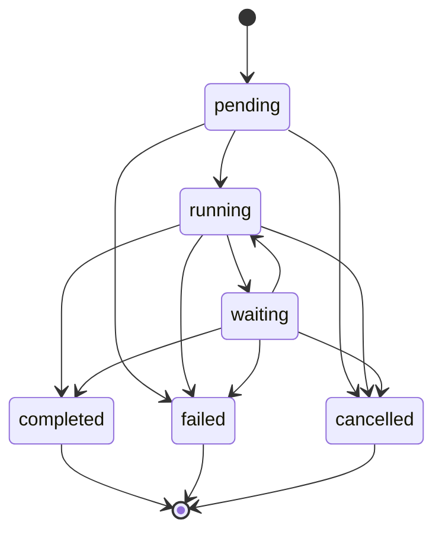

# fsm_llm.workflows

Path: `src/fsm_llm/workflows`
Purpose: Async, in-memory workflow engine inside the `fsm-llm` distribution: step graphs (11 step types) over a shared context dict, events, timers, deadlines, lifecycle hooks, and a Python DSL.

## Scope

Workflow definition, validation, execution, and DSL. No persistence, no JSON loader (steps carry Python callables). The `workflows` extra in `pyproject.toml` is empty (no deps beyond core). Version re-exported from `fsm_llm.__version__` (`__version__.py` imports it; `__init__.py` imports it once from `.__version__` and lists it in `__all__`). Not wired into `fsm_llm.API`: an independent state machine that reuses `fsm_llm.constants.has_internal_prefix`, `fsm_llm.logging.logger`, `fsm_llm.definitions.FSMError`, and, lazily, `fsm_llm.API` (in `ConversationStep`) and `fsm_llm.definitions.ResponseGenerationRequest` (in `LLMProcessingStep`). Engine hooks are `add_hook`; the engine holds no `HandlerSystem`. `DependencyResolver` is standalone; neither the engine nor `ParallelStep` uses it.

## Architecture

Instance status machine (`models._VALID_STATUS_TRANSITIONS`; `update_status` raises `WorkflowStateError` on anything else, same-status is allowed):

`_create_workflow_instance` copies `initial_context`, sets `_workflow_info`, and moves the instance to RUNNING before the first step.

Step driver (`engine.py`): every entry point takes the instance lock, then calls `_execute_workflow_step(instance)`, a LOOP (not recursion, D-002) that calls `_run_current_step` until it returns `None`, at most `max_steps_per_run` times per call (over budget: FAILED with `WorkflowStateError`).

`_run_current_step`:
1. Deadline check (past deadline: FAILED, `WorkflowTimeoutError` raised).
2. `step.execute(instance.context)` with `steps._STEP_EXECUTOR` bound to the engine executor; wrapped in `asyncio.wait_for(remaining)` when a deadline is set.
3. Non-`WorkflowStepResult` return raises `WorkflowStepError`.
4. Merge `result.data` minus internal-prefix keys (except `STEP_INTERNAL_WHITELIST`), add a history entry (with `result.error`), emit `step_completed`.
5. Success: truthy `next_state` is returned and the loop calls `_prepare_transition` (validate target, drop wait listeners/timers, pop `_waiting_info`/`_timer_info`, RUNNING). `next_state == ""` completes. Other falsy values go to `_handle_step_without_transition`: event wait consumes a matching buffered targeted event and continues (or completes if `success_state` is empty), else WAITING + `register_event_listener`; timer marker gives WAITING + `schedule_timer`; a step in `get_terminal_states()` completes; otherwise a WARNING and the instance stays RUNNING.
6. Failure: truthy `next_state` transitions; otherwise FAILED with `WorkflowStepError` (D-003).
7. Any exception: `_handle_step_exception` (FAILED unless already terminal); only `WorkflowTimeoutError` is re-raised (it carries `instance_id`).

Every engine status change goes through `_set_status`: emits `status_changed` on a real change; on a terminal status releases the instance's timers, listeners and buffered events, then purges the oldest terminal instances beyond `max_completed_instances`.

Wake-ups after WAITING: `process_event` -> `_deliver_event` -> `_transition_to_state`; `_timer_task` -> `_handle_timer_expiration`; `_event_timeout_task` -> `_handle_event_timeout`; `_deadline_task` -> `_handle_deadline` (FAILS a still-WAITING instance). Each of these restarts the step budget.

## Key files

| File | Role | Notes |
| --- | --- | --- |
| `engine.py` | `WorkflowEngine`, `Timer`, `LifecycleHook` alias | per-instance `asyncio.Lock`, `_listener_lock`, event buffers, timers dict, background tasks; module `__all__` |
| `steps.py` | `WorkflowStep` ABC + 11 subclasses, `_call_user_callable`, `_STEP_EXECUTOR` ContextVar, `_lookup_path`, `_error_text` | Pydantic models, `arbitrary_types_allowed` |
| `definitions.py` | `WorkflowDefinition`, `WorkflowValidator`, `_serialize_step` | `validate()` raises `WorkflowValidationError` with all errors |
| `dsl.py` | step factories, `WorkflowBuilder`, `workflow_builder`, pattern helpers | pattern helpers register steps, they do not wire them |
| `models.py` | `WorkflowStatus`, `WorkflowEvent`, `WorkflowStepResult`, `WorkflowHistoryEntry`, `WorkflowInstance`, `EventListener`, `WaitEventConfig` | `_VALID_STATUS_TRANSITIONS` |
| `constants.py` | context keys, limits, `PAUSING_STEP_TYPES` | see Data shapes |
| `dependency_resolver.py` | `DependencyResolver` | Kahn's algorithm, sorted waves |
| `exceptions.py` | `WorkflowError` tree | base is core `FSMError` |
| `__init__.py` | one static `__all__` | exports `MAX_STEPS_PER_RUN` |

## Public interface

`WorkflowEngine(*, max_concurrent_workflows=100, max_completed_instances=1000 (None keeps all), max_steps_per_run=1000 (<1 raises ValueError), executor=None)`:
- `register_workflow(defn)`: runs `defn.validate()`, stores a copy with its own `steps` dict. Re-registering an id affects new instances only (instances pin their definition in `_instance_definitions`).
- `async start_workflow(workflow_id, initial_context=None, instance_id=None, workflow_timeout=None, wait=True) -> str`. Raises `WorkflowResourceError` after `shutdown()` or at `max_concurrent_workflows` active instances, `WorkflowDefinitionError` for an unknown workflow, `WorkflowInstanceError` for an id the engine still holds (D-005), `WorkflowTimeoutError` on deadline. `wait=False` returns at once and runs in a background task, which does nothing if another entry point already drove or cancelled the instance.
- `async advance_workflow(instance_id, user_input="") -> bool`: re-runs the current step (re-arms a wait and its timeout); `_user_input` is set only for that run. False if unknown or not active.
- `async cancel_workflow(instance_id, reason="Cancelled by user") -> bool`: sets `_cancellation_reason`, CANCELLED. False if unknown or already terminal (D-015).
- `async process_event(event: WorkflowEvent) -> list[str]`: ids of instances woken.
- `async register_event_listener(instance_id, event_type, success_state=None, timeout_seconds=None, timeout_state=None, event_mapping=None, correlation_key=None)`: raises `WorkflowEventError` for empty `event_type`, `WorkflowInstanceError` for unknown or terminal instance. `correlation_value` is captured from the context now.
- `async schedule_timer(instance_id, delay_seconds, next_state)`: raises `WorkflowInstanceError` if unknown; replaces (cancels) an existing `{id}_timer`.
- `async shutdown()`: cancels and awaits timers and background tasks, clears listeners and buffers, refuses new starts; instance statuses unchanged.
- `remove_instance(id) -> bool` (terminal only), `add_hook(fn)`, `remove_hook(fn) -> bool`.
- Queries: `get_workflow_instance` (live object), `get_workflow_definition`, `get_workflow_status -> WorkflowStatus | None`, `get_workflow_context -> dict | None` (shallow copy), `get_active_workflows -> list[str]`, `get_statistics()` (`total_workflows`, `active_workflows`, `registered_definitions`, `event_listeners`, `active_timers`, `buffered_events`, `status_breakdown`).
- Hooks: `fn(event_name, instance, data)`; `step_started {step_id}`, `step_completed {step_id, success, next_state, error}`, `status_changed {status, error}`. Exceptions logged as WARNING; an awaitable result is scheduled as a task.

`WorkflowDefinition{workflow_id, name, description="", steps: dict[str, WorkflowStep], initial_step_id=None, metadata}`:
- `with_step(step, is_initial=False)` (a different object with the same id raises `WorkflowDefinitionError`; same object is a no-op), `with_initial_step(step)`.
- `validate()`: id, name, at least one step, initial step exists, key matches `step.step_id`, step has a name, no duplicate child ids in a `ParallelStep`, every referenced state exists, every step reachable from the initial step, no synchronous cycle. Logs a WARNING (not an error) for a step with no path to a terminal step.
- `get_terminal_states()` (steps whose referenced-state set is empty), `has_cycles()` (any cycle), `has_synchronous_cycles()` (edges out of a `WaitForEventStep`/`TimerStep`, or a `RetryStep` wrapping one, are ignored; D-002). Both return False when `initial_step_id` is unset. Iterative DFS (no recursion).
- `serialize() -> dict`: steps carry `"type"` = class name; `action`, `api_function`, `condition`, `aggregation_function`, `llm_interface` and any other callable field are dropped; nested `RetryStep.step` and `ParallelStep.steps` are serialized recursively. `AgentStep.agent` and `RetryStep.step` are `Field(exclude=True)`.
- `WorkflowValidator.validate_workflow(defn) -> list[str]`, `validate_workflow_collection(dict) -> dict[str, list[str]]` (only ids with errors).

`WorkflowStep{step_id, name, description="", timeout: float | None = None}`; `async execute(context) -> WorkflowStepResult`; `_with_timeout(coro)` raises `WorkflowStepError` on timeout.

Steps (every failure without an error route FAILS the instance):
- `AutoTransitionStep(next_state, action=None, error_state=None)`: `action(context)` returns dict or None (else `TypeError`). Failure: `error_state` or raise `WorkflowStepError`.
- `ConditionStep(condition, true_state, false_state, error_state=None)`: truthiness picks the branch; outputs `condition_result`. Failure as above.
- `APICallStep(api_function, success_state, failure_state, input_mapping{api_param: ctx_key}, output_mapping{ctx_key: result_key})`: calls `api_function(**params)`; missing input keys are omitted; `result_key` is an exact key, a dotted path, or `""` (whole result, even non-dict). Any exception routes to `failure_state`.
- `SwitchStep(key, cases{value: state}, default_state=None)`: compares `str(value)`, missing key is `""`. No match with `default_state=None` returns a failure (instance FAILS); `""` completes. Outputs `switch_<id>_matched`, `switch_<id>_target`.
- `LLMProcessingStep(llm_interface, prompt_template, context_mapping{prompt_var: ctx_key}, output_mapping{ctx_key: regex}, next_state, error_state=None, system_prompt=<default>)`: `prompt_template.format(...)` (literal braces `{{ }}`). Prefers `llm.generate(prompt)` (sync or async); else `llm.generate_response(ResponseGenerationRequest)` (prompts over 10,000 chars go into the system prompt). Reply must be `str` or have a str `.message`. Regex: group 1 or whole match, `re.DOTALL`; miss leaves the key unset (WARNING); `""` stores the whole reply. Regexes are validated at construction.
- `WaitForEventStep(config: WaitEventConfig)`: returns `_waiting_info`, no `next_state`.
- `TimerStep(delay_seconds >= 0, next_state)`: returns `_timer_info`.
- `ConversationStep(fsm_file | fsm_definition (dict or object with `model_dump`; exactly one), model=None, initial_context{conv_key: wf_key}, context_mapping{wf_key: conv_key}, success_state="", error_state=None, max_turns=20 (>=1), conversation_timeout=None, require_completion=False, use_user_input=False, auto_messages=[])`: whole conversation runs in the executor via `API.from_definition`/`API.from_file`; limit is min(`timeout`, `conversation_timeout`), enforced with `asyncio.wait`. Collected data gets `last_response`/`final_answer` = the last non-empty reply (opening reply or any turn) if absent; when nothing was spoken (all silent states) neither key is added. Outputs `conversation_<id>_data`, `conversation_<id>_ended`. `require_completion` and not ended is a failure. The conversation is always ended in `finally`.
- `AgentStep(agent, task_template="{task}", success_state="", context_mapping{wf_key: agent_key}, input_mapping{agent_ctx_key: wf_key}, error_state=None)`: `agent` needs callable `run`. Task is `task_template.format(**context)`; `agent.run(task, initial_context=...)` (kwarg only when `input_mapping` is non-empty). Result: a `str`, or an object with `answer`, `success`, optional `final_context`, `structured_output`. `context_mapping` reads `final_context` first, then `answer`/`success`/`structured_output`. `success=False` is a failure. Outputs `agent_answer`, `agent_success`, `agent_<id>_answer`, `agent_<id>_success`.
- `ParallelStep(steps, next_state, error_state=None, aggregation_function=None)`: children cannot be (or `RetryStep`-wrap) wait/timer steps. Each child gets a deepcopy of the context (shallow on failure); `timeout` bounds the whole `gather`. Child `next_state` ignored. Default aggregate: `step_<i>_<key>`, internal keys dropped BEFORE prefixing. `aggregation_function(results)` is called synchronously, success only. Any child failure: failure result with the successful children's default aggregate and `next_state=error_state`.
- `RetryStep(step, max_retries=3 (>=0), backoff_factor=1.0 (>=0))`: `step` is anything with `execute`. `max_retries + 1` attempts; delay before retry n is `backoff_factor * n`; raised exceptions retried too (D-010); last failure returned or re-raised. `timeout` is per attempt.

DSL (`dsl.py`): `create_workflow(workflow_id, name, description="")`, `workflow_builder(...) -> WorkflowBuilder` (`add_step`, `set_initial_step`, `add_metadata`, `build(validate=False)` returns the builder's own object), factories `auto_step`, `api_step`, `condition_step`, `switch_step`, `llm_step`, `wait_event_step`, `timer_step`, `parallel_step`, `conversation_step`, `agent_step`, `retry_step`. `timer_step`, `wait_event_step` and `switch_step` have no `timeout` parameter. Patterns `linear_workflow` (empty list raises `ValueError`), `conditional_workflow`, `event_driven_workflow`: register steps and set the initial one; they do NOT wire next states.

`DependencyResolver()`: `add_step(id, depends_on=None)` (does not register the dependencies), `add_dependency(id, depends_on)` (registers both), `resolve() -> list[list[str]]` (sorted waves; `WorkflowValidationError` on unknown dependency or cycle), `has_cycles()` (ignores unknown dependencies), `get_dependencies`, `get_dependents`, `get_all_steps`, properties `step_count`, `dependency_count`, `clear()`, classmethod `from_dict({id: [deps]})`.

## Data shapes

- `WorkflowStepResult{success, data, next_state, message, error (Exception coerced to str), timestamp}`; `success_result(data, next_state, message)`, `failure_result(error, next_state, message)`.
- `WorkflowInstance{instance_id, workflow_id, current_step_id, context, status=PENDING, created_at, updated_at, completed_at, deadline, workflow_timeout, error, history, max_history_entries=1000 (None keeps all)}`; `update_status(status, error=None)` (history entry only on a change or with an error), `add_history_entry` (shallow-copies `data`, trims oldest), `is_active()` = RUNNING|WAITING, `is_terminal()`.
- `WorkflowEvent{event_type, payload, timestamp (UTC), event_id (uuid4), instance_id=None}`; `model_dump` renders `timestamp` as ISO text.
- `WaitEventConfig{event_type (non-empty), success_state, timeout_seconds (>0), timeout_state (requires timeout_seconds), event_mapping{ctx_key: payload_key}, correlation_key}`.
- `EventListener{instance_id, success_state, event_mapping, registered_at, timeout_at, correlation_key, correlation_value, timeout_state, step_id}`; `is_expired()`.
- `Timer(instance_id, next_state, expires_at, task)`; keys in `engine.timers`: `{id}_timer`, `{id}_{event_type}_timeout`, `{id}_deadline`.
- Engine context keys (`constants.py`): `_waiting_info`, `_timer_info` (both in `STEP_INTERNAL_WHITELIST`, cleared on every transition), `_workflow_info {workflow_id, instance_id}`, `_timeout {event_type, timeout_at}`, `_timer_expired {expired_at}`, `_last_event` (event dump), `_user_input` (only during an `advance_workflow` run), `_cancellation_reason`.
- Limits: `MAX_STEPS_PER_RUN = 1000`, `DEFAULT_MAX_COMPLETED_INSTANCES = 1000`, `DEFAULT_MAX_HISTORY_ENTRIES = 1000`, `MAX_BUFFERED_EVENTS_PER_INSTANCE = 100` (deque, oldest dropped), `PARALLEL_DEEPCOPY_WARNING_THRESHOLD = 10`, `PAUSING_STEP_TYPES = {"WaitForEventStep", "TimerStep"}`.

## Invariants and constraints

- Locks: take the per-instance lock ONLY at outermost entry points (`start_workflow`, `_run_in_background`, `advance_workflow`, `cancel_workflow`, `_deliver_event`, `_handle_timer_expiration`, `_handle_event_timeout`, `_handle_deadline`); never inside `_execute_workflow_step`/`_transition_to_state` (`asyncio.Lock` is not reentrant, D-003). Order is instance lock then `_listener_lock`, never reversed.
- `process_event` (D-001): collect and consume matching listeners under `_listener_lock` without touching instances (skips expired and non-correlating ones); no candidates and a target set means buffer the event (dropped if the instance is unknown or terminal). Delivery per instance under its lock only while still WAITING at the listener's `step_id`; cancel the wait timeout BEFORE transitioning; one instance's exception FAILS only that instance; on `CancelledError` undelivered listeners are restored.
- Every wait with `timeout_seconds` schedules a timeout; no `timeout_state` means FAILED with `WorkflowTimeoutError` (D-001). Timeout, timer and deadline handlers act only on a still-WAITING instance.
- `_prepare_transition` drops the instance's listeners and wait timers but not `{id}_deadline`. Terminal cleanup matches `Timer.instance_id`, never the key prefix (D-005).
- Only synchronous cycles are rejected; loops through a wait/timer step are allowed and bounded per call by `max_steps_per_run` (D-002).
- Internal-prefix result keys are dropped via `has_internal_prefix` (never re-inline `startswith("_")`), except the whitelist; do not remove the whitelist.
- `next_state == ""` on ANY successful result means terminal for that route; no isinstance narrowing (D-013, D-020).
- A failure result with no `next_state` FAILS the instance; no step falls back to its success route (D-003).
- User callables go through `steps._call_user_callable`: async callables awaited, sync ones in `_STEP_EXECUTOR` (engine executor or loop default), a returned awaitable awaited (D-004).
- `_handle_step_exception` and `cancel_workflow` never overwrite a terminal status (D-005, D-015).
- Reported workflow timeout is the configured float, not truncated (D-011).
- `Timer.cancel()` never cancels the task running it. Re-scheduling a timer or event timeout cancels the old task first.
- Do not revert iterative DFS in `_has_cycle` to recursion.

## Dependencies

- `fsm_llm`: `constants.has_internal_prefix`, `logging.logger`, `definitions.FSMError`, `API` (lazy, `ConversationStep`), `definitions.ResponseGenerationRequest` (lazy, `LLMProcessingStep`).
- Runtime duck types: any object with `run(task)` for `AgentStep` (typically `fsm_llm.agents`), `generate`/`generate_response` for `LLMProcessingStep`.
- pydantic v2, asyncio, stdlib only otherwise.

## Failure modes

- `WorkflowError(message, details)` (subclass of core `FSMError`) -> `WorkflowDefinitionError(workflow_id, message)`, `WorkflowStepError(step_id, message, cause)`, `WorkflowInstanceError(instance_id, message)`, `WorkflowTimeoutError(operation, timeout_seconds, details, instance_id=None)`, `WorkflowValidationError(validation_errors)`, `WorkflowStateError(current_state, operation, message)`, `WorkflowEventError(event_type, message)`, `WorkflowResourceError(resource_type, resource_id, message)`. Constructors copy `details`.
- Step exceptions do not escape `start_workflow`/`advance_workflow` (instance FAILED), except `WorkflowTimeoutError`. `process_event` does not raise for one instance's failure. Background, timer and timeout tasks log errors.
- A non-terminal step with no transition and no wait marker leaves the instance RUNNING with a WARNING.
- A timeout cannot stop a sync callable already running in a worker thread.
- Logging is off until `fsm_llm.setup_logging()` / `enable_debug_logging()` (core disables the `fsm_llm` logger at import, which covers this subpackage; never add a subpackage-level disable).

## Working here

- New step type: subclass `WorkflowStep` in `steps.py`, implement async `execute` returning `WorkflowStepResult`; call user code through `_call_user_callable`; route failures to an `error_state`, never the success state; add a factory in `dsl.py`; teach `WorkflowDefinition._get_referenced_states` its target fields (the fallback only sees fields ending in `_state`); if it pauses, add it to `PAUSING_STEP_TYPES` and `_is_pausing_step`; export in `__init__.__all__` (one static list).
- Read the `# DECISION plan-.../D-NNN` comments in `engine.py`, `steps.py`, `definitions.py` before editing nearby; do not undo what they forbid.
- Tests: `pytest tests/test_fsm_llm_workflows/` (`test_audit_2026_09_27.py`, `test_audit_fixes.py`, `test_dsl.py`, `test_new_steps.py`, `test_steps.py`, `test_step_timeouts.py`, `test_workflows.py`). Examples in `examples/workflows/` are eval baselines; do not modify them unless asked.
- Use `.venv/bin/python`. Lint `ruff check src/ tests/`, types `make type-check`.
