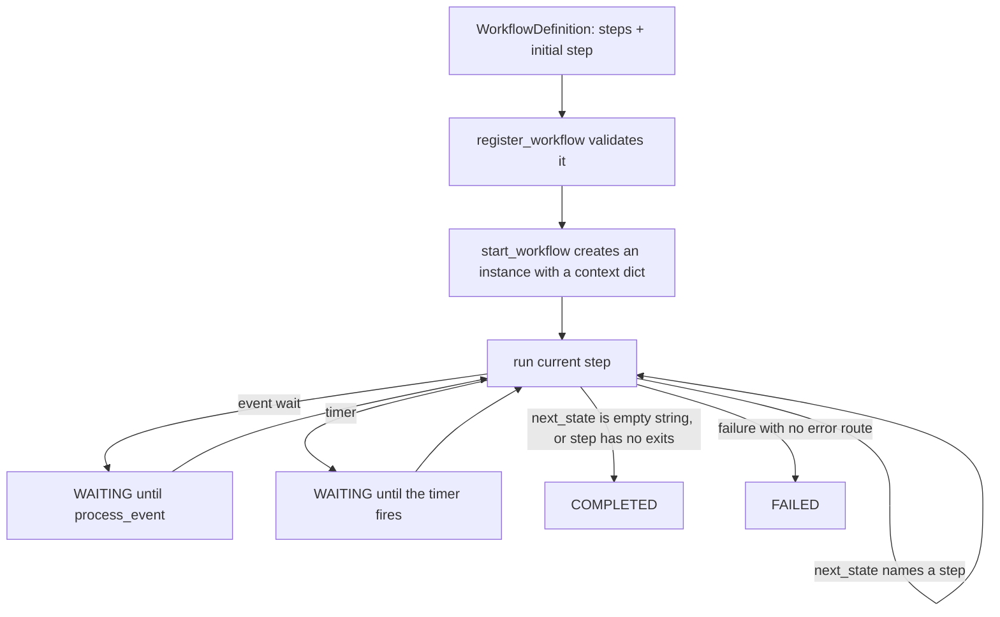

# fsm_llm.workflows

An async workflow engine that ships inside the `fsm-llm` package as the subpackage `fsm_llm.workflows` (folder `src/fsm_llm/workflows`). It runs multi-step processes where each step can be plain Python, an API call, an LLM prompt, a full FSM-LLM conversation, an agent, a timer, or a wait for an outside event.

## What it is for

Some jobs are not one chat but a pipeline: load an order, check it, wait for a manager to approve, then finish. This package lets you describe such a pipeline in Python as named steps, where each step says which step comes next. The engine runs the steps, keeps one shared context dictionary between them, pauses when a step waits for a timer or an event, and records a history of every step. Steps can wrap FSM-LLM conversations (the core `fsm_llm` package, which runs chatbots as finite state machines) and agents from `fsm_llm.agents`. Everything lives in memory; nothing is written to disk.

## How it works



Each step returns a result with `success`, some `data` (merged into the context), and `next_state`. The engine follows `next_state` until a step pauses, ends, or fails. An instance moves through the statuses `pending`, `running`, `waiting`, and ends as `completed`, `failed`, or `cancelled`.

There are 11 step types: automatic (run a function, move on), API call, condition (yes/no branch), switch (branch on a context value), LLM processing, wait for event, timer, FSM conversation, agent, parallel (run several steps at once), and retry (re-run a step with a growing delay).

## Files

- `engine.py` - `WorkflowEngine`: starts and drives instances, delivers events, runs timers and deadlines, cancels, cleans up, calls hooks. Also `Timer`.
- `steps.py` - the `WorkflowStep` base class and the 11 step classes.
- `dsl.py` - short factory functions (`create_workflow`, `auto_step`, `condition_step`, ...), `WorkflowBuilder` (`add_step`, `set_initial_step`, `add_metadata`; `build()` always validates, returns a fresh definition and raises `BuildError` chained from the workflow error), and three pattern helpers that register a set of steps without wiring them together.
- `definitions.py` - `WorkflowDefinition` with validation (targets exist, all steps reachable, no loop that never pauses) and `WorkflowValidator`.
- `models.py` - statuses, events, step results, instances, history entries, event listeners, wait settings.
- `dependency_resolver.py` - `DependencyResolver`: sorts steps with declared dependencies into "waves" that could run in parallel. A standalone helper; the engine does not use it.
- `exceptions.py` - the `WorkflowError` family.
- `constants.py` - engine context keys, limits and defaults.
- `__init__.py`, `__version__.py` - public exports and the version (taken from `fsm_llm.__version__`).

## How to use it

```python
import asyncio
from fsm_llm.workflows import (
    WorkflowEngine, WorkflowEvent, auto_step, condition_step,
    create_workflow, wait_event_step,
)

wf = create_workflow("orders", "Order check")
wf.with_initial_step(auto_step("load", "Load order", next_state="route",
                               action=lambda ctx: {"amount": 1500}))
wf.with_step(condition_step("route", "Big order?",
                            condition=lambda ctx: ctx["amount"] >= 1000,
                            true_state="review", false_state="done"))
wf.with_step(wait_event_step("review", "Wait for approval", event_type="approved",
                             success_state="done", event_mapping={"approver": "by"}))
wf.with_step(auto_step("done", "Finish", next_state=""))

async def main():
    engine = WorkflowEngine()
    engine.register_workflow(wf)
    iid = await engine.start_workflow("orders")
    print(engine.get_workflow_status(iid))            # WorkflowStatus.WAITING
    await engine.process_event(WorkflowEvent(event_type="approved", payload={"by": "ana"}))
    print(engine.get_workflow_status(iid))            # WorkflowStatus.COMPLETED
    print(engine.get_workflow_context(iid)["approver"])  # ana

asyncio.run(main())
```

Installing the `workflows` extra (`pip install "fsm-llm[workflows]"`) adds no packages beyond core `fsm-llm`. Runnable examples live in `examples/workflows/`.

## Things to know

- Everything is `async`. Plain (sync) functions such as actions and conditions run in a thread pool; pass `WorkflowEngine(executor=...)` to choose it. A function that returns a coroutine is awaited. A timeout cannot stop a sync function that is already running in its thread.
- A step returning `next_state=""` ends the workflow there.
- A failed step goes to its `error_state` (for API steps, `failure_state`). With no error route the instance FAILS; it never continues down the success route.
- Loops are allowed when they pass through a timer or event wait (polling, retry-until). A loop made only of steps that run back to back is rejected when the workflow is registered. One engine call runs at most `max_steps_per_run` steps (default 1000), then the instance FAILS.
- Events: `process_event` wakes every instance waiting for that event type, or only one instance when `WorkflowEvent.instance_id` is set. A targeted event that arrives early is kept (up to 100 per instance) until that instance waits for it. `correlation_key="order_id"` on a wait accepts only events whose payload `order_id` equals the instance's own context value.
- A wait with `timeout_seconds` and no `timeout_state` FAILS the instance when it times out.
- Keys a step returns that look internal (starting with `_`, `system_`, `internal_` or `__`, any case) are dropped from the context, except the engine's own `_waiting_info` and `_timer_info` markers.
- `start_workflow(..., workflow_timeout=30)` limits the whole run, waits included, and raises `WorkflowTimeoutError` when a step runs past it.
- Finished instances stay in memory: by default the 1000 most recent (`max_completed_instances`), each with at most 1000 history entries.
- `engine.add_hook(fn)` calls `fn(event_name, instance, data)` on `step_started`, `step_completed` and `status_changed`.
- Log output is off until `fsm_llm.setup_logging()` or `fsm_llm.enable_debug_logging()` is called.
