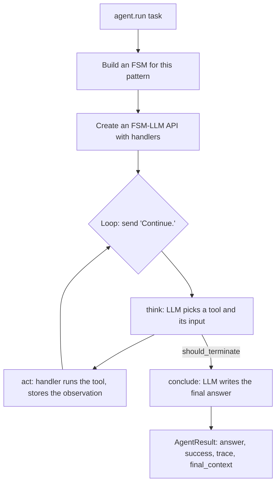

# fsm_llm_agents

Ready-made AI agent patterns for FSM-LLM: agents that call tools, plan, reflect, debate, vote, or hand work to other agents. It also includes a "meta-builder" that helps you design new FSMs, workflows, and agents by chatting with it.

## What it is for

An agent is an LLM that works on a task over several steps, often calling tools (your Python functions) along the way. Each pattern here is a known way of organising those steps, for example ReAct (think, call a tool, look at the result, repeat). Under the hood every pattern is built as an FSM-LLM finite state machine: a fixed set of states (such as `think`, `act`, `conclude`) with rules for moving between them. That keeps the loop structured and bounded, which matters most with small local models. You get a common `agent.run(task)` call that returns an answer, a success flag, and a trace of tool calls.

## How it works



- The agent feeds the FSM the message `Continue.` again and again until it reaches a final state.
- Tools run inside handlers (hooks FSM-LLM calls at fixed points), not inside the LLM. A tool failure is shown to the model as an observation instead of crashing the run.
- Limits stop runaway loops: `max_iterations` (default 10, with a hard ceiling of three times that in FSM steps) and `timeout_seconds` (default 300).
- `success` is only `True` when the run produced a real answer or ran at least one tool; planner patterns must show real executed work.

## Patterns

| Pattern | Class | Idea |
| --- | --- | --- |
| ReAct | `ReactAgent` | Think, call a tool, observe, repeat, then answer |
| ReWOO | `REWOOAgent` | Plan every tool call first, run them, then answer |
| Reflexion | `ReflexionAgent` | ReAct plus self-critique and retry after failure |
| Plan and execute | `PlanExecuteAgent` | Break the task into steps, run each, replan on failure |
| Prompt chain | `PromptChainAgent` | A fixed series of prompts with quality gates |
| Self-consistency | `SelfConsistencyAgent` | Answer several times, take the majority |
| Debate | `DebateAgent` | Proposer and critic argue, a judge decides |
| Orchestrator | `OrchestratorAgent` | Split into subtasks and hand them to workers |
| ADaPT | `ADaPTAgent` | Try directly; if it fails, break it down further |
| Evaluator-optimizer | `EvaluatorOptimizerAgent` | Generate, score with your function, refine |
| Maker-checker | `MakerCheckerAgent` | One role drafts, another reviews, revise until good |
| Reasoning ReAct | `ReasoningReactAgent` | ReAct plus a built-in `reason` tool that runs the structured reasoning engine (needs `fsm_llm_reasoning`) |
| Parallel ReAct | `ParallelReactAgent` | Several tool calls per step, run at once |
| Verified ReAct | `VerifiedReactAgent` | Check the answer with your function and retry |
| Auto-memory ReAct | `AutoMemoryReactAgent` | Recall related memories before, save after |
| Native function calling | `NativeFunctionCallingReactAgent` | Uses the provider's own tool-calling API instead of the FSM |
| Swarm | `SwarmAgent` | Agents pass the task to each other |
| Agent graph | `AgentGraph` | Agents wired as a graph with conditional edges, no cycles |

## Files

- `base.py` - `BaseAgent`: the shared loop, limits, answer extraction, trace, structured output.
- `react.py`, `rewoo.py`, `reflexion.py`, `plan_execute.py`, `prompt_chain.py`, `self_consistency.py`, `debate.py`, `orchestrator.py`, `adapt.py`, `evaluator_optimizer.py`, `maker_checker.py`, `reasoning_react.py`, `parallel_react.py`, `verified_react.py`, `auto_memory.py`, `native_fc.py`, `swarm.py`, `agent_graph.py` - one pattern each.
- `fsm_definitions.py` - builds the FSM for each pattern. `prompts.py` - the instructions each state gives the LLM.
- `tools.py` - `ToolRegistry` and the `@tool` decorator. `tool_registries.py` - caching and retrying registries. `semantic_tools.py` - picks relevant tools by embedding similarity.
- `handlers.py` - runs tools and enforces the iteration limit. `hitl.py` - human approval before sensitive tools.
- `memory_tools.py`, `semantic_memory.py`, `memory_persistence.py`, `summarization.py`, `truncation.py` - memory tools, long-term memory, saving memory, condensing old observations, shortening long tool output.
- `composition.py` - helpers to use ReAct agents as orchestrator workers and an LLM judge.
- `skills.py`, `sop.py` - load tools from folders; reusable task templates (three built in).
- `mcp.py` - load tools from an MCP (Model Context Protocol) server. `remote.py` - serve an agent over HTTP, or call a remote one as a tool.
- `meta_builder.py`, `meta_builders.py`, `meta_tools.py`, `meta_fsm.py`, `meta_prompts.py`, `meta_output.py`, `meta_cli.py` - the meta-builder and its `fsm-llm-meta` command.
- `definitions.py`, `constants.py`, `exceptions.py` - data models, names and defaults, errors.
- `__init__.py`, `__main__.py`, `__version__.py`, `py.typed` - exports and `create_agent()`, `python -m fsm_llm_agents --info`, version, type marker.

## How to use it

```python
from fsm_llm_agents import AgentConfig, ReactAgent, ToolRegistry, tool

@tool
def add(a: int, b: int) -> int:
    """Add two numbers."""
    return a + b

registry = ToolRegistry()
registry.register(add._tool_definition)

agent = ReactAgent(tools=registry, config=AgentConfig(model="ollama_chat/qwen3.5:9b-q8_0"))
result = agent.run("What is 17 + 25?")
print(result.answer, result.success, [c.tool_name for c in result.trace.tool_calls])
```

Or with the factory:

```python
from fsm_llm_agents import create_agent
agent = create_agent(tools=[add], pattern="react")
print(agent("What is 2 + 3?").answer)
```

Build a new FSM by chatting:

```bash
fsm-llm-meta --model ollama_chat/qwen3.5:9b-q8_0 --output my_bot.json
```

## Things to know

- `pip install "fsm-llm[agents]"` has no extra dependencies. `mcp.py` needs `fsm-llm[mcp]`; `RemoteAgentTool` needs `fsm-llm[a2a]` (httpx); `AgentServer` needs fastapi.
- `ReactAgent` and most tool patterns refuse an empty tool registry.
- Each `run()` makes many LLM calls. Small models can hit the iteration limit and fail with `BudgetExhaustedError`.
- Human approval: if a tool needs approval and no approval callback is set, the agent raises `ApprovalDeniedError` instead of approving silently. In `ReactAgent` each approval covers one tool call; the next call that needs approval asks again. Approval is not a security boundary yet. Known gaps, not fixed: `ReflexionAgent` runs an approval-gated tool before it asks; `ReasoningReactAgent` never asks the callback and lets the model approve; and in any agent the model can approve a call itself by writing `approval_granted`. Do not rely on approval to guard a dangerous tool.
- Keys in the returned `final_context` that look internal (starting with `_`, `system_`, `internal_`, `__`) are removed.
- `EvaluatorOptimizerAgent` and `MakerCheckerAgent` need arguments `create_agent` cannot guess (an evaluation function, maker and checker instructions); pass them yourself.
- Maker and checker instructions and the three `DebateAgent` personas go into the prompts as written, with no sanitizing. Write them yourself; put user input in the task, not in these arguments.
- MCP servers get a 30-second timeout per tool discovery and per tool call by default (`timeout=None` turns it off). Each call starts the server again, and that start counts toward the timeout.
- If the model names a tool that does not exist, it is told which tools exist and the turn counts as a turn without a tool call; it is not treated as evidence the agent did work. The bad name is cleared, so the next turn can pick a real tool.
- `MakerCheckerAgent` and `EvaluatorOptimizerAgent` judge every new draft; the old one is kept under `previous_draft` / `previous_output` while the model rewrites it. If the checker's pass is forced (the score reaches the threshold, or `max_revisions` is hit), the draft it judged is the one returned. One exception (known open): when the iteration limit forces the pass on a `revise` turn, the new draft skips the checker and ships unjudged, and the run reports `max_iterations_reached=True`; the fix direction is to force the pass only in `check`. The old draft stays visible in `final_context` and in later prompts.
- The meta-builder makes one LLM call to extract the whole design, then assembles it in Python. For workflows and agents, `is_valid` means the spec is complete, not that it loads as a runnable object; you still wire in the Python functions.
