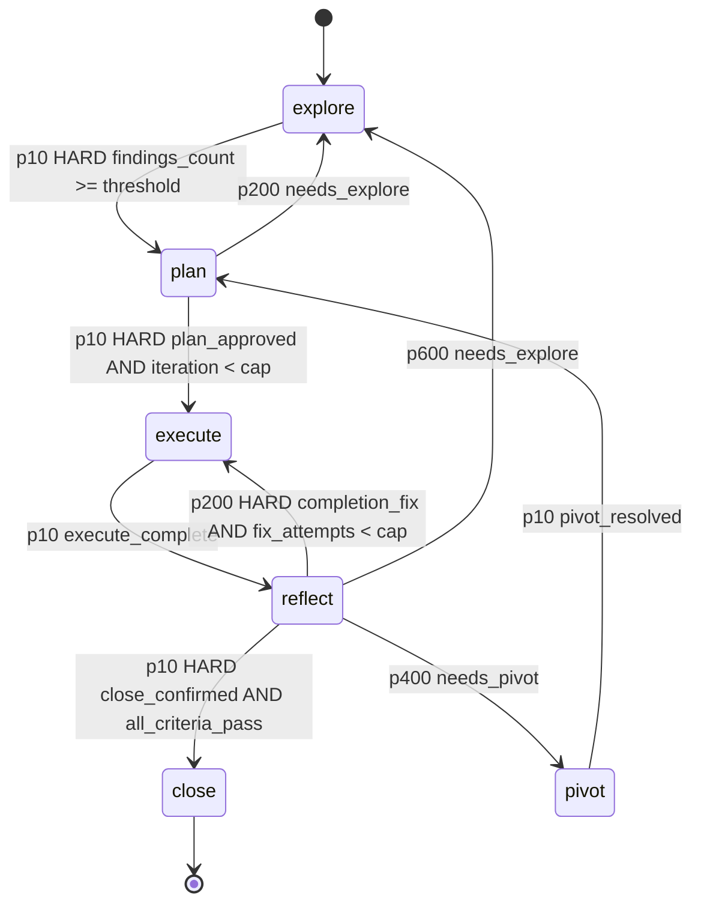

# fsm_llm_harness

Path: `src/fsm_llm_harness`
Purpose: The iterative-planner protocol as a real FSM-LLM FSM: 6 states (EXPLORE / PLAN / EXECUTE / REFLECT / PIVOT / CLOSE), 9 transitions, HARD gates as JsonLogic terms whose values are derived from the filesystem, Markdown artifacts on disk as memory, and an autonomy leash that halts at 2 fix attempts.

## Scope

Driver (`HarnessAgent`), FSM factory, role workers and prompts, confined workspace and plan-directory tools, artifact models and (de)serializers, plan-directory storage, gate and audit validator, small-model reply hardening, CLI. Extra `harness` pulls `fsm-llm[agents]` (imports `fsm_llm_agents`), no third-party deps of its own. Version from `fsm_llm.__version__` (0.9.0). CLI `fsm-llm-harness` (`python -m fsm_llm_harness`). Bench tooling lives outside the package: `scripts/harness_bench.py`, committed blocks under `scripts/bench_data/`, root-level `tests/test_harness_bench.py`.

The one idea: a gate reads the FILESYSTEM, never the model's account of it. `findings_count` counts non-empty `findings/*.md`; a dispatch claiming a write must show a tool call whose target now carries bytes. Measurement found 4B models asserting completed work over an empty directory 5/5.

## Architecture

- Lower `priority` wins: among passing edges the unique lowest value is DETERMINISTIC regardless of the gap; only equal priorities go AMBIGUOUS. Every edge of a state has a distinct priority (slots are >= 150 apart, a historical spacing from the old confidence-gap rule), so a gate decision never reaches the LLM classifier.
- One `TransitionCondition` per edge with `requires_context_keys`, so a missing key BLOCKS the edge (fail closed). Operators only `>= < == and var`.
- No state has `extraction_instructions` (the field is gone from `StateRules`): it would cost one extra bulk-extraction LLM call per turn (measured 2.000 -> 1.000 calls per turn).
- Driver loop: `HarnessAgent.run` drives `converse("Continue.")`; handlers fire one worker dispatch per state entry (priority 100), a pre-step gate before EXECUTE (50), an extraction guard that reverts driver-owned keys the LLM wrote (5), start dispatch (10), end/error (200).

## Key files

| File | Role | Notes |
| --- | --- | --- |
| `harness.py` | `HarnessAgent(BaseAgent)`, `RoleRequest`, `Presentation`, `RevertDirective`, `derive_execute_target`, `_derive_prose_target`, `_plan_is_approvable` | 3,736 lines; state-entry handlers, leash, redispatch budgets, stall detector, state.md read/write, resume |
| `fsm_definition.py` | `build_harness_fsm()` | graph shape + gate logic only; prose from `rules.py` |
| `rules.py` | `OWNERSHIP` (16 artifacts), `ROLE_BY_STATE`, per-state `StateRules`, `EXPLORE_TOPICS` | protocol CONTENT |
| `roles.py` | `ROLE_SPECS` (6 frozen `RoleSpec`), role prompt builders, output schemas, `build_default_worker_factory`, `_evidence_path` | |
| `tools.py` | `Workspace`, `PlanMemory`, 13 agent tools, `has_bytes`, `gate_files`, `count_gate_files`, `derive_disk_counts`, `COMMAND_ALLOWLIST`, `VERIFICATION_COMMANDS` | single `resolve()` chokepoint |
| `storage.py` | `PlanDirectory`, `mint_plan_id`, `evict_lessons`, `check_system_cap`, `apply_sliding_window`, `RunState` | `DRIVER_READ_MAX_BYTES = 4_000_000` |
| `_atomic.py` | `atomic_write_text` (temp in target dir + fsync + `os.replace`) | leaf module to avoid a storage/tools import cycle |
| `artifacts.py` | Pydantic models + Markdown (de)serializers for 15 artifact kinds, 9 decision entry schemas, 6 Presentation Contracts | isomorphic with the source protocol, not byte-identical |
| `plan_validator.py` | `pre_step_gate`, `audit`, `CHECKS` (30), `GateResult`, `Issue` | |
| `hardening.py` | `strip_model_noise`, `parse_json_payload`, `parse_role_output`, `coerce_worker_output`, `type_matches`, `as_int`, `retry`, `RETRYABLE_EXCEPTIONS` | all fail closed |
| `constants.py` | `HarnessStates`, `Role`, `ContextKeys`, `GateSlug`, `Severity`, `HandlerPriorities`, `HandlerNames`, `ArtifactNames`, `PlanSchema`, `Defaults`, `DRIVER_OWNED_SEEDS` (16), `DRIVER_OWNED_UNSET` (5) | |
| `exceptions.py` | `HarnessError` tree | |
| `__main__.py` | `main_cli`: `new`, `resume`, `status`, `validate`, `close` | exit codes 0/1/2 |
| `__init__.py` | 123 exports in one literal `__all__` | |

## Public interface

- `HarnessAgent(worker_factory=None, approval_callback=None, revert_callback=None, config=None, findings_threshold=3, max_fix_attempts=2, max_leash_grants=2, iteration_hard_cap=6, max_explore_redispatches=9, max_plan_redispatches=3, max_reflect_redispatches=3, max_close_denials=3, max_stall_turns=...)`; `run(goal, initial_context={ContextKeys.PLAN_DIR: ..., ContextKeys.WORKSPACE_ROOT: ...}) -> AgentResult`; properties `api`, `conversation_id`, `presentations`, `reverts`, `audit_issues`; `on_leash_cap(...)`.
  - `worker_factory: Callable[[RoleRequest], AgentResult]`. `None` is a diagnostic mode: the FSM turns but no gate opens (expect a stall halt).
  - `approval_callback` defaults to DENY (`_deny_approval`): an unattended run cannot approve its own plan or close itself.
  - `revert_callback=None`: the `leash-cap` `RevertDirective` is still computed and reported (never scoped to the plan directory); only execution is left to a caller. `git` is not in `COMMAND_ALLOWLIST`, so the driver never shells out to it.
  - One run per instance (`threading.Lock`); a worker re-entering `run`/`api`/`conversation_id` raises `HarnessReentrancyError`.
- `build_default_worker_factory(workspace, ...)`: stock workers; `native_function_calling=True` by default (`fsm_llm_agents.NativeFunctionCallingReactAgent`); the ReAct alternative stalls under role-weight prompts. EXPLORE uses `AgentConfig.force_final_tool="write_plan_file"` (a forced final write turn issued by the model, not the driver). PLAN uses a `response_format` structured plan that the driver renders into the 11 sections.
- `pre_step_gate(plan_dir, expected_state=...) -> GateResult(passed, slug, detail, exit_code)`: slugs in `GateSlug.ORDER` = `no-plan`, `wrong-state`, `leash-cap`, `iteration-cap`; first failure returns; every failure is HARD (`exit_code == 2`). Reads only `state.md` with plain `Path.read_text`, writes nothing (going through `PlanMemory` would `mkdir` the directory `no-plan` reports).
- `audit(plan_dir, workspace_root=".") -> list[Issue]`: 30 checks, never raises for a finding (a raising check becomes an ERROR). Leash audit: 2 attempts legal, 3 WARNING, 4+ ERROR; iteration WARN at 5, ERROR at 6+.
- `PlanDirectory(plan_dir, role=Role.ORCHESTRATOR)`, `PlanDirectory.create(parent)`: reads `read_text` (4 MB cap), `read_artifact`, `list_dir`, `exists`, `finding_path`, `checkpoint_path`, `load_run_state`; writes `write_text`, `append_text`, `write_artifact`, `save_run_state`; CLOSE policies `enforce_lessons_cap`, `enforce_system_cap`, `apply_sliding_window` (4-plan cross-plan window). `.path` is the plan dir, `.root` its parent (the confinement root).
- `Workspace` tools: `read_file`, `write_file`, `append_file`, `delete_file`, `list_dir`, `path_exists`, `grep_files`, `run_command` (disabled by default; allowlist `cat grep head ls tail wc`; `VERIFICATION_COMMANDS` `git make mypy pytest ruff` is opt-in). `PlanMemory(plan_dir, role=...)` tools: `read_plan_file`, `write_plan_file`, `append_plan_file`, `list_plan_dir`, `plan_path_exists`; checks confinement AND `rules.OWNERSHIP`.
- CLI: `fsm-llm-harness new GOAL [--plans-dir plans] [--create-only] [--model M] [--workspace .]`, `resume PLAN_DIR [--goal G] [--model M] [--workspace .]`, `status PLAN_DIR`, `validate PLAN_DIR [--workspace DIR]` (anchor scan only when given), `close PLAN_DIR [--workspace DIR] [--apply]`, `--version`. Model: `--model` > `$LLM_MODEL` > `Defaults.MODEL`. `--help` imports nothing from the package.

## Data shapes

- Roles (`ROLE_SPECS`):

| State | Role | Owns | Loop budget | Writable gate keys |
| --- | --- | --- | --- | --- |
| explore | `explorer` | `findings/` | 14 | `findings_count`, `needs_explore` |
| plan | `plan-writer` | `plan.md`, `decisions.md`, `verification.md` | 10 | `needs_explore`, `total_steps` |
| execute | `executor` | `decisions.md`, `changelog.md`, `checkpoints/` | 14 | none |
| reflect | `verifier` | nothing (read-only + `run_command`) | 12 | `all_criteria_pass`, `needs_pivot`, `completion_fix`, `needs_explore`, `criteria_pass_count`, `criteria_total` |
| pivot | `reviewer` | `findings/` | 10 | `pivot_resolved`, `pivot_reason` |
| close | `archivist` | `decisions.md`, `summary.md`, `FINDINGS.md`, `DECISIONS.md`, `LESSONS.md`, `LESSONS-archive.md`, `SYSTEM.md`, `INDEX.md` | 10 | `halt_reason` |

- Artifacts per plan: `state.md`, `plan.md`, `decisions.md`, `findings.md`, `findings/`, `progress.md`, `verification.md`, `changelog.md`, `summary.md`, `checkpoints/`. Cross-plan (parent dir): `FINDINGS.md`, `DECISIONS.md`, `LESSONS.md` (+ `LESSONS-archive.md`), `SYSTEM.md`, `INDEX.md`.
- Grammars the validator relies on: `plan.md` 11 `##` sections in exact order (`PlanSchema.SECTIONS`); `decisions.md` header `## D-NNN | PHASE | YYYY-MM-DD`, a `**Trade-off**:` field containing `at the cost of`, 9 entry-type field sets (`DECISION_ENTRY_SCHEMAS`); `verification.md` criteria table + 3 `MANDATORY_ADDITIONAL_CHECKS` rows + 5-bullet verdict (`VERDICT_BULLETS`) + a `VERDICT_RECOMMENDATIONS` value + evidence rules (`evidence_is_acceptable`, `REJECTED_EVIDENCE`); `changelog.md` 8 pipe-delimited regex-checked fields (`parse_changelog_line`).
- Presentation Contracts (`PRESENTATION_CONTRACTS`): `PC-EXPLORE`, `PC-PLAN`, `PC-EXECUTE-STEP`, `PC-EXECUTE-LEASH`, `PC-REFLECT`, `PC-PIVOT`; checked by `missing_floor_fields`.
- Halt slugs beyond the gate four: `explore-cap`, `plan-cap`, `reflect-cap`, `close-cap` (one per bounded redispatch budget).
- Context keys: gate flags (`findings_count`, `plan_approved`, `iteration`, `close_confirmed`, `all_criteria_pass`, `fix_attempts`, `leash_grants`, `needs_explore`, `needs_pivot`, `completion_fix`, `execute_complete`, `pivot_resolved`), counters (`step_number`, `total_steps`, `criteria_pass_count`, `criteria_total`), driver state (`current_role`, `current_role_result`, `role_results`, `dispatch_ledger`, `pivot_reason`, `last_gate_slug`, `halt_reason`), inputs `goal`, `plan_dir`, `workspace_root`.
- `Defaults`: `TEMPERATURE 0.3`, `MAX_TOKENS 2000`, `MAX_TURNS 60`, `TIMEOUT_SECONDS 1800`, `LLM_TIMEOUT_SECONDS 120`, retry 3 attempts (1 s base, 30 s max, x2), `FINDINGS_THRESHOLD 3`, `MAX_EXPLORE_REDISPATCHES 9`, `MAX_PLAN_REDISPATCHES 3`, `MAX_REFLECT_REDISPATCHES 3`, `MAX_CLOSE_DENIALS 3` (the last two are unmeasured placeholders), `MAX_FIX_ATTEMPTS 2`, `MAX_LEASH_GRANTS 2`, `ITERATION_HARD_CAP 6`, `LESSONS_LINE_CAP 200`, `SYSTEM_LINE_CAP 300`, `DECISIONS_COMPRESS_LINES 300`.

## Invariants and constraints

- Leash: executor dispatches on one plan step are bounded by `max_fix_attempts * (1 + max_leash_grants)` = 6 for ANY approval sequence. An approving callback cannot reset `fix_attempts`.
- Driver-owned context: `DRIVER_OWNED_SEEDS` seeds 16 keys falsy before turn 1 and `DRIVER_OWNED_UNSET` keeps 5 absent. Core mints a required extraction config for every key in a condition's `requires_context_keys`, so an unseeded gate key is one the LLM is asked to invent each turn (measured: an LLM emitting `{"plan_approved": true, "close_confirmed": true}` once drove a full traverse past a DENYING callback). The extraction guard reverts any LLM write to these keys.
- Disk-derived gates: `derive_disk_counts` is the single derivation for the gate value, the number shown to the model, and the redispatch loop condition. Verified writes are labelled through the same `resolve()` that verified the bytes (`_evidence_path`).
- Budgets: each of EXPLORE, PLAN, REFLECT, and denied CLOSE approvals has a bounded redispatch budget that halts on its honest slug; do not mint a generic `STALL` slug. `_plan_is_approvable` (valid `PlanDoc` AND every section non-placeholder) is shared by the PLAN budget check and the approval stub.
- Confinement: resolve first, compare second. Sentinel-prefixed absolute paths (`/workspace/...`, `/plan/...`, bare `/workspace` and `/plan`) are rewritten to root-relative before the unchanged resolve-and-compare; `/` alone, `/etc/passwd`, `..` escapes, symlink escapes, and shared-prefix siblings raise `HarnessConfinementError`. Sentinel lists are separate per root (`_WORKSPACE_SENTINELS`, `_PLAN_SENTINELS`).
- Tool caps: `MAX_READ_BYTES` 64 KB (role reads), `MAX_OUTPUT_BYTES` 8 KB, `MAX_LIST_ENTRIES` 200, `MAX_GREP_HITS` 50. The driver's own reads use `DRIVER_READ_MAX_BYTES` 4 MB and are never handed to a worker.
- Corrective feedback never re-routes: a failed cross-root call is annotated with the counterpart tool name; a failed read of a missing protocol artifact is told `write_plan_file` creates it; a failed WRITE is never told to write.
- All writes are atomic (`_atomic.atomic_write_text`): a torn `state.md` still parses and would shrink the recorded fix-attempt count, silently resetting the leash.
- LESSONS is evicted (by `[I:N]` tag, 5 protected, only for sections the parser reproduces byte for byte); SYSTEM is refused over cap, never trimmed.
- Every role output schema carries `message: str` so core's structured-reply rescue fires instead of the generic fallback; `message`/`summary` are dropped by `coerce_worker_output` and not required by `parse_role_output`.
- Role prompts: standing blocks go in the SYSTEM message (`build_role_system_prompt`), per-dispatch blocks in the user turn (`build_role_task_prompt`); `build_role_prompt` returns both in the original order. Measured on `:4b` EXECUTE: whole prompt in the user turn 0/5 writes, standing half in SYSTEM 4/5.
- `OWNERSHIP` quirks that are intended: `findings/` is `(EXPLORER, REVIEWER)`; `decisions.md` has four owners (disjoint, phase-tagged appends).
- Known plumbing gap: nothing writes `verification.md` after PLAN (the verifier holds no write tool for it and no driver merge exists), so on the current configuration the CLOSE approval path cannot open.

## Dependencies

- `fsm_llm`: `API`, `HandlerTiming`, `TransitionEvaluator` semantics, `DEFAULT_LLM_MODEL`, `FSMError`, logging.
- `fsm_llm_agents`: `BaseAgent`, `AgentConfig` (`force_final_tool`), `AgentResult`, `ToolRegistry`, `NativeFunctionCallingReactAgent`, `ReactAgent`.
- pydantic v2 for artifacts and role schemas; stdlib `subprocess` for `run_command`.

## Failure modes

- `HarnessError(FSMError)` -> `HarnessArtifactError(artifact, message, cause=None)` (unreadable, unparseable, over cap), `HarnessOwnershipError(artifact, role, owner)`, `HarnessReentrancyError(role)`, `HarnessConfinementError(path, root)`.
- Garbled worker reply: `parse_role_output` fails closed, the gate key stays falsy, the edge stays BLOCKED; `retry` only retries `RETRYABLE_EXCEPTIONS`, never a garbled reply.
- CLI exit codes: `0` pass; `1` negative answer or no answer (audit ERROR, failed run, missing goal, broken install, argparse error); `2` RESERVED for a HARD `pre_step_gate` refusal. `_Parser.error()` exits 1 so a wrapper retrying on "usage error" cannot retry past `leash-cap`. `status` calls the gate twice (defaults first, then with `expected_state` from `state.md`). `close` is dry-run without `--apply` and refuses to compress when `audit()` has ERRORs.

## Status (measured on `ollama_chat/qwen3.5:4b`, digest `2a654d98e6fb`)

- L1 full traverse with scripted workers, zero audit ERRORs: 3/3. L2 leash halts at exactly 2, not resettable by approval: 6/6. L3 REFLECT -> PIVOT -> PLAN: 3/3.
- L4 EXECUTE write with real workers: write tool 5/5, bytes 5/5, strict content-hash 4/5 (bar >= 4/5, MET) after the driver-assigned EXECUTE target fix (bench `l4-execute-write` B0 2/40 -> B1 40/40, Fisher p=1.6e-20). The content-match metric shares vocabulary with the fix prompt; `content_matched_ast` is the decoupled successor. L5 >= 3 findings on disk: 5/5.
- L6 end-to-end with real workers (n=3 per block, frozen floor: reached >= EXECUTE AND verified workspace write AND honest halt): NOT MET in all nine blocks B0-B8. Walls cleared one state at a time: EXPLORE never-called-a-write-tool (forced final write; L8 `l8-explore-loop` gate 0/10 -> 9/10, p=0.00012), PLAN empty/invalid/undistributed plan (`response_format` structured plan rendered by the driver), EXECUTE target assignment (prose fallback `_derive_prose_target`), EXECUTE credit labels (`_evidence_path`), honest-halt bookkeeping (`reflect-cap`, `close-cap`). B8: 2/3 runs cleared the per-run conjunction for the first time, zero slugless stalls; run 2 halted honestly on `plan-cap`. The next wall is the `verification.md` plumbing gap above.
- Not claimed: production readiness, or that a 4B model drives the harness unattended to a useful result.
- Bench protocol: pre-registered fixed-n blocks, 6-field manifests, append-only raw jsonl, Wilson CI and Fisher exact, per-row seeds; blocks are immutable once committed.

## Working here

- Constants live in `constants.py`; protocol prose, ownership, topics in `rules.py`; `fsm_definition.py` owns only graph and gate logic. Keep `__all__` one literal list.
- Anchored decisions: non-obvious code carries `# DECISION plan-<full-plan-id>/D-NNN` saying what NOT to do and why. Keep the full plan id (with the `THHMMSS` segment) or the anchor audit cannot see it. Shared helpers document their call sites.
- Evidence over testimony: if a number can be derived from the filesystem, derive it; a model claim is advisory.
- Changing a gate: edit `fsm_definition.py`, keep priority spacing >= 150, add the key to `DRIVER_OWNED_SEEDS` or `DRIVER_OWNED_UNSET`, and add it to exactly one role's writable keys (or none).
- Changing `OWNERSHIP` changes what a live role can write; update `roles.py` tool scopes and prompts, which derive from it.
- Tests: `pytest tests/test_fsm_llm_harness/          # 1,982 tests, 10 test files` (`test_roles_and_tools.py`, `test_harness_agent.py`, `test_artifacts.py`, `test_hardening.py`, `test_plan_validator.py`, `test_storage.py`, `test_cli.py`, `test_fsm_definition.py`, `test_live_ollama.py`, `test_extraction_cost.py`). `tests/test_packaging.py` pins every test-count token in this file to the measured harness count and file count; update both numbers when tests are added. Live tests are double-gated (`FSM_LLM_HARNESS_LIVE=1` checked first, then a reachable Ollama): `FSM_LLM_HARNESS_LIVE=1 pytest tests/test_fsm_llm_harness/test_live_ollama.py`. L1-L3 run the live FSM with scripted workers writing real artifacts through role-scoped `PlanMemory`; L4/L5/L6 use `build_default_worker_factory` and report raw k/n.
