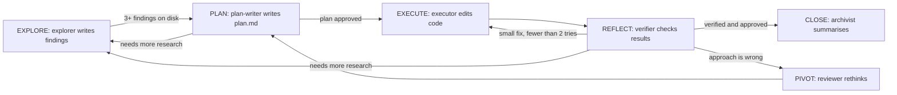

# fsm_llm_harness

A harness that runs the "iterative planner" way of working (explore, plan, execute, reflect, pivot, close) as a real FSM-LLM state machine, with hard gates that check files on disk instead of trusting what the model says it did.

## What it is for

When an LLM works on a coding task by itself, it tends to say it did things it did not do: "I wrote the findings", "the tests pass", over an empty folder. This package puts the work inside a finite state machine (a fixed set of states with rules for moving between them) built on FSM-LLM. The rules that matter most are gates that read the filesystem. The run cannot move from exploring to planning until at least three real findings files exist on disk. It cannot close until a verification is recorded and approved. It cannot keep trying to fix the same step forever: it stops after two failed attempts (the "autonomy leash") and asks for help.

Everything the run knows is written to a plan directory as Markdown files (`state.md`, `plan.md`, `decisions.md`, `findings/`, ...), so a run can be inspected, audited, and resumed.

## How it works



- Each state has one worker "role" (explorer, plan-writer, executor, verifier, reviewer, archivist). The driver sends one worker per state visit. Each role has only the tools it needs and may write only the files it owns.
- Workers get two separate, fenced-off folders: the source code workspace and the plan directory. Paths that try to escape (`../`, absolute paths, symlinks) are refused.
- A human approval callback is asked before a plan is accepted and before closing. By default it says no, so an unattended run cannot approve itself.
- Every loop has a limit. When a limit is hit, the run stops with a named reason (for example `explore-cap`, `plan-cap`, `leash-cap`) instead of spinning.
- `validate` audits a plan directory against 30 checks, such as section order in `plan.md` and the format of `decisions.md`.

## Files

- `harness.py` - `HarnessAgent`, the driver: dispatches workers, runs the gates and the leash, writes `state.md`, resumes.
- `fsm_definition.py` - the 6-state, 9-transition FSM and its gate rules.
- `rules.py` - the protocol text for each state and who owns which file.
- `roles.py` - the six worker roles, their prompts and output formats, and the stock worker factory.
- `tools.py` - the confined workspace and plan-directory tools that workers call.
- `storage.py`, `_atomic.py` - plan directory access, plan id creation, size limits, safe atomic file writes.
- `artifacts.py` - data models and Markdown readers/writers for every plan file.
- `plan_validator.py` - the pre-step gate and the 30-check audit.
- `hardening.py` - cleaning up messy small-model replies (thinking blocks, code fences, bad JSON).
- `constants.py`, `exceptions.py` - names, limits, defaults; error classes.
- `__main__.py` - the `fsm-llm-harness` command.
- `__init__.py`, `__version__.py`, `py.typed` - public exports, version, type marker.

## How to use it

```bash
pip install "fsm-llm[harness]"

fsm-llm-harness new "add a retry to the uploader" --workspace .   # create a plan dir and run
fsm-llm-harness new "add a retry to the uploader" --create-only   # create only, no LLM calls
fsm-llm-harness status   plans/plan-...                           # where is it?
fsm-llm-harness resume   plans/plan-...                           # keep going
fsm-llm-harness validate plans/plan-... --workspace .             # audit
fsm-llm-harness close    plans/plan-... --apply                   # apply closing size rules
```

From Python:

```python
from fsm_llm_harness import ContextKeys, HarnessAgent
from fsm_llm_harness.roles import build_default_worker_factory
from fsm_llm_harness.tools import Workspace

workspace = Workspace(".")
agent = HarnessAgent(
    worker_factory=build_default_worker_factory(workspace, model="ollama_chat/qwen3.5:4b"),
    approval_callback=lambda request: input("Approve? [y/N] ") == "y",
)
result = agent.run(
    "add a retry to the uploader",
    initial_context={ContextKeys.PLAN_DIR: "plans/plan-...", ContextKeys.WORKSPACE_ROOT: "."},
)
```

## Things to know

- Exit codes: `0` success, `1` failure or a negative answer, `2` is reserved for a hard gate refusal. Even a mistyped option exits `1`, so scripts can trust that `2` always means "a gate said stop".
- Running shell commands is off by default. When enabled, only `cat grep head ls tail wc` are allowed; `git` is never run by the harness.
- After two failed fix attempts on a step, the run stops and reports a revert suggestion. It never runs the revert itself unless you pass a `revert_callback`.
- This is experimental. Measured on a 4B local model, single steps work well (for example the executor writes the right file 4 or 5 times out of 5), but full unattended runs from start to a verified close have not yet succeeded 3 times out of 3.
- A known gap: nothing writes `verification.md` after planning, so the close approval cannot pass on the default setup.
- Live model tests only run with `FSM_LLM_HARNESS_LIVE=1` and a reachable Ollama server.
