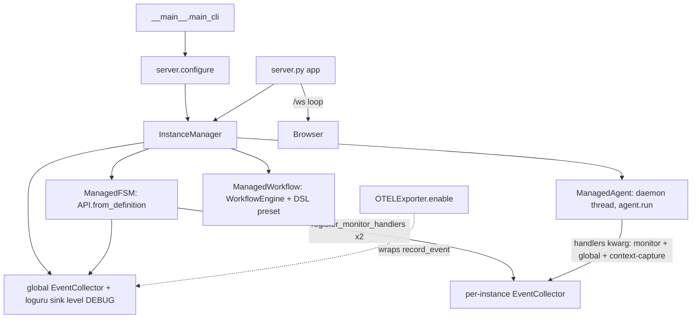

# fsm_llm_monitor

Path: `src/fsm_llm_monitor`
Purpose: FastAPI web dashboard (REST + WebSocket + vanilla-JS SPA) that launches, observes, and drives FSM-LLM FSMs, agents, and workflows; optional OpenTelemetry span export.

## Scope

Python backend (`server.py`, `instance_manager.py`, `collector.py`, `bridge.py`, `otel.py`, models, constants), the browser app in `static/`, and the Jinja2 shell `templates/index.html`. Part of the `fsm-llm` distribution (version shared with `fsm_llm`, currently 0.7.0), installed via extra `monitor` (fastapi >=0.100, uvicorn >=0.20, jinja2 >=3.1); OTEL via extra `otel`. Not here: FSM runtime (`fsm_llm`), agent implementations (`fsm_llm_agents`), workflow engine (`fsm_llm_workflows`).

## Architecture

Handler hooks use `fsm_llm.create_handler(...).at(HandlerTiming.X).with_priority(9999).do(cb)` (observe-only, lowest priority). Context-capture handlers use priority 9998 and append to `ManagedAgent.conversation_log` under `_conv_lock`.

## Key files

| File | Role | Notes |
| --- | --- | --- |
| `server.py` | FastAPI `app`, `configure`, all routes, `/ws`, builder sessions | Module globals: `_manager`, `_api_key`, `_flows`, `_builder_sessions`, `_preset_cache` |
| `instance_manager.py` | `InstanceManager`, `ManagedFSM/Agent/Workflow`, `register_monitor_handlers`, `snapshot_from_api`, `validate_preset_id`, `_find_examples_dir` | Optional imports set `_HAS_WORKFLOWS`, `_HAS_AGENTS` |
| `collector.py` | `EventCollector` | `threading.Lock`, `deque(maxlen)` for events and logs |
| `bridge.py` | `MonitorBridge`, `_fsm_dict_to_snapshot` | Backward-compat wrapper; server builds one via `get_bridge()` |
| `otel.py` | `OTELExporter` | Own `TracerProvider`, never set as global |
| `definitions.py` | Pydantic models, `normalize_message_history`, `model_to_dict` | |
| `constants.py` | Event names, defaults, theme colors, handler name/priority | Theme colors are not used by `static/style.css` |
| `__main__.py` | CLI `fsm-llm-monitor` | `configure()` then `uvicorn.run(app, log_level="warning")` |
| `static/`, `templates/index.html` | Frontend | Element ids and `data-action` names are the frontend contract |

## Public interface

Exports (`__init__.__all__`): `MonitorBridge`, `EventCollector`, `InstanceManager`, `app`, `configure`, `OTELExporter`, all models listed under Data shapes, `model_to_dict`, constants (`THEME_NAME`, `COLOR_PRIMARY`, `DEFAULT_*`, all `EVENT_*`, `MONITOR_HANDLER_NAME`, `MONITOR_HANDLER_PRIORITY`), exceptions.

- `configure(bridge=None, manager=None, cors_origins=None, api_key=None)`: sets global `_manager` (explicit manager > new manager wrapping `bridge.api` via `connect_bridge` > fresh `InstanceManager()`), reloads `flows.json`, cleans up the old manager's loguru sink. `api_key` is re-derived every call: arg, else env `FSM_LLM_MONITOR_API_KEY`, else `None` (warns when a previous key is cleared). `cors_origins` mutates middleware kwargs and only works before the first request.
- CLI: `fsm-llm-monitor [--host 127.0.0.1] [--port 8420] [--no-browser] [--version] [--info]`; also `python -m fsm_llm_monitor`.
- `EventCollector(max_events=1000, max_log_lines=5000)`: `record_event(MonitorEvent)`, `record_log(LogRecord)`, `get_events(limit=0)`, `get_events_since(after_total, limit=50)`, `get_logs(limit=0, level=None)` (min-level filter), `get_logs_since(after_total, limit=50)`, `get_metrics() -> MetricSnapshot` (raises `MetricCollectionError`), `get_events_by_conversation`, `clear()`, `cleanup()` (remove loguru sink), `create_loguru_sink()`, `create_handler_callbacks() -> {TIMING_NAME: cb}` (8 timings), `create_context_capture_callbacks(sink)` (6 timings), static `snapshot_context(ctx, max_value_len=1500)`. All newest-first.
- `MonitorBridge(api=None, config=None)`: `connect(api)` (raises `MonitorConnectionError`), `disconnect()`, `set_collector()`, `get_metrics()`, `get_active_conversations()`, `get_conversation_snapshot(id)`, `get_all_conversation_snapshots()`, `get_recent_events(limit)`, `load_fsm_from_file(path)`, `load_fsm_from_dict(data)` (None on error).
- `InstanceManager(config=None)` (raises `MonitorInitializationError` if the loguru sink fails): `launch_fsm(preset_id|fsm_json, model, temperature, label)`, `start_conversation(id, ctx) -> (conv_id, response)`, `send_message(id, conv_id, msg) -> {response, current_state, is_terminal}`, `end_conversation`, `get_fsm_conversations`; `get_workflow_presets()`, `launch_workflow(preset_id, ...)`, async `start_workflow_instance`, async `advance_workflow`, async `cancel_workflow`, `get_workflow_status`, `get_workflow_instances`; `launch_agent(agent_type, task, tools_config, model, max_iterations, timeout_seconds, label)`, `cancel_agent`, `get_agent_status`, `get_agent_result`; `destroy_instance`; `list_instances(type_filter)`, `get_instance`, `get_instance_collector`, `get_metrics`, `get_events`, `get_active_conversations`, `get_conversation_snapshot`, `get_all_conversation_snapshots(include_ended)`, `get_all_activity_snapshots(include_ended)`, `get_capabilities()`, `connect_bridge(api)`, properties `config`, `global_collector`, `dashboard_config`, `dashboard_config_version`.
- `OTELExporter(service_name="fsm-llm", exporter=None)` (raises `ImportError` without opentelemetry; default `ConsoleSpanExporter` in `BatchSpanProcessor`): `enable(collector)` (monkeypatches `collector.record_event`, idempotent per collector), `disable()`, `shutdown()`, `is_enabled`, `active_conversations`, static `generate_trace_id()`, `generate_span_id()`. Spans: `conversation.<id>` (parent), `transition.<src>-><dst>`, `processing.<phase>` (attrs `fsm_llm.model/tokens/latency_ms` if present in `event.data`), `lifecycle.<event_type>`; errors set parent status ERROR.

## HTTP routes (server.py)

`[K]` = gated by `_require_api_key` when a key is configured (`Authorization: Bearer <key>` or `X-API-Key`, `hmac.compare_digest` on UTF-8 surrogateescape bytes, 401 on mismatch).

- Pages: `GET /` (index.html), `GET /health`, `GET /api/docs` (OpenAPI UI), `/static/*` (no-cache headers).
- Monitoring: `GET /api/metrics`, `/api/conversations?include_ended`, `/api/conversations/{id}` (404), `/api/activity?include_ended`, `/api/events?limit`, `/api/logs?limit&level`, `/api/info`, `/api/capabilities`.
- Config: `GET /api/config`, `POST /api/config [K]`; `GET /api/dashboard/config`, `POST [K]` (accepts MonitorBuilder `to_dict()` with `panels`/`alerts` as dicts keyed by id), `DELETE [K]`.
- Instances: `GET /api/instances?type`, `GET /api/instances/{id}`, `GET /api/instances/{id}/events?limit`, `DELETE /api/instances/{id} [K]`.
- FSM: `POST /api/fsm/launch [K]`, `POST /api/fsm/{id}/start [K]`, `/converse [K]`, `/end [K]`, `GET /api/fsm/{id}/conversations`; `POST /api/fsm/load`, `POST /api/fsm/visualize`, `GET /api/fsm/visualize/preset/{preset_id:path}`; `GET /api/presets` (60 s cache), `GET /api/preset/fsm/{preset_id:path}`.
- Workflow: `GET /api/workflow/presets`, `POST /api/workflow/launch [K]` (also starts one instance), `POST /api/workflow/{id}/advance [K]`, `/cancel [K]`, `GET /api/workflow/{id}/status?workflow_instance_id` (400 if missing), `GET /api/workflow/{id}/instances`.
- Agent: `POST /api/agent/launch [K]`, `GET /api/agent/{id}/status`, `GET /api/agent/{id}/result`, `POST /api/agent/{id}/cancel [K]`; `GET /api/agent/visualize?agent_type`, `GET /api/workflow/visualize?workflow_id` (from `flows.json`, 404 unknown).
- Builder: `POST /api/builder/start [K]` (501 if `fsm_llm_agents.meta_builder` missing), `POST /api/builder/send [K]` (404 unknown, 409 concurrent send, session removed on completion), `GET /api/builder/result/{sid}`, `DELETE /api/builder/{sid} [K]`.
- `WS /ws`: unauthenticated; each `refresh_interval` sends `{type:"metrics", data, events?, logs?, log_count?, instances, agent_updates?, workflow_updates?, dashboard_config?}`; stale builder sessions cleaned every 60 cycles.

## Data shapes

- `MonitorEvent{event_type, timestamp (UTC), conversation_id, source_state, target_state, data, level="INFO", message}`; `LogRecord{timestamp, level, message, module, function, line, conversation_id}`.
- `MetricSnapshot{active_conversations, total_events, total_errors, total_transitions, events_per_type, states_visited, active_agents, active_workflows, total_agent_iterations, total_tool_calls, total_workflow_steps}`.
- `ConversationSnapshot{conversation_id, instance_id, current_state, state_description, is_terminal, context_data, message_history[{role, content}], stack_depth, last_extraction, last_transition, last_response}`; `ActivityItem{item_id, item_type fsm_conversation|agent_task|workflow_instance, instance_id, label, status, current_step, detail, message_count, created_at, is_terminal}`.
- `FSMSnapshot{name, description, version, initial_state, persona, state_count, states[StateInfo{state_id, description, purpose, is_initial, is_terminal (no transitions), transition_count, transitions[TransitionInfo{target_state, description, priority, condition_count, has_logic}]}]}`.
- `MonitorConfig{refresh_interval=1.0, max_events=1000, max_log_lines=5000, log_level="INFO", show_internal_keys=False, auto_scroll_logs=True}`; `InstanceInfo{instance_id, instance_type fsm|workflow|agent, label, status, created_at, source, conversation_count, active_workflows, agent_type}`.
- Requests: `LaunchFSMRequest{preset_id, fsm_json, model=DEFAULT_LLM_MODEL, temperature 0..2 =0.5, label}`, `StartConversationRequest{initial_context}`, `SendMessageRequest{message, conversation_id}`, `EndConversationRequest`, `StubToolConfig{name, description, stub_response}`, `LaunchAgentRequest{agent_type="ReactAgent", task, model, max_iterations=10, timeout_seconds=120, tools, label}`, `LaunchWorkflowRequest{preset_id, definition_json, initial_context, label}`, `WorkflowAdvanceRequest{workflow_instance_id, user_input}`, `WorkflowCancelRequest{workflow_instance_id, reason}`, `BuilderStartRequest{artifact_type, model, temperature=0.7, max_tokens=2000}`, `BuilderSendRequest{session_id, message}`, `DashboardConfig{name, description, panels[DashboardPanel], alerts[DashboardAlert], refresh_interval_seconds=30, retention_hours=24}`.
- Event types: `conversation_start|end`, `state_transition`, `pre_processing`, `post_processing`, `context_update`, `error`, `log` (reserved, never emitted), `instance_launched|destroyed`, `workflow_started|advanced|completed|cancelled`, `agent_started|completed|failed|iteration|cancelled|tool_call`.

## Invariants and constraints

- Internal-key hiding uses `fsm_llm.constants.has_internal_prefix` (prefixes `_`, `system_`, `internal_`, `__`, case-insensitive). Never re-inline `k.startswith("_")`. `snapshot_from_api(show_internal_keys=False)` default is fail-closed; keep it.
- `snapshot_context` also drops noise keys `task`, `should_terminate` and empty-looking values, truncating to 1500 chars.
- `InstanceManager` uses one `RLock`; LLM calls (`start_conversation`, `converse`) run outside it. Server wraps blocking calls in `asyncio.to_thread` with 120 s timeout (504), builder send 300 s.
- Instance ids are the first 12 chars of a uuid4. Ended conversation snapshots cached in an `OrderedDict`, max 1000, oldest evicted.
- An FSM instance becomes `completed` when every started conversation has reached a terminal state via `send_message`.
- Agents: launchable set `_AGENT_CLASSES` = React, Reflexion, PlanExecute, REWOO, ADaPT, Debate, SelfConsistency. EvaluatorOptimizer and MakerChecker are deliberately excluded (constructor args a form cannot supply). `_TOOL_BASED_AGENTS` require non-empty tools. Status goes `running -> cancelling -> cancelled` or `completed|failed`; `get_agent_status` reconciles a dead thread.
- `destroy_instance` for agents joins the thread with timeout 1.5 s and logs a warning if still alive; there is no mid-run cancellation.
- Workflows: only `_WORKFLOW_PRESETS` (`demo_linear`, `demo_branching`) built with the workflows DSL; `definition_json` alone raises `ValueError`. Presets that finish synchronously are not added to `active_instance_ids`.
- `validate_preset_id` rejects `..`, absolute paths, and anything resolving outside `examples/`. `_find_examples_dir` looks at `<repo>/examples` relative to this file.
- `EventCollector.get_events_since/get_logs_since` rely on monotonic totals; `/ws` advances `last_log_count` by the number sent so bursts over 50 are delivered over several cycles (events over 50 in one cycle are skipped).
- `OTELExporter` must not register a global tracer provider. Callers must hold a reference to it while enabled.

## Dependencies

- `fsm_llm`: `API`, `HandlerTiming`, `create_handler`, `constants.DEFAULT_LLM_MODEL`, `constants.has_internal_prefix`, `logging.logger`, `__version__`. Uses `api.fsm_manager.get_complete_conversation`, `api.get_stack_depth`.
- Optional `fsm_llm_agents`: agent classes, `AgentConfig`, `ToolRegistry.register_function`; `meta_builder.MetaBuilderAgent/MetaBuilderConfig` for the Builder page.
- Optional `fsm_llm_workflows`: `WorkflowEngine`, `WorkflowStep`, `WorkflowStepResult`, `create_workflow`, `auto_step`, `condition_step`.
- External: fastapi, starlette, uvicorn, jinja2, pydantic v2, loguru; optional opentelemetry-api/sdk.

## Failure modes

- Route errors: `ValueError` -> 400 with message (launch routes); `KeyError` on destroy -> 404; other exceptions -> 500 `"Internal server error"` (message logged, not returned); timeouts -> 504.
- Agent type not launchable -> 400 from `/api/agent/launch`. The Builder page maps some artifact agent types (for example `evaluator_optimizer`, `prompt_chain`, `orchestrator`) to classes that are not launchable, so those launches fail with 400.
- `get_conversation_snapshot` returns `None` on any exception (logged at DEBUG).
- Calling `configure()` again without `api_key` and without the env var silently disables auth (warning logged).

## Working here

- New REST route: add in `server.py`; gate mutating routes with `dependencies=[Depends(_require_api_key)]`; wrap blocking or LLM calls in `asyncio.to_thread` + `asyncio.wait_for`.
- New event type: add `EVENT_*` in `constants.py`, export it in `__init__.__all__`, emit via `_emit_global_event`, and handle it in `collector.record_event` if it drives a counter and in `otel._route_event` if it should be a span.
- New launchable agent: add to `_AGENT_CLASSES` (and `_TOOL_BASED_AGENTS` if needed), mirror in `static/services/state.js TOOL_BASED_AGENTS` and the launch `<select>` in `templates/index.html`; add its graph to `static/flows.json`.
- Keep `__init__.__all__` as a single static list.
- Tests: `pytest tests/test_fsm_llm_monitor/` (files: `test_app.py`, `test_bridge.py`, `test_collector.py`, `test_definitions.py`, `test_instance_manager.py`, `test_otel.py`). Lint and types: `make lint`, `make type-check`.
