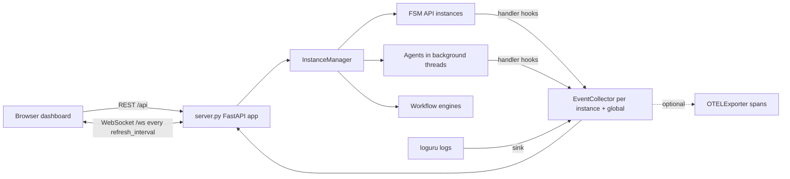

# fsm_llm_monitor

A web dashboard for FSM-LLM. It lets you launch, watch, and talk to FSM chatbots, agents, and workflows from a browser, and it can also export events to OpenTelemetry.

## What it is for

FSM-LLM is a Python framework that builds chatbots as finite state machines (FSMs: a fixed set of named states plus rules for moving between them), with a large language model (LLM) doing the talking and the data extraction. When such a bot runs, a lot happens out of sight: which state it is in, what data it pulled from each message, why it moved to another state, what went wrong. This package makes that visible. It runs a small web server with a single-page dashboard that shows live counters, events, logs, and conversation details, and lets you start new FSMs, agents, and demo workflows with a few clicks.

It is part of the `fsm-llm` distribution and is installed with the `monitor` extra.

## How it works



1. `fsm-llm-monitor` starts a FastAPI server (default `http://127.0.0.1:8420`) and opens your browser.
2. The server keeps one `InstanceManager`. It creates FSM instances (from example presets or pasted JSON), agents (run in background threads with stub tools), and two small demo workflows.
3. Every instance gets observer hooks. They record events (conversation start and end, state transitions, errors, and so on) into a per-instance `EventCollector` and a global one. All loguru log output is also captured.
4. The browser calls REST endpoints for actions and details, and holds a WebSocket open. Every `refresh_interval` seconds (1 by default) the server pushes metrics, new events, new logs, the instance list, and progress for running agents and workflows.

## Files

- `__main__.py` - the `fsm-llm-monitor` command: parses `--host`, `--port`, `--no-browser`, `--version`, `--info`, then runs uvicorn.
- `server.py` - FastAPI app: HTML page, REST API, WebSocket, optional API key check, meta-builder chat sessions.
- `instance_manager.py` - creates, runs, queries, and destroys FSM, agent, and workflow instances.
- `collector.py` - `EventCollector`: thread-safe bounded store of events and logs, metric counters, handler callbacks.
- `bridge.py` - `MonitorBridge`: attach the monitor to an `API` object you already have; also turns FSM JSON into display snapshots.
- `otel.py` - `OTELExporter`: mirrors collector events as OpenTelemetry spans.
- `definitions.py` - Pydantic models for events, logs, metrics, snapshots, config, and request bodies.
- `constants.py` - event type names, defaults, theme color constants, handler name and priority.
- `exceptions.py` - `MonitorError` and its subclasses.
- `__init__.py`, `__version__.py`, `py.typed` - public exports, version (shared with `fsm_llm`), type marker.
- `static/` - the browser app: JavaScript modules, stylesheet, and hand-drawn agent and workflow graphs (`flows.json`).
- `templates/index.html` - the single HTML page. It holds the markup for every screen and loads `static/app.js`.

## How to use it

Run the dashboard:

```bash
pip install "fsm-llm[monitor]"
fsm-llm-monitor                       # opens http://127.0.0.1:8420
fsm-llm-monitor --port 9000 --no-browser
```

Watch an `API` object from your own program:

```python
import uvicorn
from fsm_llm import API
from fsm_llm_monitor import MonitorBridge, app, configure

api = API.from_file("examples/basic/simple_greeting/fsm.json", model="ollama_chat/qwen3.5:4b")
configure(bridge=MonitorBridge(api=api))
uvicorn.run(app, host="127.0.0.1", port=8420)
```

Export events to OpenTelemetry (needs the `otel` extra):

```python
from fsm_llm_monitor import EventCollector, OTELExporter

collector = EventCollector()
otel = OTELExporter(service_name="my-bot")   # prints spans to the console by default
otel.enable(collector)
```

Require an API key for every endpoint that changes something:

```bash
FSM_LLM_MONITOR_API_KEY=secret fsm-llm-monitor
# clients send:  Authorization: Bearer secret   or   X-API-Key: secret
```

## Things to know

- Importing `fsm_llm_monitor` needs `fastapi`, `uvicorn`, and `jinja2`. `OTELExporter` needs the `otel` extra only when you create one.
- FSM presets are read from the repository's `examples/` folder. In an installed wheel without that folder, the preset list is empty.
- Only seven agent types can be launched from the dashboard: ReAct, Reflexion, Plan-Execute, REWOO, ADaPT, Debate, and Self-Consistency. The first five need at least one tool. Tools are stubs that return a fixed text you type in.
- Workflows are limited to two built-in demos (`demo_linear`, `demo_branching`). Pasted workflow JSON is rejected.
- Cancelling an agent sets a flag, but an agent run cannot be interrupted mid-flight. Destroying it waits 1.5 seconds and then leaves the thread running.
- With an API key set, the WebSocket and the read-only GET routes stay open.
- CORS allows only `localhost` and `127.0.0.1` by default.
- Conversation context keys that look internal or secret (prefixes `_`, `system_`, `internal_`, `__`) are hidden unless `show_internal_keys` is turned on in Settings.
