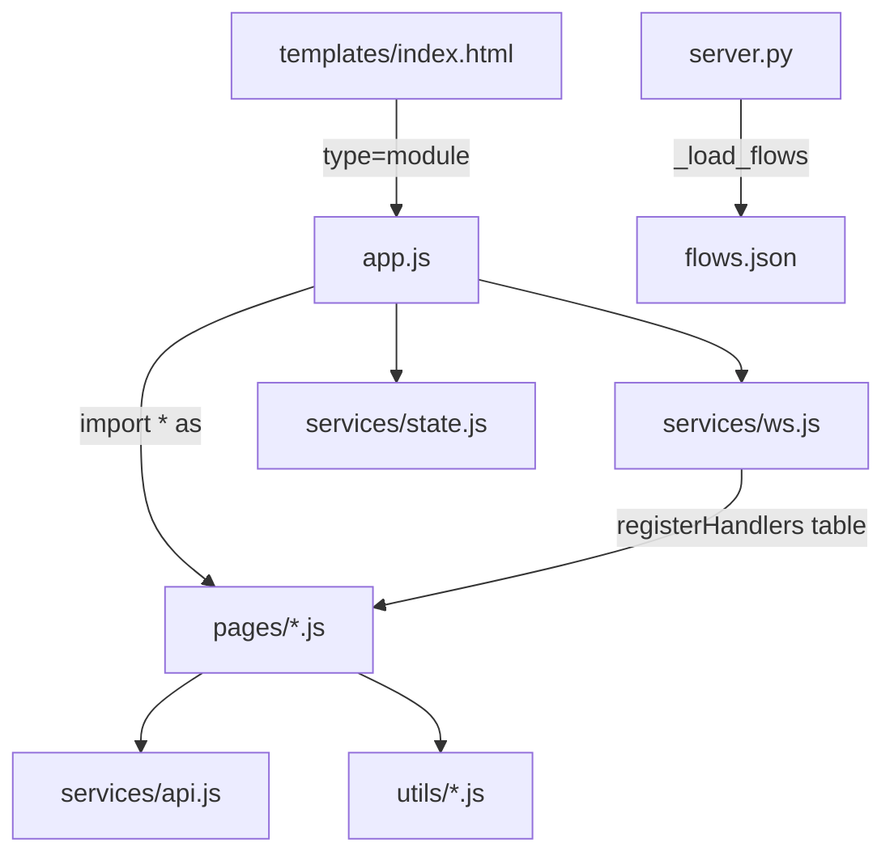

# static

Path: `src/fsm_llm_monitor/static`
Purpose: Framework-free browser frontend of the FSM-LLM Monitor dashboard (JS ES modules, one CSS file, pattern graph data).

## Scope

Everything served under `/static/` by `src/fsm_llm_monitor/server.py` (`app.mount("/static", StaticFiles(directory=STATIC_DIR))`). The HTML shell is `src/fsm_llm_monitor/templates/index.html` (Jinja2 template, not in this folder). No bundler, no npm, no transpile. Shipped in the wheel via `pyproject.toml` package-data `fsm_llm_monitor = ["py.typed", "static/*", "templates/*"]`.

## Architecture

Layering rule: `utils/` imports nothing outside `utils/`; `services/` imports `utils/`; `pages/` import `services/`, `utils/`, and a few sibling pages; `app.js` imports everything. Pages never import `app.js`; `app.js` injects `showPage`, `refreshInstances`, `showConversationInDrawer`, `refreshActivityTable`, `refreshDetailPanel` via `setDeps`/`setNavigateToInstance`.

## Key files

| File | Role | Notes |
| --- | --- | --- |
| `app.js` | Boot, navigation, delegation | `VALID_PAGES = dashboard, control, visualizer, logs, builder, settings` |
| `style.css` | Theme and components | Design tokens on `:root` (`--bg`, `--surface`, `--primary`, `--primary-dim`, `--success`, `--warning`, `--danger`, `--info`, `--cyan`, `--yellow`, `--text*`, `--space-*`, `--radius-*`, `--shadow-*`, `--font-body`, `--font-mono`) |
| `flows.json` | Pattern graphs | `{agents: {<AgentClass>: {description, nodes[], edges[]}}, workflows: {<id>: {...}}}` |
| `pages/` | Screen modules | dashboard, control, conversations, launch, visualizer, builder, logs, settings |
| `services/` | `api.js`, `state.js`, `ws.js` | REST, Proxy state, WebSocket with 3 s to 30 s backoff |
| `utils/` | `dom.js`, `format.js`, `markdown.js`, `graph.js` | `esc()`, formatting, safe Markdown subset, BFS SVG layout |

## app.js behavior

- `showPage(page)`: toggles `.page.active`, sidebar and mobile nav `active`, sets `state.currentPage`, `history.replaceState` to `#page`, closes the drawer when leaving `control`, then runs the page refresher: dashboard -> `loadDashboardConfig`, logs -> `refreshLogs`, settings -> `loadSettings`, control -> `refreshControlCenter`; visualizer re-renders the active agent or workflow tab.
- Click delegation: one `document` `click` listener; finds `closest('[data-action]')`, stops propagation when nested inside another `[data-action]` (buttons inside clickable rows), and calls `ACTIONS[action](el, event)`. No inline `onclick` anywhere.
- `input` delegation by element id: `inst-search`, `activity-search`, `ctrl-search`, `log-filter`. `change` delegation: `viz-preset-select`, `viz-agent-type`, `viz-wf-type`, `launch-agent-type`, `launch-fsm-source`.
- Keys: Enter (no Shift) sends in `conv-message-input` and `builder-message-input`, refreshes logs in `log-filter`. Outside inputs: `1`..`6` pages, `?` toggles `#shortcuts-overlay`, `Escape` closes overlay, launch modal, and drawer.
- Boot: `connectWS()`, `settings.loadSettings()`, `dashboard.loadDashboardConfig()`, `dashboard.refreshInstances()`, `visualizer.initVizDivider()`, 1 s clock (`#clock`, `#footer-clock`), `navigateFromHash()`.
- Poll every 10 s: on dashboard or control, `refreshInstances()` (plus `refreshControlCenter()` on control); on logs, `refreshLogs()`.

## flows.json

- Agents: `ReactAgent`, `ReflexionAgent`, `PlanExecuteAgent`, `DebateAgent`, `SelfConsistencyAgent`, `REWOOAgent`, `PromptChainAgent`, `EvaluatorOptimizerAgent`, `MakerCheckerAgent`, `OrchestratorAgent`, `ADaPTAgent`, `ReasoningReactAgent`.
- Workflows: `order_processing`, `data_pipeline`, `approval_flow`, `parallel_processing`, `timer_wait`.
- Node: `{id, label, description, is_initial, is_terminal}` (workflow nodes may carry `step_type`). Edge: `{from, to, label}`. Served by the pattern-visualization endpoints in `server.py` (`/api/agent/visualize`, `/api/workflow/visualize`).
- Hand-maintained. Not derived from `src/fsm_llm_agents` or `src/fsm_llm_workflows`; update by hand when an agent's state graph changes.

## Invariants and constraints

- XSS: build HTML with `esc()` on every interpolated value; Markdown only via `utils/markdown.js renderMarkdown` (escapes first).
- Element ids and `data-action` names are a contract between `templates/index.html`, `app.js`, and `pages/`. Renaming one side silently breaks the feature (lookups are null-guarded).
- The server adds no-cache headers for `/static/` paths (`no_cache_static` middleware), so there is no cache-busting in file names.
- WebSocket endpoint is `/ws` on the same host; REST is `/api/...`. Error bodies carry `detail`.

## Dependencies

- Browser only: ES modules, `fetch`, `WebSocket`, `Proxy`, `EventTarget`, Clipboard API.
- External: Google Fonts (`Inter` 400/500/600/700, `JetBrains Mono` 400) via `@font-face` URLs in `style.css`, `font-display: swap`.
- Server side: `fastapi.staticfiles.StaticFiles`, Jinja2 template, `flows.json` read by `server.py`.

## Failure modes

- Server unreachable: WebSocket status shows "Reconnecting..." with a blinking label; REST calls show toasts.
- Unknown `data-action`: ignored silently.
- Invalid hash: `navigateFromHash` ignores hashes not in `VALID_PAGES`.

## Working here

- New page: add `<section id="page-<name>" class="page">` and a sidebar button with `data-action="show-page" data-page="<name>"` in `templates/index.html`, a module in `pages/`, the import and `VALID_PAGES` entry and refresh hook in `app.js`, and a number key if wanted.
- New action: emit `data-action` in markup, add to `ACTIONS` in `app.js`.
- New live push: add the field in `server.py` broadcast, a branch in `services/ws.js`, and a handler in the `registerHandlers` call in `app.js`.
- Styling: reuse `:root` tokens in `style.css`; do not hardcode colors in JS except the existing inline fallbacks.
- Tests: `tests/test_fsm_llm_monitor/` exercises the Python server and static serving; no JS unit tests. Verify by running `fsm-llm-monitor` and using the page.
