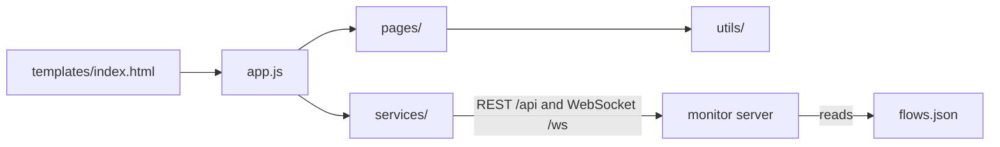

# static

The browser half of the FSM-LLM Monitor: all JavaScript, the stylesheet, and the graph data the dashboard shows. There is no build step; the monitor server hands these files to the browser as they are.

## What it is for

The FSM-LLM Monitor (`fsm-llm-monitor`) is a web dashboard for the FSM-LLM framework. FSM-LLM builds chatbots as finite state machines (FSMs: a set of named states and rules for moving between them) driven by a large language model. From the dashboard you can launch FSM conversations, agents, and workflows, chat with them, watch events and logs live, draw their state graphs, and design new ones with an AI builder. This folder is everything that runs in the browser to make that work. It is plain JavaScript using ES modules, with no framework.

## How it works



1. The server returns one HTML page. It loads `app.js` as a module.
2. `app.js` opens the WebSocket, loads settings and instances, and wires page modules together.
3. Every click on an element with a `data-action` attribute goes to one central handler in `app.js`, which calls the right page function.
4. Pages fetch data from the REST API and write HTML into the page. Live pushes (metrics, events, logs, instance changes) arrive over the WebSocket.
5. `flows.json` is not loaded by the browser directly. The server reads it to answer "draw this agent or workflow pattern" requests.

## Files and folders

- `app.js` - entry point: navigation, click and input routing, keyboard shortcuts, boot sequence, 10-second polling.
- `style.css` - the whole dark theme: color, spacing, and font tokens, layout, and every component style.
- `flows.json` - hand-written graphs of 12 agent patterns and 5 workflow examples for the Visualizer.
- `pages/` - one module per screen: dashboard, control center, conversations, launch modal, visualizer, builder, logs, settings.
- `services/` - REST helper, shared reactive state, WebSocket connection with automatic reconnect.
- `utils/` - HTML escaping and UI feedback, formatting, a small safe Markdown renderer, SVG graph layout.

## How to use it

```bash
pip install "fsm-llm[monitor]"
fsm-llm-monitor
# open http://127.0.0.1:8420
```

Keyboard shortcuts (when not typing in a field): `1` Dashboard, `2` Control Center, `3` Visualizer, `4` Logs, `5` Builder, `6` Settings, `?` show shortcuts, `Esc` close the modal and drawer. The current page is kept in the URL hash, for example `#logs`.

## Things to know

- Fonts come from Google Fonts. Offline, the browser falls back to system fonts.
- The server sends no-cache headers for everything under `/static/`, so a normal reload picks up edits.
- All HTML is built as strings. Every value from the server or the user is escaped before it is inserted.
- The agent and workflow graphs in `flows.json` are drawn by hand. They are not generated from the real agent code, so they can drift from it.
