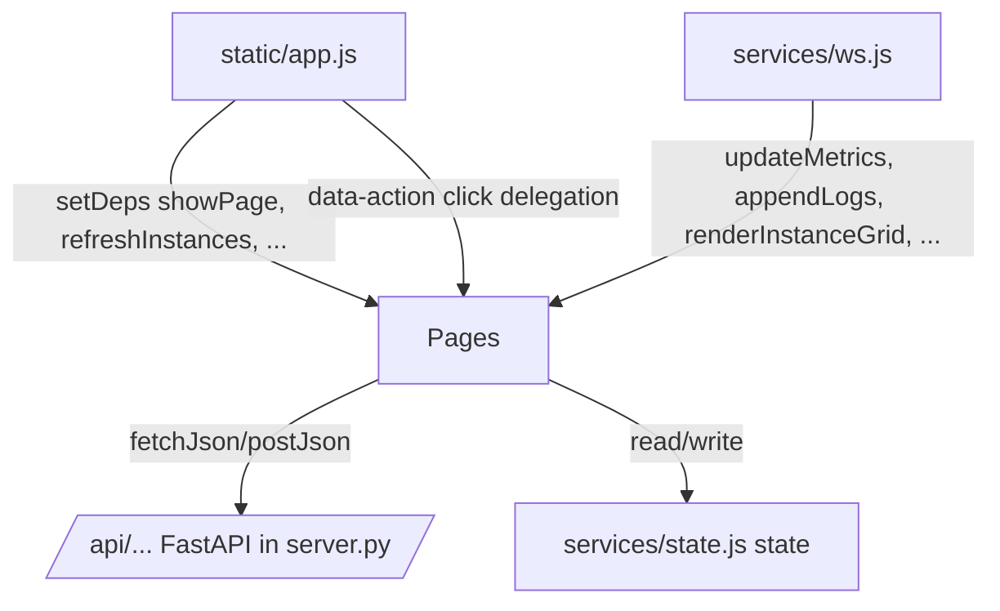

# pages

Path: `src/fsm_llm_monitor/static/pages`
Purpose: Page-level ES modules of the FSM-LLM Monitor frontend; each renders one screen and calls the monitor REST API.

## Scope

Rendering and user actions for Dashboard, Control Center (with drawer), Conversations (drawer sub-view), Launch modal, Visualizer, Builder, Logs, Settings. Not here: routing, click delegation, and dependency wiring (`static/app.js`); HTTP/state/WebSocket (`static/services/`); escaping, formatting, graph drawing (`static/utils/`); markup (`templates/index.html`); styles (`static/style.css`).

## Architecture

- Circular imports between pages are avoided by forward references: `builder.js`, `control.js`, `conversations.js`, `launch.js` export `setDeps(deps)`; `dashboard.js` exports `setNavigateToInstance(fn)`.
- Page-local state lives in module-level `let` variables (pagination, filters, hashes, builder session). Cross-page state lives on `state`.
- Buttons in generated HTML use `data-action="..."` attributes; `app.js` maps them to the exported functions. Actions emitted here: `open-drawer`, `start-conv`, `cancel-agent`, `destroy-instance`, `ctrl-page-prev/next`, `go-to-conv`, `advance-workflow`, `cancel-workflow`, `expand-all-trace`, `collapse-all-trace`, `toggle-trace-step`, `navigate-instance`, `inst-page-prev/next`, `activity-row-click`, `activity-page-prev/next`, `clear-dashboard-config`, `filter-presets`, `select-preset`, `remove-stub-tool`, `copy-context`.

## Key files

| File | Role | Notes |
| --- | --- | --- |
| `dashboard.js` | Metrics, event feed (max 50), instance grid (12/page), activity table (20/page), custom panels | Exports `refreshInstances` used by `control.js` |
| `control.js` | Unified table (25/page), drawer, per-type detail, agent trace | Polls drawer every 2 s via `state.detailPollTimer` |
| `conversations.js` | Conversation detail + chat in drawer | `_detailRequestId` drops stale responses |
| `launch.js` | Launch modal | `TOOL_TEMPLATES` (15 stub tools) |
| `visualizer.js` | Graph rendering for fsm/agent/workflow | Uses `utils/graph.js renderGraph` |
| `builder.js` | Meta-builder chat and launch | `AGENT_TYPE_MAP` lowercase -> class name |
| `logs.js` | Log stream | Buffer cap 5000, DOM cap 1000 |
| `settings.js` | Config form | Defaults 1.0 s / 1000 / 5000 / INFO |

## Public interface

Exports called by `app.js` or `ws.js` (grouped by file):

- `dashboard.js`: `loadDashboardConfig`, `clearDashboardConfig`, `updateMetrics(m)`, `updateEvents(events)`, `renderInstanceGrid`, `instPagePrev/Next`, `onInstSearchInput`, `refreshInstances`, `toggleActivityEnded`, `onActivitySearchInput`, `activityPagePrev/Next`, `refreshActivityTable`, `navigateToInstance` (let binding), `setNavigateToInstance`.
- `control.js`: `setDeps({showPage})`, `filterControlInstances(filter, btn)`, `onCtrlSearchInput`, `refreshControlCenter`, `renderUnifiedTable`, `ctrlPagePrev/Next`, `openDrawer(id, type)`, `closeDrawer`, `navigateToInstance(id, type)`, `refreshDetailPanel(id, type)`, `advanceWorkflow(id, wfId)`, `cancelWorkflow(id, wfId)`, `toggleAllTraceSteps(expand)`, `updateRunningAgents(updates)`, `startConversationOn(id)`, `destroyInstance(id)`, `cancelAgent(id)`.
- `conversations.js`: `setDeps({showPage, refreshActivityTable, refreshDetailPanel})`, `showConversationInDrawer(instanceId, convId)`, `drawerBack`, `showConversationDetail(convId)`, `copyContextData`, `sendChatMessage`, `addTypingIndicator(el)`, `removeTypingIndicator()`.
- `launch.js`: `setDeps({showPage, refreshInstances, showConversationInDrawer})`, `showLaunchModal`, `closeLaunchModal`, `toggleLaunchFSMSource`, `renderLaunchPresets`, `filterPresets(cat)`, `selectPreset(card)`, `doLaunchFSM(btn)`, `doLaunchWorkflow(btn)`, `populateToolTemplates`, `addToolFromTemplate`, `addStubTool`, `onAgentTypeChange`, `doLaunchAgent(btn)`.
- `visualizer.js`: `visualizeGraph(type, typeValue)`, `visualizeFSM`, `switchVizDetail(tab, btn)`, `loadFSMPresets`, `useFSMPreset(id)`, `initVizDivider`.
- `builder.js`: `setDeps({showPage, refreshInstances})`, `builderJumpToLatest`, `onBuilderScroll`, `startBuilderSession`, `sendBuilderMessage`, `copyBuilderResult`, `downloadBuilderResult`, `launchBuilderResult`, `resetBuilder`.
- `logs.js`: `toggleLogPill(btn)`, `onLogSearchInput`, `updateJumpButton`, `logJumpToLatest`, `onLogScroll`, `toggleLogPause`, `clearLogs`, `appendLogs(logs)`, `updateLogErrorBadge(metrics)`, `refreshLogs`.
- `settings.js`: `loadSettings`, `saveSettings`, `resetSettings`.

## REST endpoints used

| Method + path | Caller |
| --- | --- |
| GET `/api/instances`, DELETE `/api/instances/{id}`, GET `/api/instances/{id}/events?limit=100` | dashboard, control |
| GET `/api/activity` | dashboard |
| GET/DELETE `/api/dashboard/config` | dashboard |
| POST `/api/fsm/launch`, POST `/api/fsm/{id}/start`, POST `/api/fsm/{id}/converse`, GET `/api/fsm/{id}/conversations` | launch, builder, control, conversations |
| GET `/api/conversations/{convId}` | conversations |
| GET `/api/workflow/presets`, POST `/api/workflow/launch`, GET `/api/workflow/{id}/instances`, POST `/api/workflow/{id}/advance`, POST `/api/workflow/{id}/cancel` | launch, builder, control |
| POST `/api/agent/launch`, GET `/api/agent/{id}/status`, GET `/api/agent/{id}/result`, POST `/api/agent/{id}/cancel` | launch, builder, control |
| GET `/api/capabilities`, GET `/api/presets`, GET `/api/preset/fsm/{id}` | launch, visualizer |
| POST `/api/fsm/visualize`, GET `/api/fsm/visualize/preset/{id}`, GET `/api/agent/visualize?agent_type=`, GET `/api/workflow/visualize?workflow_id=` | visualizer, builder |
| POST `/api/builder/start`, POST `/api/builder/send`, DELETE `/api/builder/{sessionId}` | builder |
| GET `/api/logs?limit=500&level=`, GET/POST `/api/config`, GET `/api/info` | logs, settings |

## Data shapes

- Instance (from `/api/instances`): `instance_id`, `instance_type` (`fsm|workflow|agent`), `label`, `status`, `source`, `conversation_count`, `agent_type`, `task`, `active_workflows`, `created_at`.
- Activity row: `item_type` (`fsm_conversation|agent_task|workflow_instance`), `item_id`, `instance_id`, `label`, `current_step`, `detail`, `status`, `is_terminal`.
- Agent status: `status`, `agent_type`, `task`, `iteration_count`, `max_iterations`, `current_state`, `last_tool_call`, `conversation_log[]` (entries `type: start|transition|context|error|end`), `answer`, `error`, `tools_used[]`, `success`, `total_iterations`. Agent result: `trace_steps[]` with `state`, `tool_name`, `reasoning`, `tool_input`, `tool_result`.
- Builder responses: `session_id`, `response`, `internal_state` (`phase|current_state`, `turn_count`, `artifact_type`, `builder_progress{percentage, missing}`, `builder_summary`, `requirements|context`, `artifact_preview`), `is_complete`, `artifact`, `artifact_json`, `artifact_type` (`fsm|workflow|agent`), `is_valid`, `validation_errors`, `error`.
- Custom dashboard config: `name`, `description`, `panels[{panel_id, title, metric, description}]`, `alerts[{alert_id, metric, condition (> < >= <= == !=), threshold, description}]`. Metric lookup order: top-level metrics field, then `events_per_type`, then `states_visited`.

## Invariants and constraints

- Escape every interpolated value with `esc()`; user text in chat bubbles is escaped, assistant text goes through `renderMarkdown` (which escapes first).
- Change detection: `renderUnifiedTable` and `renderInstanceGrid` skip re-render when `hashInstances` (over `instance_id:status` only) is unchanged. Changing only `conversation_count` or `label` does not re-render until a filter/page change resets the hash.
- `closeDrawer` must clear `state.detailPollTimer`; `openDrawer` replaces any existing timer.
- Agent event view (`_enrichAgentEvents`) maps FSM events to agent terms: transition to `think` -> iteration, to `act` -> tool call, to `conclude` -> final answer; pre/post processing events are dropped.
- Builder agent launch is two-click: first shows the stub-tool form, second submits. `TOOL_BASED_AGENTS` types require at least one tool.
- Launch FSM also starts one conversation and opens it in the drawer.

## Dependencies

- `../services/api.js` (`fetchJson`, `postJson`), `../services/state.js` (`state`, `scheduleRefresh`, `TOOL_BASED_AGENTS`).
- `../utils/dom.js`, `../utils/format.js`, `../utils/markdown.js`, `../utils/graph.js`.
- Element ids from `templates/index.html` (for example `ctrl-drawer`, `conv-detail`, `builder-chat`, `log-stream`, `viz-svg`). Renaming an id there breaks the page silently because lookups are null-guarded.

## Failure modes

- REST failures surface as toasts (`showToast`) or inline `showError`/`showStatus`; they are also logged to `console.error`.
- Missing DOM elements are mostly guarded and skipped; `builder.js _renderInternalState` warns to hard-refresh when its container is missing.
- Conversation detail races are dropped via a request counter; drawer events use a length+timestamp hash to skip redraws.

## Working here

- New page: create `<name>.js` here, export render and action functions, add markup in `templates/index.html`, register routing and `data-action` handlers in `static/app.js`, and register WebSocket handlers via `registerHandlers` if it needs pushes.
- New action button: emit `data-action="<name>"` plus `data-*` args in HTML and add the case in `app.js` delegation.
- New REST call: add the endpoint in `src/fsm_llm_monitor/server.py` first; keep `detail` in error bodies.
- Tests: `tests/test_fsm_llm_monitor/` covers the Python server; there are no JS unit tests. Verify manually with `fsm-llm-monitor`.
