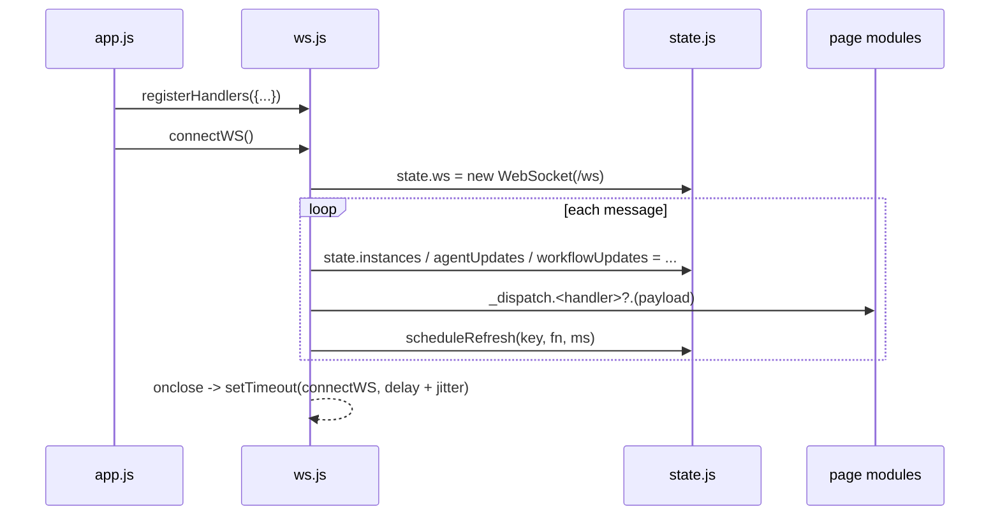

# services

Path: `src/fsm_llm_monitor/static/services`
Purpose: Frontend infrastructure for the FSM-LLM Monitor dashboard: REST client, shared reactive state, WebSocket manager.

## Scope

Three ES modules loaded by the browser. No build step, no framework, no npm. Served as static files by the `fsm_llm_monitor` FastAPI server under `/static/`. Page rendering lives in `static/pages/*.js`; DOM helpers in `static/utils/*.js`. This folder must not render page content beyond the WebSocket status indicator.

## Architecture

## Key files

| File | Role | Notes |
| --- | --- | --- |
| `api.js` | fetch wrapper | Throws `Error(body.detail ?? statusText)` on non-OK |
| `state.js` | Proxy-backed state + event bus | `EventTarget` bus, event name `statechange` |
| `ws.js` | WebSocket lifecycle + dispatch | Imports `hashInstances`, `$` from `../utils/dom.js` |

## Public interface

`api.js`
- `fetchJson(url: string, opts?: RequestInit): Promise<any>` - parses JSON; on `!resp.ok` tries `resp.json()`, throws `Error(detail)`.
- `postJson(url: string, data: any): Promise<any>` - POST with `Content-Type: application/json`.

`state.js`
- `state` - Proxy over `_target`. `set` trap dispatches `CustomEvent('statechange', {detail: {prop, value, old}})` when `old !== value`.
- `onChange(fn: ({prop, value, old}) => void): () => void` - returns unsubscribe.
- `scheduleRefresh(key: string, fn: () => void, delayMs: number)` - no-op if `state.refreshTimers[key]` is set; clears the key before calling `fn`.
- `WS_MAX_DELAY = 30000`.
- `TOOL_BASED_AGENTS = ['ReactAgent', 'ReflexionAgent', 'PlanExecuteAgent', 'REWOOAgent', 'ADaPTAgent']` - agent types whose launch requires at least one tool (used by `pages/launch.js`, `pages/builder.js`).

`ws.js`
- `registerHandlers(handlers: object)` - shallow-merges into the dispatch table.
- `connectWS()` - opens `ws(s)://<location.host>/ws`.

## Data shapes

Initial `state` fields: `ws`, `currentPage` (`'dashboard'`), `presets`, `wsRetryDelay` (3000), `capabilities` (`{fsm: true, workflows: false, agents: false}`), `instances` (`[]`), `selectedConvId`, `selectedConvInstanceId`, `selectedDetailId`, `selectedDetailType`, `detailPollTimer`, `agentUpdates`, `workflowUpdates`, `refreshTimers`, `stubToolCount`, `_lastContextData`. Pages also add fields ad hoc (for example `state.workflowPresets` in `pages/launch.js`).

WebSocket message fields consumed (any subset may be present in one message):

| Field | Action |
| --- | --- |
| `type === 'metrics'` + `data` | `updateMetrics(data)`, `updateLogErrorBadge(data)` |
| `events` | `updateEvents(events)`; activity-type events schedule refreshes |
| `instances` | if `hashInstances` changed: set `state.instances`, `renderInstanceGrid()`, and `renderUnifiedTable()` on the control page |
| `agent_updates` | set `state.agentUpdates`, `updateRunningAgents(updates)` |
| `workflow_updates` | set `state.workflowUpdates`; refresh activity table (dashboard, 3 s) or workflow detail (control, 2 s) |
| `logs` (non-empty) | `appendLogs(logs)` |
| `dashboard_config` | `dashboardConfigChanged(cfg)` |

Activity event types that trigger refreshes: `conversation_start`, `conversation_end`, `state_transition`, `post_processing`, `agent_started`, `agent_completed`, `agent_failed`, `workflow_started`, `workflow_completed`, `workflow_cancelled`.

Dispatch handler names: `updateMetrics`, `updateEvents`, `renderInstanceGrid`, `renderUnifiedTable`, `updateRunningAgents`, `refreshActivityTable`, `refreshDetailPanel`, `appendLogs`, `updateLogErrorBadge`, `dashboardConfigChanged`, `showConversationDetail`. All are called with optional chaining, so a missing handler is silently skipped.

## Invariants and constraints

- Only one live socket: `connectWS` nulls `onopen/onmessage/onclose/onerror` on the previous `state.ws` before replacing it.
- Backoff: `setTimeout(connectWS, wsRetryDelay + random*1000)`, then `wsRetryDelay = min(2x, WS_MAX_DELAY)`. `onopen` resets to 3000. `onerror` calls `close()`, which triggers `onclose`.
- `onopen/onclose` update `#ws-status` text and class and toggle `connected` on `#ws-dot`, guarded for missing elements.
- Message parse errors are caught and logged to `console.error`; one bad message does not kill the socket.
- The Proxy only intercepts top-level assignment. Nested mutation does not emit events.

## Dependencies

- `../utils/dom.js`: `hashInstances(items)` (hash over `instance_id:status`), `$` (getElementById).
- Browser APIs only: `fetch`, `WebSocket`, `EventTarget`, `CustomEvent`, `Proxy`.

## Failure modes

- Server error: `fetchJson` throws; callers show a toast or inline error.
- Non-JSON 2xx body: `resp.json()` rejects with a `SyntaxError`.
- Server down: socket keeps reconnecting up to every ~31 s indefinitely.

## Working here

- New WebSocket payload field: add a branch in `ws.js onmessage`, call `_dispatch.<name>?.(...)`, and register the handler in `static/app.js`.
- New shared state: add the field with its default to `_target` in `state.js` so it is discoverable.
- Keep the `detail` error convention: the Python server raises `HTTPException(detail=...)`.
- No automated JS tests exist for these files. Verify manually by running `fsm-llm-monitor` and watching the browser console.
