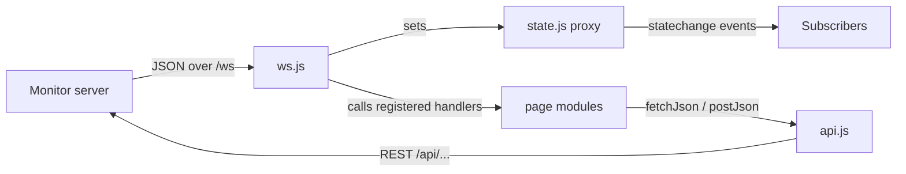

# services

Browser-side plumbing for the FSM-LLM Monitor web dashboard: the HTTP client, the shared page state, and the WebSocket connection to the monitor server.

## What it is for

The FSM-LLM Monitor is a web dashboard served by the `fsm_llm_monitor` Python package. Its frontend is plain JavaScript with ES modules and no framework. This folder holds the three modules every page relies on. They talk to the server (`fetch` for REST calls, one WebSocket for live pushes) and keep one shared state object so pages do not each track their own copy.

## How it works



- `api.js` wraps `fetch`. A non-2xx response throws an `Error` whose message is the server's `detail` field, or the HTTP status text.
- `state.js` exports one object wrapped in a JavaScript `Proxy`. Every assignment that changes a value fires a `statechange` event.
- `ws.js` opens a WebSocket to `/ws` on the same host. Each message is inspected field by field (metrics, events, instances, agent and workflow updates, logs, dashboard config) and forwarded to whichever page handler was registered for it. If the socket closes it reconnects with exponential backoff.

## Files

- `api.js` - `fetchJson(url, opts)` and `postJson(url, data)`.
- `state.js` - shared reactive `state`, `onChange(fn)`, `scheduleRefresh(key, fn, delayMs)`, and two constants.
- `ws.js` - `connectWS()` and `registerHandlers(handlers)`.

## How to use it

```js
import { fetchJson, postJson } from './services/api.js';
import { state, onChange } from './services/state.js';
import { connectWS, registerHandlers } from './services/ws.js';

registerHandlers({ updateMetrics: (m) => console.log(m.total_events) });
connectWS();

const instances = await fetchJson('/api/instances');
await postJson('/api/fsm/launch', { preset_id: 'basic/simple_greeting' });

const stop = onChange(({ prop, value }) => console.log(prop, value));
```

## Things to know

- Reconnect delay starts at 3 s, doubles on every close, is capped at 30 s, and has up to 1 s of random jitter. It resets to 3 s on a successful open.
- Before opening a new socket, `connectWS` detaches the old socket's handlers so a late `onclose` cannot start a second reconnect loop.
- `state` only fires an event when the new value is not strictly equal (`!==`) to the old one. Mutating a nested object in place (for example `state.refreshTimers[key] = ...`) does not fire an event.
- `scheduleRefresh` is a "run once after a delay" guard: a second call with the same key is ignored until the first one has fired.
