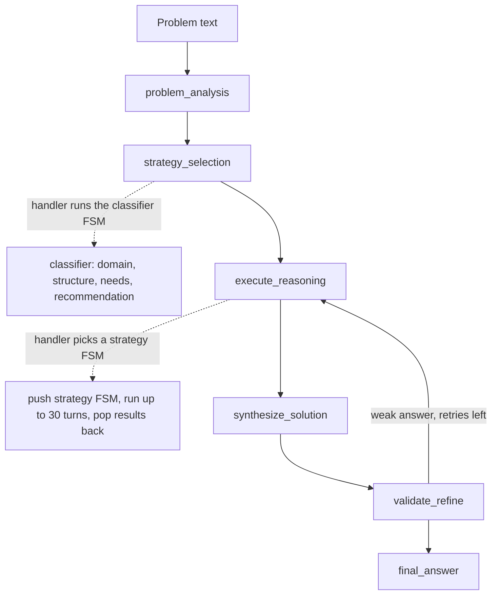

# fsm_llm_reasoning

A problem-solving engine built on FSM-LLM. It picks a reasoning style for a question (math, deduction, analogy, and so on), walks an LLM through that style step by step, checks the answer, and returns it with a trace of what happened.

## What it is for

Asking an LLM a hard question in one shot often gives a shallow or wrong answer. This package breaks the work into structured steps. FSM-LLM (the core `fsm_llm` package) runs conversations as finite state machines: fixed states with rules for moving between them. Here, each reasoning style is its own small state machine, and a top-level "orchestrator" machine analyses the problem, chooses a style, runs it, combines the result, and validates it, retrying up to three times if the answer looks weak. The result is a final answer plus a trace you can inspect.

## How it works



- The orchestrator is driven by sending it "Continue reasoning" messages until it reaches its final state (at most 50 rounds).
- When the orchestrator enters `execute_reasoning`, a handler chooses the strategy FSM. The engine pushes it on top of the orchestrator (FSM stacking), drives it, then pops it and copies its results back.
- A validator checks four things: there is an answer, there are key insights (not needed for plain arithmetic), the answer has enough detail, and it shares words with the question.

Nine strategies are available: `simple_calculator`, `analytical`, `deductive`, `inductive`, `abductive` (best explanation), `analogical`, `creative`, `critical`, and `hybrid`.

## Files

- `engine.py` - `ReasoningEngine`: sets up the orchestrator and classifier, registers handlers, runs the solve loop.
- `reasoning_modes.py` - all FSM definitions as Python dictionaries (orchestrator, classifier, nine strategies).
- `handlers.py` - answer validation, trace recording, context pruning, result merging, final answer extraction.
- `definitions.py` - Pydantic models for steps, traces, validation, classification, problems, and solutions.
- `constants.py` - reasoning types, state names, context key names, limits, and message text.
- `utilities.py` - load an FSM definition, map loose words like "math" to a strategy, list strategies.
- `exceptions.py` - error classes.
- `__main__.py` - command-line tool.
- `__init__.py`, `__version__.py`, `py.typed` - public exports, version, type marker.

## How to use it

```bash
pip install "fsm-llm[reasoning]"
python -m fsm_llm_reasoning "What is 15% of 240?"
python -m fsm_llm_reasoning "Why might sales drop in summer?" --type abductive --output detailed
python -m fsm_llm_reasoning --list-types
```

```python
from fsm_llm_reasoning import ReasoningEngine

engine = ReasoningEngine(model="ollama_chat/qwen3.5:9b-q8_0")
solution, trace = engine.solve_problem("If all cats are mammals and Tom is a cat, what is Tom?")
print(solution)
print(trace["summary"])
```

## Things to know

- One engine handles one problem at a time. Calls to `solve_problem` on the same engine wait for each other.
- Every step is an LLM call, so one problem can take dozens of calls. Small local models may loop until a limit stops them.
- `--type` (or `preferred_reasoning_type` in the starting context) overrides the classifier's choice.
- If a strategy FSM cannot be loaded, the engine falls back to `analytical` only, never to another style.
- Unknown words in `map_reasoning_type` fall back to `analytical` with a warning.
